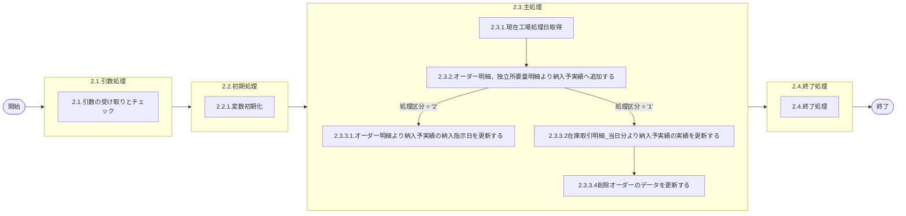

# 0. 表紙

| モジュール名 | プログラムID | プログラム名           |
| ------------ | ------------ | ---------------------- |
| IC           | LDAJ0023     | 納入予実績ファイル作成 |

| RFC | Version | 更新日     | 更新者 | 更新内容 | 確認日     | 確認者 | 承認日     | 承認者 |
| --- | :-----: | ---------- | :----: | -------- | ---------- | :----: | ---------- | :----: |
| -   |  1.0.0  | 2025/09/11 | 陳培煌 | 初版作成 | 2025/XX/XX |   XX   | 2025/XX/XX |   XX   |

## 1. 処理概要

### 1.1. 機能概要

①LDYS0007をコールしIC工場処理日を取得する
②オーダー明細、独立所要量明細より納入予実績へ追加する（処理区分が"1"の場合当日ハンド追加分、処理区分が"2"の場合今回MRP確定分）
重複データを削除してから追加
削除日が当日の場合は、削除日、削除理由をクリアしてオーダーステータスを"2"に変更する
③（処理区分が"2"の場合のみ当処理を実施）オーダー明細より納入予実績の納入指示日を更新する(MRP需要方針コードが"3"のデータのみ)
④（処理区分が"1"の場合のみ当処理を実施）在庫取引明細_当日分より納入予実績の実績を更新する
⑤（処理区分が"1"の場合のみ当処理を実施）削除オーダーのデータを更新する
ログ：共通の部品を用いる(lombok)

### 1.2. 処理概要フロー



### 1.3. プログラム入出力パラメータ

#### 1.3.1. 引数

| No. | パラメータ論理名 | パラメータ物理名 | 属性   | 識別 | 備考                                |
| --- | ---------------- | ---------------- | ------ | ---- | ----------------------------------- |
| 1   | 処理区分         | process_class    | String | arg1 | 1:LDBB0001(日次)、2:LDBB0002(MRP後) |

#### 1.3.2. 戻り値

| No. | パラメータ論理名 | パラメータ物理名 | 属性   | 備考            |
| --- | ---------------- | ---------------- | ------ | --------------- |
| 1   | リターンコード   | r_status         | String | 正常：0異常：-1 |

### 1.4. その他制御・要件

| 排他制御 |      |      |
| -------- | ---- | ---- |
| 楽観     | 悲観 | 無し |
| ●       | -    | -    |

| 項目               | 制約・制御・要件など | 記載内容説明                                                     |
| ------------------ | -------------------- | ---------------------------------------------------------------- |
| パフォーマンス要件 | 特になし。           | 特別なパフォーマンス要件がある場合に要件内容とその対処法を記述。 |

### 1.5. 入出力一覧

| No | 入出力対象 | 名称               | 物理名称                  | C  | R  | U  | D | 備考                      |
| -- | ---------- | ------------------ | ------------------------- | -- | -- | -- | - | ------------------------- |
| 1  | テーブル   | オーダー明細       | le_trn_order              | -  | ○ | -  | - | 旧テーブルic_order_trn    |
| 2  | テーブル   | 独立所要量明細     | le_trn_ird                | -  | ○ | -  | - | 旧テーブルic_order_trn    |
| 3  | テーブル   | 在庫取引明細当日分 | ld_trn_trans_day          | -  | ○ | -  | - | 旧テーブルic_trans_day    |
| 4  | テーブル   | MRP情報値          | le_mst_mrp_information    | -  | ○ | -  | - | 旧テーブルde_itemmast_mrp |
| 5  | テーブル   | 納入予実績         | ld_trn_dlv_pre_record_day | ○ | ○ | ○ | - | 旧テーブルic_od_pr_day    |
| 6  | テーブル   | 確定期間           | le_mst_fix_period         | -  | ○ | -  | - | 旧テーブルmrp_fix_period  |
| 7  | テーブル   | 品目マスタ         | la_itemmast               | -  | ○ | -  | - | 旧テーブルde_itemmast     |
| 8  | テーブル   | SU情報             | la_area_master_su         | -  | ○ | -  | - | 旧テーブルcon_orgmast_su  |
| 9  | テーブル   | リテラル防止要素   | lz_anti_literal_element   | -  | ○ | -  | - | 現行：ic_fix_val          |
| 10 | 共通関数   | 現在工場処理日取得 | LDYS0007                  |    |    |    |   |                           |

## 2. 詳細処理

### 2.1. 引数の受け取りとチェック

- 引数.処理区分が'1':LDBB0001(日次)、'2':LDBB0002(MRP後)以外の場合、エラーログを出力し、異常終了する。

### 2.2. 初期処理

#### 2.2.1. 変数初期化

利用する変数を初期化する。

- 処理区分="1"の場合
  変数.オーダー発行区分 = '2'
- 処理区分="2"の場合
  変数.オーダー発行区分 = '1'

### 2.3. 主処理

#### 2.3.1. 現在工場処理日取得

- 共通関数LDYS0007をコールし、IC工場処理日を取得する。
- 取得できない場合、エラーログを出力し、異常終了する。
- 取得したIC工場処理日を変数.IC工場処理日にセットする。

#### 2.3.2. オーダー明細、独立所要量明細より納入予実績へ追加する

- 確定期間テーブルから確定実施日を取得,最新の確定実施日を変数.確定実施日にセットする。

```sql
    SELECT 確定実施日
      FROM 確定期間
     WHERE 確定ステータス = 'L'
  ORDER BY 確定実施日 DESC
      LIMIT 1
```

##### 2.3.2.1 オーダー明細より納入予実績へ追加する

- 以下の条件でデータをオーダー明細リストに格納する。

```sql
     SELECT a.品目番号
           ,A.供給者
           ,A.使用者
           ,A.オーダー番号
           ,A.完了日 AS オリジナル納入指示日
           ,B.品目ステータス
           ,C.工程番号
           ,A.MRP需要方針コード
           ,A.シフト分割数
           ,A.シフトパターン番号
           ,C.荷姿コード
           ,C.荷姿収容数
           ,CASE WHEN C.納入PF番号 <> '' THEN '1' ELSE '' END AS 納入PF／送り先区分
           ,A.納入PF番号 AS 納入PF／送り先コード
           ,A.生試初品区分
           ,A.完了日     AS 納入指示日
           ,A.完了開始時間
           ,A.完了終了時間
           ,A.オーダー数 AS 納入指示数
           ,A.供給者     AS 納入キー
           ,A.使用者     AS 受入キー
           ,A.登録者     AS 計画登録者
           ,A.理由コード
       FROM オーダー明細 A
 INNER JOIN 品目マスタ B
         ON A.品目番号　　　　　　　= B.品目番号
        AND A.供給者　　　　　　　　= B.供給者
        AND A.使用者　　　　　　　　= B.使用者
        AND B.品目タイプ　　　　　　= '1'　-- 1:標準
        AND B.品目クラス　　　　　　<> '1'　-- 1:原材料
 INNER JOIN MRP情報値 C
         ON A.品目番号　　　　　　　= C.品目番号
        AND A.供給者　　　　　　　　= C.供給者
        AND A.使用者　　　　　　　　= C.使用者
        AND C.MRP需要方針コード　　 <> '1'　-- 1:生産計画品目
        AND ((C.Wピン管理コード　　 = '0' AND A.シフト分割数 > 0)
              OR (C.Wピン管理コード = '0' AND A.生試初品区分 = '2') -- 2:生試
              OR  C.シンクロ管理    = '1')　-- 0：Wピン管理対象外
      WHERE A.供給者　　　　　　　　<>　A.使用者
        AND A.オーダーステータス　　=　'2'　-- 2：確定
    -- 引数.処理区分が"2"の場合、以下の条件を追加する
      AND A.オーダー確定日 　　　　= 変数.確定実施日
      AND A.MRP更新日 　　　　　　 = 変数.確定実施日
    -- 引数.処理区分が"1"の場合、以下の条件を追加する
      AND A.オーダー確定日　　　　　= 変数.IC工場処理日
```

- オーダー明細リストの該当データがなくなるまで、1件ずつ以下の処理を実施する。

  - 重複データを削除する

  ```sql
  DELETE FROM 納入予実績
        WHERE 品目番号             = オーダー明細リスト.品目番号
          AND 供給者               = オーダー明細リスト.供給者
          AND 使用者               = オーダー明細リスト.使用者
          AND オーダー番号         = オーダー明細リスト.オーダー番号
          AND オリジナル納入指示日  = オーダー明細リスト.オリジナル納入指示日
  ```

  - 納入予実績へ追加していきます。

  ```sql
  INSERT INTO 納入予実績
      VALUES (オーダー明細リスト.品目番号             -- 品目番号
             ,オーダー明細リスト.供給者               -- 供給者
             ,オーダー明細リスト.使用者               -- 使用者
             ,オーダー明細リスト.オーダー番号         -- オーダー番号
             ,オーダー明細リスト.オリジナル納入指示日 -- オリジナル納入指示日
             ,'1'                                  -- オーダー種別
             ,オーダー明細リスト.品目ステータス       -- 品目ステータス
             ,オーダー明細リスト.工程番号             -- 工程番号
             ,オーダー明細リスト.MRP需要方針コード    -- MRP需要方針コード
             ,オーダー明細リスト.シフト分割数         -- シフト分割数
             ,オーダー明細リスト.シフトパターン番号    -- シフトパターン番号
             ,オーダー明細リスト.荷姿コード           -- 荷姿コード
             ,オーダー明細リスト.荷姿収容数           -- 荷姿収容数
             ,オーダー明細リスト.納入PF／送り先区分   -- 納入PF／送り先区分
             ,オーダー明細リスト.納入PF／送り先コード -- 納入PF／送り先コード
             ,オーダー明細リスト.生試初品区分         -- 生試初品区分
             ,オーダー明細リスト.納入指示日           -- 納入指示日
             ,オーダー明細リスト.完了開始時間         -- 完了開始時間
             ,オーダー明細リスト.完了終了時間         -- 完了終了時間
             ,オーダー明細リスト.納入指示数           -- 納入指示数
             ,オーダー明細リスト.納入キー             -- 納入キー
             ,オーダー明細リスト.受入キー             -- 受入キー
             ,''                                   -- 費用振替先区分
             ,''                                  -- 費用振替先コード
             ,オーダー明細リスト.計画登録者           -- 計画登録者
             ,オーダー明細リスト.理由コード           -- 理由コード
             ,''                                 -- 削除･理由
             ,変数.オーダー発行区分                  -- オーダー発行区分
             ,変数.IC工場処理日                      -- オーダー確定日
             ,''                                  -- 削除日
             ,0                                    -- 納入数量
             ,'2'                                   -- オーダーステータス
             ,''                                  -- 起票日
             ,0                                     -- 更新カウンタ
             ,システム日時                           -- 登録日時
             ,ログインのユーザーID                   -- 登録者
             ,プログラムID                          -- 登録PGID
             ,システム日時                           -- 更新日時
             ,ログインのユーザーID                   -- 更新者
             ,プログラムID                           -- 更新PGID
             )
  ```
- 納入予実績_オーダー明細追加件数を得る

##### 2.3.2.2 独立所要量明細より納入予実績へ追加する

- 以下の条件でデータを独立所要量明細リストに格納する。納入予実績テーブルを追加する。

```sql
     SELECT A.品目番号
           ,A.供給者
           ,A.使用者
           ,A.オーダー番号
           ,A.着手日 AS オリジナル納入指示日
           ,B.品目ステータス
           ,C.工程番号
           ,C.MRP需要方針コード
           ,C.シフト分割数
           ,C.シフトパターン番号
           ,C.荷姿コード
           ,C.荷姿収容数
           ,A.独立需要送り先区分 AS 納入PF／送り先区分
           ,A.独立需要送り先コード AS 納入PF／送り先コード
           ,CASE WHEN A.生試初品区分 IN ('2', '4') THEN '2' ELSE '4' END AS 生試初品区分
           ,A.着手日    AS 納入指示日
           ,A.所要数    AS 納入指示数
           ,A.使用者    AS 納入キー
           ,A.独立需要送り先コード AS 受入キー
           ,A.費用振替先区分
           ,A.費用振替先コード
           ,A.登録者    AS 計画登録者
           ,A.理由コード
       FROM 独立所要量明細 A
 INNER JOIN 品目マスタ B
         ON A.品目番号　　　　　　　=　B.品目番号
        AND A.供給者　　　　　　　　=　B.供給者
        AND A.使用者　　　　　　　　=　B.使用者
        AND B.品目タイプ　　　　　　=　'1'　-- 1:標準
        AND B.品目クラス　　　　　　<>　'1'　-- 1:原材料
 INNER JOIN MRP情報値 C
         ON A.品目番号　　　　　　　=　C.品目番号
        AND A.供給者　　　　　　　　=　C.供給者
        AND A.使用者　　　　　　　　=　C.使用者
        AND C.Wピン管理コード　　　 =　'0'　-- 0：Wビンでない
      WHERE A.所要量区分　　　　　　=　'0'　-- 0：通常
        AND A.オーダーステータス　　=　'2'　-- 2：確定
        AND A.独立需要送り先コード　<>　'CKD'　-- 送り先がCKD以外
        AND NOT EXISTS (
        　SELECT　1
        　  FROM リテラル防止要素 D
        　 WHERE D.システムコード　　　　　='LD'
        　   AND D.リテラル識別コード　　　='LDA00011'
        　   AND D.制御キー１　　　　　　　= A.独立需要送り先コード
        　   AND D.制御キー２　　　　　　　=' '
        　   AND D.制御キー３　　　　　　　=' '
        　   AND D.制御キー４　　　　　　　=' '
             AND D.制御キー５　　　　　　　=' ')
        AND (A.供給者　　　<>　A.使用者　　　　OR
         NOT EXISTS (
         　SELECT 1
         　  FROM リテラル防止要素 E
         　 WHERE E.システムコード　　　　　='LD'
         　　 AND E.リテラル識別コード　　　='LDA00012'
        　 　 AND E.制御キー１　　　　　　　= A.使用者
         　　 AND E.制御キー２　　　　　　　=' '
         　　 AND E.制御キー３　　　　　　　=' '
         　　 AND E.制御キー４　　　　　　　=' '
         　　 AND E.制御キー５　　　　　　　=' ')
        )
    -- 引数.処理区分が"2"の場合、以下の条件を追加する
      AND A.所要量確定日 　　　　= 変数.確定実施日
      AND A.MRP更新日 　　　　　= 変数.確定実施日
    -- 引数.処理区分が"1"の場合、以下の条件を追加する
      AND A.所要量確定日　　　　　= 変数.IC工場処理日
```

- 独立所要量明細リストの該当データがなくなるまで、1件ずつ以下の処理を実施する。

  - 重複データを削除する

  ```sql
  DELETE FROM 納入予実績
        WHERE 品目番号             = 独立所要量明細リスト.品目番号
          AND 供給者               = 独立所要量明細リスト.供給者
          AND 使用者               = 独立所要量明細リスト.使用者
          AND オーダー番号         = 独立所要量明細リスト.オーダー番号
          AND オリジナル納入指示日  = 独立所要量明細リスト.オリジナル納入指示日
  ```

  - 納入予実績へ追加する

  ```sql
  INSERT INTO 納入予実績
      VALUES (独立所要量明細リスト.品目番号                      -- 品目番号
             ,独立所要量明細リスト.供給者                        -- 供給者
             ,独立所要量明細リスト.使用者                        -- 使用者
             ,独立所要量明細リスト.オーダー番号                  -- オーダー番号
             ,独立所要量明細リスト.オリジナル納入指示日          -- オリジナル納入指示日
             ,'2'                                              -- オーダー種別
             ,独立所要量明細リスト.品目ステータス                -- 品目ステータス
             ,独立所要量明細リスト.工程番号                      -- 工程番号
             ,独立所要量明細リスト.MRP需要方針コード             -- MRP需要方針コード
             ,独立所要量明細リスト.シフト分割数                  -- シフト分割数
             ,独立所要量明細リスト.シフトパターン番号            -- シフトパターン番号
             ,独立所要量明細リスト.荷姿コード                    -- 荷姿コード
             ,独立所要量明細リスト.荷姿収容数                    -- 荷姿収容数
             ,独立所要量明細リスト.納入PF／送り先区分            -- 納入PF／送り先区分
             ,独立所要量明細リスト.納入PF／送り先コード          -- 納入PF／送り先コード
             ,独立所要量明細リスト.生試初品区分                  -- 生試初品区分
             ,独立所要量明細リスト.納入指示日                    -- 納入指示日
             ,''                                            -- 完了開始時間
             ,''                                            -- 完了終了時間
             ,独立所要量明細リスト.納入指示数                    -- 納入指示数
             ,独立所要量明細リスト.納入キー                      -- 納入キー
             ,独立所要量明細リスト.受入キー                      -- 受入キー
             ,独立所要量明細リスト.費用振替先区分                -- 費用振替先区分
             ,独立所要量明細リスト.費用振替先コード              -- 費用振替先コード
             ,独立所要量明細リスト.計画登録者                    -- 計画登録者
             ,独立所要量明細リスト.理由コード                    -- 理由コード
             ,''                                             -- 削除･理由
             ,変数.オーダー発行区分                             -- オーダー発行区分
             ,変数.IC工場処理日                                -- オーダー確定日
             ,''                                              -- 削除日
             ,0                                               -- 納入数量
             ,'2'                                             -- オーダーステータス
             ,''                                             -- 起票日
             ,0                                              -- 更新カウンタ
             ,システム日時                                    -- 登録日時
             ,ログインのユーザーID                             -- 登録者
             ,プログラムID                                    -- 登録PGID
             ,システム日時                                    -- 更新日時
             ,ログインのユーザーID                             -- 更新者
             ,プログラムID                                    -- 更新PGID
             )
  ```
- 納入予実績_独立所要量明細追加件数を得る

#### 2.3.3.（処理区分が"2"の場合のみ当処理を実施）オーダー明細より納入予実績の納入指示日を更新する(MRP需要方針コードが"3"のデータのみ)

- 以下の条件でデータを納入指示日リストに格納する。

```sql
     SELECT B.完了日
           ,A.品目番号
           ,A.供給者
           ,A.使用者
           ,A.オーダー番号
           ,A.オリジナル納入指示日
           ,A.更新カウンタ
       FROM 納入予実績 A
 INNER JOIN オーダー明細 B
         ON A.品目番号　　　　　　　= B.品目番号
        AND A.供給者　　　　　　　　= B.供給者
        AND A.使用者　　　　　　　　= B.使用者
        AND A.オーダー番号　　　　　= B.オーダー番号
        AND B.着手日               > 変数.IC工場処理日
 INNER JOIN 品目マスタ C
         ON A.品目番号　　　　　　　= C.品目番号
        AND A.供給者　　　　　　　　= C.供給者
        AND A.使用者　　　　　　　　= C.使用者
        AND C.品目タイプ　　　　　　= '1'　-- 1:標準
 INNER JOIN MRP情報値 D
         ON A.品目番号　　　　　　　= D.品目番号
        AND A.供給者　　　　　　　　= D.供給者
        AND A.使用者　　　　　　　　= D.使用者
        AND D.MRP需要方針コード　　 = '3'  -- 3:自動再計画品目
 INNER JOIN 確定期間 E
         ON D.確定期間ID　　　　　　= E.確定期間ID
        AND E.確定期間最終日　　　　>= B.着手日
        AND (E.確定実施日 <> B.MRP更新日 OR E.確定実施日 <> B.オーダー確定日)
        AND A.供給者　　　　　　　　<> A.使用者
```

- 納入指示日リストの該当データがなくなるまで、1件ずつ納入予実績テーブルを更新する。

```sql
     UPDATE 納入予実績
        SET 納入指示日             = 納入指示日リスト.完了日
           ,更新カウンタ           = 更新カウンタ + 1
           ,更新日時               = システム日時
           ,更新者                 = ログインのユーザーID
           ,更新PGID              = プログラムID
      WHERE 品目番号              = 納入指示日リスト.品目番号
        AND 供給者                = 納入指示日リスト.供給者
        AND 使用者                = 納入指示日リスト.使用者
        AND オーダー番号          = 納入指示日リスト.オーダー番号
        AND オリジナル納入指示日   = 納入指示日リスト.オリジナル納入指示日
```

#### 2.3.4.（処理区分が"1"の場合のみ当処理を実施）在庫取引明細_当日分より納入予実績の実績を更新する

- 以下の条件でデータを在庫取引明細当日分リストに格納する。

```sql
SELECT A.品目番号
      ,A.供給者
      ,A.使用者
      ,A.IC工場処理日
      ,A.IC更新日時
      ,A.内部トランザクションコード
      ,A.ソースコード
      ,A.起票日
      ,A.入庫数
      ,A.出庫数
      ,A.オーダー番号
      ,A.独立需要送り先コード
      ,A.入力処理識別
      ,A.入力変更区分
      ,A.ＴＰ処理番号
      ,A.ＴＰ処理明細番号
  FROM 在庫取引明細当日分 A
 WHERE (A.処理コード　　　=　'00'
         AND A.入力処理識別　　IN　('LD14','LD24','LD46') -- LD14:納入報告,LD24:引取シンクロカード, LD46:独立需要納入報告
         AND NOT EXISTS(
          　SELECT 1
          　  FROM リテラル防止要素 B
          　 WHERE B.システムコード　　　　　= 'LD'
          　   AND B.識別コード　　　　　　　= 'LDA00011'
          　   AND B.制御キー１             = A.独立需要送り先コード
               AND B.制御キー２　　　　　　　= ' '
               AND B.制御キー３　　　　　　　= ' '
               AND B.制御キー４　　　　　　　= ' '
               AND B.制御キー５　　　　　　　= ' ')
         AND (A.供給者　<>　A.使用者　　　　OR
              NOT EXISTS (
                　SELECT 1
                 　 FROM リテラル防止要素 C
                 　WHERE C.システムコード　　　　　= 'LD'
                 　  AND C.識別コード　　　　　　　= 'LDA00012'
                 　  AND C.制御キー１             = A.使用者
                     AND C.制御キー２　　　　　　　= ' '
                     AND C.制御キー３　　　　　　　= ' '
                     AND C.制御キー４　　　　　　　= ' '
                     AND C.制御キー５　　　　　　　= ' ')))
    OR
       (A.内部トランザクションコード　　　　IN　('21','41') -- 21:納入、41:訂正
        AND A.ソースコード　　　　　　　　　　　= '1'
        AND A.供給者　　　　　　　　　　　　　　<>　A.使用者
       )
```

- 在庫取引明細当日分検索件数を得る
- 在庫取引明細当日分リストの該当データがなくなるまで、1件ずつ以下の処理を実施する。
  - 在庫取引明細当日分の抽出項目値の変換

    - (在庫取引明細当日分リスト.内部トランザクションコード='21'又は　在庫取引明細当日分リスト.内部トランザクションコード='41')
      　且つ　在庫取引明細当日分リスト.ソースコード='1'　且つ　在庫取引明細当日分リスト.供給者<>在庫取引明細当日分リスト.使用者の場合
      　　　・変数.処理識別='LD14'
      　　　・変数.変更区分の設定
      　　　　若し、在庫取引明細当日分リスト.内部トランザクションコード='21'の場合、変数.変更区分='1' 、
      　　　　若し、在庫取引明細当日分リスト.内部トランザクションコード='41'の場合、変数.変更区分='2'
      　　　　※1:納入、2:訂正
      　以外の場合
      　　　・変数.処理識別= 在庫取引明細当日分リスト.入力処理識別
      　　　・変数.変更区分= 在庫取引明細当日分リスト.入力変更区分
    - 変数.入出庫数の設定
      　変数.処理識別='LD46'の場合、
      　　　・変数.入出庫数=在庫取引明細当日分リスト.出庫数
      　変数.処理識別<>'LD46'の場合、
      　　　・変数.入出庫数=在庫取引明細当日分リスト.入庫数
  - 納入予実績の更新

    - 以下の条件でデータを納入予実績リストに格納する。

    ```sql
      SELECT 品目番号
            ,供給者
            ,使用者
            ,オーダー番号
            ,オリジナル納入指示日
            ,納入指示数
            ,納入数量
            ,更新カウンタ
        FROM 納入予実績
       WHERE 品目番号　　　　　　　　=　在庫取引明細当日分リスト.品目番号
         AND 供給者　　　　　　　　　=　在庫取引明細当日分リスト.供給者
         AND 使用者　　　　　　　　　=　在庫取引明細当日分リスト.使用者
         AND オーダー番号　　　　　　=　在庫取引明細当日分リスト.オーダー番号
      -- 若し、変数.変更区分　=　'1'の場合、下記の条件を追加だけ　※1：納入
          AND オーダーステータス　<>　'9'
    ORDER BY 品目番号、供給者、使用者、オーダー番号、
      --若し、変数.変更区分='1'の場合
          オリジナル納入指示日
      --若し、変数.変更区分<>'1'の場合
          オリジナル納入指示日 DESC
    ```

    - データが存在しない場合、エラーログを出力し、異常終了とする。
    - 納入予実績リストの該当データがなくなるまで、1件ずつ以下の処理を実施する。
      - 入出庫数が全て消込み(実績更新)できるかチェック

        - 変更区分='1'の場合　※1：納入
          　変数.入出庫数_計算=変数.入出庫数
          　変数.処理数=納入予実績リスト.納入指示数　–　納入予実績リスト.納入数量
        - 変更区分 = '2'（訂正）の場合
          　変数.入出庫数_計算=変数.入出庫数 * (-1)　※訂正の場合、入出庫数はマイナス数
          　変数.処理数=納入予実績リスト.納入数量
        - 変数.入出庫数_計算＞変数.処理数の場合、エラー出力する
          　変数.不足数=変数.入出庫数_計算 - 変数.処理数
          　出力内容1： '* ld_trn_dlv_pre_record_day Qty Data Error *'
          　出力内容2： 在庫取引明細当日分リスト.品目番号､ 在庫取引明細当日分リスト.供給者､ 在庫取引明細当日分リスト.使用者､変数.処理識別､変数.変更区分､変数.入出庫数、
          　　　　　　　　在庫取引明細当日分リスト.オーダー番号､在庫取引明細当日分リスト.IC工場処理日､ 在庫取引明細当日分リスト.起票日､ 在庫取引明細当日分リスト.IC更新日時､変数.不足数
        - エラーの場合(次処理を行わない)
          変数.オーダーステータス_更新用　=　'9'
          変数.納入数_更新用　　　　　　　=　納入予実績リスト.納入数量
      - 次の在庫取引明細当日分に対する処理を実行して、
        　　変数.納入数_更新用と変数.オーダーステータス_更新用を設定

        - 変数.変更区分 = '1' の場合、
          - 変数.入出庫数_計算 < 変数.処理数の場合
            　・変数.納入数_更新用 = 変数.入出庫数 ＋　納入予実績リスト.納入数量
          - 以外の場合　※変数.入出庫数_計算 = 変数.処理数の場合
            　・変数.納入数_更新用 = 納入予実績リスト.納入指示数
          - 納入予実績リスト.納入指示数 = 変数.納入数_更新用の場合
            　・変数.オーダーステータス_更新用='9'
          - 以外の場合　※納入予実績リスト.納入指示数 <> 変数.納入数_更新用の場合
            　・変数.オーダーステータス_更新用 =' 2'
        - 変数.変更区分='2'の場合
          - 変数.入出庫数_計算＜変数.処理数の場合
            　・変数.納入数_更新用=納入予実績リスト.納入数量　－　変数.入出庫数
          - 以外の場合　※変数.入出庫数_計算=変数.処理数の場合
            　・変数.納入数_更新用=0
          - 変数.オーダーステータス_更新用='2'
      - 納入予実績にデータを更新

        ```sql
        UPDATE 納入予実績
           SET IC工場処理日　　　　 =　在庫取引明細当日分リスト.IC工場処理日
              ,納入数量　　　　　　 =　変数.納入数_更新用
              ,オーダーステータス　 =　変数.オーダーステータス_更新用
              ,起票日　　　　　　　 =　在庫取引明細当日分リスト.起票日
              ,更新カウンタ　　　　 =　更新カウンタ + 1
              ,更新日時            = システム日時
              ,更新者              = ログインのユーザーID
              ,更新PGID            = プログラムID
         WHERE 品目番号　　　　　　 =　納入予実績リスト.品目番号
           AND 供給者　　　　　　　 =　納入予実績リスト.供給者
           AND 使用者　　　　　　　 =　納入予実績リスト.使用者
           AND オーダー番号　　　　 =　納入予実績リスト.オーダー番号
           AND オリジナル納入指示日 =　納入予実績リスト.オリジナル納入指示日
        ```

        - 更新件数は変数.納入予実績_在庫取引明細当日分更新件数を加算する

#### 2.3.5.（処理区分が"1"の場合のみ当処理を実施）削除オーダーのデータを更新する

- 下記の条件により、オーダー明細からデータをオーダー明細削除対象リストに格納する

```sql
   SELECT A.品目番号
         ,A.供給者
         ,A.使用者
         ,A.オーダー番号
         ,A.更新者
         ,A.理由コード
     FROM オーダー明細 A
LEFT JOIN 品目マスタ B
       ON A.品目番号　　　　　　　=　B.品目番号
      AND A.供給者　　　　　　　　=　B.供給者
      AND A.使用者　　　　　　　　=　B.使用者
      AND B.品目タイプ　　　　　　=　'1'　-- 1:標準
LEFT JOIN MRP情報値 C
       ON A.品目番号　　　　　　　=　C.品目番号
      AND A.供給者　　　　　　　　=　C.供給者
      AND A.使用者　　　　　　　　=　C.使用者
      AND C.MRP需要方針コード　　 <>　'1'
      AND C.Wピン管理コード　　   =　'0'
    WHERE A.供給者　　　　　　　　<>　A.使用者
      AND A.削除日　　　　　　　 = 変数.IC工場処理日
```

- オーダー明細_削除対象抽出件数を得る
- オーダー明細削除対象リストの該当データがなくなるまで、1件ずつ納入予実績にデータを更新する

```sql
UPDATE 納入予実績
   SET 削除日               = 変数.IC工場処理日
      ,削除理由             = オーダー明細削除対象リスト.理由コード
      ,オーダーステータス    = '9'
      ,更新カウンタ　　　　　= 更新カウンタ + 1
      ,更新日時             = システム日時
      ,更新者               = ログインのユーザーID
      ,更新PGID             = プログラムID
 WHERE 品目番号             = オーダー明細削除対象リスト.品目番号
   AND 供給者               = オーダー明細削除対象リスト.供給者
   AND 使用者               = オーダー明細削除対象リスト.使用者
   AND オーダー番号          = オーダー明細削除対象リスト.オーダー番号
   AND (オーダーステータス   <> '9' OR (オーダーステータス = '9' AND 納入日 = 変数.IC工場処理日))
```

- 納入予実績_オーダー明細削除対象更新件数を得る
- 下記の条件により、独立所要量明細からデータを独立所要量明細削除対象リストに格納する

```sql
     SELECT A.品目番号
           ,A.供給者
           ,A.使用者
           ,A.オーダー番号
           ,A.更新者
           ,A.理由コード
       FROM 独立所要量明細 A
  LEFT JOIN 品目マスタ B
         ON A.品目番号　　　　　　　=　B.品目番号
        AND A.供給者　　　　　　　　=　B.供給者
        AND A.使用者　　　　　　　　=　B.使用者
        AND B.品目タイプ　　　　　　=　'1'　-- 1:標準
  LEFT JOIN MRP情報値 C
         ON A.品目番号　　　　　　　=　C.品目番号
        AND A.供給者　　　　　　　　=　C.供給者
        AND A.使用者　　　　　　　　=　C.使用者
        AND C.Wピン管理コード　　　 =　'0'　-- 0：Wビンでない
      WHERE A.所要量区分　　　　　　=　'0'　-- 0：通常
        AND A.削除日　　　　　　　  =　変数.IC工場処理日
        AND NOT EXISTS (
        　SELECT　1
        　  FROM リテラル防止要素 D
        　 WHERE D.システムコード　　　　　= 'LD'
        　   AND D.リテラル識別コード　　　= 'LDA00011'
        　   AND D.制御キー１　　　　　　　=  A.独立需要送り先コード
        　   AND D.制御キー２　　　　　　　= ' '
        　   AND D.制御キー３　　　　　　　= ' '
        　   AND D.制御キー４　　　　　　　= ' '
             AND D.制御キー５　　　　　　　= ' ')
        AND (A.供給者　　　<>　A.使用者　　　　OR
         NOT EXISTS (
         　SELECT 1
         　  FROM リテラル防止要素 E
         　 WHERE E.システムコード　　　　　= 'LD'
         　　 AND E.リテラル識別コード　　　= 'LDA00012'
        　 　 AND E.制御キー１             = A.使用者
         　　 AND E.制御キー２　　　　　　　= ' '
         　　 AND E.制御キー３　　　　　　　= ' '
         　　 AND E.制御キー４　　　　　　　= ' '
         　　 AND E.制御キー５　　　　　　　= ' ')
        )
```

- 独立所要量明細_削除対象抽出件数を得る
- 独立所要量明細削除対象リストの該当データがなくなるまで、1件ずつ納入予実績にデータを更新する

```sql
UPDATE 納入予実績
   SET 削除日                 = 変数.IC工場処理日
      ,削除理由               = 独立所要量明細削除対象リスト.理由コード
      ,オーダーステータス      = '9'
      ,更新カウンタ　　　　　  = 更新カウンタ + 1
      ,更新日時               = システム日時
      ,更新者                = ログインのユーザーID
      ,更新PGID              = プログラムID
 WHERE 品目番号              = 独立所要量明細削除対象リスト.品目番号
   AND 供給者                = 独立所要量明細削除対象リスト.供給者
   AND 使用者                = 独立所要量明細削除対象リスト.使用者
   AND オーダー番号           =  独立所要量明細削除対象リスト.オーダー番号
   AND (オーダーステータス   <> '9' OR (オーダーステータス = '9' AND 納入日 = 変数.IC工場処理日))
```

- 納入予実績_独立所要量明細削除対象更新件数を得る

### 2.4. 終了処理

- 納入予実績_オーダー明細追加件数をログに出力する
- 納入予実績_独立所要量明細追加件数をログに出力する
- 在庫取引明細当日分検索件数をログに出力する
- 納入予実績_在庫取引明細当日分更新件数をログに出力する
- オーダー明細_削除対象抽出件数をログに出力する
- 納入予実績_オーダー明細削除対象更新件数をログに出力する
- 独立所要量明細_削除対象抽出件数をログに出力する
- 納入予実績_独立所要量明細削除対象更新件数をログに出力する
