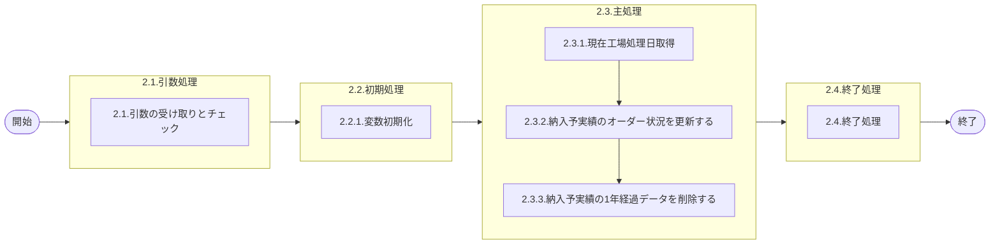

# 0. 表紙

| モジュール名 | プログラムID | プログラム名                   |
| ------------ | ------------ | ------------------------------ |
| IC           | LDAJ0024     | 納入予実績ファイルマスデリート |

| RFC | Version | 更新日     | 更新者 | 更新内容 | 確認日     | 確認者 | 承認日     | 承認者 |
| --- | :-----: | ---------- | :----: | -------- | ---------- | :----: | ---------- | :----: |
| -   |  1.0.0  | 2025/09/11 | 陳培煌 | 初版作成 | 2025/XX/XX |  石川  | 2025/XX/XX |   XX   |

## 1. 処理概要

### 1.1. 機能概要

①LDYS0007をコールし工場処理日を取得する
②納入予実績のオーダー状況を更新する
(オーダーステータスが"9"でないかつ納入指示日から1ヶ月以上経過かつオーダー明細・独立所要量明細に存在しないもののオーダーステータスを"9"とする)
③納入予実績の1ヶ月経過データを削除する
(オーダーステータスが"9"でないものは1年以上経過したら削除)
ログ：共通の部品を用いる(lombok)

### 1.2. 処理概要フロー



### 1.3. プログラム入出力パラメータ

#### 1.3.1. 引数

| No. | パラメータ論理名 | パラメータ物理名 | 属性 | 識別 | 備考 |
| --- | ---------------- | ---------------- | ---- | ---- | ---- |
| 1   |                  |                  |      |      |      |

#### 1.3.2. 戻り値

| No. | パラメータ論理名 | パラメータ物理名 | 属性   | 備考            |
| --- | ---------------- | ---------------- | ------ | --------------- |
| 1   | リターンコード   | r_status         | String | 正常：0異常：-1 |

### 1.4. その他制御・要件

| 排他制御 |      |      |
| -------- | ---- | ---- |
| 楽観     | 悲観 | 無し |
| ●       | -    | -    |

| 項目               | 制約・制御・要件など | 記載内容説明                                                     |
| ------------------ | -------------------- | ---------------------------------------------------------------- |
| パフォーマンス要件 | 特になし。           | 特別なパフォーマンス要件がある場合に要件内容とその対処法を記述。 |

### 1.5. 入出力一覧

| No | 入出力対象 | 名称                 | 物理名称                  | C | R  | U  | D  | 備考                    |
| -- | ---------- | -------------------- | ------------------------- | - | -- | -- | -- | ----------------------- |
| 1  | テーブル   | オーダー明細         | le_trn_order              |   | ○ |    |    | 旧テーブルic_order_trn  |
| 2  | テーブル   | 独立所要量明細       | le_trn_ird                |   | ○ |    |    | 旧テーブルic_indreq_trn |
| 3  | テーブル   | リテラル防止要素     | lz_anti_literal_element   |   | ○ |    |    | 現行：ic_fix_val        |
| 4  | テーブル   | ICシステムパラメータ | ld_mst_system_parameter   |   | ○ |    |    | 旧テーブルic_ctrl       |
| 5  | テーブル   | 納入予実績           | ld_trn_dlv_pre_record_day |   | ○ | ○ | ○ | 旧テーブルic_od_pr_day  |
| 6  | 共通関数   | 現在工場処理日取得   | LDYS0007                  |   |    |    |    |                         |

## 2. 詳細処理

### 2.1. 引数の取得とチェック

### 2.2. 初期処理

#### 2.2.1. 変数初期化

### 2.3. 主処理

#### 2.3.1. 現在工場処理日取得

- 共通関数LDYS0007をコールし、IC工場処理日を取得する。
- 取得できない場合、エラーログを出力し、異常終了する。
- 取得したIC工場処理日を変数.IC工場処理日にセットする。

#### 2.3.2. 納入予実績のオーダー状況を更新する

- オーダーステータスが"9"でないかつ納入指示日から1ヶ月以上経過かつオーダー明細・独立所要量明細に存在しないもののオーダーステータスを"9"とする。

```sql
    UPDATE 納入予実績 a
       SET a.オーダーステータス = '9'
          ,更新カウンタ           = 更新カウンタ + 1
          ,更新日時               = システム日時
          ,更新者                 = ログインのユーザーID
          ,更新PGID               = プログラムID
     WHERE a.オーダーステータス <> '9'
       AND a.納入指示日 <= ADD_MONTHS(変数.IC工場処理日, -1)
       AND NOT EXISTS (
           SELECT 1
             FROM オーダー明細 b
            WHERE a.品目番号　　　　　　　= b.品目番号
              AND a.供給者　　　　　　　　= b.供給者
              AND a.使用者　　　　　　　　= b.使用者
              AND a.オーダー番号　　　　　= b.オーダー番号
       )
       AND NOT EXISTS (
           SELECT 1
             FROM 独立所要量明細 c
            WHERE a.品目番号　　　　　　　= c.品目番号
              AND a.供給者　　　　　　　　= c.供給者
              AND a.使用者　　　　　　　　= c.使用者
              AND a.オーダー番号　　　　　= c.オーダー番号
       );
```

#### 2.3.3. 納入予実績の1年経過データを削除する

- オーダーステータスが"9"でないものは1年以上経過したら削除する。

```sql
DELETE FROM 納入予実績
      WHERE オーダーステータス <> '9'
        AND 納入指示日 <= ADD_MONTHS(変数.IC工場処理日, -12)
```

### 2.4. 終了処理

## 3. 補足

### 3.1. 補足説明任意記入
