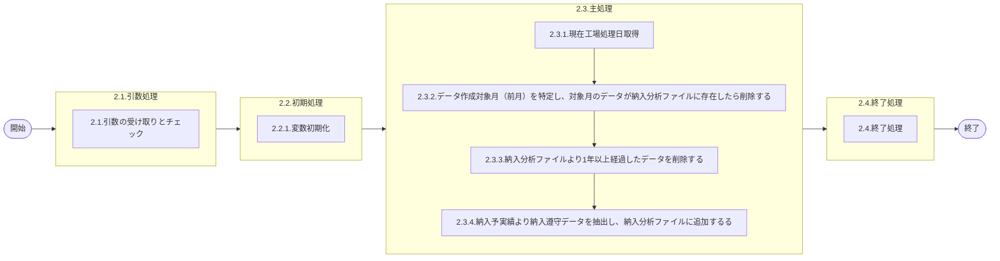

# 0. 表紙

| モジュール名 | プログラムID | プログラム名       |
| ------------ | ------------ | ------------------ |
| IC           | LDAJ0025     | 納入分析データ作成 |

| RFC | Version | 更新日     | 更新者 | 更新内容 | 確認日     | 確認者 | 承認日     | 承認者 |
| --- | :-----: | ---------- | :----: | -------- | ---------- | :----: | ---------- | :----: |
| -   |  1.0.0  | 2025/09/16 | 陳培煌 | 初版作成 | 2025/XX/XX |   XX   | 2025/XX/XX |   XX   |

## 1. 処理概要

### 1.1. 機能概要

①LDYS0007をコールし工場処理日を取得する
②データ作成対象月（前月）を特定し、対象月のデータが納入分析ファイルに存在したら削除する
③納入分析ファイルより1年以上経過したデータを削除する
④納入予実績より納入遵守データを抽出し、納入分析ファイルに追加する
【抽出条件】
納入指示日が前月かつ
削除日がブランク
ログ：共通の部品を用いる(lombok)

### 1.2. 処理概要フロー



### 1.3. プログラム入出力パラメータ

#### 1.3.1. 引数

| No. | パラメータ論理名 | パラメータ物理名 | 属性 | 識別 | 備考 |
| --- | ---------------- | ---------------- | ---- | ---- | ---- |
| 1   |                  |                  |      |      |      |

#### 1.3.2. 戻り値

| No. | パラメータ論理名 | パラメータ物理名 | 属性   | 備考            |
| --- | ---------------- | ---------------- | ------ | --------------- |
| 1   | リターンコード   | r_status         | String | 正常：0異常：-1 |

### 1.4. その他制御・要件

| 排他制御 |      |      |
| -------- | ---- | ---- |
| 楽観     | 悲観 | 無し |
| ●       | -    | -    |

| 項目               | 制約・制御・要件など | 記載内容説明                                                     |
| ------------------ | -------------------- | ---------------------------------------------------------------- |
| パフォーマンス要件 | 特になし。           | 特別なパフォーマンス要件がある場合に要件内容とその対処法を記述。 |

### 1.5. 入出力一覧

| No | 入出力対象 | 名称               | 物理名称                  | C  | R  | U | D  | 備考                      |
| -- | ---------- | ------------------ | ------------------------- | -- | -- | - | -- | ------------------------- |
| 1  | テーブル   | 納入予実績         | ld_trn_dlv_pre_record_day | -  | ○ | - | -  | 旧テーブルic_od_pr_day    |
| 2  | テーブル   | 納入分析ファイル   | ld_trn_dlv_analysis       | ○ | ○ | - | ○ | 旧テーブルic_dlv_analysis |
| 3  | テーブル   | GIMACエリアマスタ  | la_area_master            | -  | ○ | - |    | 旧テーブルcom_orgmast     |
| 4  | テーブル   | SUマスタ           | la_area_master_su         | -  | ○ | - |    | 旧テーブルla_orgmast_su   |
| 5  | 共通関数   | 現在工場処理日取得 | LDYS0007                  |    |    |   |    |                           |
| 6  | 共通関数   | 稼働日日数差計算   | LDYS0010                  |    |    |   |    |                           |

## 2. 詳細処理

### 2.1. 引数の取得とチェック

### 2.2. 初期処理

#### 2.2.1. 変数初期化

### 2.3. 主処理

#### 2.3.1. 現在工場処理日取得

- 共通関数LDYS0007をコールし、IC工場処理日を取得する
- 取得できない場合、エラーログを出力し、異常終了する
- 取得したIC工場処理日を変数.IC工場処理日にセットする
- 変数.納入指示前月初 = 変数.IC工場処理日の前月初日
- 変数.納入指示前月末 = 変数.IC工場処理日の前月末日
- 変数.集計月 = 変数.IC工場処理日の前月
- 変数.一年前の最初月日は変数.IC工場処理日の一年前の最初月日にセットする

#### 2.3.2. データ作成対象月（前月）を特定し、対象月のデータが納入分析ファイルに存在したら削除する

- 変数.IC工場処理日から前月を特定し、対象月のデータが納入分析ファイルに存在したら削除する

```sql
DELETE FROM 納入分析ファイル
      WHERE 納入指示日 >= 変数.納入指示前月初
        AND 納入指示日 <= 変数.納入指示前月末
```

- 削除件数を取得する

#### 2.3.3. 納入分析ファイルより1年以上経過したデータを削除する

- 変数.IC工場処理日から1年以上経過したデータを納入分析ファイルより削除する

```sql
DELETE FROM 納入分析ファイル
      WHERE 納入指示日 < 変数.一年前の最初月日
```

- 削除件数を追加する

#### 2.3.4. 納入予実績より納入遵守データを抽出し、納入分析ファイルに追加する

- 納入予実績より納入遵守データを追加対象リストに格納する

```sql
    SELECT A.供給者 AS 納入キー
          ,A.使用者 AS 受入キー
          ,CASE WHEN A.オーダー種別 = '1' THEN A.納入PF/送り先コード ELSE '' END AS 納入PF番号
          ,A.オーダー種別
          ,A.生試初品区分
          ,A.オーダー発行区分
          ,A.納入指示日
          ,CASE WHEN B.エリアカテゴリ = '06' THEN '1'
                WHEN B.エリアカテゴリ = '56' THEN '2' END AS 納入側社内外区分
          ,CASE WHEN C.エリアカテゴリ = '06' OR C.エリアカテゴリ = '03' THEN '1'
                WHEN C.エリアカテゴリ = '56' OR C.エリアカテゴリ = '53' THEN '2' END AS 受入側社内外区分
          ,B.担当課 AS 納入側担当課
          ,B.担当者 AS 納入側担当者
          ,C.担当課 AS 受入側担当課
          ,C.担当者 AS 受入側担当者
          ,A.起票日
          ,A.納入指示数
          ,A.納入数量
          ,D.現在有効カレンダー
      FROM 納入予実績 A
INNER JOIN GIMACエリアマスタ B
        ON E.エリアコード = B.エリアコード
INNER JOIN GIMACエリアマスタ C
        ON D.エリアコード = C.エリアコード
INNER JOIN SUマスタ D
        ON A.使用者 = D.SUコード
INNER JOIN SUマスタ E
        ON A.供給者 = E.SUコード
     WHERE A.納入指示日 >= 変数.納入指示前月初
       AND A.納入指示日 <= 変数.納入指示前月末
       AND A.削除日     = ""
  ORDER BY A.供給者
          ,A.使用者
          ,A.納入PF番号
          ,A.オーダー種別
          ,A.生試初品区分
```

納入予実績検索件数を取得する

- 追加対象リストのデータが存在しない場合、処理を終了する
- 追加対象リストのデータが該当データがなくなるまで、以下の処理を実施する

  - 稼働日日数差計算をコールし、納入指示日と起票日の稼働日日数差を取得する

    | NO | パラメータ名     | 設定値                            | 備考 |
    | -- | ---------------- | --------------------------------- | ---- |
    | 1  | カレンダーコード | 追加対象リスト.現在有効カレンダー |      |
    | 2  | 基準日           | 追加対象リスト.納入指示日         |      |
    | 3  | 指定日           | 追加対象リスト.起票日             |      |

    変数.先行件数6 = 0
    変数.先行件数5 = 0
    変数.先行件数4 = 0
    変数.先行件数3 = 0
    変数.先行件数2 = 0
    変数.先行件数1 = 0
    変数.遵守件数  = 0
    変数.遅延件数1 = 0
    変数.遅延件数2 = 0
    変数.遅延件数3 = 0
    変数.遅延件数4 = 0
    変数.遅延件数5 = 0
    変数.遅延件数6 = 0
    変数.先行オーダー数6 = 0
    変数.先行オーダー数5 = 0
    変数.先行オーダー数4 = 0
    変数.先行オーダー数3 = 0
    変数.先行オーダー数2 = 0
    変数.先行オーダー数1 = 0
    変数.遵守オーダー数  = 0
    変数.遅延オーダー数1 = 0
    変数.遅延オーダー数2 = 0
    変数.遅延オーダー数3 = 0
    変数.遅延オーダー数4 = 0
    変数.遅延オーダー数5 = 0
    変数.遅延オーダー数6 = 0


    - 稼働日日数差 <= -6 の場合
      変数.先行件数6 = 1
      変数.先行オーダー数6 = 追加対象リスト.納入数量
    - 稼働日日数差 >= 6 の場合
      変数.遅延件数6 = 1
      変数.遅延オーダー数6 = 追加対象リスト.納入指示数 - 追加対象リスト.納入数量
    - ほかの場合
      SWITCH (稼働日日数差)
      CASE -5:
      変数.先行件数5 = 1
      変数.先行オーダー数5 = 追加対象リスト.納入数量
      CASE -4:
      変数.先行件数4 = 1
      変数.先行オーダー数4 = 追加対象リスト.納入数量
      CASE -3:
      変数.先行件数3 = 1
      変数.先行オーダー数3 = 追加対象リスト.納入数量
      CASE -2:
      変数.先行件数2 = 1
      変数.先行オーダー数2 = 追加対象リスト.納入数量
      CASE -1:
      変数.先行件数1 = 1
      変数.先行オーダー数1 = 追加対象リスト.納入数量
      CASE 0:
      変数.遵守件数 = 1
      変数.遵守オーダー数 = 追加対象リスト.納入数量
      CASE 1:
      変数.遅延件数1 = 1
      変数.遅延オーダー数1 = 追加対象リスト.納入指示数 - 追加対象リスト.納入数量
      CASE 2:
      変数.遅延件数2 = 1
      変数.遅延オーダー数2 = 追加対象リスト.納入指示数 - 追加対象リスト.納入数量
      CASE 3:
      変数.遅延件数3 = 1
      変数.遅延オーダー数3 = 追加対象リスト.納入指示数 - 追加対象リスト.納入数量
      CASE 4:
      変数.遅延件数4 = 1
      変数.遅延オーダー数4 = 追加対象リスト.納入指示数 - 追加対象リスト.納入数量
      CASE 5:
      変数.遅延件数5 = 1
      変数.遅延オーダー数5 = 追加対象リスト.納入指示数 - 追加対象リスト.納入数量
  - 納入分析ファイルに同一キーのデータが存在するかチェックする

    ```sql
        SELECT 1
          FROM 納入分析ファイル
         WHERE 集計月          = 変数.集計月
           AND 納入キー        = 追加対象リスト.納入キー
           AND 受入キー        = 追加対象リスト.受入キー
           AND 納入PF番号      = 追加対象リスト.納入PF番号
           AND オーダー種別     = 追加対象リスト.オーダー種別
           AND 生試初品区分     = 追加対象リスト.生試初品区分
           AND オーダー発行区分 = 追加対象リスト.オーダー発行区分
    ```

    - データが存在しない場合、追加する

    ```sql
       INSERT INTO 納入分析ファイル
       VALUES ( 変数.集計月                   -- 集計月
              ,追加対象リスト.納入キー         -- 納入キー
              ,追加対象リスト.受入キー         -- 受入キー
              ,追加対象リスト.納入PF番号       -- 納入PF番号
              ,追加対象リスト.オーダー種別     -- オーダー種別
              ,追加対象リスト.生試初品区分     -- 生試初品区分
              ,追加対象リスト.オーダー発行区分 -- オーダー発行区分
              ,追加対象リスト.納入側社内外区分 -- 納入側社内外区分
              ,追加対象リスト.受入側社内外区分 -- 受入側社内外区分
              ,追加対象リスト.納入側担当課     -- 納入側担当課
              ,追加対象リスト.納入側担当者     -- 納入側担当者
              ,追加対象リスト.受入側担当課     -- 受入側担当課
              ,追加対象リスト.受入側担当者     -- 受入側担当者
              ,1                             -- オーダー件数
              ,追加対象リスト.納入指示数       -- オーダー合計数量
              ,変数.先行件数6                 -- 先行件数6
              ,変数.先行件数5                 -- 先行件数5
              ,変数.先行件数4                 -- 先行件数4
              ,変数.先行件数3                 -- 先行件数3
              ,変数.先行件数2                 -- 先行件数2
              ,変数.先行件数1                 -- 先行件数1
              ,変数.遵守件数                  -- 遵守件数
              ,変数.遅延件数1                 -- 遅延件数1
              ,変数.遅延件数2                 -- 遅延件数2
              ,変数.遅延件数3                 -- 遅延件数3
              ,変数.遅延件数4                 -- 遅延件数4
              ,変数.遅延件数5                 -- 遅延件数5
              ,変数.遅延件数6                 -- 遅延件数6
              ,変数.先行オーダー数6            -- 先行オーダー数6
              ,変数.先行オーダー数5            -- 先行オーダー数5
              ,変数.先行オーダー数4            -- 先行オーダー数4
              ,変数.先行オーダー数3            -- 先行オーダー数3
              ,変数.先行オーダー数2            -- 先行オーダー数2
              ,変数.先行オーダー数1            -- 先行オーダー数1
              ,変数.遵守オーダー数             -- 遵守オーダー数
              ,変数.遅延オーダー数1            -- 遅延オーダー数1
              ,変数.遅延オーダー数2            -- 遅延オーダー数2
              ,変数.遅延オーダー数3            -- 遅延オーダー数3
              ,変数.遅延オーダー数4            -- 遅延オーダー数4
              ,変数.遅延オーダー数5            -- 遅延オーダー数5
              ,変数.遅延オーダー数6            -- 遅延オーダー数6
              ,0                              --更新カウンタ
              ,システム日時                     --登録日時
              ,ログインのユーザーID              --登録者
              ,プログラムID                     --登録ＰＧＩＤ
              ,システム日時                     --更新日時
              ,ログインのユーザーID              --更新者
              ,プログラムID                     --更新ＰＧＩＤ
             )
    ```

    納入分析ファイル追加件数を取得する

    - データが存在する場合、更新する

    ```sql
       UPDATE 納入分析ファイル
          SET オーダー件数       = オーダー件数       + 1
             ,オーダー合計数量   = オーダー合計数量   + 追加対象リスト.納入指示数
             ,先行件数6         = 先行件数6         + 変数.先行件数6
             ,先行件数5         = 先行件数5         + 変数.先行件数5
             ,先行件数4         = 先行件数4         + 変数.先行件数4
             ,先行件数3         = 先行件数3         + 変数.先行件数3
             ,先行件数2         = 先行件数2         + 変数.先行件数2
             ,先行件数1         = 先行件数1         + 変数.先行件数1
             ,遵守件数          = 遵守件数          + 変数.遵守件数
             ,遅延件数1         = 遅延件数1         + 変数.遅延件数1
             ,遅延件数2         = 遅延件数2         + 変数.遅延件数2
             ,遅延件数3         = 遅延件数3         + 変数.遅延件数3
             ,遅延件数4         = 遅延件数4         + 変数.遅延件数4
             ,遅延件数5         = 遅延件数5         + 変数.遅延件数5
             ,遅延件数6         = 遅延件数6         + 変数.遅延件数6
             ,先行オーダー数6   = 先行オーダー数6   + 変数.先行オーダー数6
             ,先行オーダー数5   = 先行オーダー数5   + 変数.先行オーダー数5
             ,先行オーダー数4   = 先行オーダー数4   + 変数.先行オーダー数4
             ,先行オーダー数3   = 先行オーダー数3   + 変数.先行オーダー数3
             ,先行オーダー数2   = 先行オーダー数2   + 変数.先行オーダー数2
             ,先行オーダー数1   = 先行オーダー数1   + 変数.先行オーダー数1
             ,遵守オーダー数    = 遵守オーダー数    + 変数.遵守オーダー数
             ,遅延オーダー数1   = 遅延オーダー数1   + 変数.遅延オーダー数1
             ,遅延オーダー数2   = 遅延オーダー数2   + 変数.遅延オーダー数2
             ,遅延オーダー数3   = 遅延オーダー数3   + 変数.遅延オーダー数3
             ,遅延オーダー数4   = 遅延オーダー数4   + 変数.遅延オーダー数4
             ,遅延オーダー数5   = 遅延オーダー数5   + 変数.遅延オーダー数5
             ,遅延オーダー数6   = 遅延オーダー数6   + 変数.遅延オーダー数6
             ,更新カウンタ      = 更新カウンタ      + 1
             ,更新日時          = システム日時
             ,更新PGID         = プログラムID
        WHERE 集計月          = 変数.集計月
          AND 納入キー        = 追加対象リスト.納入キー
          AND 受入キー        = 追加対象リスト.受入キー
          AND 納入PF番号      = 追加対象リスト.納入PF番号
          AND オーダー種別     = 追加対象リスト.オーダー種別
          AND 生試初品区分     = 追加対象リスト.生試初品区分
          AND オーダー発行区分 = 追加対象リスト.オーダー発行区分
    ```

    納入分析ファイル更新件数を取得する

### 2.4. 終了処理

- 納入予実績検索件数のログ出力
- 納入分析ファイル更新件数のログ出力
- 納入分析ファイル追加件数のログ出力
- 納入分析ファイル削除件数のログ出力
