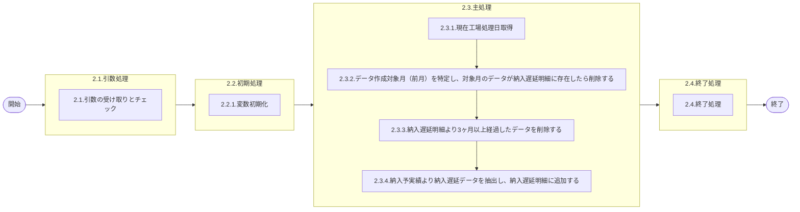

# 0. 表紙

| モジュール名 | プログラムID | プログラム名           |
| ------------ | ------------ | ---------------------- |
| IC           | LDAJ0026     | 納入遅延明細データ作成 |

| RFC | Version | 更新日     | 更新者 | 更新内容 | 確認日     | 確認者 | 承認日     | 承認者 |
| --- | :-----: | ---------- | :----: | -------- | ---------- | :----: | ---------- | :----: |
| -   |  1.0.0  | 2025/09/19 | 陳培煌 | 初版作成 | 2025/XX/XX |  XXX  | 2025/XX/XX |  XXX  |

## 1. 処理概要

### 1.1. 機能概要

①LDYS0007をコールし工場処理日を取得する
②データ作成対象月（前月）を特定し、対象月のデータが納入遅延明細に存在したら削除する
③納入遅延明細より3ヶ月以上経過したデータを削除する
④納入予実績より納入遅延データを抽出し、納入遅延明細に追加する
【抽出条件】
納入指示日が前月かつ
（オーダーステータスが完了でないor完納）かつ
（オーダーが削除されていないor起票日がブランクでない）かつ
（生試or量産）かつ
（分納or遅延）
ログ：共通の部品を用いる(lombok)

### 1.2. 処理概要フロー



### 1.3. プログラム入出力パラメータ

#### 1.3.1. 引数

| No. | パラメータ論理名 | パラメータ物理名 | 属性 | 識別 | 備考 |
| --- | ---------------- | ---------------- | ---- | ---- | ---- |
| 1   |                  |                  |      |      |      |

#### 1.3.2. 戻り値

| No. | パラメータ論理名 | パラメータ物理名 | 属性   | 備考            |
| --- | ---------------- | ---------------- | ------ | --------------- |
| 1   | リターンコード   | r_status         | String | 正常：0異常：-1 |

### 1.4. その他制御・要件

| 排他制御 |      |      |
| -------- | ---- | ---- |
| 楽観     | 悲観 | 無し |
| ●       | -    | -    |

| 項目               | 制約・制御・要件など | 記載内容説明                                                     |
| ------------------ | -------------------- | ---------------------------------------------------------------- |
| パフォーマンス要件 | 特になし。           | 特別なパフォーマンス要件がある場合に要件内容とその対処法を記述。 |

### 1.5. 入出力一覧

| No | 入出力対象 | 名称               | 物理名称                  | C  | R  | U | D  | 備考                      |
| -- | ---------- | ------------------ | ------------------------- | -- | -- | - | -- | ------------------------- |
| 1  | テーブル   | 納入予実績         | ld_trn_dlv_pre_record_day | -  | ○ | - | -  | 旧テーブルic_od_pr_day    |
| 2  | テーブル   | 納入遅延明細       | ld_trn_dlv_delay          | ○ | ○ | - | ○ | 旧テーブルic_dlv_od_delay |
| 3  | テーブル   | GIMACエリアマスタ  | la_area_master            | -  | ○ | - | -  | 旧テーブルcom_orgmast     |
| 4  | テーブル   | リテラル防止要素   | lz_anti_literal_element   | -  | ○ | - | -  |                           |
| 5  | テーブル   | 品目共通           | la_itemcomn               | -  | ○ | - | -  | 旧テーブルde_itemcomn     |
| 6  | テーブル   | 測定単位           | la_measure_unit           | -  | ○ | - | -  |                           |
| 7  | テーブル   | SUマスタ           | la_area_master_su         | -  | ○ | - | -  | 旧テーブルcom_orgmast_su  |
| 8  | 共通関数   | 現在工場処理日取得 | LDYS0007                  |    |    |   |    |                           |

## 2. 詳細処理

### 2.1. 引数の取得とチェック

### 2.2. 初期処理

#### 2.2.1. 変数初期化

### 2.3. 主処理

#### 2.3.1. 現在工場処理日取得

- 共通関数LDYS0007をコールし、IC工場処理日を取得する
- 取得できない場合、エラーログを出力し、異常終了する
- 取得したIC工場処理日を変数.IC工場処理日にセットする

#### 2.3.2. データ作成対象月（前月）を特定し、対象月のデータが納入遅延明細に存在したら削除する

- 変数.IC工場処理日から前月のデータが納入遅延明細に存在したら削除する

```sql
DELETE FROM 納入遅延明細
      WHERE 納入指示日 >= DATE_TRUNC('month', IC工場処理日 - INTERVAL '1 month')
        AND 納入指示日 < DATE_TRUNC('month', IC工場処理日);
```

#### 2.3.3. 納入遅延明細より3ヶ月以上経過したデータを削除する

- 納入遅延明細から変数.IC工場処理日から3ヶ月前のデータを削除する

```sql
DELETE FROM 納入遅延明細
      WHERE 納入指示日 < DATE_TRUNC('month', IC工場処理日 - INTERVAL '3 months');
```

#### 2.3.4. 納入予実績より納入遅延データを抽出し、納入遅延明細に追加する

- リテラル防止要素からSUコードを検索し、変数.SUコードリストにセットする

```sql
    SELECT 制御キー１
      FROM リテラル防止要素
     WHERE システムコード      = 'LD'
       AND リテラル防止識別ＩＤ = 'LDA00010'
```

- 納入予実績から変数.対象年月のデータを検索する

```sql
    SELECT a.品目番号                 AS 品目番号
          ,a.供給者                   AS 供給者
          ,a.使用者                   AS 使用者
          ,a.オーダー番号             AS オーダー番号
          ,a.納入キー                 AS 納入キー
          ,a.受入キー                 AS 受入キー
          ,b.担当課                   AS 納入側担当課
          ,b.担当者                   AS 納入側担当者
          ,a.生試初品区分             AS 生試初品区分
          ,a.オーダー種別             AS オーダー種別
          ,a.オーダー発行区分         AS オーダー発行区分
          ,a.納入PF/送り先コード      AS 独立需要送り先コード
          ,e.単位名称                 AS 単位名称
          ,a.納入指示日               AS 納入指示日
          ,a.納入指示数               AS 納入指示数
          ,a.完了開始時間             AS 完了開始時間
          ,a.完了終了時間             AS 完了終了時間
          ,a.起票日                   AS 最新起票日
          ,a.納入数量                 AS 納入数量
          ,a.オーダーステータス       AS オーダーステータス
          ,a.品目ステータス           AS 品目ステータス
          ,a.工程番号                 AS 工程番号
          ,a.荷姿コード               AS 荷姿コード
          ,a.荷姿収容数               AS 荷姿収容数
          ,a.納入PF/送り先区分        AS 納入PF/送り先区分
          ,a.納入PF/送り先コード      AS 納入PF/送り先コード
          ,a.オーダー確定日           AS オーダー確定日
          ,CASE WHEN  a.使用者[1,2] <> "PC" AND (b.エリアカテゴリ IN ('53', '56') OR b.海外調達区分 = '1' OR a.供給者 IN 変数.SUコードリスト) AND c.エリアカテゴリ IN ('03', '06') AND b.海外調達区分 = '0' AND a.使用者 NOT IN 変数.SUコードリスト THEN '1'
                ELSE WHEN a.使用者[1,2] <> "PC" AND (b.エリアカテゴリ IN ('53', '56') OR b.海外調達区分 = '1' OR a.供給者 IN 変数.SUコードリスト) AND (c.エリアカテゴリ IN ('53', '56') OR b.海外調達区分 = '1' OR a.使用者 IN 変数.SUコードリスト) THEN '2'
                ELSE ''
           END                       AS 直送区分
          ,a.削除日                   AS 削除日
          ,a.費用振替先区分           AS 費用振替先区分
          ,a.費用振替先コード         AS 費用振替先コード
          ,a.理由コード               AS 理由コード
          ,a.削除・理由               AS 削除・理由
      FROM 納入予実績 a
INNER JOIN GIMACエリアマスタ b
        ON f.エリアコード = b.エリアコード
INNER JOIN GIMACエリアマスタ c
        ON g.エリアコード = c.エリアコード
INNER JOIN 品目共通 d
        ON a.品目番号 = d.品目番号
 LEFT JOIN 測定単位 e
        ON e.測定単位 = d.測定単位
INNER JOIN SUマスタ f
        ON a.使用者 = f.SUコード
INNER JOIN SUマスタ g
        ON a.供給者 = g.SUコード
     WHERE 納入指示日 >= DATE_TRUNC('month', :IC工場処理日 - INTERVAL '1 month')
       AND 納入指示日 < DATE_TRUNC('month', :IC工場処理日);
       AND (a.オーダーステータス <> '9' OR a.納入指示数 <= a.納入数量)
       AND (a.起票日 <> '' OR a.削除日 = '')
       AND a.生試初品区分 IN ('2','4')
       AND (a.納入指示数 > a.納入数量 OR a.納入指示日 < a.起票日)
  ORDER BY b.担当課, b.担当者,a.供給者,a.使用者, a.品目番号, a.オーダー番号, a.納入指示日;
```

- 納入予実績の抽出件数を変数.納入予実績抽出件数にセットする
- 変数.納入予実績抽出件数がゼロではない場合、納入遅延明細に追加する

```sql
INSERT INTO 納入遅延明細
      VALUES (
         抽出データ.品目番号              -- 品目番号
        ,抽出データ.供給者                -- 供給者
        ,抽出データ.使用者                -- 使用者
        ,抽出データ.オーダー番号          -- オーダー番号
        ,抽出データ.納入キー              -- 納入キー
        ,抽出データ.受入キー              -- 受入キー
        ,抽出データ.納入側担当課          -- 納入側担当課
        ,抽出データ.納入側担当者          -- 納入側担当者
        ,抽出データ.生試初品区分          -- 生試初品区分
        ,抽出データ.オーダー種別          -- オーダー種別
        ,抽出データ.オーダー発行区分      -- オーダー発行区分
        ,抽出データ.独立需要送り先コード  -- 独立需要送り先コード
        ,抽出データ.単位名称              -- 単位名称
        ,抽出データ.納入指示日            -- 納入指示日
        ,抽出データ.納入指示数            -- 納入指示数
        ,抽出データ.完了開始時間          -- 完了開始時間
        ,抽出データ.完了終了時間          -- 完了終了時間
        ,抽出データ.最新起票日            -- 最新起票日
        ,抽出データ.納入数量              -- 納入数量
        ,抽出データ.オーダーステータス    -- オーダーステータス
        ,抽出データ.品目ステータス        -- 品目ステータス
        ,抽出データ.工程番号              -- 工程番号
        ,抽出データ.荷姿コード            -- 荷姿コード
        ,抽出データ.荷姿収容数            -- 荷姿収容数
        ,抽出データ.納入PF/送り先区分     -- 納入PF/送り先区分
        ,抽出データ.納入PF/送り先コード   -- 納入PF/送り先コード
        ,抽出データ.オーダー確定日        -- オーダー確定日
        ,抽出データ.直送区分              -- 直送区分
        ,抽出データ.削除日                -- 削除日
        ,抽出データ.費用振替先区分        -- 費用振替先区分
        ,抽出データ.費用振替先コード      -- 費用振替先コード
        ,抽出データ.理由コード            -- 理由コード
        ,抽出データ.削除・理由            -- 削除・理由
        ,抽出データ.遅延除外フラグ        -- 遅延除外フラグ
        ,抽出データ.遅延除外理由          -- 遅延除外理由
        ,'0'                            -- 遅延除外フラグ
        ,''                           -- 遅延除外理由
        ,0                              --更新カウンタ
        ,システム日時                     --登録日時
        ,ログインのユーザーID              --登録者
        ,プログラムID                     --登録ＰＧＩＤ
        ,システム日時                     --更新日時
        ,ログインのユーザーID              --更新者
        ,プログラムID                     --更新ＰＧＩＤ
      )
```

- 納入遅延明細の追加件数を変数.納入遅延明細追加件数にセットする

### 2.4. 終了処理

- 納入予実績の抽出件数をログ出力する
- 納入遅延明細の追加件数をログ出力する
