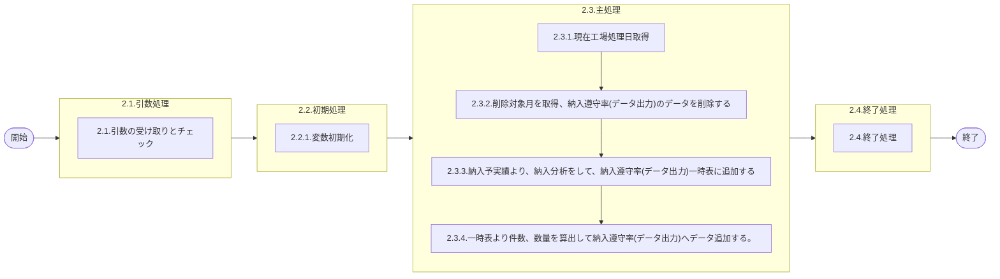

# 0. 表紙

| モジュール名 | プログラムID | プログラム名               |
| ------------ | ------------ | -------------------------- |
| IC           | LDAJ0027     | 納入遵守率分析(データ出力) |

| RFC | Version | 更新日     | 更新者 | 更新内容 | 確認日     | 確認者 | 承認日     | 承認者 |
| --- | :-----: | ---------- | :----: | -------- | ---------- | :----: | ---------- | :----: |
| -   |  1.0.0  | 2025/09/25 | 陳培煌 | 初版作成 | 2025/XX/XX |  XXX  | 2025/XX/XX |  XXX  |

## 1. 処理概要

### 1.1. 機能概要

①LDYS0007をコールし工場処理日を取得する
②削除対象月を取得、納入遵守率(データ出力)のデータを削除する
週次：処理当日がバケット最終日の時のみ処理実施（以外の時は処理しない）。
納入遵守率(データ出力)の最新バケット(処理対象月)の次バケットを集計対象とする。
通常は処理日が存在するバケットが対象となる。
削除対象例：

パターン１：
IC工場処理日が3/26の場合、今回バケット←バケットE
納入遵守率(データ出力).最大対象処理月が201112の場合、次回バケット←バケットF
今回バケット≤次回バケット且つ今回確定期間最終日=IC工場処理日の場合、対象バケット←今回バケット（バケットE）
対象バケット：（対象バケットNo：201112、対象確定期間開始日：2011/03/20、対象確定期間最終日：2011/03/26）
納入遵守率(データ出力)に３週分のデータを残して、それ以前のもの（バケットA、B）を削除する。
＊処理当日がバケット最終日以外の場合、処理終了(処理を実行しない)
パターン２：
IC工場処理日が任意日（例：3.22）の場合、今回バケット←バケットE
納入遵守率(データ出力).最大対象処理月が201110の場合、次回バケット←バケットD
今回バケット>次回バケットの場合、対象バケット←次回バケット（バケットD）
対象バケット：（対象バケットNo：201111、対象確定期間開始日：2011/03/13、対象確定期間最終日：2011/03/19）
納入遵守率(データ出力)に３週分のデータを残して、それ以前のもの（バケットA）を削除する。

月次：納入遵守率(データ出力)に3ヶ月分のデータを残してそれ以前のものを削除する。
③納入予実績より、納入分析をして、納入遵守率(データ出力)一時表に追加する
追加対象：
週次：納入指示日が上記の対象バケットの対象確定期間のデータを追加する
月次：納入指示日がIC工場処理日の前月のデータを追加する
【抽出条件】
オーダーまたは独立所要量で送り先がSU
※生試の場合独立所要量で使用者=送り先のものは対象外
④一時表より件数、数量を算出して納入遵守率(データ出力)へデータ追加する。

### 1.2. 処理概要フロー



### 1.3. プログラム入出力パラメータ

#### 1.3.1. 引数

| No. | パラメータ論理名 | パラメータ物理名 | 属性   | 識別 | 備考           |
| --- | ---------------- | ---------------- | ------ | ---- | -------------- |
| 1   | 処理区分         | process_class    | String |      | 1：週次2：月次 |

#### 1.3.2. 戻り値

| No. | パラメータ論理名 | パラメータ物理名 | 属性   | 備考            |
| --- | ---------------- | ---------------- | ------ | --------------- |
| 1   | リターンコード   | r_status         | String | 正常：0異常：-1 |

### 1.4. その他制御・要件

| 排他制御 |      |      |
| -------- | ---- | ---- |
| 楽観     | 悲観 | 無し |
| ●       | -    | -    |

| 項目               | 制約・制御・要件など | 記載内容説明                                                     |
| ------------------ | -------------------- | ---------------------------------------------------------------- |
| パフォーマンス要件 | 特になし。           | 特別なパフォーマンス要件がある場合に要件内容とその対処法を記述。 |

### 1.5. 入出力一覧

| No | 入出力対象 | 名称                   | 物理名称                  | C  | R  | U | D  | 備考                                                     |
| -- | ---------- | ---------------------- | ------------------------- | -- | -- | - | -- | -------------------------------------------------------- |
| 1  | テーブル   | GIMACエリアマスタ      | la_area_master            | -  | ○ | - | -  | PYMAC３：com_orgmastNEXT：la_orgmast                     |
| 2  | テーブル   | SUマスタ               | la_area_master_su         | -  | ○ | - | -  | PYAMC３：imp_maker_mastNEXT：la_orgmast_su               |
| 3  | テーブル   | リテラル防止要素       | lz_anti_literal_element   | -  | ○ | - | -  | PYMAC３：インプットファイルNEXT：lz_anti_literal_element |
| 4  | テーブル   | 確定期間               | le_mst_fix_period         | -  | ○ | - | -  | PYMAC３：mrp_fix_periodNEXT：lc_mst_fix_period           |
| 5  | テーブル   | 納入予実績             | ld_trn_dlv_pre_record_day | -  | ○ | - | -  | PYMAC３：ic_od_pr_dayNEXT：ld_trn_dlv_pre_record_day     |
| 6  | テーブル   | 納入遵守率(データ出力) | ld_trn_obey_rat_data      | ○ | ○ | - | ○ | PYMAC３：ic_obey_ratNEXT：ld_trn_dlv_obey_rate           |
| 7  | 共通関数   | 現在工場処理日取得     | LDYS0007                  |    |    |   |    |                                                          |
| 8  | 共通関数   | 稼動日計算得           | LEYS0001                  |    |    |   |    |                                                          |

## 2. 詳細処理

### 2.1. 引数の受け取りとチェック

- 引数.処理区分が1：週次2：月次以外の場合、エラーログを出力し、異常終了する

### 2.2. 初期処理

#### 2.2.1. 変数初期化

- 利用する変数を初期化する
  変数.メッセージ出力ポイント　←　10000
- 一時表納入予実績を作成する

```sql
CREATE TEMPORARY TABLE IF NOT EXISTS 一時表納入予実績 (
    品目番号                 VARCHAR(30) NOT NULL,
    供給者                   VARCHAR(4)  NOT NULL,
    使用者                   VARCHAR(4)  NOT NULL,
    オーダー種別              VARCHAR(1)  NOT NULL,
    納入PF送り先区分          VARCHAR(1)  NOT NULL,
    納入PF送り先コード        VARCHAR(4)  NOT NULL,
    生試初品区分              VARCHAR(1)  NOT NULL,
    納入指示日                DATE        NOT NULL,
    納入指示数                DECIMAL(15,5) NOT NULL,
    オーダー発行区分           VARCHAR(1)  NOT NULL,
    納入数量                  DECIMAL(15,5) NOT NULL,
    オーダーステータス         VARCHAR(1)  NOT NULL,
    起票日                    DATE        NOT NULL,
    Sコード                   VARCHAR(4)  NOT NULL,
    Uコード                   VARCHAR(4)  NOT NULL,
    Pコード                   VARCHAR(4)  NOT NULL,
    S組織カテゴリ             VARCHAR(4)  NOT NULL,
    U組織カテゴリ             VARCHAR(4)  NOT NULL,
    P組織カテゴリ             VARCHAR(4)  NOT NULL,
    間隔日数                  DECIMAL(15,5) NOT NULL,
    数量                      DECIMAL(15,5) NOT NULL,
    オーダークラス             VARCHAR(1)  NOT NULL,
    遵守区分                   VARCHAR(1)  NOT NULL,

    PRIMARY KEY (
        Sコード, Uコード, オーダークラス, 間隔日数,
        供給者, 使用者, 納入PF送り先コード,
        オーダー発行区分, オーダー種別
    )
);

```

### 2.3. 主処理

#### 2.3.1. 現在工場処理日取得

- 共通関数LDYS0007をコールし、IC工場処理日を取得する
- 取得できない場合、エラーログを出力し、異常終了する
- 取得したIC工場処理日を変数.IC工場処理日にセットする
  変数.前月開始日　　 =　変数.IC工場処理日の前月の最初日
  変数.前月終了日　　 =　変数.IC工場処理日の前月の最終日

#### 2.3.2. 削除対象月を取得、納入遵守率(データ出力)のデータを削除する

- リテラル防止要素から納入遵守率分析基準カレンダーコードを検索する

```sql
    SELECT 制御キー１
      FROM リテラル防止要素
     WHERE システムコード       = 'LD'
       AND リテラル防止識別ＩＤ = 'LDA00013'
```

データが存在する場合、
　変数.カレンダーコード　←　上記取得した制御キー１
データが存在しない場合、異常終了

- 共通関数LEYS0001をコールする

| NO | パラメータ名     | 設定値                    | 備考 |
| -- | ---------------- | ------------------------- | ---- |
| 1  | カレンダーコード | 変数.カレンダーコード     |      |
| 2  | 基準日           | 追加対象リスト.納入指示日 |      |
| 3  | 計算日数         | 1                         |      |

SP戻り値.処理ステータスが"0"の場合、
　変数.次の日付　←　SP戻り値.対象日付
以外の場合、異常終了

- リテラル防止要素からSUコードを検索する

```sql
    SELECT 制御キー１
      FROM リテラル防止要素
     WHERE システムコード      = 'LD'
       AND リテラル防止識別ＩＤ = 'LDA00011'
```

- GIMACエリアマスタからSUコード取得

```sql
    SELECT エリアコード
      FROM GIMACエリアマスタ
     WHERE 海外調達区分 = '1'
```

- SUコード結果合併
  リテラル防止要素から制御キー１とGIMACエリアマスタからSエリアコードを変数.SUコードリストにセットする
- 変数.処理区分が1：週次の場合、以下の処理を実施する

  - 今回バケットを取得する

    ```sql
        SELECT バケットNo., 確定期間開始日, 確定期間最終日
          FROM 確定期間
         WHERE 確定期間ID     = '01'
           AND 確定期間開始日 <= 変数.IC工場処理日
           AND 確定期間最終日 >= 変数.IC工場処理日
    ```

    データが存在する場合、
    　　変数.今回バケットNo　　　←　上記取得したバケットNo
    　　変数.今回確定期間開始日　←　上記取得した確定期間開始日
    　　変数.今回確定期間最終日　←　上記取得した確定期間最終日
    データが存在しない場合、異常終了
  - 納入遵守率(データ出力)の最大対象処理月を取得する

    ```sql
        SELECT MAX(処理対象月)
          FROM 納入遵守率(データ出力)
         WHERE 処理種別 = '1' -- 週次
    ```

    データが存在する場合、
    　　　変数.遵守バケット　←　上記取得した処理対象月[1,4]　＋　"0"　+　上記取得した処理対象月[5,6]
    　データが存在しない場合、異常終了
  - 次回バケットを取得する

    ```sql
        SELECT バケットNo., 確定期間開始日, 確定期間最終日
          FROM 確定期間
         WHERE 確定期間ID = '01'
           AND バケットNo. > 変数.遵守バケット
      ORDER BY バケットNo.
         LIMIT 1
    ```

    データが存在する場合
    　変数.次回バケットNo　　　←　上記取得したバケットNo
    　変数.次回確定期間開始日　←　上記取得した確定期間開始日
    　変数.次回確定期間最終日　←　上記取得した確定期間最終日
    データが存在しない場合、異常終了
  - 今回バケットと次回バケットを比較し、処理対象バケットを確定する

    - 変数.次回バケットNo　<　変数.今回バケットNoの場合、
      変数.対象バケットNo　　　←　変数.次回バケットNo
      変数.対象確定期間開始日　←　変数.次回確定期間開始日
      変数.対象確定期間最終日　←　変数.次回確定期間最終日
      ログファイルにメッセージ「*** Execute Target[obey next BK (obey_next_bk < today_bk)] 」を出力する
    - 以外の場合、
      - 変数.今回確定期間最終日　= 変数.IC工場処理日の場合、
        変数.対象バケットNo　　　←　変数.今回バケットNo
        変数.対象確定期間開始日　←　変数.今回確定期間開始日
        変数.対象確定期間最終日　←　変数.今回確定期間最終日
        ログファイルにメッセージ「*** Execute Target[today BK (today = bk end_day)」を出力する
      - 以外の場合
        ロングファイルにメッセージ「*** today <> bk end day  [SKIP]  ***」を出力し、処理正常終了
  - カレンダーを作成

    - 変数.処理区分が1：週次の場合
      変数.開始日付　←　変数.IC工場処理日
    - 以外の場合
      変数.開始日付　←　変数.前月開始日
    - 変数.カレンダーリストを初期化する
    - 納入遵守の稼動日と納入遅延の稼動日を計算する
      - 変数.i　←　0
      - 変数.開始日付の当月で最初日から最終日まで、以下の処理を実施する
        - 変数.計算日数　←　-6
        - 変数.j　←　0
        - 変数.開始日付の前6日から後6日まで、稼動日のカレンダーを取得する
          稼動日の計算はSP(LCYS0001 稼動日計算)をコールする

          | NO | パラメータ名     | 設定値                | 備考 |
          | -- | ---------------- | --------------------- | ---- |
          | 1  | カレンダーコード | 変数.カレンダーコード |      |
          | 2  | 基準日           | 変数.開始日付         |      |
          | 3  | 計算日数         | 変数.計算日数         |      |

          変数.計算日数 + 1日
          変数.カレンダーリスト[i][j]にSP戻り値.対象日付を追加する
        - 変数.開始日付 + 1日
  - 納入遵守率(データ出力)に３週分のデータを残して、それ以前のものを削除する
    変数.削除対象月　←　(変数.対象バケットNo - 2)[1,4] + (変数.対象バケットNo - 2)[6,7]

    ```sql
        DELETE FROM 納入遵守率(データ出力)
              WHERE 処理種別 = '1' -- 週次
                AND 処理対象月 < 変数.削除対象月
    ```
- 変数.処理区分が2：月次の場合、以下の処理を実施する

```sql
    DELETE FROM 納入遵守率(データ出力)
          WHERE 処理種別 = '2' -- 月次
            AND 処理対象月 < ADD_MONTH(変数.IC工場処理日, -2)
```

#### 2.3.3. 納入予実績より、納入分析をして、納入遵守率(データ出力)一時表に追加する

- 変数.処理区分が1：週次の場合
  変数.処理対象月　←　(変数.IC工場処理日 - 1)[1,4] + (変数.IC工場処理日 - 1)[6,7]
- 変数.処理区分が2：月次の場合
  変数.処理対象月　←　変数.IC工場処理日の先月
- 以下の条件で納入予実績を検索する、納入予実績リストに格納する

```sql
    SELECT a.品目番号
          ,a.供給者
          ,a.使用者
          ,a.納入PF／送り先区分
          ,a.納入PF／送り先コード
          ,a.生試初品区分
          ,a.納入指示日
          ,a.納入数量
          ,a.オーダーステータス
          ,a.オーダー種別
          ,CASE WHEN a.オーダー種別 = '1' THEN 'S:' || a.供給者
                WHEN a.オーダー種別 = '2' THEN 'S:' || a.使用者
           END AS Sコード
          ,CASE WHEN a.オーダー種別 = '1' THEN 'U:' || a.使用者
                WHEN a.オーダー種別 = '2' THEN 'U:' || a.納入PF／送り先コード
           END AS Uコード
          ,CASE WHEN a.オーダー種別 = '1' THEN 'P:' || a.納入PF／送り先コード
                WHEN a.オーダー種別 = '2' THEN 'P:' || a.使用者
           END AS Sコード
          ,b.エリアカテゴリ AS S組織カテゴリ
          ,c.エリアカテゴリ AS U組織カテゴリ
          ,d.エリアカテゴリ AS P組織カテゴリ
          ,CASE WHEN a.起票日  IS NULL THEN 変数.次の日付
                ELSE a.起票日
           END AS 起票日
      FROM 納入予実績 a
INNER JOIN GIMACエリアマスタ b
        ON e.エリアコード = b.エリアコード
INNER JOIN GIMACエリアマスタ c
        ON f.エリアコード = c.エリアコード
INNER JOIN GIMACエリアマスタ d
        ON g.エリアコード = d.エリアコード
INNER JOIN SUマスタ e
        ON a.供給者 = e.SUコード
INNER JOIN SUマスタ f
        ON a.使用者 = f.SUコード
INNER JOIN SUマスタ g
        ON a.納入PF/送り先コード = g.SUコード
     WHERE (削除日 IS NULL OR 納入日 IS NOT NULL)
         -- 変数.処理区分が1：週次の場合
           AND 納入指示日 >= 変数.対象確定期間開始日
           AND 納入指示日 <= 変数.対象確定期間最終日
         -- 変数.処理区分が2：月次の場合
           AND 納入指示日 >= ADD_MONTH(変数.IC工場処理日, -1) + 1
           AND 納入指示日 < ADD_MONTH(変数.IC工場処理日, 1)

```

- 納入予実績リストの該当データがなくなるまで、以下の処理を実施する

  - 納入予実績リスト.オーダー種別が"2"(独立所要量)の場合、

    - 納入予実績リスト.納入PF／送り先区分　<>　"1"(SUではない)の場合、
      次データを読み込む、処理を続く
    - 納入予実績リスト.生試初品区分　=　"2"(生試)　且つ　納入予実績リスト.納入PF／送り先区分　=　"1"(SU)　且つ
      納入予実績リスト.使用者　=　納入予実績リスト.納入PF／送り先コードの場合、
      次データを読み込む、処理を続く
  - それ以外、納入予実績リスト.オーダー種別が"1"の場合、
    　次データを読み込む、処理を続く
  - 納入予実績リスト.オーダー発行区分が"1"(オーダー発行ＭＲＰ)の場合、
    変数.オーダークラス　←　"1"(MRP)
  - 納入予実績リスト.オーダー発行区分が"2"(臨時)の場合、

    - 納入予実績リスト.オーダー種別が"1"の場合
      変数.オーダークラス　←　"2"(押込)
    - 納入予実績リスト.オーダー種別が"2"の場合
      変数.オーダークラス　←　"3"(独立押込)
  - 変数.オーダークラスが"1"、且つ納入予実績リスト.オーダー種別が"2"の場合、

    - 納入予実績リスト.P組織カテゴリ[1,1]が"5"(社外)の場合、
      変数.オーダークラス　←　"3"(独立押込)
    - 納入予実績リスト.納入PF／送り先コードが変数.SUコードリストに存在する場合、
      変数.オーダークラス　←　"3"(独立押込)
  - 間隔日数(稼動日)の計算する

    - 納入予実績リスト.納入指示日　>　納入予実績リスト.起票日の場合
      変数.遵守区分　←　1　(先行)
    - 納入予実績リスト.納入指示日　<　納入予実績リスト.起票日の場合
      変数.遵守区分　←　1　(先行)
    - 納入予実績リスト.納入指示日　=　納入予実績リスト.起票日の場合、

      - 納入予実績リスト.オーダーステータス　<>　"9"(完了)　且つ　納入予実績リスト.生試初品区分　<>　"2"(生試)の場合、
        　　変数.遵守区分　←　2　(遅延)
      - それ以外の場合、
        　　変数.遵守区分　←　0　(遵守)
    - 変数.カレンダーコードが"05"の場合、

      - 納入予実績リスト.納入指示日　>　納入予実績リスト.起票日の場合
        - 繰り返す回数が6、間隔日数が - 1で以下の処理を繰り返す
          - カレンダー稼動日　=　起票日の場合、
            　変数.間隔　←　カレンダー稼動日と変数.基準日の間隔日数
            　以下の遅延と遵守数量計算へ続く
          - カレンダー稼働日　<　起票日　且つ繰り返す回数が1回目の場合、
            　変数.間隔　←　9
            　以下の遅延と遵守数量計算へ続く
          - カレンダー稼働日　<　起票日の場合、
            　変数.間隔　←　カレンダー稼動日と変数.基準日の間隔日数　+　1
            　以下の遅延と遵守数量計算へ続く
          - 変数.間隔が0の場合、
            　繰り返す回数6回目のカレンダー稼動日　>　起票日の場合、
            　変数.間隔　←　6
      - 納入予実績リスト.納入指示日　<=　納入予実績リスト.起票日の場合
        - 繰り返す回数が6、間隔日数が + 1で以下の処理を繰り返す
        - カレンダー稼動日　>=　起票日の場合、
          　変数.間隔　←　カレンダー稼動日と変数.基準日の間隔日数
          　以下の遅延と遵守数量計算へ続く
        - 変数.間隔が0の場合、
          　繰り返す回数6回目のカレンダー稼動日　<　起票日の場合、
          　変数.間隔　←　6
    - 変数.カレンダーコードが"05"以外の場合、

      - 納入予実績リスト.納入指示日　>　納入予実績リスト.起票日の場合
        - 繰り返す回数が6、間隔日数が - 1で以下の処理を繰り返す
          - カレンダー稼動日　<=　起票日の場合、
            　   変数.間隔　←　カレンダー稼動日と変数.基準日の間隔日数
            　   以下の遅延と遵守数量計算へ続く
          - 変数.間隔が0の場合、
            　繰り返す回数6回目のカレンダー稼動日　>　起票日の場合、
            　変数.間隔　←　6
      - 納入予実績リスト.納入指示日　<=　納入予実績リスト.起票日の場合
        - 繰り返す回数が6、間隔日数が + 1で以下の処理を繰り返す
          - カレンダー稼動日　>=　起票日の場合、
            　変数.間隔　←　カレンダー稼動日と変数.基準日の間隔日数
            　以下の遅延と遵守数量計算へ続く
          - 変数.間隔が0の場合、
            　繰り返す回数6回目のカレンダー稼動日　<　起票日の場合、
            　変数.間隔　←　6
  - 遅延と遵守数量計算

    - 納入予実績リスト.オーダーステータス　<>　"9"　且つ　変数.間隔　>　0の場合、
      　　　　　変数.数量　←　納入予実績リスト.納入指示数　－　納入予実績リスト.納入数量　(遅延数量)
    - 以外の場合、
      　　　　　変数.数量　←　納入予実績リスト.納入数量　(遵守)
  - 一時表納入予実績(日次)へデータを追加

    ```sql
    INSERT INTO 一時表納入予実績
        VALUES (
        納入予実績リスト.品目番号
       ,納入予実績リスト.供給者
       ,納入予実績リスト.使用者
       ,納入予実績リスト.オーダー種別
       ,納入予実績リスト.納入PF／送り先区分
       ,納入予実績リスト.納入PF／送り先コード
       ,納入予実績リスト.生試初品区分
       ,納入予実績リスト.納入指示日
       ,納入予実績リスト.納入指示数
       ,納入予実績リスト.オーダー発行区分
       ,納入予実績リスト.納入数量
       ,納入予実績リスト.オーダーステータス
       ,納入予実績リスト.起票日
       ,納入予実績リスト.Sコード
       ,納入予実績リスト.Uコード
       ,納入予実績リスト.Pコード
       ,納入予実績リスト.S組織カテゴリ
       ,納入予実績リスト.U組織カテゴリ
       ,納入予実績リスト.P組織カテゴリ
       ,変数.間隔
       ,変数.数量
       ,変数.オーダークラス
       ,変数.遵守区分
    )
    ```

    - 一時表の追加件数　>=　変数.メッセージ出力ポイントの場合、ログにメッセージを出力する
      　　　　(メッセージ：システム日時　＋　変数.メッセージ出力ポイント　＋　処理2.品目番号)
      変数.メッセージ出力ポイント　←　変数.メッセージ出力ポイント　＋　10000
- 一時表納入予実績を検索し、一時表納入予実績リストに格納する

```sql
    SELECT SUBSTR(Sコード,3,4)　AS　納入側SUコード
          ,SUBSTR(Uコード,3,4)　AS　受入側SUコード
          ,オーダークラス
          ,間隔日数
          ,供給者
          ,使用者
          ,納入PF／送り先コード
          ,オーダー発行区分
          ,オーダー種別
          ,遵守区分
          ,COUNT(*)　AS　納入件数
          ,SUM(数量)　AS　納入数量
      FROM 一時表納入予実績
  GROUP BY 納入側SUコード
          ,受入側SUコード
          ,オーダークラス
          ,間隔日数
          ,供給者
          ,使用者
          ,納入PF／送り先コード
          ,オーダー発行区分
          ,オーダー種別
          ,遵守区分
  ORDER BY 納入側SUコード
          ,受入側SUコード
          ,オーダークラス
          ,間隔日数
          ,供給者
          ,使用者
          ,納入PF／送り先コード
          ,オーダー発行区分
          ,オーダー種別
          ,遵守区分
```

- 一時表納入予実績リストの該当データがなくなるまで、以下の処理を実施する
  - SコードでGIMACエリアマスタから担当課と担当者を取得する

    ```sql
        SELECT 担当課, 担当者
          FROM GIMACエリアマスタ
         WHERE エリアコード = 一時表納入予実績リスト.納入側SUコード
    ```

    - データが存在する場合、
      　変数.納入側MRP/IC担当課　←　上記処理.担当課
      　変数.納入側MRP/IC担当者　←　上記処理.担当者
    - データが存在しない場合、
      　変数.納入側MRP/IC担当課　←　スペース
      　変数.納入側MRP/IC担当者　←　スペース
  - UコードでGIMACエリアマスタから担当課と担当者を取得する

    ```sql
        SELECT 担当課, 担当者
          FROM GIMACエリアマスタ
         WHERE エリアコード = 一時表納入予実績リスト.受入側SUコード
    ```

    - データが存在する場合、
      　変数.受入側MRP/IC担当課　←　上記処理.担当課
      　変数.受入側MRP/IC担当者　←　上記処理.担当者
    - データが存在しない場合、
      　変数.納入側MRP/IC担当課　←　スペース
      　変数.納入側MRP/IC担当者　←　スペース
  - 納入遵守率を追加する

    ```sql
    INSERT INTO 納入遵守率(データ出力)
        VALUES (
               ,一時表納入予実績リスト.納入側SUコード  -- 納入キー
               ,一時表納入予実績リスト.受入側SUコード  -- 受入キー
               ,変数.納入側MRP/IC担当課  --納入側担当課
               ,変数.納入側MRP/IC担当者  --納入側担当者
               ,変数.受入側MRP/IC担当課  --受入側担当課
               ,変数.受入側MRP/IC担当者  --受入側担当者
               ,一時表納入予実績リスト.オーダークラス -- 集計区分
               ,一時表納入予実績リスト.遵守区分 -- 遵守区分
               ,一時表納入予実績リスト.間隔日数  -- 集計日数
               ,変数.処理区分 -- 処理種別
               ,CASE WHEN 変数.処理区分 = '1' THEN 変数.対象バケットNo[1,4]　＋　変数.対象バケットNo[6,7]
                     WHEN 変数.処理区分 = '2' THEN 変数.前月開始日[1,6]
                END -- 処理対象月
               ,一時表納入予実績リスト.供給者 -- オリジナル供給者
               ,一時表納入予実績リスト.使用者 -- オリジナル使用者
               ,一時表納入予実績リスト.使用者 -- オリジナル納入PF
               ,一時表納入予実績リスト.使用者 -- オリジナルオーダー発行区分
               ,一時表納入予実績リスト.納入PF／送り先コード -- オリジナルオーダー種別
               ,一時表納入予実績リスト.納入件数  -- 件数
               ,一時表納入予実績リスト.納入数量  -- 数量
        )
    ```

#### 2.3.4. 一時表より件数、数量を算出して納入遵守率(データ出力)へデータ追加する

- 一時表より件数、数量を算出して納入遵守率(データ出力)へデータ追加する
- 納入遵守率(データ出力)へのデータ追加に失敗した場合、エラーログを出力し、異常終了する

### 2.4. 終了処理

- 処理カウント出力
  納入予実績(日次)検索件数
  一時表納入予実績(日次)追加件数
  納入遵守率削除件数
  納入遵守率追加件数
