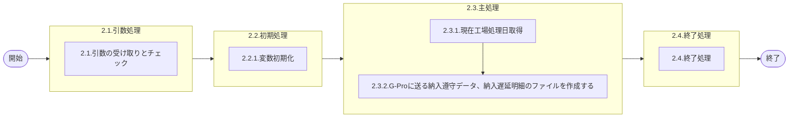

# 0. 表紙

| モジュール名 | プログラムID | プログラム名                        |
| ------------ | ------------ | ----------------------------------- |
| IC           | LDAJ0030     | 納入遵守、納入遅延データ作成(G-Pro) |

| RFC | Version | 更新日     | 更新者 | 更新内容 | 確認日     | 確認者 | 承認日     | 承認者 |
| --- | :-----: | ---------- | :----: | -------- | ---------- | :----: | ---------- | :----: |
| -   |  1.0.0  | 2025/09/28 | 陳培煌 | 初版作成 | 2025/XX/XX |  XXX  | 2025/XX/XX |  XXX  |

## 1. 処理概要

### 1.1. 機能概要

G-Proに送る納入遵守データ、納入遅延明細のファイルを作成する
※出力するファイルパスはパラメータ指定
納入遵守データは納入分析ファイルから、納入遅延明細は納入遅延明細からファイル作成
【抽出条件】
オーダー発行MRPで作成かつ
オーダー(独立所要量でない)かつ
納入指示日が過去3ヶ月以内（例：2025/7/15に処理する場合、納入指示日が2025/4～2025/6のデータ）
ログ：共通の部品を用いる(lombok)

### 1.2. 処理概要フロー



### 1.3. プログラム入出力パラメータ

#### 1.3.1. 引数

| No. | パラメータ論理名           | パラメータ物理名 | 属性   | 識別 | 備考                   |
| --- | -------------------------- | ---------------- | ------ | ---- | ---------------------- |
| 1   | 納入遵守データファイルPath |                  | String |      | "out1:" 納入遵守データ |
| 2   | 納入遅延明細ファイルPath   |                  | String |      | "out2:" 納入遅延明細   |

#### 1.3.2. 戻り値

| No. | パラメータ論理名 | パラメータ物理名 | 属性   | 備考            |
| --- | ---------------- | ---------------- | ------ | --------------- |
| 1   | リターンコード   | r_status         | String | 正常：0異常：-1 |

### 1.4. その他制御・要件

| 排他制御 |      |      |
| -------- | ---- | ---- |
| 楽観     | 悲観 | 無し |
| ●       | -    | -    |

| 項目               | 制約・制御・要件など | 記載内容説明                                                     |
| ------------------ | -------------------- | ---------------------------------------------------------------- |
| パフォーマンス要件 | 特になし。           | 特別なパフォーマンス要件がある場合に要件内容とその対処法を記述。 |

### 1.5. 入出力一覧

| No | 入出力対象 | 名称               | 物理名称            | C | R  | U | D | 備考             |
| -- | ---------- | ------------------ | ------------------- | - | -- | - | - | ---------------- |
| 1  | テーブル   | 納入分析ファイル   | ld_trn_dlv_analysis | - | ○ | - | - |                  |
| 2  | テーブル   | 納入遅延明細       | ld_trn_dlv_delay    | - | ○ | - | - |                  |
| 3  | ファイル   | 納入遵守データ     |                     |   |    |   |   | テキストファイル |
| 4  | ファイル   | 納入遅延明細       |                     |   |    |   |   | テキストファイル |
| 5  | 共通関数   | 現在工場処理日取得 | LDYS0007            |   |    |   |   |                  |

## 2. 詳細処理

### 2.1. 引数の取得とチェック

### 2.2. 初期処理

#### 2.2.1. 変数初期化

### 2.3. 主処理

#### 2.3.1. 現在工場処理日取得

- 共通関数LDYS0007をコールし、IC工場処理日を取得する
- 取得できない場合、エラーログを出力し、異常終了する
- 取得したIC工場処理日を変数.IC工場処理日にセットする

#### 2.3.2.G-Proに送る納入遵守データ、納入遅延明細のファイルを作成する

##### 2.3.2.1. 納入遵守データは納入分析ファイルからファイル作成

- 以下の条件で納入遵守データを検索する、納入遵守リストに格納する

```sql
  SELECT 納入キー
        ,受入キー
        ,生試初品区分
        ,オーダー発行区分
        ,集計月
        ,SUM(オーダー件数) AS オーダー件数
        ,SUM(遅延件数1 + 遅延件数2 + 遅延件数3 + 遅延件数4 + 遅延件数5 + 遅延件数6) AS 遅延件数
        ,SUM(先行件数1 + 先行件数2 + 先行件数3 + 先行件数4 + 先行件数5 + 先行件数6) AS 先行件数
        ,0 AS 押込件数
        ,0 AS 端数件数
        ,0 AS 短納期件数
    FROM 納入分析ファイル
   WHERE 集計月 >=  DATE_TRUNC('month',変数.IC工場処理日 - INTERVAL '3 months')
     AND 集計月 <   DATE_TRUNC('month',変数.IC工場処理日)
     AND オーダー発行区分 = '1'
     AND オーダー種別 <> '2'
     AND 生試初品区分 IN ('2', '4')
GROUP BY 納入キー, 受入キー, 生試初品区分, オーダー発行区分, 集計月
```

- 納入遵守リストは納入遵守データファイルPathに出力する
- 納入遵守リストの件数を取得

##### 2.3.2.2. 納入遅延明細データは納入遅延明細からファイル作成

- 以下の条件で納入遅延明細データを検索する、納入遅延明細リストに格納する

```sql
  SELECT 生試初品区分            AS 生試初品区分
        ,オーダー種別            AS オーダー種別
        ,納入側担当課            AS 納入側担当課
        ,納入側担当者            AS 納入側担当者
        ,供給者                  AS 供給者
        ,使用者                  AS 使用者
        ,品目番号                AS 品目番号
        ,オーダー番号            AS オーダー番号
        ,納入指示日              AS 納入指示日
        ,完了終了時間            AS 完了終了時間
        ,'1'                    AS オーダーID
        ,品目ステータス          AS 品目ステータス
        ,工程番号                AS 工程番号
        ,荷姿コード              AS 荷姿コード
        ,荷姿収容数              AS 荷姿収容数
        ,納入PF／送り先区分      AS 納入PF／送り先区分
        ,納入PF／送り先コード    AS 納入PF／送り先コード
        ,納入指示数              AS 納入指示数
        ,'1'                    AS オーダー発行区分
        ,オーダー確定日          AS オーダー確定日
        ,最新起票日              AS 起票日
        ,納入数量                AS 納入数量
        ,オーダーステータス      AS オーダーステータス
        ,直送区分                AS 直送区分
        ,'1'                      AS 納入区分
        ,削除日                  AS 削除日
        ,費用振替先区分          AS 費用振替先区分
        ,費用振替先コード        AS 費用振替先コード
        ,NULL AS 担当者
        ,理由コード              AS 理由コード
        ,NULL AS 空白1
        ,NULL AS 削除担当者
        ,削除・理由              AS 削除理由
        ,NULL AS 空白2
        ,遅延除外フラグ          AS 遅延除外フラグ
        ,遅延除外理由            AS 遅延除外理由
    FROM 納入遅延明細
   WHERE 納入指示日      >=  DATE_TRUNC('month',変数.IC工場処理日 - INTERVAL '3 months')
     AND 納入指示日      <   DATE_TRUNC('month',変数.IC工場処理日)
     AND オーダー発行区分 = '1'
     AND オーダー種別     = '1'
     AND 生試初品区分     IN ('2', '4')
```

- 納入遅延明細リストは納入遅延明細ファイルPathに出力する
- 納入遅延明細リストの件数を取得

### 2.4. 終了処理

- 納入遅延明細リストの件数、納入遵守リストの件数をログ出力する

## 3. ファイル出力（帳票、CSV、テキスト、Excelなど）

### 3.1. ファイル入出力（CSV、テキスト、Excel など）

#### 3.1.1. ファイルレイアウト

- ファイルレイアウト (納入遵守データ)

| № | 項目名 (論理名)  | 項目名 (物理名)    | データ型 | 桁数長さ | 桁数精度 | 開始位置 | KEY | 書式 | 桁未満補完文字 | 項目説明            | 備考              |
| -- | ---------------- | ------------------ | -------- | -------- | -------- | -------- | --- | ---- | -------------- | ------------------- | ----------------- |
| 1  | 納入キー         | delivery_key       | VARCHAR  | 4        |          |          | 〇  |      |                | 供給者              |                   |
| 2  | 受入キー         | receive_key        | VARCHAR  | 4        |          |          | 〇  |      |                | 使用者              |                   |
| 3  | 生試初品区分     | pilot_class        | VARCHAR  | 1        |          |          | 〇  |      |                | 2：生試、4：量産    |                   |
| 4  | オーダー発行区分 | order_create_class | VARCHAR  | 1        |          |          | 〇  |      |                | １：オーダー発行MRP |                   |
| 5  | 集計月           | sum_ym             | VARCHAR  | 6        |          |          | 〇  |      |                | 過去3ヶ月分         |                   |
| 6  | 発注件数         | order_count        | DECIMAL  | 15       | 5        |          |     |      |                |                     | GIMACでは桁数変更 |
| 7  | 遅延件数         | delay_count        | DECIMAL  | 15       | 5        |          |     |      |                |                     | GIMACでは桁数変更 |
| 8  | 先行件数         | precede_count      | DECIMAL  | 15       | 5        |          |     |      |                |                     | GIMACでは桁数変更 |
| 9  | 押込件数         | push_count         | DECIMAL  | 15       | 5        |          |     |      |                | 0                   | GIMACでは桁数変更 |
| 10 | 端数件数         | fraction_count     | DECIMAL  | 15       | 5        |          |     |      |                | 0                   | GIMACでは桁数変更 |
| 11 | 短納期件数       | short_count        | DECIMAL  | 15       | 5        |          |     |      |                | 0                   | GIMACでは桁数変更 |

- ファイルレイアウト（納入遅延明細）

| № | 項目名 (論理名)      | 項目名 (物理名)        | データ型 | 桁数長さ | 桁数精度 | 開始位置 | KEY | 書式  | 桁未満補完文字 | 項目説明                 | 備考                                                               |
| -- | -------------------- | ---------------------- | -------- | -------- | -------- | -------- | --- | ----- | -------------- | ------------------------ | ------------------------------------------------------------------ |
| 1  | 生試初品区分         | pilot_class            | VARCHAR  | 1        |          |          | 〇  |       |                | 2：生試、4：量産         |                                                                    |
| 2  | オーダー種別         | order_type             | VARCHAR  | 1        |          |          | 〇  |       |                | 1：オーダー(固定)        |                                                                    |
| 3  | 納入側担当課         | org_section_deliv      | VARCHAR  | 2        |          |          | 〇  |       |                |                          | GIMACでは桁数変更(1桁⇒2桁)                                        |
| 4  | 納入側担当者         | org_person_deliv       | VARCHAR  | 3        |          |          | 〇  |       |                |                          | GIMACでは桁数変更(2桁⇒3桁)                                        |
| 5  | 供給者               | supplier               | VARCHAR  | 4        |          |          | 〇  |       |                |                          |                                                                    |
| 6  | 使用者               | usercd                 | VARCHAR  | 4        |          |          | 〇  |       |                |                          |                                                                    |
| 7  | 品目番号             | itemno                 | VARCHAR  | 30       |          |          | 〇  |       |                |                          | GIMACでは桁数変更(14桁⇒30桁)                                      |
| 8  | オーダー番号         | order_no               | VARCHAR  | 5        |          |          | 〇  |       |                |                          |                                                                    |
| 9  | 納入指示日           | delivery_date          | VARCHAR  | 8        |          |          |     |       |                |                          |                                                                    |
| 10 | 完了終了時間         | due_end_time           | VARCHAR  | 4        |          |          |     |       |                |                          |                                                                    |
| 11 | オーダーID           | order_id               | VARCHAR  | 1        |          |          |     |       |                | 1：オーダー              |                                                                    |
| 12 | 品目ステータス       | item_status            | VARCHAR  | 1        |          |          |     |       |                |                          |                                                                    |
| 13 | 工程番号             | process_no             | VARCHAR  | 2        |          |          |     |       |                |                          |                                                                    |
| 14 | 荷姿コード           | tote_code              | VARCHAR  | 5        |          |          |     |       |                |                          |                                                                    |
| 15 | 荷姿収容数           | tote_qty               | DECIMAL  | 15       | 5        |          |     |       |                |                          | GIMACでは桁数変更                                                  |
| 16 | 納入PF／送り先区分   | pf_ind_user_class      | VARCHAR  | 1        |          |          |     |       |                |                          |                                                                    |
| 17 | 納入PF／送り先コード | pf_ind_user_code       | VARCHAR  | 4        |          |          |     |       |                |                          |                                                                    |
| 18 | 納入指示数           | delivery_qty           | DECIMAL  | 15       | 5        |          |     |       |                |                          | GIMACでは桁数変更                                                  |
| 19 | オーダー発行区分     | order_create_class     | VARCHAR  | 1        |          |          |     |       |                | 1：オーダー発行MRP       |                                                                    |
| 20 | オーダー確定日       | fixed_ymd              | VARCHAR  | 8        |          |          |     |       |                |                          |                                                                    |
| 21 | 起票日               | input_date             | VARCHAR  | 8        |          |          |     |       |                |                          |                                                                    |
| 22 | 納入数量             | reported_qty           | DECIMAL  | 15       | 5        |          |     |       |                |                          | GIMACでは桁数変更                                                  |
| 23 | オーダーステータス   | order_status           | VARCHAR  | 1        |          |          |     |       |                |                          |                                                                    |
| 24 | 直送区分             | direct_class           | VARCHAR  | 1        |          |          |     |       |                | 1：社内送り、2：直送     |                                                                    |
| 25 | 納入区分             | delivery_class         | VARCHAR  | 1        |          |          |     |       |                | 1：遅延(固定)            |                                                                    |
| 26 | 削除日               | delete_ymd             | VARCHAR  | 8        |          |          |     |       |                |                          |                                                                    |
| 27 | 費用振替先区分       | transfer_class         | VARCHAR  | 1        |          |          |     |       |                |                          |                                                                    |
| 28 | 費用振替先コード     | transfer_code          | VARCHAR  | 10       |          |          |     |       |                |                          | GIMACでは桁数変更(4桁⇒10桁)(仕様検討中、10桁からも変更の可能性有) |
| 29 | 担当者               | person_cd              | VARCHAR  | 2        |          |          |     | space |                |                          | GIMACでは項目廃止                                                  |
| 30 | 理由                 | reason_code            | VARCHAR  | 2        |          |          |     |       |                |                          |                                                                    |
| 31 | 空白1                | space1                 | VARCHAR  | 1        |          |          |     | space |                | 項目名不明のため名称空白 |                                                                    |
| 32 | 削除担当者           | delete_person          | VARCHAR  | 2        |          |          |     | space |                |                          | GIMACでは項目廃止                                                  |
| 33 | 削除理由             | delete_reason_code     | VARCHAR  | 2        |          |          |     |       |                |                          |                                                                    |
| 34 | 空白2                | space2                 | VARCHAR  | 4        |          |          |     | space |                | 項目名不明のため名称空白 |                                                                    |
| 35 | 遅延除外フラグ       | delay_exclusion_flg    | VARCHAR  | 1        |          |          |     |       |                | 0：遅延、1：遅延除外     | 新規追加                                                           |
| 36 | 除外理由             | delay_exclusion_reason | VARCHAR  | 4        |          |          |     |       |                |                          | 新規追加                                                           |

## 4. 補足

### 4.1. 補足説明任意記入
