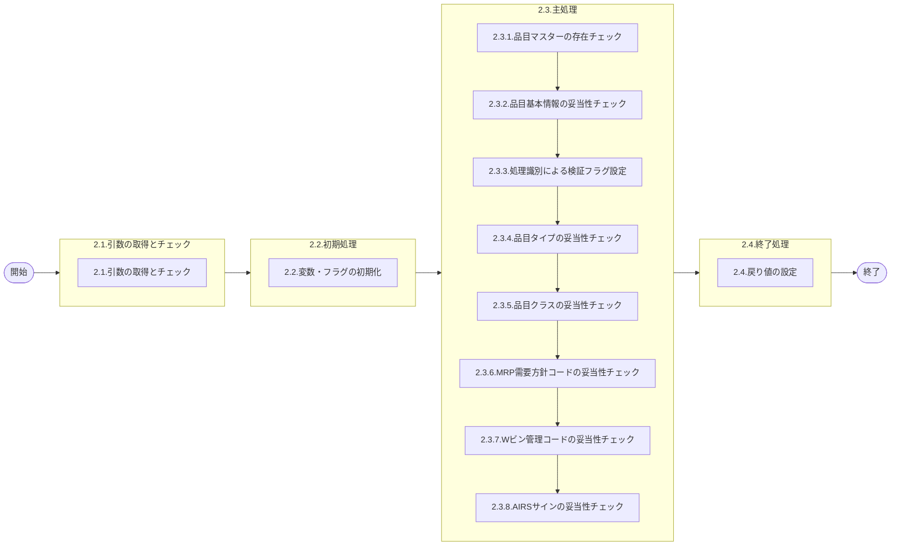

# 0. 表紙

| モジュール名 | プログラムID | プログラム名              |
| ------------ | ------------ | ------------------------- |
| IC           | LDAS0300     | Valid／品目妥当性チェック |

| RFC | Version | 更新日     | 更新者 | 更新内容 | 確認日     | 確認者 | 承認日     | 承認者 |
| --- | :-----: | ---------- | :----: | -------- | ---------- | :----: | ---------- | :----: |
| -   |  1.0.0  | 2025/09/10 | 余暁東 | 初版作成 | 2025/XX/XX |  XXX  | 2025/XX/XX |  XXX  |

## 1. 処理概要

### 1.1. 機能概要

- 品目の各項目に対してバリデーションチェックを行う。

  - 各項目に対して、品目タイプ、品目クラスチェック、MRP需要方針コード、Wビン管理コードチェック、AIRSサインチェックを行う

### 1.2. 処理概要フロー



### 1.3. プログラム入出力パラメータ

#### 1.3.1. 引数

| No. | パラメータ論理名 | パラメータ物理名 | 属性    | 備考 |
| --- | ---------------- | ---------------- | ------- | ---- |
| 1   | 処理識別         | ps_operation_id  | VARCHAR |      |
| 2   | 品目番号         | ps_itemno        | VARCHAR |      |
| 3   | 供給者           | ps_supplier      | VARCHAR |      |
| 4   | 使用者           | ps_usercd        | VARCHAR |      |

#### 1.3.2. 戻り値

| No. | パラメータ論理名   | パラメータ物理名          | 属性    | 備考                                              |
| --- | ------------------ | ------------------------- | ------- | ------------------------------------------------- |
| 1   | ステータス         | rn_status                 | INTEGER | 0:NormalEnd,-1:SQLError/-2:PGError,1:警告発生     |
| 2   | SQLコード          | rs_sql_code               | VARCHAR |                                                   |
| 3   | エラーコード       | rs_err_code               | VARCHAR |                                                   |
| 4   | エラーメッセージ   | rs_err_msg                | VARCHAR |                                                   |
| 5   | エラー位置         | rs_err_focus              | VARCHAR |                                                   |
| 6   | 品目クラス         | rs_item_class             | VARCHAR |                                                   |
| 7   | 品目ステータス     | rs_item_status            | VARCHAR |                                                   |
| 8   | MRP需要方針コード  | rs_demand_policy_code     | VARCHAR |                                                   |
| 9   | AIRSサイン         | rs_airs_sign              | VARCHAR | ※AIRSサインはMRP情報値から直接取ることが出来る。 |
| 10  | 変動安全在庫数     | rn_float_safety_stock_qty | DECIMAL |                                                   |
| 11  | シンクロ管理コード | rs_synchro_control_code   | VARCHAR |                                                   |

### 1.4. その他制御・要件

| 排他制御 |      |      |
| -------- | ---- | ---- |
| 楽観     | 悲観 | 無し |
| ●       | -    | -    |

| 項目               | 制約・制御・要件など | 記載内容説明                                                     |
| ------------------ | -------------------- | ---------------------------------------------------------------- |
| パフォーマンス要件 | 特になし。           | 特別なパフォーマンス要件がある場合に要件内容とその対処法を記述。 |

### 1.5. 入出力一覧

| No | 入出力対象 | 名称         | 物理名称               | C | R  | U | D | 備考 |
| -- | ---------- | ------------ | ---------------------- | - | -- | - | - | ---- |
| 1  | テーブル   | 品目マスター | la_itemmast            |   | ○ |   |   |      |
| 2  | テーブル   | MRP情報値    | le_mst_mrp_information |   | ○ |   |   |      |

## 2. 詳細処理

### 2.1. 引数の取得とチェック

- 引数.処理識別が　ブランク　又は　 NULL 　の場合、エラーメッセージを出力し処理終了。

  - エラーコード : E.LDP10914
  - エラーメッセージ : 'Specify the Deal Flag.',
    - (処理識別を指定してください。)
- 引数.品目番号が　ブランク　又は　 NULL 　の場合、エラーメッセージを出力し処理終了。

  - エラーコード : E.LDP10915
  - エラーメッセージ : 'Specify the Item Number.',
    - (品目番号を指定してください。)
- 引数.供給者が　ブランク　又は　 NULL 　の場合、エラーメッセージを出力し処理終了。

  - エラーコード : E.LDP10893
  - エラーメッセージ : 'Specify the Supplier.'
    - (供給者を指定してください。)
- 引数.使用者が ブランク　又は　 NULL   の場合、エラーメッセージを出力し処理終了。

  - エラーコード : E.LDP10895
  - エラーメッセージ : 'Specify the User.'
    - (使用者を指定してください。)

### 2.2. 初期処理

利用する変数を初期化する。

| No. | 変数論理名              | 初期化設定値 |
| :-: | ----------------------- | ------------ |
|  1  | 変数.品目タイプ         | スペース     |
|  2  | 変数.品目クラス         | スペース     |
|  3  | 変数.品目ステータス     | スペース     |
|  4  | 変数.MRP需要方針コード  | スペース     |
|  5  | 変数.Wビン管理コード    | スペース     |
|  6  | 変数.AIRSサイン         | スペース     |
|  7  | 変数.変動安全在庫数     | ゼロ         |
|  7  | 変数.シンクロ管理コード | スペース     |

利用するフラグを初期化する。

| No. | 変数論理名              | 初期化設定値 |
| :-: | ----------------------- | ------------ |
|  1  | 変数.品目タイプフラグ1  | N            |
|  2  | 変数.品目タイプフラグ2  | N            |
|  3  | 変数.品目クラス3        | N            |
|  4  | 変数.品目クラス4        | N            |
|  5  | 変数.MRP需要方針コード5 | N            |
|  6  | 変数.MRP需要方針コード6 | N            |
|  7  | 変数.Wビン管理コード7   | N            |
|  8  | 変数.Wビン管理コード8   | N            |
|  9  | 変数.AIRSサイン9        | N            |

#### 2.3.1. 品目マスターの存在チェック

品目マスターとMRP情報値から該当品目の情報を取得する。

```sql
SELECT item.item_type              -- item.品目タイプ
  , item.item_class                -- item.品目クラス
  , item.item_status               -- item.品目ステータス
  , mrp.demand_policy_code         -- mrp.MRP需要方針コード
  , mrp.wbin_control_code          -- mrp.Wビン管理コード
  , mrp.airs_sign                  -- mrp.AIRSサイン
  , mrp.float_safety_stock_qty     -- mrp.変動安全在庫数
  , mrp.synchro_control_code       -- mrp.シンクロ管理コード
FROM la_itemmast item      
 JOIN le_mst_mrp_information mrp   
  ON mrp.itemno = item.itemno  
 AND mrp.supplier   = item.supplier  
 AND mrp.usercd     = item.usercd  
WHERE item.itemno = ps_itemno
  AND item.supplier   = ps_supplier
  AND item.usercd   = ps_usercd;

```

item.品目タイプ        ⇒ 変数.品目タイプ
item.品目クラス        ⇒ 変数.品目クラス
item.品目ステータス    ⇒ 変数.品目ステータス
mrp.MRP需要方針コード  ⇒ 変数. MRP需要方針コード
mrp.Ｗビン管理コード   ⇒ 変数.Ｗビン管理コード
mrp.AIRSサイン         ⇒ 変数. AIRSサイン
mrp.変動安全在庫数     ⇒ 変数.変動安全在庫数
mrp.シンクロ管理コード ⇒ 変数.シンクロ管理コード

- データが存在しない場合、エラーメッセージを出力し処理終了。
  - エラーコード : E.LDP10003
  - エラーメッセージ : 'Item does not exist in the item master'
    - (指定品目が品目マスタに存在しません。)

#### 2.3.2. 品目基本情報の妥当性チェック

取得した品目情報に対して基本的な妥当性チェックを実施する。

##### 2.3.2.1. 品目クラスチェック

- 変数.品目クラス = 'M' または 'K' の場合、エラーメッセージを出力し処理終了。
  - エラーコード : E.LDP10423
  - エラーメッセージ : 'You cannot specify Product, CBU Model or CKD Model'
    - (商品・ＣＢＵ機種・ＣＫＤ機種品目は指定不可です。)

##### 2.3.2.2. 品目ステータスチェック

- 変数.品目ステータス = '1' の場合、エラーメッセージを出力し処理終了。
  - エラーコード : E.LDP10410
  - エラーメッセージ : 'You cannot specify the item of which Item Status is 1(Technical Trial)'
    - (品目ステータス＝１（技術試作）の品目は指定不可です。)

#### 2.3.3. 処理識別による検証フラグ設定

引数.処理識別に応じて、各項目の検証フラグを設定する。

| 処理識別                                     | 変数.品目タイプフラグ1 | 変数.品目タイプフラグ2 | 変数.品目クラスフラグ3 | 変数.品目クラスフラグ4 | 変数.MRP需要方針フラグ5 | 変数.MRP需要方針フラグ6 | 変数.Wビン管理フラグ7 | 変数.Wビン管理フラグ8 | 変数.AIRSサインフラグ9 |
| -------------------------------------------- | ---------------------- | ---------------------- | ---------------------- | ---------------------- | ----------------------- | ----------------------- | --------------------- | --------------------- | ---------------------- |
| LD11                                         |                        | Y                      |                        |                        | Y                       |                         | Y                     |                       |                        |
| LD41                                         |                        | Y                      | Y                      |                        | Y                       |                         | Y                     |                       |                        |
| LD71                                         |                        | Y                      | Y                      |                        |                         | Y                       |                       | Y                     |                        |
| LD21,LD15,LD18,LD28,LD33,LD46,LD48,LD52,LD68 | Y                      |                        |                        |                        |                         |                         |                       |                       |                        |
| LD14                                         | Y                      |                        |                        |                        |                         |                         | Y                     |                       | Y                      |
| LD24                                         | Y                      |                        |                        |                        |                         |                         | Y                     |                       |                        |
| LD44                                         | Y                      |                        |                        |                        |                         |                         |                       |                       | Y                      |
| LD74                                         | Y                      |                        |                        |                        |                         |                         |                       | Y                     |                        |
| LD78,LD80                                    |                        | Y                      |                        |                        |                         |                         |                       |                       |                        |
| LD81                                         |                        |                        |                        | Y                      |                         |                         |                       |                       |                        |

#### 2.3.4. 品目タイプの妥当性チェック

##### 2.3.4.1. 品目タイプフラグ1チェック

- 変数.品目タイプフラグ1 = 'Y' かつ 変数. 品目タイプ ≠ '1' の場合、エラーメッセージを出力し処理終了。
  - エラーコード : E.LDP10406
  - エラーメッセージ : 'You can specify only the item of which Item Type is 1(Standard)'
    - (品目ステータス＝１（技術試作）の品目は指定不可です。)

##### 2.3.4.2. 品目タイプフラグ2チェック

- 変数.品目タイプフラグ2 = 'Y' かつ 変数.品目タイプ ≠ '1' かつ 変数.品目タイプ ≠ '2' の場合、エラーメッセージを出力し処理終了。
  - エラーコード : E.LDP10407
  - エラーメッセージ : 'You can specify only the item of which Item Type is 1(Standard) or 2(B/T)'
    - (品目タイプ＝１（標準）、２（通過）の品目のみ指定可能です)

#### 2.3.5. 品目クラスの妥当性チェック

##### 2.3.5.1. 品目クラスフラグ3チェック

- 変数.品目クラスフラグ3 = 'Y' かつ 変数.品目クラス ≠ '0' かつ 変数.品目クラス ≠ '1' かつ 変数.品目クラス ≠ '2' の場合、エラーメッセージを出力し処理終了。
  - エラーコード : E.LDP10408
  - エラーメッセージ : 'You can specify only the item of which Item Cl. is 0(Packing Materials) or 1(Raw Materials) or 2(Parts)'
    - (品目クラス＝０（梱包資材）、１（原材料）、２（部品）の品目のみ指定可能です)

##### 2.3.5.2. 品目クラスフラグ4チェック

- 変数.品目クラスフラグ4 = 'Y' かつ 変数.品目クラス ≠ 'E' かつ 変数.品目クラス ≠ 'F' の場合、エラーメッセージを出力し処理終了。
  - エラーコード : E.LDP10501
  - エラーメッセージ : 'You cannot specify Parts'
    - (部品は指定不可です)

#### 2.3.6. MRP需要方針コードの妥当性チェック

##### 2.3.6.1. MRP需要方針コードフラグ5チェック

- 変数.MRP需要方針コードフラグ5 = 'Y' かつ (変数.MRP需要方針コード < '1' または 変数.MRP需要方針コード > '6') の場合、エラーメッセージを出力し処理終了。
  - エラーコード : E.LDP10412
  - エラーメッセージ : 'You can specify only the item of which MRP Demand Policy Code is 1 to 6'
    - (ＭＲＰ需要方針コード＝１～６の品目のみ指定可能です)

##### 2.3.6.2. MRP需要方針コードフラグ6チェック

- 変数.MRP需要方針コードフラグ6 = 'Y' かつ 変数.MRP需要方針コード ≠ '2' の場合、エラーメッセージを出力し処理終了。
  - エラーコード : E.LDP10414
  - エラーメッセージ : 'You can specify only the item of which MRP Demand Policy Code is 2(Manual Control)
    - (ＭＲＰ需要方針コード＝２（管理対象外）の品目のみ指定可能です)

#### 2.3.7. Wビン管理コードの妥当性チェック

##### 2.3.7.1. Wビン管理コードフラグ7チェック

- 変数.Wビン管理コードフラグ7 = 'Y' かつ 変数.Wビン管理コード ≠ '0' の場合、エラーメッセージを出力し処理終了。
  - エラーコード : E.LDP10415
  - エラーメッセージ : 'You can specify only the item of which W-bin Control Code is 0(Out of an object of control)'
    - (Ｗビン管理コード＝０（管理対象外）の品目のみ指定可能です)

##### 2.3.7.2. Wビン管理コードフラグ8チェック

- 変数.Wビン管理コードフラグ8 = 'Y' かつ 変数.Wビン管理コード ≠ '1' の場合、エラーメッセージを出力し処理終了。
  - エラーコード : E.LDP10416
  - エラーメッセージ : 'You can specify only the item of which W-bin Control Code is 1(An object of control)'
    - (Ｗビン管理コード＝１（管理対象）の品目のみ指定可能です)

#### 2.3.8. AIRSサインの妥当性チェック

##### 2.3.8.1. AIRSサインフラグ9チェック

- 変数.AIRSサインフラグ9 = 'Y' かつ 変数.AIRSサイン = '1' の場合、エラーメッセージを出力し処理終了。
  - エラーコード : E.LDP10420
  - エラーメッセージ : 'You cannot specify AIRS Item'
    - (ＡＩＲＳ品目は指定できません)

### 2.4. 終了処理

- 正常終了処理を行う

| 戻り値             | 設定値                         |
| ------------------ | ------------------------------ |
| 処理ステータス     | 0                              |
| SQL コード         | '0'                            |
| エラーコード       | '0'                            |
| エラーメッセージ   | ' '（スペース）                |
| エラー位置         | ' '（スペース）                |
| 品目クラス         | 2.3.1で取得.品目クラス         |
| 品目ステータス     | 2.3.1で取得.品目ステータス     |
| MRP需要方針コード  | 2.3.1で取得.MRP需要方針コード  |
| AIRSサイン         | 2.3.1で取得.AIRSサイン         |
| 変動安全在庫数     | 2.3.1で取得.変動安全在庫数     |
| シンクロ管理コード | 2.3.1で取得.シンクロ管理コード |

## 3. 補足説明

### 3.1. 戻り値について

- ステータスについて
  0 : Normal End
  -1 : Abnormal End
  -2 : PGM エラー

### 3.2. エラー発生時の対応について

- 戻り値.エラー位置 :'LDAS0300'
- SQL エラーが発生した場合、エラーログを出力して処理終了
