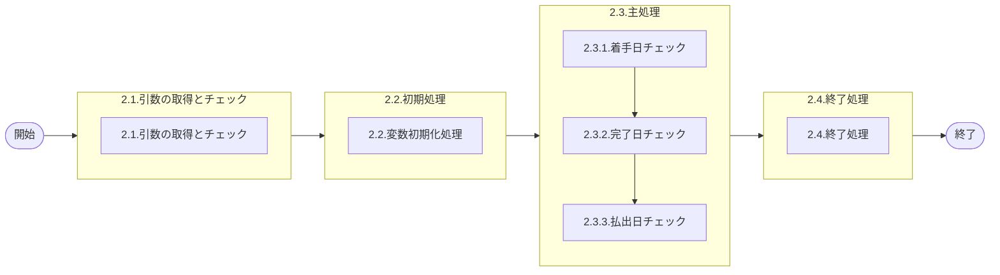

# 0. 表紙

| モジュール名 | プログラムID | プログラム名                    |
| ------------ | ------------ | ------------------------------- |
| IC           | LDAS0301     | Valid／オーダー登録日付チェック |

| RFC | Version | 更新日     | 更新者 | 更新内容 | 確認日     | 確認者 | 承認日     | 承認者 |
| --- | :-----: | ---------- | :----: | -------- | ---------- | :----: | ---------- | :----: |
| -   |  1.0.0  | 2025/09/11 | 余暁東 | 初版作成 | 2025/XX/XX |  XXX  | 2025/XX/XX |  XXX  |

## 1. 処理概要

### 1.1. 機能概要

渡されたパラメータに対してオーダー登録日付のバリデーションチェックを行う
①工場処理日取得SPを呼び工場処理日を取得する
②各登録日付チェックを行います
・払出日入力チェック、稼働日チェックを行う
・着手日入力チェック、稼働日チェック、期間チェックを行う
・完了日入力チェック、稼働日チェック、稼働日と着手日の日付比較を行う

### 1.2. 処理概要フロー



### 1.3. プログラム入出力パラメータ

#### 1.3.1. 引数

| No. | パラメータ論理名  | パラメータ物理名 | 属性    | 備考                 |
| --- | ----------------- | ---------------- | ------- | -------------------- |
| 1   | 処理識別          | ps_operation_id  | VARCHAR | LD11/71              |
| 2   | 着手日            | ps_start_date    | VARCHAR |                      |
| 3   | 完了日            | ps_due_date      | VARCHAR |                      |
| 4   | 払出日            | ps_disburse_date | VARCHAR |                      |
| 5   | 品目番号          | ps_itemno        | VARCHAR |                      |
| 6   | 供給者            | ps_supplier      | VARCHAR |                      |
| 7   | 使用者            | ps_usercd        | VARCHAR | 稼働日チェック用     |
| 8   | MRP需要方針コード | ps_demand_pol_cd | VARCHAR | 品目Ｍ値／LD71は不要 |

#### 1.3.2. 戻り値

| No. | パラメータ論理名 | パラメータ物理名 | 属性    | 備考                                          |
| --- | ---------------- | ---------------- | ------- | --------------------------------------------- |
| 1   | ステータス       | rn_status        | INTEGER | 0:NormalEnd,-1:SQLError/-2:PGError,1:警告発生 |
| 2   | SQLコード        | rs_sql_code      | VARCHAR |                                               |
| 3   | エラーコード     | rs_err_code      | VARCHAR |                                               |
| 4   | エラーメッセージ | rs_err_msg       | VARCHAR |                                               |
| 5   | エラー位置       | rs_err_focus     | VARCHAR |                                               |

### 1.4. その他制御・要件

| 排他制御 |      |      |
| -------- | ---- | ---- |
| 楽観     | 悲観 | 無し |
| ●       | -    | -    |

| 項目               | 制約・制御・要件など | 記載内容説明                                                     |
| ------------------ | -------------------- | ---------------------------------------------------------------- |
| パフォーマンス要件 | 特になし。           | 特別なパフォーマンス要件がある場合に要件内容とその対処法を記述。 |

### 1.5. 入出力一覧

| No | 入出力対象 | 名称                           | 物理名称               | C | R  | U | D | 備考 |
| -- | ---------- | ------------------------------ | ---------------------- | - | -- | - | - | ---- |
| 1  | テーブル   | SUマスタ                       | la_area_master_su      |   | ○ |   |   |      |
| 2  | テーブル   | 日別カレンダーマスター(D)       | le_mst_calendar_sum    |   | ○ |   |   |      |
| 3  | テーブル   | IC工場処理日                   | ld_mst_slip_date       |   | ○ |   |   |      |
| 4  | テーブル   | 機能オプションパラメータ       | lz_function_parameter  |   | ○ |   |   |      |
| 5  | テーブル   | 品目マスター                   | la_itemmast            |   | ○ |   |   |      |
| 6  | テーブル   | MRP情報値                      | le_mst_mrp_information |   | ○ |   |   |      |
| 7  | 共通関数   | 確定期間検索                   | LEBS0010               |   |    |   |   |      |

## 2. 詳細処理

### 2.1. 引数の取得とチェック

- 引数.着手日が　ブランク　又は　 NULL 　の場合、エラーメッセージを出力し処理終了。
  - エラーコード : ld.E.LDP10059
  - エラーメッセージ：'Specify Start Date.';
    - (着手日を指定してください。)
- 引数.完了日が　ブランク　又は　 NULL 　の場合、エラーメッセージを出力し処理終了。
  - エラーコード : ld.E.LDP10060
  - エラーメッセージ：'Specify Due Date.';
    - (完了日を指定してください。)
- 引数.払出日が   ブランク　又は　 NULL   の場合、エラーメッセージを出力し処理終了。
  - エラーコード : ld.E.LDP10061
  - エラーメッセージ：'Specify Disburse Date.';
    - (払出日を指定してください。)

### 2.2. 初期処理

利用する変数を初期化する。

### 2.3. 主処理

#### 2.3.1. 着手日チェック

##### 2.3.1.1. 現在有効カレンダー取得する

```sql
SELECT calendar_code           -- 現在有効カレンダー
  FROM la_area_master_su       -- SUマスタ
 WHERE su_code = ps_usercd;
```

- データが存在しない場合、エラーメッセージを出力し処理終了
  - エラーコード：'ld.E.LDP10062';
  - エラーメッセージ：'Effective calendar does not exist by the specified Supplier/User.';
    - (指定のＳＵで有効なカレンダーが存在しません。)

##### 2.3.1.2. 稼働日でない場合エラー

```sql
SELECT day_type                           -- 稼働日区分
  FROM le_mst_calendar_sum                -- 日別カレンダーマスター(D)
 WHERE calendar_code　＝　calendar_code    -- 2.3.1.1で取得.現在有効カレンダー
   AND calendar_ymd　＝　ps_start_date;
```

- 稼働日区分 <> '0'（稼働日） の場合、エラーメッセージを出力し処理終了

  - エラーコード：'ld.E.LDP10063';
  - エラーメッセージ：'The day you specified is not a working-day.';
    - (指定した日付が稼働日ではありません。)
- データが存在しない場合、エラーメッセージを出力し処理終了

  - エラーコード：'ld.E.LDP10064';
  - エラーメッセージ：'Day String does not exist in the common calendar.';
    - (日情報がカレンダーテーブルに存在しません。)

##### 2.3.1.3. 確定期間情報取得

```sql
SELECT fix_period_id            -- 確定期間ID
  FROM le_mst_mrp_information   -- MRP情報値
 WHERE itemno   = ps_itemno
   AND supplier = ps_supplier
   AND usercd   = ps_usercd;
```

LEBS0010（確定期間検索）をコール

```sql
SELECT * 
  FROM LEBS0010(fix_period_id,"T") --確定期間ID
```

- 戻り値．ステータスがエラー(-1)の場合、エラー返して処理を異常終了させる。
- 戻り値．ステータスがPGMエラー(-2)の場合、例外を発生させる。
- その以外、以下の情報を取得：
  - 今回_確定期間最終日

##### 2.3.1.4. IC工場処理日取得する

```sql
SELECT ic_slip_date             -- IC工場処理日
  FROM ld_mst_slip_date         -- IC工場処理日テーブル
 WHERE operation_type = 'STD'
```

- データが存在しない場合、エラーメッセージを出力し処理終了。
  - エラーコード：'ld.E.LDP10004';
  - エラーメッセージ：'The IC pymac date is not exist.';
    - (IC工場処理日が存在しません。)

##### 2.3.1.5. 着手日チェック

- 引数.処理識別が'LD11'又は'LD41'の場合

  - 引数.MRP需要方針コードが'1'(生産計画品目)又は'2'(ハンド管理品目)以外の場合
    - 引数.着手日 > 2.3.1.3で取得.今回_確定期間最終日の場合、エラーメッセージを出力し処理終了。
      - エラーコード：'ld.E.LDP10065';
      - エラーメッセージ：'For Start Date, specify the date former than the final day of the fixed order period.';
        - (着手日には発注期間最終日以前の日付を指定してください。)
- 引数.処理識別が'LD71'の場合

  - 引数.着手日 > 2.3.1.3で取得.今回_確定期間最終日の場合、エラーメッセージを出力し処理終了。
    - エラーコード：'ld.E.LDP10065';
    - エラーメッセージ：'For Start Date, specify the date former than the final day of the fixed order period.';
      - (着手日には発注期間最終日以前の日付を指定してください。)
  - 引数.着手日 <2.3.1.4で取得.IC工場処理日の場合、エラーメッセージを出力し処理終了。
    - エラーコード：'ld.E.LDP10066';
    - エラーメッセージ：'You cannot specify the past date for Start Date.';
      - (着手日には過去日付を指定できません。)

#### 2.3.2. 完了日チェック

##### 2.3.2.1. 機能選択（過去オーダー登録許可）

```sql
SELECT option_code               -- オプションコード
  FROM lz_function_parameter     -- 機能オプションパラメータ
 WHERE system_code = 'LE'
   AND function_id = 'LEA0001'
   AND select_flg  = 'T';
```

- データが存在しない場合、エラーメッセージを出力し処理終了。
  - エラーコード：'ld.E.LDP10002';
  - エラーメッセージ：'Target data does not exist in the Function Parameter table.';
    - (機能選択のデータが存在していません。)

##### 2.3.2.2. 品目タイプ取得する

```sql
SELECT item_type             -- 品目タイプ
  FROM la_itemmast           -- 品目マスター
 WHERE itemno   = ps_itemno
   AND supplier = ps_supplier
   AND usercd   = ps_usercd;
```

- データが存在しない場合、エラーメッセージを出力し処理終了。
  - エラーコード：'ld.E.LDP10067';
  - エラーメッセージ：'Data does not exist in the item master.';
    - (品目マスターに登録されていません。)

##### 2.3.2.3. 完了日チェック

- 2.3.2.1で取得.オプションコード = '0'(許可する) かつ 引数.完了日 < 2.3.1.4で取得.IC工場処理日 かつ 2.3.2.2で取得.品目タイプ <> '2'(通過品目)の場合、又は
  2.3.2.1で取得.オプションコード <> '0'(許可しない) かつ 引数.完了日 < 2.3.1.4で取得.IC工場処理日の場合、エラーメッセージを出力し処理終了。
  - エラーコード：'ld.E.LDP10068';
  - エラーメッセージ：'You cannot specify the past date for due date.';
    - (完了日には過去日付を指定できません。)

##### 2.3.2.4. 稼働日でない場合エラー

```sql
SELECT day_type                         -- 稼働日区分
  FROM le_mst_calendar_sum              -- 日別カレンダーマスター(D)
 WHERE calendar_code　＝　calendar_code -- 2.3.1.1で取得.現在有効カレンダー
   AND calendar_ymd　＝　ps_due_date;
```

- 稼働日区分 <> '0'（稼働日） の場合、エラーメッセージを出力し処理終了。

  - エラーコード：'ld.E.LDP10069';
  - エラーメッセージ：'The day you specified is not a working-day.';
    - (指定した日付が稼働日ではありません。)
- データが存在しない場合、エラーメッセージを出力し処理終了。

  - エラーコード：'ld.E.LDP10064';
  - エラーメッセージ：'Day String does not exist in the common calendar.';
    - (日情報がカレンダーテーブルに存在しません。)

##### 2.3.2.5. 引数．完了日＜引数．着手日の場合エラー

- 引数.完了日 < 引数.着手日の場合
  - 引数.処理識別が'LD11'又は'LD41'の場合、エラーメッセージを出力し処理終了。
    - エラーコード：'ld.E.LDP10070';
    - エラーメッセージ：'For Due Date, specify the date later than Start Date.';
      - (完了日には着手日より後の日付を指定してください。)
  - 引数.処理識別が'LD71'の場合、エラーメッセージを出力し処理終了。
    - エラーコード：'ld.E.LDP10071';
    - エラーメッセージ：'For Start Date, specify the date former than Due Date.';
      - (着手日には完了日より前の日付を指定してください。)

#### 2.3.3. 払出日チェック

##### 2.3.3.1. 稼働日でない かつ MRP需要方針コード<>'2'の場合エラー

```sql
SELECT day_type                        -- 稼働日区分
  FROM le_mst_calendar_sum              -- 日別カレンダーマスター(D)
 WHERE calendar_code　＝　calendar_code -- 2.3.1.1で取得.現在有効カレンダー
   AND calendar_ymd　＝　ps_disburse_date;
```

- 稼働日区分 <> '0'（稼働日） かつ 引数.MRP需要方針コード <> '2'の場合、エラーメッセージを出力し処理終了。

  - エラーコード：'ld.E.LDP10072';
  - エラーメッセージ：'The day you specified is not a working-day.';
    - (払出日が稼働日ではありません。)
- データが存在しない場合、エラーメッセージを出力し処理終了。

  - エラーコード：'ld.E.LDP10064';
  - エラーメッセージ：'Day String does not exist in the common calendar.';
    - (日情報がカレンダーテーブルに存在しません。)

##### 2.3.3.2. 引数．払出日＜引数．完了日の場合エラー

- 引数.払出日 < 引数.完了日の場合、エラーメッセージを出力し処理終了。
  - エラーコード：'ld.E.LDP10073';
  - エラーメッセージ：'For Disburse Date, specify the date later than Due Date.';
    - (払出日には完了日以降の日付を指定してください。)

##### 2.3.3.3. 着手日と払出日との差が６ヶ月より大きい場合エラー

引数.着手日と引数.払出日の月差を計算する。

月差 = (払出日の年 - 着手日の年) × 12 + (払出日の月 - 着手日の月)

- 月差 > 6 又は (月差 = 6 かつ (払出日の日 - 着手日の日) > 0)の場合、エラーメッセージを出力し処理終了
  - エラーコード：'ld.E.LDP10074';
  - エラーメッセージ：'Make the difference between Start Date and Disburse Date within 6 months.';
    - (着手日と払出日との差は６ヶ月以内に設定してください。)

### 2.4. 終了処理

- 正常終了処理を行う

| 戻り値           | 設定値   |
| ---------------- | -------- |
| 処理ステータス   | 0        |
| SQL コード       | スペース |
| エラーコード     | スペース |
| エラーメッセージ | スペース |
| エラー位置       | スペース |

## 3. 補足説明

### 3.1. 戻り値について

- ステータスについて
  0 : Normal End
  -1 : Abnormal End
  -2 : PGM エラー

### 3.2. エラー発生時の対応について

- 戻り値.エラー位置 :'LDAS0301'
- SQL エラーが発生した場合、エラーログを出力して処理終了
