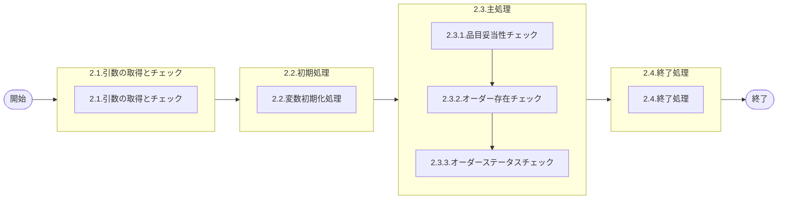

# 0. 表紙

| モジュール名 | プログラムID | プログラム名        |
| ------------ | ------------ | ------------------- |
| IC           | LDAS0314     | Valid／オーダー削除 |

| RFC       | Version | 更新日     | 更新者 | 更新内容 | 確認日     | 確認者 | 承認日     | 承認者 |
| --------- | :-----: | ---------- | :----: | -------- | ---------- | :----: | ---------- | :----: |
| XXXX-XXXX |  1.0.0  | 2025/09/15 | 余暁東 | 初版作成 | 2025/XX/XX |  XXX  | 2025/XX/XX |  XXX  |

## 1. 処理概要

### 1.1. 機能概要

削除するオーダーの各項目に対するバリデーションを定義する。

### 1.2. 処理概要フロー



### 1.3. プログラム入出力パラメータ

#### 1.3.1. 引数

| No. | パラメータ論理名   | パラメータ物理名       | 属性    | 備考                             |
| --- | ------------------ | ---------------------- | ------- | -------------------------------- |
| 1   | ユーザーID         | ps_user_id             | VARCHAR | ログインID又はSYSTEM             |
| 2   | ログ出力サイン     | ps_log_sign            | VARCHAR | 0:ログ出力しない、1:ログ出力     |
| 3   | 受信ID             | ps_receive_id          | VARCHAR | 外部データ：受信ID               |
| 4   | 相手先システム識別 | ps_request_system_code | VARCHAR | 外部データ：相手先システムコード |
| 5   | 品目番号           | ps_itemno              | VARCHAR |                                  |
| 6   | 供給者             | ps_supplier            | VARCHAR |                                  |
| 7   | 使用者             | ps_usercd              | VARCHAR |                                  |
| 8   | オーダー番号       | ps_order_no            | VARCHAR |                                  |

#### 1.3.2. 戻り値

| No. | パラメータ論理名 | パラメータ物理名 | 属性    | 備考                                               |
| --- | ---------------- | ---------------- | ------- | -------------------------------------------------- |
| 1   | 処理ステータス   | rn_status        | INTEGER | 0:正常終了、-1:SQLエラー、-2:PGMエラー、1:警告発生 |
| 2   | SQLコード        | rs_sql_code      | VARCHAR |                                                    |
| 3   | エラーコード     | rs_err_code      | VARCHAR |                                                    |
| 4   | エラーメッセージ | rs_err_msg       | VARCHAR |                                                    |
| 5   | エラー位置       | rs_err_focus     | VARCHAR |                                                    |

### 1.5. 入出力一覧

| No | 入出力対象 | 名称                      | 物理名称              | C | R  | U | D | 備考 |
| -- | ---------- | ------------------------- | --------------------- | - | -- | - | - | ---- |
| 1  | テーブル   | オーダー明細              | lc_trn_order          |   | ○ |   |   |      |
| 2  | テーブル   | オーダー明細内示          | lc_trn_order_forecast |   | ○ |   |   |      |
| 3  | 共通関数   | Valid／品目妥当性チェック | LDAS0300              |   |    |   |   |      |
| 4  | 共通関数   | エラーログ出力            | LDAS0409              |   |    |   |   |      |

## 2. 詳細処理

### 2.1. 引数の取得とチェック

- 引数.オーダー番号が　ブランク　又は　 NULL 　の場合、エラーメッセージを出力し処理終了。

  - エラーコード : E.LDP10447
  - エラーメッセージ : 'Enter Order Number.'
    - (オーダー番号を入力してください)

### 2.2. 初期処理

- 利用する変数を初期化する。

### 2.3. 主処理

#### 2.3.1. 品目妥当性チェック

LDAS0300（Valid／品目妥当性チェック）をコール。

```sql
SELECT * 
  FROM LDAS0300('LD11', 品目番号, 供給者, 使用者)
```

- 戻り値．ステータスがエラー(-1)の場合、エラー返して処理を異常終了させる。
- 戻り値．ステータスがPGMエラー(-2)の場合、例外を発生させる。

#### 2.3.2. オーダー存在チェック

##### 2.3.2.1. オーダー明細情報を取得

```sql
SELECT オーダーステータス
  FROM オーダー明細
 WHERE 品目番号 = 引数.品目番号
   AND 供給者 = 引数.供給者
   AND 使用者 = 引数.使用者
   AND オーダー番号 = 引数.オーダー番号;
```

##### 2.3.2.2. オーダー明細に存在しない場合、オーダー明細内示テーブルをチェック

```sql
SELECT オーダーステータス
  FROM オーダー明細内示
 WHERE 品目番号 = 引数.品目番号
   AND 供給者 = 引数.供給者
   AND 使用者 = 引数.使用者
   AND オーダー番号 = 引数.オーダー番号;
```

- どちらのテーブルにも存在しない場合、エラーメッセージを出力し処理終了。
  - エラーコード：'E.LDP10527'
  - エラーメッセージ：'The order you specified does not exist.'
    - (指定オーダーが存在しません。)

#### 2.3.3. オーダーステータスチェック

- 2.3.2.1で取得.オーダーステータス = '9'の場合、エラーメッセージを出力し処理終了。
  - エラーコード：'E.LDP10528'
  - エラーメッセージ：'You cannot specify the closed order.'
    - (完了済オーダーは指定できません。)

### 2.4. 終了処理

- 正常終了処理を行う

| 戻り値           | 設定値   |
| ---------------- | -------- |
| 処理ステータス   | 0        |
| SQLコード        | スペース |
| エラーコード     | スペース |
| エラーメッセージ | スペース |
| エラー位置       | スペース |

## 3. 補足説明

### 3.1. 戻り値について

- 処理ステータス
  - 0: 正常終了
  - 1: 警告発生（処理は継続）
  - -1: SQLエラー
  - -2: プログラムエラー

### 3.2. エラー発生時の対応について

- 戻り値.エラー位置 :'LDAS0314'
- SQLエラーが発生した場合、戻り値を返して処理終了。
- PGMエラーが発生した場合、
  - 引数.ログ出力サイン＝'1'の場合、エラーログファイルを1レコード生成する。
    ＊ LDAS0409：エラーログ登録を実行する。
  - 戻り値を返して処理終了。

＊ LDAS0409：エラーログ登録

| No. | 引数                       | I/O | ｾｯﾄ値                |
| --- | -------------------------- | --- | ----------------------- |
| 1   | 作成区分                   | I   | '99'                    |
| 2   | 入力ユーザーＩＤ           | I   | 引数.ユーザーＩＤ       |
| 3   | エラーコード               | I   | 戻り値.エラーコード     |
| 4   | 処理識別                   | I   | 'LD11'                  |
| 5   | 変更区分                   | I   | '3'                     |
| 6   | エラーレベルステータス     | I   | '9'                     |
| 7   | 受信ＩＤ                   | I   | 引数.受信ＩＤ           |
| 8   | 相手先システム識別         | I   | 引数.相手先システム識別 |
| 9   | 入力元トランザクション     | I   | ' '                     |
| 10  | エラー発生処理ＩＤ         | I   | LDAS0314                |
| 11  | 品目番号                   | I   | 引数.品目番号           |
| 12  | 供給者                     | I   | 引数.供給者             |
| 13  | 使用者                     | I   | 引数.使用者             |
| 14  | オーダー番号               | I   | 引数.オーダー番号       |
| 15  | 伝票番号                   | I   | ' '                     |
| 16  | 引落区分                   | I   | ' '                     |
| 17  | 数量                       | I   | 0                       |
| 18  | 理由コード（発注理由）     | I   | ' '                     |
| 19  | 費用振替先区分             | I   | ' '                     |
| 20  | 費用振替先コード           | I   | ' '                     |
| 21  | 勘定科目コード             | I   | ' '                     |
| 22  | 目的No                     | I   | ' '                     |
| 23  | 受払種別コード             | I   | ' '                     |
| 24  | 生試処理タイプ             | I   | ' '                     |
| 25  | 着手日                     | I   | ' '                     |
| 26  | 納入日                     | I   | ' '                     |
| 27  | 払出日                     | I   | ' '                     |
| 28  | 完了開始時間               | I   | ' '                     |
| 29  | 完了終了時間               | I   | ' '                     |
| 30  | 繰越調整数                 | I   | ' '                     |
| 31  | 生試初品区分               | I   | ' '                     |
| 32  | 所要量区分                 | I   | ' '                     |
| 33  | 独立需要送り先区分         | I   | ' '                     |
| 34  | 独立需要送り先コード       | I   | ' '                     |
| 35  | 振替理由コード             | I   | ' '                     |
| 36  | 削除日付                   | I   | ' '                     |
| 37  | フリーコメント             | I   | ' '                     |
| 38  | サービスパーツ特別発注区分 | I   | ' '                     |
| 39  | サービスパーツ直納先コード | I   | ' '                     |
| 40  | サービスパーツディーラNO   | I   | ' '                     |
| 41  | サービスパーツ受注番号     | I   | ' '                     |
| 42  | 着手／払出日               | I   | ' '                     |
| 43  | 納品書番号                 | I   | ' '                     |
| 44  | 保留在庫数                 | I   | 0                       |
| 45  | 起票日                     | I   | ' '                     |
| 46  | 責任工程                   | I   | ' '                     |
| 47  | 責任職場／メーカー区分     | I   | ' '                     |
| 48  | 責任職場／メーカー         | I   | ' '                     |
| 49  | 組立ライン                 | I   | ' '                     |
| 50  | 組立順序番号               | I   | ' '                     |
| 51  | 金額                       | I   | ' '                     |
| 52  | 移動先使用者               | I   | ' '                     |
| 53  | 仕掛サイン                 | I   | ' '                     |
| 54  | インボイスNo               | I   | ' '                     |
| 55  | B/L No                     | I   | ' '                     |
| 56  | ケースNo                   | I   | ' '                     |
| 57  | ケースマークオーダ番号     | I   | ' '                     |
| 58  | G-SDMオーダー番号          | I   | ' '                     |
| 59  | 外売品フラグ               | I   | ' '                     |
| 60  | HU-ID                      | I   | ' '                     |
| 61  | 工程番号                   | I   | ' '                     |
| 62  | 原価用品目番号             | I   | ' '                     |
| 63  | 原価用供給者               | I   | ' '                     |
| 64  | 原価用使用者               | I   | ' '                     |
| 65  | 原価用オーダー番号         | I   | ' '                     |
| 66  | エラーレベル品目番号       | I   | 引数.品目番号           |
| 67  | エラーレベル供給者         | I   | 引数.供給者             |
| 68  | エラーレベル使用者         | I   | 引数.使用者             |
| 69  | エラーレベル数量           | I   | ' '                     |
| 70  | エラーレベル着手日         | I   | ' '                     |
| 71  | エラーレベル納入日         | I   | ' '                     |
| 72  | エラーレベル払出日         | I   | ' '                     |
