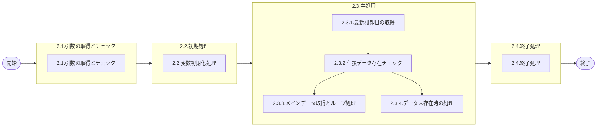

# .0. 表紙

| モジュール名 | プログラムID | プログラム名     |
| ------------ | ------------ | ---------------- |
| IC           | LDAS9000     | 仕損報告情報取得 |

| RFC | Version | 更新日     | 更新者 | 更新内容 | 確認日     | 確認者 | 承認日     | 承認者 |
| --- | :-----: | ---------- | :----: | -------- | ---------- | :----: | ---------- | :----: |
| -   |  1.0.0  | 2025/09/22 | 余暁東 | 初版作成 | 2025/XX/XX |  XXX  | 2025/XX/XX |  XXX  |

## 1. 処理概要

### 1.1. 機能概要

引数にて取得した担当課から棚卸前理論在庫ファイルより仕損報告を取得しリターンする。

### 1.2. 処理概要フロー



### 1.3. プログラム入出力パラメータ

#### 1.3.1. 引数

| No. | パラメータ論理名 | パラメータ物理名 | 属性    | 備考 |
| --- | ---------------- | ---------------- | ------- | ---- |
| 1   | 担当課           | ps_section       | VARCHAR |      |

#### 1.3.2. 戻り値

| No. | パラメータ論理名       | パラメータ物理名      | 属性    | 備考                                 |
| --- | ---------------------- | --------------------- | ------- | ------------------------------------ |
| 1   | 処理ステータス         | rn_status             | INTEGER | 0:正常終了-1,-2:異常終了100:NOTFOUND |
| 2   | SQLコード              | rs_sql_code           | VARCHAR |                                      |
| 3   | エラーコード           | rs_err_code           | VARCHAR |                                      |
| 4   | エラーメッセージ       | rs_err_msg            | VARCHAR |                                      |
| 5   | エラー位置             | rs_err_focus          | VARCHAR |                                      |
| 6   | 部品番号               | rs_itemno             | VARCHAR |                                      |
| 7   | 供給者                 | rs_supplier           | VARCHAR |                                      |
| 8   | 使用者                 | rs_usercd             | VARCHAR |                                      |
| 9   | 品目ステータス         | rs_item_status        | VARCHAR |                                      |
| 10  | 品目名称               | rs_item_name          | VARCHAR |                                      |
| 11  | PYMAC部門コード        | rs_pymac_dept_code    | VARCHAR |                                      |
| 12  | 工程番号               | rs_process_no         | VARCHAR |                                      |
| 13  | 投入作業区             | rs_input_work_center  | VARCHAR |                                      |
| 14  | 納入PF番号             | rs_deliv_pf_no        | VARCHAR |                                      |
| 15  | 出庫数－SIR            | rn_toq_sir            | VARCHAR |                                      |
| 16  | 出庫数－HAND           | rn_toq_hand           | DECIMAL |                                      |
| 17  | 出庫数－非製造         | rn_toq_nonmanufact    | DECIMAL |                                      |
| 18  | 出庫数－仕損（使用中） | rn_toq_scrap_use      | DECIMAL |                                      |
| 19  | 出庫数－仕損（SIR）    | rn_toq_scrap_sir      | DECIMAL |                                      |
| 20  | 出庫数－サービス       | rn_toq_service        | DECIMAL |                                      |
| 21  | 出庫数－CKD            | rn_toq_ckd            | DECIMAL |                                      |
| 22  | 出庫数－返品           | rn_toq_back           | DECIMAL |                                      |
| 23  | 製造中仕損率           | rn_manuf_scrap_ratio  | DECIMAL |                                      |
| 24  | 使用中仕損率           | rn_use_scrap_ratio    | DECIMAL |                                      |
| 25  | 入庫数（累計）         | rn_total_in_qty       | DECIMAL |                                      |
| 26  | 出庫数－仕損（製造中） | rn_toq_scrap_manufact | DECIMAL |                                      |
| 27  | 品目クラス             | rs_item_class         | VARCHAR |                                      |
| 28  | 品目分類コード         | rs_reference_key      | VARCHAR |                                      |
| 29  | 組織略称               | rs_org_abbr           | VARCHAR |                                      |

### 1.4. その他制御・要件

| 排他制御 |      |      |
| -------- | ---- | ---- |
| 楽観     | 悲観 | 無し |
| ●       | -    | -    |

| 項目               | 制約・制御・要件など | 記載内容説明                                                     |
| ------------------ | -------------------- | ---------------------------------------------------------------- |
| パフォーマンス要件 | 特になし。           | 特別なパフォーマンス要件がある場合に要件内容とその対処法を記述。 |

### 1.5. 入出力一覧

| No | 入出力対象 | 名称                   | 物理名称               | C | R  | U | D | 備考                   |
| -- | ---------- | ---------------------- | ---------------------- | - | -- | - | - | ---------------------- |
| 1  | テーブル   | 品目マスター           | la_itemmast            | - | ○ | - | - |                        |
| 2  | テーブル   | 品目共通               | la_itemcomn            | - | ○ | - | - |                        |
| 3  | テーブル   | MRP情報値              | le_mst_mrp_information | - | ○ | - | - |                        |
| 4  | テーブル   | 棚卸管理マスタ         | ld_mst_st_control      | - | ○ | - | - | (旧)ld_jp_st_cntl_mast |
| 5  | テーブル   | 棚卸前理論在庫ファイル | ld_trn_st_logic_inv    | - | ○ | - | - | (旧)ld_jp_st_logic_inv |

## 2. 詳細処理

### 2.1. 引数の取得とチェック

- 担当課が NULL または 空文字 の場合、エラーメッセージを出力し処理終了。
  - エラーコード：'E.LDP10991'
  - エラーメッセージ：'Please specify Section Code.'
    - (担当課を指定ください。)
  - エラー位置 : ' '

### 2.2. 初期処理

- 利用する変数を初期化する。

### 2.3. 主処理

#### 2.3.1. 最新棚卸日の取得

棚卸管理マスタから最新の棚卸日を取得する。

```sql
SELECT MAX(棚卸日)
  FROM 棚卸管理マスタ
 WHERE 棚卸区分 IN ('1', '2')
   AND 棚卸ステータス >= '4'
```

#### 2.3.2. 仕損データ存在チェック

仕損に関連するデータが存在するかチェックする。

```sql
SELECT 1
  FROM 棚卸前理論在庫ファイル a
      ,MRP情報値 b
      ,品目共通 c
      ,GIMACエリアマスタ d
      ,SUマスタ e
 WHERE a.棚卸日 = 2.3.1で取得.最新棚卸日
   AND d.エリアコード = e.エリアコード
   AND e.SUコード = a.使用者
   AND d.担当課 LIKE 引数.担当課 || '%'
   AND a.品目タイプ = '1'
   AND a.品目クラス = '2'
   AND a.使用者 <> '8999'
   AND b.品目番号 = a.品目番号
   AND b.供給者 = a.供給者
   AND b.使用者 = a.使用者
   AND (b.製造中仕損率 <> '0'
    OR b.使用中仕損率 <> '0'
    OR a.出庫数-仕損(SIR) <> '0'
    OR a.出庫数-仕損(使用中) <> '0'
    OR a.出庫数-仕損(製造中) <> '0')
   AND ((a.出庫数-SIR + a.出庫数-HAND + a.出庫数-非製造 + a.出庫数-サービス + a.出庫数-CKD + a.出庫数-返品) <> '0'
    OR a.入庫数(累計) <> '0')
   AND c.品目番号 = a.品目番号
```

#### 2.3.3. メインデータ取得とループ処理

仕損データ存在チェックでデータが存在する場合、以下のSQLでデータを取得し、、該当データがなくなるまでループ処理で各レコードを戻り値に設定してリターンする。

```sql
SELECT a.品目番号 AS 品目番号
      ,a.供給者 AS 供給者
      ,a.使用者 AS 使用者
      ,a.品目ステータス AS 品目ステータス
      ,c.品目名称 AS 品目名称
      ,d.PYMAC部門コード AS PYMAC部門コード
      ,a.工程番号 AS 工程番号
      ,a.投入作業区 AS 投入作業区
      ,a.納入PF番号 AS 納入PF番号
      ,a.出庫数-SIR AS 出庫数-SIR
      ,a.出庫数-HAND AS 出庫数-HAND
      ,a.出庫数-非製造 AS 出庫数-非製造
      ,a.出庫数-仕損(使用中) AS 出庫数-仕損(使用中)
      ,a.出庫数-仕損(SIR) AS 出庫数-仕損(SIR)
      ,a.出庫数-サービス AS 出庫数-サービス
      ,a.出庫数-CKD AS 出庫数-CKD
      ,a.出庫数-返品 AS 出庫数-返品
      ,b.製造中仕損率 AS 製造中仕損率
      ,b.使用中仕損率 AS 使用中仕損率
      ,a.入庫数(累計) AS 入庫数(累計)
      ,a.出庫数-仕損(製造中) AS 出庫数-仕損(製造中)
      ,a.品目クラス AS 品目クラス
      ,a.品目分類コード AS 品目分類コード
      ,d.組織略称 AS 組織略称
  FROM 棚卸前理論在庫ファイル a
      ,MRP情報値 b
      ,品目共通 c
      ,GIMACエリアマスタ d
      ,SUマスタ e
 WHERE a.棚卸日 = 2.3.1で取得.最新棚卸日
   AND d.エリアコード = e.エリアコード
   AND e.SUコード = a.使用者
   AND d.担当課 LIKE 引数.担当課 || '%'
   AND a.品目タイプ = '1'
   AND a.品目クラス = '2'
   AND a.使用者 <> '8999'
   AND b.品目番号 = a.品目番号
   AND b.供給者 = a.供給者
   AND b.使用者 = a.使用者
   AND (b.製造中仕損率 <> '0'
    OR b.使用中仕損率 <> '0'
    OR a.出庫数-仕損(SIR) <> '0'
    OR a.出庫数-仕損(使用中) <> '0'
    OR a.出庫数-仕損(製造中) <> '0')
   AND ((a.出庫数-SIR + a.出庫数-HAND + a.出庫数-非製造 + a.出庫数-サービス + a.出庫数-CKD + a.出庫数-返品) <> '0'
    OR a.入庫数(累計) <> '0')
   AND c.品目番号 = a.品目番号
 ORDER BY d.担当課
         ,a.使用者
         ,a.納入PF番号
         ,a.投入作業区
         ,a.供給者
         ,a.品目番号
```

該当データがなくなるまで以下の処理を繰り返す：

- 処理ステータス = 0
- 取得した各項目を対応する戻り値パラメータに設定
- 結果を戻す

#### 2.3.4. データ未存在時の処理

存在チェックでデータが存在しない場合：

- 処理ステータス = 100
- その他の項目は初期値のまま
- 結果を戻す

### 2.4. 終了処理

該当データがなくなるまでのループ処理が完了した場合、RETURNで処理を終了する。

## 3. 補足説明

### 3.1. 戻り値について

- 処理ステータス
  - 0: 正常終了
  - 100: データなし
  - -1: SQLエラー
  - -2: プログラムエラー

### 3.2. エラー発生時の対応について

#### 3.2.1. プログラムエラー

引数チェック等でプログラムエラーが発生した場合：

- 処理ステータス = -2
- エラーコードとエラーメッセージに詳細情報を設定
- その他の項目は初期値またはスペースを設定
- 結果をリターンして処理終了

#### 3.2.2. SQLエラー

データベースアクセス時にSQLエラーが発生した場合：

- 処理ステータス = -1
- SQLコードにSQLSTATEを設定
- エラーメッセージにSQLERRMを設定
- その他の項目は初期値またはスペースを設定
- 結果をリターンして処理終了
