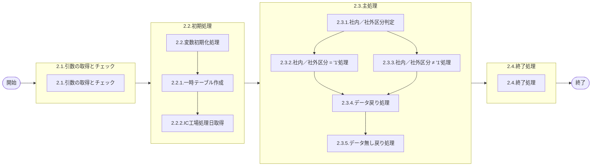

# 0. 表紙

| モジュール名 | プログラムID | プログラム名             |
| ------------ | ------------ | ------------------------ |
| IC           | LDAS9001     | 未受入問合せ(複数SU指定) |

| RFC | Version | 更新日     | 更新者 | 更新内容 | 確認日     | 確認者 | 承認日     | 承認者 |
| --- | :-----: | ---------- | :----: | -------- | ---------- | :----: | ---------- | :----: |
| -   |  1.0.0  | 2025/09/24 | 余暁東 | 初版作成 | 2025/XX/XX |  XXX  | 2025/XX/XX |  XXX  |

## 1. 処理概要

### 1.1. 機能概要

複数SU指定のオーダー明細と独立所要量明細の未受入問合せを返す。

### 1.2. 処理概要フロー



### 1.3. プログラム入出力パラメータ

#### 1.3.1. 引数

| No. | パラメータ論理名 | パラメータ物理名 | 属性    | 備考              |
| --- | ---------------- | ---------------- | ------- | ----------------- |
| 1   | 抽出期間開始日   | ps_start_date    | VARCHAR |                   |
| 2   | 抽出期間終了日   | ps_end_date      | VARCHAR |                   |
| 3   | 納入PF番号       | ps_deliv_pf_no   | VARCHAR |                   |
| 4   | 社内／社外区分   | ps_org_category  | VARCHAR | 1:ALL2:社内3:社外 |
| 5   | 供給者           | ps_supplier      | VARCHAR |                   |
| 6   | 生試初品区分     | ps_pilot_class   | VARCHAR |                   |
| 7   | 先行リードタイム | pn_precede_lt    | DECIMAL |                   |
| 8   | Ｗビン管理コード | ps_wbin_ctrl_cd  | VARCHAR |                   |
| 9   | 使用者01         | ps_usercd01      | VARCHAR |                   |
| 10  | 使用者02         | ps_usercd02      | VARCHAR |                   |
| 11  | 使用者03         | ps_usercd03      | VARCHAR |                   |
| 12  | 使用者04         | ps_usercd04      | VARCHAR |                   |
| 13  | 使用者05         | ps_usercd05      | VARCHAR |                   |
| 14  | 使用者06         | ps_usercd06      | VARCHAR |                   |
| 15  | 使用者07         | ps_usercd07      | VARCHAR |                   |
| 16  | 使用者08         | ps_usercd08      | VARCHAR |                   |
| 17  | 使用者09         | ps_usercd09      | VARCHAR |                   |
| 18  | 使用者10         | ps_usercd10      | VARCHAR |                   |
| 19  | 使用者11         | ps_usercd11      | VARCHAR |                   |
| 20  | 使用者12         | ps_usercd12      | VARCHAR |                   |
| 21  | 使用者13         | ps_usercd13      | VARCHAR |                   |
| 22  | 使用者14         | ps_usercd14      | VARCHAR |                   |
| 23  | 使用者15         | ps_usercd15      | VARCHAR |                   |
| 24  | 使用者16         | ps_usercd16      | VARCHAR |                   |
| 25  | 使用者17         | ps_usercd17      | VARCHAR |                   |
| 26  | 使用者18         | ps_usercd18      | VARCHAR |                   |
| 27  | 使用者19         | ps_usercd19      | VARCHAR |                   |
| 28  | 使用者20         | ps_usercd20      | VARCHAR |                   |
| 29  | 使用者21         | ps_usercd21      | VARCHAR |                   |
| 30  | 使用者22         | ps_usercd22      | VARCHAR |                   |
| 31  | 使用者23         | ps_usercd23      | VARCHAR |                   |
| 32  | 使用者24         | ps_usercd24      | VARCHAR |                   |
| 33  | 使用者25         | ps_usercd25      | VARCHAR |                   |
| 34  | 使用者26         | ps_usercd26      | VARCHAR |                   |
| 35  | 使用者27         | ps_usercd27      | VARCHAR |                   |
| 36  | 使用者28         | ps_usercd28      | VARCHAR |                   |
| 37  | 使用者29         | ps_usercd29      | VARCHAR |                   |
| 38  | 使用者30         | ps_usercd30      | VARCHAR |                   |
| 39  | 使用者31         | ps_usercd31      | VARCHAR |                   |
| 40  | 使用者32         | ps_usercd32      | VARCHAR |                   |
| 41  | 使用者33         | ps_usercd33      | VARCHAR |                   |
| 42  | 使用者34         | ps_usercd34      | VARCHAR |                   |
| 43  | 使用者35         | ps_usercd35      | VARCHAR |                   |
| 44  | 使用者36         | ps_usercd36      | VARCHAR |                   |
| 45  | 使用者37         | ps_usercd37      | VARCHAR |                   |
| 46  | 使用者38         | ps_usercd38      | VARCHAR |                   |
| 47  | 使用者39         | ps_usercd39      | VARCHAR |                   |
| 48  | 使用者40         | ps_usercd40      | VARCHAR |                   |
| 49  | 使用者41         | ps_usercd41      | VARCHAR |                   |
| 50  | 使用者42         | ps_usercd42      | VARCHAR |                   |
| 51  | 使用者43         | ps_usercd43      | VARCHAR |                   |
| 52  | 使用者44         | ps_usercd44      | VARCHAR |                   |
| 53  | 使用者45         | ps_usercd45      | VARCHAR |                   |
| 54  | 使用者46         | ps_usercd46      | VARCHAR |                   |
| 55  | 使用者47         | ps_usercd47      | VARCHAR |                   |
| 56  | 使用者48         | ps_usercd48      | VARCHAR |                   |
| 57  | 使用者49         | ps_usercd49      | VARCHAR |                   |
| 58  | 使用者50         | ps_usercd50      | VARCHAR |                   |

#### 1.3.2. 戻り値

| No. | パラメータ論理名 | パラメータ物理名  | 属性    | 備考                               |
| --- | ---------------- | ----------------- | ------- | ---------------------------------- |
| 1   | 処理ステータス   | rn_status         | INTEGER | 0:Normal-1:SqlError-2:ProgramError |
| 2   | SQLコード        | rs_sql_code       | VARCHAR |                                    |
| 3   | エラーコード     | rs_err_code       | VARCHAR |                                    |
| 4   | エラーメッセージ | rs_err_msg        | VARCHAR |                                    |
| 5   | エラー位置       | rs_err_focus      | VARCHAR |                                    |
| 6   | 遅延日数         | rn_delay_days     | INTEGER |                                    |
| 7   | 品目番号         | rs_itemno         | VARCHAR |                                    |
| 8   | 供給者           | rs_supplier       | VARCHAR |                                    |
| 9   | 使用者           | rs_usercd         | VARCHAR |                                    |
| 10  | 先行リードタイム | rn_precede_lt     | DECIMAL |                                    |
| 11  | 納入PF番号       | rs_deliv_pf_no    | VARCHAR |                                    |
| 12  | 格納ロケ         | rs_stock_location | VARCHAR |                                    |
| 13  | 品目名称         | rs_item_name      | VARCHAR |                                    |
| 14  | オーダー番号     | rs_order_no       | VARCHAR |                                    |
| 15  | 着手日           | rs_start_date     | VARCHAR |                                    |
| 16  | 完了終了時間     | rs_due_end_time   | VARCHAR |                                    |
| 17  | 所要数           | rn_required_qty   | DECIMAL |                                    |
| 18  | オーダー残数     | rn_bo_qty         | DECIMAL |                                    |
| 19  | 生試初品区分     | rs_pilot_class    | VARCHAR |                                    |

### 1.4. その他制御・要件

| 排他制御 |      |      |
| -------- | ---- | ---- |
| 楽観     | 悲観 | 無し |
| ●       | -    | -    |

| 項目               | 制約・制御・要件など | 記載内容説明                                                     |
| ------------------ | -------------------- | ---------------------------------------------------------------- |
| パフォーマンス要件 | 特になし。           | 特別なパフォーマンス要件がある場合に要件内容とその対処法を記述。 |

### 1.5. 入出力一覧

| No | 入出力対象 | 名称                      | 物理名称               | C | R  | U | D | 備考 |
| -- | ---------- | ------------------------- | ---------------------- | - | -- | - | - | ---- |
| 1  | テーブル   | IC工場処理日              | ld_mst_slip_date       | - | ○ | - | - |      |
| 2  | テーブル   | MRP情報値                 | le_mst_mrp_information | - | ○ | - | - |      |
| 3  | テーブル   | 品目共通                  | la_itemcomn            | - | ○ | - | - |      |
| 4  | テーブル   | SUマスタ                  | la_area_master_su      | - | ○ | - | - |      |
| 5  | テーブル   | オーダー明細              | le_trn_order           | - | ○ | - | - |      |
| 6  | テーブル   | 独立所要量明細            | le_trn_ird             | - | ○ | - | - |      |
| 7  | テーブル   | 日別カレンダーマスタ（D） | le_mst_calendar_sum    | - | ○ | - | - |      |

## 2. 詳細処理

### 2.1. 引数の取得とチェック

なし。

### 2.2. 初期処理

#### 2.2.1. 変数初期化処理

- 利用する変数を初期化する。

#### 2.2.2. 一時テーブル作成

未受入問合せ結果格納用の一時テーブルを作成する。

```sql
CREATE TEMP TABLE temp_date(
     delay_days                   INTEGER,     --遅延日数
     itemno                       VARCHAR(30), --品目番号
     supplier                     VARCHAR(04), --供給者
     usercd                       VARCHAR(04), --使用者
     precede_lt                   DECIMAL,     --先行リードタイム
     deliv_pf_no                  VARCHAR(04), --納入PF番号
     stock_location               VARCHAR(05), --格納ロケ
     item_name                    VARCHAR(30), --品目名称
     order_no                     VARCHAR(05), --オーダー番号
     start_date                   VARCHAR(08), --着手日
     due_end_time                 VARCHAR(04), --完了終了時間
     required_qty                 DECIMAL,     --所要数
     bo_qty                       DECIMAL,     --オーダー残数
     pilot_class                  VARCHAR(01)  --生試初品区分
)ON COMMIT DROP
```

#### 2.2.3. IC工場処理日取得

```sql
SELECT IC工場処理日
  FROM IC工場処理日
　WHERE 処理タイプ = 'STD' 
```

- データが存在しない場合：
  - エラーコード：'E.LDP10911'
  - エラーメッセージ：'The IC pymac date is not exist. '

### 2.3. 主処理

#### 2.3.1. 社内／社外区分判定

引数.社内／社外区分により処理を分岐する。

- 社内／社外区分 = '1'（ALL）の場合：2.3.2へ
- 社内／社外区分 ≠ '1'の場合：2.3.3へ

#### 2.3.2. 社内／社外区分 = '1'（ALL）処理

##### 2.3.2.1. オーダー明細未受入データ存在チェック・取得処理

```sql
SELECT B.品目番号
      ,B.供給者
      ,B.使用者
      ,A.先行リードタイム
      ,A.納入PF番号
      ,A.格納ロケーション
      ,D.品目名称
      ,B.オーダー番号
      ,B.完了日
      ,B.完了終了時間
      ,B.オーダー数
      ,B.オーダー残数
      ,B.生試初品区分
      ,C.現在有効カレンダー
  FROM MRP情報値 A
  LEFT OUTER JOIN 品目共通 D
    ON (D.品目番号 = A.品目番号)
      ,オーダー明細 B
      ,SUマスタ C
 WHERE A.品目番号    = B.品目番号
   AND A.供給者      = B.供給者
   AND A.使用者      = B.使用者
   AND A.供給者     <> A.使用者
   AND C.SUコード    = A.使用者
   AND A.使用者  IN (引数.使用者01, 引数.使用者02, ..., 引数.使用者50)
   AND ((A.Wビン管理コード = '0' AND 引数.Ｗビン管理コード = '0')
       OR 引数.Ｗビン管理コード = '1')
   AND B.オーダーステータス = '2'
   AND B.オーダー残数 > 0
   AND (引数.生試初品区分 = '1'
       OR (引数.生試初品区分 = '4' AND B.生試初品区分 = ' ')
       OR (引数.生試初品区分 = '3' AND B.生試初品区分 = '3')
       OR (引数.生試初品区分 = '2' AND B.生試初品区分 IN ('2','4')))
   AND (TRIM(引数.供給者)    = '' OR A.供給者    = 引数.供給者)
   AND (TRIM(引数.納入PF番号) = '' OR A.納入PF番号 = 引数.納入PF番号)
   AND (引数.先行リードタイム IS NULL OR A.先行リードタイム  = 引数.先行リードタイム)
   AND (TRIM(引数.抽出期間開始日)  = '' OR B.完了日 >= 引数.抽出期間開始日)
   AND B.完了日 <= 引数.抽出期間終了日
```

※各レコードに対して、以下の処理を行う：

**遅延日数計算処理（取得した.完了日とIC工場処理日の日数差）**

- 取得した.完了日 > 2.2.3.で取得.IC工場処理日の場合：
  - 変数.開始日 = IC工場処理日 + 1日
  - 変数.終了日 = 取得した.完了日
- 取得した.完了日 < 2.2.3.で取得.IC工場処理日の場合：
  - 変数.開始日 = 取得した.完了日
  - 変数.終了日 = IC工場処理日 - 1日

* 取得した.完了日がIC工場処理日と同じでない場合、日別カレンダーマスタから遅延日数を取得：

```sql
SELECT COUNT(1)
  FROM 日別カレンダーマスター(D)
 WHERE カレンダーコード = 2.3.2.1で取得.カレンダーコード
   AND 稼働日区分 = '0'
   AND カレンダー年月日 >= 変数.開始日
   AND カレンダー年月日 <= 変数.終了日
```

- 取得した.完了日 < 2.2.3.で取得.IC工場処理日の場合、遅延日数をマイナスに変換
- 取得した.完了日 = 2.2.3.で取得.IC工場処理日の場合、遅延日数 = 0

**一時テーブルへの挿入**

```sql
INSERT INTO temp_date
( delay_days
  ,itemno
  ,supplier
  ,usercd
  ,precede_lt
  ,deliv_pf_no
  ,stock_location
  ,item_name
  ,order_no
  ,start_date
  ,due_end_time
  ,required_qty
  ,bo_qty
  ,pilot_class)
VALUES
( 遅延日数 * (-1)
  ,取得した.品目番号
  ,取得した.供給者
  ,取得した.使用者
  ,取得した.先行リードタイム
  ,取得した.納入PF番号
  ,取得した.格納ロケーション
  ,取得した.品目名称
  ,取得した.オーダー番号
  ,取得した.完了日
  ,取得した.完了終了時間
  ,取得した.オーダー数
  ,取得した.オーダー残数
  ,取得した.生試初品区分);
```

##### 2.3.2.2. 独立所要量明細未受入データ処理

引数.供給者がスペースの場合のみ実行

```sql
 SELECT B.品目番号
      ,B.供給者
      ,B.使用者
      ,A.先行リードタイム
      ,B.独立需要送り先コード
      ,A.格納ロケーション
      ,D.品目名称
      ,B.オーダー番号
      ,B.着手日
      ,' ' AS 完了終了時間
      ,B.所要数
      ,B.所要残数
      ,B.生試初品区分
      ,C.現在有効カレンダー
  FROM MRP情報値 A
  LEFT OUTER JOIN 品目共通 D
    ON (D.品目番号 = A.品目番号)
      ,独立所要量明細 B
      ,SUマスタ C
 WHERE A.品目番号    = B.品目番号
   AND A.供給者      = B.供給者
   AND A.使用者      = B.使用者
   AND C.SUコード    = A.使用者
   AND B.独立需要送り先コード  IN (引数.使用者01, 引数.使用者02, ..., 引数.使用者50)
   AND B.オーダーステータス = '2'
   AND B.所要残数 > 0
   AND (引数.生試初品区分 = '1'
       OR (引数.生試初品区分 = '4' AND B.生試初品区分 = ' ')
       OR (引数.生試初品区分 = '3' AND B.生試初品区分 = '3')
       OR (引数.生試初品区分 = '2' AND B.生試初品区分 IN ('2','4')))
   AND B.所要量区分 = '0'
   AND ((A.Wビン管理コード = '0' AND 引数.Ｗビン管理コード = '0')
       OR 引数.Ｗビン管理コード = '1')
   AND (TRIM(引数.抽出期間開始日)  = '' OR B.着手日  >= 引数.抽出期間開始日)
   AND B.着手日 <= 引数.抽出期間終了日
   AND (引数.先行リードタイム IS NULL OR A.先行リードタイム = 引数.先行リードタイム)
   AND (TRIM(引数.納入PF番号) = '' OR A.納入PF番号  = 引数.納入PF番号)
```

※各レコードに対して、以下の処理を行う：

**遅延日数計算処理（取得した.着手日とIC工場処理日の日数差）**※2.3.2.1.の**遅延日数計算処理**と同じように遅延日数を計算する

**一時テーブルへの挿入**

```sql
INSERT INTO temp_date
( delay_days
  ,itemno
  ,supplier
  ,usercd
  ,precede_lt
  ,deliv_pf_no
  ,stock_location
  ,item_name
  ,order_no
  ,start_date
  ,due_end_time
  ,required_qty
  ,bo_qty
  ,pilot_class)
VALUES
( 遅延日数 * (-1)
  ,取得した.品目番号
  ,取得した.供給者
  ,取得した.使用者
  ,取得した.先行リードタイム
  ,取得した.納入PF番号
  ,取得した.格納ロケーション
  ,取得した.品目名称
  ,取得した.オーダー番号
  ,取得した.着手日
  ,取得した.完了終了時間
  ,取得した.オーダー数
  ,取得した.オーダー残数
  ,取得した.生試初品区分);
```

#### 2.3.3. 社内／社外区分 ≠ '1'処理

##### 2.3.3.1. オーダー明細処理

```sql
SELECT D.品目番号
      ,D.供給者
      ,D.使用者
      ,A.先行リードタイム
      ,A.納入PF番号
      ,A.格納ロケーション
      ,E.品目名称
      ,D.オーダー番号
      ,D.完了日
      ,D.完了終了時間
      ,D.オーダー数
      ,D.オーダー残数
      ,D.生試初品区分
      ,C.現在有効カレンダー
  FROM MRP情報値 A
  LEFT OUTER JOIN 品目共通 E
    ON (E.品目番号 = A.品目番号)
      ,SUマスタ B
      ,SUマスタ C
      ,オーダー明細 D
 WHERE A.供給者     <> A.使用者
   AND A.使用者  IN (引数.使用者01, 引数.使用者02, ..., 引数.使用者50)
   AND B.SUコード    = A.供給者
   AND A.品目番号    = D.品目番号
   AND A.供給者      = D.供給者
   AND A.使用者      = D.使用者
   AND D.オーダーステータス = '2'
   AND D.オーダー残数 > 0
   AND (引数.生試初品区分 = '1'
       OR (引数.生試初品区分 = '4' AND D.生試初品区分 = ' ')
       OR (引数.生試初品区分 = '3' AND D.生試初品区分 = '3')
       OR (引数.生試初品区分 = '2' AND D.生試初品区分 IN ('2','4')))
   AND C.SUコード      = A.使用者
   AND ((A.Wビン管理コード = '0' AND 引数.Ｗビン管理コード = '0')
       OR 引数.Ｗビン管理コード = '1')
   AND (引数.社内／社外区分 = '1'
       OR (B.エリアカテゴリ = '06' AND 引数.社内／社外区分 = '2')
       OR (B.エリアカテゴリ = '56' AND 引数.社内／社外区分 = '3'))
   AND (TRIM(引数.供給者)    = '' OR A.供給者     = 引数.供給者)
   AND (TRIM(引数.納入PF番号) = '' OR A.納入PF番号  = 引数.納入PF番号)
   AND (引数.先行リードタイム IS NULL OR A.先行リードタイム = 引数.先行リードタイム)
   AND (TRIM(引数.抽出期間開始日)  = '' OR D.完了日  >= 引数.抽出期間開始日)
   AND D.完了日 <= 引数.抽出期間終了日
```

※各レコードに対して、以下の処理を行う：

**遅延日数計算処理（取得した.完了日とIC工場処理日の日数差）**※2.3.2.1.の**遅延日数計算処理**と同じように遅延日数を計算する

**一時テーブルへの挿入**

```sql
INSERT INTO temp_date
( delay_days
  ,itemno
  ,supplier
  ,usercd
  ,precede_lt
  ,deliv_pf_no
  ,stock_location
  ,item_name
  ,order_no
  ,start_date
  ,due_end_time
  ,required_qty
  ,bo_qty
  ,pilot_class)
VALUES
( 遅延日数 * (-1)
  ,取得した.品目番号
  ,取得した.供給者
  ,取得した.使用者
  ,取得した.先行リードタイム
  ,取得した.納入PF番号
  ,取得した.格納ロケーション
  ,取得した.品目名称
  ,取得した.オーダー番号
  ,取得した.完了日
  ,取得した.完了終了時間
  ,取得した.オーダー数
  ,取得した.オーダー残数
  ,取得した.生試初品区分);
```

##### 2.3.3.2. 独立所要量明細処理

引数.供給者がスペースの場合のみ実行

```sql
SELECT B.品目番号
      ,B.供給者
      ,B.使用者
      ,A.先行リードタイム
      ,B.独立需要送り先コード
      ,A.格納ロケーション
      ,D.品目名称
      ,B.オーダー番号
      ,B.着手日
      ,' ' AS 完了終了時間
      ,B.所要数
      ,B.所要残数
      ,B.生試初品区分
      ,C.現在有効カレンダー
  FROM MRP情報値 A
  LEFT OUTER JOIN 品目共通 D
    ON (D.品目番号 = A.品目番号)
      ,独立所要量明細 B
      ,SUマスタ C
 WHERE A.品目番号        = B.品目番号
   AND A.供給者      = B.供給者
   AND A.使用者        = B.使用者
   AND C.SUコード      = B.使用者
   AND B.独立需要送り先コード  IN (引数.使用者01, 引数.使用者02, ..., 引数.使用者50)
   AND B.オーダーステータス = '2'
   AND B.所要残数 > 0
   AND (引数.生試初品区分 = '1'
       OR (引数.生試初品区分 = '4' AND B.生試初品区分 = ' ')
       OR (引数.生試初品区分 = '3' AND B.生試初品区分 = '3')
       OR (引数.生試初品区分 = '2' AND B.生試初品区分 IN ('2','4')))
   AND B.所要量区分 = '0'
   AND ((A.Wビン管理コード = '0' AND 引数.Ｗビン管理コード = '0')
       OR 引数.Ｗビン管理コード = '1')
   AND  (引数.社内／社外区分 = '1'
       OR (C.エリアカテゴリ = '06' AND 引数.社内／社外区分 = '2')
       OR (C.エリアカテゴリ = '56' AND 引数.社内／社外区分 = '3'))
   AND (TRIM(引数.抽出期間開始日)  = '' OR B.着手日  >= 引数.抽出期間開始日)
   AND B.着手日 <= 引数.抽出期間終了日
   AND (引数.先行リードタイム IS NULL OR A.先行リードタイム = 引数.先行リードタイム)
   AND (TRIM(引数.納入PF番号) = '' OR A.納入PF番号  = 引数.納入PF番号)
```

※各レコードに対して、以下の処理を行う：

**遅延日数計算処理（取得した.着手日とIC工場処理日の日数差）**※2.3.2.1.の**遅延日数計算処理**と同じように遅延日数を計算する

**一時テーブルへの挿入**

```sql
INSERT INTO temp_date
( delay_days
  ,itemno
  ,supplier
  ,usercd
  ,precede_lt
  ,deliv_pf_no
  ,stock_location
  ,item_name
  ,order_no
  ,start_date
  ,due_end_time
  ,required_qty
  ,bo_qty
  ,pilot_class)
VALUES
( 遅延日数 * (-1)
  ,取得した.品目番号
  ,取得した.供給者
  ,取得した.使用者
  ,取得した.先行リードタイム
  ,取得した.納入PF番号
  ,取得した.格納ロケーション
  ,取得した.品目名称
  ,取得した.オーダー番号
  ,取得した.着手日
  ,取得した.完了終了時間
  ,取得した.オーダー数
  ,取得した.オーダー残数
  ,取得した.生試初品区分);
```

#### 2.3.4. データ戻り処理

一時テーブルにデータが存在する場合、以下の処理を行う：

```sql
SELECT 遅延日数
      ,品目番号
      ,供給者
      ,使用者
      ,先行リードタイム
      ,納入PF番号
      ,格納ロケーション
      ,品目名称
      ,オーダー番号
      ,着手日
      ,完了終了時間
      ,所要数
      ,オーダー残数
      ,生試初品区分
  FROM temp_date
```

該当データがなくなるまで以下の処理を繰り返す：

- 戻り値.処理ステータス = 0
- 取得した各項目を対応する戻り値パラメータに設定
- 結果を戻す

#### 2.3.5. データ無し戻り処理

一時テーブルにデータが存在しない場合：

- 戻り値.処理ステータス = 100
- その他の項目は初期値のまま
- 結果を戻す

### 2.4. 終了処理

該当データがなくなるまでのループ処理が完了した場合、RETURNで処理を終了する。

## 3. 補足説明

### 3.1. 戻り値について

- 処理ステータス
  - 0: 正常終了
  - 100: データなし
  - -1: SQLエラー
  - -2: プログラムエラー

### 3.2. エラー発生時の対応について

#### 3.2.1. プログラムエラー

引数チェック等でプログラムエラーが発生した場合：

- 戻り値.処理ステータス = -2
- 戻り値.エラー位置 = 'LDAS9001'
- エラーコードとエラーメッセージに詳細情報を設定
- その他の項目は初期値またはスペースを設定
- RETURN NEXTで結果をリターンして処理終了

#### 3.2.2. SQLエラー

データベースアクセス時にSQLエラーが発生した場合：

- 戻り値.処理ステータス = -1
- 戻り値.エラー位置 = 'LDAS9001'
- SQLコードにSQLSTATEを設定
- エラーメッセージにSQLERRMを設定
- その他の項目は初期値またはスペースを設定
- RETURN NEXTで結果をリターンして処理終了
