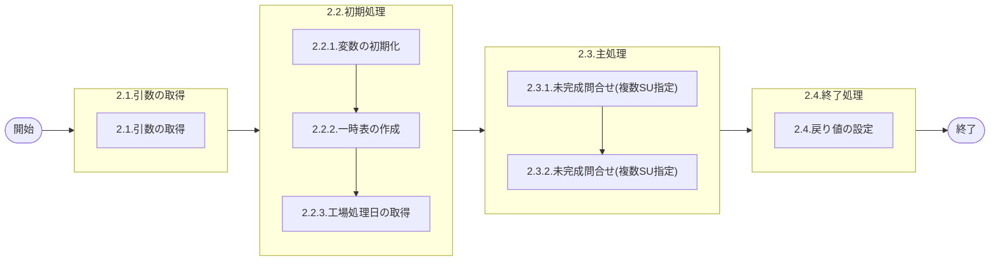

# 0. 表紙

| モジュール名 | プログラムID | プログラム名             |
| ------------ | ------------ | ------------------------ |
| IC           | LDAS9007     | 未完成問合せ(複数SU指定) |

| RFC | Version | 更新日     | 更新者 | 更新内容 | 確認日     | 確認者 | 承認日     | 承認者 |
| --- | :-----: | ---------- | :----: | -------- | ---------- | :----: | ---------- | :----: |
| -   |  1.0.0  | 2025/09/23 | 李鵬陽 | 初版作成 | 2025/XX/XX |  XXX  | 2025/XX/XX |  XXX  |

## 1. 処理概要

### 1.1. 機能概要

複数SU指定のオーダー明細の未完了問合せを返す。

### 1.2. 処理概要フロー



### 1.3. プログラム入出力パラメータ

#### 1.3.1. 引数

| No. | パラメータ論理名 | パラメータ物理名     | 属性    | 備考                         |
| --- | ---------------- | -------------------- | ------- | ---------------------------- |
| 1   | 抽出期間開始日   | ps_start_date        | VARCHAR |                              |
| 2   | 抽出期間終了日   | ps_end_date          | VARCHAR |                              |
| 3   | 投入作業区       | ps_input_work_center | VARCHAR |                              |
| 4   | 製造L/T          | pn_manuf_lt          | DECIMAL |                              |
| 5   | 生試初品区分     | ps_pilot_class       | VARCHAR | 1:全件2:初品3:生試／単品生試 |
| 6   | 品目クラス       | ps_da_item_class     | VARCHAR | 1:全件2:製品3:エンジン4:部品 |
| 7   | AIRSサイン       | ps_airs_sign         | VARCHAR | 0:NOTAIRS1:AIRS              |
| 8   | 供給者01         | ps_supplier01        | VARCHAR |                              |
| 9   | 供給者02         | ps_supplier02        | VARCHAR |                              |
| 10  | 供給者03         | ps_supplier03        | VARCHAR |                              |
| 11  | 供給者04         | ps_supplier04        | VARCHAR |                              |
| 12  | 供給者05         | ps_supplier05        | VARCHAR |                              |
| 13  | 供給者06         | ps_supplier06        | VARCHAR |                              |
| 14  | 供給者07         | ps_supplier07        | VARCHAR |                              |
| 15  | 供給者08         | ps_supplier08        | VARCHAR |                              |
| 16  | 供給者09         | ps_supplier09        | VARCHAR |                              |
| 17  | 供給者10         | ps_supplier10        | VARCHAR |                              |
| 18  | 供給者11         | ps_supplier11        | VARCHAR |                              |
| 19  | 供給者12         | ps_supplier12        | VARCHAR |                              |
| 20  | 供給者13         | ps_supplier13        | VARCHAR |                              |
| 21  | 供給者14         | ps_supplier14        | VARCHAR |                              |
| 22  | 供給者15         | ps_supplier15        | VARCHAR |                              |
| 23  | 供給者16         | ps_supplier16        | VARCHAR |                              |
| 24  | 供給者17         | ps_supplier17        | VARCHAR |                              |
| 25  | 供給者18         | ps_supplier18        | VARCHAR |                              |
| 26  | 供給者19         | ps_supplier19        | VARCHAR |                              |
| 27  | 供給者20         | ps_supplier20        | VARCHAR |                              |
| 28  | 供給者21         | ps_supplier21        | VARCHAR |                              |
| 29  | 供給者22         | ps_supplier22        | VARCHAR |                              |
| 30  | 供給者23         | ps_supplier23        | VARCHAR |                              |
| 31  | 供給者24         | ps_supplier24        | VARCHAR |                              |
| 32  | 供給者25         | ps_supplier25        | VARCHAR |                              |
| 33  | 供給者26         | ps_supplier26        | VARCHAR |                              |
| 34  | 供給者27         | ps_supplier27        | VARCHAR |                              |
| 35  | 供給者28         | ps_supplier28        | VARCHAR |                              |
| 36  | 供給者29         | ps_supplier29        | VARCHAR |                              |
| 37  | 供給者30         | ps_supplier30        | VARCHAR |                              |
| 38  | 供給者31         | ps_supplier31        | VARCHAR |                              |
| 39  | 供給者32         | ps_supplier32        | VARCHAR |                              |
| 40  | 供給者33         | ps_supplier33        | VARCHAR |                              |
| 41  | 供給者34         | ps_supplier34        | VARCHAR |                              |
| 42  | 供給者35         | ps_supplier35        | VARCHAR |                              |
| 43  | 供給者36         | ps_supplier36        | VARCHAR |                              |
| 44  | 供給者37         | ps_supplier37        | VARCHAR |                              |
| 45  | 供給者38         | ps_supplier38        | VARCHAR |                              |
| 46  | 供給者39         | ps_supplier39        | VARCHAR |                              |
| 47  | 供給者40         | ps_supplier40        | VARCHAR |                              |
| 48  | 供給者41         | ps_supplier41        | VARCHAR |                              |
| 49  | 供給者42         | ps_supplier42        | VARCHAR |                              |
| 50  | 供給者43         | ps_supplier43        | VARCHAR |                              |
| 51  | 供給者44         | ps_supplier44        | VARCHAR |                              |
| 52  | 供給者45         | ps_supplier45        | VARCHAR |                              |
| 53  | 供給者46         | ps_supplier46        | VARCHAR |                              |
| 54  | 供給者47         | ps_supplier47        | VARCHAR |                              |
| 55  | 供給者48         | ps_supplier48        | VARCHAR |                              |
| 56  | 供給者49         | ps_supplier49        | VARCHAR |                              |
| 57  | 供給者50         | ps_supplier50        | VARCHAR |                              |

#### 1.3.2. 戻り値

| No. | パラメータ論理名 | パラメータ物理名     | 属性    | 備考                                                 |
| --- | ---------------- | -------------------- | ------- | ---------------------------------------------------- |
| 1   | ステータス       | rn_status            | INTEGER | 0:NormalEnd-1:AbnormalEnd-2:PGMError100:NotDataFound |
| 2   | SQLコード        | rs_sql_code          | VARCHAR |                                                      |
| 3   | エラーコード     | rs_err_code          | VARCHAR |                                                      |
| 4   | エラーメッセージ | rs_err_msg           | VARCHAR |                                                      |
| 5   | エラー位置       | rs_err_focus         | VARCHAR |                                                      |
| 6   | 遅れ日数         | rn_delay_days        | INTEGER |                                                      |
| 7   | 品目番号         | rs_itemno            | VARCHAR |                                                      |
| 8   | 供給者           | rs_supplier          | VARCHAR |                                                      |
| 9   | 使用者           | rs_usercd            | VARCHAR |                                                      |
| 10  | 投入作業区       | rs_input_work_center | VARCHAR |                                                      |
| 11  | 品目名称         | rs_item_name         | VARCHAR |                                                      |
| 12  | オーダー番号     | rs_order_no          | VARCHAR |                                                      |
| 13  | オーダー数       | rn_order_qty         | DECIMAL |                                                      |
| 14  | オーダー残数     | rn_bo_qty            | DECIMAL |                                                      |
| 15  | 着手日           | rs_start_date        | VARCHAR |                                                      |
| 16  | 完了日           | rs_due_date          | VARCHAR |                                                      |
| 17  | 図面作成登録型式 | rs_prima_mdl_type_cd | VARCHAR |                                                      |
| 18  | 製造L/T          | rn_manuf_lt          | DECIMAL |                                                      |
| 19  | 生試初品区分     | rs_pilot_class       | VARCHAR |                                                      |

### 1.4. その他制御・要件

| 排他制御 |      |      |
| -------- | ---- | ---- |
| 楽観     | 悲観 | 無し |
| ●       | -    | -    |

| 項目               | 制約・制御・要件など            | 記載内容説明                                                                                                                              |
| ------------------ | ------------------------------- | ----------------------------------------------------------------------------------------------------------------------------------------- |
| パフォーマンス要件 | 特になし。 現行ベースで作成する | 特別なパフォーマンス要件がある場合に要件内容とその対処法を記述。 ■呼び出し元 PYMAC 無し ※データ出力/ユーザーJOB起動画面から呼ばれている |

### 1.5. 入出力一覧

| No | 入出力対象 | 名称                      | 物理名称               | C | R  | U | D | 備考 |
| -- | ---------- | ------------------------- | ---------------------- | - | -- | - | - | ---- |
| 1  | テーブル   | IC工場処理日              | ld_mst_slip_date       | - | ○ | - | - |      |
| 2  | テーブル   | MRP情報値                 | le_mst_mrp_information | - | ○ | - | - |      |
| 3  | テーブル   | 品目共通                  | la_itemcomn            | - | ○ | - | - |      |
| 4  | テーブル   | 品目マスター              | la_itemmast            | - | ○ | - | - |      |
| 5  | テーブル   | オーダー明細              | le_trn_order           | - | ○ | - | - |      |
| 6  | テーブル   | SUマスタ                  | la_area_master_su      | - | ○ | - | - |      |
| 7  | テーブル   | 日別カレンダーマスタ（D） | le_mst_calendar_sum    | - | ○ | - | - |      |

## 2. 詳細処理

### 2.1. 引数の取得

### 2.2. 初期処理

### 2.2.1. 変数を初期化

利用する変数を初期化する。

| No. | 変数論理名           | 初期化設定値     |
| :-: | -------------------- | ---------------- |
|  1  | 変数.IC工場処理日    | スペース         |
|  2  | 変数.遅延日数        | 0                |
|  3  | 変数.オーダー情報_RD | ※属性：　RECORD |

### 2.2.2. 一時表の作成

未出荷明細一時表を作成

```sql
    CREATE TEMP TABLE temp_date1(                           --未出荷明細一時表
         delay_days                   INTEGER,              --遅延日数
         itemno                       VARCHAR(30),          --部品番号
         supplier                     VARCHAR(04),          --供給者
         usercd                       VARCHAR(04),          --使用者
         input_work_center            VARCHAR(03),          --投入作業区
         item_name                    VARCHAR(30),          --品目名称
         order_no                     VARCHAR(05),          --オーダー番号
         order_qty                    DECIMAL(15,5),        --オーダー数
         bo_qty                       DECIMAL(15,5),        --オーダー残数
         start_date                   VARCHAR(08),          --着手日
         due_date                     VARCHAR(08),          --完了日
         prima_mdl_type_cd            VARCHAR(06),          --図面作成登録型式
         manuf_lt                     DECIMAL(3,0),         --製造リードタイム
         pilot_class                  VARCHAR(01),          --生試初品区分
         airs_sign                    VARCHAR(01)           --AIRSサイン
    )WITHOUT OIDS ON COMMIT DROP;
```

### 2.2.3. 工場処理日の取得

- IC工場処理日を検索する

```sql
SELECT IC工場処理日
  INTO 変数.IC工場処理日
  FROM IC工場処理日 
 WHERE 処理タイプ = 'STD'
```

- データが存在しない場合、エラーメッセージを出力し処理終了

  - エラーコード : 'E.LDP10911'
  - エラーメッセージ : 'The IC pymac date is not exist.'
  - (IC工場処理日が存在しません。)
- TRIM(引数.抽出期間終了日） =  '' の場合
  引数.抽出期間終了日 = 変数.IC工場処理日

### 2.3. 主処理

#### 2.3.1.未完成問合せ(複数SU指定)

未出荷情報を検索する

```sql
SELECT b.品目番号,
       b.供給者,
       b.使用者,
       a.投入作業区,
       COALESCE(D.品目名称, ' ') AS 品目名称,
       b.オーダー番号,
       b.オーダー数,
       b.オーダー残数,
       b.着手日,
       b.完了日,
       COALESCE(d.図面作成登録型式, ' ') AS 図面作成登録型式,
       a.製造リードタイム,
       b.生試初品区分,
       a.AIRSサイン,
       c.現在有効カレンダー
FROM MRP情報値 a
LEFT OUTER JOIN 品目共通 d
  ON a.品目番号 = d.品目番号
INNER  JOIN 品目マスター f
  ON a.品目番号 = f.品目番号
    AND a.供給者 = f.供給者 
    AND a.使用者 = f.使用者 
INNER  JOIN オーダー明細 b
  ON a.品目番号 = b.品目番号
    AND a.供給者 = b.供給者 
    AND a.使用者 = b.使用者 
INNER  JOIN SUマスタ c
  ON a.使用者 = c.SUコード 
WHERE a.供給者 = a.使用者
  AND a.供給者 IN(引数.供給者01,引数.供給者02,引数.供給者03,引数.供給者04,引数.供給者05,...,引数.供給者50)
  AND b.オーダーステータス = '2'   
  AND (引数.生試初品区分 = '1' 
       OR (引数.生試初品区分 = '4' AND b.生試初品区分 = ' ')
       OR (引数.生試初品区分 = '3' AND b.生試初品区分 = '3')
       OR (引数.生試初品区分 = '2' AND b.生試初品区分 = IN ('2','4')))
  AND ( 引数.品目クラス     = '1'
       OR (引数.品目クラス     = '2' AND f.品目クラス  IN ('E','F'))
   OR (引数.品目クラス     = '3' AND f.品目クラス  = '7')
   OR (引数.品目クラス     = '4' AND f.品目クラス  = '2'))
  AND (a.投入作業区 = 引数.投入作業区  OR TRIM(引数.投入作業区) = '' )
  AND ( a.製造リードタイム = 引数.製造リードタイム   OR   引数.製造リードタイム IS NULL )
  AND ( b.完了日 >= 引数.抽出期間開始日 OR TRIM(引数.抽出期間開始日)   = '' )
  AND b.完了日 <= 引数.抽出期間終了日
```

- データが存在の場合
  検索されたデータ(INTO 変数.オーダー情報_RD)を順に処理する

  LOOP START

  日別カレンダーマスター(D) を検索する (遅延日数を取得)

  ```sql
  SELECT COUNT(1)
    INTO 変数.遅延日数
    FROM 日別カレンダーマスター(D) 
   WHERE カレンダーコード = 変数.オーダー情報_RD.現在有効カレンダー
     AND 稼働日区分 = '0'
     AND カレンダー年月日 > 変数.IC工場処理日
     AND カレンダー年月日 <= 変数.オーダー情報_RD.完了日
  ```

  未出荷明細一時表を追加

  ```sql
        INSERT INTO 未出荷明細一時表
          (遅延日数，
           品目番号 ,
           供給者，
           使用者，
           投入作業区,
           品目名称,
           オーダー番号,
           オーダー数,
           オーダー残数,
           着手日,
           完了日,
           図面作成登録型式,
           製造リードタイム,
           生試初品区分,
           AIRSサイン)
          VALUES
          ( 変数.遅延日数，
            変数.オーダー情報_RD.品目番号 ,
            変数.オーダー情報_RD.供給者，
            変数.オーダー情報_RD.使用者，
            変数.オーダー情報_RD.投入作業区,
            変数.オーダー情報_RD.品目名称,
            変数.オーダー情報_RD.オーダー番号,
            変数.オーダー情報_RD.オーダー数,
            変数.オーダー情報_RD.オーダー残数,
            変数.オーダー情報_RD.着手日,
            変数.オーダー情報_RD.完了日,
            変数.オーダー情報_RD.図面作成登録型式,
            変数.オーダー情報_RD.製造リードタイム,
            変数.オーダー情報_RD.生試初品区分,
            変数.オーダー情報_RD.AIRSサイン)
  ```

  LOOP END

#### 2.3.2.未完成問合せ(複数SU指定)

未出荷明細一時表のデータのreturn

```sql
      SELECT * 
      FROM 未出荷明細一時表 
      WHERE  引数.AIRSサイン = '1'
        OR (引数.AIRSサイン  = '2' AND AIRSサイン  <> '1')
```

- データが存在の場合
  2.4終了処理を実行
- データが存在しない場合、エラーメッセージを出力し処理終了。

  - 処理ステータス ： 100
  - エラーコード : ' '
  - エラーメッセージ : ' '

### 2.4. 終了処理

取得した未出荷明細一時表のデータを戻り値に設定する。

| 戻り値論理名     | 設定値                                    |
| ---------------- | ----------------------------------------- |
| 処理ステータス   | 0                                         |
| SQL コード       | スペース                                  |
| エラーコード     | スペース                                  |
| エラーメッセージ | スペース                                  |
| エラー位置       | スペース                                  |
| 遅延日数         | 未出荷明細一時表のデータ.遅延日数 * -1    |
| 品目番号         | 未出荷明細一時表のデータ.品目番号         |
| 供給者           | 未出荷明細一時表のデータ.供給者           |
| 使用者           | 未出荷明細一時表のデータ.使用者           |
| 投入作業区       | 未出荷明細一時表のデータ.投入作業区       |
| 品目名称         | 未出荷明細一時表のデータ.品目名称         |
| オーダー番号     | 未出荷明細一時表のデータ.オーダー番号     |
| オーダー数       | 未出荷明細一時表のデータ.オーダー数       |
| オーダー残数     | 未出荷明細一時表のデータ.オーダー残数     |
| 着手日           | 未出荷明細一時表のデータ.着手日           |
| 完了日           | 未出荷明細一時表のデータ.完了日           |
| 図面作成登録型式 | 未出荷明細一時表のデータ.図面作成登録型式 |
| 製造リードタイム | 未出荷明細一時表のデータ.製造リードタイム |
| 生試初品区分     | 未出荷明細一時表のデータ.生試初品区分     |

## 3. 補足説明

### 3.1. 戻り値について

**ステータスについて**

- 0 : Normal（正常終了）
- 100 : Not Data Found（データなし）
- -1 : Sql Error（SQLエラー）
- -2 : Program Error（プログラムエラー）

### 3.2. エラー発生時の対応について

### 3.2.1. 業務例外処理

引数チェック等でプログラムエラーが発生した場合：

| 戻り値           | 設定値         |
| ---------------- | -------------- |
| 処理ステータス   | -2             |
| SQLコード        | スペース       |
| エラーコード     | エラーコード値 |
| エラーメッセージ | エラー内容     |
| エラー位置       | 'LDAS9007'     |
| その他項目       | 初期値         |

### 3.2.2. その他例外処理

データベースアクセス時にSQLエラーが発生した場合：

| 戻り値           | 設定値     |
| ---------------- | ---------- |
| 処理ステータス   | -1         |
| SQLコード        | SQLSTATE   |
| エラーコード     | スペース   |
| エラーメッセージ | SQLERRM    |
| エラー位置       | 'LDAS9007' |
| その他項目       | 初期値     |
