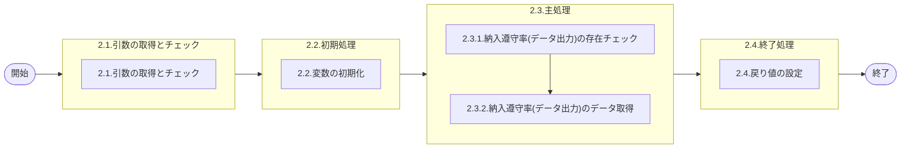

# 0. 表紙

| モジュール名 | プログラムID | プログラム名       |
| ------------ | ------------ | ------------------ |
| IC           | LDAS9009     | 納入遵守分析データ |

| RFC | Version | 更新日     | 更新者 | 更新内容 | 確認日     | 確認者 | 承認日     | 承認者 |
| --- | :-----: | ---------- | :----: | -------- | ---------- | :----: | ---------- | :----: |
| -   |  1.0.0  | 2025/09/30 | 陳培煌 | 初版作成 | 2025/XX/XX |  XXX  | 2025/XX/XX |  XXX  |

## 1. 処理概要

### 1.1. 機能概要

納入遵守率(データ出力)を検索して担当課毎の納入遵守データを集計する。

### 1.2. 処理概要フロー



### 1.3. プログラム入出力パラメータ

#### 1.3.1. 引数

| No. | パラメータ論理名 | パラメータ物理名  | 属性 | 備考 |
| --- | ---------------- | ----------------- | ---- | ---- |
| 1   | 処理月           | ps_process_month  |      |      |
| 2   | 担当課           | ps_section        |      |      |
| 3   | 納入PFフラグ     | ps_pf_output_flag |      |      |
| 4   | 押込フラグ       | ps_input_flag     |      |      |
| 5   | 処理区分         | ps_process_class  |      |      |

#### 1.3.2. 戻り値

| No. | パラメータ論理名 | パラメータ物理名       | 属性    | 備考                                                |
| --- | ---------------- | ---------------------- | ------- | --------------------------------------------------- |
| 1   | 処理ステータス   | rn_status              | INTEGER | 0：正常-1：SQLエラー100：NotFoundエラー-2：PGエラー |
| 2   | SQLコード        | rs_sql_code            | VARCHAR |                                                     |
| 3   | エラーコード     | rs_err_code            | VARCHAR |                                                     |
| 4   | エラーメッセージ | rs_err_msg             | VARCHAR |                                                     |
| 5   | エラー位置       | rs_err_focus           | VARCHAR |                                                     |
| 6   | 検索区分         | rs_select_class        | VARCHAR | 1：納入側、2：受入側                                |
| 7   | 納入キー         | rs_su_code_deliv       | VARCHAR |                                                     |
| 8   | 受入キー         | rs_su_code_receiv      | VARCHAR |                                                     |
| 9   | 納入キー名称     | rs_su_code_deliv_name  | VARCHAR |                                                     |
| 10  | 受入キー名称     | rs_su_code_receiv_name | VARCHAR |                                                     |
| 11  | 集計区分         | rs_sum_class           | VARCHAR | 1：MRP、2：押込、3：独立押込                        |
| 12  | 総件数           | rn_total_num           | DECIMAL |                                                     |
| 13  | 先行件数6        | rn_precede_num6        | DECIMAL |                                                     |
| 14  | 先行件数5        | rn_precede_num5        | DECIMAL |                                                     |
| 15  | 先行件数4        | rn_precede_num4        | DECIMAL |                                                     |
| 16  | 先行件数3        | rn_precede_num3        | DECIMAL |                                                     |
| 17  | 先行件数2        | rn_precede_num2        | DECIMAL |                                                     |
| 18  | 先行件数1        | rn_precede_num1        | DECIMAL |                                                     |
| 19  | 先行件数率       | rn_precede_num_rate    | DECIMAL |                                                     |
| 20  | 遵守件数         | rn_obey_num            | DECIMAL |                                                     |
| 21  | 遵守件数率       | rn_obey_num_rate       | DECIMAL |                                                     |
| 22  | 遅延件数1        | rn_delay_num1          | DECIMAL |                                                     |
| 23  | 遅延件数2        | rn_delay_num2          | DECIMAL |                                                     |
| 24  | 遅延件数3        | rn_delay_num3          | DECIMAL |                                                     |
| 25  | 遅延件数4        | rn_delay_num4          | DECIMAL |                                                     |
| 26  | 遅延件数5        | rn_delay_num5          | DECIMAL |                                                     |
| 27  | 遅延件数6        | rn_delay_num6          | DECIMAL |                                                     |
| 28  | 遅延件数率       | rn_delay_num_rate      | DECIMAL |                                                     |
| 29  | 総数量           | rn_total_qty           | DECIMAL |                                                     |
| 30  | 先行数量6        | rn_precede_qty6        | DECIMAL |                                                     |
| 31  | 先行数量5        | rn_precede_qty5        | DECIMAL |                                                     |
| 32  | 先行数量4        | rn_precede_qty4        | DECIMAL |                                                     |
| 33  | 先行数量3        | rn_precede_qty3        | DECIMAL |                                                     |
| 34  | 先行数量2        | rn_precede_qty2        | DECIMAL |                                                     |
| 35  | 先行数量1        | rn_precede_qty1        | DECIMAL |                                                     |
| 36  | 先行数量率       | rn_precede_qty_rate    | DECIMAL |                                                     |
| 37  | 遵守数量         | rn_obey_qty            | DECIMAL |                                                     |
| 38  | 遵守数量率       | rn_obey_qty_rate       | DECIMAL |                                                     |
| 39  | 遅延数量1        | rn_delay_qty1          | DECIMAL |                                                     |
| 40  | 遅延数量2        | rn_delay_qty2          | DECIMAL |                                                     |
| 41  | 遅延数量3        | rn_delay_qty3          | DECIMAL |                                                     |
| 42  | 遅延数量4        | rn_delay_qty4          | DECIMAL |                                                     |
| 43  | 遅延数量5        | rn_delay_qty5          | DECIMAL |                                                     |
| 44  | 遅延数量6        | rn_delay_qty6          | DECIMAL |                                                     |
| 45  | 遅延数量率       | rn_delay_qty_rate      | DECIMAL |                                                     |
| 46  | 納入側担当課     | rs_deliv_section_code  | VARCHAR |                                                     |
| 47  | 受入側担当課     | rs_receiv_section_code | VARCHAR |                                                     |
| 48  | 納入側担当者     | rs_deliv_person_code   | VARCHAR |                                                     |
| 49  | 受入側担当者     | rs_receiv_person_code  | VARCHAR |                                                     |
| 50  | 納入PFコード     | rs_pf_code             | VARCHAR |                                                     |

### 1.4. その他制御・要件

| 排他制御 |      |      |
| -------- | ---- | ---- |
| 楽観     | 悲観 | 無し |
| ●       | -    | -    |

| 項目               | 制約・制御・要件など | 記載内容説明                                                     |
| ------------------ | -------------------- | ---------------------------------------------------------------- |
| パフォーマンス要件 | 特になし。           | 特別なパフォーマンス要件がある場合に要件内容とその対処法を記述。 |

### 1.5. 入出力一覧

| No | 入出力対象 | 名称                   | 物理名称             | C | R  | U | D | 備考 |
| -- | ---------- | ---------------------- | -------------------- | - | -- | - | - | ---- |
| 1  | テーブル   | 納入遵守率(データ出力) | ld_trn_obey_rat_data |   | ○ |   |   |      |
| 2  | テーブル   | GIMACエリアマスタ      | la_area_master       |   | ○ |   |   |      |
| 3  | テーブル   | SUマスタ               | la_area_master_su    |   | ○ |   |   |      |

## 2. 詳細処理

### 2.1. 引数の受け取りとチェック

- 引数.対象月、引数.納入PFフラグ、引数.担当課、引数.押しフラグのいずれかスペースやNULLの場合、引数エラーとして、異常処理させる
  - 処理ステータス : -2
- 引数.納入PFフラグが"Y"、"N"以外の場合、引数エラーとして、異常処理させる
  - 処理ステータス : -2
- 引数.処理区分が"1"、"2"の以外場合、引数エラーとして、異常処理させる
  - 処理ステータス : -2
- 引数.押しフラグが"Y"、"N"の以外場合、引数エラーとして、異常処理させる
  - 処理ステータス : -2

### 2.2. 初期処理

#### 2.2.1. 変数初期化

利用する変数を初期化する。

| No. | 変数論理名   | 初期化設定値 |
| :-: | ------------ | ------------ |
|  1  | 納入キー     | スペース     |
|  2  | 受入キー     | スペース     |
|  3  | 集計区分     | スペース     |
|  4  | 総件数       | 0            |
|  5  | 先行件数6    | 0            |
|  6  | 先行件数5    | 0            |
|  7  | 先行件数4    | 0            |
|  8  | 先行件数3    | 0            |
|  9  | 先行件数2    | 0            |
| 10 | 先行件数1    | 0            |
| 11 | 先行件数率   | 0            |
| 12 | 遵守件数     | 0            |
| 13 | 遵守件数率   | 0            |
| 14 | 遅延件数1    | 0            |
| 15 | 遅延件数2    | 0            |
| 16 | 遅延件数3    | 0            |
| 17 | 遅延件数4    | 0            |
| 18 | 遅延件数5    | 0            |
| 19 | 遅延件数6    | 0            |
| 20 | 遅延件数率   | 0            |
| 21 | 総数量       | 0            |
| 22 | 先行数量6    | 0            |
| 23 | 先行数量5    | 0            |
| 24 | 先行数量4    | 0            |
| 25 | 先行数量3    | 0            |
| 26 | 先行数量2    | 0            |
| 27 | 先行数量1    | 0            |
| 28 | 先行数量率   | 0            |
| 29 | 遵守数量     | 0            |
| 30 | 遵守数量率   | 0            |
| 31 | 遅延数量1    | 0            |
| 32 | 遅延数量2    | 0            |
| 33 | 遅延数量3    | 0            |
| 34 | 遅延数量4    | 0            |
| 35 | 遅延数量5    | 0            |
| 36 | 遅延数量6    | 0            |
| 37 | 遅延数量率   | 0            |
| 38 | 納入側担当課 | スペース     |
| 39 | 受入側担当課 | スペース     |
| 40 | 納入側担当者 | スペース     |
| 41 | 受入側担当者 | スペース     |
| 42 | 納入PFコード | スペース     |
| 43 | S区分        | スペース     |
| 44 | S担当者      | スペース     |
| 45 | 供給者名称   | スペース     |
| 46 | U区分        | スペース     |
| 47 | U担当者      | スペース     |
| 48 | 使用者名称   | スペース     |
| 49 | 選択キー     | スペース     |
| 50 | ブレークキー | スペース     |
| 51 | 検索カウント | スペース     |

### 2.3. 主処理

#### 2.3.1.納入遵守率(データ出力)の存在チェック

```sql
    SELECT DISTINCT 1
               FROM 納入遵守率(データ出力)
```

- 存在しない場合、データ無しエラーとして、異常処理させる
  - 処理ステータス : 100

#### 2.3.2.納入遵守率(データ出力)のデータ取得

- 以下の条件で納入遵守率(データ出力)を検索する、納入遵守率リストに格納する

```sql
    SELECT "1"       AS 検索区分
          ,納入キー
          ,受入キー
          ,集計区分
          ,件数
          ,数量
          ,CASE
              WHEN 引数.納入PFフラグ = "Y" THEN オリジナル納入PF
              WHEN 引数.納入PFフラグ = "N" THEN " "
           END AS 納入PFコード
          ,集計日数
      FROM 納入遵守率(データ出力)
     WHERE 納入側担当課   IN (引数.担当課)
       AND 集計日数 <> 9
       AND 処理種別       = 引数.処理区分
       AND 処理対象月     = 引数.処理月
 UNION ALL
    SELECT "2"       AS 検索区分
          ,納入キー
          ,受入キー
          ,集計区分
          ,件数
          ,数量
          ,CASE
              WHEN 引数.納入PFフラグ = "Y" THEN オリジナル納入PF
              WHEN 引数.納入PFフラグ = "N" THEN " "
           END AS 納入PFコード
          ,集計日数
      FROM 納入遵守率(データ出力)
     WHERE 受入側担当課   IN (引数.担当課)
       AND 集計日数 <> 9
       AND 集計区分       IN ("1","2")
       AND 処理種別       = 引数.処理区分
       AND 処理対象月     = 引数.処理月
  ORDER BY 検索区分, 納入キー, 受入キー, 納入PFコード, 集計区分, 件数, 数量
```

- データ存在しない場合、データ無しエラーとして、異常処理させる
- 納入遵守率リストのデータがないまで、以下の処理を繰り返す

  - 変数.検索カウント = 変数.検索カウント + 1
  - 引数.納入PFフラグは"N"の場合
    納入遵守率リスト.納入PFコード = " "
  - 引数.押込フラグは"Y"かつ納入遵守率リスト.集計区分が"3"の場合
    納入遵守率リスト.集計区分 = "2"
  - 選択キーのセット
    変数.選択キー = 納入遵守率リスト.検索区分 || 納入遵守率リスト.納入キー || 納入遵守率リスト.受入キー || 納入遵守率リスト.納入PFコード || 納入遵守率リスト.集計区分;
  - 変数.ブレークキーと変数.選択キーが同じの場合、【件数・数量の集計】
    - 納入遵守率リスト.集計日数が　-6　の場合
      　　変数.先行件数6　=　変数.先行件数6　＋　納入遵守率リスト.件数
      　　変数.先行数量6　=　変数.先行数量6　＋　納入遵守率リスト.件数
    - 上記条件以外かつ納入遵守率リスト.集計日数が　-5　の場合
      　　変数.先行件数5　=　変数.先行件数5　＋　納入遵守率リスト.件数
      　　変数.先行数量5　=　変数.先行数量5　＋　納入遵守率リスト.件数
    - 上記条件以外かつ納入遵守率リスト.集計日数が　-4　の場合
      　　変数.先行件数4　=　変数.先行件数4　＋　納入遵守率リスト.件数
      　　変数.先行数量4　=　変数.先行数量4　＋　納入遵守率リスト.件数
    - 上記条件以外かつ納入遵守率リスト.集計日数が　-3　の場合
      　　変数.先行件数3　=　変数.先行件数3　＋　納入遵守率リスト.件数
      　　変数.先行数量3　=　変数.先行数量3　＋　納入遵守率リスト.件数
    - 上記条件以外かつ納入遵守率リスト.集計日数が　-2　の場合
      　　変数.先行件数2　=　変数.先行件数2　＋　納入遵守率リスト.件数
      　　変数.先行数量2　=　変数.先行数量2　＋　納入遵守率リスト.件数
    - 上記条件以外かつ納入遵守率リスト.集計日数が　-1　の場合
      　　変数.先行件数1　=　変数.先行件数1　＋　納入遵守率リスト.件数
      　　変数.先行数量1　=　変数.先行数量1　＋　納入遵守率リスト.件数
    - 上記条件以外かつ納入遵守率リスト.集計日数が　0　の場合
      　　変数.遵守件数 　=　変数.遵守件数 　＋　納入遵守率リスト.件数
      　　変数.遵守数量 　=　変数.遵守数量 　＋　納入遵守率リスト.件数
    - 上記条件以外かつ納入遵守率リスト.集計日数が　1　の場合
      　　変数.遅延件数1　=　変数.遅延件数1　＋　納入遵守率リスト.件数
      　　変数.遅延数量1　=　変数.遅延数量1　＋　納入遵守率リスト.件数
    - 上記条件以外かつ納入遵守率リスト.集計日数が　2　の場合
      　　変数.遅延件数2　=　変数.遅延件数2　＋　納入遵守率リスト.件数
      　　変数.遅延数量2　=　変数.遅延数量2　＋　納入遵守率リスト.件数
    - 上記条件以外かつ納入遵守率リスト.集計日数が　3　の場合
      　　変数.遅延件数3　=　変数.遅延件数3　＋　納入遵守率リスト.件数
      　　変数.遅延数量3　=　変数.遅延数量3　＋　納入遵守率リスト.件数
    - 上記条件以外かつ納入遵守率リスト.集計日数が　4　の場合
      　　変数.遅延件数4　=　変数.遅延件数4　＋　納入遵守率リスト.件数
      　　変数.遅延数量4　=　変数.遅延数量4　＋　納入遵守率リスト.件数
    - 上記条件以外かつ納入遵守率リスト.集計日数が　5　の場合
      　　変数.遅延件数5　=　変数.遅延件数5　＋　納入遵守率リスト.件数
      　　変数.遅延数量5　=　変数.遅延数量5　＋　納入遵守率リスト.件数
    - 上記条件以外かつ納入遵守率リスト.集計日数が　6　の場合
      　　変数.遅延件数6　=　変数.遅延件数6　＋　納入遵守率リスト.件数
      　　変数.遅延数量6　=　変数.遅延数量6　＋　納入遵守率リスト.件数
    - 次のデータを読み込む
  - 変数.ブレークキーと変数.選択キーが同じではないの場合
    - 変数.検索件数が1以上の場合
      - 供給者関連情報のセット、【供給者情報の取得】

        ```sql
             SELECT A.担当課
                   ,A.担当者
                   ,A.エリア名称
            　 FROM GIMACエリアマスタ A
         INNER JOIN SUマスタ B
                 ON B.SUコード    = 納入遵守率リスト.納入キー
            　WHERE B.エリアコード = A.エリアコード
        ```

        - 上記取得したデータが存在しないの場合
          　　　　変数.S区分　　　　←　スペース
          　　　　変数.S担当者　　　←　スペース
          　　　　変数.供給者名称　 ←　スペース
        - 上記取得したデータが存在するの場合
          　　　　変数.S区分　　　　←　上記取得した.担当課
          　　　　変数.S担当者　　　←　上記取得した.担当者
          　　　　変数.供給者名称　 ←　上記取得した.組織記述
      - 使用者関連情報のセット、【使用者情報の取得】

        ```sql
             SELECT A.担当課
                   ,A.担当者
                   ,A.エリア名称
            　 FROM GIMACエリアマスタ A
         INNER JOIN SUマスタ B
                 ON B.SUコード    = 納入遵守率リスト.受入キー
            　WHERE B.エリアコード = A.エリアコード
        ```

        - 上記取得したデータが存在しないの場合
          　　　変数.U区分　　　　←　スペース
          　　　変数.U担当者　　　←　スペース
          　　　変数.使用者名称　 ←　スペース
        - 上記取得したデータが存在するの場合
          　　　変数.U区分　　　　←　上記取得した.担当課
          　　　変数.U担当者　　　←　上記取得した.担当者
          　　　変数.使用者名称　 ←　上記取得した.組織記述
      - 総件数の集計
        　　     　  変数.総件数　=　変数.先行件数6　＋　変数.先行件数5
        　　     　　　　　　　　＋　変数.先行件数4　＋　変数.先行件数3
        　　     　　　　　　　　＋　変数.先行件数2　＋　変数.先行件数1
        　　     　　　　　　　　＋　変数.遵守件数
        　　     　　　　　　　　＋　変数.遅延件数1　＋　変数.遅延件数2
        　　     　　　　　　　　＋　変数.遅延件数3　＋　変数.遅延件数4
        　　     　　　　　　　　＋　変数.遅延件数5　＋　変数.遅延件数6
      - 総数量の集計
        　　     　変数.総数量　=　  変数.先行数量6　＋　変数.先行数量5
        　　     　　　　　　　　＋　変数.先行数量4　＋　変数.先行数量3
        　　     　　　　　　　　＋　変数.先行数量2　＋　変数.先行数量1
        　　     　　　　　　　　＋　変数.遵守数量
        　　     　　　　　　　　＋　変数.遅延数量1　＋　変数.遅延数量2
        　　     　　　　　　　　＋　変数.遅延数量3　＋　変数.遅延数量4
        　　     　　　　　　　　＋　変数.遅延数量5　＋　変数.遅延数量6
      - 変数.総件数が0より大きい場合、件数率の計算、【件数率の計算】

        - 変数.先行件数率　=　((変数.先行件数6　＋　変数.先行件数5
          　　　　　　　　　＋　変数.先行件数4　＋　変数.先行件数3
          　　　　　　　　　＋　変数.先行件数2　＋　変数.先行件数1)　/　変数.総件数) * 100
        - 変数.遵守件数率　=　(変数.遵守件数　/　変数.総件数) * 100
        - 変数.遅延件数率　=　((変数.遅延件数1　＋　変数.遅延件数2
          　　　　　　　　　＋　変数.遅延件数3　＋　変数.遅延件数4
          　　　　　　　　　＋　変数.遅延件数5　＋　変数.遅延件数6) / 変数.総件数) * 100
      - 変数.総数量が0より大きい場合、数量率の計算、【数量率の計算】

        - 変数.先行数量率　=　((変数.先行数量6　＋　変数.先行数量5
          　　　　　　　　　＋　変数.先行数量4　＋　変数.先行数量3
          　　　　　　　　　＋　変数.先行数量2　＋　変数.先行数量1)　/　変数.総数量) * 100
        - 変数.遵守数量率　=　(変数.遵守数量　/　変数.総数量) * 100
        - 変数.遅延数量率　=　((変数.遅延数量1　＋　変数.遅延数量2
          　　　　　　　　　＋　変数.遅延数量3　＋　変数.遅延数量4
          　　　　　　　　　＋　変数.遅延数量5　＋　変数.遅延数量6) / 変数.総数量) * 100
      - 納入PFのセット
        　　     　引数.納入PFフラグが"Y"　かつ 変数.使用者　=　納入遵守率リスト.納入PF　の場合
        　　     　　　変数.納入PF　←　スペース
      - SUの判断、【SP戻り処理】

        - 納入遵守率リスト.区分が"2"の場合、GIMACエリアマスタに検索する

          ```sql
          SELECT DISTINCT 1
          　         FROM SUマスタ
          　        WHERE SUコード = 納入遵守率リスト.受入キー
          ```

          - 上記取得したデータが存在するの場合
            　　　関連データの戻って、「2.4. 終了処理」
        - 納入遵守率リスト.区分が"2"以外の場合
          　　　関連データの戻って、「2.4. 終了処理」
      - 「ブレークキー」のリセット
        変数.ブレークキー = 変数.選択キー
      - 関連変数の初期化
        変数.総件数      ← 0
        変数.先行件数6   ← 0
        変数.先行件数5   ← 0
        変数.先行件数4   ← 0
        変数.先行件数3   ← 0
        変数.先行件数2   ← 0
        変数.先行件数1   ← 0
        変数.先行件数率  ← 0
        変数.遵守件数    ← 0
        変数.遵守件数率  ← 0
        変数.遅延件数1   ← 0
        変数.遅延件数2   ← 0
        変数.遅延件数3   ← 0
        変数.遅延件数4   ← 0
        変数.遅延件数5   ← 0
        変数.遅延件数6   ← 0
        変数.遅延件数率  ← 0
        変数.総数量      ← 0
        変数.先行数量6   ← 0
        変数.先行数量5   ← 0
        変数.先行数量4   ← 0
        変数.先行数量3   ← 0
        変数.先行数量2   ← 0
        変数.先行数量1   ← 0
        変数.先行数量率  ← 0
        変数.遵守数量    ← 0
        変数.遵守数量率  ← 0
        変数.遅延数量1   ← 0
        変数.遅延数量2   ← 0
        変数.遅延数量3   ← 0
        変数.遅延数量4   ← 0
        変数.遅延数量5   ← 0
        変数.遅延数量6   ← 0
        変数.遅延数量率  ← 0
      - 件数、数量を集計して、【件数・数量の集計】

        - 納入遵守率リスト.集計日数が　-6　の場合
          　　変数.先行件数6　=　変数.先行件数6　＋　納入遵守率リスト.件数
          　　変数.先行数量6　=　変数.先行数量6　＋　納入遵守率リスト.件数
        - 上記条件以外かつ納入遵守率リスト.集計日数が　-5　の場合
          　　変数.先行件数5　=　変数.先行件数5　＋　納入遵守率リスト.件数
          　　変数.先行数量5　=　変数.先行数量5　＋　納入遵守率リスト.件数
        - 上記条件以外かつ納入遵守率リスト.集計日数が　-4　の場合
          　　変数.先行件数4　=　変数.先行件数4　＋　納入遵守率リスト.件数
          　　変数.先行数量4　=　変数.先行数量4　＋　納入遵守率リスト.件数
        - 上記条件以外かつ納入遵守率リスト.集計日数が　-3　の場合
          　　変数.先行件数3　=　変数.先行件数3　＋　納入遵守率リスト.件数
          　　変数.先行数量3　=　変数.先行数量3　＋　納入遵守率リスト.件数
        - 上記条件以外かつ納入遵守率リスト.集計日数が　-2　の場合
          　　変数.先行件数2　=　変数.先行件数2　＋　納入遵守率リスト.件数
          　　変数.先行数量2　=　変数.先行数量2　＋　納入遵守率リスト.件数
        - 上記条件以外かつ納入遵守率リスト.集計日数が　-1　の場合
          　　変数.先行件数1　=　変数.先行件数1　＋　納入遵守率リスト.件数
          　　変数.先行数量1　=　変数.先行数量1　＋　納入遵守率リスト.件数
        - 上記条件以外かつ納入遵守率リスト.集計日数が　0　の場合
          　　変数.遵守件数 　=　変数.遵守件数 　＋　納入遵守率リスト.件数
          　　変数.遵守数量 　=　変数.遵守数量 　＋　納入遵守率リスト.件数
        - 上記条件以外かつ納入遵守率リスト.集計日数が　1　の場合
          　　変数.遅延件数1　=　変数.遅延件数1　＋　納入遵守率リスト.件数
          　　変数.遅延数量1　=　変数.遅延数量1　＋　納入遵守率リスト.件数
        - 上記条件以外かつ納入遵守率リスト.集計日数が　2　の場合
          　　変数.遅延件数2　=　変数.遅延件数2　＋　納入遵守率リスト.件数
          　　変数.遅延数量2　=　変数.遅延数量2　＋　納入遵守率リスト.件数
        - 上記条件以外かつ納入遵守率リスト.集計日数が　3　の場合
          　　変数.遅延件数3　=　変数.遅延件数3　＋　納入遵守率リスト.件数
          　　変数.遅延数量3　=　変数.遅延数量3　＋　納入遵守率リスト.件数
        - 上記条件以外かつ納入遵守率リスト.集計日数が　4　の場合
          　　変数.遅延件数4　=　変数.遅延件数4　＋　納入遵守率リスト.件数
          　　変数.遅延数量4　=　変数.遅延数量4　＋　納入遵守率リスト.件数
        - 上記条件以外かつ納入遵守率リスト.集計日数が　5　の場合
          　　変数.遅延件数5　=　変数.遅延件数5　＋　納入遵守率リスト.件数
          　　変数.遅延数量5　=　変数.遅延数量5　＋　納入遵守率リスト.件数
        - 上記条件以外かつ納入遵守率リスト.集計日数が　6　の場合
          　　変数.遅延件数6　=　変数.遅延件数6　＋　納入遵守率リスト.件数
          　　変数.遅延数量6　=　変数.遅延数量6　＋　納入遵守率リスト.件数
- 最後の項目の計算
- 供給者関連情報のセット、【供給者情報の取得】

  ```sql
       SELECT A.担当課
             ,A.担当者
             ,A.エリア名称
      　 FROM GIMACエリアマスタ A
   INNER JOIN SUマスタ B
           ON B.SUコード    = 納入遵守率リスト.納入キー
      　WHERE B.エリアコード = A.エリアコード
  ```

  - 上記取得したデータが存在しないの場合
    　　　　変数.S区分　　　　←　スペース
    　　　　変数.S担当者　　　←　スペース
    　　　　変数.供給者名称　 ←　スペース
  - 上記取得したデータが存在するの場合
    　　　　変数.S区分　　　　←　上記取得した.担当課
    　　　　変数.S担当者　　　←　上記取得した.担当者
    　　　　変数.供給者名称　 ←　上記取得した.組織記述
  - 使用者関連情報のセット、【使用者情報の取得】

  ```sql
       SELECT A.担当課
             ,A.担当者
             ,A.エリア名称
      　 FROM GIMACエリアマスタ A
   INNER JOIN SUマスタ B
           ON B.SUコード    = 納入遵守率リスト.受入キー
      　WHERE B.エリアコード = A.エリアコード
  ```

  - 上記取得したデータが存在しないの場合
    　　　変数.U区分　　　　←　スペース
    　　　変数.U担当者　　　←　スペース
    　　　変数.使用者名称　 ←　スペース
  - 上記取得したデータが存在するの場合
    　　　変数.U区分　　　　←　上記取得した.担当課
    　　　変数.U担当者　　　←　上記取得した.担当者
    　　　変数.使用者名称　 ←　上記取得した.組織記述
  - 総件数の集計
    　  変数.総件数　=　変数.先行件数6　＋　変数.先行件数5
    　　　　　　　　＋　変数.先行件数4　＋　変数.先行件数3
    　　　　　　　　＋　変数.先行件数2　＋　変数.先行件数1
    　　　　　　　　＋　変数.遵守件数
    　　　　　　　　＋　変数.遅延件数1　＋　変数.遅延件数2
    　　　　　　　　＋　変数.遅延件数3　＋　変数.遅延件数4
    　　　　　　　　＋　変数.遅延件数5　＋　変数.遅延件数6
  - 総数量の集計
    　変数.総数量　=　  変数.先行数量6　＋　変数.先行数量5
    　　　　　　　　＋　変数.先行数量4　＋　変数.先行数量3
    　　　　　　　　＋　変数.先行数量2　＋　変数.先行数量1
    　　　　　　　　＋　変数.遵守数量
    　　　　　　　　＋　変数.遅延数量1　＋　変数.遅延数量2
    　　　　　　　　＋　変数.遅延数量3　＋　変数.遅延数量4
    　　　　　　　　＋　変数.遅延数量5　＋　変数.遅延数量6
  - 変数.総件数が0より大きい場合、件数率の計算、【件数率の計算】

    - 変数.先行件数率　=　((変数.先行件数6　＋　変数.先行件数5
      　　　　　　　　　＋　変数.先行件数4　＋　変数.先行件数3
      　　　　　　　　　＋　変数.先行件数2　＋　変数.先行件数1)　/　変数.総件数) * 100
    - 変数.遵守件数率　=　(変数.遵守件数　/　変数.総件数) * 100
    - 変数.遅延件数率　=　((変数.遅延件数1　＋　変数.遅延件数2
      　　　　　　　　　＋　変数.遅延件数3　＋　変数.遅延件数4
      　　　　　　　　　＋　変数.遅延件数5　＋　変数.遅延件数6) / 変数.総件数) * 100
  - 変数.総数量が0より大きい場合、数量率の計算、【数量率の計算】

    - 変数.先行数量率　=　((変数.先行数量6　＋　変数.先行数量5
      　　　　　　　　　＋　変数.先行数量4　＋　変数.先行数量3
      　　　　　　　　　＋　変数.先行数量2　＋　変数.先行数量1)　/　変数.総数量) * 100
    - 変数.遵守数量率　=　(変数.遵守数量　/　変数.総数量) * 100
    - 変数.遅延数量率　=　((変数.遅延数量1　＋　変数.遅延数量2
      　　　　　　　　　＋　変数.遅延数量3　＋　変数.遅延数量4
      　　　　　　　　　＋　変数.遅延数量5　＋　変数.遅延数量6) / 変数.総数量) * 100
  - 納入PFのセット
    　引数.納入PFフラグが"Y"　かつ 変数.使用者　=　納入遵守率リスト.納入PF　の場合
    　　　変数.納入PF　←　スペース
  - SUの判断、【SP戻り処理】

    - 納入遵守率リスト.区分が"2"の場合、GIMACエリアマスタに検索する

      ```sql
      SELECT DISTINCT 1
      　          FROM SUマスタ
      　         WHERE SUコード = 納入遵守率リスト.受入キー
      ```

      - 上記取得したデータが存在するの場合
        　　　関連データの戻って、「2.4. 終了処理」
    - 納入遵守率リスト.区分が"2"以外の場合
      　　　関連データの戻って、「2.4. 終了処理」

### 2.4. 終了処理

- 処理を正常終了する
- 正常終了処理を行う。

| 戻り値           | 属性    | 設定値                    |
| ---------------- | ------- | ------------------------- |
| 処理ステータス   | INTEGER | 0                         |
| SQL コード       | VARCHAR | スペース                  |
| エラーコード     | VARCHAR | スペース                  |
| エラーメッセージ | VARCHAR | スペース                  |
| エラー位置       | VARCHAR | スペース                  |
| 検索区分         | VARCHAR | 納入遵守率リスト.検索区分 |
| 納入キー         | VARCHAR | 納入遵守率リスト.納入キー |
| 受入キー         | VARCHAR | 納入遵守率リスト.受入キー |
| 納入キー名称     | VARCHAR | 変数.供給者名称           |
| 受入キー名称     | VARCHAR | 変数.使用者名称           |
| 集計区分         | VARCHAR | 納入遵守率リスト.集計区分 |
| 総件数           | DECIMAL | 変数.総件数               |
| 先行件数6        | DECIMAL | 変数.先行件数6            |
| 先行件数5        | DECIMAL | 変数.先行件数5            |
| 先行件数4        | DECIMAL | 変数.先行件数4            |
| 先行件数3        | DECIMAL | 変数.先行件数3            |
| 先行件数2        | DECIMAL | 変数.先行件数2            |
| 先行件数1        | DECIMAL | 変数.先行件数1            |
| 先行件数率       | DECIMAL | 変数.先行件数率           |
| 遵守件数         | DECIMAL | 変数.遵守件数             |
| 遵守件数率       | DECIMAL | 変数.遵守件数率           |
| 遅延件数1        | DECIMAL | 変数.遅延件数1            |
| 遅延件数2        | DECIMAL | 変数.遅延件数2            |
| 遅延件数3        | DECIMAL | 変数.遅延件数3            |
| 遅延件数4        | DECIMAL | 変数.遅延件数4            |
| 遅延件数5        | DECIMAL | 変数.遅延件数5            |
| 遅延件数6        | DECIMAL | 変数.遅延件数6            |
| 遅延件数率       | DECIMAL | 変数.遅延件数率           |
| 総数量           | DECIMAL | 変数.総数量               |
| 先行数量6        | DECIMAL | 変数.先行数量6            |
| 先行数量5        | DECIMAL | 変数.先行数量5            |
| 先行数量4        | DECIMAL | 変数.先行数量4            |
| 先行数量3        | DECIMAL | 変数.先行数量3            |
| 先行数量2        | DECIMAL | 変数.先行数量2            |
| 先行数量1        | DECIMAL | 変数.先行数量1            |
| 先行数量率       | DECIMAL | 変数.先行数量率           |
| 遵守数量         | DECIMAL | 変数.遵守数量             |
| 遵守数量率       | DECIMAL | 変数.遵守数量率           |
| 遅延数量1        | DECIMAL | 変数.遅延数量1            |
| 遅延数量2        | DECIMAL | 変数.遅延数量2            |
| 遅延数量3        | DECIMAL | 変数.遅延数量3            |
| 遅延数量4        | DECIMAL | 変数.遅延数量4            |
| 遅延数量5        | DECIMAL | 変数.遅延数量5            |
| 遅延数量6        | DECIMAL | 変数.遅延数量6            |
| 遅延数量率       | DECIMAL | 変数.遅延数量率           |
| 納入側担当課     | VARCHAR | 変数.S区分                |
| 受入側担当課     | VARCHAR | 変数U区分                 |
| 納入側担当者     | VARCHAR | 変数.S担当者              |
| 受入側担当者     | VARCHAR | 変数.U担当者              |
| 納入PFコード     | VARCHAR | 変数.納入PF               |

## 3. 補足説明

### 3.1. 戻り値について

- ステータスについて
  0 : Normal
  100 : Not Found
  -1 : Sql Error
  -2 : Program Error

### 3.2. エラー発生時の対応について

- 戻り値.エラー位置 :'LDAS9009'
- SQLエラーが発生した場合、戻り値を返して処理終了
- PGMエラーが発生した場合、
  - 引数.ログ出力サイン＝'1'の場合、エラーログファイルを1レコード生成する。
    ＊ LDAS9009：エラーログ登録を実行する。
  - 戻り値を返して処理終了

### 3.2.1. 業務例外処理

- 業務例外が発生した場合、エラー情報を戻り値にセットする

| 戻り値         | 設定値   |
| -------------- | -------- |
| 処理ステータス | -2       |
| SQL コード     | スペース |

### 3.2.2. その他例外処理

- システム例外が発生した場合、エラー情報を戻り値にセットする

| 戻り値           | 設定値   |
| ---------------- | -------- |
| 処理ステータス   | -1       |
| SQL コード       | SQLSTATE |
| エラーコード     | スペース |
| エラーメッセージ | SQLERRM  |
