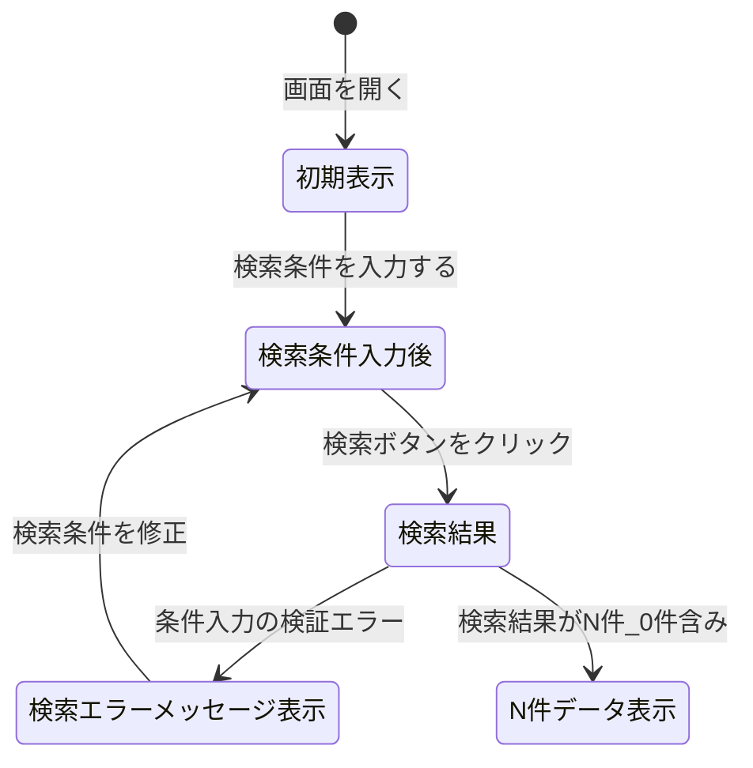

# 0. 表紙

| モジュール名 | プログラムID | プログラム名   |
| ------------ | ------------ | -------------- |
| IC           | LDB11_01     | 納入遵守率集計 |

| RFC | Version | 更新日     | 更新者 | 更新内容 | 確認日     | 確認者 | 承認日     | 承認者 |
| --- | :-----: | ---------- | :----: | -------- | ---------- | :----: | ---------- | :----: |
| -   |  1.0.0  | 2025/09/10 | 陳培煌 | 初版作成 | 2025/XX/XX |   XX   | 2025/XX/XX |   XX   |

## 1. 機能概要

### 1.1. 機能概要

納入遵守率データを照会する機能。
月毎のオーダー件数、納入遵守件数、遵守率を過去1年分確認できる。
※納入実績日≦納入指示日となっていて完納済みのオーダーが納入遵守オーダーとみなされる。(先行納入も遵守とみなす)
主な活用方法は、取引先の遵守率向上のために調達から取引先に月次連絡として遵守データを送付することだが、製造部でも遵守率の確認に利用できる。
過去3ヶ月分のデータについては、納入遅延オーダー検索の画面で災害等の理由による遅延オーダーを遅延から除外することができ、遅延除外機能を使うことで当画面で照会できる納入遵守件数、遵守率も変化する。
※月初処理で前月分のデータを作成する。

### 1.2. 画面パターン

| 表示形式 |      | 処理形式 |      | 排他制御 |      |      |
| -------- | ---- | -------- | ---- | -------- | ---- | ---- |
| 単票     | 一覧 | 参照     | 更新 | 楽観     | 悲観 | 無し |
| -        | ●   | ●       | -    | -        | -    | ●   |

### 1.3. 画面入出力パラメータ

#### 1.3.1. 引数

| No. | パラメータ論理名 | パラメータ物理名 | 備考           |
| --- | ---------------- | ---------------- | -------------- |
| 1   | 供給者           | supplier         | 条件部に付ける |
| 2   | 使用者           | usercd           | 条件部に付ける |
| 3   | 担当課           | orgSectionDeliv  | 条件部に付ける |
| 4   | 担当者           | orgPersonDeliv   | 条件部に付ける |

#### 1.3.2. 戻り値

| No. | パラメータ論理名 | パラメータ物理名 | 備考 |
| --- | ---------------- | ---------------- | ---- |
| 1   | （なし）         |                  |      |

### 1.4. その他制御・要件

| 項目               | 制約・制御・要件など | 記載内容説明 |
| ------------------ | -------------------- | ------------ |
| 稼働状況制御       | 個別制御不要。       |              |
| 権限制御           | 個別制御不要。       |              |
| パフォーマンス要件 | 特になし。           |              |
| セッション維持要件 | 標準に準ずる。       |              |

## 2. レイアウト

### 2.1. 画面レイアウト


### 2.2. 画面項目定義

| No | エリア     | 項目名           | 項目物理名      | 種別                 | 文字種 | 大文字 | 入出力区分 | 入力必須 | 最大桁数 | 最小桁数 | 小数桁 | 表示時編集内容 | フォーマットチェック | ソース名          | 項目名                             | 文字位置 | ツールチップ文言 | 備考                                                                                                                                                                |
| -- | ---------- | ---------------- | --------------- | -------------------- | ------ | ------ | ---------- | -------- | -------- | -------- | ------ | -------------- | -------------------- | ----------------- | ---------------------------------- | -------- | ---------------- | ------------------------------------------------------------------------------------------------------------------------------------------------------------------- |
| 1  | 検索条件部 | 表示項目         | displayItem     | チェックボックス     | -      | -      | -          | -        | -        | -        | -      | -              | -                    | -                 | -                                  | -        | -                | -                                                                                                                                                                   |
| 2  | 検索条件部 | 納入側区分       | venderShop      | チェックボックス     | -      | -      | -          | -        | -        | -        | -      | -              | -                    | -                 | -                                  | -        | -                | 社外(デフォルト)、海調(デフォルト)、社内                                                                                                                            |
| 3  | 検索条件部 | 供給者           | supplier        | 入力補助付きテキスト | 文字列 | -      | I          | -        | 4        | -        | -      | -              | 半角英数、ハイフン   | -                 | -                                  | -        | -                | S/U参照ValueListから取得                                                                                                                                            |
| 4  | 検索条件部 | 使用者           | usercd          | 入力補助付きテキスト | 文字列 | -      | I          | -        | 4        | -        | -      | -              | 半角英数、ハイフン   | -                 | -                                  | -        | -                | S/U参照ValueListから取得                                                                                                                                            |
| 5  | 検索条件部 | 担当課           | orgSectionDeliv | テキスト             | 文字列 | -      | I          | -        | 2        | -        | -      | -              | 半角英数             | -                 | -                                  | -        | -                | -                                                                                                                                                                   |
| 6  | 検索条件部 | 担当者           | orgPersonDeliv  | テキスト             | 文字列 | -      | I          | -        | 3        | -        | -      | -              | 半角英数             | -                 | -                                  | -        | -                | -                                                                                                                                                                   |
| 7  | 検索条件部 | オーダー種別     | orderType       | プルダウン           | -      | -      | -          | -        | -        | -        | -      | -              | -                    | -                 | -                                  | -        | -                | オーダー(デフォルト)、独立所要量、ALL                                                                                                                               |
| 8  | 検索条件部 | 生試区分         | pilotClass      | プルダウン           | -      | -      | -          | -        | -        | -        | -      | -              | -                    | -                 | -                                  | -        | -                | 量産(デフォルト)、生試、ALL                                                                                                                                         |
| 9  | 検索条件部 | 臨時サイン       | sign            | プルダウン           | -      | -      | -          | -        | -        | -        | -      | -              | -                    | -                 | -                                  | -        | -                | 定期(デフォルト)、臨時、ALL                                                                                                                                         |
| 10 | 検索条件部 | [検索]ボタン     | search          | ボタン               | -      | -      | -          | -        | -        | -        | -      | -              | -                    | -                 | -                                  | -        | -                | -                                                                                                                                                                   |
| 11 | 明細部     | 担当課           | orgSectionDeliv | テキスト             | 文字列 | -      | O          | -        | 2        | -        | -      | -              | -                    | 納入分析ファイル  | 納入側担当課                       | -        | -                | -                                                                                                                                                                   |
| 12 | 明細部     | 担当者           | orgPersonDeliv  | テキスト             | 文字列 | -      | O          | -        | 3        | -        | -      | -              | -                    | 納入分析ファイル  | 納入側担当者                       | -        | -                | -                                                                                                                                                                   |
| 13 | 明細部     | 供給者           | deliveryKey     | テキスト             | 文字列 | -      | O          | -        | 4        | -        | -      | -              | -                    | 納入分析ファイル  | 納入キー                           | -        | -                | -                                                                                                                                                                   |
| 14 | 明細部     | 供給者名称       | deliveryNm      | テキスト             | 文字列 | -      | O          | -        | 30       | -        | -      | -              | -                    | GIMACエリアマスタ | エリア名称                         | -        | -                | -                                                                                                                                                                   |
| 15 | 明細部     | 使用者           | receiveKey      | テキスト             | 文字列 | -      | O          | -        | 4        | -        | -      | -              | -                    | 納入分析ファイル  | 受入キー                           | -        | -                | 「社内送り」、「直送」、「合計」が入る場合あり                                                                                                                      |
| 16 | 明細部     | 使用者名称       | receiveNm       | テキスト             | 文字列 | -      | O          | -        | 30       | -        | -      | -              | -                    | GIMACエリアマスタ | エリア名称                         | -        | -                | -                                                                                                                                                                   |
| 17 | 明細部     | 件数種類         | sort            | テキスト             | 文字列 | -      | O          | -        | -        | -        | -      | -              | -                    | -                 | -                                  | -        | -                | オーダー件数、遵守件数、遵守率                                                                                                                                      |
| 18 | 明細部     | yyyymm           | firstMonth      | 数値テキスト         | 数値   | -      | O          | -        | 15       | -        | -      | -              | -                    | 納入分析ファイル  | オーダー件数/先行件数1～6/遵守件数 | -        | -                | オーダー件数：オーダー件数遵守件数：SUM(先行件数1～6、遵守件数)遵守率：SUM(先行件数1～6、遵守件数、遵守除外件数)/オーダー件数                                       |
| 19 | 明細部     | yyyymm           | secondMonth     | 数値テキスト         | 数値   | -      | O          | -        | 15       | -        | -      | -              | -                    | 納入分析ファイル  | オーダー件数/先行件数1～6/遵守件数 | -        | -                | オーダー件数：オーダー件数遵守件数：SUM(先行件数1～6、遵守件数)遵守率：SUM(先行件数1～6、遵守件数、遵守除外件数)/オーダー件数                                       |
| 20 | 明細部     | yyyymm           | thirdMonth      | 数値テキスト         | 数値   | -      | O          | -        | 15       | -        | -      | -              | -                    | 納入分析ファイル  | オーダー件数/先行件数1～6/遵守件数 | -        | -                | オーダー件数：オーダー件数遵守件数：SUM(先行件数1～6、遵守件数)遵守率：SUM(先行件数1～6、遵守件数、遵守除外件数)/オーダー件数                                       |
| 21 | 明細部     | yyyymm           | forthMonth      | 数値テキスト         | 数値   | -      | O          | -        | 15       | -        | -      | -              | -                    | 納入分析ファイル  | オーダー件数/先行件数1～6/遵守件数 | -        | -                | オーダー件数：オーダー件数遵守件数：SUM(先行件数1～6、遵守件数)遵守率：SUM(先行件数1～6、遵守件数、遵守除外件数)/オーダー件数                                       |
| 22 | 明細部     | yyyymm           | fifthMonth      | 数値テキスト         | 数値   | -      | O          | -        | 15       | -        | -      | -              | -                    | 納入分析ファイル  | オーダー件数/先行件数1～6/遵守件数 | -        | -                | オーダー件数：オーダー件数遵守件数：SUM(先行件数1～6、遵守件数)遵守率：SUM(先行件数1～6、遵守件数、遵守除外件数)/オーダー件数                                       |
| 23 | 明細部     | yyyymm           | sixthMonth      | 数値テキスト         | 数値   | -      | O          | -        | 15       | -        | -      | -              | -                    | 納入分析ファイル  | オーダー件数/先行件数1～6/遵守件数 | -        | -                | オーダー件数：オーダー件数遵守件数：SUM(先行件数1～6、遵守件数)遵守率：SUM(先行件数1～6、遵守件数、遵守除外件数)/オーダー件数                                       |
| 24 | 明細部     | yyyymm           | seventhMonth    | 数値テキスト         | 数値   | -      | O          | -        | 15       | -        | -      | -              | -                    | 納入分析ファイル  | オーダー件数/先行件数1～6/遵守件数 | -        | -                | オーダー件数：オーダー件数遵守件数：SUM(先行件数1～6、遵守件数)遵守率：SUM(先行件数1～6、遵守件数、遵守除外件数)/オーダー件数                                       |
| 25 | 明細部     | yyyymm           | eighthMonth     | 数値テキスト         | 数値   | -      | O          | -        | 15       | -        | -      | -              | -                    | 納入分析ファイル  | オーダー件数/先行件数1～6/遵守件数 | -        | -                | オーダー件数：オーダー件数遵守件数：SUM(先行件数1～6、遵守件数)遵守率：SUM(先行件数1～6、遵守件数、遵守除外件数)/オーダー件数                                       |
| 26 | 明細部     | yyyymm           | ninthMonth      | 数値テキスト         | 数値   | -      | O          | -        | 15       | -        | -      | -              | -                    | 納入分析ファイル  | オーダー件数/先行件数1～6/遵守件数 | -        | -                | オーダー件数：オーダー件数遵守件数：SUM(先行件数1～6、遵守件数)遵守率：SUM(先行件数1～6、遵守件数、遵守除外件数)/オーダー件数                                       |
| 27 | 明細部     | yyyymm           | tenthMonth      | 数値テキスト         | 数値   | -      | O          | -        | 15       | -        | -      | -              | -                    | 納入分析ファイル  | オーダー件数/先行件数1～6/遵守件数 | -        | -                | オーダー件数：オーダー件数遵守件数：SUM(先行件数1～6、遵守件数)遵守率：SUM(先行件数1～6、遵守件数、遵守除外件数)/オーダー件数                                       |
| 28 | 明細部     | yyyymm           | eleventhMonth   | 数値テキスト         | 数値   | -      | O          | -        | 15       | -        | -      | -              | -                    | 納入分析ファイル  | オーダー件数/先行件数1～6/遵守件数 | -        | -                | オーダー件数：オーダー件数遵守件数：SUM(先行件数1～6、遵守件数)遵守率：SUM(先行件数1～6、遵守件数、遵守除外件数)/オーダー件数                                       |
| 29 | 明細部     | yyyymm           | twelfthMonth    | 数値テキスト         | 数値   | -      | O          | -        | 15       | -        | -      | -              | -                    | 納入分析ファイル  | オーダー件数/先行件数1～6/遵守件数 | -        | -                | オーダー件数：オーダー件数遵守件数：SUM(先行件数1～6、遵守件数)遵守率：SUM(先行件数1～6、遵守件数、遵守除外件数)/オーダー件数                                       |
| 30 | 明細部     | 合計             | total           | 数値テキスト         | 数値   | -      | O          | -        | 15       | -        | 5      | -              | -                    | 納入分析ファイル  | オーダー件数/先行件数1～6/遵守件数 | -        | -                | オーダー件数：オーダー件数遵守件数：SUM(先行件数1～6、遵守件数)遵守率：SUM(先行件数1～6、遵守件数、遵守除外件数)/オーダー件数※表示年月分の合計値を計算して表示する |
| 31 | フッター部 | [初期表示]ボタン | reset           | ボタン               | -      | -      | -          | -        | -        | -        | -      | -              | -                    | -                 | -                                  | -        | -                |                                                                                                                                                                     |

## 3. 入出力

### 3.1. 入出力一覧

| No | 入出力対象 | 名称              | 物理名称            | C | R  | U | D | 備考 |
| -- | ---------- | ----------------- | ------------------- | - | -- | - | - | ---- |
| 1  | テーブル   | 納入分析ファイル  | ld_trn_dlv_analysis |   | ○ |   |   |      |
| 2  | テーブル   | GIMACエリアマスタ | la_area_master      |   | ○ |   |   |      |
| 3  | テーブル   | SUマスタ          | la_area_master_su   |   | ○ |   |   |      |

### 3.2. 画面遷移パラメータ一覧

| No. | 遷移先画面ID | 遷移先画面名称 | パラメータ論理名 | パラメータ物理名 | 備考 |
| --- | ------------ | -------------- | ---------------- | ---------------- | ---- |
| 1   | 無し         |                |                  |                  |      |

### 4.1. 初期表示

* 【画面項目定義】の入出力区分と備考によって、初期画面の制御を行う。
* 条件部の項目について入力可否を制御する。
* ボタンの利用可否を制御する。
* パラメータはある場合、条件部に付ける。
* 納入分析ファイルテーブルに最新の集計月を検索する。

  * LDB11_01_initのAPIをコールする
    戻り値の最新集計月にデータが存在する場合、変数.最新集計月にセットする。変数.最新集計月前の一年間月を明細部のヘーダ部にセットする。
    戻り値の最新集計月にデータが存在しない場合、エラーメッセージ（納入分析ファイルテーブルにデータが存在しません）を表示する。
    戻り値のオーダー種別リスト、生試区分リスト、臨時サインリストにデータが存在する場合、条件部のオーダー種別、生試区分、臨時サインにセットする。デフォルト値は最初の項目をセットする。

### 4.2.ボタン制御

#### 4.2.1.[検索] ボタン押下

##### 4.2.1.1. バリデーションチェック

| No. | チェック概要             | 項目名             | エラー判定条件                         | メッセージID | メッセージ                                      |
| --- | ------------------------ | ------------------ | -------------------------------------- | ------------ | ----------------------------------------------- |
| 1   | 供給者の存在チェック     | 条件部の供給者     | 供給者がSUマスタに存在しない場合       | E.10044      | {0}が{1}に存在しません。{0}:供給者,{1}:SUマスタ |
| 2   | 使用者の存在チェック     | 条件部の使用者     | 使用者がSUマスタに存在しない場合       | E.10044      | {0}が{1}に存在しません。{0}:使用者,{1}:SUマスタ |
| 3   | 納入側区分の指定チェック | 条件部の納入側区分 | 納入側区分は一つもチェックされていない | E.XXXXX      | 納入側区分を指定してください。                  |

##### 4.2.1.2.検索処理

* 受入側 会社コードがALLでない場合、納入側区分の海外調達区分をチェックする
* LDB11_01_retrieveのAPIをコールする

  * 戻り値のdataにデータが存在する場合、明細部の項目にセットする。
    - データの処理
      - 同じ担当課、担当者、供給者、使用者のデータについては、条件部の表示項目に従って、明細部に1~3行で表示する。(1行ごとに1年間の統計状況を示します)
      - 合計の項目：最後のColumnは一年間のオーダー件数、遵守件数、遵守率オーダー件数の合計；
  * 戻り値のdataにデータが存在しない場合、明細部に0件で表示する。

| NO | パラメータ           | 設定値              | 備考 |
| -- | -------------------- | ------------------- | ---- |
| 1  | displayItem          | 条件部.表示項目     |      |
| 2  | venderShop           | 条件部.納入側区分   |      |
| 3  | supplier             | 条件部.供給者       |      |
| 4  | usercd               | 条件部.使用者       |      |
| 5  | orgSectionDeliv      | 条件部.担当課       |      |
| 6  | orgPersonDeliv       | 条件部.担当者       |      |
| 7  | orderType            | 条件部.オーダー種別 |      |
| 8  | pilotClass           | 条件部.生試区分     |      |
| 9  | sign                 | 条件部.臨時サイン   |      |
| 10 | latestAggregateMonth | 変数.最新集計月     |      |

#### 4.2.2. [初期表示]ボタン押下

画面OPEN時の状態に戻す

#### 4.2.3. [ダウンロード]ボタン押下

* 検索処理を共通ロジックで行い、検索結果をダウンロードする
* Excelファイル出力し、Excelファイル中の内容が検索結果と同じとする
* 画面は2行  ダウンロードは1行

#### 4.3.3. [初期表示]ボタン押下

### 4.3.チェンジイベント

#### 4.3.1.検索条件部項目変更

##### 4.3.1.1.担当課がチェンジの場合、担当者をクリアする

##### 4.3.1.2.納入側 社内／外がチェンジの場合、受入側 会社コードの活性化を制御する

「社内」の場合、受入側 会社コードを非活性化する
「社外」、「ALL」の場合、受入側 会社コードを活性化する

## 5. 状態遷移図



## 6. I/F

### 6.1. シーケンス図

### 6.2. API仕様書

| No. | API名           | API概要説明                                  | メソッド | エンドポイント          | Javaメソッド                       | リクエストパラメータ |
| --- | --------------- | -------------------------------------------- | -------- | ----------------------- | ---------------------------------- | -------------------- |
| 1   | LDB_11_retrieve | 納入分析ファイルのデータを取得する           | `POST` | `/api/ldb11/retrieve` | `LDB11Controller#retrieveData()` | JSON                 |
| 2   | LDB_11_init     | 納入分析ファイルテーブルに最新の集計月を得る | `POST` | `/api/ldb11/init`     | `LDB11Controller#initData()`     | JSON                 |

#### 6.2.1. LDB11_01_retrieveのAPI

##### 6.2.1.1. 外部仕様

##### 6.2.1.2. 内部仕様

###### 6.2.1.2.1 納入分析ファイル情報の検索

* 担当課、担当者、納入キー、受入キー、集計月をキーとして一年間の集計データを検索する、データを一年間リストに格納する。

```sql
     SELECT A.担当課
       　　,A.担当者
       　　,A.納入キー     AS 供給者
       　　,B.エリア名称   AS 供給者名称
       　　,A.受入キー     AS 使用者
       　　,C.エリア名称   AS 使用者名称
           -- 表示項目はオーダー件数が含まれている場合
       　　    ,SUM(A.オーダー件数) AS オーダー件数
           -- 表示項目は遵守件数が含まれている場合
       　　    ,SUM(A.先行件数1 + A.先行件数2 + A.先行件数3 + A.先行件数4 + A.先行件数5 + A.先行件数6 + 遵守件数) AS 遵守件数
       　　,SUM(A.先行件数1 + A.先行件数2 + A.先行件数3 + A.先行件数4 + A.先行件数5 + A.先行件数6 + 遵守件数) / SUM(A.オーダー件数) AS 遵守率
       　　,A.集計月
       FROM 納入分析ファイル A
 INNER JOIN GIMACエリアマスタ B
         ON D.エリアコード　　 = B.エリアコード
      -- 納入側区分は海調が含まれていない場合
        AND B.海外調達区分 <> '1'
 INNER JOIN GIMACエリアマスタ C
         ON E.エリアコード　　 = C.エリアコード
 INNER JOIN SUマスタ D
         ON A.供給者　　　　　 = D.SUコード
 INNER JOIN SUマスタ E
         ON A.使用者　　　　　 = E.SUコード
      WHERE A.集計月          <= 変数.最新集計月
        AND A.集計月          >= 変数.最新集計月 - 11
     -- 納入側区分が社外または社内を含む場合
        AND A.納入側社内外区分 IN 条件部.納入側区分
     -- 供給者の入力がある場合
        AND A.納入キー         = 条件部.供給者
     -- 使用者の入力がある場合
        AND A.受入キー        = 条件部.使用者
     -- 担当課の入力がある場合
        AND A.担当課          = 条件部.担当課
     -- 担当者の入力がある場合
        AND A.担当者           = 条件部.担当者
     -- オーダー種別はALLではない場合
        AND A.オーダー種別     = 条件部.オーダー種別
     -- 生試区分はALLではない場合
        AND A.生試初品区分      = 条件部.生試区分
     -- 臨時サインはALLではない場合
        AND A.オーダー発行区分 = 条件部.臨時サイン
   GROUP BY A.担当課, A.担当者, A.納入キー ,B.エリア名称 ,A.受入キー ,C.エリア名称 ,A.納入側社内外区分, A.受入側社内外区分, C.集計月
   ORDER BY A.担当課, A.担当者, A.納入キー ,A.受入キー , C.集計月
```

* 担当課、担当者、納入キー、集計月をキーとして「合計」の集計データを検索する、データを合計リストに格納する。

```sql
     SELECT A.担当課
       　　,A.担当者
       　　,A.納入キー     AS 供給者
       　　,B.エリア名称   AS 供給者名称
           ,'合計'        AS 使用者
           --表示項目はオーダー件数が含まれている場合
       　　    ,SUM(A.オーダー件数) AS オーダー件数
           --表示項目は遵守件数が含まれている場合
       　　    ,SUM(A.先行件数1 + A.先行件数2 + A.先行件数3 + A.先行件数4 + A.先行件数5 + A.先行件数6 + 遵守件数) AS 遵守件数
       　　,SUM(A.先行件数1 + A.先行件数2 + A.先行件数3 + A.先行件数4 + A.先行件数5 + A.先行件数6 + 遵守件数) / SUM(A.オーダー件数) AS 遵守率
       　　,A.集計月
       FROM 納入分析ファイル A
 INNER JOIN GIMACエリアマスタ B
         ON C.エリアコード　　 = B.エリアコード
            -- 納入側区分は海調が含まれていない場合
        AND B.海外調達区分 <> '1'
 INNER JOIN SUマスタ C
         ON A.供給者　　　　　 = C.SUコード
      WHERE A.集計月          <= 変数.最新集計月
        AND A.集計月          >= 変数.最新集計月 - 11
     -- 納入側区分が社外または社内を含む場合
        AND A.納入側社内外区分 IN 条件部.納入側区分
     -- 供給者の入力がある場合
        AND A.納入キー         = 条件部.供給者
     -- 使用者の入力がある場合
        AND A.受入キー        = 条件部.使用者
     -- 担当課の入力がある場合
        AND A.担当課          = 条件部.担当課
     -- 担当者の入力がある場合
        AND A.担当者           = 条件部.担当者
     -- オーダー種別はALLではない場合
        AND A.オーダー種別     = 条件部.オーダー種別
     -- 生試区分はALLではない場合
        AND A.生試初品区分      = 条件部.生試区分
     -- 臨時サインはALLではない場合
        AND A.オーダー発行区分 = 条件部.臨時サイン
   GROUP BY A.担当課, A.担当者, A.納入キー, B.エリア名称, C.集計月, 使用者
   ORDER BY A.担当課, A.担当者, A.納入キー, C.集計月
```

* 担当課、担当者、納入キー、集計月をキーとして「社内送り」と「直送」の集計データを検索する、データを送りリストに格納する。

```sql
     SELECT A.担当課
       　　,A.担当者
       　　,A.納入キー     AS 供給者
       　　,B.エリア名称   AS 供給者名称
           ,CASE WHEN A.受入側社内外区分 = '1' THEN '社内送り'
                 WHEN A.受入側社内外区分 = '2' THEN '直送'
            END AS 使用者
           --表示項目はオーダー件数が含まれている場合
       　　    ,SUM(A.オーダー件数) AS オーダー件数
           --表示項目は遵守件数が含まれている場合
       　　    ,SUM(A.先行件数1 + A.先行件数2 + A.先行件数3 + A.先行件数4 + A.先行件数5 + A.先行件数6 + 遵守件数) AS 遵守件数
       　　,SUM(A.先行件数1 + A.先行件数2 + A.先行件数3 + A.先行件数4 + A.先行件数5 + A.先行件数6 + 遵守件数) / SUM(A.オーダー件数) AS 遵守率
       　　,A.集計月
       FROM 納入分析ファイル A
 INNER JOIN GIMACエリアマスタ B
         ON C.エリアコード　　 = B.エリアコード
            -- 納入側区分は海調が含まれていない場合
        AND B.海外調達区分 <> '1'
 INNER JOIN SUマスタ C
         ON A.供給者　　　　　 = C.SUコード
      WHERE A.集計月          <= 変数.最新集計月
        AND A.集計月          >= 変数.最新集計月 - 11
     -- 納入側区分が社外または社内を含む場合
        AND A.納入側社内外区分 IN 条件部.納入側区分
     -- 供給者の入力がある場合
        AND A.納入キー         = 条件部.供給者
     -- 使用者の入力がある場合
        AND A.受入キー        = 条件部.使用者
     -- 担当課の入力がある場合
        AND A.担当課          = 条件部.担当課
     -- 担当者の入力がある場合
        AND A.担当者           = 条件部.担当者
     -- オーダー種別はALLではない場合
        AND A.オーダー種別     = 条件部.オーダー種別
     -- 生試区分はALLではない場合
        AND A.生試初品区分      = 条件部.生試区分
     -- 臨時サインはALLではない場合
        AND A.オーダー発行区分 = 条件部.臨時サイン
        AND A.納入側社内外区分 = '2'
   GROUP BY A.担当課, A.担当者, A.納入キー, B.エリア名称, C.集計月, 使用者
   ORDER BY A.担当課, A.担当者, A.納入キー, C.集計月
```

- 一年間リスト、合計リスト、送りリストを組み合わせて明細部のデータを作成する。
  - 変数の初期化
    変数.結果リストは以下のモジュールでリスト初期化

    | NO | モジュール値 |
    | -- | ------------ |
    | 1  | 担当課       |
    | 2  | 担当者       |
    | 3  | 供給者       |
    | 4  | 供給者名称   |
    | 5  | 使用者       |
    | 6  | 使用者名称   |
    | 7  | オーダー件数 |
    | 8  | 遵守件数     |
    | 9  | 遵守率       |
    | 10 | 集計月       |

    変数.担当課 = 一年間リスト一番目の担当課、
    変数.担当者 = 一年間リスト一番目の担当者、
    変数.供給者 = 一年間リスト一番目の供給者
  - 変数.一年間リストの該当データがなくなるまで、1件ずつ以下の処理を実施する。

    - 変数.担当課 = 一年間リスト.担当課 and 変数.担当者 = 一年間リスト.担当者 and 変数.供給者 = 一年間リスト.供給者の場合
      - 変数.結果リストに変数.一年間リストのデータを追加する
    - それ以外の場合
      - 送りリストに(変数.担当課、変数.担当者、変数.供給者)のデータが含まれている場合
        変数.結果リストに合ったデータを全部追加する
      - 合計リストに(変数.担当課、変数.担当者、変数.供給者)のデータが含まれている場合
        変数.結果リストに合ったデータを全部追加する
      - 変数を設定する
        変数.担当課 = 一年間リスト.担当課
        変数.担当者 = 一年間リスト.担当者
        変数.供給者 = 一年間リスト.供給者
- 最後のデータ処理
  - 送りリストに(変数.担当課、変数.担当者、変数.供給者)のデータが含まれている場合
    変数.結果リストに合ったデータを全部追加する
  - 合計リストに(変数.担当課、変数.担当者、変数.供給者)のデータが含まれている場合
    変数.結果リストに合ったデータを全部追加する
- 変数.結果リストを戻り値のdataにセットする

#### 6.2.2. LDB11_01_initのAPI

##### 6.2.2.1. 外部仕様

##### 6.2.2.2. 内部仕様

###### 6.2.2.2.1 納入分析ファイルテーブルに最新の集計月を検索する

```sql
  SELECT MAX(集計月) AS 最新集計月
    FROM 納入分析ファイル
```

###### 6.2.2.2.2 プルダウンの内容を検索する

- オーダー種別の内容を検索する、オーダー種別リストに格納する

```sql
     SELECT コード値  AS バリュー
           ,要素名称  AS ラベル
       FROM コード名称
      WHERE システムコード     = 'LD'
        AND コード定義グループ =  'ORDER_TYPE'
        AND ロケール           = ログインのロケール言語コード
```

- 生試区分の内容を検索する、生試区分リストに格納する

```sql
     SELECT コード値  AS バリュー
           ,要素名称  AS ラベル
       FROM コード名称
      WHERE システムコード     = 'LD'
        AND コード定義グループ =  'PILOT_TYPE'
        AND ロケール           = ログインのロケール言語コード
```

- 臨時サインの内容を検索する、臨時サインリストに格納する

```sql
     SELECT コード値  AS バリュー
           ,要素名称  AS ラベル
       FROM コード名称
      WHERE システムコード     = 'LD'
        AND コード定義グループ =  'TEMP_SIGN'
        AND ロケール           = ログインのロケール言語コード
```

###### 6.2.2.2.3　戻り値をセットする
最新集計月、オーダー種別リスト、生試区分リスト、臨時サインリストは戻り値として戻ります

## 7.補足

### 7.1. 補足説明任意記入
