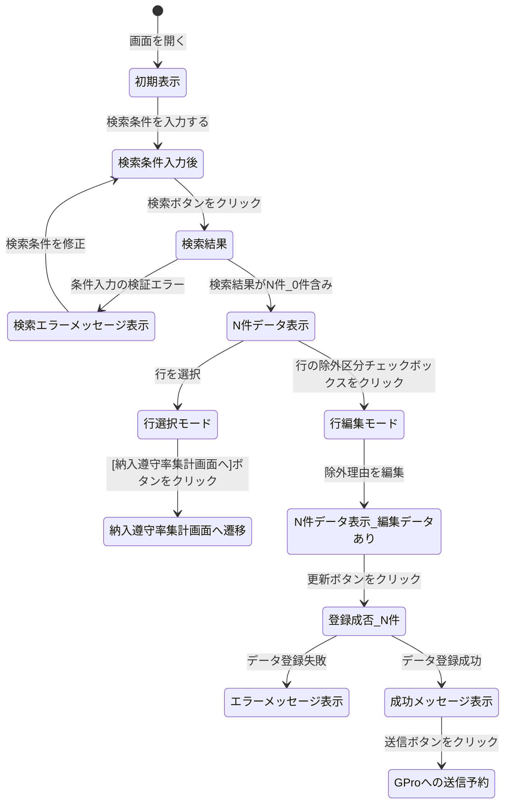

# 0. 表紙

| モジュール名 | プログラムID | プログラム名         |
| ------------ | ------------ | -------------------- |
| IC           | LDB12_01     | 納入遅延オーダー検索 |

| RFC | Version | 更新日     | 更新者 | 更新内容 | 確認日     | 確認者 | 承認日     | 承認者 |
| --- | :-----: | ---------- | :----: | -------- | ---------- | :----: | ---------- | :----: |
| -   |  1.0.0  | 2025/09/10 | 陳培煌 | 初版作成 | 2025/XX/XX |   XX   | 2025/XX/XX |   XX   |

## 1. 機能概要

### 1.1. 機能概要

過去3ヶ月分の納入遵守率の集計で遅延カウントとなったオーダーの明細を照会する機能。
また、災害等やむを得ない理由で遅延となったオーダーを当画面で遅延対象から除外することも可能。
遅延除外の編集後、納入遵守率集計画面で照会できる納入遵守データ、当画面で照会できる遅延明細データをG-Proに送信し、取引先への月次連絡に利用できる。
G-Proへのデータ送信は、1ヶ月以内であれば何回でも可能。
※月初処理で前月分のデータを作成する。

### 1.2. 画面パターン

| 表示形式 |      | 処理形式 |      | 排他制御 |      |      |
| -------- | ---- | -------- | ---- | -------- | ---- | ---- |
| 単票     | 一覧 | 参照     | 更新 | 楽観     | 悲観 | 無し |
| -        | ●   | -        | ●   | ●       | -    | -    |

### 1.3. 画面入出力パラメータ

#### 1.3.1. 引数

| No. | パラメータ論理名 | パラメータ物理名 | 備考 |
| --- | ---------------- | ---------------- | ---- |
| 1   | （なし）         |                  |      |

#### 1.3.2. 戻り値

| No. | パラメータ論理名 | パラメータ物理名 | 備考 |
| --- | ---------------- | ---------------- | ---- |
| 1   | （なし）         |                  |      |

### 1.4. その他制御・要件

| 項目               | 制約・制御・要件など | 記載内容説明 |
| ------------------ | -------------------- | ------------ |
| 稼働状況制御       | 個別制御不要。       |              |
| 権限制御           | 個別制御不要。       |              |
| パフォーマンス要件 | 特になし。           |              |
| セッション維持要件 | 標準に準ずる。       |              |

## 2. レイアウト

### 2.1. 画面レイアウト


### 2.2. 画面項目定義

| No | エリア     | 項目名                       | 項目物理名            | 種別                 | 文字種 | 大文字 | 入出力区分 | 入力必須 | 最大桁数 | 最小桁数 | 小数桁 | 表示時編集内容 | フォーマットチェック | ソース名     | 項目名               | 文字位置 | ツールチップ文言 | 備考                                                                                                       |
| -- | ---------- | ---------------------------- | --------------------- | -------------------- | ------ | ------ | ---------- | -------- | -------- | -------- | ------ | -------------- | -------------------- | ------------ | -------------------- | -------- | ---------------- | ---------------------------------------------------------------------------------------------------------- |
| 1  | 検索条件部 | 供給者                       | supplier              | 入力補助付きテキスト | 文字列 | -      | I          | -        | 4        | -        | -      | -              | 半角英数、ハイフン   | -            | -                    | -        | -                | S/U参照ValueListから取得                                                                                   |
| 2  | 検索条件部 | 使用者                       | usercd                | 入力補助付きテキスト | 文字列 | -      | I          | -        | 4        | -        | -      | -              | 半角英数、ハイフン   | -            | -                    | -        | -                | S/U参照ValueListから取得                                                                                   |
| 3  | 検索条件部 | 納入指示日                   | deliveryDate          | 日付選択             | 日時   | -      | I          | -        | 6        | -        | -      | -              | yyyy-mm              | -            | -                    | -        | -                | デフォルトは前月だが、過去3ヶ月分のデータを照会可能。                                                      |
| 4  | 検索条件部 | 除外区分                     | delayExclusionFlg     | プルダウン           | 文字列 | -      | I/O        | -        | -        | -        | -      | -              | -                    | -            | -                    | -        | -                | ALL(デフォルト)、対象                                                                                      |
| 5  | 検索条件部 | 担当課                       | orgSectionDeliv       | テキスト             | 文字列 | -      | I          | -        | 2        | -        | -      | -              | 半角英数             | -            | -                    | -        | -                | -                                                                                                          |
| 6  | 検索条件部 | 担当者                       | orgPersonDeliv        | テキスト             | 文字列 | -      | I          | -        | 3        | -        | -      | -              | 半角英数             | -            | -                    | -        | -                | -                                                                                                          |
| 7  | 検索条件部 | オーダー種別                 | orderType             | プルダウン           | 文字列 | -      | I/O        | -        | -        | -        | -      | -              | -                    | -            | -                    | -        | -                | オーダー(デフォルト)、独立所要量、ALL                                                                      |
| 8  | 検索条件部 | 生試区分                     | pilotClass            | プルダウン           | 文字列 | -      | I/O        | -        | -        | -        | -      | -              | -                    | -            | -                    | -        | -                | 量産(デフォルト)、生試、ALL                                                                                |
| 9  | 検索条件部 | 臨時サイン                   | sign                  | プルダウン           | 文字列 | -      | I/O        | -        | -        | -        | -      | -              | -                    | -            | -                    | -        | -                | 定期(デフォルト)、臨時、ALL                                                                                |
| 10 | 検索条件部 | [検索]ボタン                 | search                | ボタン               | -      | -      | -          | -        | -        | -        | -      | -              | -                    | -            | -                    | -        | -                | -                                                                                                          |
| 11 | 明細部     | 除外区分                     | delayExclusionFlg     | チェックボックス     | -      | -      | -          | -        | -        | -        | -      | -              | -                    | 納入遅延明細 | 遅延除外フラグ       | -        | -                | -                                                                                                          |
| 12 | 明細部     | 除外理由                     | delayExclusionReason  | テキスト             | 文字列 | -      | I/O        | -        | -        | -        | -      | -              | -                    | 納入遅延明細 | 遅延除外理由         | -        | -                | 除外区分がONの場合入力必須ヤマハ責任、その他、交通事情による、自然災害による、直送元責任、検査規格書未承認 |
| 13 | 明細部     | 品目番号                     | itemno                | テキスト             | 文字列 | -      | O          | -        | 30       | -        | -      | -              | -                    | 納入遅延明細 | 品目番号             | -        | -                | -                                                                                                          |
| 14 | 明細部     | 品目名称                     | itemName              | テキスト             | 文字列 | -      | O          | -        | 30       | -        | -      | -              | -                    | 品目共通     | 品目名称             | -        | -                | -                                                                                                          |
| 15 | 明細部     | 供給者                       | supplier              | テキスト             | 文字列 | -      | O          | -        | 4        | -        | -      | -              | -                    | 納入遅延明細 | 供給者               | -        | -                | -                                                                                                          |
| 16 | 明細部     | 使用者                       | usercd                | テキスト             | 文字列 | -      | O          | -        | 4        | -        | -      | -              | -                    | 納入遅延明細 | 使用者               | -        | -                | -                                                                                                          |
| 17 | 明細部     | 送り先コード                 | indUserCode           | テキスト             | 文字列 | -      | O          | -        | 4        | -        | -      | -              | -                    | 納入遅延明細 | 独立需要送り先コード | -        | -                | -                                                                                                          |
| 18 | 明細部     | オーダーNo.                  | orderNo               | テキスト             | 文字列 | -      | O          | -        | 5        | -        | -      | -              | -                    | 納入遅延明細 | オーダー番号         | -        | -                | -                                                                                                          |
| 19 | 明細部     | 担当課                       | orgSectionDeliv       | テキスト             | 文字列 | -      | O          | -        | 2        | -        | -      | -              | -                    | 納入遅延明細 | 納入側担当課         | -        | -                | -                                                                                                          |
| 20 | 明細部     | 担当者                       | orgPersonDeliv        | テキスト             | 文字列 | -      | O          | -        | 3        | -        | -      | -              | -                    | 納入遅延明細 | 納入側担当者         | -        | -                | -                                                                                                          |
| 21 | 明細部     | 納入指示日                   | deliveryDate          | 日付選択             | 日時   | -      | O          | -        | 8        | -        | -      | -              | -                    | 納入遅延明細 | 納入指示日           | -        | -                | -                                                                                                          |
| 22 | 明細部     | 単位                         | unitName              | テキスト             | 文字列 | -      | O          | -        | 30       | -        | -      | -              | -                    | 納入遅延明細 | 単位名称             | -        | -                | -                                                                                                          |
| 23 | 明細部     | オーダー数                   | orderCount            | 数値テキスト         | 数値   | -      | O          | -        | 15       | -        | 5      | -              | -                    | 納入遅延明細 | 納入指示数           | -        | -                | -                                                                                                          |
| 24 | 明細部     | 最新起票日                   | latestInputDate       | テキスト             | 文字列 | -      | O          | -        | 8        | -        |        | -              | -                    | 納入遅延明細 | 最新起票日           | -        | -                | -                                                                                                          |
| 25 | 明細部     | 報告済み数                   | reportedCount         | 数値テキスト         | 数値   | -      | O          | -        | 15       | -        | 5      | -              | -                    | 納入遅延明細 | 納入数量             | -        | -                | -                                                                                                          |
| 26 | 明細部     | オーダー種別                 | orderType             | テキスト             | 文字列 | -      | O          | -        | 1        | -        | -      | 非表示         | -                    | 納入遅延明細 | オーダー種別         | -        | -                | -                                                                                                          |
| 27 | 明細部     | 生試初品区分                 | pilotClass            | テキスト             | 文字列 | -      | O          | -        | 1        | -        | -      | 非表示         | -                    | 納入遅延明細 | 生試初品区分         | -        | -                | -                                                                                                          |
| 28 | 明細部     | オーダー発行区分             | orderCreateType       | テキスト             | 文字列 | -      | O          | -        | 1        | -        | -      | 非表示         | -                    | 納入遅延明細 | オーダー発行区分     | -        | -                | -                                                                                                          |
| 29 | 明細部     | 納入PF/送り先コード          | pfIndUserCode         | テキスト             | 文字列 | -      | O          | -        | 4        | -        | -      | 非表示         | -                    | 納入遅延明細 | 納入PF/送り先コード  | -        | -                | -                                                                                                          |
| 30 | 明細部     | 現在有効カレンダー           | calendarCode          | テキスト             | 文字列 | -      | O          | -        | 2        | -        | -      | 非表示         | -                    | SUマスタ     | 現在有効カレンダー   | -        | -                | -                                                                                                          |
| 31 | 明細部     | 除外区分隠し                 | delayExclusionFlgHide | テキスト             | 文字列 | -      | O          | -        | 1        | -        | -      | 非表示         | -                    | 納入遅延明細 | 遅延除外フラグ       | -        | -                | -                                                                                                          |
| 32 | 明細部     | 更新カウンタ                 | updateCount           | 数値テキスト         | 数値   | -      | O          | -        | 15       | -        | 5      | 非表示         | -                    | 納入遅延明細 | 更新カウンタ         | -        | -                | -                                                                                                          |
| 33 | フッター部 | [更新]ボタン                 | update                | ボタン               | -      | -      | -          | -        | -        | -        | -      | -              | -                    | -            | -                    | -        | -                | -                                                                                                          |
| 34 | フッター部 | [送信]ボタン                 | send                  | ボタン               | -      | -      | -          | -        | -        | -        | -      | -              | -                    | -            | -                    | -        | -                | -                                                                                                          |
| 35 | フッター部 | [納入遵守率集計画面へ]ボタン | deliveryObservance    | ボタン               | -      | -      | -          | -        | -        | -        | -      | -              | -                    | -            | -                    | -        | -                | -                                                                                                          |

## 3. 入出力

### 3.1. 入出力一覧

| No | 入出力対象 | 名称                   | 物理名称                | C | R  | U  | D | 備考 |
| -- | ---------- | ---------------------- | ----------------------- | - | -- | -- | - | ---- |
| 1  | テーブル   | 納入分析ファイル       | ld_trn_dlv_analysis     |   | ○ | ○ |   |      |
| 2  | テーブル   | 納入遅延明細           | ld_trn_dlv_delay        |   | ○ | ○ |   |      |
| 3  | テーブル   | GIMACエリアマスタ      | la_area_master          |   | ○ |    |   |      |
| 4  | テーブル   | 品目共通               | la_itemcomn             |   | ○ |    |   |      |
| 5  | テーブル   | 納入遵守データ送信予約 | ld_trn_dlv_send_reserve |   | ○ | ○ |   |      |
| 6  | テーブル   | SUマスタ               | la_area_master_su       |   | ○ |    |   |      |
| 7  | 共通関数   | 稼働日日数差計算       | LDYS0010                |   |    |    |   |      |

### 3.2. 画面遷移パラメータ一覧

| No. | 遷移先画面ID | 遷移先画面名称 | パラメータ論理名 | パラメータ物理名 | 備考 |
| --- | ------------ | -------------- | ---------------- | ---------------- | ---- |
| 1   | LDB11_01     | 納入遵守率集計 | 供給者           | supplier         |      |
| 2   | LDB11_01     | 納入遵守率集計 | 使用者           | usercd           |      |
| 3   | LDB11_01     | 納入遵守率集計 | 担当課           | orgSectionDeliv  |      |
| 4   | LDB11_01     | 納入遵守率集計 | 担当者           | orgPersonDeliv   |      |

### 4.1. 初期表示

【画面項目定義】の入出力区分と備考によって、初期画面の制御を行う

条件部の項目について入力可否を制御する。

ボタンの利用可否を制御する。

条件部の納入指示日は先月に設定する

### 4.2.ボタン制御

#### 4.2.1.[検索] ボタン押下

##### 4.2.1.1. バリデーションチェック

| No. | チェック概要             | 項目名             | エラー判定条件                              | メッセージID | メッセージ                                      |
| --- | ------------------------ | ------------------ | ------------------------------------------- | ------------ | ----------------------------------------------- |
| 1   | 供給者の存在チェック     | 条件部の供給者     | 供給者がSUマスタに存在しない場合            | E.10044      | {0}が{1}に存在しません。{0}:供給者,{1}:SUマスタ |
| 2   | 使用者の存在チェック     | 条件部の使用者     | 使用者がSUマスタに存在しない場合            | E.10044      | {0}が{1}に存在しません。{0}:使用者,{1}:SUマスタ |
| 3   | 納入指示日の期限チェック | 条件部の納入指示日 | 納入指示日が過去3ヶ月分のデータではない場合 | E.XXXXX      | 納入指示日は過去3ヶ月分に指定ください           |

##### 4.2.1.2.検索処理

* LDB12_01_retrieveのAPIをコールする
  * 戻り値のdataにデータが存在する場合、明細部の項目にセットする。
  * 戻り値のdataにデータが存在しない場合、明細部に0件で表示する。

| NO | パラメータ        | 設定値              | 備考 |
| -- | ----------------- | ------------------- | ---- |
| 1  | supplier          | 条件部.供給者       |      |
| 2  | usercd            | 条件部.使用者       |      |
| 3  | deliveryDate      | 条件部.納入指示日   |      |
| 4  | delayExclusionFlg | 条件部.除外区分     |      |
| 5  | orgSectionDeliv   | 条件部.担当課       |      |
| 6  | orgPersonDeliv    | 条件部.担当者       |      |
| 7  | orderType         | 条件部.オーダー種別 |      |
| 8  | pilotClass        | 条件部.生試区分     |      |
| 9  | sign              | 条件部.臨時サイン   |      |

#### 4.2.2. [初期表示]ボタン押下

画面OPEN時の状態に戻す

#### 4.2.3. [更新] ボタン押下

##### 4.2.3.1. バリデーションチェック

| No. | チェック概要                                             | 項目名           | エラー判定条件                                           | メッセージID | メッセージ |
| --- | -------------------------------------------------------- | ---------------- | -------------------------------------------------------- | ------------ | ---------- |
| 1   | 除外区分チェックボックスがONかつ除外理由がブランクの場合 | 明細部の除外理由 | 除外区分チェックボックスがONかつ除外理由がブランクの場合 | E.XXXX       |            |

##### 4.2.3.2. 納入遅延明細と納入分析ファイルの更新

- LDB12_01_saveのAPIをコールする

| NO | パラメータ名          | 設定値                     | 備考 |
| -- | --------------------- | -------------------------- | ---- |
| 1  | delayExclusionFlg     | 明細部.除外区分            |      |
| 2  | delayExclusionReason  | 明細部.除外理由            |      |
| 3  | itemno                | 明細部.品目番号            |      |
| 4  | itemName              | 明細部.品目名称            |      |
| 5  | supplier              | 明細部.供給者              |      |
| 6  | usercd                | 明細部.使用者              |      |
| 7  | indUserCode           | 明細部.送り先コード        |      |
| 8  | orderNo               | 明細部.オーダーNo.         |      |
| 9  | orgSectionDeliv       | 明細部.担当課              |      |
| 10 | orgPersonDeliv        | 明細部.担当者              |      |
| 11 | deliveryDate          | 明細部.納入指示日          |      |
| 12 | unitName              | 明細部.単位                |      |
| 13 | orderCount            | 明細部.オーダー数          |      |
| 14 | latestInputDate       | 明細部.最新起票日          |      |
| 15 | reportedCount         | 明細部.報告済み数          |      |
| 16 | updateCount           | 明細部.更新カウンタ        |      |
| 17 | orderType             | 明細部.オーダー種別        |      |
| 18 | pilotClass            | 明細部.生試初品区分        |      |
| 19 | orderCreateType       | 明細部.オーダー発行区分    |      |
| 20 | pfIndUserCode         | 明細部.納入PF/送り先コード |      |
| 21 | delayExclusionFlgHide | 明細部.除外区分隠し        |      |

#### 4.2.4.[送信] ボタン押下

##### 4.2.4.1. 送信処理

* LDB12_01_sendのAPIをコールする

#### 4.2.5.[納入遵守率集計画面へ] ボタン押下

* 納入遵守率集計(LDB11)に遷移する

### 4.3.チェンジイベント

#### 4.3.1.検索条件部項目変更

##### 4.3.1.1.明細部を変更しない場合、明細部をクリアする

※ボタンの使用可／不可の制御は初期表示時の状態に戻す

##### 4.3.1.2.明細部を変更し、更新処理の前に検索条件を変更すると、確認メッセージを表示する

「C.10188:変更途中のデータが破棄されますがよろしいですか？」

###### 4.3.1.2.1.「確定」ボタンを押下場合、明細部をクリアする

　　※ボタンの使用可／不可の制御は初期表示時の状態に戻す

###### 4.3.1.2.2.「キャンセル」をボタン押下場合、条件部に変更した項目を変更前の値に戻る、他のはそのまま変更前の状態で表示する

##### 4.3.1.3.担当課がチェンジの場合、担当者をクリアする

#### 4.3.2.検索明細部項目変更

##### 4.3.2.1.「除外区分」チェックボックス

* チェックボックスをONにした場合除外理由項目を編集可能にする
* チェックボックスをOFFにした場合除外理由項目をブランクにし、編集不可にする

## 5. 状態遷移図



## 6. I/F

### 6.1. シーケンス図

### 6.2. API仕様書

| No. | API名           | API概要説明                          | メソッド | エンドポイント          | Javaメソッド                       | リクエストパラメータ |
| --- | --------------- | ------------------------------------ | -------- | ----------------------- | ---------------------------------- | -------------------- |
| 1   | LDB_12_retrieve | 納入遅延明細のデータを検索する       | `POST` | `/api/ldb12/retrieve` | `LDB12Controller#retrieveData()` | JSON                 |
| 2   | LDB_12_update   | 納入遅延明細と納入分析ファイルの更新 | `POST` | `/api/ldb12/update`   | `LDB12Controller#updateData()`   | JSON                 |
| 3   | LDB_12_send     | 納入遵守データ送信予約の更新         | `POST` | `/api/ldb12/send`     | `LDB12Controller#sendData()`     | JSON                 |

#### 6.2.1. LDB12_01_retrieveのAPI

##### 6.2.1.1. 外部仕様

##### 6.2.1.2. 内部仕様

###### 6.2.1.2.1 納入遅延明細情報の検索

```sql
   SELECT A.遅延除外フラグ   AS 除外区分
         ,A.遅延除外理由     AS 除外理由
         ,A.品目番号
         ,B.品目名称
         ,A.供給者
         ,A.使用者
         ,A.独立需要送り先コード AS 送り先コード
         ,A.オーダー番号        AS オーダーNo.
         ,A.納入側担当課        AS 担当課
         ,A.納入側担当者        AS 担当者
         ,A.納入指示日
         ,A.単位名称            AS 単位
         ,A.納入指示数          AS オーダー数
         ,A.最新起票日
         ,A.納入数量            AS 報告済み数
         ,A.オーダー種別
         ,A.生試初品区分
         ,A.オーダー発行区分
         ,A.納入PF/送り先コード
         ,A.遅延除外フラグ   AS 除外区分隠し
         ,A.更新カウンタ
     FROM 納入遅延明細 A
LEFT JOIN 品目共通 B
       ON A.品目番号　　　　　　　　　　= 　B.品目番号
INNER JOIN GIMACエリアマスタ C
        ON D.エリアコード　　 = C.エリアコード
INNER JOIN SUマスタ D
        ON A.使用者　　　　 = D.SUコード
     WHERE 1 = 1
    -- 供給者の入力がある場合
       AND A.供給者         = 条件部.供給者
    -- 使用者の入力がある場合
       AND A.使用者        = 条件部.使用者
    -- 納入指示日の入力がある場合
       AND A.納入指示日 >= DATE_TRUNC('month', TO_DATE(:条件部.納入指示日, 'YYYYMM'))
       AND A.納入指示日 < DATE_TRUNC('month', TO_DATE(:条件部.納入指示日, 'YYYYMM')) + INTERVAL '1 month'
    -- 除外区分が対象(遅延除外)場合
       AND A.遅延除外フラグ = '1'
    -- 担当課の入力がある場合
       AND A.担当課          = 条件部.担当課
    -- 担当者の入力がある場合
       AND A.担当者           = 条件部.担当者
    -- オーダー種別はALLではない場合
       AND A.オーダー種別     = 条件部.オーダー種別
    -- 生試区分はALLではない場合
       AND A.生試初品区分      = 条件部.生試区分
    -- 臨時サインはALLではない場合
       AND A.オーダー発行区分 = 条件部.臨時サイン
  ORDER BY A.品目番号, A.供給者 ,A.使用者 , A.担当課, A.担当者, C.納入指示日
```

#### 6.2.2. LDB_12_updateのAPI

##### 6.2.2.1. 外部仕様

##### 6.2.2.2. 内部仕様

###### 6.2.2.2.1. 更新データの納入遅延明細の存在チェックを実施する

- 納入遅延明細に更新行のデータが存在しない場合、処理を中断してロールバックを実施し、エラーメッセージを表示する。
  　エラーメッセージ：E.LDP10568:他のユーザーによって更新されています。

```sql
     SELECT COUNT(1)
       FROM 納入遅延明細
      WHERE 品目番号               = 明細部.品目番号
        AND 供給者                 = 明細部.供給者
        AND 使用者                 = 明細部.使用者
        AND オーダー番号           = 明細部.オーダーNo.
        AND 更新カウンタ           = 明細部.更新カウンタ
```

###### 6.2.2.2.2. 更新データの納入遅延明細の更新を実施する

```sql
     UPDATE 納入遅延明細
        SET 遅延除外理由           = 明細部.除外理由
           ,遅延除外フラグ         = 明細部.除外区分
           ,更新カウンタ           = 更新カウンタ + 1
           ,更新日時               = システム日時
           ,更新者                 = ログインのユーザーID
           ,更新ＰＧＩＤ           = プログラムID
      WHERE 品目番号               = 明細部.品目番号
        AND 供給者                 = 明細部.供給者
        AND 使用者                 = 明細部.使用者
        AND オーダー番号           = 明細部.オーダーNo.
        AND 更新カウンタ           = 明細部.更新カウンタ
```

###### 6.2.2.2.3. 納入分析ファイルの更新を実施する

* 更新データを該当データがなくなるまで
  * 更新データ.遅延除外フラグと更新データ.遅延除外フラグ隠しが同じ場合

    * 何もしない
  * それ以外の場合

    変数.差数 = 更新データ.納入指示数 - 更新データ.納入数量
    変数.遵守変更件数 = 0
    変数.遵守オーダー変更数  = 0
    変数.遅延変更件数1 = 0
    変数.遅延変更件数2 = 0
    変数.遅延変更件数3 = 0
    変数.遅延変更件数4 = 0
    変数.遅延変更件数5 = 0
    変数.遅延変更件数6 = 0
    変数.遅延オーダー変更数1 = 0
    変数.遅延オーダー変更数2 = 0
    変数.遅延オーダー変更数3 = 0
    変数.遅延オーダー変更数4 = 0
    変数.遅延オーダー変更数5 = 0
    変数.遅延オーダー変更数6 = 0

    - 稼働日日数差計算をコールし、納入指示日と最新起票日の稼働日日数差を取得する

    | NO | パラメータ名     | 設定値             | 備考 |
    | -- | ---------------- | ------------------ | ---- |
    | 1  | カレンダーコード | 現在有効カレンダー |      |
    | 2  | 基準日           | 納入指示日         |      |
    | 3  | 指定日           | 最新起票日         |      |


    - 更新データ.遅延除外フラグは'0'（除外しない）の場合
      変数.遵守変更件数 = -1
      変数.遵守オーダー変更数  = - 変数.差数
      - 稼働日日数差 >= 6 の場合
        変数.遅延変更件数6 = 1
        変数.遅延オーダー変更数6 = 変数.差数
      - ほかの場合
        SWITCH (稼働日日数差)
        CASE 1:
        変数.遅延変更件数1 = 1
        変数.遅延オーダー変更数1 = 変数.差数
        CASE 2:
        変数.遅延変更件数2 = 1
        変数.遅延オーダー変更数2 = 変数.差数
        CASE 3:
        変数.遅延変更件数3 = 1
        変数.遅延オーダー変更数3 = 変数.差数
        CASE 4:
        変数.遅延変更件数4 = 1
        変数.遅延オーダー変更数4 = 変数.差数
        CASE 5:
        変数.遅延変更件数5 = 1
        変数.遅延オーダー変更数5 = 変数.差数
    - 更新データ.遅延除外フラグは'1'（除外）の場合
      変数.遵守変更件数 = 1
      変数.遵守オーダー変更数  =  変数.差数
      - 稼働日日数差 >= 6 の場合
        変数.遅延変更件数6 = - 1
        変数.遅延オーダー変更数6 = - 1 * 変数.差数
      - ほかの場合
        SWITCH (稼働日日数差)
        CASE 1:
        変数.遅延変更件数1 = - 1
        変数.遅延オーダー変更数1 = - 1 * 変数.差数
        CASE 2:
        変数.遅延変更件数2 = - 1
        変数.遅延オーダー変更数2 = - 1 * 変数.差数
        CASE 3:
        変数.遅延変更件数3 = - 1
        変数.遅延オーダー変更数3 = - 1 * 変数.差数
        CASE 4:
        変数.遅延変更件数4 = - 1
        変数.遅延オーダー変更数4 = - 1 * 変数.差数
        CASE 5:
        変数.遅延変更件数5 = - 1
        変数.遅延オーダー変更数5 = - 1 * 変数.差数

    ```sql
       UPDATE 納入分析ファイル
          SET 遵守件数               = 遵守件数 + 変数.遵守変更件数
             ,遵守オーダー数         = 遵守オーダー数 + 変数.遵守オーダー変更数
             ,遅延件数1              = 遅延件数1 + 変数.遅延変更件数1
             ,遅延オーダー数1        = 遅延オーダー数1 + 変数.遅延オーダー変更数1
             ,遅延件数2              = 遅延件数2 + 変数.遅延変更件数2
             ,遅延オーダー数2        = 遅延オーダー数2 + 変数.遅延オーダー変更数2
             ,遅延件数3              = 遅延件数3 + 変数.遅延変更件数3
             ,遅延オーダー数3        = 遅延オーダー数3 + 変数.遅延オーダー変更数3
             ,遅延件数4              = 遅延件数4 + 変数.遅延変更件数4
             ,遅延オーダー数4        = 遅延オーダー数4 + 変数.遅延オーダー変更数4
             ,遅延件数5              = 遅延件数5 + 変数.遅延変更件数5
             ,遅延オーダー数5        = 遅延オーダー数5 + 変数.遅延オーダー変更数5
             ,遅延件数6              = 遅延件数6 + 変数.遅延変更件数6
             ,遅延オーダー数6        = 遅延オーダー数6 + 変数.遅延変更件数6
             ,更新カウンタ           = 更新カウンタ + 1
             ,更新日時               = システム日時
             ,更新者                 = ログインのユーザーID
             ,更新ＰＧＩＤ           = プログラムID
        WHERE 集計月                = 更新対象リスト.納入指示日
          AND 供給者                 = 更新対象リスト.供給者
          AND 使用者                 = 更新対象リスト.使用者
          AND オーダー種別           = 更新対象リスト.オーダー種別
          AND オーダー発行区分       = 更新対象リスト.オーダー発行区分
          -- 更新対象リスト.オーダー種別は'1'の場合、
          AND 納入PF番号             = 更新対象リスト.納入PF/独立需要送り先コード
    ```

###### 6.2.2.2.4. 更新処理終了後、再検索し画面を表示する

#### 6.2.3. LDB_12_sendのAPI

##### 6.2.3.1. 外部仕様

##### 6.2.3.2. 内部仕様

###### 6.2.3.2.1. 現在工場処理日の取得を実施する

* LDYS0007現在工場処理日取得をコールする,変数.現在工場処理日に設定する

###### 6.2.3.2.2. 納入遵守データ送信予約の更新

```sql
     UPDATE 納入遵守データ送信予約
        SET 予約日                 = 変数.現在工場処理日
           ,更新カウンタ           = 更新カウンタ + 1
           ,更新日時               = システム日時
           ,更新者                 = ログインのユーザーID
           ,更新ＰＧＩＤ           = プログラムID
      WHERE 処理タイプ             = 'RSV'
```

## 7.補足

### 7.1. 補足説明任意記入
