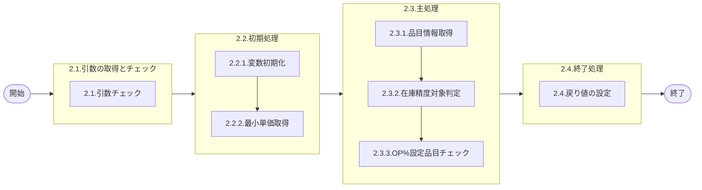

# 0. 表紙

| モジュール名 | プログラムID | プログラム名                         |
| ------------ | ------------ | ------------------------------------ |
| IC           | LDGS0001     | 社内棚卸在庫精度算出対象品目チェック |

| RFC | Version | 更新日     | 更新者 | 更新内容 | 確認日     | 確認者 | 承認日     | 承認者 |
| --- | :-----: | ---------- | :----: | -------- | ---------- | :----: | ---------- | :----: |
| -   |  1.0.0  | 2025/11/18 | 陳培煌 | 初版作成 | 2025/XX/XX |        | 2025/XX/XX |        |

## 1. 処理概要

### 1.1. 機能概要

品目マスタ、ICパラメータテーブル、MRP情報値を抽出し、在庫精度対象外の判別を行う。
≪在庫精度対象外条件（OR条件）≫
１．棚卸対象品目クラスでない。（ICパラメータTBL指定）
２．AIRS品目である。
３．品目ステータスが‘2’（生試）、‘3’（初品）、‘9’（製作不可）である。
４．Wビン管理品目である。
５．期末時理論在庫数、棚卸実在庫数、所要量出庫累計が全てゼロである。
６．MRP需要方針コード＝‘2’（ハンド管理）かつ、シンクロ管理品目かつ、S≠Uである。
７．使用中仕損率≠０である。
８．NEW安全在庫≠0である。
９．積上げ単価≦在庫精度除外単価（ICパラメータTBL指定）である。
１０．在庫精度算出対象外担当課である。（ICパラメータTBL指定）
１１．AM補給部品の納入先である。
１２．在庫精度算出対象外SU/検索キーである。（ICパラメータTBL指定）
１３．OP%設定品目である。（AIRSの場合には下位品目）
※品目マスタ、MRP情報値、GIMACエリアマスタ、GIMACエリアマスタSU情報TBLに該当データが存在しない場合は、異常終了する。

### 1.2. 処理概要フロー



### 1.3. プログラム入出力パラメータ

#### 1.3.1. 引数

| No. | パラメータ論理名   | パラメータ物理名 | 属性          | 備考     |
| --- | ------------------ | ---------------- | ------------- | -------- |
| 1   | 棚卸日             | ps_st_date       | VARCHAR(8)    | YYYYMMDD |
| 2   | 品目番号           | ps_itemno        | VARCHAR(30)   |          |
| 3   | 供給者             | ps_supplier      | VARCHAR(4)    |          |
| 4   | 使用者             | ps_usercd        | VARCHAR(4)    |          |
| 5   | 品目ステータス     | ps_item_status   | VARCHAR(1)    |          |
| 6   | 期末日手持在庫数   | pn_et_oh_qty     | INTEGER       |          |
| 7   | 棚卸結果手持在庫数 | pn_rslt_oh_qty   | INTEGER       |          |
| 8   | 所要量出庫累計     | pn_ttl_req_qty   | INTEGER       |          |
| 9   | 積上単価           | pn_ttl_cost      | DECIMAL(15,4) |          |

#### 1.3.2. 戻り値

| No. | パラメータ論理名 | パラメータ物理名 | 属性    | 備考                                               |
| --- | ---------------- | ---------------- | ------- | -------------------------------------------------- |
| 1   | 処理ステータス   | rn_status        | INTEGER | 0:Normal-1:SqlError-2:ProgramError100:NotDataFound |
| 2   | SQLコード        | rs_sql_code      | VARCHAR |                                                    |
| 3   | エラーコード     | rs_err_code      | VARCHAR |                                                    |
| 4   | エラーメッセージ | rs_err_msg       | VARCHAR |                                                    |
| 5   | エラー位置       | rs_err_focus     | VARCHAR |                                                    |
| 6   | 判定結果         | rs_judge         | VARCHAR | "0":在庫精度算出対象、"1":在庫精度算出対象外       |

### 1.4. その他制御・要件

| 排他制御 |      |      |
| -------- | ---- | ---- |
| 楽観     | 悲観 | 無し |
| ●       | -    | -    |

| 項目               | 制約・制御・要件など | 記載内容説明 |
| ------------------ | -------------------- | ------------ |
| パフォーマンス要件 |                      |              |

### 1.5. 入出力一覧

| No | 入出力対象 | 名称                    | 物理名称               | C | R  | U | D | 備考         |
| -- | ---------- | ----------------------- | ---------------------- | - | -- | - | - | ------------ |
| 1  | テーブル   | 品目マスター            | la_itemmast            | - | ○ | - | - |              |
| 2  | テーブル   | MRP情報値               | le_mst_mrp_information | - | ○ | - | - |              |
| 3  | テーブル   | GIMACエリアマスタSU情報 | la_area_master_su      | - | ○ | - | - |              |
| 4  | テーブル   | GIMACエリアマスタ       | la_area_master         | - | ○ | - | - |              |
| 5  | テーブル   | ICパラメータテーブル    | ld_trn_st_parm_table   | - | ○ | - | - |              |
| 6  | テーブル   | オプション％影響品目    | ld_trn_st_opper_impact | - | ○ | - | - |              |
| 7  | テーブル   | リテラル防止グループ    | lz_anti_literal_group  | - | ○ | - | - | ※ＡＭ判定用 |

## 2. 詳細処理

### 2.1. 引数の受け取りとチェック

引数の妥当性をチェックする。

#### 2.1.1. 棚卸日チェック

- 引数.棚卸日が ブランク 又は NULL の場合、エラーメッセージを出力し処理終了。

  - エラーコード : 'LDP10567'
  - エラーメッセージ : 'Subtraction value error has occurred in the internal processing. Contact the staff in charge of the system.'
  - (処理内部にて引数値エラーが発生しました  システム管理者に連絡してください)

#### 2.1.2. 品目番号チェック

- 引数.品目番号が ブランク 又は NULL の場合、エラーメッセージを出力し処理終了。

  - エラーコード : 'LDP10567'
  - エラーメッセージ : 'Subtraction value error has occurred in the internal processing. Contact the staff in charge of the system.'
  - (処理内部にて引数値エラーが発生しました  システム管理者に連絡してください)

#### 2.1.3. 供給者チェック

- 引数.供給者が ブランク 又は NULL の場合、エラーメッセージを出力し処理終了。

  - エラーコード : 'LDP10567'
  - エラーメッセージ : 'Subtraction value error has occurred in the internal processing. Contact the staff in charge of the system.'
  - (処理内部にて引数値エラーが発生しました  システム管理者に連絡してください)

#### 2.1.4. 使用者チェック

- 引数.使用者が ブランク 又は NULL の場合、エラーメッセージを出力し処理終了。

  - エラーコード : 'LDP10567'
  - エラーメッセージ : 'Subtraction value error has occurred in the internal processing. Contact the staff in charge of the system.'
  - (処理内部にて引数値エラーが発生しました  システム管理者に連絡してください)

#### 2.1.5. 品目ステータスチェック

- 引数.品目ステータスが ブランク 又は NULL の場合、エラーメッセージを出力し処理終了。

  - エラーコード : 'LDP10567'
  - エラーメッセージ : 'Subtraction value error has occurred in the internal processing. Contact the staff in charge of the system.'
  - (処理内部にて引数値エラーが発生しました  システム管理者に連絡してください)

#### 2.1.6. 期末日手持在庫数チェック

- 引数.期末日手持在庫数が NULL の場合、エラーメッセージを出力し処理終了。

  - エラーコード : 'LDP10567'
  - エラーメッセージ : 'Subtraction value error has occurred in the internal processing. Contact the staff in charge of the system.'
  - (処理内部にて引数値エラーが発生しました  システム管理者に連絡してください)

#### 2.1.7. 棚卸結果手持在庫数チェック

- 引数.棚卸結果手持在庫数が NULL の場合、エラーメッセージを出力し処理終了。

  - エラーコード : 'LDP10567'
  - エラーメッセージ : 'Subtraction value error has occurred in the internal processing. Contact the staff in charge of the system.'
  - (処理内部にて引数値エラーが発生しました  システム管理者に連絡してください)

#### 2.1.8. 所要量出庫累計チェック

- 引数.所要量出庫累計が NULL の場合、エラーメッセージを出力し処理終了。

  - エラーコード : 'LDP10567'
  - エラーメッセージ : 'Subtraction value error has occurred in the internal processing. Contact the staff in charge of the system.'
  - (処理内部にて引数値エラーが発生しました  システム管理者に連絡してください)

#### 2.1.9. 積上単価チェック

- 引数.積上単価が NULL の場合、エラーメッセージを出力し処理終了。

  - エラーコード : 'LDP10567'
  - エラーメッセージ : 'Subtraction value error has occurred in the internal processing. Contact the staff in charge of the system.'
  - (処理内部にて引数値エラーが発生しました  システム管理者に連絡してください)

### 2.2. 初期処理

#### 2.2.1. 変数初期化

利用する変数を初期化する。

| No. | 変数論理名              | 変数物理名          | 初期化設定値 |
| :-: | ----------------------- | ------------------- | ------------ |
|  1  | 変数.最小単価           | ln_min_cost         | 0.0          |
|  2  | 変数.品目番号           | ls_itemno           | スペース     |
|  3  | 変数.供給者             | ls_supplier         | スペース     |
|  4  | 変数.使用者             | ls_usercd           | スペース     |
|  5  | 変数.品目クラス         | ls_item_class       | スペース     |
|  6  | 変数.AIRSサイン         | ls_airs_sign        | スペース     |
|  7  | 変数.Wビン管理コード    | ls_wbin_ctrl_cd     | スペース     |
|  8  | 変数.需要方針コード     | ls_demand_pol_cd    | スペース     |
|  9  | 変数.シンクロ管理コード | ls_synchro_ctrl_cd  | スペース     |
| 10 | 変数.使用中仕損率       | ln_use_scrap_ratio  | 0            |
| 11 | 変数.NEW安全在庫        | ln_new_safety_stock | 0            |
| 12 | 変数.対象品目クラス     | ls_target_itm_class | スペース     |
| 13 | 変数.担当課             | ls_section          | スペース     |
| 14 | 変数.供給者(検索キー)   | ls_sup              | スペース     |
| 15 | 変数.使用者(検索キー)   | ls_usr              | スペース     |
| 16 | 変数.検索キー           | ls_refkey           | スペース     |
| 17 | 変数.AM部品             | ls_am_parts         | スペース     |
| 18 | 変数.判定結果           | ls_judge            | "0"          |

#### 2.2.2. 最小単価取得

ICパラメータテーブルから在庫精度除外単価を取得する。

```sql
SELECT CAST(replace_value1 AS DECIMAL(15, 4))
  INTO 変数.最小単価
  FROM ld_trn_st_parm_table  -- ICパラメータテーブル
 WHERE ic_param_id_code = 'ST03'
   AND control_key1     = ' '
   AND control_key2     = ' '
   AND control_key3     = ' '
   AND control_key4     = ' '
   AND control_key5     = ' '
```

データが存在しない場合、変数.最小単価 = 0.0 とする。

### 2.3. 主処理

#### 2.3.1. 品目情報取得

品目マスター、MRP情報値、GIMACエリアマスタ等を結合して必要な情報を取得する。

```sql
SELECT A.itemno                                              -- 品目番号
      ,A.supplier                                            -- 供給者
      ,A.usercd                                              -- 使用者
      ,A.item_class                                          -- 品目クラス
      ,COALESCE(NULLIF(B.airs_sign,' '), D.airs_sign, ' ')   -- AIRSサイン
      ,B.wbin_control_code                                   -- Wビン管理コード
      ,B.demand_policy_code                                  -- 需要方針コード
      ,B.synchro_control_code                                -- シンクロ管理コード
      ,B.use_scrap_ratio                                     -- 使用中仕損率
      ,B.fix_safety_stock_qty                                -- NEW安全在庫
      ,COALESCE(E.replace_value1, ' ')                       -- 対象品目クラス(ICパラメータ:ST06)
      ,COALESCE(F.replace_value1, ' ')                       -- 担当課(ICパラメータ:ST17)
      ,COALESCE(G.replace_value1, ' ')                       -- 供給者(検索キー)(ICパラメータ:ST23)
      ,COALESCE(G.replace_value2, ' ')                       -- 使用者(検索キー)(ICパラメータ:ST23)
      ,COALESCE(G.replace_value3, ' ')                       -- 検索キー(ICパラメータ:ST23)
      ,COALESCE(H.replace_value1, ' ')                       -- AM部品(リテラル防止グループ)
  INTO 変数.品目番号
      ,変数.供給者
      ,変数.使用者
      ,変数.品目クラス
      ,変数.AIRSサイン
      ,変数.Wビン管理コード
      ,変数.需要方針コード
      ,変数.シンクロ管理コード
      ,変数.使用中仕損率
      ,変数.NEW安全在庫
      ,変数.対象品目クラス
      ,変数.担当課
      ,変数.供給者(検索キー)
      ,変数.使用者(検索キー)
      ,変数.検索キー
      ,変数.AM部品
  FROM la_itemmast A  -- GIMAC品目マスタ
 INNER JOIN le_mst_mrp_information B  -- GIMAC MRP情報値
    ON B.itemno   = A.itemno
   AND B.supplier = A.supplier
   AND B.usercd   = A.usercd
 INNER JOIN la_area_master_su D  -- GIMACエリアマスタSU情報
    ON D.su_code = A.usercd
 INNER JOIN la_area_master C  -- GIMACエリアマスタ
    ON C.area_code = D.area_code
  LEFT JOIN ld_trn_st_parm_table E  -- ICパラメータテーブル
    ON E.ic_param_id_code = 'ST06'
   AND E.control_key1     = A.item_class
   AND E.control_key2     = ' '
   AND E.control_key3     = ' '
   AND E.control_key4     = ' '
   AND E.control_key5     = ' '
  LEFT JOIN ld_trn_st_parm_table F
    ON F.ic_param_id_code = 'ST17'
   AND F.control_key1     = C.area_section_code
   AND F.control_key2     = ' '
   AND F.control_key3     = ' '
   AND F.control_key4     = ' '
   AND F.control_key5     = ' '
  LEFT JOIN ld_trn_st_parm_table G
    ON G.ic_param_id_code = 'ST23'
   AND A.supplier         LIKE TRIM(G.control_key1) || '%'
   AND A.usercd           LIKE TRIM(G.control_key2) || '%'
   AND A.reference_key    LIKE TRIM(G.control_key3) || '%'
   AND G.control_key4     = ' '
   AND G.control_key5     = ' '
  LEFT JOIN lz_anti_literal_group H
    ON H.id_code           = 'AM_PARTS'
   AND H.control_key1_type = 'USERCD'
   AND A.usercd            = H.control_key1_type
 WHERE A.itemno   = 引数.品目番号
   AND A.supplier = 引数.供給者
   AND A.usercd   = 引数.使用者
 LIMIT 1
```

データが存在しない場合、エラーメッセージを出力し処理終了

- エラーコード:'LDP10002'
- エラーメッセージ:'Data does not exist. Item No:' || 引数.品目番号 || ' Supplier:' || 引数.供給者 || ' User CD:' || 引数.使用者

#### 2.3.2. 在庫精度対象判定

以下のいずれかの条件に該当する場合、在庫精度算出対象外と判定する。

1. 変数.対象品目クラス = ' ' (棚卸対象品目クラスでない)
2. 変数.AIRSサイン = '1' (AIRS品目である)
3. 引数.品目ステータス IN ('2','3','9') (生試、初品、製作不可)
4. 変数.Wビン管理コード = '1' (Wビン管理品目である)
5. 引数.期末日手持在庫数 = 0 かつ 引数.棚卸結果手持在庫数 = 0 かつ 引数.所要量出庫累計 = 0
6. 変数.需要方針コード = '2' かつ 変数.シンクロ管理コード = '1' かつ 変数.供給者 <> 変数.使用者
7. 変数.使用中仕損率 <> 0
8. 引数.積上単価 <= 変数.最小単価
9. 変数.担当課 <> ' ' (在庫精度算出対象外担当課である)
10. 変数.供給者(検索キー) <> ' ' または 変数.使用者(検索キー) <> ' ' または 変数.検索キー <> ' '
11. 変数.AM部品 <> ' ' (AM補給部品の納入先である)

上記いずれかに該当する場合:
    変数.判定結果 = "1"

#### 2.3.3. OP%設定品目チェック

変数.判定結果 = "0" の場合、オプション％影響品目テーブルをチェックする。

```sql
SELECT COUNT(*)
  INTO 変数.カウント
  FROM ld_trn_st_opper_impact A  -- オプション％影響品目テーブル
 WHERE A.st_ymd       = 引数.棚卸日
   AND A.impact_class = '2'
   AND A.itemno       = 引数.品目番号
   AND A.supplier     = 引数.供給者
   AND A.usercd       = 引数.使用者
```

変数.カウント > 0 の場合:
    変数.判定結果 = "1"

### 2.4. 終了処理

戻り値に設定する。

| 戻り値論理名     | 属性    | 設定値        |
| ---------------- | ------- | ------------- |
| 処理ステータス   | INTEGER | 0             |
| SQLコード        | VARCHAR | スペース      |
| エラーコード     | VARCHAR | スペース      |
| エラーメッセージ | VARCHAR | スペース      |
| エラー位置       | VARCHAR | スペース      |
| 判定結果         | VARCHAR | 変数.判定結果 |

## 3. 補足説明

### 3.1. 戻り値について

**ステータスについて**

- 0 : Normal（正常終了）
- 100 : Not Data Found（データなし）
- -1 : Sql Error（SQLエラー）
- -2 : Program Error（プログラムエラー）

### 3.2. エラー発生時の対応について

#### 3.2.1. 業務例外処理

引数チェック等でプログラムエラーが発生した場合：

| 戻り値           | 設定値         |
| ---------------- | -------------- |
| 処理ステータス   | -2             |
| SQLコード        | スペース       |
| エラーコード     | エラーコード値 |
| エラーメッセージ | エラー内容     |
| エラー位置       | 'LDGS0001'     |
| その他項目       | 初期値         |

#### 3.2.2. その他例外処理

データベースアクセス時にSQLエラーが発生した場合：

| 戻り値           | 設定値     |
| ---------------- | ---------- |
| 処理ステータス   | -1         |
| SQLコード        | SQLSTATE   |
| エラーコード     | スペース   |
| エラーメッセージ | SQLERRM    |
| エラー位置       | 'LDGS0001' |
| その他項目       | 初期値     |
