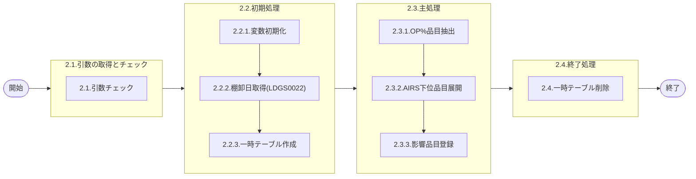

# 0. 表紙

| モジュール名 | プログラムID | プログラム名                                    |
| ------------ | ------------ | ----------------------------------------------- |
| IC           | LDGS0002     | 2社手配(OP%)在庫数量影響品目抽出(在庫精度除外） |

| RFC | Version | 更新日     | 更新者 | 更新内容 | 確認日     | 確認者 | 承認日     | 承認者 |
| --- | :-----: | ---------- | :----: | -------- | ---------- | :----: | ---------- | :----: |
| -   |  1.0.0  | 2025/11/19 | AI生成 | 初版作成 | 2025/XX/XX |  XXX  | 2025/XX/XX |  XXX  |

## 1. 処理概要

### 1.1. 機能概要

製品構成TBLより2社手配(OP%)品目を抽出する。
2社手配(OP%)品目がAIRSの場合、NOTAIRS下位品目まで抽出する。
※LDGS0022_棚卸日取得・チェックを利用

### 1.2. 処理概要フロ�?



### 1.3. プログラム入出力パラメータ

#### 1.3.1. 引数

| No. | パラメータ論理名 | パラメータ物理名 | 属性       | 備考     |
| --- | ---------------- | ---------------- | ---------- | -------- |
| 1   | 棚卸日           | ps_st_date       | VARCHAR(8) | YYYYMMDD |

#### 1.3.2. 戻り値

| No. | パラメータ論理名 | パラメータ物理名 | 属性    | 備考                               |
| --- | ---------------- | ---------------- | ------- | ---------------------------------- |
| 1   | 処理ステータス   | rn_status        | INTEGER | 0:Normal-1:SqlError-2:ProgramError |
| 2   | SQLコード        | rs_sql_code      | VARCHAR |                                    |
| 3   | エラーコード     | rs_err_code      | VARCHAR |                                    |
| 4   | エラーメッセージ | rs_err_msg       | VARCHAR |                                    |
| 5   | エラー位置       | rs_err_focus     | VARCHAR |                                    |

### 1.4. その他制御・要件

| 排他制御 |      |      |
| -------- | ---- | ---- |
| 楽観     | 悲観 | 無し |
| ●       | -    | -    |

| 項目               | 制約・制御・要件など | 記載内容説明 |
| ------------------ | -------------------- | ------------ |
| パフォーマンス要件 |                      |              |

### 1.5. 入出力一覧

| No | 入出力対象 | 名称                    | 物理名称               | C  | R  | U | D | 備考           |
| -- | ---------- | ----------------------- | ---------------------- | -- | -- | - | - | -------------- |
| 1  | テーブル   | 品目マスター            | la_itemmast            |    | ○ |   |   |                |
| 2  | テーブル   | MRP情報値               | le_mst_mrp_information |    | ○ |   |   |                |
| 3  | テーブル   | GIMACエリアマスタSU情報 | la_area_master_su      |    | ○ |   |   | (旧)組織SU情報 |
| 4  | テーブル   | 製品構成                | la_prodstrc            |    | ○ |   |   |                |
| 5  | テーブル   | ICパラメータテーブル    | ld_trn_st_parm_table   |    | ○ |   |   |                |
| 6  | テーブル   | オプション％影響品目    | ld_trn_st_opper_impact | ○ |    |   |   |                |
| 7  | 共通関数   | 棚卸日取得・チェック    | LDGS0022               |    |    |   |   |                |

## 2. 詳細処理

### 2.1. 引数の受け取りとチェック

#### 2.1.1. 棚卸日チェック

- 引数.棚卸日が NULL の場合、エラーメッセージを出力し処理終了。
  - エラーコード : 'LDP10567'
  - エラーメッセージ : 'Subtraction value error has occurred in the internal processing. Contact the staff in charge of the system.'
  - (処理内部にて引数値エラーが発生しました  システム管理者に連絡してください)

### 2.2. 初期処理

#### 2.2.1. 変数初期化

利用する変数を初期化する。

| No. | 変数論理名      | 変数物理名 | 初期化設定値 |
| :-: | --------------- | ---------- | ------------ |
|  1  | 変数.棚卸日     | ls_st_date | スペース     |
|  2  | 変数.階層レベル | ln_row_lvl | 0            |
|  3  | 変数.カウント   | ln_count   | 0            |

#### 2.2.2. 棚卸日取得

- LDGS0022(棚卸日取得・チェック)プロシージャを実行し、有効な棚卸日を取得する。
  ```sql
  CALL LDGS0022(引数.棚卸日)
  ```

  - 戻り値の設定
    - 変数.棚卸日 : 取得した棚卸日
  - エラーの場合
    - エラーメッセージ : 'SP(LDGS0022)`<CALL ERROR>`'

#### 2.2.3. 一時テーブル作成

- OP%品目展開用の一時テーブルを作成する。

```sql
CREATE TEMP TABLE tmp_st_g110_temp
(
    row_lvl       INTEGER,      -- 階層レベル
    op_itemno     VARCHAR(30),  -- OP%品目番号
    op_supplier   VARCHAR(4),   -- OP%供給者
    op_usercd     VARCHAR(4),   -- OP%使用者
    itemno        VARCHAR(30),  -- 品目番号
    supplier      VARCHAR(4),   -- 供給者
    usercd        VARCHAR(4),   -- 使用者
    item_type     VARCHAR(1),   -- 品目区分
    item_class    VARCHAR(1),   -- 品目クラス
    item_status   VARCHAR(1),   -- 品目ステータス
    airs_sign     VARCHAR(1)    -- AIRSサイン
)
```

- エラーの場合
  - エラーメッセージ : 'ic_st_g110_temp `<CREATE ERROR>`'

### 2.3. 主処理

#### 2.3.1. OP%設定品目抽出

- 製品構成テーブルから、2社手配(OP%)品目を抽出し一時テーブルに登録する。

```sql
INSERT INTO tmp_st_g110_temp  -- TEMPテーブル
    (
       row_lvl
      ,op_itemno
      ,op_supplier
      ,op_usercd
      ,itemno
      ,supplier
      ,usercd
      ,item_type
      ,item_class
      ,item_status
      ,airs_sign
    )
SELECT DISTINCT
       変数.階層レベル                                          -- 階層レベル(初期値:0)
      ,A.comp_itemno                                           -- OP%品目番号(構成品)
      ,A.comp_supplier                                         -- OP%供給者(構成品)
      ,A.comp_usercd                                           -- OP%使用者(構成品)
      ,A.comp_itemno                                           -- 品目番号(構成品)
      ,A.comp_supplier                                         -- 供給者(構成品)
      ,A.comp_usercd                                           -- 使用者(構成品)
      ,B.item_type                                             -- 品目区分
      ,B.item_class                                            -- 品目クラス
      ,B.item_status                                           -- 品目ステータス
      ,COALESCE(NULLIF(C.airs_sign,' '), D.airs_sign, ' ')     -- AIRSサイン
  FROM la_prodstrc A  -- GIMAC製品構成
 INNER JOIN la_itemmast B  -- GIMAC品目マスタ
    ON B.itemno   = A.comp_itemno
   AND B.supplier = A.comp_supplier
   AND B.usercd   = A.comp_usercd
 INNER JOIN le_mst_mrp_information C  -- GIMAC MRP情報値
    ON C.itemno   = A.comp_itemno
   AND C.supplier = A.comp_supplier
   AND C.usercd   = A.comp_usercd
 INNER JOIN la_area_master_su D  -- GIMACエリアマスタSU情報
    ON D.su_code  = A.comp_supplier
 INNER JOIN ld_trn_st_parm_table E  -- ICパラメータテーブル
    ON E.ic_param_id_code = 'ST06'
   AND E.control_key1     = A.comp_item_class
   AND E.control_key2     = ' '
   AND E.control_key3     = ' '
   AND E.control_key4     = ' '
   AND E.control_key5     = ' '
 WHERE A.in_effective_ymd  <= 変数.棚卸日
   AND A.out_effective_ymd >  変数.棚卸日
   AND A.comp_op_percent   <> 100
```

- エラーの場合
  - エラーメッセージ : 'ic_st_g110_temp<INSERT ERROR (Level=' || 変数.階層レベル || ')>'

#### 2.3.2. AIRS下位品目展開

```sql
  CREATE INDEX ic_st_g110_temp_i2 ON ic_st_g110_temp( row_lvl, airs_sign, itemno, supplier, usercd);
```

- エラーの場合
  - エラーメッセージ :'ic_st_g110_temp `<INDEX ERROR>`'
- 登録件数確認

```sql
SELECT COUNT(*)
  INTO 変数.カウント
  FROM ic_st_g110_temp
 WHERE row_lvl = 変数.階層レベル
```

- 登録件数をログに出力する

  - メッセージ :' * Select Count (Level=' || 変数.階層レベル || ') = ' || l_count || '
- 変数.階層レベルが50未満の間、以下の処理を繰り返す。
  変数.階層レベル = 変数.階層レベル + 1;

  ```sql
      INSERT INTO tmp_st_g110_temp  -- TEMPテーブル
          (
             row_lvl
            ,op_itemno
            ,op_supplier
            ,op_usercd
            ,itemno
            ,supplier
            ,usercd
            ,item_type
            ,item_class
            ,item_status
            ,airs_sign
          )
      SELECT DISTINCT
             変数.階層レベル                                         -- 階層レベル
            ,X.op_itemno                                             -- OP%品目番号(元)
            ,X.op_supplier                                           -- OP%供給者(元)
            ,X.op_usercd                                             -- OP%使用者(元)
            ,A.comp_itemno                                           -- 品目番号(構成品)
            ,A.comp_supplier                                         -- 供給者(構成品)
            ,A.comp_usercd                                           -- 使用者(構成品)
            ,B.item_type                                             -- 品目区分
              ,B.item_class                                            -- 品目クラス
              ,B.item_status                                           -- 品目ステータス
              ,COALESCE(NULLIF(C.airs_sign,' '), D.airs_sign, ' ')     -- AIRSサイン
        FROM tmp_st_g110_temp X  -- TEMPテーブル
       INNER JOIN la_prodstrc A  -- GIMAC製品構成
          ON A.prod_itemno   = X.itemno
         AND A.prod_supplier = X.supplier
         AND A.prod_usercd   = X.usercd
       INNER JOIN la_itemmast B  -- GIMAC品目マスタ
          ON B.itemno   = A.comp_itemno
         AND B.supplier = A.comp_supplier
         AND B.usercd   = A.comp_usercd
       INNER JOIN le_mst_mrp_information C  -- GIMAC MRP情報値
          ON C.itemno   = A.comp_itemno
         AND C.supplier = A.comp_supplier
         AND C.usercd   = A.comp_usercd
       INNER JOIN la_area_master_su D  -- GIMACエリアマスタSU情報
          ON D.su_code  = A.comp_supplier
       WHERE X.row_lvl           = (変数.階層レベル - 1)
         AND X.airs_sign         = '1'
         AND A.in_effective_ymd  <= 変数.棚卸日
         AND A.out_effective_ymd >  変数.棚卸日
  ```

  - 抽出件数確認
    ```sql
      SELECT COUNT(*)
        INTO 変数.カウント
        FROM tmp_st_g110_temp  -- TEMPテーブル
       WHERE row_lvl = 変数.階層レベル
    ```
  - 登録件数をログに出力する
    - メッセージ :' * Select Count (Level=' || 変数.階層レベル || ') = ' || l_count || '
  - 変数.カウント = 0 場合はループ終了
- エラーの場合

  - エラーメッセージ :'ic_st_g110_temp <INSERT ERROR (Level=' || 変数.階層レベル || ")>"
- 階層レベルが50以上の場合、エラーメッセージを出力し処理終了。

  - エラーメッセージ : 'la_prodstrc <`<Loop Item Structure>`>    **** [ERROR] Stracture Level 50 Over... ****'

#### 2.3.3. オプション％影響品目登録

- 一時テーブルのデータをオプション％影響品目テーブルに登録する。
  ```sql
  INSERT INTO ld_trn_st_opper_impact  -- オプション％影響品目テーブル
      (
         st_ymd
        ,impact_class
        ,op_itemno
        ,op_supplier
        ,op_usercd
        ,itemno
        ,supplier
        ,usercd
        ,item_type
        ,item_class
        ,item_status
        ,airs_sign
        ,row_lvl
        ,register_datetime
        ,register_person
        ,update_datetime
        ,update_person
      )
  SELECT 変数.棚卸日            -- 棚卸日
        ,'2'                   -- 影響区分(2:在庫精度除外)
        ,op_itemno             -- OP%品目番号
        ,op_supplier           -- OP%供給者
        ,op_usercd             -- OP%使用者
        ,itemno                -- 品目番号
        ,supplier              -- 供給者
        ,usercd                -- 使用者
        ,item_type             -- 品目区分
        ,item_class            -- 品目クラス
        ,item_status           -- 品目ステータス
        ,airs_sign             -- AIRSサイン
        ,row_lvl               -- 階層レベル
        ,CURRENT_TIMESTAMP     -- 登録日時
        ,'SYSTEM'              -- 登録者
        ,CURRENT_TIMESTAMP     -- 更新日時
        ,'SYSTEM'              -- 更新者
    FROM tmp_st_g110_temp  -- TEMPテーブル
  ```
- 登録件数を取得する

```sql
  SELECT count(*)
    INTO 変数.カウント
    FROM ld_trn_st_opper_impact  -- オプション％影響品目テーブル
   WHERE st_ymd   = 変数.棚卸日
     AND item_class = '2'
```

- 登録件数をログに出力する
  - メッセージ :' *** [ld_trn_st_opper_impact] Insert Total Count  = '' || 変数.カウント || '

### 2.4. 終了処理

#### 2.4.1. 一時テーブル削除

- 作成した一時テーブルを削除する。
  ```sql
  DROP TABLE IF EXISTS tmp_st_g110_temp
  ```

  - エラーの場合
    - エラーメッセージ : '`<DROP ERROR>`'（テーブル削除失敗時）

#### 2.4.2. 戻り値設定

戻り値に設定する。

| 戻り値論理名     | 属性    | 設定値   |
| ---------------- | ------- | -------- |
| 処理ステータス   | INTEGER | 0        |
| SQLコード        | VARCHAR | スペース |
| エラーコード     | VARCHAR | スペース |
| エラーメッセージ | VARCHAR | スペース |
| エラー位置       | VARCHAR | スペース |

## 3. 補足説明

### 3.1. 戻り値について

**ステータスについて**

- 0 : Normal(正常終了)
- 100 : Not Data Found(データなし)
- -1 : Sql Error(SQLエラー)
- -2 : Program Error(プログラムエラー)

### 3.2. エラー発生時の対応について

#### 3.2.1. 業務例外処理

引数チェック等でプログラムエラーが発生した場合：

| 戻り値           | 設定値         |
| ---------------- | -------------- |
| 処理ステータス   | -2             |
| SQLコード        | スペース       |
| エラーコード     | エラーコード値 |
| エラーメッセージ | エラー内容     |
| エラー位置       | 'LDGS0002'     |

#### 3.2.2. その他例外処理

データベースアクセス時にSQLエラーが発生した場合：

| 戻り値           | 設定値     |
| ---------------- | ---------- |
| 処理ステータス   | -1         |
| SQLコード        | SQLSTATE   |
| エラーコード     | スペース   |
| エラーメッセージ | SQLERRM    |
| エラー位置       | 'LDGS0002' |
