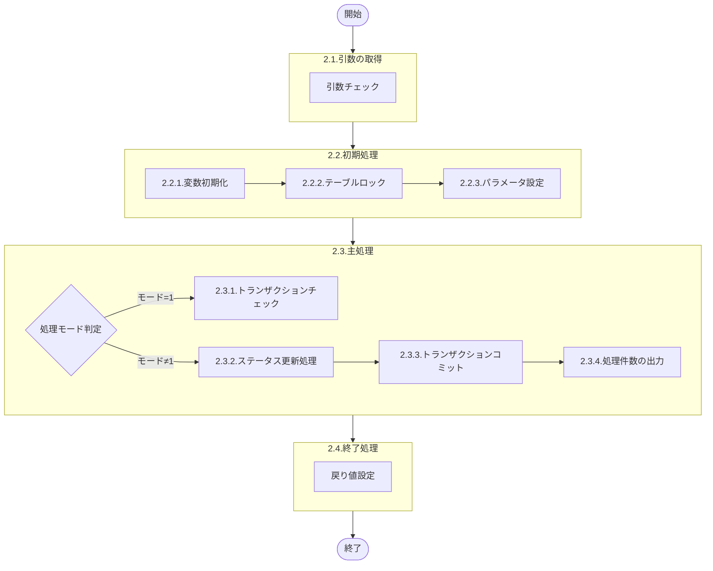

# 0. 表紙

| モジュール名 | プログラムID | プログラム名                                   |
| ------------ | ------------ | ---------------------------------------------- |
| IC           | LDGS0025     | 棚卸トランザクションチェック＆ステータス更新 |

| RFC | Version | 更新日     | 更新者 | 更新内容 | 確認日     | 確認者 | 承認日     | 承認者 |
| --- | :-----: | ---------- | :----: | -------- | ---------- | :----: | ---------- | :----: |
| -   |  1.0.0  | 2025/11/19 |  XXX   | 初版作成 | 2025/XX/XX |  XXX   | 2025/XX/XX |  XXX   |

## 1. 処理概要

### 1.1. 機能概要

棚卸トランザクションプールテーブルに登録されたトランザクションデータをチェックし、該当する棚卸管理マスタまたは臨時棚卸登録マスタのステータスを更新する。

本プログラムは2つの処理モードで実行される：
- **モード1（トランザクションチェック）**：処理対象データの棚卸日と棚卸区分を取得して返却する
- **モード2（ステータス更新）**：棚卸ステータスを取得してマスタを更新し、トランザクションプールの社内処理済サインを更新する

棚卸トランザクション区分に応じて、以下のステータス更新を行う：
- **区分31（通常棚卸開始）/区分1（全区分）**：ステータス"0"→"2"に更新
- **区分4（在庫ログ記入）**：ステータス"2"または"3"→"4"に更新
- **区分39（棚卸終了）**：ステータス"4"以上"9"未満→"9"に更新

区分4（臨時棚卸）の場合は、臨時棚卸登録マスタを対象とする。

### 1.2. 処理概要フロー



### 1.3. プログラム入出力パラメータ

#### 1.3.1. 引数

| No. | パラメータ論理名   | パラメータ物理名 | 属性        | 備考                                           |
| --- | ------------------ | ---------------- | ----------- | ---------------------------------------------- |
| 1   | CSHパス            | ps_csh_path      | VARCHAR(64) | シェルスクリプトパス                           |
| 2   | ファイル名         | ps_fname         | VARCHAR(16) | ログ出力用ファイル名                           |
| 3   | 棚卸トランザクション区分 | ps_st_tp   | VARCHAR(2)  | 31:通常棚卸開始、4:在庫ログ記入、39:棚卸終了、1:全区分 |
| 4   | 処理モード         | ps_job_mode      | VARCHAR(1)  | 1:トランザクションチェック、2:ステータス更新   |

#### 1.3.2. 戻り値

| No. | パラメータ論理名 | パラメータ物理名 | 属性    | 備考                                                                             |
| --- | ---------------- | ---------------- | ------- | -------------------------------------------------------------------------------- |
| 1   | 処理ステータス   | rn_status        | INTEGER | 0:Normal 1:NotDataFound -1:SqlError -2:ProgramError                             |
| 2   | SQLコード        | rs_sql_code      | VARCHAR |                                                                                  |
| 3   | エラーコード     | rs_err_code      | VARCHAR |                                                                                  |
| 4   | エラーメッセージ | rs_err_msg       | VARCHAR |                                                                                  |
| 5   | エラー位置       | rs_err_focus     | VARCHAR |                                                                                  |
| 6   | メッセージ       | rs_msg           | VARCHAR | 処理件数情報                                                                     |
| 7   | 棚卸区分         | rs_st_class      | VARCHAR | トランザクションチェック時に取得した棚卸区分                                     |
| 8   | 棚卸日           | rs_st_date       | VARCHAR | トランザクションチェック時に取得した棚卸日                                       |
| 9   | 更新後ステータス | rs_st_status     | VARCHAR | ステータス更新処理時に更新した棚卸ステータス（2:マスタ生成完了、4:ログ記入完了、9:終了） |

### 1.4. その他制御・要件

| 排他制御 |      |      |
| -------- | ---- | ---- |
| 楽観     | 悲観 | 無し |
| -        | ●    | -    |

| 項目               | 制約・制御・要件など                                                 | 記載内容説明                                                 |
| ------------------ | -------------------------------------------------------------------- | ------------------------------------------------------------ |
| トランザクション制御 | テーブルロック実行後、全ての更新処理完了後にコミット               | 棚卸マスタの整合性を保つため                                 |
| パフォーマンス要件   | 棚卸トランザクションプールのレコード件数に依存                     | 大量のトランザクションが発生する場合は処理時間が長くなる可能性 |

### 1.5. 入出力一覧

| No. | 入出力対象 | 名称                     | 物理名称            | C   | R   | U   | D   | 備考                                         |
| --- | ---------- | ------------------------ | ------------------- | --- | --- | --- | --- | -------------------------------------------- |
| 1   | テーブル   | 棚卸管理マスタ           | ld_mst_st_control   | -   | ○   | ○   | -   | 区分≠4の場合に使用                           |
| 2   | テーブル   | 臨時棚卸登録マスタ       | ld_mst_st_extra     | -   | ○   | ○   | -   | 区分=4の場合に使用                           |
| 3   | テーブル   | 棚卸トランザクションプール | ld_trn_st_tp       | -   | ○   | ○   | -   | 処理対象トランザクションの取得と社内処理済サイン更新 |

## 2. 詳細処理

### 2.1. 引数の取得

入力パラメータの妥当性をチェックする。

変数.引数エラーフラグ = '0'

引数.CSHパス = NULL または スペース の場合  
    変数.エラーコード = 'E.LDG20501'  
    変数.エラーメッセージ = 'CSHパスが未設定です'  
    変数.エラー位置 = 'LDGS0025'  
    変数.引数エラーフラグ = '1'

引数.ファイル名 = NULL または スペース の場合  
    変数.エラーコード = 'E.LDG20502'  
    変数.エラーメッセージ = 'ファイル名が未設定です'  
    変数.エラー位置 = 'LDGS0025'  
    変数.引数エラーフラグ = '1'

引数.棚卸トランザクション区分 = NULL または スペース の場合  
    変数.エラーコード = 'E.LDG20503'  
    変数.エラーメッセージ = '棚卸トランザクション区分が未設定です'  
    変数.エラー位置 = 'LDGS0025'  
    変数.引数エラーフラグ = '1'

引数.処理モード = NULL または スペース の場合  
    変数.エラーコード = 'E.LDG20504'  
    変数.エラーメッセージ = '処理モードが未設定です'  
    変数.エラー位置 = 'LDGS0025'  
    変数.引数エラーフラグ = '1'

変数.引数エラーフラグ = '1' の場合  
    処理を終了（2.4へ）

開始ログを出力する

### 2.2. 初期処理

#### 2.2.1. 変数初期化

利用する変数を初期化する。

| No. | 変数論理名                 | 初期化設定値 |
| :-: | -------------------------- | ------------ |
|  1  | 変数.処理ステータス       | 0            |
|  2  | 変数.SQLコード             | スペース     |
|  3  | 変数.エラーコード         | スペース     |
|  4  | 変数.エラーメッセージ     | スペース     |
|  5  | 変数.エラー位置           | スペース     |
|  6  | 変数.メッセージ           | スペース     |
|  7  | 変数.トランザクションフラグ | '0'        |
|  8  | 変数.棚卸日               | スペース     |
|  9  | 変数.棚卸区分             | スペース     |
| 10  | 変数.棚卸トランザクション区分 | スペース |
| 11  | 変数.登録日時             | NULL         |
| 12  | 変数.システム日時         | CURRENT      |
| 13  | 変数.システム担当者       | 'SYSTEM'     |
| 14  | 変数.棚卸ステータス       | スペース     |
| 15  | 変数.更新後ステータス     | スペース     |
| 16  | 変数.パラメータ1          | スペース     |
| 17  | 変数.パラメータ2          | スペース     |
| 18  | 変数.現在日時文字列       | スペース     |
| 19  | 変数.YYYYMMDD             | スペース     |
| 20  | 変数.検索件数             | 0            |
| 21  | 変数.棚卸管理更新件数     | 0            |
| 22  | 変数.臨時棚卸更新件数     | 0            |
| 23  | 変数.トランザクションプール更新件数 | 0  |

#### 2.2.2. テーブルロック

トランザクションを開始し、テーブルをEXCLUSIVEモードでロックする。

トランザクション開始  
    変数.トランザクションフラグ = '1'

棚卸管理マスタをEXCLUSIVEモードでロック

臨時棚卸登録マスタをEXCLUSIVEモードでロック

棚卸トランザクションプールをEXCLUSIVEモードでロック

#### 2.2.3. パラメータ設定

引数の棚卸トランザクション区分に応じてパラメータを設定する。

引数.棚卸トランザクション区分 ≠ '1' の場合  
    変数.パラメータ1 = 引数.棚卸トランザクション区分  
    変数.パラメータ2 = NULL

引数.棚卸トランザクション区分 = '1' の場合  
    変数.パラメータ1 = '31'  
    変数.パラメータ2 = '41'

変数.現在日時文字列 = 変数.システム日時（YYYY-MM-DD HH:MM:SS形式）

変数.YYYYMMDD = 変数.現在日時文字列の年月日部分（YYYYMMDD形式）

### 2.3. 主処理

#### 2.3.1. トランザクションチェック処理（モード=1）

引数.処理モード = '1' の場合、棚卸トランザクションプールから処理対象データを取得する。

棚卸トランザクションプールに未処理データが存在するかチェック

```sql
SELECT COUNT(*)
  FROM ld_trn_st_tp
 WHERE st_trn IN (変数.パラメータ1, 変数.パラメータ2)
   AND close_sign = '0'
```

データ取得できない場合  
    変数.エラーコード = 'E.LDG20510'  
    変数.エラーメッセージ = '処理対象データが存在しません'  
    変数.処理ステータス = 1  
    処理を終了（2.4へ）

ループ START（処理対象トランザクション毎）

```sql
SELECT DISTINCT st_date
               ,st_class
  INTO 変数.棚卸日
      ,変数.棚卸区分
  FROM ld_trn_st_tp
 WHERE st_trn IN (変数.パラメータ1, 変数.パラメータ2)
   AND close_sign = '0'
 ORDER BY st_date, st_class
```

    変数.検索件数 = 変数.検索件数 + 1

    各データの処理結果を結果セットに追加する：
    | 戻り値論理名     | 設定値           |
    | ---------------- | ---------------- |
    | 処理ステータス   | 0                |
    | SQLコード        | スペース         |
    | エラーコード     | スペース         |
    | エラーメッセージ | スペース         |
    | エラー位置       | スペース         |
    | メッセージ       | スペース         |
    | 棚卸区分         | 変数.棚卸区分    |
    | 棚卸日           | 変数.棚卸日      |
    | 更新後ステータス | スペース         |

ループ END（2.3.1のループ）

#### 2.3.2. ステータス更新処理（モード≠1）

引数.処理モード ≠ '1' の場合、棚卸トランザクションプールから処理対象データを取得してステータスを更新する。

棚卸トランザクションプールに未処理データが存在するかチェック

```sql
SELECT COUNT(*)
  FROM ld_trn_st_tp
 WHERE st_trn IN (変数.パラメータ1, 変数.パラメータ2)
   AND close_sign = '0'
```

データ取得できない場合  
    変数.エラーコード = 'E.LDG20510'  
    変数.エラーメッセージ = '処理対象データが存在しません'  
    変数.処理ステータス = 1  
    処理を終了（2.4へ）

ループ START（処理対象トランザクション毎）

```sql
SELECT st_date
      ,st_class
      ,st_trn
      ,register_datetime
  INTO 変数.棚卸日
      ,変数.棚卸区分
      ,変数.棚卸トランザクション区分
      ,変数.登録日時
  FROM ld_trn_st_tp
 WHERE st_trn IN (変数.パラメータ1, 変数.パラメータ2)
   AND close_sign = '0'
 ORDER BY st_date, st_class, st_trn, register_datetime
```

    変数.検索件数 = 変数.検索件数 + 1

    変数.棚卸区分 ≠ '4' の場合（通常棚卸の場合）  
        2.3.2.1.通常棚卸マスタ更新処理を実行

    変数.棚卸区分 = '4' の場合（臨時棚卸の場合）  
        2.3.2.2.臨時棚卸マスタ更新処理を実行

    変数.更新後ステータス ≠ スペース の場合

```sql
UPDATE ld_trn_st_tp
   SET close_sign = '1'
      ,current_datetime = 変数.システム日時
      ,current_person = 変数.システム担当者
 WHERE st_date = 変数.棚卸日
   AND st_class = 変数.棚卸区分
   AND st_trn = 変数.棚卸トランザクション区分
   AND register_datetime = 変数.登録日時
```

        変数.トランザクションプール更新件数 = 変数.トランザクションプール更新件数 + 1

    各データの処理結果を結果セットに追加する：
    | 戻り値論理名     | 設定値                 |
    | ---------------- | ---------------------- |
    | 処理ステータス   | 0                      |
    | SQLコード        | スペース               |
    | エラーコード     | スペース               |
    | エラーメッセージ | スペース               |
    | エラー位置       | スペース               |
    | メッセージ       | スペース               |
    | 棚卸区分         | 変数.棚卸区分          |
    | 棚卸日           | 変数.棚卸日            |
    | 更新後ステータス | 変数.更新後ステータス  |

ループ END（2.3.2のループ）

##### 2.3.2.1. 通常棚卸マスタ更新処理

棚卸管理マスタから現在のステータスを取得する。

```sql
SELECT st_status
  INTO 変数.棚卸ステータス
  FROM ld_mst_st_control
 WHERE st_date = 変数.棚卸日
```

データ取得できない場合  
    変数.エラーコード = 'TE15'  
    変数.エラーメッセージ = '棚卸ステータスを取得できません'  
    例外を発生

変数.棚卸トランザクション区分 = '31' または 引数.棚卸トランザクション区分 = '1' の場合

    変数.棚卸ステータス = '0' の場合

```sql
UPDATE ld_mst_st_control
   SET st_status = '2'
      ,st_master_gen_dt = 変数.YYYYMMDD
      ,st_slip_create_dt = 変数.YYYYMMDD
      ,st_slip_print_dt = 変数.YYYYMMDD
      ,current_person = 変数.システム担当者
      ,current_datetime = 変数.システム日時
 WHERE st_date = 変数.棚卸日
   AND st_class = 変数.棚卸区分
```

        変数.棚卸管理更新件数 = 変数.棚卸管理更新件数 + 1  
        変数.更新後ステータス = '2'

    変数.棚卸ステータス ≠ '0' の場合  
        変数.エラーコード = 'TE16'  
        変数.エラーメッセージ = '棚卸ステータスが不正です（期待値:0）'  
        例外を発生

変数.棚卸トランザクション区分 = '4' の場合

    変数.棚卸ステータス = '2' または 変数.棚卸ステータス = '3' の場合

```sql
UPDATE ld_mst_st_control
   SET st_status = '4'
      ,st_log_stock_dt = 変数.YYYYMMDD
      ,current_person = 変数.システム担当者
      ,current_datetime = 変数.システム日時
 WHERE st_date = 変数.棚卸日
   AND st_class = 変数.棚卸区分
```

        変数.棚卸管理更新件数 = 変数.棚卸管理更新件数 + 1  
        変数.更新後ステータス = '4'

    変数.棚卸ステータス ≠ '2' かつ 変数.棚卸ステータス ≠ '3' の場合  
        変数.エラーコード = 'TE16'  
        変数.エラーメッセージ = '棚卸ステータスが不正です（期待値:2または3）'  
        例外を発生

変数.棚卸トランザクション区分 = '39' の場合

    変数.棚卸ステータス >= '4' かつ 変数.棚卸ステータス < '9' の場合

```sql
UPDATE ld_mst_st_control
   SET st_status = '9'
      ,st_finish_dt = 変数.YYYYMMDD
      ,current_person = 変数.システム担当者
      ,current_datetime = 変数.システム日時
 WHERE st_date = 変数.棚卸日
   AND st_class = 変数.棚卸区分
```

        変数.棚卸管理更新件数 = 変数.棚卸管理更新件数 + 1  
        変数.更新後ステータス = '9'

    上記以外の場合  
        変数.エラーコード = 'TE16'  
        変数.エラーメッセージ = '棚卸ステータスが不正です（期待値:4以上9未満）'  
        例外を発生

##### 2.3.2.2. 臨時棚卸マスタ更新処理

臨時棚卸登録マスタから現在のステータスを取得し、ステータス毎に更新処理を行う。

```sql
SELECT COUNT(*)
  FROM ld_mst_st_extra
 WHERE st_date = 変数.棚卸日
```

データ取得できない場合  
    変数.エラーコード = 'TE15'  
    変数.エラーメッセージ = '臨時棚卸ステータスを取得できません'  
    例外を発生

ループ START（臨時棚卸ステータス毎）

```sql
SELECT DISTINCT est_status
  INTO 変数.棚卸ステータス
  FROM ld_mst_st_extra
 WHERE st_date = 変数.棚卸日
 ORDER BY est_status
```

    変数.棚卸トランザクション区分 = '41' または 引数.棚卸トランザクション区分 = '1' の場合

        変数.棚卸ステータス = '0' の場合

```sql
UPDATE ld_mst_st_extra
   SET est_status = '2'
      ,est_sel_dt = 変数.YYYYMMDD
      ,est_slip_dt = 変数.YYYYMMDD
      ,current_person = 変数.システム担当者
      ,current_datetime = 変数.システム日時
 WHERE st_date = 変数.棚卸日
   AND est_status = '0'
```

            変数.臨時棚卸更新件数 = 変数.臨時棚卸更新件数 + 1  
            変数.更新後ステータス = '2'

        変数.棚卸ステータス ≠ '0' の場合  
            警告ログを出力（エラーにはしない）

    変数.棚卸トランザクション区分 = '4' の場合

        変数.棚卸ステータス = '2' または 変数.棚卸ステータス = '3' の場合

```sql
UPDATE ld_mst_st_extra
   SET est_status = '4'
      ,est_log_dt = 変数.YYYYMMDD
      ,current_person = 変数.システム担当者
      ,current_datetime = 変数.システム日時
 WHERE st_date = 変数.棚卸日
   AND est_status IN ('2', '3')
```

            変数.臨時棚卸更新件数 = 変数.臨時棚卸更新件数 + 1  
            変数.更新後ステータス = '4'

        変数.棚卸ステータス ≠ '2' かつ 変数.棚卸ステータス ≠ '3' の場合  
            警告ログを出力（エラーにはしない）

ループ END（2.3.2.2のループ）

#### 2.3.3. トランザクションコミット

変数.トランザクションフラグ = '1' の場合  
    トランザクションをコミットする

#### 2.3.4. 処理件数の出力

データの処理件数をメッセージに編集する。

ld_trn_st_tpテーブルから検索したレコード件数を設定：  
    変数.メッセージ = '<ld_trn_st_tp> SEL:' || 変数.検索件数

ld_mst_st_controlテーブルの更新件数を追加：  
    変数.メッセージ = 変数.メッセージ || ',<ld_mst_st_control> UPD:' || 変数.棚卸管理更新件数

ld_mst_st_extraテーブルの更新件数を追加：  
    変数.メッセージ = 変数.メッセージ || ',<ld_mst_st_extra> UPD:' || 変数.臨時棚卸更新件数

ld_trn_st_tpテーブルの更新件数を追加：  
    変数.メッセージ = 変数.メッセージ || ',<ld_trn_st_tp> UPD:' || 変数.トランザクションプール更新件数

処理件数ログを出力する

終了ログを出力する

### 2.4. 終了処理

#### 2.4.1. トランザクションコミット

変数.トランザクションフラグ = '1' の場合  
    トランザクションをコミットする

終了ログを出力する

#### 2.4.2. 戻り値設定

##### 2.4.2.1. トランザクションチェック時の戻り値（モード=1）

各データ毎に結果セットに追加した戻り値：

| 戻り値論理名     | 設定値           |
| ---------------- | ---------------- |
| 処理ステータス   | 0                |
| SQLコード        | スペース         |
| エラーコード     | スペース         |
| エラーメッセージ | スペース         |
| エラー位置       | スペース         |
| メッセージ       | スペース         |
| 棚卸区分         | 変数.棚卸区分    |
| 棚卸日           | 変数.棚卸日      |
| 更新後ステータス | スペース         |

##### 2.4.2.2. ステータス更新時の戻り値（モード≠1）

各データ毎に結果セットに追加した戻り値：

| 戻り値論理名     | 設定値                 |
| ---------------- | ---------------------- |
| 処理ステータス   | 0                      |
| SQLコード        | スペース               |
| エラーコード     | スペース               |
| エラーメッセージ | スペース               |
| エラー位置       | スペース               |
| メッセージ       | スペース               |
| 棚卸区分         | 変数.棚卸区分          |
| 棚卸日           | 変数.棚卸日            |
| 更新後ステータス | 変数.更新後ステータス  |

##### 2.4.2.3. 処理完了時の最終戻り値

全データ処理完了後の最終戻り値：

| 戻り値論理名     | 設定値           |
| ---------------- | ---------------- |
| 処理ステータス   | 0                |
| SQLコード        | スペース         |
| エラーコード     | スペース         |
| エラーメッセージ | スペース         |
| エラー位置       | スペース         |
| メッセージ       | 変数.メッセージ  |
| 棚卸区分         | スペース         |
| 棚卸日           | スペース         |
| 更新後ステータス | スペース         |

## 3. 補足説明

### 3.1. 戻り値について

**ステータスについて**

- 0 : Normal（正常終了）
- 1 : Not Data Found（データなし）
- -1 : Sql Error（SQLエラー）
- -2 : Program Error（プログラムエラー）

### 3.2. エラー発生時の対応について

#### 3.2.1. 業務例外処理

引数チェック等でプログラムエラーが発生した場合：

| 戻り値           | 設定値                 |
| ---------------- | ---------------------- |
| 処理ステータス   | -2                     |
| SQLコード        | スペース               |
| エラーコード     | 変数.エラーコード      |
| エラーメッセージ | 変数.エラーメッセージ  |
| エラー位置       | 'LDGS0025'             |
| メッセージ       | スペース               |
| 棚卸区分         | スペース               |
| 棚卸日           | スペース               |
| 更新後ステータス | スペース               |

⚠️ **注意**：エラー位置の'LDGS0025'部分は、当該プログラムの実際のプログラムIDです。

#### 3.2.2. その他例外処理

データベースアクセス時にSQLエラーが発生した場合：

| 戻り値           | 設定値     |
| ---------------- | ---------- |
| 処理ステータス   | -1         |
| SQLコード        | SQLSTATE   |
| エラーコード     | スペース   |
| エラーメッセージ | SQLERRM    |
| エラー位置       | 'LDGS0025' |
| メッセージ       | スペース   |
| 棚卸区分         | スペース   |
| 棚卸日           | スペース   |
| 更新後ステータス | スペース   |

⚠️ **注意**：エラー位置の'LDGS0025'部分は、当該プログラムの実際のプログラムIDです。
