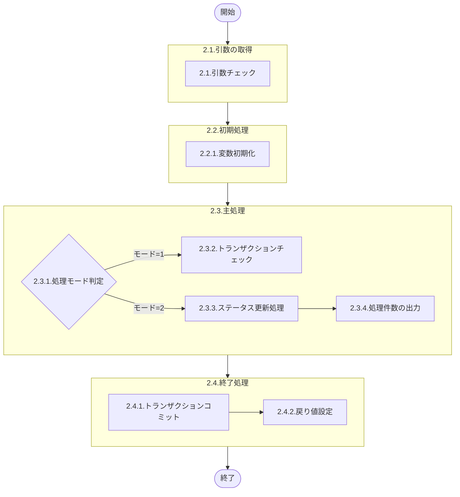

# LDGS0025 詳細設計書

## 0. 表紙

| モジュール名 | プログラムID | プログラム名                                     |
| ------------ | ------------ | ------------------------------------------------ |
| IC           | LDGS0025     | 棚卸トランザクションチェック＆ステータス更新     |

| RFC | Version | 更新日     | 更新者 | 更新内容 | 確認日     | 確認者 | 承認日     | 承認者 |
| --- | :-----: | ---------- | :----: | -------- | ---------- | :----: | ---------- | :----: |
| -   |  1.0.0  | 2025/11/20 |  AI生成  | 初版作成 | 2025/11/20 |  -  | 2025/11/20 |  -  |

---

## 1. 処理概要

### 1.1. 機能概要

棚卸トランザクションプールから処理対象データを取得し、処理モードに応じて以下の処理を実行する：

- **モード1（トランザクションチェック）**：処理対象の棚卸日と棚卸区分の一覧を返却する
- **モード2（ステータス更新）**：棚卸管理マスタまたは臨時棚卸登録マスタのステータスを更新し、トランザクションプールのクローズサインを更新する

### 1.2. 処理概要フロー



### 1.3. プログラム入出力パラメータ

#### 1.3.1. 引数

| No. | パラメータ論理名       | パラメータ物理名 | 属性        | 備考                                     |
| --- | ---------------------- | ---------------- | ----------- | ---------------------------------------- |
| 1   | シェルパス             | ps_csh_path      | VARCHAR(64) | LD0CLZ01.cshのパス                       |
| 2   | ファイル名             | ps_fname         | VARCHAR(16) | ログ出力用ファイル名                     |
| 3   | 棚卸トランザクション   | ps_st_tp         | VARCHAR(2)  | 31:月次, 41:臨時, 4:理論在庫, 39:完了    |
| 4   | 処理モード             | ps_job_mode      | VARCHAR(1)  | 1:トランザクションチェック, 2:更新処理   |

#### 1.3.2. 戻り値

| No. | パラメータ論理名 | パラメータ物理名 | 属性    | 備考                                               |
| --- | ---------------- | ---------------- | ------- | -------------------------------------------------- |
| 1   | 処理ステータス   | rn_status        | INTEGER | 0:Normal, 1:NotDataFound, -1:SqlError, -2:ProgramError |
| 2   | SQLコード        | rs_sql_code      | VARCHAR | SQLエラー時のSQLSTATE                              |
| 3   | エラーコード     | rs_err_code      | VARCHAR | 業務エラーコード（TE01/TE15/TE16）                |
| 4   | エラーメッセージ | rs_err_msg       | VARCHAR | エラー内容                                         |
| 5   | エラー位置       | rs_err_focus     | VARCHAR | エラー発生位置（LDGS0025）                         |
| 6   | メッセージ       | rs_msg           | VARCHAR | 処理件数情報                                       |
| 7   | 棚卸区分         | rs_st_class      | VARCHAR | 1:月次, 4:臨時                                     |
| 8   | 棚卸日           | rs_st_date       | VARCHAR | YYYYMMDD形式                                       |
| 9   | 更新後ステータス | rs_st_status     | VARCHAR | 更新後の棚卸ステータス                             |

### 1.4. その他制御・要件

- トランザクション制御：BEGIN WORK～COMMIT WORK
- テーブルロック：EXCLUSIVE MODE（ld_mst_st_control, ld_mst_st_extra, ld_trn_st_tp）
- 分離レベル：COMMITTED READ
- ロックモード：WAIT 60秒

### 1.5. 入出力一覧

| No. | 入出力対象 | 名称                       | 物理名称            | C | R | U | D | 備考               |
| --- | ---------- | -------------------------- | ------------------- | - | - | - | - | ------------------ |
| 1   | テーブル   | 棚卸管理マスタ             | ld_mst_st_control   | - | ○ | ○ | - | ステータス更新     |
| 2   | テーブル   | 臨時棚卸登録マスタ         | ld_mst_st_extra     | - | ○ | ○ | - | ステータス更新     |
| 3   | テーブル   | 棚卸トランザクションプール | ld_trn_st_tp        | - | ○ | ○ | - | クローズサイン更新 |

---

## 2. 詳細処理

### 2.1. 引数の取得

入力パラメータの妥当性をチェックする。

引数.シェルパス = NULL または スペース の場合
    変数.エラーコード = 'TE01'
    変数.エラーメッセージ = 'a_csh_path is null or a_csh_path = '' '''
    処理を終了（2.4へ）

引数.ファイル名 = NULL または スペース の場合
    変数.エラーコード = 'TE01'
    変数.エラーメッセージ = 'a_fname is null or a_fname = '' '''
    処理を終了（2.4へ）

引数.棚卸トランザクション = NULL または スペース の場合
    変数.エラーコード = 'TE01'
    変数.エラーメッセージ = 'a_st_tp is null or a_st_tp = '' '''
    処理を終了（2.4へ）

引数.処理モード = NULL または スペース の場合
    変数.エラーコード = 'TE01'
    変数.エラーメッセージ = 'a_job_mode is null or a_job_mode = '' '''
    処理を終了（2.4へ）

### 2.2. 初期処理

#### 2.2.1. 変数初期化

利用する変数を初期化する。

| No. | 変数論理名                   | 初期化設定値 |
| :-: | ---------------------------- | ------------ |
|  1  | 変数.処理ステータス          | 0            |
|  2  | 変数.SQLコード               | 0            |
|  3  | 変数.ISAMコード              | 0            |
|  4  | 変数.エラーコード            | スペース     |
|  5  | 変数.エラーメッセージ        | スペース     |
|  6  | 変数.エラー位置              | スペース     |
|  7  | 変数.メッセージ              | スペース     |
|  8  | 変数.トランザクションフラグ  | '0'          |
|  9  | 変数.棚卸日                  | スペース     |
| 10  | 変数.棚卸区分                | スペース     |
| 11  | 変数.棚卸トランザクション    | スペース     |
| 12  | 変数.登録日時                | CURRENT      |
| 13  | 変数.システム日時            | CURRENT      |
| 14  | 変数.システム担当者          | 'SYSTEM'     |
| 15  | 変数.棚卸ステータス          | スペース     |
| 16  | 変数.更新後ステータス        | スペース     |
| 17  | 変数.変数1                   | スペース     |
| 18  | 変数.変数2                   | スペース     |
| 19  | 変数.YYYYMMDD                | スペース     |
| 20  | 変数.検索件数                | 0            |
| 21  | 変数.棚卸管理更新件数        | 0            |
| 22  | 変数.臨時棚卸更新件数        | 0            |
| 23  | 変数.トランザクション更新件数 | 0            |

### 2.3. 主処理

#### 2.3.1. 初期処理

棚卸トランザクションの値により、検索条件用変数を設定する。

引数.棚卸トランザクション ≠ ' 1' の場合
    変数.変数1 = 引数.棚卸トランザクション
    変数.変数2 = NULL

引数.棚卸トランザクション = ' 1' の場合
    変数.変数1 = '31'
    変数.変数2 = '41'

変数.YYYYMMDD = 変数.システム日時の年月日部分（YYYYMMDD形式）

テーブルロックを取得する：
- ld_mst_st_control
- ld_mst_st_extra
- ld_trn_st_tp

#### 2.3.2. 処理モード判定

変数.処理モード により処理を分岐する。

変数.処理モード = '1' の場合
    トランザクションチェック処理を実行（2.3.3参照）

変数.処理モード = '2' の場合
    ステータス更新処理を実行（2.3.4参照）

#### 2.3.3. トランザクションチェック処理（モード1）

棚卸トランザクションプールから処理対象データを取得し、棚卸日と棚卸区分の一覧を返却する。

```sql
SELECT DISTINCT st_ymd                         -- 棚卸日
              , st_class                       -- 棚卸区分
  FROM ld_trn_st_tp                            -- 棚卸トランザクションプール
 WHERE st_trn IN (変数.変数1, 変数.変数2)
   AND close_sign = '0'                        -- クローズサイン
 ORDER BY st_ymd, st_class
```

データ取得できない場合
    変数.処理ステータス = 1
    変数.エラーメッセージ = 'Target Data Nothing.'
    処理を終了（2.4へ）

ループ START（処理対象データ毎）

    変数.検索件数 = 変数.検索件数 + 1
    
    各データの処理結果を結果セットに追加する：
    | 戻り値論理名     | 設定値         |
    | ---------------- | -------------- |
    | 処理ステータス   | 0              |
    | SQLコード        | スペース       |
    | エラーコード     | スペース       |
    | エラーメッセージ | スペース       |
    | エラー位置       | スペース       |
    | メッセージ       | スペース       |
    | 棚卸区分         | 変数.棚卸区分  |
    | 棚卸日           | 変数.棚卸日    |
    | 更新後ステータス | スペース       |

ループ END（2.3.3のループ）

#### 2.3.4. ステータス更新処理（モード2）

棚卸トランザクションプールから処理対象データを取得し、ステータス更新処理を実行する。

```sql
SELECT st_ymd                                  -- 棚卸日
     , st_class                                -- 棚卸区分
     , st_trn                                  -- 棚卸トランザクション
     , tp_register_datetime                    -- トランザクション登録日時
  FROM ld_trn_st_tp                            -- 棚卸トランザクションプール
 WHERE st_trn IN (変数.変数1, 変数.変数2)
   AND close_sign = '0'                        -- クローズサイン
 ORDER BY st_ymd, st_class, st_trn, tp_register_datetime
```

データ取得できない場合
    変数.処理ステータス = 1
    変数.エラーメッセージ = 'Target Data Nothing.'
    処理を終了（2.4へ）

ループ START（処理対象トランザクション毎）

    変数.検索件数 = 変数.検索件数 + 1
    
    変数.棚卸区分 ≠ '4' の場合（月次棚卸）
        月次棚卸ステータス更新処理を実行（2.3.4.1参照）
    
    変数.棚卸区分 = '4' の場合（臨時棚卸）
        臨時棚卸ステータス更新処理を実行（2.3.4.2参照）
    
    変数.更新後ステータス ≠ スペース の場合
        トランザクションプールのクローズサイン更新（2.3.4.3参照）
        
        各データの処理結果を結果セットに追加する：
        | 戻り値論理名     | 設定値                |
        | ---------------- | --------------------- |
        | 処理ステータス   | 0                     |
        | SQLコード        | スペース              |
        | エラーコード     | スペース              |
        | エラーメッセージ | スペース              |
        | エラー位置       | スペース              |
        | メッセージ       | スペース              |
        | 棚卸区分         | 変数.棚卸区分         |
        | 棚卸日           | 変数.棚卸日           |
        | 更新後ステータス | 変数.更新後ステータス |

ループ END（2.3.4のループ）

##### 2.3.4.1. 月次棚卸ステータス更新処理

棚卸管理マスタから現在のステータスを取得する。

```sql
SELECT st_status                               -- 棚卸ステータス
  INTO 変数.棚卸ステータス
  FROM ld_mst_st_control                       -- 棚卸管理マスタ
 WHERE st_ymd = 変数.棚卸日                    -- 棚卸日
```

データ取得できない場合
    変数.エラーコード = 'TE15'
    変数.エラーメッセージ = 'st_status not found'
    例外を発生

**棚卸トランザクション = '31' または ' 1' の場合（マスタ生成）**

変数.棚卸ステータス = '0' の場合

```sql
UPDATE ld_mst_st_control                       -- 棚卸管理マスタ
   SET st_status = '2'                         -- 棚卸ステータス
     , st_master_gen_ymd = 変数.YYYYMMDD       -- マスタ生成日
     , st_slip_create_ymd = 変数.YYYYMMDD      -- 伝票作成日
     , st_slip_print_ymd = 変数.YYYYMMDD       -- 伝票印刷日
     , update_datetime = 変数.システム日時     -- 更新日時
     , update_author = 変数.システム担当者     -- 更新者
 WHERE st_ymd = 変数.棚卸日                    -- 棚卸日
   AND st_class = 変数.棚卸区分                -- 棚卸区分
```

    変数.棚卸管理更新件数 = 変数.棚卸管理更新件数 + 1
    変数.更新後ステータス = '2'

変数.棚卸ステータス ≠ '0' の場合
    変数.エラーコード = 'TE16'
    変数.エラーメッセージ = 'st_status error (expected: 0)'
    例外を発生

**棚卸トランザクション = ' 4' の場合（理論在庫作成）**

変数.棚卸ステータス = '2' または '3' の場合

```sql
UPDATE ld_mst_st_control                       -- 棚卸管理マスタ
   SET st_status = '4'                         -- 棚卸ステータス
     , st_log_stock_ymd = 変数.YYYYMMDD        -- 理論在庫日
     , update_datetime = 変数.システム日時     -- 更新日時
     , update_author = 変数.システム担当者     -- 更新者
 WHERE st_ymd = 変数.棚卸日                    -- 棚卸日
   AND st_class = 変数.棚卸区分                -- 棚卸区分
```

    変数.棚卸管理更新件数 = 変数.棚卸管理更新件数 + 1
    変数.更新後ステータス = '4'

変数.棚卸ステータス ≠ '2' かつ ≠ '3' の場合
    変数.エラーコード = 'TE16'
    変数.エラーメッセージ = 'st_status error (expected: 2 or 3)'
    例外を発生

**棚卸トランザクション = '39' の場合（棚卸完了）**

変数.棚卸ステータス ≧ '4' かつ < '9' の場合

```sql
UPDATE ld_mst_st_control                       -- 棚卸管理マスタ
   SET st_status = '9'                         -- 棚卸ステータス
     , st_finish_ymd = 変数.YYYYMMDD           -- 完了日
     , update_datetime = 変数.システム日時     -- 更新日時
     , update_author = 変数.システム担当者     -- 更新者
 WHERE st_ymd = 変数.棚卸日                    -- 棚卸日
   AND st_class = 変数.棚卸区分                -- 棚卸区分
```

    変数.棚卸管理更新件数 = 変数.棚卸管理更新件数 + 1
    変数.更新後ステータス = '9'

変数.棚卸ステータス < '4' または ≧ '9' の場合
    変数.エラーコード = 'TE16'
    変数.エラーメッセージ = 'st_status error (expected: 4-8)'
    例外を発生

##### 2.3.4.2. 臨時棚卸ステータス更新処理

臨時棚卸登録マスタから現在のステータスを取得する。

```sql
SELECT DISTINCT est_status                     -- 臨時棚卸ステータス
  INTO 変数.棚卸ステータス
  FROM ld_mst_st_extra                         -- 臨時棚卸登録マスタ
 WHERE st_ymd = 変数.棚卸日                    -- 棚卸日
 ORDER BY est_status
```

データ取得できない場合
    変数.エラーコード = 'TE15'
    変数.エラーメッセージ = 'est_status not found'
    例外を発生

ループ START（ステータス毎）

**棚卸トランザクション = '41' または ' 1' の場合（伝票発行）**

変数.棚卸ステータス = '0' の場合

```sql
UPDATE ld_mst_st_extra                         -- 臨時棚卸登録マスタ
   SET est_status = '2'                        -- 臨時棚卸ステータス
     , est_select_ymd = 変数.YYYYMMDD          -- 抽出日
     , est_slip_ymd = 変数.YYYYMMDD            -- 伝票日
     , update_datetime = 変数.システム日時     -- 更新日時
     , update_author = 変数.システム担当者     -- 更新者
 WHERE st_ymd = 変数.棚卸日                    -- 棚卸日
   AND est_status = '0'                        -- 臨時棚卸ステータス
```

    変数.臨時棚卸更新件数 = 変数.臨時棚卸更新件数 + 1
    変数.更新後ステータス = '2'

変数.棚卸ステータス ≠ '0' の場合
    ログ出力のみ実施（エラーとしない）

**棚卸トランザクション = ' 4' の場合（理論在庫作成）**

変数.棚卸ステータス = '2' または '3' の場合

```sql
UPDATE ld_mst_st_extra                         -- 臨時棚卸登録マスタ
   SET est_status = '4'                        -- 臨時棚卸ステータス
     , st_log_stock_ymd = 変数.YYYYMMDD        -- 理論在庫日
     , update_datetime = 変数.システム日時     -- 更新日時
     , update_author = 変数.システム担当者     -- 更新者
 WHERE st_ymd = 変数.棚卸日                    -- 棚卸日
   AND est_status IN ('2', '3')                -- 臨時棚卸ステータス
```

    変数.臨時棚卸更新件数 = 変数.臨時棚卸更新件数 + 1
    変数.更新後ステータス = '4'

変数.棚卸ステータス ≠ '2' かつ ≠ '3' の場合
    ログ出力のみ実施（エラーとしない）

ループ END（2.3.4.2のループ）

##### 2.3.4.3. トランザクションプール更新処理

```sql
UPDATE ld_trn_st_tp                            -- 棚卸トランザクションプール
   SET close_sign = '1'                        -- クローズサイン
     , update_datetime = 変数.システム日時     -- 更新日時
     , update_author = 変数.システム担当者     -- 更新者
 WHERE st_ymd = 変数.棚卸日                    -- 棚卸日
   AND st_class = 変数.棚卸区分                -- 棚卸区分
   AND st_trn = 変数.棚卸トランザクション      -- 棚卸トランザクション
   AND tp_register_datetime = 変数.登録日時    -- トランザクション登録日時
```

変数.トランザクション更新件数 = 変数.トランザクション更新件数 + 1

#### 2.3.5. 処理件数の出力

データの処理件数をメッセージに編集する。

ld_trn_st_tpテーブルから検索したレコード件数を設定：
    変数.メッセージ = '<ld_trn_st_tp> SEL:' || 変数.検索件数

ld_mst_st_controlテーブルの更新件数を追加：
    変数.メッセージ = 変数.メッセージ || ',<ld_mst_st_control> UPD:' || 変数.棚卸管理更新件数

ld_mst_st_extraテーブルの更新件数を追加：
    変数.メッセージ = 変数.メッセージ || ',<ld_mst_st_extra> UPD:' || 変数.臨時棚卸更新件数

ld_trn_st_tpテーブルの更新件数を追加：
    変数.メッセージ = 変数.メッセージ || ',<ld_trn_st_tp> UPD:' || 変数.トランザクション更新件数

### 2.4. 終了処理

#### 2.4.1. トランザクションコミット

変数.トランザクションフラグ = '1' の場合
    トランザクションをコミットする

終了ログを出力する

#### 2.4.2. 戻り値設定

正常終了時の戻り値を設定する。

| 戻り値論理名     | 設定値                |
| ---------------- | --------------------- |
| 処理ステータス   | 0                     |
| SQLコード        | スペース              |
| エラーコード     | スペース              |
| エラーメッセージ | スペース              |
| エラー位置       | スペース              |
| メッセージ       | 変数.メッセージ       |
| 棚卸区分         | 変数.棚卸区分         |
| 棚卸日           | 変数.棚卸日           |
| 更新後ステータス | 変数.更新後ステータス |

---

## 3. 補足説明

### 3.1. 戻り値について

**ステータスについて**

- 0 : Normal（正常終了）
- 1 : Not Data Found（データなし - 正常終了）
- -1 : Sql Error（SQLエラー）
- -2 : Program Error（プログラムエラー）

**エラーコードについて**

- TE01：引数エラー
- TE15：棚卸ステータス取得エラー
- TE16：棚卸ステータス不正エラー

### 3.2. エラー発生時の対応について

#### 3.2.1. 業務例外処理

引数チェック等でプログラムエラーが発生した場合：

| 戻り値           | 設定値                 |
| ---------------- | ---------------------- |
| 処理ステータス   | -2                     |
| SQLコード        | 0                      |
| エラーコード     | 変数.エラーコード      |
| エラーメッセージ | 変数.エラーメッセージ  |
| エラー位置       | 'LDGS0025'             |
| メッセージ       | スペース               |
| 棚卸区分         | 変数.棚卸区分          |
| 棚卸日           | 変数.棚卸日            |
| 更新後ステータス | 変数.更新後ステータス  |

⚠️ **注意**：エラー位置は'LDGS0025'に固定。

#### 3.2.2. その他例外処理

データベースアクセス時にSQLエラーが発生した場合：

| 戻り値           | 設定値        |
| ---------------- | ------------- |
| 処理ステータス   | -1            |
| SQLコード        | SQLSTATE      |
| エラーコード     | スペース      |
| エラーメッセージ | SQLERRM       |
| エラー位置       | 'LDGS0025'    |
| メッセージ       | スペース      |
| 棚卸区分         | スペース      |
| 棚卸日           | スペース      |
| 更新後ステータス | スペース      |

⚠️ **注意**：エラー位置は'LDGS0025'に固定。
