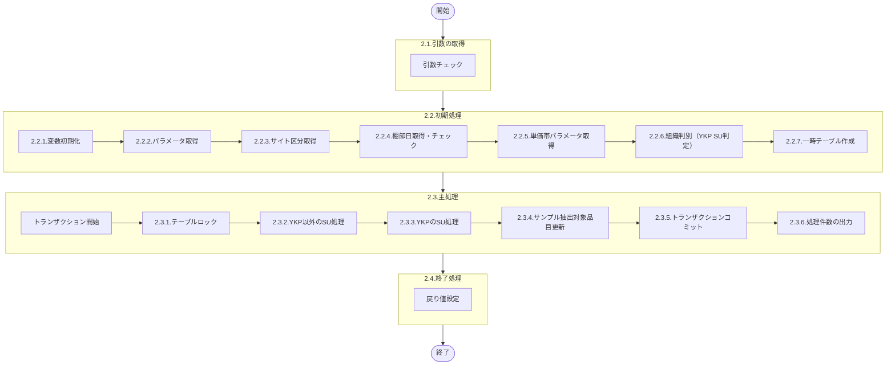

# 0. 表紙

| モジュール名 | プログラムID | プログラム名                         |
| ------------ | ------------ | ------------------------------------ |
| IC           | LDGS0026     | サンプル抽出対象品目単価帯付与       |

| RFC | Version | 更新日     | 更新者 | 更新内容 | 確認日     | 確認者 | 承認日     | 承認者 |
| --- | :-----: | ---------- | :----: | -------- | ---------- | :----: | ---------- | :----: |
| -   |  1.0.0  | 2025/11/20 |  XXX   | 初版作成 | 2025/XX/XX |  XXX   | 2025/XX/XX |  XXX   |

## 1. 処理概要

### 1.1. 機能概要

サンプル抽出対象品目テーブルに登録された品目に対して、単価帯区分を付与する処理を行う。

本プログラムは以下の処理を実行する：
- ICシステムパラメータからサイト区分を取得
- 共通関数を呼び出し、棚卸日の妥当性チェックと取得
- ICパラメータテーブルから単価帯1～3の上限・下限値を取得
- 組織判別処理により、YKP（ヤマハ発動機パーツ）のSUとそれ以外のSUを区別
- 各品目に対して、原価マスタまたは積上売値マスタから単価情報を取得
- 取得した単価を基に単価帯区分（1～3）を判定し、サンプル抽出対象品目テーブルを更新

YKP以外のSUの場合は積上売値マスタを参照し、YKPのSUの場合はYKP基準積上原価マスタを参照する。

### 1.2. 処理概要フロー



### 1.3. プログラム入出力パラメータ

#### 1.3.1. 引数

| No. | パラメータ論理名 | パラメータ物理名 | 属性        | 備考                       |
| --- | ---------------- | ---------------- | ----------- | -------------------------- |
| 1   | CSHパス          | ps_csh_path      | VARCHAR(64) | シェルスクリプトパス       |
| 2   | ファイル名       | ps_fname         | VARCHAR(16) | ログ出力用ファイル名       |
| 3   | 棚卸日           | ps_st_date       | VARCHAR(8)  | 処理対象の棚卸日（YYYYMMDD） |

#### 1.3.2. 戻り値

| No. | パラメータ論理名 | パラメータ物理名 | 属性    | 備考                                                                 |
| --- | ---------------- | ---------------- | ------- | -------------------------------------------------------------------- |
| 1   | 処理ステータス   | rn_status        | INTEGER | 0:Normal -1:SqlError -2:ProgramError                                 |
| 2   | SQLコード        | rs_sql_code      | VARCHAR |                                                                      |
| 3   | エラーコード     | rs_err_code      | VARCHAR |                                                                      |
| 4   | エラーメッセージ | rs_err_msg       | VARCHAR |                                                                      |
| 5   | エラー位置       | rs_err_focus     | VARCHAR |                                                                      |
| 6   | メッセージ       | rs_msg           | VARCHAR | 処理件数情報                                                         |

### 1.4. その他制御・要件

| 排他制御 |      |      |
| -------- | ---- | ---- |
| 楽観     | 悲観 | 無し |
| -        | ●    | -    |

| 項目                   | 制約・制御・要件など                                           | 記載内容説明                                 |
| ---------------------- | -------------------------------------------------------------- | -------------------------------------------- |
| トランザクション制御   | テーブルロック実行後、全ての更新処理完了後にコミット           | データ整合性を保つため                       |
| パフォーマンス要件     | 一時テーブルを使用して大量データを効率的に処理                 | 統計情報を更新することでパフォーマンスを向上 |

### 1.5. 入出力一覧

| No. | 入出力対象 | 名称                                 | 物理名称                  | C   | R   | U   | D   | 備考                     |
| --- | ---------- | ------------------------------------ | ------------------------- | --- | --- | --- | --- | ------------------------ |
| 1   | テーブル   | サンプル抽出対象品目                 | ld_trn_st_sample_target_item | -   | ○   | ○   | -   |                          |
| 2   | テーブル   | ICシステムパラメータ                 | ld_mst_system_parameter   | -   | ○   | -   | -   |                          |
| 3   | テーブル   | ICパラメータテーブル                 | ld_trn_st_parm_table      | -   | ○   | -   | -   |                          |
| 4   | テーブル   | (CC)積上売値マスタ                   | cc_acumlt_selling         | -   | ○   | -   | -   | 過渡期用（旧テーブル）   |
| 5   | テーブル   | (CC)YKP基準積上原価マスタ            | cc_acu_c_bse_ykp          | -   | ○   | -   | -   | 過渡期用（旧テーブル）   |
| 6   | テーブル   | (BOM)組織マスター                    | com_orgmast               | -   | ○   | -   | -   | 過渡期用（旧テーブル）   |
| 7   | 一時テーブル | YKP SU判定結果                     | ic_slg830_c1_t            | ○   | ○   | -   | -   | プログラム内で作成       |
| 8   | 一時テーブル | 積上売値一時テーブル                | tmp_acumlt_selling        | ○   | ○   | -   | -   | プログラム内で作成       |
| 9   | 一時テーブル | YKP基準積上原価一時テーブル         | tmp_acu_c_bse_ykp         | ○   | ○   | -   | -   | プログラム内で作成       |
| 10  | 一時テーブル | サンプル抽出作業用                  | tmp_slg830_samp1          | ○   | ○   | -   | -   | プログラム内で作成       |
| 11  | 共通関数   | 棚卸日取得・チェック                 | ld0slg800                 |     |     |     |     |                          |
| 12  | 共通関数   | 組織判別処理                         | lz0sl0002                 |     |     |     |     |                          |

## 2. 詳細処理

### 2.1. 引数の取得

入力パラメータの妥当性をチェックする。

引数.CSHパス = NULL または スペース の場合  
    変数.エラーコード = 'TE01'  
    変数.エラーメッセージ = 'CSHパスが未設定です（ps_csh_path is null or space）'  
    処理を終了（2.4へ）

引数.ファイル名 = NULL または スペース の場合  
    変数.エラーコード = 'TE01'  
    変数.エラーメッセージ = 'ファイル名が未設定です（ps_fname is null or space）'  
    処理を終了（2.4へ）

引数.棚卸日 = NULL または スペース の場合  
    変数.エラーコード = 'TE01'  
    変数.エラーメッセージ = '棚卸日が未設定です（ps_st_date is null or space）'  
    処理を終了（2.4へ）

開始ログを出力する

### 2.2. 初期処理

#### 2.2.1. 変数初期化

利用する変数を初期化する。

| No. | 変数論理名                           | 初期化設定値 |
| :-: | ------------------------------------ | ------------ |
|  1  | 変数.処理ステータス                 | 0            |
|  2  | 変数.SQLコード                       | スペース     |
|  3  | 変数.エラーコード                   | スペース     |
|  4  | 変数.エラーメッセージ               | スペース     |
|  5  | 変数.エラー位置                     | スペース     |
|  6  | 変数.メッセージ                     | スペース     |
|  7  | 変数.トランザクションフラグ         | '0'          |
|  8  | 変数.サイト区分                     | スペース     |
|  9  | 変数.単価帯1_下限値                 | 0            |
| 10  | 変数.単価帯1_上限値                 | 0            |
| 11  | 変数.単価帯2_下限値                 | 0            |
| 12  | 変数.単価帯2_上限値                 | 0            |
| 13  | 変数.単価帯3_下限値                 | 0            |
| 14  | 変数.単価帯3_上限値                 | 0            |
| 15  | 変数.組織タイプ                     | スペース     |
| 16  | 変数.組織コード                     | スペース     |
| 17  | 変数.組織カテゴリ                   | スペース     |
| 18  | 変数.SP処理ステータス               | 0            |
| 19  | 変数.SP_SQLエラー                   | 0            |
| 20  | 変数.SP_ISAMエラー                  | 0            |
| 21  | 変数.SP_PGステータス                | スペース     |
| 22  | 変数.SP_棚卸日                      | スペース     |
| 23  | 変数.サブSP処理ステータス           | 0            |
| 24  | 変数.サブSP_SQLエラー               | 0            |
| 25  | 変数.サブSP_ISAMエラー              | 0            |
| 26  | 変数.サブSP_PGステータス            | スペース     |
| 27  | 変数.判定結果                       | スペース     |
| 28  | 変数.YKP組織挿入件数                | 0            |
| 29  | 変数.更新件数                       | 0            |
| 30  | 変数.システム日時                   | CURRENT      |
| 31  | 変数.システム担当者                 | 'SYSTEM'     |

#### 2.2.2. パラメータ取得

処理開始ログを出力する。

ログ出力：「Start===================＞」

引数ログを出力する。

ログ出力：「<<Arguments>>  ps_csh_path = 」 || 引数.CSHパス || 「, ps_fname = 」 || 引数.ファイル名 || 「, ps_st_date = 」 || 引数.棚卸日

#### 2.2.3. サイト区分取得

ICシステムパラメータテーブルからサイト区分を取得する。

データが存在しない場合、エラーとして処理を終了する。

```sql
SELECT site_class                        -- サイト区分
  INTO 変数.サイト区分
  FROM ld_mst_system_parameter            -- ICシステムパラメータ
 WHERE keyfield = 'ICCTRL'
```

データ取得できない場合  
    変数.エラーコード = 'TE09'  
    変数.エラーメッセージ = 'ICシステムパラメータが存在しません（keyfield=ICCTRL）'  
    例外を発生

#### 2.2.4. 棚卸日取得・チェック

共通関数ld0slg800を呼び出し、棚卸日の妥当性チェックと取得を行う。

```sql
SELECT 処理ステータス
      ,SQLエラー
      ,ISAMエラー
      ,PGステータス
      ,棚卸日
  INTO 変数.SP処理ステータス
      ,変数.SP_SQLエラー
      ,変数.SP_ISAMエラー
      ,変数.SP_PGステータス
      ,変数.SP_棚卸日
  FROM ld0slg800(引数.棚卸日)
```

変数.SP処理ステータス ≠ 0 の場合  
    変数.エラーコード = 'TE03'  
    変数.エラーメッセージ = 'SP ld0slg800 Error Return: ' || 変数.SP処理ステータス || ',' || 変数.SP_SQLエラー || ',' || 変数.SP_ISAMエラー || ',' || 変数.SP_PGステータス  
    例外を発生

#### 2.2.5. 単価帯パラメータ取得

ICパラメータテーブルから単価帯1～3の上限・下限値を取得する。

**単価帯1の取得**

```sql
SELECT dec_value1                        -- 下限値
      ,dec_value2                        -- 上限値
  INTO 変数.単価帯1_下限値
      ,変数.単価帯1_上限値
  FROM ld_trn_st_parm_table              -- ICパラメータテーブル
 WHERE id_code = 'ST38'                 -- パラメータID
   AND key_value1 = '1'                  -- 単価帯区分
```

データ取得できない場合、またはNULLの場合  
    変数.エラーコード = 'TE13'  
    変数.エラーメッセージ = 'ICパラメータテーブルに単価帯1が存在しません（id_code=ST38 key_value1=1）'  
    例外を発生

**単価帯2の取得**

```sql
SELECT dec_value1                        -- 下限値
      ,dec_value2                        -- 上限値
  INTO 変数.単価帯2_下限値
      ,変数.単価帯2_上限値
  FROM ld_trn_st_parm_table              -- ICパラメータテーブル
 WHERE id_code = 'ST38'                 -- パラメータID
   AND key_value1 = '2'                  -- 単価帯区分
```

データ取得できない場合、またはNULLの場合  
    変数.エラーコード = 'TE13'  
    変数.エラーメッセージ = 'ICパラメータテーブルに単価帯2が存在しません（id_code=ST38 key_value1=2）'  
    例外を発生

**単価帯3の取得**

```sql
SELECT dec_value1                        -- 下限値
      ,dec_value2                        -- 上限値
  INTO 変数.単価帯3_下限値
      ,変数.単価帯3_上限値
  FROM ld_trn_st_parm_table              -- ICパラメータテーブル
 WHERE id_code = 'ST38'                 -- パラメータID
   AND key_value1 = '3'                  -- 単価帯区分
```

データ取得できない場合、またはNULLの場合  
    変数.エラーコード = 'TE13'  
    変数.エラーメッセージ = 'ICパラメータテーブルに単価帯3が存在しません（id_code=ST38 key_value1=3）'  
    例外を発生

#### 2.2.6. 組織判別（YKP SU判定）

YKP（ヤマハ発動機パーツ）のSUを判別するための一時テーブルを作成し、データを格納する。

**一時テーブルic_slg830_c1_tの作成**

```sql
CREATE TEMP TABLE ic_slg830_c1_t (       -- YKP SU判定結果一時テーブル
    org_type     VARCHAR(3),              -- 組織タイプ
    org_cd       VARCHAR(4),              -- 組織コード
    org_category VARCHAR(2)               -- 組織カテゴリ
) WITH NO LOG
```

インデックスを作成する

```sql
CREATE INDEX ic_slg830_c1_t_i1 ON ic_slg830_c1_t(org_type, org_cd)
```

組織カテゴリが'06'（取引先SUコード）または'56'（代表SUコード）の組織を取得し、YKP判定を行う

ループ START（対象組織毎）

```sql
SELECT org_type                          -- 組織タイプ
      ,org_cd                            -- 組織コード
      ,org_category                      -- 組織カテゴリ
  INTO 変数.組織タイプ
      ,変数.組織コード
      ,変数.組織カテゴリ
  FROM com_orgmast                       -- 組織マスター
 WHERE org_category IN ('06', '56')     -- 06:取引先SUコード, 56:代表SUコード
```

    共通関数lz0sl0002（組織判別処理）を呼び出す

```sql
SELECT 処理ステータス
      ,SQLエラー
      ,ISAMエラー
      ,PGステータス
      ,判定結果
  INTO 変数.サブSP処理ステータス
      ,変数.サブSP_SQLエラー
      ,変数.サブSP_ISAMエラー
      ,変数.サブSP_PGステータス
      ,変数.判定結果
  FROM lz0sl0002('X', 変数.組織タイプ, 変数.組織コード, 変数.SP_棚卸日)
```

    変数.判定結果 = '0' の場合（YKP判定でYKPのSUと判定）

        一時テーブルic_slg830_c1_tにデータを挿入する

```sql
INSERT INTO ic_slg830_c1_t (             -- YKP SU判定結果一時テーブル
    org_type                             -- 組織タイプ
   ,org_cd                               -- 組織コード
   ,org_category                         -- 組織カテゴリ
) VALUES (
    変数.組織タイプ
   ,変数.組織コード
   ,変数.組織カテゴリ
)
```

        変数.YKP組織挿入件数 = 変数.YKP組織挿入件数 + 1

ループ END（2.2.6のループ）

一時テーブルの統計情報を更新する

```sql
UPDATE STATISTICS MEDIUM FOR TABLE ic_slg830_c1_t
```

ログ出力：「-- INIT PROC : Now Completed. --  Org Discrim Cnt (YKP SU) = 」 || 変数.YKP組織挿入件数

#### 2.2.7. 一時テーブル作成

YKP基準積上原価マスタから一時テーブルtmp_acu_c_bse_ykpを作成する。

発効期間内で、削除フラグが立っておらず、単価帯1の下限値を超える品目を抽出する。

```sql
SELECT itemno                            -- 品目番号
      ,supplier                          -- 供給者
      ,usercd                            -- 使用者
      ,total_cost                        -- 総原価
  FROM cc_acu_c_bse_ykp                  -- YKP基準積上原価マスタ
 WHERE ineffective_date <= 変数.SP_棚卸日  -- 発効日
   AND outeffective_date > 変数.SP_棚卸日   -- 失効日
   AND delete_flg <> '1'                 -- 削除フラグ
   AND total_cost > 変数.単価帯1_下限値     -- 総原価
  INTO TEMP tmp_acu_c_bse_ykp WITH NO LOG -- YKP基準積上原価一時テーブル
```

インデックスを作成する

```sql
CREATE INDEX tmp_acu_c_bse_ykp_i9 ON tmp_acu_c_bse_ykp(itemno, supplier, usercd)
```

統計情報を更新する

```sql
UPDATE STATISTICS MEDIUM FOR TABLE tmp_acu_c_bse_ykp
```

ログ出力：「*** Now Completed, Create Temporary cc_acu_c_bse_ykp Table. ***」

### 2.3. 主処理

#### 2.3.1. テーブルロック

トランザクションを開始し、サンプル抽出対象品目テーブルをEXCLUSIVEモードでロックする。

トランザクション開始  
    変数.トランザクションフラグ = '1'

サンプル抽出対象品目テーブルをEXCLUSIVEモードでロック

#### 2.3.2. YKP以外のSU処理

YKP以外のSUに対して、積上売値マスタから単価情報を取得し、単価帯区分を付与する。

**積上売値一時テーブルの作成**

発効期間内で、削除フラグが立っておらず、単価帯1の下限値を超える品目を抽出する。

```sql
SELECT itemno                            -- 品目番号
      ,supplier                          -- 供給者
      ,usercd                            -- 使用者
      ,total_price                       -- 総売値
  FROM cc_acumlt_selling                 -- 積上売値マスタ
 WHERE ineffective_date <= 変数.SP_棚卸日  -- 発効日
   AND outeffective_date > 変数.SP_棚卸日   -- 失効日
   AND delete_flg <> '1'                 -- 削除フラグ
   AND total_price > 変数.単価帯1_下限値    -- 総売値
  INTO TEMP tmp_acumlt_selling WITH NO LOG -- 積上売値一時テーブル
```

インデックスを作成する

```sql
CREATE INDEX tmp_acumlt_selling_i9 ON tmp_acumlt_selling(itemno, supplier, usercd)
```

統計情報を更新する

```sql
UPDATE STATISTICS MEDIUM FOR TABLE tmp_acumlt_selling
```

ログ出力：「*** Now Completed, Create Temporary cc_acumlt_selling Table. ***」

**サンプル抽出作業用一時テーブルの作成とデータ挿入**

サンプル抽出対象品目と積上売値マスタを結合し、単価帯区分1に該当する品目を一時テーブルに挿入する。

条件：供給者 = 使用者（自社SU）の場合

データが存在する場合、一時テーブルtmp_slg830_samp1を作成し、単価帯区分1のデータを挿入する

```sql
SELECT samp.st_date                      -- 棚卸日
      ,samp.itemno                       -- 品目番号
      ,samp.supplier                     -- 供給者
      ,samp.usercd                       -- 使用者
      ,'1'                               -- 単価帯区分
  FROM ld_trn_st_sample_target_item samp -- サンプル抽出対象品目
      ,tmp_acumlt_selling sell           -- 積上売値一時テーブル
 WHERE samp.st_date = 変数.SP_棚卸日      -- 棚卸日
   AND samp.itemno = sell.itemno         -- 品目番号
   AND samp.supplier = sell.supplier     -- 供給者
   AND samp.usercd = sell.usercd         -- 使用者
   AND samp.supplier = samp.usercd       -- 自社SU
   AND sell.total_price >= 変数.単価帯1_下限値  -- 総売値
   AND sell.total_price < 変数.単価帯1_上限値   -- 総売値
  INTO TEMP tmp_slg830_samp1 WITH NO LOG -- サンプル抽出作業用一時テーブル
```

インデックスを作成する

```sql
CREATE INDEX tmp_slg830_samp1_i9 ON tmp_slg830_samp1(st_date, itemno, supplier, usercd)
```

統計情報を更新する

```sql
UPDATE STATISTICS MEDIUM FOR TABLE tmp_slg830_samp1
```

ログ出力：「*** Now Completed, Insert Into tmp_slg830_samp1(Price Class = 1). ***」

**単価帯区分2のデータを一時テーブルに挿入**

データが存在する場合、単価帯区分2のデータを一時テーブルに挿入する

```sql
INSERT INTO tmp_slg830_samp1             -- サンプル抽出作業用一時テーブル
SELECT samp.st_date                      -- 棚卸日
      ,samp.itemno                       -- 品目番号
      ,samp.supplier                     -- 供給者
      ,samp.usercd                       -- 使用者
      ,'2'                               -- 単価帯区分
  FROM ld_trn_st_sample_target_item samp -- サンプル抽出対象品目
      ,tmp_acumlt_selling sell           -- 積上売値一時テーブル
 WHERE samp.st_date = 変数.SP_棚卸日      -- 棚卸日
   AND samp.itemno = sell.itemno         -- 品目番号
   AND samp.supplier = sell.supplier     -- 供給者
   AND samp.usercd = sell.usercd         -- 使用者
   AND samp.supplier = samp.usercd       -- 自社SU
   AND sell.total_price >= 変数.単価帯2_下限値  -- 総売値
   AND sell.total_price < 変数.単価帯2_上限値   -- 総売値
```

統計情報を更新する

```sql
UPDATE STATISTICS MEDIUM FOR TABLE tmp_slg830_samp1
```

ログ出力：「*** Now Completed, Insert Into tmp_slg830_samp1(Price Class = 2). ***」

**単価帯区分3のデータを一時テーブルに挿入**

データが存在する場合、単価帯区分3のデータを一時テーブルに挿入する

```sql
INSERT INTO tmp_slg830_samp1             -- サンプル抽出作業用一時テーブル
SELECT samp.st_date                      -- 棚卸日
      ,samp.itemno                       -- 品目番号
      ,samp.supplier                     -- 供給者
      ,samp.usercd                       -- 使用者
      ,'3'                               -- 単価帯区分
  FROM ld_trn_st_sample_target_item samp -- サンプル抽出対象品目
      ,tmp_acumlt_selling sell           -- 積上売値一時テーブル
 WHERE samp.st_date = 変数.SP_棚卸日      -- 棚卸日
   AND samp.itemno = sell.itemno         -- 品目番号
   AND samp.supplier = sell.supplier     -- 供給者
   AND samp.usercd = sell.usercd         -- 使用者
   AND samp.supplier = samp.usercd       -- 自社SU
   AND sell.total_price >= 変数.単価帯3_下限値  -- 総売値
   AND sell.total_price < 変数.単価帯3_上限値   -- 総売値
```

統計情報を更新する

```sql
UPDATE STATISTICS MEDIUM FOR TABLE tmp_slg830_samp1
```

ログ出力：「*** Now Completed, Insert Into tmp_slg830_samp1(Price Class = 3). ***」

**供給者 ≠ 使用者の処理**

条件：供給者 ≠ 使用者（異なるSU）の場合

一時テーブルが既に作成されている場合

    単価帯区分1のデータを一時テーブルに挿入する

```sql
INSERT INTO tmp_slg830_samp1             -- サンプル抽出作業用一時テーブル
SELECT samp.st_date                      -- 棚卸日
      ,samp.itemno                       -- 品目番号
      ,samp.supplier                     -- 供給者
      ,samp.usercd                       -- 使用者
      ,'1'                               -- 単価帯区分
  FROM ld_trn_st_sample_target_item samp -- サンプル抽出対象品目
      ,tmp_acumlt_selling sell           -- 積上売値一時テーブル
 WHERE samp.st_date = 変数.SP_棚卸日      -- 棚卸日
   AND samp.itemno = sell.itemno         -- 品目番号
   AND samp.supplier = sell.supplier     -- 供給者
   AND samp.usercd = sell.usercd         -- 使用者
   AND samp.supplier <> samp.usercd      -- 異なるSU
   AND sell.total_price >= 変数.単価帯1_下限値  -- 総売値
   AND sell.total_price < 変数.単価帯1_上限値   -- 総売値
```

    統計情報を更新する

```sql
UPDATE STATISTICS MEDIUM FOR TABLE tmp_slg830_samp1
```

    ログ出力：「*** Now Completed, Insert Into tmp_slg830_samp1(Price Class = 1 supplier <> usercd). ***」

    単価帯区分2のデータを一時テーブルに挿入する

```sql
INSERT INTO tmp_slg830_samp1             -- サンプル抽出作業用一時テーブル
SELECT samp.st_date                      -- 棚卸日
      ,samp.itemno                       -- 品目番号
      ,samp.supplier                     -- 供給者
      ,samp.usercd                       -- 使用者
      ,'2'                               -- 単価帯区分
  FROM ld_trn_st_sample_target_item samp -- サンプル抽出対象品目
      ,tmp_acumlt_selling sell           -- 積上売値一時テーブル
 WHERE samp.st_date = 変数.SP_棚卸日      -- 棚卸日
   AND samp.itemno = sell.itemno         -- 品目番号
   AND samp.supplier = sell.supplier     -- 供給者
   AND samp.usercd = sell.usercd         -- 使用者
   AND samp.supplier <> samp.usercd      -- 異なるSU
   AND sell.total_price >= 変数.単価帯2_下限値  -- 総売値
   AND sell.total_price < 変数.単価帯2_上限値   -- 総売値
```

    統計情報を更新する

```sql
UPDATE STATISTICS MEDIUM FOR TABLE tmp_slg830_samp1
```

    ログ出力：「*** Now Completed, Insert Into tmp_slg830_samp1(Price Class = 2 supplier <> usercd). ***」

    単価帯区分3のデータを一時テーブルに挿入する

```sql
INSERT INTO tmp_slg830_samp1             -- サンプル抽出作業用一時テーブル
SELECT samp.st_date                      -- 棚卸日
      ,samp.itemno                       -- 品目番号
      ,samp.supplier                     -- 供給者
      ,samp.usercd                       -- 使用者
      ,'3'                               -- 単価帯区分
  FROM ld_trn_st_sample_target_item samp -- サンプル抽出対象品目
      ,tmp_acumlt_selling sell           -- 積上売値一時テーブル
 WHERE samp.st_date = 変数.SP_棚卸日      -- 棚卸日
   AND samp.itemno = sell.itemno         -- 品目番号
   AND samp.supplier = sell.supplier     -- 供給者
   AND samp.usercd = sell.usercd         -- 使用者
   AND samp.supplier <> samp.usercd      -- 異なるSU
   AND sell.total_price >= 変数.単価帯3_下限値  -- 総売値
   AND sell.total_price < 変数.単価帯3_上限値   -- 総売値
```

    統計情報を更新する

```sql
UPDATE STATISTICS MEDIUM FOR TABLE tmp_slg830_samp1
```

    ログ出力：「*** Now Completed, Insert Into tmp_slg830_samp1(Price Class = 3 supplier <> usercd). ***」

一時テーブルが作成されていない場合

    同様の処理を実行するが、INSERTではなくINTO TEMPで新規作成する

#### 2.3.3. YKPのSU処理

YKPのSUに対して、YKP基準積上原価マスタから単価情報を取得し、単価帯区分を付与する。

**供給者 = 使用者の処理**

一時テーブルが既に作成されている場合

    単価帯区分1のデータを一時テーブルに挿入する

```sql
INSERT INTO tmp_slg830_samp1             -- サンプル抽出作業用一時テーブル
SELECT samp.st_date                      -- 棚卸日
      ,samp.itemno                       -- 品目番号
      ,samp.supplier                     -- 供給者
      ,samp.usercd                       -- 使用者
      ,'1'                               -- 単価帯区分
  FROM ld_trn_st_sample_target_item samp -- サンプル抽出対象品目
      ,tmp_acu_c_bse_ykp cost            -- YKP基準積上原価一時テーブル
      ,ic_slg830_c1_t org                -- YKP SU判定結果
 WHERE samp.st_date = 変数.SP_棚卸日      -- 棚卸日
   AND samp.itemno = cost.itemno         -- 品目番号
   AND samp.supplier = cost.supplier     -- 供給者
   AND samp.usercd = cost.usercd         -- 使用者
   AND samp.supplier = samp.usercd       -- 自社SU
   AND samp.supplier = org.org_cd        -- 組織コード（YKP判定）
   AND cost.total_cost >= 変数.単価帯1_下限値  -- 総原価
   AND cost.total_cost < 変数.単価帯1_上限値   -- 総原価
```

    統計情報を更新する

    単価帯区分2および3についても同様に処理

一時テーブルが作成されていない場合

    同様の処理を実行するが、INSERTではなくINTO TEMPで新規作成する

**供給者 ≠ 使用者の処理**

一時テーブルが既に作成されている場合

    単価帯区分1のデータを一時テーブルに挿入する

```sql
INSERT INTO tmp_slg830_samp1             -- サンプル抽出作業用一時テーブル
SELECT samp.st_date                      -- 棚卸日
      ,samp.itemno                       -- 品目番号
      ,samp.supplier                     -- 供給者
      ,samp.usercd                       -- 使用者
      ,'1'                               -- 単価帯区分
  FROM ld_trn_st_sample_target_item samp -- サンプル抽出対象品目
      ,tmp_acu_c_bse_ykp cost            -- YKP基準積上原価一時テーブル
      ,ic_slg830_c1_t org                -- YKP SU判定結果
 WHERE samp.st_date = 変数.SP_棚卸日      -- 棚卸日
   AND samp.itemno = cost.itemno         -- 品目番号
   AND samp.supplier = cost.supplier     -- 供給者
   AND samp.usercd = cost.usercd         -- 使用者
   AND samp.supplier <> samp.usercd      -- 異なるSU
   AND samp.usercd = org.org_cd          -- 組織コード（YKP判定）
   AND cost.total_cost >= 変数.単価帯1_下限値  -- 総原価
   AND cost.total_cost < 変数.単価帯1_上限値   -- 総原価
```

    統計情報を更新する

    単価帯区分2および3についても同様に処理

一時テーブルが作成されていない場合

    同様の処理を実行するが、INSERTではなくINTO TEMPで新規作成する

ログ出力：「*** Now Completed, Insert Into tmp_slg830_samp1(All Price Class YKP). ***」

#### 2.3.4. サンプル抽出対象品目更新

一時テーブルtmp_slg830_samp1が作成されている場合、サンプル抽出対象品目テーブルの単価帯区分を更新する。

```sql
UPDATE ld_trn_st_sample_target_item      -- サンプル抽出対象品目
   SET price_class = (                   -- 単価帯区分
           SELECT temp.price_class       -- 単価帯区分
             FROM tmp_slg830_samp1 temp  -- サンプル抽出作業用一時テーブル
            WHERE ld_trn_st_sample_target_item.st_date = temp.st_date      -- 棚卸日
              AND ld_trn_st_sample_target_item.itemno = temp.itemno         -- 品目番号
              AND ld_trn_st_sample_target_item.supplier = temp.supplier     -- 供給者
              AND ld_trn_st_sample_target_item.usercd = temp.usercd         -- 使用者
       )
      ,current_datetime = 変数.システム日時  -- 更新日時
      ,current_person = 変数.システム担当者  -- 更新者
 WHERE st_date = 変数.SP_棚卸日           -- 棚卸日
   AND EXISTS (
           SELECT 1
             FROM tmp_slg830_samp1 temp  -- サンプル抽出作業用一時テーブル
            WHERE ld_trn_st_sample_target_item.st_date = temp.st_date      -- 棚卸日
              AND ld_trn_st_sample_target_item.itemno = temp.itemno         -- 品目番号
              AND ld_trn_st_sample_target_item.supplier = temp.supplier     -- 供給者
              AND ld_trn_st_sample_target_item.usercd = temp.usercd         -- 使用者
       )
```

ログ出力：「*** Now Completed, Update ld_trn_st_sample_target_item. ***」

更新件数を取得する

```sql
SELECT COUNT(*)                          -- 件数
  INTO 変数.更新件数
  FROM ld_trn_st_sample_target_item samp -- サンプル抽出対象品目
      ,tmp_slg830_samp1 temp             -- サンプル抽出作業用一時テーブル
 WHERE samp.st_date = temp.st_date       -- 棚卸日
   AND samp.itemno = temp.itemno         -- 品目番号
   AND samp.supplier = temp.supplier     -- 供給者
   AND samp.usercd = temp.usercd         -- 使用者
```

#### 2.3.5. トランザクションコミット

トランザクションをコミットする。

コミット実行  
    変数.トランザクションフラグ = '0'

#### 2.3.6. 処理件数の出力

処理件数をメッセージに編集する。

変数.メッセージ = 'ld_trn_st_sample_target_item UPD:' || 変数.更新件数

ログ出力：変数.メッセージ

### 2.4. 終了処理

戻り値に設定する。

| 戻り値論理名     | 設定値           |
| ---------------- | ---------------- |
| 処理ステータス   | 0                |
| SQLコード        | スペース         |
| エラーコード     | スペース         |
| エラーメッセージ | スペース         |
| エラー位置       | スペース         |
| メッセージ       | 変数.メッセージ |

終了ログを出力する。

ログ出力：「Normal End.」

## 3. 補足説明

### 3.1. 戻り値について

処理ステータスは以下の値を返却する：

| ステータス | 意味                   | 説明                                                   |
| ---------- | ---------------------- | ------------------------------------------------------ |
| 0          | Normal                 | 正常終了                                               |
| -1         | Sql Error              | SQL実行時にエラーが発生（SQLSTATE、SQLERRMを返却）    |
| -2         | Program Error          | プログラムエラー（引数チェックエラー等）               |

### 3.2. エラー発生時の対応について

#### 3.2.1. 業務例外処理

引数チェック等でプログラムエラーが発生した場合：

| 戻り値           | 設定値                     |
| ---------------- | -------------------------- |
| 処理ステータス   | -2                         |
| SQLコード        | スペース                   |
| エラーコード     | エラーコード値             |
| エラーメッセージ | エラー内容                 |
| エラー位置       | 'LDGS0026'                 |
| メッセージ       | スペース                   |

⚠️ **注意**：エラー位置の'LDGS0026'は、当該プログラムのプログラムIDです。

#### 3.2.2. その他例外処理

データベースアクセス時にSQLエラーが発生した場合：

| 戻り値           | 設定値     |
| ---------------- | ---------- |
| 処理ステータス   | -1         |
| SQLコード        | SQLSTATE   |
| エラーコード     | スペース   |
| エラーメッセージ | SQLERRM    |
| エラー位置       | 'LDGS0026' |
| メッセージ       | スペース   |

⚠️ **注意**：エラー位置の'LDGS0026'は、当該プログラムのプログラムIDです。

トランザクション実行中にエラーが発生した場合は、ロールバックを実行してからエラーを返却する。
