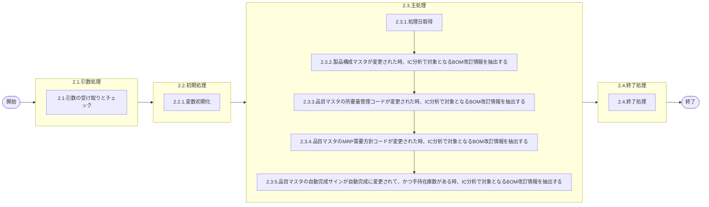

# 0. 表紙

| モジュール名 | プログラムID | プログラム名                |
| ------------ | ------------ | --------------------------- |
| IC           | LDPJ0001     | BOM改訂トランザクション取得 |

| RFC       | Version | 更新日     | 更新者 | 更新内容 | 確認日     | 確認者 | 承認日     | 承認者 |
| --------- | :-----: | ---------- | :----: | -------- | ---------- | :----: | ---------- | :----: |
| XXXX-XXXX |  1.0.0  | 2025/10/30 | 陳培煌 | 初版作成 | 2025/XX/XX |        | 2025/XX/XX |        |

## 1. 処理概要

### 1.1. 機能概要

IC分析で対象となるBOM改訂情報を抽出する。
１．製品構成マスタが変更された時
２．品目マスタの所要量管理コードが変更された時
３．品目マスタのMRP需要方針コードが変更された時
４．品目マスタの自動完成サインが自動完成に変更されて、かつ手持在庫数がある時
BOMでの部品表変更はリアルタイムに行われている。
本来であれば即時に所要量明細に反映されるべきであるが、１日１回バッチ処理で処理を行う。
ログ：共通の部品を用いる(lombok)

### 1.2. 処理概要フロー



### 1.3. プログラム入出力パラメータ

#### 1.3.1. 引数

| No. | パラメータ論理名 | パラメータ物理名 | 属性 | 識別 | 備考 |
| --- | ---------------- | ---------------- | ---- | ---- | ---- |
| 1   |                  |                  |      |      |      |

#### 1.3.2. 戻り値

| No. | パラメータ論理名 | パラメータ物理名 | 属性 | 備考 |
| --- | ---------------- | ---------------- | ---- | ---- |
| 1   |                  |                  |      |      |

### 1.4. その他制御・要件

| 排他制御 |      |      |
| -------- | ---- | ---- |
| 楽観     | 悲観 | 無し |
| -        | ●   | -    |

| 項目               | 制約・制御・要件など                | 記載内容説明                                                                                                                           |
| ------------------ | ----------------------------------- | -------------------------------------------------------------------------------------------------------------------------------------- |
| パフォーマンス要件 | BOMの夜間主処理が終了後に実施する。 | 初期や一括での変更で件数が多い時、処理対象にするかの判断が必要。 BOM改訂コントロールの前回トランザクション取得日時でコントロールする。 |

### 1.5. 入出力一覧

| No | 入出力対象 | 名称                          | 物理名称               | C  | R  | U  | D | 備考 |
| -- | ---------- | ----------------------------- | ---------------------- | -- | -- | -- | - | ---- |
| 1  | テーブル   | 製品構成                      | la_prodstrc            | -  | ○ | -  | - |      |
| 2  | テーブル   | MRP情報値                     | le_mst_mrp_information | -  | ○ | -  | - |      |
| 3  | テーブル   | 在庫ファイル                  | ld_trn_inv             | -  | ○ | -  | - |      |
| 4  | テーブル   | 品目マスター                  | la_itemmast            | -  | ○ | -  | - |      |
| 5  | テーブル   | IC分析BOM改訂コントロール     | ld_trn_derev_ctrl      | ○ | -  | ○ | - |      |
| 6  | テーブル   | IC分析BOM改訂トランザクション | ld_trn_derev_trn       | ○ | -  | -  | - |      |

## 2. 詳細処理

### 2.1. 引数の受け取りとチェック

### 2.2. 初期処理

#### 2.2.1. 変数初期化

| No | 名称                             | 物理名称                   | 設定値       | 備考                    |
| -- | -------------------------------- | -------------------------- | ------------ | ----------------------- |
| 1  | 前回処理時間                     | g_bf_trn_proc_time         | スペース     | datetime year to second |
| 2  | 今回処理時間                     | g_now_trn_proc_time        | システム時間 | datetime year to second |
| 3  | トランザクション数（構成表）     | int_trn_prodstrc           | 0            | integer                 |
| 4  | トランザクション数（所要量）     | int_trn_mrp_req_out        | 0            | integer                 |
| 5  | トランザクション数（需要方針）   | int_trn_demand_policy_code | 0            | integer                 |
| 6  | トランザクション数（AIRSフラグ） | int_trn_mrp_airs           | 0            | integer                 |
| 7  | トランザクション総数             | int_trn_total              | 0            | integer                 |
| 8  | プログラムID                     | pgmid                      | 'Ldjp0001'   | string                  |

### 2.3. 主処理

#### 2.3.1. 処理日取得

- 前回処理時間を取得する

  ```sql
    SELECT bf_trn_proc_time         -- 前回改訂ﾄﾗﾝｻﾞｸｼｮﾝ取得日時
      FROM ld_trn_derev_ctrl        -- IC分析BOM改訂コントロール
     WHERE keyfiled = "ICREVC"
  ```

  - 取得した前回改訂ﾄﾗﾝｻﾞｸｼｮﾝ取得日時を変数.前回処理時間にセットする
    - 変数.前回処理時間と変数.今回処理時間をログに出力する
  - 取得できない場合、エラーログを出力し、異常終了する
  - 検索異常の場合、エラーログを出力し、異常終了する

#### 2.3.2. 製品構成マスタが変更された時、IC分析で対象となるBOM改訂情報を抽出する

- 製品構成マスタが変更されたデータを抽出し、BOM改訂トランザクションに追加する。

  ```sql
   INSERT INTO ld_trn_derev_trn            -- IC分析BOM改訂トランザクション
        SELECT '0'                         -- IC処理済サイン '0':未処理　'1':処理済
              ,A.parent_itemno             -- 親品目番号
              ,A.parent_supplier           -- 親供給者
              ,A.parent_usercd             -- 親使用者
              ,A.structure_seq             -- 構成連番
              ,A.comp_itemno               -- 子品目番号
              ,A.comp_supplier             -- 子供給者
              ,A.comp_usercd               -- 子使用者
              ,'200'                       -- メッセージコード  '100'MRP需要　'110','300'AIRSｻｲﾝ　'200'構成変更''210'所要量出庫管理
              ,g_now_trn_proc_time         -- メンテ日時
              ,A.in_effective_ymd          -- IN発効日
              ,A.out_effective_ymd         -- OUT発効日
              ,C.item_type                 -- 品目タイプ
              ,A.comp_sign                 -- 構成品サイン
              ,A.comp_qty                  -- 員数
              ,A.comp_qty_type             -- 員数タイプ
              ,A.comp_op_percent           -- OP率
              ,B.req_issue_control         -- 所要量出庫管理コード
              ,B.demand_policy_code        -- MRP需要方針コード
              ,B.airs_sign                 -- AIRSサイン
              ,0                           -- 更新カウンタ
              ,g_now_trn_proc_time         -- 登録日時
              ,pgmid                       -- 登録者
              ,pgmid                       -- 登録PGID
              ,g_now_trn_proc_time         -- 更新日時
              ,pgmid                       -- 更新者
              ,pgmid                       -- 更新PGID
          FROM la_prodstrc  A              -- 製品構成
    INNER JOIN le_mst_mrp_information  B   -- MRP情報値
            ON A.comp_itemno   = B.itemno
           AND A.comp_supplier = B.supplier
           AND A.comp_usercd   = B.usercd
    INNER JOIN la_itemmast C   -- 品目マスター
            ON A.comp_itemno   = C.itemno
           AND A.comp_supplier = C.supplier
           AND A.comp_usercd   = C.usercd
         WHERE A.update_datetime  >= g_bf_trn_proc_time
           AND A.update_datetime  <  g_now_trn_proc_time
  ```

  - 正常処理の場合
    - 変数.トランザクション数（構成表）を追加数量をセットする
    - 変数.トランザクション数（構成表）をログに出力する
  - 処理異常の場合、エラーログを出力し、異常終了する

#### 2.3.3. 品目マスタの所要量管理コードが変更された時、IC分析で対象となるBOM改訂情報を抽出する

- 品目マスタの所要量管理コードが変更されたデータを抽出し、BOM改訂トランザクションに追加する。

  ```sql
  INSERT INTO ld_trn_derev_trn            -- IC分析BOM改訂トランザクション
       SELECT '0'                         -- IC処理済サイン '0':未処理　'1':処理済
             ,B.parent_itemno             -- 親品目番号
             ,B.parent_supplier           -- 親供給者
             ,B.parent_usercd             -- 親使用者
             ,B.structure_seq             -- 構成連番
             ,B.comp_itemno               -- 子品目番号
             ,B.comp_supplier             -- 子供給者
             ,B.comp_usercd               -- 子使用者
             ,'210'                       -- メッセージコード  '100'MRP需要　'110','300'AIRSｻｲﾝ　'200'構成変更''210'所要量出庫管理
             ,g_now_trn_proc_time         -- メンテ日時
             ,B.in_effective_ymd          -- IN発効日
             ,B.out_effective_ymd         -- OUT発効日
             ,C.item_type                 -- 品目タイプ
             ,B.comp_sign                 -- 構成品サイン
             ,B.comp_qty                  -- 員数
             ,B.comp_qty_type             -- 員数タイプ
             ,B.comp_op_percent           -- OP率
             ,A.req_issue_control         -- 所要量出庫管理コード
             ,A.demand_policy_code        -- MRP需要方針コード
             ,A.airs_sign                 -- AIRSサイン
             ,0                           -- 更新カウンタ
             ,g_now_trn_proc_time         -- 登録日時
             ,pgmid                       -- 登録者
             ,pgmid                       -- 登録PGID
             ,g_now_trn_proc_time         -- 更新日時
             ,pgmid                       -- 更新者
             ,pgmid                       -- 更新PGID
         FROM le_mst_mrp_information  A   -- MRP情報値
   INNER JOIN la_prodstrc B   -- 製品構成
           ON B.comp_itemno      = A.itemno
          AND B.comp_supplier    = A.supplier
          AND B.comp_usercd      = A.usercd
   INNER JOIN la_itemmast C   -- 品目マスター
           ON A.itemno      = C.itemno
          AND A.supplier    = C.supplier
          AND A.usercd      = C.usercd
        WHERE A.update_datetime  >= g_bf_trn_proc_time
          AND A.update_datetime  <  g_now_trn_proc_time
          AND NOT EXISTS  (SELECT 1
                             FROM ld_trn_derev_trn            -- IC分析BOM改訂トランザクション
                            WHERE close_sign             =  '0'
                              AND parent_itemno          =  B.parent_itemno
                              AND parent_supplier        =  B.parent_supplier
                              AND parent_usercd          =  B.parent_usercd
                              AND structure_seq          =  B.structure_seq
                              AND comp_itemno            =  B.comp_itemno
                              AND comp_supplier          =  B.comp_supplier
                              AND comp_usercd            =  B.comp_usercd
              )
  ```

  - 正常処理の場合
    - 変数.トランザクション数（所要量）を追加数量をセットする
    - 変数.トランザクション数（所要量）をログに出力する
  - 処理異常の場合、エラーログを出力し、異常終了する

#### 2.3.4. 品目マスタのMRP需要方針コードが変更された時、IC分析で対象となるBOM改訂情報を抽出する

- 品目マスタのMRP需要方針コードが変更されたデータを抽出し、BOM改訂トランザクションに追加する。

  ```sql
  INSERT INTO ld_trn_derev_trn
       SELECT '0'                         -- IC処理済サイン '0':未処理　'1':処理済
             ,itemno                      -- 親品目番号
             ,supplier                    -- 親供給者
             ,usercd                      -- 親使用者
             ,' '                         -- 構成連番
             ,' '                         -- 子品目番号
             ,' '                         -- 子供給者
             ,' '                         -- 子使用者
             ,'100'                       -- メッセージコード  '100'MRP需要　'110','300'AIRSｻｲﾝ　'200'構成変更''210'所要量出庫管理
             ,g_now_trn_proc_time         -- メンテ日時
             ,' '                         -- IN発効日
             ,' '                         -- OUT発効日
             ,' '                         -- 品目タイプ
             ,' '                         -- 構成品サイン
             ,'0'                         -- 員数
             ,' '                         -- 員数タイプ
             ,'0'                         -- OP率
             ,req_issue_control           -- 所要量出庫管理コード
             ,demand_policy_code          -- MRP需要方針コード
             ,airs_sign                   -- AIRSサイン
             ,0                           -- 更新カウンタ
             ,g_now_trn_proc_time         -- 登録日時
             ,pgmid                       -- 登録者
             ,pgmid                       -- 登録PGID
             ,g_now_trn_proc_time         -- 更新日時
             ,pgmid                       -- 更新者
             ,pgmid                       -- 更新PGID
         FROM le_mst_mrp_information       -- MRP情報値
        WHERE update_datetime  >= g_bf_trn_proc_time
          AND update_datetime  <  g_now_trn_proc_time
  ```

  - 正常処理の場合
    - 変数.トランザクション数（需要方針）を追加数量をセットする
    - 変数.トランザクション数（需要方針）をログに出力する
  - 処理異常の場合、エラーログを出力し、異常終了する

#### 2.3.5. 品目マスタの自動完成サインが自動完成に変更されて、かつ手持在庫数がある時、IC分析で対象となるBOM改訂情報を抽出する

- 品目マスタの自動完成サインが自動完成に変更され、かつ手持在庫数があるデータを抽出し、BOM改訂トランザクションに追加する。

  ```sql
  INSERT INTO ld_trn_derev_trn
       SELECT '0'                         -- IC処理済サイン '0':未処理　'1':処理済
             ,A.itemno                    -- 親品目番号
             ,A.supplier                  -- 親供給者
             ,A.usercd                    -- 親使用者
             ,' '                         -- 構成連番
             ,' '                         -- 子品目番号
             ,' '                         -- 子供給者
             ,' '                         -- 子使用者
             ,'110'                       -- メッセージコード  '100'MRP需要　'110','300'AIRSｻｲﾝ　'200'構成変更''210'所要量出庫管理
             ,g_now_trn_proc_time         -- メンテ日時
             ,' '                         -- IN発効日
             ,' '                         -- OUT発効日
             ,' '                         -- 品目タイプ
             ,' '                         -- 構成品サイン
             ,'0'                         -- 員数
             ,' '                         -- 員数タイプ
             ,'0'                         -- OP率
             ,A.req_issue_control         -- 所要量出庫管理コード
             ,A.demand_policy_code        -- MRP需要方針コード
             ,A.airs_sign                 -- AIRSサイン
             ,0                           -- 更新カウンタ
             ,g_now_trn_proc_time         -- 登録日時
             ,pgmid                       -- 登録者
             ,pgmid                       -- 登録PGID
             ,g_now_trn_proc_time         -- 更新日時
             ,pgmid                       -- 更新者
             ,pgmid                       -- 更新PGID
         FROM le_mst_mrp_information A     -- MRP情報値
   INNER JOIN ld_trn_inv  B                -- 在庫ファイル
           ON B.itemno           =  A.itemno
          AND B.supplier         =  A.supplier
          AND B.usercd           =  A.usercd
          AND B.oh_qty           <> 0
        WHERE A.update_datetime  >= g_bf_trn_proc_time
          AND A.update_datetime  <  g_now_trn_proc_time
          AND A.airs_sign        = '1'
  ```

  - 正常処理の場合
    - 変数.トランザクション数（AIRSフラグ）を追加数量をセットする
    - 変数.トランザクション数（AIRSフラグ）をログに出力する
  - 処理異常の場合、エラーログを出力し、異常終了する

  ```sql
  INSERT INTO ld_trn_derev_trn
       SELECT '0'                         -- IC処理済サイン '0':未処理　'1':処理済
             ,itemno                      -- 親品目番号
             ,supplier                    -- 親供給者
             ,usercd                      -- 親使用者
             ,' '                         -- 構成連番
             ,' '                         -- 子品目番号
             ,' '                         -- 子供給者
             ,' '                         -- 子使用者
             ,'300'                       -- メッセージコード  '100'MRP需要　'110','300'AIRSｻｲﾝ　'200'構成変更''210'所要量出庫管理
             ,g_now_trn_proc_time         -- メンテ日時
             ,' '                         -- IN発効日
             ,' '                         -- OUT発効日
             ,' '                         -- 品目タイプ
             ,' '                         -- 構成品サイン
             ,'0'                         -- 員数
             ,' '                         -- 員数タイプ
             ,'0'                         -- OP率
             ,req_issue_control           -- 所要量出庫管理コード
             ,demand_policy_code          -- MRP需要方針コード
             ,airs_sign                   -- AIRSサイン
             ,0                           -- 更新カウンタ
             ,g_now_trn_proc_time         -- 登録日時
             ,pgmid                       -- 登録者
             ,pgmid                       -- 登録PGID
             ,g_now_trn_proc_time         -- 更新日時
             ,pgmid                       -- 更新者
             ,pgmid                       -- 更新PGID
         FROM le_mst_mrp_information      -- MRP情報値
        WHERE update_datetime  >= g_bf_trn_proc_time
          AND update_datetime  <  g_now_trn_proc_time
          AND airs_sign        = '1'
          AND supplier         <>  usercd
  ```

  - 正常処理の場合
    - 変数.トランザクション数（AIRSフラグ）を追加数量を加算する
    - 変数.トランザクション数（AIRSフラグ）をログに出力する
  - 処理異常の場合、エラーログを出力し、異常終了する

### 2.4. 終了処理

- IC分析BOM改訂コントロールの前回改訂ﾄﾗﾝｻﾞｸｼｮﾝ取得日時を変数.今回処理時間に更新する

```sql
UPDATE ld_trn_derev_ctrl           -- IC分析BOM改訂コントロール
   SET bf_trn_proc_time = g_now_trn_proc_time
      ,update_counter   = update_counter + 1
      ,update_datetime  = g_now_trn_proc_time
      ,update_pgmid     = pgmid
      ,update_pgmid     = pgmid
 WHERE keyfiled = "ICREVC"
```

- トランザクション総数を計算し、ログに出力する
  - 変数.トランザクション数（構成表） +トランザクション数（所要量） +トランザクション数（需要方針） +トランザクション数（AIRSフラグ）を変数.トランザクション総数にセットする
  - 変数.トランザクション総数をログに出力する
