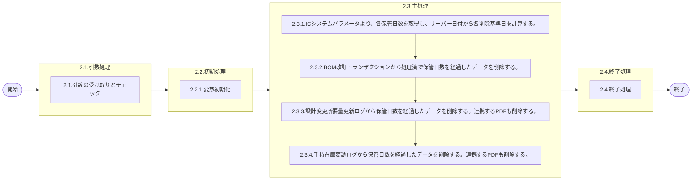

# 0. 表紙

| モジュール名 | プログラムID | プログラム名             |
| ------------ | ------------ | ------------------------ |
| IC           | LDPJ0002     | IC分析過去データ削除処理 |

| RFC       | Version | 更新日     | 更新者 | 更新内容 | 確認日     | 確認者 | 承認日     | 承認者 |
| --------- | :-----: | ---------- | :----: | -------- | ---------- | :----: | ---------- | :----: |
| XXXX-XXXX |  1.0.0  | 2025/11/06 | 陳培煌 | 初版作成 | 2025/XX/XX |        | 2025/XX/XX |        |

## 1. 処理概要

### 1.1. 機能概要

ICシステムパラメータより、各保管日数を取得し、サーバー日付から各削除基準日を計算する。
BOM改訂トランザクションから処理済で保管日数を経過したデータを削除する。
設計変更所要量更新ログから保管日数を経過したデータを削除する。
手持在庫変動ログから保管日数を経過したデータを削除する。
ログ：共通の部品を用いる(lombok)

### 1.2. 処理概要フロー



### 1.3. プログラム入出力パラメータ

#### 1.3.1. 引数

| No. | パラメータ論理名 | パラメータ物理名 | 属性 | 識別 | 備考 |
| --- | ---------------- | ---------------- | ---- | ---- | ---- |
| 1   |                  |                  |      |      |      |

#### 1.3.2. 戻り値

| No. | パラメータ論理名 | パラメータ物理名 | 属性 | 備考 |
| --- | ---------------- | ---------------- | ---- | ---- |
| 1   |                  |                  |      |      |

### 1.4. その他制御・要件

| 排他制御 |      |      |
| -------- | ---- | ---- |
| 楽観     | 悲観 | 無し |
| -        | -    | ●   |

| 項目               | 制約・制御・要件など                | 記載内容説明                                                                                                               |
| ------------------ | ----------------------------------- | -------------------------------------------------------------------------------------------------------------------------- |
| パフォーマンス要件 | BOMの夜間主処理が終了後に実施する。 | 過去データの削除のため、ロック等で削除できないときはスキップし、 次回の処理で削除できるようにする。 ※ワーニング扱いで処理 |

### 1.5. 入出力一覧

| No | 入出力対象 | 名称                          | 物理名称                | C | R  | U | D  | 備考 |
| -- | ---------- | ----------------------------- | ----------------------- | - | -- | - | -- | ---- |
| 1  | テーブル   | ICシステムパラメータ          | ld_mst_system_parameter | - | ○ | - | -  |      |
| 2  | テーブル   | IC分析BOM改訂トランザクション | ld_trn_derev_trn        | - | -  | - | ○ |      |
| 3  | テーブル   | 設計変更所要量更新ログ        | ld_trn_reqchg_log       | - | -  | - | ○ |      |
| 4  | テーブル   | 手持在庫変動ログ              | ld_trn_fluct_log        | - | -  | - | ○ |      |

## 2. 詳細処理

### 2.1. 引数の受け取りとチェック

### 2.2. 初期処理

#### 2.2.1. 変数初期化

| No | 名称                                       | 物理名称            | 設定値       | 備考                    |
| -- | ------------------------------------------ | ------------------- | ------------ | ----------------------- |
| 1  | IC分析トランザクション削除基準日時         | derev_retent_days   | スペース     | datetime year to second |
| 2  | 手持在庫変動ログファイル削除基準日時       | ohlog_retent_days   | スペース     | datetime year to second |
| 3  | 設計変更所要量更新ログファイル削除基準日時 | rdlog_retent_days   | スペース     | datetime year to second |
| 4  | 今回処理時間                               | g_now_trn_proc_time | システム時間 | datetime year to second |

### 2.3. 主処理

#### 2.3.1. ICシステムパラメータより、各保管日数を取得し、サーバー日付から各削除基準日を計算する

```sql
   SELECT analyze_holding_days    -- IC分析トランザクション保有日数
         ,fluct_log_holding_days  -- 手持在庫変動ログファイル保有日数
         ,reqchg_log_holding_days -- 設計変更所要量更新ログファイル保有日数
     FROM ld_mst_system_parameter
    WHERE operation_type = 'STD'
```

derev_retent_days = g_now_trn_proc_time - analyze_holding_days
ohlog_retent_days = g_now_trn_proc_time - fluct_log_holding_days
reqchg_log_retent_days = g_now_trn_proc_time - reqchg_log_holding_days

#### 2.3.2. IC分析BOM改訂トランザクションから処理済で保管日数を経過したデータを削除する

```sql
   DELETE FROM ld_trn_derev_trn
         WHERE close_sign = '1' -- 処理済
           AND update_datetime  < :derev_retent_days
```

- IC分析BOM改訂トランザクションの削除件数を取得する

#### 2.3.3. 設計変更所要量更新ログから保管日数を経過したデータを削除する

```sql
   DELETE FROM ld_trn_reqchg_log
         WHERE ic_slip_date< :reqchg_log_retent_days
```

- 設計変更所要量更新ログの削除件数を取得する

#### 2.3.4. 手持在庫変動ログから保管日数を経過したデータを削除する

```sql
   DELETE FROM ld_trn_fluct_log
         WHERE ic_slip_date< :ohlog_retent_days
```

- 手持在庫変動ログの削除件数を取得する

### 2.4. 終了処理

- IC分析BOM改訂トランザクションの削除件数をログ出力する
- 設計変更所要量更新ログの削除件数をログ出力する
- 手持在庫変動ログの削除件数をログ出力する
