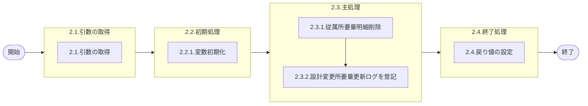

# 0. 表紙

| モジュール名 | プログラムID | プログラム名           |
| ------------ | ------------ | ---------------------- |
| IC           | LDPS0001_01  | 従属所要量明細削除処理 |

| RFC | Version | 更新日     | 更新者 | 更新内容 | 確認日     | 確認者 | 承認日     | 承認者 |
| --- | :-----: | ---------- | :----: | -------- | ---------- | :----: | ---------- | :----: |
| -   |  1.0.0  | 2025/10/11 | 李鵬陽 | 初版作成 | 2025/XX/XX |  XXX  | 2025/XX/XX |  XXX  |

## 1. 処理概要

### 1.1. 機能概要

親品目オーダの従属所要量の削除を行う。

### 1.2. 処理概要フロー



### 1.3. プログラム入出力パラメータ

#### 1.3.1. 引数

| No. | パラメータ論理名   | パラメータ物理名      | 属性        | 備考     |
| --- | ------------------ | --------------------- | ----------- | -------- |
| 1   | 親品目番号         | ps_itemno             | VARCHAR(30) |          |
| 2   | 親供給者           | ps_supplier           | VARCHAR(4)  |          |
| 3   | 親使用者           | ps_usercd             | VARCHAR(4)  |          |
| 4   | オーダー番号       | ps_orderno            | VARCHAR(5)  |          |
| 5   | 構成連番           | ps_structure_seq      | VARCHAR(3)  |          |
| 6   | 子品目番号         | ps_c_itemno           | VARCHAR(30) |          |
| 7   | 子供給者           | ps_c_supplier         | VARCHAR(4)  |          |
| 8   | 子使用者           | ps_c_usercd           | VARCHAR(4)  |          |
| 9   | IC工場処理日       | ps_ic_factory_date    | VARCHAR(8)  |          |
| 10  | オーダーステータス | ps_order_status       | VARCHAR(1)  |          |
| 11  | 着手日             | ps_start_date         | VARCHAR(8)  | YYYYMMDD |
| 12  | 所要数             | pn_required_qty       | DECIMAL     |          |
| 13  | 出庫数             | pn_delivery_qty       | DECIMAL     |          |
| 14  | IN発効日           | ps_in_effective_date  | VARCHAR(8)  | YYYYMMDD |
| 15  | OUT発効日          | ps_out_effective_date | VARCHAR(8)  | YYYYMMDD |
| 16  | 構成品サイン       | ps_comp_sign          | VARCHAR(1)  |          |
| 17  | OP率               | pn_option_percent     | DECIMAL     |          |
| 18  | メッセージコード   | ps_message_code       | VARCHAR(3)  |          |
| 19  | 親払出日           | ps_disburse_date      | VARCHAR(8)  |          |

#### 1.3.2. 戻り値

| No. | パラメータ論理名 | パラメータ物理名 | 属性    | 備考                                               |
| --- | ---------------- | ---------------- | ------- | -------------------------------------------------- |
| 1   | 処理ステータス   | rn_status        | INTEGER | 0:Normal-1:SqlError-2:ProgramError100:NotDataFound |
| 2   | SQLコード        | rs_sql_code      | VARCHAR |                                                    |
| 3   | エラーコード     | rs_err_code      | VARCHAR |                                                    |
| 4   | エラーメッセージ | rs_err_msg       | VARCHAR |                                                    |
| 5   | エラー位置       | rs_err_focus     | VARCHAR |                                                    |
| 6   | ログ挿入数       | rn_cnt_ins_lg    | VARCHAR |                                                    |

### 1.4. その他制御・要件

| 排他制御 |      |      |
| -------- | ---- | ---- |
| 楽観     | 悲観 | 無し |
| -        | ●   | -    |

| 項目               | 制約・制御・要件など                | 記載内容説明                                         |
| ------------------ | ----------------------------------- | ---------------------------------------------------- |
| パフォーマンス要件 | BOMの夜間主処理が終了後に実施する。 | 従属所要量明細のメンテ中に他からのアクセスが無い事。 |

### 1.5. 入出力一覧

| No | 入出力対象 | 名称                   | 物理名称            | C | R  | U | D  | 備考 |
| -- | ---------- | ---------------------- | ------------------- | - | -- | - | -- | ---- |
| 1  | テーブル   | 従属所要量明細         | le_trn_drd          | - | ○ | - | ○ |      |
| 2  | テーブル   | 従属所要量明細内示     | le_trn_drd_forecast | - | ○ | - | ○ |      |
| 3  | テーブル   | 設計変更所要量更新ログ | ld_trn_reqchg_log   | - | ○ | - | -  |      |
| 4  | 共通関数   | 従属所要量明細削除     | LDAS0417            |   |    |   |    |      |

## 2. 詳細処理

### 2.1. 引数の取得

### 2.2. 初期処理

#### 2.2.1. 変数初期化

利用する変数を初期化する。

| No. | 変数論理名            | 初期化設定値 |
| :-: | --------------------- | ------------ |
|  1  | 変数.システム時刻     | システム時刻 |
|  2  | 変数.担当課           | スペース     |
|  3  | 変数.担当者           | スペース     |
|  4  | 変数.ログ挿入数       | 0            |
|  5  | 変数.処理ステータス   | スペース     |
|  6  | 変数.SQLコード        | スペース     |
|  7  | 変数.エラーコード     | スペース     |
|  8  | 変数.エラーメッセージ | スペース     |
|  9  | 変数.エラー位置       | スペース     |

### 2.3. 主処理

#### 2.3.1. 従属所要量明細削除

    CALL SP LDAS0417従属所要量明細削除

```sql
SELECT
    処理ステータス,
    SQLコード,
    エラーコード,
    エラーメッセージ,
    エラー位置
  INTO
    処理ステータス,
    SQLコード,
    エラーコード,
    エラーメッセージ,
    エラー位置
  FROM
    LDAS0417(
        引数.親品目番号,
        引数.親供給者,
        引数.親使用者,
        引数.オーダー番号,
        引数.子品目番号,
        引数.子供給者,
        引数.子使用者,
        引数.構成連番,
        'IC_REV',
        引数.IC工場処理日
    )
```

    変数.SPステータス <> 0  の場合、エラーメッセージを出力し処理終了
　      - エラーコード：'E.LDP10150'
        - エラーメッセージ：'<<SP:LDAS0417 Error Return>>' || 'Return:  ' || 変数.処理ステータス || ','|| 変数.SQLコード || ','|| 変数.エラーコード || ','|| 変数.エラーメッセージ || ','|| 変数.エラー位置

#### 2.3.2. 設計変更所要量更新ログを登記

引数.オーダーステータス IN ('1','2')の場合
    SUマスタを検索する

```sql
    SELECT b.担当課
          ,b.担当者
      INTO 変数.担当課
          ,変数.担当者
      FROM SUマスタ a
      JOIN GIMACエリアマスタ b
        ON a.エリアコード = b.エリアコード
     WHERE a.SUコード = 引数.子供給者
```

    データが存在しないの場合
        変数.担当課 = ' '
        変数.担当者 = ' '

    設計変更所要量更新ログを登記

```sql
    INSERT INTO  設計変更所要量更新ログ(
        IC工場処理日
        ,追削区分
        ,親品目番号  
        ,親供給者  
        ,親使用者  
        ,親払出日  
        ,通算オーダー番号
        ,構成連番
        ,子品目番号  
        ,子供給者  
        ,子使用者
        ,登録日時
        ,メッセージコード
        ,担当課
        ,担当者
        ,オーダーステータス
        ,着手日
        ,所要数
        ,出庫数
        ,IN発効日
        ,OUT発効日
        ,構成品サイン
        ,OP率
        ,更新カウンタ
        ,登録日時
        ,登録者
        ,登録PGID
        ,更新日時
        ,更新者
        ,更新PGID
    )
    VALUES (
        引数.IC工場処理日
        ,'3'
        ,引数.親品目番号  
        ,引数.親供給者  
        ,引数.親使用者  
        ,引数.親払出日  
        ,引数.オーダー番号
        ,引数.構成連番
        ,引数.子品目番号  
        ,引数.子供給者  
        ,引数.子使用者
        ,変数.システム時刻
        ,引数.メッセージコード
        ,変数.担当課
        ,変数.担当者
        ,引数.オーダーステータス
        ,引数.着手日
        ,引数.所要数
        ,引数.出庫数
        ,引数.IN発効日
        ,引数.OUT発効日
        ,引数.構成品サイン
        ,引数.OP率
        ,0       
        ,変数.システム時刻   
        ,'IC_REV'
        ,プログラムID
        ,変数.システム時刻  
        ,'IC_REV'  
        ,プログラムID
    )
```

    変数.ログ挿入数 = 変数.ログ挿入数 + 1

### 2.4. 終了処理

戻り値に設定する。

| 戻り値論理名     | 設定値          |
| ---------------- | --------------- |
| 処理ステータス   | 0               |
| SQL コード       | スペース        |
| エラーコード     | スペース        |
| エラーメッセージ | スペース        |
| エラー位置       | スペース        |
| ログ挿入数       | 変数.ログ挿入数 |

## 3. 補足説明

### 3.1. 戻り値について

**ステータスについて**

- 0 : Normal（正常終了）
- 100 : Not Data Found（データなし）
- -1 : Sql Error（SQLエラー）
- -2 : Program Error（プログラムエラー）

### 3.2. エラー発生時の対応について

### 3.2.1. 業務例外処理

引数チェック等でプログラムエラーが発生した場合：

| 戻り値           | 設定値         |
| ---------------- | -------------- |
| 処理ステータス   | -2             |
| SQLコード        | スペース       |
| エラーコード     | エラーコード値 |
| エラーメッセージ | エラー内容     |
| エラー位置       | 'LDPS0001_01'  |
| その他項目       | 初期値         |

### 3.2.2. その他例外処理

データベースアクセス時にSQLエラーが発生した場合：

| 戻り値           | 設定値        |
| ---------------- | ------------- |
| 処理ステータス   | -1            |
| SQLコード        | SQLSTATE      |
| エラーコード     | スペース      |
| エラーメッセージ | SQLERRM       |
| エラー位置       | 'LDPS0001_01' |
| その他項目       | 初期値        |

