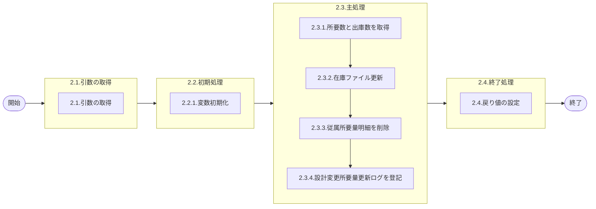

# 0. 表紙

| モジュール名 | プログラムID | プログラム名           |
| ------------ | ------------ | ---------------------- |
| IC           | LDPS0001_01  | 従属所要量明細削除処理 |

| RFC | Version | 更新日     | 更新者 | 更新内容 | 確認日     | 確認者 | 承認日     | 承認者 |
| --- | :-----: | ---------- | :----: | -------- | ---------- | :----: | ---------- | :----: |
| -   |  1.0.0  | 2025/10/11 | 李鵬陽 | 初版作成 | 2025/XX/XX |  XXX  | 2025/XX/XX |  XXX  |

## 1. 処理概要

### 1.1. 機能概要

親品目オーダの従属所要量の削除を行う。

### 1.2. 処理概要フロー



### 1.3. プログラム入出力パラメータ

#### 1.3.1. 引数

| No. | パラメータ論理名   | パラメータ物理名      | 属性        | 備考     |
| --- | ------------------ | --------------------- | ----------- | -------- |
| 1   | 親品目番号         | ps_itemno             | VARCHAR(14) |          |
| 2   | 親供給者           | ps_supplier           | VARCHAR(4)  |          |
| 3   | 親使用者           | ps_usercd             | VARCHAR(4)  |          |
| 4   | 親払出日           | ps_disburse_date      | VARCHAR(8)  | YYYYMMDD |
| 5   | 通算オーダー番号   | ps_total_orderno      | VARCHAR(5)  |          |
| 6   | 構成連番           | ps_structure_seq      | VARCHAR(3)  |          |
| 7   | 子品目番号         | ps_c_itemno           | VARCHAR(14) |          |
| 8   | 子供給者           | ps_c_supplier         | VARCHAR(4)  |          |
| 9   | 子使用者           | ps_c_usercd           | VARCHAR(4)  |          |
| 10  | IC工場処理日       | ps_ic_factory_date    | VARCHAR(8)  |          |
| 11  | オーダーステータス | ps_order_status       | VARCHAR(1)  |          |
| 12  | 着手日             | ps_start_date         | VARCHAR(8)  | YYYYMMDD |
| 13  | 所要数             | pn_required_qty       | DECIMAL     |          |
| 14  | 出庫数             | pn_delivery_qty       | DECIMAL     |          |
| 15  | IN発効日           | ps_in_effective_date  | VARCHAR(8)  | YYYYMMDD |
| 16  | OUT発効日          | ps_out_effective_date | VARCHAR(8)  | YYYYMMDD |
| 17  | 構成品サイン       | ps_comp_sign          | VARCHAR(1)  |          |
| 18  | OP率               | pn_option_percent     | DECIMAL     |          |
| 19  | ユーザID           | ps_user_id            | VARCHAR(8)  |          |
| 20  | メッセージコード   | ps_message_code       | VARCHAR(3)  |          |

#### 1.3.2. 戻り値

| No. | パラメータ論理名 | パラメータ物理名 | 属性    | 備考                                               |
| --- | ---------------- | ---------------- | ------- | -------------------------------------------------- |
| 1   | 処理ステータス   | rn_status        | INTEGER | 0:Normal-1:SqlError-2:ProgramError100:NotDataFound |
| 2   | SQLコード        | rs_sql_code      | VARCHAR |                                                    |
| 3   | エラーコード     | rs_err_code      | VARCHAR |                                                    |
| 4   | エラーメッセージ | rs_err_msg       | VARCHAR |                                                    |
| 5   | エラー位置       | rs_err_focus     | VARCHAR |                                                    |

### 1.4. その他制御・要件

| 排他制御 |      |      |
| -------- | ---- | ---- |
| 楽観     | 悲観 | 無し |
| -        | ●   | -    |

| 項目               | 制約・制御・要件など                | 記載内容説明                                         |
| ------------------ | ----------------------------------- | ---------------------------------------------------- |
| パフォーマンス要件 | BOMの夜間主処理が終了後に実施する。 | 従属所要量明細のメンテ中に他からのアクセスが無い事。 |

### 1.5. 入出力一覧

| No | 入出力対象 | 名称                   | 物理名称            | C | R  | U | D  | 備考 |
| -- | ---------- | ---------------------- | ------------------- | - | -- | - | -- | ---- |
| 1  | テーブル   | 従属所要量明細         | le_trn_drd          | - | ○ | - | ○ |      |
| 2  | テーブル   | 従属所要量明細内示     | le_trn_drd_forecast | - | ○ | - | ○ |      |
| 3  | テーブル   | 設計変更所要量更新ログ | ld_trn_reqchg_log   | - | ○ | - | -  |      |
| 4  | 共通関数   | 在庫ファイル更新       | ld0sl4810           |   |    |   |    |      |
| 5  |            |                        |                     |   |    |   |    |      |
| 6  |            |                        |                     |   |    |   |    |      |

## 2. 詳細処理

### 2.1. 引数の取得

### 2.2. 初期処理

#### 2.2.1. 変数初期化

利用する変数を初期化する。

| No. | 変数論理名                  | 初期化設定値 |
| :-: | --------------------------- | ------------ |
|  1  | 変数.着手日                 | スペース     |
|  2  | 変数.オーダーステータス     | スペース     |
|  3  | 変数.生試初品区分           | スペース     |
|  4  | 変数.所要数                 | 0            |
|  5  | 変数.出庫数                 | 0            |
|  6  | 変数.構成品タイプ           | スペース     |
|  7  | 変数.構成品サイン           | スペース     |
|  8  | 変数.所要量出庫管理コード   | スペース     |
|  9  | 変数.員数                   | 0            |
| 10 | 変数.員数タイプ             | スペース     |
| 11 | 変数.員数小数点             | 0            |
| 12 | 変数.ＯＰ率                 | 0            |
| 13 | 変数.ホスト保証区分         | スペース     |
| 14 | 変数.MRP更新日              | スペース     |
| 15 | 変数.登録日時               | スペース     |
| 16 | 変数.登録者                 | スペース     |
| 17 | 変数.テーブルフラグ         | スペース     |
| 18 | 変数.SPステータス           | 0            |
| 19 | 変数.SQL_ERROR              | スペース     |
| 20 | 変数.ISAM_ERROR             | スペース     |
| 21 | 変数.PGステータス           | スペース     |
| 22 | 変数.手持在庫数             | 0            |
| 23 | 変数.発注済所要数(従属所要) | 0            |
| 24 | 変数.子品目番号             | スペース     |
| 25 | 変数.子供給者               | スペース     |
| 26 | 変数.子使用者               | スペース     |
| 27 | 変数.システム時刻           | システム時刻 |
| 28 | 変数.担当課                 | スペース     |
| 29 | 変数.担当者                 | スペース     |

### 2.3. 主処理
#### 2.3.1. 所要数と出庫数を取得

従属所要量明細を検索する

```sql
SELECT  着手日
       ,オーダーステータス
       ,生試初品区分
       ,所要数
       ,出庫数
       ,構成品タイプ
       ,構成品サイン
       ,所要量出庫管理コード
       ,員数  
       ,員数タイプ
       ,員数小数点
       ,ＯＰ率
       ,ホスト保証区分    確認待ち   无该字段
       ,MRP更新日
       ,登録日時
       ,登録者
  into  変数.着手日
       ,変数.オーダーステータス
       ,変数.生試初品区分
       ,変数.所要数
       ,変数.出庫数
       ,変数.構成品タイプ
       ,変数.構成品サイン
       ,変数.所要量出庫管理コード
       ,変数.員数  
       ,変数.員数タイプ
       ,変数.員数小数点
       ,変数.ＯＰ率
       ,変数.ホスト保証区分    確認待ち   无该字段
       ,変数.MRP更新日
       ,変数.登録日時
       ,変数.登録者 
FROM  従属所要量明細
 WHERE 親品目番号    = 引数.親品目番号
   AND 親供給者      = 引数.親供給者 
   AND 親使用者      = 引数.親使用者  
   AND 親払出日      = 引数.親払出日   確認待ち  现在无该字段
   AND 通算オーダー番号 = 引数.通算オーダー番号
   AND 構成連番      = 引数.構成連番
   AND 子品目番号    = 引数.子品目番号
   AND 子供給者      = 引数.子供給者 
   AND 子使用者      = 引数.子使用者  
  
```

データが存在するの場合
    変数.テーブルフラグ　= '1'

データが存在しないの場合
    従属所要量明細内示を検索する

```sql
SELECT  着手日
       ,オーダーステータス
       ,生試初品区分
       ,所要数
       ,出庫数
       ,構成品タイプ
       ,構成品サイン
       ,所要量出庫管理コード
       ,員数  
       ,員数タイプ
       ,員数小数点
       ,ＯＰ率
       ,ホスト保証区分    確認待ち   无该字段
       ,MRP更新日
       ,登録日時
       ,登録者
  into  変数.着手日
       ,変数.オーダーステータス
       ,変数.生試初品区分
       ,変数.所要数
       ,変数.出庫数
       ,変数.構成品タイプ
       ,変数.構成品サイン
       ,変数.所要量出庫管理コード
       ,変数.員数  
       ,変数.員数タイプ
       ,変数.員数小数点
       ,変数.ＯＰ率
       ,変数.ホスト保証区分    確認待ち   无该字段
       ,変数.MRP更新日
       ,変数.登録日時
       ,変数.登録者 
FROM  従属所要量明細内示
 WHERE 親品目番号    = 引数.親品目番号
   AND 親供給者      = 引数.親供給者 
   AND 親使用者      = 引数.親使用者  
   AND 親払出日      = 引数.親払出日   確認待ち  现在无该字段
   AND 通算オーダー番号 = 引数.通算オーダー番号
   AND 構成連番      = 引数.構成連番
   AND 子品目番号    = 引数.子品目番号
   AND 子供給者      = 引数.子供給者 
   AND 子使用者      = 引数.子使用者  
  
```

    変数.テーブルフラグ　= '2'

    データが存在しないの場合、エラーメッセージを出力し処理終了
        - エラーコード：'E.XXXXX'  確認待ち
        - エラーメッセージ：

#### 2.3.2 発注済所要数取得

変数.オーダーステータス = '2'　の場合
    変数.発注済所要数(従属所要)　=  変数.所要数 - 変数.出庫数

    変数.構成品サイン = '-' かつ　 変数.発注済所要数(従属所要)　> 0　の場合
        変数.発注済所要数(従属所要)　=  0

    変数.構成品サイン <> '-' かつ　 変数.発注済所要数(従属所要)　< 0　の場合
        変数.発注済所要数(従属所要)　=  0

    変数.発注済所要数(従属所要)　=  変数.発注済所要数(従属所要)* -1

    CALL sp 在庫ファイル更新

```sql
SELECT
    SPステータス,
    SQL_ERROR,
    ISAM_ERROR,
    PGステータス,
    手持在庫数
INTO
    変数.SPステータス,
    変数.SQL_ERROR,
    変数.ISAM_ERROR,
    変数.PGステータス,
    変数.手持在庫数
FROM
    ld0sl4810( 引数.ユーザID　確認待ち  ps_user_id
        変数.子品目番号,
        変数.子供給者,
        変数.子使用者,
        NULL,
        NULL,
        NULL,
        NULL,
        変数.発注済所要数(従属所要),
        NULL,
        NULL,
        NULL,
        NULL,
        NULL,
        NULL,
        NULL,
        NULL,
        NULL,
        NULL
    )
```

    変数.SPステータス <> 0  の場合、エラーメッセージを出力し処理終了
          - エラーコード：'E.XXXXX'  確認待ち
          - エラーメッセージ：

変数.オーダーステータス <> '9'　の場合
    確認待ち　　原来会在 従属所要量明細（削除）表中插入数据

#### 2.3.3. 従属所要量明細を削除

変数.テーブルフラグ　= '1'　の場合
    従属所要量明細を削除

```sql
DELETE FROM  従属所要量明細
 WHERE 親品目番号    = 引数.親品目番号
   AND 親供給者      = 引数.親供給者 
   AND 親使用者      = 引数.親使用者  
   AND 親払出日      = 引数.親払出日   確認待ち  现在无该字段
   AND 通算オーダー番号 = 引数.通算オーダー番号
   AND 構成連番      = 引数.構成連番
   AND 子品目番号    = 引数.子品目番号
   AND 子供給者      = 引数.子供給者 
   AND 子使用者      = 引数.子使用者  
```

変数.テーブルフラグ　= '2'　の場合
    従属所要量明細内示を削除

```sql
DELETE FROM  従属所要量明細内示
 WHERE 親品目番号    = 引数.親品目番号
   AND 親供給者      = 引数.親供給者 
   AND 親使用者      = 引数.親使用者  
   AND 親払出日      = 引数.親払出日   確認待ち  现在无该字段
   AND 通算オーダー番号 = 引数.通算オーダー番号
   AND 構成連番      = 引数.構成連番
   AND 子品目番号    = 引数.子品目番号
   AND 子供給者      = 引数.子供給者 
   AND 子使用者      = 引数.子使用者  
```

#### 2.3.4. 設計変更所要量更新ログを登記

引数.オーダーステータス in ('1','2')の場合
    SUマスタを検索する

```sql
    SELECT b.担当課
          ,b.担当者
      INTO 変数.担当課
          ,変数.担当者
    FROM SUマスタ a
      LEFT JOIN GIMACエリアマスタ b
        ON a.エリアコード = b.エリアコード
    WHERE a.SUコード = 引数.子供給者
```

それ以外の場合
    変数.担当課 = ''
    変数.担当者 = ''

設計変更所要量更新ログを登記

```sql
    INSERT INTO  設計変更所要量更新ログ(
        IC工場処理日
        ,追削区分
        ,親品目番号    
        ,親供給者      
        ,親使用者      
        ,親払出日      
        ,通算オーダー番号
        ,構成連番
        ,子品目番号  
        ,子供給者  
        ,子使用者
        ,登録日時
        ,メッセージコード
        ,担当課
        ,担当者
        ,オーダーステータス
        ,着手日
        ,所要数
        ,出庫数
        ,IN発効日
        ,OUT発効日
        ,構成品サイン
        ,OP率
        ,current_datetime 確認待ち   
    )
    VALUES (
        引数.IC工場処理日
        ,'3'
        ,引数.親品目番号    
        ,引数.親供給者      
        ,引数.親使用者      
        ,引数.親払出日      
        ,引数.通算オーダー番号
        ,引数.構成連番
        ,引数.子品目番号  
        ,引数.子供給者  
        ,引数.子使用者
        ,変数.システム時刻
        ,引数.メッセージコード
        ,変数.担当課
        ,変数.担当者
        ,引数.オーダーステータス
        ,引数.着手日
        ,引数.所要数
        ,引数.出庫数
        ,引数.IN発効日
        ,引数.OUT発効日
        ,引数.構成品サイン
        ,引数.OP率
        ,変数.システム時刻
    )
```


### 2.4. 終了処理

戻り値に設定する。

| 戻り値論理名     | 設定値   |
| ---------------- | -------- |
| 処理ステータス   | 0        |
| SQL コード       | スペース |
| エラーコード     | スペース |
| エラーメッセージ | スペース |
| エラー位置       | スペース |

## 3. 補足説明

### 3.1. 戻り値について

**ステータスについて**

- 0 : Normal（正常終了）
- 100 : Not Data Found（データなし）
- -1 : Sql Error（SQLエラー）
- -2 : Program Error（プログラムエラー）

### 3.2. エラー発生時の対応について

### 3.2.1. 業務例外処理

引数チェック等でプログラムエラーが発生した場合：

| 戻り値           | 設定値         |
| ---------------- | -------------- |
| 処理ステータス   | -2             |
| SQLコード        | スペース       |
| エラーコード     | エラーコード値 |
| エラーメッセージ | エラー内容     |
| エラー位置       | 'LDPS0001_01'  |
| その他項目       | 初期値         |

### 3.2.2. その他例外処理

データベースアクセス時にSQLエラーが発生した場合：

| 戻り値           | 設定値        |
| ---------------- | ------------- |
| 処理ステータス   | -1            |
| SQLコード        | SQLSTATE      |
| エラーコード     | スペース      |
| エラーメッセージ | SQLERRM       |
| エラー位置       | 'LDPS0001_01' |
| その他項目       | 初期値        |
