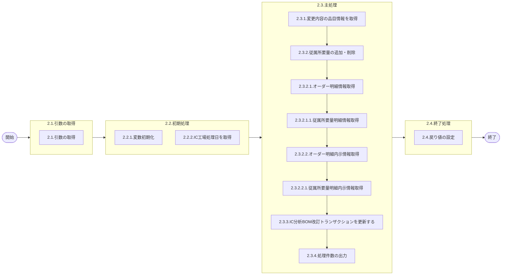

# 0. 表紙

| モジュール名 | プログラムID | プログラム名             |
| ------------ | ------------ | ------------------------ |
| IC           | LDPS0001     | 製品構成／所要量管理変更 |

| RFC | Version | 更新日     | 更新者 | 更新内容 | 確認日     | 確認者 | 承認日     | 承認者 |
| --- | :-----: | ---------- | :----: | -------- | ---------- | :----: | ---------- | :----: |
| -   |  1.0.0  | 2025/10/10 | 李鵬陽 | 初版作成 | 2025/XX/XX |  XXX  | 2025/XX/XX |  XXX  |

## 1. 処理概要

### 1.1. 機能概要

製品構成マスタが変更された時（BOM改訂トランザクションより取得）、変更内容により親品目オーダの従属所要量の追加・削除を行う。
MRP情報値の所要量管理コードが変更された時（BOM改訂トランザクションより取得）、製品構成マスタから当該品目を子品目とする親品目を参照して親品目オーダの従属所要量の追加・削除を行う。
BOM改訂トランザクションの未処理レコードを対象とし、処理終了後に該当レコードを処理済に更新する。
オーダーステータス"9"(完了)に従属する所要量は処理の対象外とする。
・
所要量明細の削除処理：子SP「LDPS0001_01」
・
所要量明細の追加処理：子SP「LDPS0001_02」

### 1.2. 処理概要フロー



### 1.3. プログラム入出力パラメータ

#### 1.3.1. 引数

| No.  | パラメータ論理名 | パラメータ物理名 | 属性 | 備考 |
| ---- | ---------------- | ---------------- | ---- | ---- |
| 無し | -                | -                | -    | -    |

#### 1.3.2. 戻り値

| No. | パラメータ論理名 | パラメータ物理名 | 属性    | 備考                                               |
| --- | ---------------- | ---------------- | ------- | -------------------------------------------------- |
| 1   | 処理ステータス   | rn_status        | INTEGER | 0:Normal-1:SqlError-2:ProgramError100:NotDataFound |
| 2   | SQLコード        | rs_sql_code      | VARCHAR |                                                    |
| 3   | エラーコード     | rs_err_code      | VARCHAR |                                                    |
| 4   | エラーメッセージ | rs_err_msg       | VARCHAR |                                                    |
| 5   | エラー位置       | rs_err_focus     | VARCHAR |                                                    |

### 1.4. その他制御・要件

| 排他制御 |      |      |
| -------- | ---- | ---- |
| 楽観     | 悲観 | 無し |
| -        | ●   | -    |

| 項目               | 制約・制御・要件など                | 記載内容説明                                         |
| ------------------ | ----------------------------------- | ---------------------------------------------------- |
| パフォーマンス要件 | BOMの夜間主処理が終了後に実施する。 | 従属所要量明細のメンテ中に他からのアクセスが無い事。 |

### 1.5. 入出力一覧

| No | 入出力対象 | 名称                          | 物理名称              | C  | R  | U  | D | 備考 |
| -- | ---------- | ----------------------------- | --------------------- | -- | -- | -- | - | ---- |
| 1  | テーブル   | IC分析BOM改訂コントロール     | ld_trn_derev_ctrl     | -  | ○ | -  | - |      |
| 2  | テーブル   | IC分析BOM改訂トランザクション | ld_trn_derev_trn      | -  | ○ | ○ | - |      |
| 3  | テーブル   | オーダー明細                  | le_trn_order          | -  | ○ | -  | - |      |
| 4  | テーブル   | 従属所要量明細                | le_trn_drd            | -  | ○ | -  | - |      |
| 5  | テーブル   | オーダー明細内示              | le_trn_order_forecast | -  | ○ | -  | - |      |
| 6  | テーブル   | 従属所要量明細内示            | le_trn_drd_forecast   | -  | ○ | -  | - |      |
| 7  | テーブル   | 設計変更所要量更新ログ        | ld_trn_reqchg_log     | ○ | -  | -  | - |      |
| 8  | 共通関数   | 従属所要量明細削除処理        | LDPS0001_01           |    |    |    |   |      |
| 9  | 共通関数   | 従属所要量明細追加処理        | LDPS0001_02           |    |    |    |   |      |

## 2. 詳細処理

### 2.1. 引数の取得

### 2.2. 初期処理

#### 2.2.1. 変数初期化

利用する変数を初期化する。

| No. | 変数論理名                                 | 初期化設定値 |
| :-: | ------------------------------------------ | ------------ |
|  1  | 変数.IC工場処理日                          | スペース     |
|  2  | 変数.親品目番号                            | スペース     |
|  3  | 変数.親供給者                              | スペース     |
|  4  | 変数.親使用者                              | スペース     |
|  5  | 変数.構成連番                              | スペース     |
|  6  | 変数.子品目番号                            | スペース     |
|  7  | 変数.子供給者                              | スペース     |
|  8  | 変数.子使用者                              | スペース     |
|  9  | 変数.メッセージコード                      | スペース     |
| 10 | 変数.登録日時                              | null         |
| 11 | 変数.IN発効日                              | スペース     |
| 12 | 変数.OUT発効日                             | スペース     |
| 13 | 変数.構成品タイプ                          | スペース     |
| 14 | 変数.構成品サイン                          | スペース     |
| 15 | 変数.員数                                  | 0            |
| 16 | 変数.員数タイプ                            | スペース     |
| 17 | 変数.ログ挿入数                            | スペース     |
| 18 | 変数.ＯＰ率                                | 0            |
| 19 | 変数.所要量出庫管理コード                  | スペース     |
| 20 | 変数.オーダー番号                          | スペース     |
| 21 | 変数.着手日                                | スペース     |
| 22 | 変数.発注時着手日                          | スペース     |
| 23 | 変数.親払出日                              | スペース     |
| 24 | 変数.オーダーステータス                    | スペース     |
| 25 | 変数.生試初品区分                          | スペース     |
| 26 | 変数.オーダー数                            | 0            |
| 27 | 変数.入庫数                                | 0            |
| 28 | 変数.仕損数                                | 0            |
| 29 | 変数.従属所要量_構成品タイプ               | スペース     |
| 30 | 変数.従属所要量_構成品サイン               | スペース     |
| 31 | 変数.従属所要量_員数                       | 0            |
| 32 | 変数.従属所要量_ＯＰ率                     | 0            |
| 33 | 変数.従属所要量_着手日                     | スペース     |
| 34 | 変数.従属所要量_オーダーステータス         | スペース     |
| 35 | 変数.従属所要量_所要数                     | 0            |
| 36 | 変数.従属所要量_出庫数                     | 0            |
| 37 | 変数.従属所要量明細内示_構成品タイプ       | スペース     |
| 38 | 変数.従属所要量明細内示_構成品サイン       | スペース     |
| 39 | 変数.従属所要量明細内示_員数               | 0            |
| 40 | 変数.従属所要量明細内示_ＯＰ率             | 0            |
| 41 | 変数.従属所要量明細内示_着手日             | スペース     |
| 42 | 変数.従属所要量明細内示_オーダーステータス | スペース     |
| 43 | 変数.従属所要量明細内示_所要数             | 0            |
| 44 | 変数.従属所要量明細内示_出庫数             | 0            |
| 45 | 変数.追加カウント1                         | 0            |
| 46 | 変数.追加カウント2                         | 0            |
| 47 | 変数.削除カウント1                         | 0            |
| 48 | 変数.削除カウント2                         | 0            |
| 49 | 変数.ログ挿入数1                           | 0            |
| 50 | 変数.ログ挿入数2                           | 0            |
| 51 | 変数.IC分析BOM改訂カウント                 | 0            |
| 52 | 変数.オーダー明細カウント                  | 0            |
| 53 | 変数.オーダー明細内示カウント              | 0            |
| 54 | 変数.処理ステータス                        | 0            |
| 55 | 変数.SQLコード                             | スペース     |
| 56 | 変数.エラーコード                          | スペース     |
| 57 | 変数.エラーメッセージ                      | スペース     |
| 58 | 変数.エラー位置                            | スペース     |
| 59 | 変数.通し番号                              | スペース     |
| 60 | 変数.通し番号源泉フラグ                    | スペース     |
| 61 | 変数.着手日シフト番号                      | スペース     |
| 62 | 変数.品目タイプ                            | スペース     |
| 63 | 変数.構成LTオンセット後着手日              | スペース     |
| 64 | 変数.構成LTオンセット後着手時間シフト番号  | スペース     |
| 65 | 変数.構成LT用工程番号                      | スペース     |

※・構成LTオンセット後着手日
    　着手日から構成ＬＴ分オンセットした日付をセット
    ・構成LTオンセット後着手時間シフト番号
    　時間納入品以外は、着手シフト番号と同じ値をセット
    　時間納入品は、ＭＲＰ情報値のシフト分割を使った処理結果をセット
    ・構成LT用工程番号 はＢＯＭから取得

#### 2.2.1. IC工場処理日を取得

IC分析BOM改訂コントロールから 最新工場処理日を取得する。

```sql
SELECT 最新工場処理日
  INTO 変数.IC工場処理日
  FROM IC分析BOM改訂コントロール
 WHERE キーフィールド = 'ICREVC'
```

- データが存在しない場合、エラーメッセージを出力し処理終了
  - エラーメッセージ：'ld_trn_derev_ctrl   keyfield = ICREVC <`<Not Exists Error>`>'

### 2.3. 主処理

#### 2.3.1. 変更内容の品目情報を取得

IC分析BOM改訂トランザクションを検索する

```sql
SELECT  a.親品目番号
       ,a.親供給者 
       ,a.親使用者  
       ,a.構成連番 
       ,a.子品目番号  
       ,a.子供給者 
       ,a.子使用者  
       ,a.メッセージコード 
       ,a.登録日時 
       ,a.IN発効日 
       ,a.OUT発効日   
       ,a.構成品タイプ 
       ,a.構成品サイン   
       ,a.員数 
       ,a.員数タイプ  
       ,a.ＯＰ率  
       ,a.所要量出庫管理コード
       ,b.品目タイプ
  INTO  変数.親品目番号
       ,変数.親供給者 
       ,変数.親使用者  
       ,変数.構成連番 
       ,変数.子品目番号  
       ,変数.子供給者 
       ,変数.子使用者  
       ,変数.メッセージコード 
       ,変数.登録日時 
       ,変数.IN発効日 
       ,変数.OUT発効日   
       ,変数.構成品タイプ 
       ,変数.構成品サイン   
       ,変数.員数 
       ,変数.員数タイプ  
       ,変数.ＯＰ率  
       ,変数.所要量出庫管理コード
       ,変数.品目タイプ
  FROM  IC分析BOM改訂トランザクション a 
  JOIN 品目マスター b
    ON  b.品目番号    = a.子品目番号
   AND  b.供給者      = a.子供給者 
   AND  b.使用者      = a.子使用者  
 WHERE  a.IC処理済サイン = '0'  ※未処理
   AND  (a.メッセージコード = '200' OR a.メッセージコード = '210')    ※'200'(製品構成変更)   '210'(所要量管理変更)
  
```

#### 2.3.2. 従属所要量の追加・削除

2.3.1.で取得したデータをループ処理する

ループ START

    変数.IC分析BOM改訂カウント  = 変数.IC分析BOM改訂カウント + 1

##### 2.3.2.1. オーダー明細情報取得

   オーダー明細を検索する

```sql
SELECT  オーダー番号 
       ,着手日 
       ,発注時着手日  
       ,払出日 
       ,オーダーステータス  
       ,生試初品区分 
       ,オーダー数  
       ,入庫数 
       ,仕損数
       ,通し番号  
       ,通し番号源泉フラグ
       ,着手シフト番号 
  INTO  変数.オーダー番号  
       ,変数.着手日 
       ,変数.発注時着手日  
       ,変数.親払出日 
       ,変数.オーダーステータス
       ,変数.生試初品区分 
       ,変数.オーダー数  
       ,変数.入庫数 
       ,変数.仕損数 
       ,変数.通し番号  
       ,変数.通し番号源泉フラグ
       ,変数.着手日シフト番号
  FROM オーダー明細
 WHERE 品目番号    = 変数.親品目番号
   AND 供給者      = 変数.親供給者 
   AND 使用者      = 変数.親使用者  
   AND オーダーステータス <> '9'
  
```

   取得したデータをループ処理する
   ループ START

###### 2.3.2.1.1.従属所要量明細情報取得

   変数.オーダー明細カウント   = 変数.オーダー明細カウント + 1;

    従属所要量明細を検索する

```sql
SELECT  品目タイプ 
       ,構成品サイン 
       ,員数  
       ,ＯＰ率 
       ,着手日  
       ,オーダーステータス 
       ,所要数 
       ,出庫数
  INTO  変数.従属所要量_構成品タイプ   
       ,変数.従属所要量_構成品サイン 
       ,変数.従属所要量_員数
       ,変数.従属所要量_ＯＰ率 
       ,変数.従属所要量_着手日  
       ,変数.従属所要量_オーダーステータス 
       ,変数.従属所要量_所要数 
       ,変数.従属所要量_出庫数  
  FROM  従属所要量明細
 WHERE 親品目番号    = 変数.親品目番号
   AND 親供給者      = 変数.親供給者 
   AND 親使用者      = 変数.親使用者  
   AND オーダー番号  = 変数.オーダー番号
   AND 構成連番      = 変数.構成連番
   AND 子品目番号    = 変数.子品目番号
   AND 子供給者      = 変数.子供給者 
   AND 子使用者      = 変数.子使用者  
  
```

    2)従属所要量明細データが存在しない場合、

    A)変数.所要量出庫管理コード = '00' かつ　変数.IN発効日 <= 変数.発注時着手日　かつ　変数.OUT発効日 > 変数.発注時着手日 　 の場合

    CALL SP 従属所要量明細登録  処理

```sql
SELECT
    処理ステータス,
    SQLコード,
    エラーコード,
    エラーメッセージ,
    エラー位置,
    ログ挿入数
  INTO
    変数.処理ステータス,
    変数.SQLコード,
    変数.エラーコード,
    変数.エラーメッセージ,
    変数.エラー位置,
    変数.ログ挿入数
  FROM
   LDPS0001_02(
        変数.親品目番号,
        変数.親供給者,
        変数.親使用者,
        変数.オーダー番号,
        変数.子品目番号,
        変数.子供給者,
        変数.子使用者,
        変数.構成連番,
        変数.通し番号,
        変数.通し番号源泉フラグ,
        変数.着手日,
        変数.着手日シフト番号,
        変数.発注時着手日,
        変数.構成LTオンセット後着手日,   
        変数.構成LTオンセット後着手時間シフト番号,   
        変数.オーダーステータス,
        変数.生試初品区分,
        変数.品目タイプ,
        変数.構成品タイプ,
        変数.構成品サイン,
        変数.所要量出庫管理コード,
        変数.員数,
        変数.員数タイプ,
        変数.構成LT用工程番号,   
        変数.ＯＰ率,
        変数.オーダー数,
        変数.入庫数,
        変数.仕損数,
        変数.IC工場処理日,
        変数.親払出日,
        変数.メッセージコード,
        変数.IN発効日,
        変数.OUT発効日
)
```

    変数.処理ステータス = 0  の場合
                変数.追加カウント1 = 変数.追加カウント1 + 1
                変数.ログ挿入数2  = 変数.ログ挿入数2  + 変数.ログ挿入数
                   それ以外の場合、エラーメッセージを出力し処理終了
                     - エラーメッセージ：'le_trn_drd' || '<<SP:LDPS0001_02 Error Return>>' || 'Return:     変数.処理ステータス,変数.SQLコード,変数.エラーコード,変数.エラーメッセージ,変数.エラー位置,変数.ログ挿入数'

    次のループ を継続

    2)従属所要量明細データが存在する場合、
        A)変数.所要量出庫管理コード = '11' の場合
            CALL SP従属所要量明細削除 処理

```sql
SELECT
    処理ステータス,
    SQLコード,
    エラーコード,
    エラーメッセージ,
    エラー位置,
    ログ挿入数
  INTO
    変数.処理ステータス,
    変数.SQLコード,
    変数.エラーコード,
    変数.エラーメッセージ,
    変数.エラー位置,
    変数.ログ挿入数
  FROM
    LDPS0001_01(
        変数.親品目番号,
        変数.親供給者,
        変数.親使用者,
        変数.オーダー番号,
        変数.構成連番,
        変数.子品目番号,
        変数.子供給者,
        変数.子使用者,
        変数.IC工場処理日,
        変数.従属所要量_オーダーステータス,
        変数.従属所要量_着手日,
        変数.従属所要量_所要数,
        変数.従属所要量_出庫数,
        変数.IN発効日,
        変数.OUT発効日,
        変数.従属所要量_構成品サイン,
        変数.従属所要量_ＯＰ率,
        変数.メッセージコード,
        変数.親払出日
    )
```

    変数.処理ステータス = 0  の場合
                変数.削除カウント1 = 変数.削除カウント1 + 1
                変数.ログ挿入数1  = 変数.ログ挿入数1  + 変数.ログ挿入数
                   それ以外の場合、エラーメッセージを出力し処理終了
                     - エラーメッセージ：'le_trn_drd' || '<<SP:LDPS0001_01 Error Return>>' || 'Return:     変数.処理ステータス,変数.SQLコード,変数.エラーコード,変数.エラーメッセージ,変数.エラー位置,変数.ログ挿入数'

    B)変数.所要量出庫管理コード <> '11'　かつ　変数.IN発効日 <= 変数.発注時着手日　かつ　変数.OUT発効日 > 変数.発注時着手日 　 の場合

    a)変数.構成品タイプ <> 変数.従属所要量_構成品タイプ
                または  変数.構成品サイン  <> 変数.従属所要量_構成品サイン
                または 変数.員数  <> 変数.従属所要量_員数
                または 変数.ＯＰ率  <> 変数.従属所要量_ＯＰ率   の場合
                   CALL SP 従属所要量明細削除 処理

```sql
SELECT
    処理ステータス,
    SQLコード,
    エラーコード,
    エラーメッセージ,
    エラー位置,
    ログ挿入数
  INTO
    変数.処理ステータス,
    変数.SQLコード,
    変数.エラーコード,
    変数.エラーメッセージ,
    変数.エラー位置,
    変数.ログ挿入数
  FROM
    LDPS0001_01(
        変数.親品目番号,
        変数.親供給者,
        変数.親使用者,
        変数.オーダー番号,
        変数.構成連番,
        変数.子品目番号,
        変数.子供給者,
        変数.子使用者,
        変数.IC工場処理日,
        変数.従属所要量_オーダーステータス,
        変数.従属所要量_着手日,
        変数.従属所要量_所要数,
        変数.従属所要量_出庫数,
        変数.IN発効日,
        変数.OUT発効日,
        変数.従属所要量_構成品サイン,
        変数.従属所要量_ＯＰ率,
        変数.メッセージコード,
        変数.親払出日
    )
```

    変数.処理ステータス = 0  の場合
                        変数.削除カウント1 = 変数.削除カウント1 + 1
                        変数.ログ挿入数1  = 変数.ログ挿入数1  + 変数.ログ挿入数
                    それ以外の場合、エラーメッセージを出力し処理終了
                        - エラーメッセージ：'le_trn_drd' || '<<SP:LDPS0001_01 Error Return>>' || 'Return:     変数.処理ステータス,変数.SQLコード,変数.エラーコード,変数.エラーメッセージ,変数.エラー位置,変数.ログ挿入数'

    CALL SP 従属所要量明細登録  処理

```sql
SELECT
    処理ステータス,
    SQLコード,
    エラーコード,
    エラーメッセージ,
    エラー位置,
    ログ挿入数
  INTO
    変数.処理ステータス,
    変数.SQLコード,
    変数.エラーコード,
    変数.エラーメッセージ,
    変数.エラー位置,
    変数.ログ挿入数
  FROM
   LDPS0001_02(
        変数.親品目番号,
        変数.親供給者,
        変数.親使用者,
        変数.オーダー番号,
        変数.子品目番号,
        変数.子供給者,
        変数.子使用者,
        変数.構成連番,
        変数.通し番号,
        変数.通し番号源泉フラグ,
        変数.着手日,
        変数.着手日シフト番号,
        変数.発注時着手日,
        変数.構成LTオンセット後着手日,   
        変数.構成LTオンセット後着手時間シフト番号,   
        変数.オーダーステータス,
        変数.生試初品区分,
        変数.品目タイプ,
        変数.構成品タイプ,
        変数.構成品サイン,
        変数.所要量出庫管理コード,
        変数.員数,
        変数.員数タイプ,
        変数.構成LT用工程番号,   
        変数.ＯＰ率,
        変数.オーダー数,
        変数.入庫数,
        変数.仕損数,
        変数.IC工場処理日,
        変数.親払出日,
        変数.メッセージコード,
        変数.IN発効日,
        変数.OUT発効日
)
```

    変数.処理ステータス = 0  の場合
                       変数.追加カウント1 = 変数.追加カウント1 + 1
                       変数.ログ挿入数2  = 変数.ログ挿入数2  + 変数.ログ挿入数
                    それ以外の場合、エラーメッセージを出力し処理終了
                     - エラーメッセージ：'le_trn_drd' || '<<SP:LDPS0001_02 Error Return>>' || 'Return:     変数.処理ステータス,変数.SQLコード,変数.エラーコード,変数.エラーメッセージ,変数.エラー位置,変数.ログ挿入数'

    C)それ以外の場合　A),B) 以外の場合
    CALL SP 従属所要量明細削除 処理

```sql
SELECT
    処理ステータス,
    SQLコード,
    エラーコード,
    エラーメッセージ,
    エラー位置,
    ログ挿入数
  INTO
    変数.処理ステータス,
    変数.SQLコード,
    変数.エラーコード,
    変数.エラーメッセージ,
    変数.エラー位置,
    変数.ログ挿入数
  FROM
    LDPS0001_01(
        変数.親品目番号,
        変数.親供給者,
        変数.親使用者,
        変数.オーダー番号,
        変数.構成連番,
        変数.子品目番号,
        変数.子供給者,
        変数.子使用者,
        変数.IC工場処理日,
        変数.従属所要量_オーダーステータス,
        変数.従属所要量_着手日,
        変数.従属所要量_所要数,
        変数.従属所要量_出庫数,
        変数.IN発効日,
        変数.OUT発効日,
        変数.従属所要量_構成品サイン,
        変数.従属所要量_ＯＰ率,
        変数.メッセージコード,
        変数.親払出日
    )
```

    変数.処理ステータス = 0  の場合
                    変数.削除カウント1 = 変数.削除カウント1 + 1
                    変数.ログ挿入数1  = 変数.ログ挿入数1  + 変数.ログ挿入数
                それ以外の場合、エラーメッセージを出力し処理終了
                     - エラーメッセージ：'le_trn_drd' || '<<SP:LDPS0001_01 Error Return>>' || 'Return:     変数.処理ステータス,変数.SQLコード,変数.エラーコード,変数.エラーメッセージ,変数.エラー位置,変数.ログ挿入数'

    次のループ を継続
   ループ END(2.3.2.1のループ)

##### 2.3.2.2. オーダー明細内示情報取得

   オーダー明細内示を検索する

```sql
SELECT  オーダー番号  
       ,着手日 
       ,発注時着手日  
       ,払出日 
       ,オーダーステータス  
       ,生試初品区分 
       ,オーダー数  
       ,入庫数 
       ,仕損数
       ,通し番号  
       ,通し番号源泉フラグ 
       ,着手シフト番号
  INTO  変数.オーダー番号  
       ,変数.着手日 
       ,変数.発注時着手日  
       ,変数.親払出日 
       ,変数.オーダーステータス
       ,変数.生試初品区分 
       ,変数.オーダー数  
       ,変数.入庫数 
       ,変数.仕損数
       ,変数.通し番号  
       ,変数.通し番号源泉フラグ
       ,変数.着手日シフト番号 
  FROM オーダー明細内示
 WHERE 品目番号    = 変数.親品目番号
   AND 供給者      = 変数.親供給者 
   AND 使用者      = 変数.親使用者  
   AND オーダーステータス <> '9'

```

   取得したデータをループ処理する
   ループ START

###### 2.3.2.2.1. 従属所要量明細内示情報取得

    変数.オーダー明細内示カウント = 変数.オーダー明細内示カウント + 1;

    従属所要量明細内示を検索する

```sql
SELECT  品目タイプ   
       ,構成品サイン 
       ,員数   
       ,ＯＰ率 
       ,着手日  
       ,オーダーステータス 
       ,所要数 
       ,出庫数
  INTO  変数.従属所要量明細内示_構成品タイプ   
       ,変数.従属所要量明細内示_構成品サイン 
       ,変数.従属所要量明細内示_員数   
       ,変数.従属所要量明細内示_ＯＰ率 
       ,変数.従属所要量明細内示_着手日  
       ,変数.従属所要量明細内示_オーダーステータス 
       ,変数.従属所要量明細内示_所要数 
       ,変数.従属所要量明細内示_出庫数  
  FROM 従属所要量明細内示
 WHERE 親品目番号    = 変数.親品目番号
   AND 親供給者      = 変数.親供給者 
   AND 親使用者      = 変数.親使用者  
   AND オーダー番号 = 変数.オーダー番号
   AND 構成連番      = 変数.構成連番
   AND 子品目番号    = 変数.子品目番号
   AND 子供給者      = 変数.子供給者 
   AND 子使用者      = 変数.子使用者  
  
```

    1)従属所要量明細内示データが存在しない場合、
        A)変数.所要量出庫管理コード = '00' かつ　変数.IN発効日 <= 変数.発注時着手日　かつ　変数.OUT発効日 > 変数.発注時着手日 　 の場合

```sql
SELECT
    処理ステータス,
    SQLコード,
    エラーコード,
    エラーメッセージ,
    エラー位置,
    ログ挿入数
  INTO
    変数.処理ステータス,
    変数.SQLコード,
    変数.エラーコード,
    変数.エラーメッセージ,
    変数.エラー位置,
    変数.ログ挿入数
  FROM
   LDPS0001_02(
        変数.親品目番号,
        変数.親供給者,
        変数.親使用者,
        変数.オーダー番号,
        変数.子品目番号,
        変数.子供給者,
        変数.子使用者,
        変数.構成連番,
        変数.通し番号,
        変数.通し番号源泉フラグ,
        変数.着手日,
        変数.着手日シフト番号,
        変数.発注時着手日,
        変数.構成LTオンセット後着手日,   
        変数.構成LTオンセット後着手時間シフト番号,   
        変数.オーダーステータス,
        変数.生試初品区分,
        変数.品目タイプ,
        変数.構成品タイプ,
        変数.構成品サイン,
        変数.所要量出庫管理コード,
        変数.員数,
        変数.員数タイプ,
        変数.構成LT用工程番号,   
        変数.ＯＰ率,
        変数.オーダー数,
        変数.入庫数,
        変数.仕損数,
        変数.IC工場処理日,
        変数.親払出日,
        変数.メッセージコード,
        変数.IN発効日,
        変数.OUT発効日
)
```

    変数.処理ステータス = 0  の場合
                変数.追加カウント2 = 変数.追加カウント2 + 1
                変数.ログ挿入数2  = 変数.ログ挿入数2  + 変数.ログ挿入数
            それ以外の場合、エラーメッセージを出力し処理終了
                - エラーメッセージ：'le_trn_drd_forecast' || '<<SP:LDPS0001_02 Error Return>>' || 'Return:     変数.処理ステータス,変数.SQLコード,変数.エラーコード,変数.エラーメッセージ,変数.エラー位置,変数.ログ挿入数'

    次のループ を継続
    2)従属所要量明細内示データが存在する場合、
        A)変数.所要量出庫管理コード = '11' の場合
            CALL SP 従属所要量明細内示削除 処理

```sql
SELECT
    処理ステータス,
    SQLコード,
    エラーコード,
    エラーメッセージ,
    エラー位置,
    ログ挿入数
  INTO
    変数.処理ステータス,
    変数.SQLコード,
    変数.エラーコード,
    変数.エラーメッセージ,
    変数.エラー位置,
    変数.ログ挿入数
  FROM
    LDPS0001_01(
        変数.親品目番号,
        変数.親供給者,
        変数.親使用者,
        変数.オーダー番号,
        変数.構成連番,
        変数.子品目番号,
        変数.子供給者,
        変数.子使用者,
        変数.IC工場処理日,
        変数.従属所要量明細内示_オーダーステータス,
        変数.従属所要量明細内示_着手日,
        変数.従属所要量明細内示_所要数,
        変数.従属所要量明細内示_出庫数,
        変数.IN発効日,
        変数.OUT発効日,
        変数.従属所要量明細内示_構成品サイン,
        変数.従属所要量明細内示_ＯＰ率,
        変数.メッセージコード,
        変数.親払出日
    )
```

    変数.処理ステータス = 0  の場合
                変数.削除カウント2 = 変数.削除カウント2 + 1
                変数.ログ挿入数1  = 変数.ログ挿入数1  + 変数.ログ挿入数
            それ以外の場合、エラーメッセージを出力し処理終了
                - エラーメッセージ：'le_trn_drd_forecast' || '<<SP:LDPS0001_01 Error Return>>' || 'Return:     変数.処理ステータス,変数.SQLコード,変数.エラーコード,変数.エラーメッセージ,変数.エラー位置,変数.ログ挿入数'

    B)変数.所要量出庫管理コード <> '11'　かつ　変数.IN発効日 <= 変数.発注時着手日　かつ　変数.OUT発効日 > 変数.発注時着手日 　 の場合
            a)変数.構成品タイプ <> 変数. 従属所要量明細内示_構成品タイプ
                または  変数.構成品サイン  <> 変数.従属所要量明細内示_構成品サイン
                または 変数.員数  <> 変数.従属所要量明細内示_員数
                または 変数.ＯＰ率  <> 変数. 従属所要量明細内示_ＯＰ率  の場合

    CALL SP  従属所要量明細内示削除  処理

```sql
SELECT
    処理ステータス,
    SQLコード,
    エラーコード,
    エラーメッセージ,
    エラー位置,
    ログ挿入数
  INTO
    変数.処理ステータス,
    変数.SQLコード,
    変数.エラーコード,
    変数.エラーメッセージ,
    変数.エラー位置,
    変数.ログ挿入数
  FROM
    LDPS0001_01(
        変数.親品目番号,
        変数.親供給者,
        変数.親使用者,
        変数.オーダー番号,
        変数.構成連番,
        変数.子品目番号,
        変数.子供給者,
        変数.子使用者,
        変数.IC工場処理日,
        変数.従属所要量明細内示_オーダーステータス,
        変数.従属所要量明細内示_着手日,
        変数.従属所要量明細内示_所要数,
        変数.従属所要量明細内示_出庫数,
        変数.IN発効日,
        変数.OUT発効日,
        変数.従属所要量明細内示_構成品サイン,
        変数.従属所要量明細内示_ＯＰ率,
        変数.メッセージコード,
        変数.親払出日
    )
```

    変数.処理ステータス = 0  の場合
                   変数.削除カウント2 = 変数.削除カウント2 + 1
                   変数.ログ挿入数1  = 変数.ログ挿入数1  + 変数.ログ挿入数
                それ以外の場合、エラーメッセージを出力し処理終了
                    - エラーメッセージ：'le_trn_drd_forecast' || '<<SP:LDPS0001_01 Error Return>>' || 'Return:     変数.処理ステータス,変数.SQLコード,変数.エラーコード,変数.エラーメッセージ,変数.エラー位置,変数.ログ挿入数'

    CALL SP  従属所要量明細内示登録  処理

```sql
SELECT
    処理ステータス,
    SQLコード,
    エラーコード,
    エラーメッセージ,
    エラー位置,
    ログ挿入数
  INTO
    変数.処理ステータス,
    変数.SQLコード,
    変数.エラーコード,
    変数.エラーメッセージ,
    変数.エラー位置,
    変数.ログ挿入数
  FROM
   LDPS0001_02(
        変数.親品目番号,
        変数.親供給者,
        変数.親使用者,
        変数.オーダー番号,
        変数.子品目番号,
        変数.子供給者,
        変数.子使用者,
        変数.構成連番,
        変数.通し番号,
        変数.通し番号源泉フラグ,
        変数.着手日,
        変数.着手日シフト番号,
        変数.発注時着手日,
        変数.構成LTオンセット後着手日,   
        変数.構成LTオンセット後着手時間シフト番号,   
        変数.オーダーステータス,
        変数.生試初品区分,
        変数.品目タイプ,
        変数.構成品タイプ,
        変数.構成品サイン,
        変数.所要量出庫管理コード,
        変数.員数,
        変数.員数タイプ,
        変数.構成LT用工程番号,   
        変数.ＯＰ率,
        変数.オーダー数,
        変数.入庫数,
        変数.仕損数,
        変数.IC工場処理日,
        変数.親払出日,
        変数.メッセージコード,
        変数.IN発効日,
        変数.OUT発効日
)
```

    変数.処理ステータス = 0  の場合
                  変数.追加カウント2 = 変数.追加カウント2 + 1
                  変数.ログ挿入数2  = 変数.ログ挿入数2  + 変数.ログ挿入数
                それ以外の場合、エラーメッセージを出力し処理終了
                    - エラーメッセージ：'le_trn_drd_forecast' || '<<SP:LDPS0001_02 Error Return>>' || 'Return:     変数.処理ステータス,変数.SQLコード,変数.エラーコード,変数.エラーメッセージ,変数.エラー位置,変数.ログ挿入数'
        C)それ以外の場合　A),B) 以外の場合

    CALL SP  従属所要量明細内示削除 処理

```sql
SELECT
    処理ステータス,
    SQLコード,
    エラーコード,
    エラーメッセージ,
    エラー位置,
    ログ挿入数
  INTO
    変数.処理ステータス,
    変数.SQLコード,
    変数.エラーコード,
    変数.エラーメッセージ,
    変数.エラー位置,
    変数.ログ挿入数
  FROM
    LDPS0001_01(
        変数.親品目番号,
        変数.親供給者,
        変数.親使用者,
        変数.オーダー番号,
        変数.構成連番,
        変数.子品目番号,
        変数.子供給者,
        変数.子使用者,
        変数.IC工場処理日,
        変数.従属所要量明細内示_オーダーステータス,
        変数.従属所要量明細内示_着手日,
        変数.従属所要量明細内示_所要数,
        変数.従属所要量明細内示_出庫数,
        変数.IN発効日,
        変数.OUT発効日,
        変数.従属所要量明細内示_構成品サイン,
        変数.従属所要量明細内示_ＯＰ率,
        変数.メッセージコード,
        変数.親払出日
    )
```

    変数.処理ステータス = 0  の場合
                    変数.削除カウント2 = 変数.削除カウント2 + 1
                    変数.ログ挿入数1  = 変数.ログ挿入数1  + 変数.ログ挿入数
                それ以外の場合、エラーメッセージを出力し処理終了
                    - エラーメッセージ：'le_trn_drd_forecast' || '<<SP:LDPS0001_01 Error Return>>' || 'Return:     変数.処理ステータス,変数.SQLコード,変数.エラーコード,変数.エラーメッセージ,変数.エラー位置,変数.ログ挿入数'
        次のループ を継続
    ループ END（2.3.2.2のループ）

ループ END （2.3.2のループ）

#### 2.3.3. IC分析BOM改訂トランザクションを更新する

IC分析BOM改訂トランザクションを更新する

```sql
UPDATE IC分析BOM改訂トランザクション
   SET IC処理済サイン = '1',
       更新者 = プログラムID,
       更新カウンタ = 更新カウンタ + 1,
       更新日時 = システム日時,
       更新PGMID = プログラムID
 WHERE IC処理済サイン   = '0'
　 AND 親品目番号       = 変数.親品目番号
   AND 親供給者         = 変数.親供給者 
   AND 親使用者         = 変数.親使用者  
   AND 構成連番         = 変数.構成連番
   AND 子品目番号       = 変数.子品目番号
   AND 子供給者         = 変数.子供給者 
   AND 子使用者         = 変数.子使用者 
   AND メッセージコード  = 変数.メッセージコード 
   AND 登録日時         = 変数.登録日時 
  
```

#### 2.3.4. 処理件数の出力

データの処理件数をログに出力する
  IC分析BOM改訂トランザクションTBLから検索したﾚｺｰﾄﾞ件数、ｵｰﾀﾞｰ明細TBLから検索したﾚｺｰﾄﾞ件数、従属所要量TBLから削除したﾚｺｰﾄﾞ件数、従属所要量TBLへ追加したﾚｺｰﾄﾞ件数を出力 :
    ' "** Normal End. " ' || '<ld_trn_derev_trn>  SEL:' || 変数.IC分析BOM改訂カウント ||
    '<le_trn_order>  SEL:' || 変数.オーダー明細カウント ||
    '.......................... DEL:' || 変数.削除カウント1 ||
    '..........................  INS:' || 変数.追加カウント1

  オーダー明細内示TBLから検索したﾚｺｰﾄﾞ件数、従属所要量明細内示TBLから削除したﾚｺｰﾄﾞ件数、従属所要量明細内示TBLへ追加したﾚｺｰﾄﾞ件数 を出力 :
    '<le_trn_order_forecast>   SEL:' || 変数.オーダー明細内示カウント ||
    '.......................................... DEL:' || 変数.削除カウント2 ||
    '.......................................... INS:' || 変数.追加カウント2

  設計変更所要量更新ログTBLへ追加したﾚｺｰﾄﾞ件数 を出力 :
    '<ld_trn_reqchg_log> INS(as DEL):' || 変数.ログ挿入数1 ||
    '.................................. INS(as ADD):' || 変数.ログ挿入数2

### 2.4. 終了処理

戻り値に設定する。

| 戻り値論理名     | 設定値   |
| ---------------- | -------- |
| 処理ステータス   | 0        |
| SQL コード       | スペース |
| エラーコード     | スペース |
| エラーメッセージ | スペース |
| エラー位置       | スペース |

## 3. 補足説明

### 3.1. 戻り値について

**ステータスについて**

- 0 : Normal（正常終了）
- 100 : Not Data Found（データなし）
- -1 : Sql Error（SQLエラー）
- -2 : Program Error（プログラムエラー）

### 3.2. エラー発生時の対応について

### 3.2.1. 業務例外処理

引数チェック等でプログラムエラーが発生した場合：

| 戻り値           | 設定値         |
| ---------------- | -------------- |
| 処理ステータス   | -2             |
| SQLコード        | スペース       |
| エラーコード     | エラーコード値 |
| エラーメッセージ | エラー内容     |
| エラー位置       | 'LDPS0001'     |
| その他項目       | 初期値         |

### 3.2.2. その他例外処理

データベースアクセス時にSQLエラーが発生した場合：

| 戻り値           | 設定値     |
| ---------------- | ---------- |
| 処理ステータス   | -1         |
| SQLコード        | SQLSTATE   |
| エラーコード     | スペース   |
| エラーメッセージ | SQLERRM    |
| エラー位置       | 'LDPS0001' |
| その他項目       | 初期値     |
