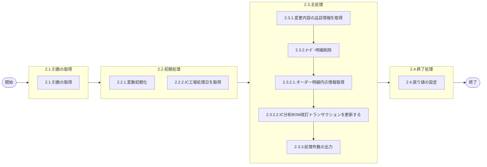

# 0. 表紙

| モジュール名 | プログラムID | プログラム名    |
| ------------ | ------------ | --------------- |
| IC           | LDPS0002     | MRP需要方針変更 |

| RFC | Version | 更新日     | 更新者 | 更新内容 | 確認日     | 確認者 | 承認日     | 承認者 |
| --- | :-----: | ---------- | :----: | -------- | ---------- | :----: | ---------- | :----: |
| -   |  1.0.0  | 2025/10/14 | 李鵬陽 | 初版作成 | 2025/XX/XX |  XXX  | 2025/XX/XX |  XXX  |

## 1. 処理概要

### 1.1. 機能概要

品目マスタのMRP需要方針コードが変更された時、MRP対象からハンド管理に変更された時、内示（オーダーステータス＝０）オーダを削除して、従属所要量も削除する。
※
オーダー明細が下記条件の①～④のいずれかを満たす場合は、なにもしない。
①
オーダー明細.オーダーステータスが‘０’以外である。
②
オーダー明細.MRP需要方針コードが‘１’である。
③
BOM改訂トランザクションとオーダー明細のMRP需要方針コードが同じである。
④
BOM改訂トランザクションとオーダー明細のMRP需要方針コードが両方とも‘３’、‘４’、‘５’、‘６’である。

### 1.2. 処理概要フロー



### 1.3. プログラム入出力パラメータ

#### 1.3.1. 引数

| No. | パラメータ論理名 | パラメータ物理名 | 属性 | 備考 |
| --- | ---------------- | ---------------- | ---- | ---- |
| 1   | （なし）         |                  |      |      |

#### 1.3.2. 戻り値

| No. | パラメータ論理名 | パラメータ物理名 | 属性    | 備考                                               |
| --- | ---------------- | ---------------- | ------- | -------------------------------------------------- |
| 1   | 処理ステータス   | rn_status        | INTEGER | 0:Normal-1:SqlError-2:ProgramError100:NotDataFound |
| 2   | SQLコード        | rs_sql_code      | VARCHAR |                                                    |
| 3   | エラーコード     | rs_err_code      | VARCHAR |                                                    |
| 4   | エラーメッセージ | rs_err_msg       | VARCHAR |                                                    |
| 5   | エラー位置       | rs_err_focus     | VARCHAR |                                                    |

### 1.4. その他制御・要件

| 排他制御 |      |      |
| -------- | ---- | ---- |
| 楽観     | 悲観 | 無し |
| -        | ●   | -    |

| 項目               | 制約・制御・要件など                | 記載内容説明                                         |
| ------------------ | ----------------------------------- | ---------------------------------------------------- |
| パフォーマンス要件 | BOMの夜間主処理が終了後に実施する。 | オーダー明細等のメンテ中に他からのアクセスが無い事。 |

### 1.5. 入出力一覧

| No | 入出力対象 | 名称                          | 物理名称              | C | R  | U  | D | 備考 |
| -- | ---------- | ----------------------------- | --------------------- | - | -- | -- | - | ---- |
| 1  | テーブル   | IC分析BOM改訂トランザクション | ld_trn_derev_trn      | - | ○ | ○ | - |      |
| 2  | テーブル   | オーダー明細内示              | le_trn_order_forecast | - | ○ | -  | - |      |
| 3  | 共通関数   | オーダー明細削除              | LDAS0414              |   |    |    |   |      |

## 2. 詳細処理

### 2.1. 引数の取得とチェック

### 2.2. 初期処理

#### 2.2.1. 変数初期化

利用する変数を初期化する。

| No. | 変数論理名                              | 初期化設定値 |
| :-: | --------------------------------------- | ------------ |
|  1  | 変数.親品目番号                         | スペース     |
|  2  | 変数.親供給者                           | スペース     |
|  3  | 変数.親使用者                           | スペース     |
|  4  | 変数.構成連番                           | スペース     |
|  5  | 変数.子品目番号                         | スペース     |
|  6  | 変数.子供給者                           | スペース     |
|  7  | 変数.子使用者                           | スペース     |
|  8  | 変数.メッセージコード                   | スペース     |
|  9  | 変数.メンテ日時                           | null         |
| 10 | 変数.MRP需要方針コード                  | スペース     |
| 11 | 変数.オーダー明細内示_オーダー番号      | スペース     |
| 12 | 変数.オーダー明細内示_払出日            | スペース     |
| 13 | 変数.オーダー明細内示_MRP需要方針コード | スペース     |
| 14 | 変数.処理ステータス                     | 0            |
| 15 | 変数.SQLコード                          | スペース     |
| 16 | 変数.エラーコード                       | スペース     |
| 17 | 変数.エラーメッセージ                   | スペース     |
| 18 | 変数.エラー位置                         | スペース     |
| 19 | 変数.IC分析BOM改訂カウント              | 0            |
| 20 | 変数.オーダー明細カウント               | 0            |
| 21 | 変数.オーダー明細削除カウント           | 0            |

### 2.3. 主処理

#### 2.3.1. 変更内容の品目情報を取得

IC分析BOM改訂トランザクションを検索する

```sql
SELECT  親品目番号
       ,親供給者 
       ,親使用者  
       ,構成連番 
       ,子品目番号  
       ,子供給者 
       ,子使用者  
       ,メッセージコード 
       ,メンテ日時 
       ,MRP需要方針コード
  INTO  変数.親品目番号
       ,変数.親供給者 
       ,変数.親使用者  
       ,変数.構成連番 
       ,変数.子品目番号  
       ,変数.子供給者 
       ,変数.子使用者  
       ,変数.メッセージコード 
       ,変数.メンテ日時 
       ,変数.MRP需要方針コード
  FROM IC分析BOM改訂トランザクション  
 WHERE IC処理済サイン = '0'  ※未処理
   AND メッセージコード = '100'(MRP需要方針変更)  
  
```

#### 2.3.2. ｵｰﾀﾞｰ明細削除

2.3.1.で取得したデータをループ処理する

ループ START
  変数.IC分析BOM改訂カウント  = 変数.IC分析BOM改訂カウント + 1

##### 2.3.2.1. オーダー明細内示情報取得

  オーダー明細内示を検索する

```sql
SELECT  オーダー番号 
       ,払出日 
       ,MRP需要方針コード 
  INTO  変数.オーダー明細内示_オーダー番号 
       ,変数.オーダー明細内示_払出日 
       ,変数.オーダー明細内示_MRP需要方針コード 
  FROM オーダー明細内示
 WHERE 品目番号    = 変数.親品目番号
   AND 供給者      = 変数.親供給者 
   AND 使用者      = 変数.親使用者  
   AND オーダーステータス = '0'
  
```

    取得したデータをループ処理する
    ループ START
        変数.オーダー明細カウント   = 変数.オーダー明細カウント + 1

    削除条件の判定
        変数.オーダー明細内示_MRP需要方針コード = '1'
        または  変数.オーダー明細内示_MRP需要方針コード　＝　 変数.MRP需要方針コード
        または  (変数.オーダー明細内示_MRP需要方針コード IN　('3','4','5','6')　かつ　変数.MRP需要方針コード IN　('3','4','5','6') ) の場合
        次のループ を継続
    それ以外の場合
        変数.オーダー明細削除カウント   = 変数.オーダー明細削除カウント + 1
        CALL SP LDAS0414 オーダー明細削除

```sql
SELECT
    処理ステータス,
    SQLコード,
    エラーコード,
    エラーメッセージ,
    エラー位置
  INTO
    変数.処理ステータス,
    変数.SQLコード,
    変数.エラーコード,
    変数.エラーメッセージ,
    変数.エラー位置
  FROM
   LDAS0414(
        変数.親品目番号
       ,変数.親供給者
       ,変数.親使用者
       ,変数.オーダー明細内示_オーダー番号 
       ,NULL
       ,'IC_REV'
       ,''
       ,''
       ,''
)
```

    変数.処理ステータス <> 0  の場合、エラーメッセージを出力し処理終了
            - エラーコード：'ld.E.LDP10159'
            - エラーメッセージ：'le_trn_order_forecast' || '<<SP:LDAS0414 Error Return>>' ||'Return: '|| 変数.処理ステータス || ','|| 変数.SQLコード || ','|| 変数.エラーコード || ','|| 変数.エラーメッセージ || ','|| 変数.エラー位置
    ループ END （2.3.2.1 のループ）

#### 2.3.2.2. IC分析BOM改訂トランザクションを更新する

IC分析BOM改訂トランザクションを更新する

```sql
UPDATE IC分析BOM改訂トランザクション
   SET IC処理済サイン = '1',
       更新者         = プログラムID,
       更新カウンタ   = 更新カウンタ + 1,
       更新日時       = システム日付,
       更新PGMID      = プログラムID
 WHERE IC処理済サイン  = '0'
　 AND 親品目番号       = 変数.親品目番号
   AND 親供給者         = 変数.親供給者 
   AND 親使用者         = 変数.親使用者  
   AND 構成連番         = 変数.構成連番
   AND 子品目番号       = 変数.子品目番号
   AND 子供給者         = 変数.子供給者 
   AND 子使用者         = 変数.子使用者 
   AND メッセージコード  = 変数.メッセージコード 
   AND メンテ日時         = 変数.メンテ日時 
  
```

ループ END （2.3.2のループ）

#### 2.3.3. 処理件数の出力

データの処理件数をログに出力する
  IC分析BOM改訂トランザクションTBLから検索したﾚｺｰﾄﾞ件数、オーダー明細内示TBLから検索したﾚｺｰﾄﾞ件数、オーダー明細内示TBLから削除したﾚｺｰﾄﾞ件数 を出力 :
    '<ld_trn_derev_trn> Read Count  = ' || 変数.IC分析BOM改訂カウント ||
    '<le_trn_order_forecast> Read Count   = ' || 変数.オーダー明細カウント ||
    '........................................ Delete Count = ' || 変数.オーダー明細削除カウント

### 2.4. 終了処理

戻り値に設定する。

| 戻り値論理名     | 設定値   |
| ---------------- | -------- |
| 処理ステータス   | 0        |
| SQL コード       | スペース |
| エラーコード     | スペース |
| エラーメッセージ | スペース |
| エラー位置       | スペース |

## 3. 補足説明

### 3.1. 戻り値について

**ステータスについて**

- 0 : Normal（正常終了）
- 100 : Not Data Found（データなし）
- -1 : Sql Error（SQLエラー）
- -2 : Program Error（プログラムエラー）

### 3.2. エラー発生時の対応について

### 3.2.1. 業務例外処理

引数チェック等でプログラムエラーが発生した場合：

| 戻り値           | 設定値         |
| ---------------- | -------------- |
| 処理ステータス   | -2             |
| SQLコード        | スペース       |
| エラーコード     | エラーコード値 |
| エラーメッセージ | エラー内容     |
| エラー位置       | 'LDPS0002'     |
| その他項目       | 初期値         |

### 3.2.2. その他例外処理

データベースアクセス時にSQLエラーが発生した場合：

| 戻り値           | 設定値     |
| ---------------- | ---------- |
| 処理ステータス   | -1         |
| SQLコード        | SQLSTATE   |
| エラーコード     | スペース   |
| エラーメッセージ | SQLERRM    |
| エラー位置       | 'LDPS0002' |
| その他項目       | 初期値     |
