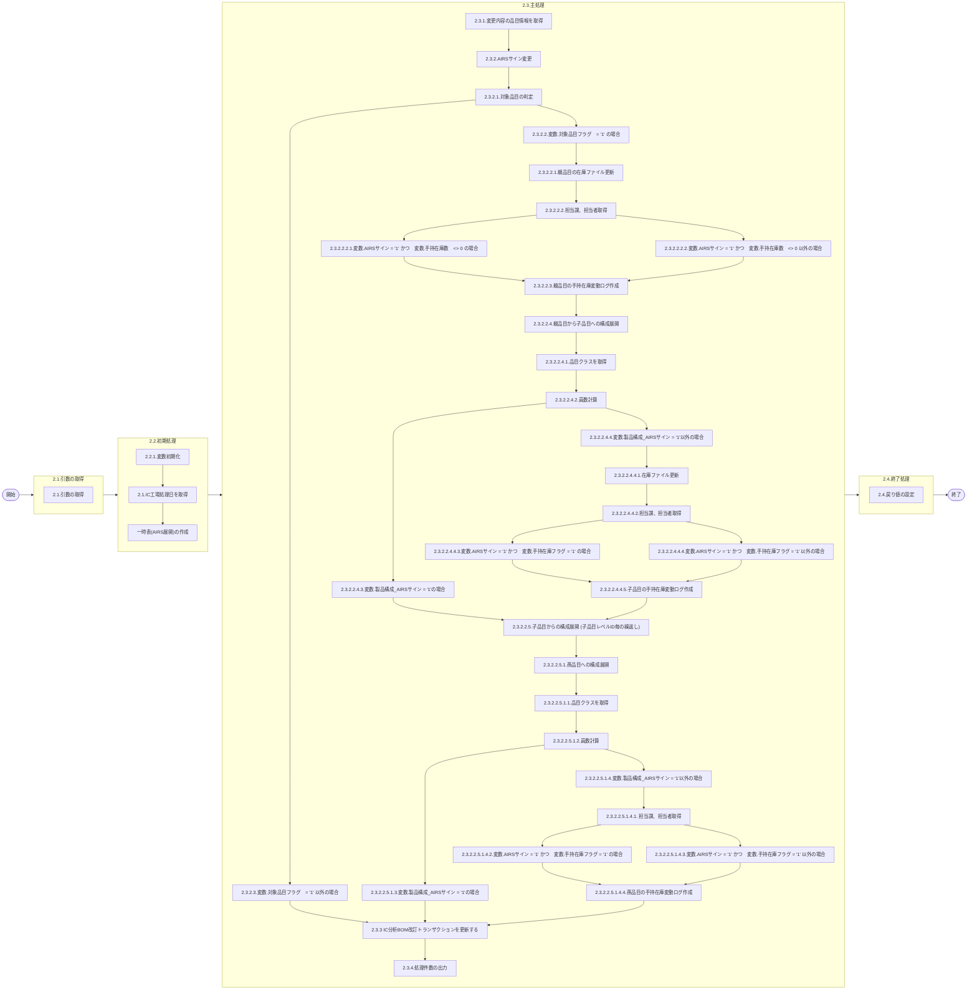

# 0. 表紙

| モジュール名 | プログラムID | プログラム名 | 登録日時 | 確認者   | 承認日     | 承認者 |            |    |
| ------------ | :----------: | ------------ | :------: | -------- | ---------- | :----: | ---------- | :-: |
| -            |    1.0.0    | 2025/10/27   |  李鵬陽  | 初版作成 | 2025/XX/XX |  XXX  | 2025/XX/XX | XXX |

## 1. 処理概要

### 1.1. 機能概要

品目マスタの自動完成サインが自動完成に変更されて、かつ手持在庫数がある時
AIRSに変更された品目の手持在庫数を子部品展開して子品目に移す。

### 1.2. 処理概要フロー



### 1.3. プログラム入出力パラメータ

#### 1.3.1. 引数

| No. | パラメータ論理名 | パラメータ物理名 | 属性 | 備考 |
| --- | ---------------- | ---------------- | ---- | ---- |
| 1   | （なし）         |                  |      |      |

#### 1.3.2. 戻り値

| No. | パラメータ論理名 | パラメータ物理名 | 属性    | 備考                                               |
| --- | ---------------- | ---------------- | ------- | -------------------------------------------------- |
| 1   | 処理ステータス   | rn_status        | INTEGER | 0:Normal-1:SqlError-2:ProgramError100:NotDataFound |
| 2   | SQLコード        | rs_sql_code      | VARCHAR |                                                    |
| 3   | エラーコード     | rs_err_code      | VARCHAR |                                                    |
| 4   | エラーメッセージ | rs_err_msg       | VARCHAR |                                                    |
| 5   | エラー位置       | rs_err_focus     | VARCHAR |                                                    |
| 6   | メッセージ       | rs_msg           | VARCHAR |                                                    |

### 1.4. その他制御・要件

| 排他制御 |      |      |
| -------- | ---- | ---- |
| 楽観     | 悲観 | 無し |
| -        | ●   | -    |

| 項目               | 制約・制御・要件など                | 記載内容説明                                       |
| ------------------ | ----------------------------------- | -------------------------------------------------- |
| パフォーマンス要件 | BOMの夜間主処理が終了後に実施する。 | 在庫ファイルのメンテ中に他からのアクセスが無い事。 |

### 1.5. 入出力一覧

| No | 入出力対象 | 名称                          | 物理名称               | C  | R  | U  | D | 備考 |
| -- | ---------- | ----------------------------- | ---------------------- | -- | -- | -- | - | ---- |
| 1  | テーブル   | IC分析BOM改訂トランザクション | ld_trn_derev_trn       | -  | ○ | ○ | - |      |
| 2  | テーブル   | IC工場処理日                  | ld_mst_slip_date       | -  | -  | ○ | - |      |
| 3  | テーブル   | 製品構成                      | la_prodstrc            | -  | ○ | -  | - |      |
| 4  | テーブル   | 手持在庫変動ログ              | ld_trn_fluct_log       | ○ | -  | -  | - |      |
| 5  | テーブル   | 在庫ファイル                  | ld_trn_inv             | -  | -  | ○ | - |      |
| 6  | テーブル   | GIMACエリアマスタ             | la_area_master         | -  | ○ | -  | - |      |
| 7  | テーブル   | SUマスタ                      | la_area_master_su      | -  | ○ | -  | - |      |
| 8  | テーブル   | MRP情報値                     | le_mst_mrp_information | -  | ○ | -  | - |      |
| 9  | テーブル   | 品目マスター                  | la_itemmast            | -  | ○ | -  | - |      |

## 2. 詳細処理

### 2.1. 引数の取得

### 2.2. 初期処理

#### 2.2.1. 変数初期化

利用する変数を初期化する。

| No. | 変数論理名 | 初期化設定値 |
| :-: | ---------- | ------------ |
|  1  |            |              |

    根据我对markdown文件的分析，以下是从文档中提取的所有变量整理成的表格，您可以直接复制使用：

| No. | 変数論理名                                  | 初期化設定値 |
| :-: | ------------------------------------------- | ------------ |
|  1  | 変数.IC工場処理日                           | スペース     |
|  2  | 変数.BOM改訂トランザクション_親品目番号     | スペース     |
|  3  | 変数.BOM改訂トランザクション_親供給者       | スペース     |
|  4  | 変数.BOM改訂トランザクション_親使用者       | スペース     |
|  5  | 変数.BOM改訂トランザクション_構成連番       | スペース     |
|  6  | 変数.BOM改訂トランザクション_子品目番号     | スペース     |
|  7  | 変数.BOM改訂トランザクション_子供給者       | スペース     |
|  8  | 変数.BOM改訂トランザクション_子使用者       | スペース     |
|  9  | 変数.BOM改訂トランザクション_メッセージコー | スペース     |
| 10 | 変数.BOM改訂トランザクション_メンテ日時     | スペース     |
| 11 | 変数.BOM改訂トランザクション_構成品サイン   | スペース     |
| 12 | 変数.BOM改訂トランザクション_員数           | 0            |
| 13 | 変数.BOM改訂トランザクション_OP率           | 0            |
| 14 | 変数.BOM改訂カウンタ                        | 0            |
| 15 | 変数.手持在庫数                             | 0            |
| 16 | 変数.子手持在庫数                           | 0            |
| 17 | 変数.AIRSサイン                             | スペース     |
| 18 | 変数.対象品目フラグ                         | スペース     |
| 19 | 変数.処理ステータス                         | 0            |
| 20 | 変数.SQLコード                              | スペース     |
| 21 | 変数.エラーコード                           | スペース     |
| 22 | 変数.エラーメッセージ                       | スペース     |
| 23 | 変数.エラー位置                             | スペース     |
| 24 | 変数.在庫更新カウンタ                       | 0            |
| 25 | 変数.担当課                                 | スペース     |
| 26 | 変数.担当者                                 | スペース     |
| 27 | 変数.手持在庫フラグ                         | '0'          |
| 28 | 変数.品目タイプ                             | スペース     |
| 29 | 変数.手持在庫変動ログカウンタ               | 0            |
| 30 | 変数.メンテ日時                             | システム日時 |
| 31 | 変数.製品構成_構成連番                      | スペース     |
| 32 | 変数.製品構成_子品目番号                    | スペース     |
| 33 | 変数.製品構成_子供給者                      | スペース     |
| 34 | 変数.製品構成_子使用者                      | スペース     |
| 35 | 変数.製品構成_構成品サイン                  | スペース     |
| 36 | 変数.製品構成_員数                          | 0            |
| 37 | 変数.製品構成_OP率                          | 0            |
| 38 | 変数.製品構成_AIRSサイン                    | スペース     |
| 39 | 変数.製品構成カウンタ                       | 0            |
| 40 | 変数.品目クラス                             | スペース     |
| 41 | 変数.移動在庫数                             | 0            |
| 42 | 変数.子品目レベルID                         | 0            |
| 43 | 変数.一時表追加カウンタ                     | 0            |
| 44 | 変数.一時品目番号                           | スペース     |
| 45 | 変数.一時供給者                             | スペース     |
| 46 | 変数.一時使用者                             | スペース     |
| 47 | 変数.一時移動在庫数                          | 0     |
| 48 | 変数.メッセージ                             | スペース     |

#### 2.2.2. IC工場処理日を取得

工場処理日を検索する

```sql
    SELECT ic_slip_date           -- IC工場処理日
      FROM ld_mst_slip_date       -- IC工場処理日
     WHERE operation_type = 'STD'
```

- データが存在しない場合、エラーメッセージを出力し処理終了
  - エラーコード：'ld.E.LDP10004'
  - エラーメッセージ：'The IC pymac date is not exist.'

#### 2.2.3. 一時表(AIRS展開)の作成

一時表(AIRS展開)を作成

```sql
CREATE temp TABLE ic_LDPS0003_tmp
(子品目レベルID	INTEGER,
 品目番号		CHAR(14),
 供給者	        CHAR(4),
 使用者		    CHAR(4),
 移動在庫数	    INTEGER)
WITH NO LOG;
```

### 2.3. 主処理

#### 2.3.1. 変更内容の品目情報を取得

IC分析BOM改訂トランザクションを検索する

```sql
SELECT  親品目番号
       ,親供給者 
       ,親使用者  
       ,構成連番 
       ,子品目番号  
       ,子供給者 
       ,子使用者  
       ,メッセージコード 
       ,メンテ日時
       ,構成品サイン
       ,員数
       ,OP率
  into  変数.BOM改訂トランザクション_親品目番号
       ,変数.BOM改訂トランザクション_親供給者 
       ,変数.BOM改訂トランザクション_親使用者  
       ,変数.BOM改訂トランザクション_構成連番 
       ,変数.BOM改訂トランザクション_子品目番号  
       ,変数.BOM改訂トランザクション_子供給者 
       ,変数.BOM改訂トランザクション_子使用者  
       ,変数.BOM改訂トランザクション_メッセージコード 
       ,変数.BOM改訂トランザクション_メンテ日時 
       ,変数.BOM改訂トランザクション_構成品サイン
       ,変数.BOM改訂トランザクション_員数
       ,変数.BOM改訂トランザクション_OP率
FROM  IC分析BOM改訂トランザクション
WHERE IC処理済サイン = '0'  ※未処理
  AND メッセージコード = '110'  ※'110'(AIRSサイン変更) 
```

#### 2.3.2. AIRSサイン変更

2.3.1.で取得したデータをループ処理する

ループ START

    変数.BOM改訂カウンタ   = 変数.BOM改訂カウンタ + 1;

##### 2.3.2.1 対象品目の判定

    在庫ファイルを検索する

```sql
SELECT   a.手持在庫数
        ,b.AIRSサイン
  into   変数.手持在庫数
        ,変数.AIRSサイン
FROM 在庫ファイル a
  INNER JOIN MRP情報値 b 
    ON a.品目番号    = b.親品目番号
       a.供給者      = b.親供給者 
       a.使用者      = b.親使用者
WHERE   a.品目番号    = 変数.BOM改訂トランザクション_親品目番号
    AND a.供給者      = 変数.BOM改訂トランザクション_親供給者 
    AND a.使用者      = 変数.BOM改訂トランザクション_親使用者
    AND a.手持在庫数 <> 0 
    AND b.AIRSサイン = '1' 
  
  
```

    データが存在するの場合
        変数.対象品目フラグ　= '1'
    データが存在しない場合
        変数.対象品目フラグ　= '0'

##### 2.3.2.2. 変数.対象品目フラグ　= '1' の場合

###### 2.3.2.2.1.  親品目の在庫ファイル更新

        CALL SP LDAS0431 在庫ファイル更新

```sql
SELECT
    処理ステータス
    ,SQLコード
    ,エラーコード
    ,エラーメッセージ
    ,エラー位置
    ,手持在庫数
INTO
    変数.処理ステータス,
    ,変数.SQLコード,
    ,変数.エラーコード,
    ,変数.エラーメッセージ,
    ,変数.エラー位置,
    ,変数.子手持在庫数
FROM
   LDAS0431(
        'IC_REV',
        ,変数.BOM改訂トランザクション_親品目番号
        ,変数.BOM改訂トランザクション_親供給者
        ,変数.BOM改訂トランザクション_親使用者
        ,変数.手持在庫数
        ,'2'
        ,null
        ,null
        ,null
        ,null
        ,null
        ,null
        ,null
        ,null
        ,null   
        ,null   
        ,null
        ,null
        ,null
)
```

        変数.在庫更新カウンタ = 変数.在庫更新カウンタ + 1
        変数.処理ステータス <> 0  の場合、エラーメッセージを出力し処理終了
            - エラーコード：'E.LDXXXXXX'
            - エラーメッセージ：'<<SP:LDAS0431 Error Return>>' || 'Return:' || 変数.処理ステータス || ','|| 変数.SQLコード || ','|| 変数.エラーコード || ','|| 変数.エラーメッセージ || ','|| 変数.エラー位置

###### 2.3.2.2.2. 担当課、担当者取得

```sql
    SELECT b.担当課   
          ,b.担当者
      INTO 変数.担当課
          ,変数.担当者
    FROM SUマスタ a
      INNER JOIN GIMACエリアマスタ b
        ON a.エリアコード = b.エリアコード
    WHERE a.SUコード = 変数.BOM改訂トランザクション_親使用者
```

        データが存在しない場合
            変数.担当課  = ' '
            変数.担当者　= ' '

###### 2.3.2.2.2.1. 変数.AIRSサイン = '1' かつ　変数.手持在庫数　<> 0 の場合

            変数.手持在庫フラグ　= '1'

            品目マスター　を検索する

```sql
    SELECT 品目タイプ
      INTO 変数.品目タイプ
      FROM 品目マスター 
     WHERE 品目番号    = 変数.BOM改訂トランザクション_親品目番号
           供給者      = 変数.BOM改訂トランザクション_親供給者
           使用者      = 変数.BOM改訂トランザクション_親使用者
```

            データが存在しない場合
                    変数.品目タイプ = ' '

            CALL SP LDAS0429 在庫取引明細登録IF

```sql
SELECT
    処理ステータス
    ,SQLコード
    ,エラーコード
    ,エラーメッセージ
    ,エラー位置
INTO
    変数.処理ステータス
    ,変数.SQLコード
    ,変数.エラーコード
    ,変数.エラーメッセージ
    ,変数.エラー位置
FROM
   LDAS0429(
            ,' '                         --TP処理番号
            ,' '                         --TP処理明細番号
            ,' '                         --TP処理枝番
            ,変数.IC工場処理日            --IC工場処理日
            ,変数.BOM改訂トランザクション_親品目番号 --品目番号
            ,変数.BOM改訂トランザクション_親供給者   --供給者
            ,変数.BOM改訂トランザクション_親使用者   --使用者
            ,変数.IC工場処理日             --IC更新日時
            ,'64'                         --内部トランザクションコード
            ,'0'                          --ソースコード
            ,'00'                        --処理コード
            ,'LD78'                      --入力処理識別
            ,'2'                         --入力変更区分
            ,'0'                         --IA処理済サイン
            ,'0'                         --受領データ作成済サイン
            ,変数.IC工場処理日            --起票日
            ,0                           --入庫数
            ,変数.手持在庫数              --出庫数
            ,0                           --手持在庫数
            ,変数.担当課                  --担当課
            ,変数.担当者                  --担当者
            ,変数.品目タイプ              --品目タイプ
            ,'1'                         --AIRSサイン
            ,' '                          --オーダー番号
            ,0                            --オーダー／所要数
            ,' '                         --納入日
            ,' '                         --親品目番号
            ,' '                         --親供給者
            ,' '                         --親使用者
            ,' '                         --独立需要送り先区分
            ,' '                         --独立需要送り先コード
            ,' '                         --生試初品区分
            ,' '                         --フリーコメント
            ,' '                         --相手先システム識別
            ,' '                         --費用振替先区分
            ,' '                         --費用振替先コード
            ,' '                         --勘定科目コード
            ,' '                         --目的No
            ,' '                         --受払種別コード
            ,' '                         --振替理由コード
            ,変数.BOM改訂トランザクション_親品目番号   --入力品目番号
            ,変数.BOM改訂トランザクション_親供給者     --入力供給者
            ,変数.BOM改訂トランザクション_親使用者     --入力使用者
            ,' '                         --入力オーダ番号
            ,' '                         --入力カード識別
            ,' '                         --入力ベンダーコード
            ,' '                         --入力照合番号
            ,' '                         --入力数量
            ,' '                         --入力理由コード
            ,' '                         --入力責任工程
            ,' '                         --入力責任職場／メーカー区分
            ,' '                         --入力責任職場／メーカー
            ,' '                         --入力組立ライン
            ,' '                         --入力組立順序番号
            ,' '                         --入力金額
            ,' '                         --入力移動先使用者
            ,' '                         --入力費用振替先区分
            ,' '                         --入力費用振替先コード
            ,' '                         --入力勘定科目コード
            ,' '                         --入力目的No
            ,' '                         --入力受払種別コード
            ,' '                         --入力仕掛サイン
            ,' '                         --インボイスNo
            ,' '                         --B/L No
            ,' '                         --ケースマークオーダ番号
            ,' '                         --ケースNo
            ,' '                         --登録者名称
            ,' '                         --G-SDMオーダー番号
            ,' '                         --外売品フラグ
            ,' '                         --HU-ID
            ,' '                         --工程番号
            ,' '                         --原価用品目番号
            ,' '                         --原価用供給者
            ,' '                         --原価用使用者
            ,' '                         --原価用オーダー番号
)
```

            変数.処理ステータス <> 0  の場合、エラーメッセージを出力し処理終了
                 - エラーコード：'E.LDXXXXXX'
                 - エラーメッセージ：'<<SP:LDAS0429 Error Return>>' ||'Return: '|| 変数.処理ステータス || ','|| 変数.SQLコード || ','||  数.エラーコード || ','|| 変数.エラーメッセージ || ','|| 変数.エラー位置
        場合END(2.3.2.2.2.1. の場合)
###### 2.3.2.2.2.2. 変数.AIRSサイン = '1' かつ　変数.手持在庫数　<> 0 以外の場合

            変数.手持在庫フラグ　= '0'
        場合END(2.3.2.2.2.2. の場合)
###### 2.3.2.2.3.親品目の手持在庫変動ログ作成

```sql
INSERT INTO 手持在庫変動ログ(
    IC工場処理日
    ,品目番号
    ,使用者
    ,供給者
    ,担当課
    ,担当者
    ,メンテ日時
    ,リスト出力フラグ
    ,親品目番号
    ,親供給者
    ,親使用者
    ,更新前手持在庫数
    ,変動数
    ,更新後手持在庫数
    ,更新カウンタ
    ,登録日時
    ,登録者
    ,登録PGID
    ,更新日時
    ,更新者
    ,更新PGID
)
VALUES(
    変数.IC工場処理日
    ,変数.BOM改訂トランザクション_親品目番号
    ,変数.BOM改訂トランザクション_親使用者
    ,変数.BOM改訂トランザクション_親供給者
    ,変数.担当課
    ,変数.担当者
    ,変数.メンテ日時
    ,'0'
    ,' '
    ,' '
    ,' '
    ,変数.手持在庫数
    ,変数.手持在庫数 * -1
    ,0
    ,0
    ,変数.登録日時
    ,'LDPS0003'
    ,'LDPS0003'
    ,変数.登録日時
    ,'LDPS0003'
    ,'LDPS0003'
)
```

        変数.手持在庫変動ログカウンタ = 変数.手持在庫変動ログカウンタ + 1

###### 2.3.2.2.4. 親品目から子品目への構成展開

        製品構成を検索する

```sql
SELECT   a.構成連番
        ,a.子品目番号
        ,a.子供給者
        ,a.子使用者
        ,a.構成品サイン
        ,a.員数
        ,a.OP率
        ,b.AIRSサイン
  into   変数.製品構成_構成連番
        ,変数.製品構成_子品目番号
        ,変数.製品構成_子供給者
        ,変数.製品構成_子使用者
        ,変数.製品構成_構成品サイン
        ,変数.製品構成_員数
        ,変数.製品構成_OP率
        ,変数.製品構成_AIRSサイン
FROM 製品構成 a
  INNER JOIN MRP情報値 b 
    ON a.子品目番号    = b.品目番号
       a.子供給者      = b.供給者 
       a.子使用者      = b.使用者
WHERE   a.親品目番号    = 変数.BOM改訂トランザクション_親品目番号
    AND a.親供給者      = 変数.BOM改訂トランザクション_親供給者 
    AND a.親使用者      = 変数.BOM改訂トランザクション_親使用者
    AND IN発効日 <= 変数.IC工場処理日
    AND OUT発効日 > 変数.IC工場処理日
    AND b.所要量出庫管理コード = '00'
```

        取得したデータをループ処理する

        ループ START
            変数.製品構成カウンタ = 変数.製品構成カウンタ + 1

###### 2.3.2.2.4.1. 品目クラスを取得

            品目クラスを検索する

```sql
SELECT
       品目クラス
  INTO
       変数.品目クラス
  FROM 品目マスター
 WHERE 品目番号    = 変数.製品構成_子品目番号
   AND 供給者      = 変数.製品構成_子供給者 
   AND 使用者      = 変数.製品構成_子使用者  
```

            データが存在しないの場合、エラーメッセージを出力し処理終了
                - エラーコード：'ld.E.LDP10726'  
                - エラーメッセージ：'Data does not exist in the item master.'

##### 2.3.2.2.4.2. 員数計算

            CALL sp 員数計算

```sql
SELECT
    処理ステータス,
    SQLコード,
    エラーコード,
    エラーメッセージ,
    エラー位置,
    計算数量
  INTO
    変数.処理ステータス,
    変数.SQLコード,
    変数.エラーコード,
    変数.エラーメッセージ,
    変数.エラー位置,
    変数.移動在庫数
  FROM
    LDYS0002( 変数.手持在庫数
        ,変数.製品構成_構成品サイン
        ,変数.製品構成_員数
        ,変数.製品構成_OP率
        ,変数.品目クラス
    )
```

            変数.処理ステータス <> 0 の場合、エラーメッセージを出力し処理終了
                - エラーコード：'E.LDXXXXXX'  確認待ち
                - エラーメッセージ：'<<SP:LDYS0002 Error Return>>' ||'Return: '|| 変数.処理ステータス || ','|| 変数.SQLコード || ','|| 変数.エラーコード || ','|| 変数.エラーメッセージ || ','|| 変数.エラー位置

##### 2.3.2.2.4.3.変数.製品構成_AIRSサイン = '1'の場合

                一時表(AIRS展開) の追加

```sql
INSERT INTO 一時表(AIRS展開)(
        子品目レベルID
       ,品目番号
       ,供給者,
       ,使用者,
       ,移動在庫数	   
)VALUES(
        変数.子品目レベルID + 1
       ,変数.製品構成_子品目番号
       ,変数.製品構成_子供給者
       ,変数.製品構成_子使用者
       ,変数.移動在庫数
)
```

                変数.一時表追加カウンタ = 変数.一時表追加カウンタ + 1
            場合END(2.3.2.2.4.3.の場合)

###### 2.3.2.2.4.4.変数.製品構成_AIRSサイン = '1'以外の場合

###### 2.3.2.2.4.4.1.在庫ファイル更新

                CALL SP LDAS0431 在庫ファイル更新

```sql
SELECT
    処理ステータス,
    SQLコード,
    エラーコード,
    エラーメッセージ,
    エラー位置,
    手持在庫数
INTO
    変数.処理ステータス,
    変数.SQLコード,
    変数.エラーコード,
    変数.エラーメッセージ,
    変数.エラー位置,
    変数.子手持在庫数
FROM
   LDAS0431(
        'IC_REV',
        変数.製品構成_子品目番号,
        変数.製品構成_子供給者,
        変数.製品構成_子使用者,
        変数.移動在庫数,
        '1',
        null,
        null,
        null,
        null,
        null,
        null,
        null,
        null,
        null,   
        null,   
        null,
        null,
        null
)
```

                変数.在庫更新カウンタ = 変数.在庫更新カウンタ + 1

                変数.処理ステータス <> 0  の場合、エラーメッセージを出力し処理終了
                    - エラーコード：'E.LDXXXXXX'
                    - エラーメッセージ：'<<SP:LDAS0431 Error Return>>' ||'Return: '|| 変数.処理ステータス || ','|| 変数.SQLコード || ','|| 変数.エラーコード || ','|| 変数.エラーメッセージ || ','|| 変数.エラー位置

###### 2.3.2.2.4.4.2.担当課、担当者取得

```sql
    SELECT b.担当課   
          ,b.担当者
      INTO 変数.担当課
          ,変数.担当者
    FROM SUマスタ a
      INNER JOIN GIMACエリアマスタ b
        ON a.エリアコード = b.エリアコード
    WHERE a.SUコード = 変数.製品構成_子使用者
```

                データが存在しない場合
                    変数.担当課  = ' '
                    変数.担当者　= ' '

###### 2.3.2.2.4.4.3.変数.AIRSサイン = '1' かつ　変数.手持在庫フラグ = '1' の場合

                    品目マスター　を検索する

```sql
    SELECT 品目タイプ
      INTO 変数.品目タイプ
      FROM 品目マスター 
     WHERE 品目番号    = 変数.製品構成_子品目番号
           供給者      = 変数.製品構成_子供給者 
           使用者      = 変数.製品構成_子使用者  
```

                    データが存在しない場合
                        変数.品目タイプ = ' '

                    CALL SP LDAS0429 在庫取引明細登録IF

```sql
SELECT
    処理ステータス
    ,SQLコード
    ,エラーコード
    ,エラーメッセージ
    ,エラー位置
INTO
    変数.処理ステータス
    ,変数.SQLコード
    ,変数.エラーコード
    ,変数.エラーメッセージ
    ,変数.エラー位置
FROM
   LDAS0429(
            ,' '                         --TP処理番号
            ,' '                         --TP処理明細番号
            ,' '                         --TP処理枝番
            ,変数.IC工場処理日            --IC工場処理日
            ,変数.製品構成_子品目番号      --品目番号
            ,変数.製品構成_子供給者        --供給者
            ,変数.製品構成_子使用者        --使用者
            ,変数.IC工場処理日             --IC更新日時
            ,'63'                         --内部トランザクションコード
            ,'0'                          --ソースコード
            ,'00'                        --処理コード
            ,'LD78'                      --入力処理識別
            ,'2'                         --入力変更区分
            ,'0'                         --IA処理済サイン
            ,'0'                         --受領データ作成済サイン
            ,変数.IC工場処理日            --起票日
            ,0                           --入庫数
            ,変数.子手持在庫数              --出庫数
            ,0                           --手持在庫数
            ,変数.担当課                  --担当課
            ,変数.担当者                  --担当者
            ,変数.品目タイプ              --品目タイプ
            ,'1'                         --AIRSサイン
            ,' '                          --オーダー番号
            ,0                            --オーダー／所要数
            ,' '                         --納入日
            ,' '                         --親品目番号
            ,' '                         --親供給者
            ,' '                         --親使用者
            ,' '                         --独立需要送り先区分
            ,' '                         --独立需要送り先コード
            ,' '                         --生試初品区分
            ,' '                         --フリーコメント
            ,' '                         --相手先システム識別
            ,' '                         --費用振替先区分
            ,' '                         --費用振替先コード
            ,' '                         --勘定科目コード
            ,' '                         --目的No
            ,' '                         --受払種別コード
            ,' '                         --振替理由コード
            ,変数.製品構成_子品目番号      --入力品目番号
            ,変数.製品構成_子供給者        --入力供給者
            ,変数.製品構成_子使用者        --入力使用者
            ,' '                         --入力オーダ番号
            ,' '                         --入力カード識別
            ,' '                         --入力ベンダーコード
            ,' '                         --入力照合番号
            ,' '                         --入力数量
            ,' '                         --入力理由コード
            ,' '                         --入力責任工程
            ,' '                         --入力責任職場／メーカー区分
            ,' '                         --入力責任職場／メーカー
            ,' '                         --入力組立ライン
            ,' '                         --入力組立順序番号
            ,' '                         --入力金額
            ,' '                         --入力移動先使用者
            ,' '                         --入力費用振替先区分
            ,' '                         --入力費用振替先コード
            ,' '                         --入力勘定科目コード
            ,' '                         --入力目的No
            ,' '                         --入力受払種別コード
            ,' '                         --入力仕掛サイン
            ,' '                         --インボイスNo
            ,' '                         --B/L No
            ,' '                         --ケースマークオーダ番号
            ,' '                         --ケースNo
            ,' '                         --登録者名称
            ,' '                         --G-SDMオーダー番号
            ,' '                         --外売品フラグ
            ,' '                         --HU-ID
            ,' '                         --工程番号
            ,' '                         --原価用品目番号
            ,' '                         --原価用供給者
            ,' '                         --原価用使用者
            ,' '                         --原価用オーダー番号
)
```

                    変数.処理ステータス <> 0  の場合、エラーメッセージを出力し処理終了
                        - エラーコード：'E.LDXXXXXX'
                        - エラーメッセージ：'<<SP:LDAS0429 Error Return>>' ||'Return: '|| 変数.処理ステータス || ','|| 変数.SQLコード || ','|| 変数.エラーコード || ','|| 変数.エラーメッセージ || ','|| 変数.エラー位置
                場合 END(2.3.2.2.4.4.3.の場合)
###### 2.3.2.2.4.4.4.変数.AIRSサイン = '1' かつ　変数.手持在庫フラグ = '1' 以外の場合
                    do nothing
                場合END(2.3.2.2.4.4.4.の場合)
            場合END(2.3.2.2.4.4.の場合)
###### 2.3.2.2.4.4.5.子品目の手持在庫変動ログ作成

```sql
INSERT INTO 手持在庫変動ログ(
    IC工場処理日
    ,品目番号
    ,使用者
    ,供給者
    ,担当課
    ,担当者
    ,メンテ日時
    ,リスト出力フラグ
    ,親品目番号
    ,親供給者
    ,親使用者
    ,更新前手持在庫数
    ,変動数
    ,更新後手持在庫数
    ,更新カウンタ
    ,登録日時
    ,登録者
    ,登録PGID
    ,更新日時
    ,更新者
    ,更新PGID
)
VALUES(
    変数.IC工場処理日
    ,変数.製品構成_子品目番号
    ,変数.製品構成_子使用者
    ,変数.製品構成_子供給者
    ,変数.担当課
    ,変数.担当者
    ,変数.メンテ日時
    ,'0'
    ,変数.BOM改訂トランザクション_親品目番号
    ,変数.BOM改訂トランザクション_親供給者
    ,変数.BOM改訂トランザクション_親使用者
    ,変数.子手持在庫数 - 変数.移動在庫数
    ,変数.移動在庫数
    ,変数.子手持在庫数
    ,0
    ,変数.登録日時
    ,'LDPS0003'
    ,'LDPS0003'
    ,変数.登録日時
    ,'LDPS0003'
    ,'LDPS0003'
)
```

            変数.手持在庫変動ログカウンタ = 変数.手持在庫変動ログカウンタ + 1

        ループ END (2.3.2.2.4.のループ)

###### 2.3.2.2.5. 子品目からの構成展開 (子品目レベルID毎の繰返し)

        変数.子品目レベルID = 変数.子品目レベルID + 1;
        一時表(AIRS展開) を検索する

```sql
SELECT  品目番号
        ,供給者
        ,使用者
        ,移動在庫数
  INTO  変数.一時品目番号
        ,変数.一時供給者 
        ,変数.一時使用者
        ,変数.一時移動在庫数
  FROM  一時表(AIRS展開)
 WHERE  子品目レベルID = 変数.子品目レベルID
```

        一時表(AIRS展開)から取得したデータを順番に処理する
        ループ START (子品目レベルIDのループ)

            製品構成を検索する

```sql
SELECT   a.構成連番
        ,a.子品目番号
        ,a.子供給者
        ,a.子使用者
        ,a.構成品サイン
        ,a.員数
        ,a.OP率
        ,b.AIRSサイン
  into   変数.製品構成_構成連番
        ,変数.製品構成_子品目番号
        ,変数.製品構成_子供給者
        ,変数.製品構成_子使用者
        ,変数.製品構成_構成品サイン
        ,変数.製品構成_員数
        ,変数.製品構成_OP率
        ,変数.製品構成_AIRSサイン
FROM 製品構成 a
  INNER JOIN MRP情報値 b 
    ON a.子品目番号    = b.親品目番号
       a.子供給者      = b.親供給者 
       a.子使用者      = b.親使用者
WHERE   a.品目番号    = 変数.一時品目番号
    AND a.供給者      = 変数.一時供給者 
    AND a.使用者      = 変数.一時使用者
    AND IN発効日 <= 変数.IC工場処理日
    AND OUT発効日 > 変数.IC工場処理日
    AND b.所要量出庫管理コード = '00'
```

            取得したデータをループ処理する

###### 2.3.2.2.5.1. 孫品目への構成展開

            ループ START
                変数.製品構成カウンタ = 変数.製品構成カウンタ + 1

###### 2.3.2.2.5.1.1. 品目クラスを取得

                品目クラスを検索する

```sql
SELECT
       品目クラス
  INTO
       変数.品目クラス
  FROM 品目マスター
 WHERE 品目番号    = 変数.製品構成_子品目番号
   AND 供給者      = 変数.製品構成_子供給者 
   AND 使用者      = 変数.製品構成_子使用者  
```

                データが存在しないの場合、エラーメッセージを出力し処理終了
                    - エラーコード：'ld.E.LDP10726'  
                    - エラーメッセージ：'Data does not exist in the item master.'

###### 2.3.2.2.5.1.2. 員数計算

                CALL sp 員数計算

```sql
SELECT
    処理ステータス,
    SQLコード,
    エラーコード,
    エラーメッセージ,
    エラー位置,
    計算数量
  INTO
    変数.処理ステータス,
    変数.SQLコード,
    変数.エラーコード,
    変数.エラーメッセージ,
    変数.エラー位置,
    変数.移動在庫数
  FROM
    LDYS0002( 変数.一時移動在庫数
        ,変数.製品構成_構成品サイン
        ,変数.製品構成_員数
        ,変数.製品構成_OP率
        ,変数.品目クラス
    )
```

                変数.処理ステータス <> 0 の場合、エラーメッセージを出力し処理終了
                    - エラーコード：'E.LDXXXXXX'  確認待ち
                    - エラーメッセージ：'<<SP:LDYS0002 Error Return>>' ||'Return: '|| 変数.処理ステータス || ','|| 変数.SQLコード || ','|| 変数.エラーコード || ','|| 変数.エラーメッセージ || ','|| 変数.エラー位置

###### 2.3.2.2.5.1.3.変数.製品構成_AIRSサイン = '1'の場合

                    一時表(AIRS展開) の追加

```sql
INSERT INTO 一時表(AIRS展開)(
        子品目レベルID
       ,品目番号
       ,供給者,
       ,使用者,
       ,移動在庫数	   
)VALUES(
        変数.子品目レベルID + 1
       ,変数.製品構成_子品目番号
       ,変数.製品構成_子供給者
       ,変数.製品構成_子使用者
       ,変数.移動在庫数
)
```

                    変数.一時表追加カウンタ = 変数.一時表追加カウンタ + 1
                場合END(2.3.2.2.5.1.3.の場合)
###### 2.3.2.2.5.1.4.変数.製品構成_AIRSサイン = '1'以外の場合

                    CALL SP LDAS0431 在庫ファイル更新

```sql
SELECT
    処理ステータス,
    SQLコード,
    エラーコード,
    エラーメッセージ,
    エラー位置,
    手持在庫数
INTO
    変数.処理ステータス,
    変数.SQLコード,
    変数.エラーコード,
    変数.エラーメッセージ,
    変数.エラー位置,
    変数.子手持在庫数
FROM
   LDAS0431(
        'IC_REV',
        変数.製品構成_子品目番号,
        変数.製品構成_子供給者,
        変数.製品構成_子使用者,
        変数.移動在庫数,
        '1',
        null,
        null,
        null,
        null,
        null,
        null,
        null,
        null,
        null,   
        null,   
        null,
        null,
        null
)
```

                    変数.在庫更新カウンタ = 変数.在庫更新カウンタ + 1

                    変数.処理ステータス <> 0  の場合、エラーメッセージを出力し処理終了
                        - エラーコード：'E.LDXXXXXX'  確認待ち
                        - エラーメッセージ：'<<SP:LDAS0431 Error Return>>' ||'Return: '|| 変数.処理ステータス || ','|| 変数.SQLコード || ','|| 変数.エラーコード || ','|| 変数.エラーメッセージ || ','|| 変数.エラー位置

###### 2.3.2.2.5.1.4.1.担当課、担当者取得

```sql
    SELECT b.担当課   
          ,b.担当者
      INTO 変数.担当課
          ,変数.担当者
    FROM SUマスタ a
      INNER JOIN GIMACエリアマスタ b
        ON a.エリアコード = b.エリアコード
    WHERE a.SUコード = 変数.製品構成_子使用者
```

                    データが存在しない場合
                        変数.担当課  = ' '
                        変数.担当者　= ' '

###### 2.3.2.2.5.1.4.2.変数.AIRSサイン = '1' かつ　変数.手持在庫フラグ = '1' の場合

                        品目マスター　を検索する

```sql
    SELECT 品目タイプ
      INTO 変数.品目タイプ
      FROM 品目マスター 
     WHERE 品目番号    = 変数.製品構成_子品目番号
           供給者      = 変数.製品構成_子供給者 
           使用者      = 変数.製品構成_子使用者  
```

                        データが存在しない場合
                            変数.品目タイプ = ' '

                        CALL SP LDAS0429 在庫取引明細登録IF

```sql
SELECT
    処理ステータス
    ,SQLコード
    ,エラーコード
    ,エラーメッセージ
    ,エラー位置
INTO
    変数.処理ステータス
    ,変数.SQLコード
    ,変数.エラーコード
    ,変数.エラーメッセージ
    ,変数.エラー位置
FROM
   LDAS0429(
            ,' '                         --TP処理番号
            ,' '                         --TP処理明細番号
            ,' '                         --TP処理枝番
            ,変数.IC工場処理日            --IC工場処理日
            ,変数.製品構成_子品目番号      --品目番号
            ,変数.製品構成_子供給者        --供給者
            ,変数.製品構成_子使用者        --使用者
            ,変数.IC工場処理日             --IC更新日時
            ,'63'                         --内部トランザクションコード
            ,'0'                          --ソースコード
            ,'00'                        --処理コード
            ,'LD78'                      --入力処理識別
            ,'2'                         --入力変更区分
            ,'0'                         --IA処理済サイン
            ,'0'                         --受領データ作成済サイン
            ,変数.IC工場処理日            --起票日
            ,0                           --入庫数
            ,変数.子手持在庫数              --出庫数
            ,0                           --手持在庫数
            ,変数.担当課                  --担当課
            ,変数.担当者                  --担当者
            ,変数.品目タイプ              --品目タイプ
            ,'1'                         --AIRSサイン
            ,' '                          --オーダー番号
            ,0                            --オーダー／所要数
            ,' '                         --納入日
            ,' '                         --親品目番号
            ,' '                         --親供給者
            ,' '                         --親使用者
            ,' '                         --独立需要送り先区分
            ,' '                         --独立需要送り先コード
            ,' '                         --生試初品区分
            ,' '                         --フリーコメント
            ,' '                         --相手先システム識別
            ,' '                         --費用振替先区分
            ,' '                         --費用振替先コード
            ,' '                         --勘定科目コード
            ,' '                         --目的No
            ,' '                         --受払種別コード
            ,' '                         --振替理由コード
            ,変数.製品構成_子品目番号      --入力品目番号
            ,変数.製品構成_子供給者        --入力供給者
            ,変数.製品構成_子使用者        --入力使用者
            ,' '                         --入力オーダ番号
            ,' '                         --入力カード識別
            ,' '                         --入力ベンダーコード
            ,' '                         --入力照合番号
            ,' '                         --入力数量
            ,' '                         --入力理由コード
            ,' '                         --入力責任工程
            ,' '                         --入力責任職場／メーカー区分
            ,' '                         --入力責任職場／メーカー
            ,' '                         --入力組立ライン
            ,' '                         --入力組立順序番号
            ,' '                         --入力金額
            ,' '                         --入力移動先使用者
            ,' '                         --入力費用振替先区分
            ,' '                         --入力費用振替先コード
            ,' '                         --入力勘定科目コード
            ,' '                         --入力目的No
            ,' '                         --入力受払種別コード
            ,' '                         --入力仕掛サイン
            ,' '                         --インボイスNo
            ,' '                         --B/L No
            ,' '                         --ケースマークオーダ番号
            ,' '                         --ケースNo
            ,' '                         --登録者名称
            ,' '                         --G-SDMオーダー番号
            ,' '                         --外売品フラグ
            ,' '                         --HU-ID
            ,' '                         --工程番号
            ,' '                         --原価用品目番号
            ,' '                         --原価用供給者
            ,' '                         --原価用使用者
            ,' '                         --原価用オーダー番号
)
```

                        変数.処理ステータス <> 0  の場合、エラーメッセージを出力し処理終了
                            - エラーコード：'E.LDXXXXXX'  確認待ち
                            - エラーメッセージ：'<<SP:LDAS0429 Error Return>>' ||'Return: '|| 変数.処理ステータス || ','|| 変数.SQLコード || ','||      変数.エラーコード || ','|| 変数.エラーメッセージ || ','|| 変数.エラー位置
                    場合 END(2.3.2.2.5.1.4.2.の場合)

###### 2.3.2.2.5.1.4.3.変数.AIRSサイン = '1' かつ　変数.手持在庫フラグ = '1' 以外の場合
                    do nothing
                場合END(2.3.2.2.5.1.4.の場合)
###### 2.3.2.2.5.1.4.4.子品目の手持在庫変動ログ作成

```sql
INSERT INTO 手持在庫変動ログ(
    IC工場処理日
    ,品目番号
    ,使用者
    ,供給者
    ,担当課
    ,担当者
    ,メンテ日時
    ,リスト出力フラグ
    ,親品目番号
    ,親供給者
    ,親使用者
    ,更新前手持在庫数
    ,変動数
    ,更新後手持在庫数
    ,更新カウンタ
    ,登録日時
    ,登録者
    ,登録PGID
    ,更新日時
    ,更新者
    ,更新PGID
)
VALUES(
    変数.IC工場処理日
    ,変数.製品構成_子品目番号
    ,変数.製品構成_子使用者
    ,変数.製品構成_子供給者
    ,変数.担当課
    ,変数.担当者
    ,変数.メンテ日時
    ,'0'
    ,変数.BOM改訂トランザクション_親品目番号
    ,変数.BOM改訂トランザクション_親供給者
    ,変数.BOM改訂トランザクション_親使用者
    ,変数.子手持在庫数 - 変数.移動在庫数
    ,変数.移動在庫数
    ,変数.子手持在庫数
    ,0
    ,変数.登録日時
    ,'LDPS0003'
    ,'LDPS0003'
    ,変数.登録日時
    ,'LDPS0003'
    ,'LDPS0003'
)
```

                変数.手持在庫変動ログカウンタ = 変数.手持在庫変動ログカウンタ + 1

            ループ END (2.3.2.2.5.1.のループ)

            変数.子品目レベルID = 変数.子品目レベルID + 1

        ループ END (2.3.2.2.5.のループ)
    場合END(2.3.2.2.の場合)

##### 2.3.3 IC分析BOM改訂トランザクションを更新する

    IC分析BOM改訂トランザクションを更新する

```sql
UPDATE IC分析BOM改訂トランザクション
SET    IC処理済サイン = '1'
       ,メンテ日時 = システム日時  
       ,更新者 = プログラムID
       ,更新カウンタ = 更新カウンタ + 1
       ,更新日時 = システム日時
       ,更新PGMID = プログラムID
WHERE IC処理済サイン    = '0'
　 AND 親品目番号       = 変数.BOM改訂トランザクション_親品目番号
   AND 親供給者         = 変数.BOM改訂トランザクション_親供給者 
   AND 親使用者         = 変数.BOM改訂トランザクション_親使用者  
   AND 構成連番         = 変数.BOM改訂トランザクション_構成連番
   AND 子品目番号       = 変数.BOM改訂トランザクション_子品目番号
   AND 子供給者         = 変数.BOM改訂トランザクション_子供給者 
   AND 子使用者         = 変数.BOM改訂トランザクション_子使用者 
   AND メッセージコード  = 変数.BOM改訂トランザクション_メッセージコード 
   AND メンテ日時       = 変数.BOM改訂トランザクション_メンテ日時 
  
```

ループ END （2.3.2のループ）

#### 2.3.4. 処理件数の出力

データの処理件数をログに出力する
  IC分析BOM改訂トランザクションTBLから検索したﾚｺｰﾄﾞ件数、在庫更新処理件数、製品構成TBLから検索したﾚｺｰﾄﾞ件数、手持在庫変動ログ追加件数、一時表追加件数を出力 :
    変数.メッセージ = '<ld_trn_derev_trn> Read Count  = ' || 変数.BOM改訂カウンタ  ||',<ld_trn_inv> Update Count   = ' || 変数.在庫更新カウンタ || ',<la_prodstrc>   SEL:' || 変数.製品構成カウンタ || ',<ld_trn_fluct_log>   SEL:' || 変数.手持在庫変動ログカウンタ || ',<一時表(AIRS展開)>   SEL:' || 変数.一時表追加カウンタ

### 2.4. 終了処理

戻り値に設定する。

| 戻り値論理名     | 設定値          |
| ---------------- | --------------- |
| 処理ステータス   | 0               |
| SQL コード       | スペース        |
| エラーコード     | スペース        |
| エラーメッセージ | スペース        |
| エラー位置       | スペース        |
| メッセージ       | 変数.メッセージ |

## 3. 補足説明

### 3.1. 戻り値について

**ステータスについて**

- 0 : Normal（正常終了）
- -1 : Sql Error（SQLエラー）
- -2 : Program Error（プログラムエラー）

### 3.2. エラー発生時の対応について

### 3.2.1. 業務例外処理

引数チェック等でプログラムエラーが発生した場合：

| 戻り値           | 設定値         |
| ---------------- | -------------- |
| 処理ステータス   | -2             |
| SQLコード        | スペース       |
| エラーコード     | エラーコード値 |
| エラーメッセージ | エラー内容     |
| エラー位置       | 'LDPS0003'     |

### 3.2.2. その他例外処理

データベースアクセス時にSQLエラーが発生した場合：

| 戻り値           | 設定値     |
| ---------------- | ---------- |
| 処理ステータス   | -1         |
| SQLコード        | SQLSTATE   |
| エラーコード     | スペース   |
| エラーメッセージ | SQLERRM    |
| エラー位置       | 'LDPS0003' |
