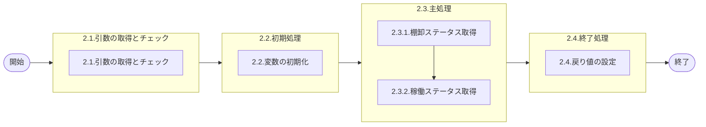

# 0. 表紙

| モジュール名 | プログラムID | プログラム名 |
| ------------ | ------------ | ------------ |
| IC           | LDYS0000     | 稼動状況確認 |

| RFC | Version | 更新日     | 更新者 | 更新内容 | 確認日     | 確認者 | 承認日     | 承認者 |
| --- | :-----: | ---------- | :----: | -------- | ---------- | :----: | ---------- | :----: |
| -   |  1.0.0  | 2025/09/09 | 李鵬陽 | 初版作成 | 2025/XX/XX |  XXX  | 2025/XX/XX |  XXX  |

## 1. 処理概要

### 1.1. 機能概要

稼動状況を確認する
補足
処理ステータス＝'U'であれば、更新日時+”より通常業務稼働中”のメッセージを返す
処理ステータス＝'X'であれば、更新日時+”よりシステム処理中”のメッセージを返す
処理ステータス＝'S'であれば、更新日時+”より一時機能制限中”のメッセージを返す
処理ステータス＝その他の場合、"STS判定不能！担当者に連絡してください。"のメッセージを返す

### 1.2. 処理概要フロー



### 1.3. プログラム入出力パラメータ

#### 1.3.1. 引数

| No. | パラメータ論理名 | パラメータ物理名 | 属性 | 備考 |
| --- | ---------------- | ---------------- | ---- | ---- |
| 1   | 無し             |                  |      |      |

#### 1.3.2. 戻り値

| No. | パラメータ論理名   | パラメータ物理名    | 属性    | 備考                               |
| --- | ------------------ | ------------------- | ------- | ---------------------------------- |
| 1   | 処理ステータス     | rn_status           | INTEGER | 0:NormalEnd,-1:SQLError/-2:PGError |
| 2   | SQLコード          | rs_sql_code         | VARCHAR |                                    |
| 3   | エラーコード       | rs_err_code         | VARCHAR |                                    |
| 4   | エラーメッセージ   | rs_err_msg          | VARCHAR |                                    |
| 5   | エラー位置         | rs_err_focus        | VARCHAR |                                    |
| 6   | 稼動ステータス     | rs_operation_status | VARCHAR |                                    |
| 7   | システムメッセージ | rs_system_msg       | VARCHAR |                                    |
| 8   | 稼動メッセージ     | rs_operation_msg    | VARCHAR |                                    |

### 1.4. その他制御・要件

| 排他制御 |      |      |
| -------- | ---- | ---- |
| 楽観     | 悲観 | 無し |
| ●       | -    | -    |

| 項目               | 制約・制御・要件など | 記載内容説明                                                     |
| ------------------ | -------------------- | ---------------------------------------------------------------- |
| パフォーマンス要件 | 特になし。           | 特別なパフォーマンス要件がある場合に要件内容とその対処法を記述。 |

### 1.5. 入出力一覧

| No | 入出力対象 | 名称           | 物理名称          | C | R  | U | D | 備考 |
| -- | ---------- | -------------- | ----------------- | - | -- | - | - | ---- |
| 1  | テーブル   | 棚卸管理マスタ | ld_mst_st_control |   | ○ |   |   |      |
| 2  | テーブル   | 稼動状況       | lz_ope_state      |   | ○ |   |   |      |

## 2. 詳細処理

### 2.1. 引数の取得とチェック

### 2.2. 初期処理

利用する変数を初期化する。

| No. | 変数論理名              | 初期化設定値 |
| :-: | ----------------------- | ------------ |
|  1  | 変数.稼動ステータス     | スペース     |
|  2  | 変数.システムメッセージ | スペース     |
|  3  | 変数.稼動メッセージ     | スペース     |
|  4  | 変数.更新日時           | スペース     |
|  5  | 変数.有支残高ステータス | スペース     |
|  6  | 変数.社内棚卸ステータス | スペース     |

### 2.3. 主処理

#### 2.3.1.棚卸ステータス取得取得

- 棚卸区分 = 1:決算棚卸 か 2:中間棚卸　の棚卸管理マスタから棚卸日があるかチェック

```sql
SELECT 有支残高ステータス
      ,社内棚卸ステータス
  INTO 変数.有支残高ステータス,変数.社内棚卸ステータス
  FROM 棚卸管理マスタ a
 WHERE a.棚卸日 = (
                  SELECT MAX(棚卸日)
                   FROM 棚卸管理マスタ a
                  WHERE a.棚卸区分 IN('1','2'))
```

#### 2.3.2. 稼働ステータス取得

- 変数.有支残高ステータス が スペースではないの場合 (上記データが存在の場合)

  - 変数.有支残高ステータス = '1'（報告期間）　かつ　変数.社内棚卸ステータス が
    0:棚卸開始、1:棚卸データSAVE終了、2:シミュレーション処理中、3:自動確定終了、4:理論在庫取得終了、5:在庫更新終了、6:在庫精度終了、9:棚卸処理終了のどれかの時
    変数.稼動ステータス =  'U'
    変数.システムメッセージ =  '有償支給残高 報告可能'
    変数.稼動メッセージ= '有償支給残高 報告可能'
- 変数.有支残高ステータス が スペース の場合 (上記データが存在しない場合)
  稼働状況テーブルからシステムコード='LD'のデータの存在チェックを行う
  稼働ステータス、備考、更新日時を取得

  ```sql
  SELECT 稼働ステータス
        ,備考
        ,更新日時
    INTO 変数.稼動ステータス,変数.稼動メッセージ,変数.更新日時
    FROM 稼働状況 a
   WHERE a.システムコード='LD' 
  ```

  - 稼働ステータス = 'U' の場合
    変数.システムメッセージ =  変数.更新日時 || 'より通常業務稼働中'
  - 稼働ステータス = 'X' の場合
    変数.システムメッセージ =  変数.更新日時 || 'よりシステム処理中'
  - 稼働ステータス = 'S' の場合
    変数.システムメッセージ =  変数.更新日時 ||  'より一時機能制限中'
  - 上記以外の場合
    変数.システムメッセージ =  'ＳＴＳ判定不能！ 担当者に連絡して下さい。'

### 2.4. 終了処理

取得した稼働状況を戻り値に設定する。

| 戻り値論理名       | 設定値                  |
| ------------------ | ----------------------- |
| 処理ステータス     | 0                       |
| SQL コード         | スペース                |
| エラーコード       | スペース                |
| エラーメッセージ   | スペース                |
| エラー位置         | スペース                |
| 稼動ステータス     | 変数.稼動ステータス     |
| システムメッセージ | 変数.システムメッセージ |
| 稼動メッセージ     | 変数.稼動メッセージ     |

## 3. 補足説明

### 3.1. 戻り値について

- ステータスについて
  - 0 : Normal End
  - -1 : Abnormal End
  - -2 : PGM Error

### 3.2. エラー発生時の対応について

- 戻り値.エラー位置 :'LDYS0000'
- SQLエラーが発生した場合、エラーログを出力して処理終了する
