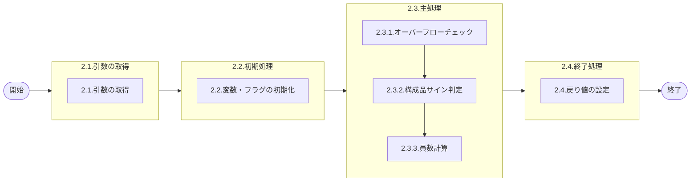

# 0. 表紙

| モジュール名 | プログラムID | プログラム名 |
| ------------ | ------------ | ------------ |
| IC           | LDYS0002     | 員数計算     |

| RFC | Version | 更新日     | 更新者 | 更新内容 | 確認日     | 確認者 | 承認日     | 承認者 |
| --- | :-----: | ---------- | :----: | -------- | ---------- | :----: | ---------- | :----: |
| -   |  1.0.0  | 2025/09/10 | 李鵬陽 | 初版作成 | 2025/XX/XX |  XXX  | 2025/XX/XX |  XXX  |

## 1. 処理概要

### 1.1. 機能概要

引数を元に員数計算を実施し結果を戻り値で返す
補足
戻り値．計算数量＝変数．数量×引数．員数×引数．オプション％／１００
少数点は(lz)共通システムパラメータの「在庫少数点管理少数桁数」をみて少数点位置を決めているため、少数点以下5桁とは限らないため注意

### 1.2. 処理概要フロー

### 1.3. プログラム入出力パラメータ

#### 1.3.1. 引数

| No. | パラメータ論理名 | パラメータ物理名   | 属性    | 備考 |
| --- | ---------------- | ------------------ | ------- | ---- |
| 1   | 数量             | pn_assyqty         | DECIMAL |      |
| 2   | 構成品サイン     | ps_compsign        | VARCHAR |      |
| 3   | 員数             | pn_comp_qty        | INTEGER |      |
| 4   | オプション％     | pn_comp_op_percent | VARCHAR |      |
| 5   | 品目クラス       | ps_item_class      | VARCHAR |      |

#### 1.3.2. 戻り値

| No. | パラメータ論理名 | パラメータ物理名 | 属性    | 備考                                          |
| --- | ---------------- | ---------------- | ------- | --------------------------------------------- |
| 1   | 処理ステータス   | rn_status        | INTEGER | 0:NormalEnd,-1:SQLError/-2:PGError,1:警告発生 |
| 2   | SQLコード        | rs_sql_code      | VARCHAR |                                               |
| 3   | エラーコード     | rs_err_code      | VARCHAR |                                               |
| 4   | エラーメッセージ | rs_err_msg       | VARCHAR |                                               |
| 5   | エラー位置       | rs_err_focus     | VARCHAR |                                               |
| 6   | 計算数量         | rn_compqty       | DECIMAL |                                               |

### 1.4. その他制御・要件

| 排他制御 |      |      |
| -------- | ---- | ---- |
| 楽観     | 悲観 | 無し |
| ●       | -    | -    |

| 項目               | 制約・制御・要件など | 記載内容説明                                                     |
| ------------------ | -------------------- | ---------------------------------------------------------------- |
| パフォーマンス要件 | 特になし。           | 特別なパフォーマンス要件がある場合に要件内容とその対処法を記述。 |

### 1.5. 入出力一覧

| No. | 入出力対象 | 名称 | 物理名称 | C | R | U | D | 備考 |
| --- | ---------- | ---- | -------- | - | - | - | - | ---- |
| 1   | 無し       |      |          |   |   |   |   |      |

## 2. 詳細処理

### 2.1. 引数の取得
### 2.2. 初期処理

利用する変数を初期化する。

| No. | 変数論理名 | 初期化設定値 |
| :-: | ---------- | ------------ |
|  1  | 変数.数量  | 0            |
|  2  | 変数.員数  | 0            |

### 2.3. 主処理

#### 2.3.1. オーバーフローチェック

下記少数点は(lz)共通システムパラメータの「在庫少数点管理少数桁数」をみて少数点位置を決めているため、少数点以下5桁とは限らない

- 引数.数量が9999999999.99999以上、-9999999999.99999以下の時
  変数.員数に9999999999.99999をセットして処理を終了
- それ以外の場合
  引き続き処理を行います

#### 2.3.2. 構成品サイン判定

- 構成品サインが '+' の場合
  変数.数量 = 引数.数量
- それ以外の場合
  変数.数量 = 引数.数量 * -1

#### 2.3.3. 員数計算

変数.員数 = 変数．数量　×　引数．員数　×　引数．オプション％　／　１００

- 品目クラス = 0,1の時は少数点五桁まで求め

  - 変数.員数 < 0の場合
    変数.員数 = TRUNC(変数.員数 - 0.000009,5)
  - それ以外の場合
    変数.員数 = TRUNC(変数.員数 + 0.000009,5)
- 品目クラスが0か1以外の時は整数で求める

  - 変数.員数 < 0の場合
    変数.員数 = TRUNC(変数.員数 - 0.000009)
  - それ以外の場合
    変数.員数 = TRUNC(変数.員数 + 0.000009)
    ※数量は切り上げをする

### 2.4. 終了処理

取得した計算数量を戻り値に設定する。

| 戻り値論理名 | 設定値    |
| ------------ | --------- |
| 処理ステータス     | 0                       |
| SQL コード         | スペース                |
| エラーコード       | スペース                |
| エラーメッセージ   | スペース                |
| エラー位置         | スペース                |
| 計算数量     | 変数.員数 |

## 3. 補足説明

### 3.1. 戻り値について

- ステータスについて
  - 0 : Normal End
  - -1 : Abnormal End
  - -2 : PGM Error

### 3.2. エラー発生時の対応について

- 戻り値.エラー位置 :'LDYS0002'
- SQLエラーが発生した場合、エラーログを出力して処理終了する
