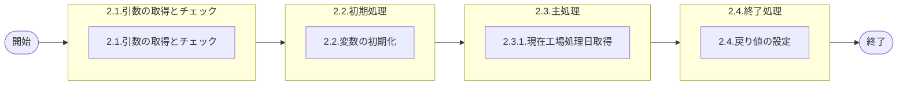

# 0. 表紙

| モジュール名 | プログラムID | プログラム名       |
| ------------ | ------------ | ------------------ |
| IC           | LDYS0007     | 現在工場処理日取得 |

| RFC | Version | 更新日     | 更新者 | 更新内容 | 確認日     | 確認者 | 承認日     | 承認者 |
| --- | :-----: | ---------- | :----: | -------- | ---------- | :----: | ---------- | :----: |
| -   |  1.0.0  | 2025/09/15 | 李鵬陽 | 初版作成 | 2025/XX/XX |  XXX  | 2025/XX/XX |  XXX  |

## 1. 処理概要

### 1.1. 機能概要

当ＳＰ実行時点での、システム上の日付を取得し、呼出元に返却する。
補足
GIMACのIC工場処理日テーブルは２直用も一緒に管理するため、処理IDで指定する必要がある

### 1.2. 処理概要フロー



### 1.3. プログラム入出力パラメータ

#### 1.3.1. 引数

| No. | パラメータ論理名 | パラメータ物理名 | 属性    | 備考      |
| --- | ---------------- | ---------------- | ------- | --------- |
| 1   | 処理ID           | ps_process_id    | VARCHAR | GIMAC追加 |

#### 1.3.2. 戻り値

| No. | パラメータ論理名 | パラメータ物理名 | 属性    | 備考                        |
| --- | ---------------- | ---------------- | ------- | --------------------------- |
| 1   | 処理ステータス   | rn_status        | INTEGER | 0:正常終了,-1,-2:異常終了   |
| 2   | SQLコード        | rs_sql_code      | VARCHAR |                             |
| 3   | エラーコード     | rs_err_code      | VARCHAR |                             |
| 4   | エラーメッセージ | rs_err_msg       | VARCHAR |                             |
| 5   | エラー位置       | rs_err_focus     | VARCHAR |                             |
| 6   | 工場処理日       | rs_Date_YYYYMMDD | VARCHAR | 年4桁月2桁日2桁の連結文字列 |

### 1.4. その他制御・要件

| 排他制御 |      |      |
| -------- | ---- | ---- |
| 楽観     | 悲観 | 無し |
| ●       | -    | -    |

| 項目               | 制約・制御・要件など | 記載内容説明                                                     |
| ------------------ | -------------------- | ---------------------------------------------------------------- |
| パフォーマンス要件 | 特になし。           | 特別なパフォーマンス要件がある場合に要件内容とその対処法を記述。 |

### 1.5. 入出力一覧

| No | 入出力対象 | 名称         | 物理名称         | C | R  | U | D | 備考 |
| -- | ---------- | ------------ | ---------------- | - | -- | - | - | ---- |
| 1  | テーブル   | IC工場処理日 | ld_mst_slip_date | - | ○ | - | - |      |

## 2. 詳細処理

### 2.1. 引数の取得とチェック

無し

### 2.2. 初期処理

利用する変数を初期化する。

| No. | 変数論理名        | 初期化設定値 |
| :-: | ----------------- | ------------ |
|  1  | 変数.IC工場処理日 | スペース     |

### 2.3. 主処理

#### 2.3.1.現在工場処理日取得

- IC工場処理日を検索する

```sql
SELECT IC工場処理日
  INTO 変数.IC工場処理日
  FROM IC工場処理日 
 WHERE 処理タイプ = 引数.処理ID
```

- データが存在の場合

  - 変数.IC工場処理日 が　ブランク　又は　 NULL 　の場合

    - 処理ステータス :-2
    - エラーコード : E.LDP10911
    - エラーメッセージ : 'The IC pymac date is not exist.'

      - (IC工場処理日が存在しません。)
- データが存在しない場合、エラーメッセージを出力し処理終了

  - 処理ステータス :-2
  - エラーコード : E.LDP10911
  - エラーメッセージ : 'The IC pymac date is not exist.'
    - (IC工場処理日が存在しません。)

### 2.4. 終了処理

取得したIC工場処理日を戻り値に設定する。

| 戻り値論理名     | 設定値            |
| ---------------- | ----------------- |
| 処理ステータス   | 0                 |
| SQLコード        | スペース          |
| エラーコード     | スペース          |
| エラーメッセージ | スペース          |
| エラー位置       | スペース          |
| IC工場処理日     | 変数.IC工場処理日 |

## 3. 補足説明

### 3.1. 戻り値について

- ステータスについて
  - 0 : Normal End
  - -1 : Abnormal End
  - -2 : PGM Error

### 3.2. エラー発生時の対応について

- 戻り値.エラー位置 :'LDYS0007'
- SQLエラーが発生した場合、エラーログを出力して処理終了する
