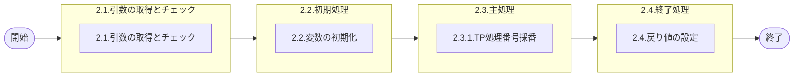

# 0. 表紙

| モジュール名 | プログラムID | プログラム名   |
| ------------ | ------------ | -------------- |
| IC           | LDYS0008     | TP処理番号採番 |

| RFC | Version | 更新日     | 更新者 | 更新内容 | 確認日     | 確認者 | 承認日     | 承認者 |
| --- | :-----: | ---------- | :----: | -------- | ---------- | :----: | ---------- | :----: |
| -   |  1.0.0  | 2025/09/15 | 李鵬陽 | 初版作成 | 2025/XX/XX |  XXX  | 2025/XX/XX |  XXX  |

## 1. 処理概要

### 1.1. 機能概要

ＴＰ処理番号採番ファイルからTP登録に使用するTP処理番号を取得する。
次回のTP登録用にTP処理番号を＋１して更新する。

### 1.2. 処理概要フロー



### 1.3. プログラム入出力パラメータ

#### 1.3.1. 引数

| No. | パラメータ論理名 | パラメータ物理名 | 属性    | 備考 |
| --- | ---------------- | ---------------- | ------- | ---- |
| 1   | ユーザーＩＤ     | ps_user_id       | VARCHAR |      |

#### 1.3.2. 戻り値

| No. | パラメータ論理名 | パラメータ物理名   | 属性    | 備考                               |
| --- | ---------------- | ------------------ | ------- | ---------------------------------- |
| 1   | 処理ステータス   | rn_status          | INTEGER | 0:Normal-1:SqlError-2:ProgramError |
| 2   | SQLコード        | rs_sql_code        | VARCHAR |                                    |
| 3   | エラーコード     | rs_err_code        | VARCHAR |                                    |
| 4   | エラーメッセージ | rs_err_msg         | VARCHAR |                                    |
| 5   | エラー位置       | rs_err_focus       | VARCHAR |                                    |
| 6   | ＴＰ処理番号     | rn_tp_operation_no | VARCHAR |                                    |

### 1.4. その他制御・要件

| 排他制御 |      |      |
| -------- | ---- | ---- |
| 楽観     | 悲観 | 無し |
| ●       | -    | -    |

| 項目               | 制約・制御・要件など | 記載内容説明                                                     |
| ------------------ | -------------------- | ---------------------------------------------------------------- |
| パフォーマンス要件 | 特になし。           | 特別なパフォーマンス要件がある場合に要件内容とその対処法を記述。 |

### 1.5. 入出力一覧

| No | 入出力対象 | 名称                   | 物理名称      | C | R  | U  | D | 備考 |
| -- | ---------- | ---------------------- | ------------- | - | -- | -- | - | ---- |
| 1  | テーブル   | TP処理番号採番ファイル | ld_mst_tp_num | - | ○ | ○ | - |      |
| 2  |            |                        |               |   |    |    |   |      |

## 2. 詳細処理

### 2.1. 引数の取得とチェック

- 引数.ユーザーＩＤ が　ブランク　又は　 NULL 　の場合、エラーメッセージを出力し処理終了。
  - エラーコード : 'E.LDP10917'
  - エラーメッセージ : 'Specify the User ID.'
  - (ユーザーＩＤを指定してください。)

### 2.2. 初期処理

| No. | 変数論理名            | 初期化設定値 |
| :-: | --------------------- | ------------ |
|  1  | 変数.次回ＴＰ処理番号 | スペース     |
|  2  | 変数.採番範囲 From    | スペース     |
|  3  | 変数.採番範囲 To      | スペース     |
|  4  | 変数.更新日時         | システム時間 |

### 2.3. 主処理

#### 2.3.1.TP処理番号採番

- ＴＰ処理番号採番ファイルを検索する

```sql
SELECT 次回ＴＰ処理番号,
       採番範囲 From，
       採番範囲 To 
  INTO 変数.次回ＴＰ処理番号，
       変数.採番範囲 From，
       変数.採番範囲 To 
  FROM ＴＰ処理番号採番ファイル a
```

- データが存在しない場合、エラーメッセージを出力し処理終了。

  - エラーコード : 'E.LDP10934'
  - エラーメッセージ : 'Target data does not exist in the TP Operation No Numbering File table.'
  - (ＴＰ処理番号採番ファイルにデータが存在していません。)
- データ存在の場合、
  戻り値.ＴＰ処理番号 =  変数.次回ＴＰ処理番号

  -変数.次回ＴＰ処理番号 + 1 > 変数.採番範囲 To の場合、
  変数.次回ＴＰ処理番号 = 変数.採番範囲 From
  ＴＰ処理番号採番ファイルを更新する

  ```sql
  UPDATE ＴＰ処理番号採番ファイル a
    SET a.次回ＴＰ処理番号 = 変数.次回ＴＰ処理番号
        a.更新者 = 変数.ユーザーＩＤ
        a.更新カウンター = 更新カウンター + 1
        a.更新日時 = 変数.更新日時
  ```

### 2.4. 終了処理

取得したＴＰ処理番号を戻り値に設定する。

| 戻り値論理名     | 設定値                     |
| ---------------- | -------------------------- |
| 処理ステータス   | 0                          |
| SQLコード        | スペース                   |
| エラーコード     | スペース                   |
| エラーメッセージ | スペース                   |
| エラー位置       | スペース                   |
| ＴＰ処理番号     | 2.3.1.取得したＴＰ処理番号 |

## 3. 補足説明

### 3.1. 戻り値について

- ステータスについて
  - 0 : Normal End
  - -1 : Abnormal End
  - -2 : PGM Error

### 3.2. エラー発生時の対応について

- 戻り値.エラー位置 :'LDYS0008'
- SQLエラーが発生した場合、エラーログを出力して処理終了する
