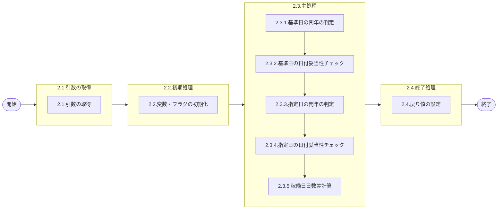

# 0. 表紙

| モジュール名 | プログラムID | プログラム名     |
| ------------ | ------------ | ---------------- |
| IC           | LDYS0010     | 稼働日日数差計算 |

| RFC | Version | 更新日     | 更新者 | 更新内容 | 確認日     | 確認者 | 承認日     | 承認者 |
| --- | :-----: | ---------- | :----: | -------- | ---------- | :----: | ---------- | :----: |
| -   |  1.0.0  | 2025/09/16 | 李鵬陽 | 初版作成 | 2025/XX/XX |  XXX  | 2025/XX/XX |  XXX  |

## 1. 処理概要

### 1.1. 機能概要

指定された基準日と指定日が稼働日ベースで何日はなれているかを求める。
基準日＜指定日であれば正の値で、基準日＞指定日であれば負の値が戻る。
基準日＝指定日の場合や、間に稼働日が無い場合は、ゼロが戻る。
①引数の妥当性チェック
②基準日と指定日の間の月について、カレンダーテーブルを検索し、稼働日の合計を求めて返す。

### 1.2. 処理概要フロー



### 1.3. プログラム入出力パラメータ

#### 1.3.1. 引数

| No. | パラメータ論理名 | パラメータ物理名 | 属性    | 備考                     |
| --- | ---------------- | ---------------- | ------- | ------------------------ |
| 1   | カレンダーコード | ps_calder_cd     | VARCHAR | 使用するカレンダーコード |
| 2   | 基準日           | ps_std_ymd       | VARCHAR | 基準とする日にち         |
| 3   | 指定日           | ps_apt_ymd       | VARCHAR | 指定する日にち           |

#### 1.3.2. 戻り値

| No. | パラメータ論理名 | パラメータ物理名 | 属性    | 備考                                              |
| --- | ---------------- | ---------------- | ------- | ------------------------------------------------- |
| 1   | ステータス       | rn_status        | INTEGER | 0:Normal,100:Notfound,-1:SqlError,-2:ProgramError |
| 2   | SQLコード        | rs_sql_code      | VARCHAR |                                                   |
| 3   | エラーコード     | rs_err_code      | VARCHAR |                                                   |
| 4   | エラーメッセージ | rs_err_msg       | VARCHAR |                                                   |
| 5   | エラー位置       | rs_err_focus     | VARCHAR |                                                   |
| 6   | 間隔日数         | rn_interval      | INTEGER |                                                   |

### 1.4. その他制御・要件

| 排他制御 |      |      |
| -------- | ---- | ---- |
| 楽観     | 悲観 | 無し |
| ●       | -    | -    |

| 項目               | 制約・制御・要件など | 記載内容説明                                                     |
| ------------------ | -------------------- | ---------------------------------------------------------------- |
| パフォーマンス要件 | 特になし。           | 特別なパフォーマンス要件がある場合に要件内容とその対処法を記述。 |

### 1.5. 入出力一覧

| No | 入出力対象 | 名称               | 物理名称        | C | R  | U | D | 備考           |
| -- | ---------- | ------------------ | --------------- | - | -- | - | - | -------------- |
| 1  | テーブル   | カレンダーマスター | le_mst_calendar |   | ○ |   |   | カレンダ検索用 |

## 2. 詳細処理

### 2.1. 引数の取得

### 2.2. 初期処理

利用する変数を初期化する。

| No. | 変数論理名          | 初期化設定値 |
| :-: | ------------------- | ------------ |
|  1  | 変数.年             | 0            |
|  2  | 変数.月             | スペース     |
|  3  | 変数.時日           | スペース     |
|  4  | 変数.余数           | 0            |
|  5  | 変数.基準日         | 0            |
|  6  | 変数.カレンダー内容 | スペース     |
|  7  | 変数.間隔日数       | 0            |
|  8  | 変数.日付           | スペース     |
|  9  | 変数.小日付         | スペース     |
| 10 | 変数.小日付の年     | スペース     |
| 11 | 変数.小日付の年月   | スペース     |
| 12 | 変数.小日付の時日   | スペース     |
| 13 | 変数.大日付         | スペース     |
| 14 | 変数.大日付の年     | スペース     |
| 15 | 変数.大日付の年月   | スペース     |
| 16 | 変数.大日付の時日   | スペース     |

利用するフラグを初期化する。

| No. | 変数論理名        | 初期化設定値 |
| :-: | ----------------- | ------------ |
|  1  | 変数.閏年のフラグ | スペース     |

- 引数.基準日 が　NULL の場合
  引数.基準日 = スペース

引数.基準日が全て数字で構成されているかどうかを判断する
-引数.基準日に数字以外の文字が含まれている場合
 エラーメッセージを出力し処理終了

- 処理ステータス :-2
- エラーコード : E.LDP10376
- エラーメッセージ : 'Date format is illegal.'
- (ありえない日付が指定されました)

引数.指定日が全て数字で構成されているかどうかを判断する
-引数.指定日に数字以外の文字が含まれている場合
 エラーメッセージを出力し処理終了

- 処理ステータス :-2
- エラーコード : E.LDP10376
- エラーメッセージ : 'Date format is illegal.'
- (ありえない日付が指定されました)

### 2.3. 主処理

#### 2.3.1.基準日の閏年の判定

- 引数.基準日 = NULL の場合
  引数.基準日 = ' '

変数.年      = 引数.基準日[1,4]
変数.月      = 引数.基準日[5,6]
変数.時日 = 引数.基準日[7,8]
変数.余数 = 変数.年 / 4
変数.余数 = 変数.年 -  変数.余数 * 4

- 変数.余数 = 0 の場合変数.余数 = 変数.年 / 100
  変数.余数 = 変数.年 -  変数.余数 * 100

  - 変数.余数 = 0 の場合
    変数.余数 = 変数.年 / 400
    変数.余数 = 変数.年 -  変数.余数 * 400
    - 変数.余数 = 0 の場合  (閏年の状況)
      変数.閏年のフラグ = "1"
    - それ以外の場合
      変数.閏年のフラグ = "0"
  - それ以外の場合
    変数.閏年のフラグ = "1"
- それ以外の場合
  変数.閏年のフラグ = "0"

#### 2.3.2.基準日の日付妥当性チェック

- 変数.月 in "01"、"03" 、"05" 、"07" 、"08" 、"10" 、"12" の場合

  - 変数.日付 <"01" または  変数.日付 > "31" の場合
    エラーメッセージを出力し処理終了
  - 処理ステータス :-2
  - エラーコード : E.LDP10376
  - エラーメッセージ : 'Date format is illegal.'
  - (ありえない日付が指定されました)
- 変数.月 = "02"の場合

  - 変数.閏年のフラグ = "0"の場合

    - 変数.日付 <"01" または  変数.日付 > "28" の場合
      エラーメッセージを出力し処理終了
    - 処理ステータス :-2
    - エラーコード : E.LDP10376
    - エラーメッセージ : 'Date format is illegal.'
    - (ありえない日付が指定されました)
  - それ以外の場合

    - 変数.日付 <"01" または  変数.日付 > "29" の場合
      エラーメッセージを出力し処理終了
      エラーメッセージを出力し処理終了
    - 処理ステータス :-2
    - エラーコード : E.LDP10376
    - エラーメッセージ : 'Date format is illegal.'
    - (ありえない日付が指定されました)
- 変数.月 in "04"、"06" 、"09" 、"11" の場合

  - 変数.日付 <"01" または  変数.日付 > "30" の場合
    エラーメッセージを出力し処理終了
    エラーメッセージを出力し処理終了
    - 処理ステータス :-2
    - エラーコード : E.LDP10376
    - エラーメッセージ : 'Date format is illegal.'
    - (ありえない日付が指定されました)
- それ以外の場合エラーメッセージを出力し処理終了

  - 処理ステータス : 1              
  - エラーコード : ''
  - エラーメッセージ : ''

#### 2.3.3.指定日の閏年の判定

- 引数.指定日 = NULL の場合
  引数.指定日 = ' '

変数.年 = 引数.指定日[1,4]
変数.月 = 引数.指定日[5,6]
変数.時日 = 引数.指定日[7,8]
変数.余数 = 変数.年 / 4
変数.余数 = 変数.年 -  変数.余数 * 4

- 変数.余数 = 0 の場合
  変数.余数 = 変数.年 / 100
  変数.余数 = 変数.年 -  変数.余数 * 100

  - 変数.余数 = 0 の場合
    変数.余数 = 変数.年 / 400
    変数.余数 = 変数.年 -  変数.余数 * 400
    - 変数.余数 = 0 の場合  (閏年の状況)
      変数.閏年のフラグ = "1"
    - それ以外の場合
      変数.閏年のフラグ = "0"
  - それ以外の場合
    変数.閏年のフラグ = "1"
- それ以外の場合
  変数.閏年のフラグ = "0"

#### 2.3.4.指定日の日付妥当性チェック

- 変数.月 in "01"、"03" 、"05" 、"07" 、"08" 、"10" 、"12" の場合

  - 変数.日付 <"01" または  変数.日付 > "31" の場合
    エラーメッセージを出力し処理終了
    - 処理ステータス : 1              
    - エラーコード : ''
    - エラーメッセージ : ''
- 変数.月 = "02"の場合

  - 変数.閏年のフラグ = "0"の場合
    - 変数.日付 <"01" または  変数.日付 > "28" の場合
      - 処理ステータス : 1              
      - エラーコード : ''
      - エラーメッセージ : ''
  - それ以外の場合
    - 変数.日付 <"01" または  変数.日付 > "29" の場合
      - 処理ステータス : 1              
      - エラーコード : ''
      - エラーメッセージ : ''
- 変数.月 in "04"、"06" 、"09" 、"11" の場合

  - 変数.日付 <"01" または  変数.日付 > "30" の場合
    - 処理ステータス : 1              
    - エラーコード : ''
    - エラーメッセージ : ''
- それ以外の場合エラーメッセージを出力し処理終了

  - 処理ステータス : 1              
  - エラーコード : ''
  - エラーメッセージ : ''

#### 2.3.5.稼働日日数差計算

- 引数.基準日 = 引数.指定日 の場合
  変数.間隔日数 = 0

  変数.基準日 = 引数.基準日[1,4] || "-" ||  引数.基準日[5,6] || "-"  ||  引数.基準日[7,8]
  変数.指定日 = 引数.指定日[1,4] || "-" ||  引数.指定日[5,6] || "-"  ||  引数.指定日[7,8]
- 引数.基準日 < 引数.指定日 の場合
  変数.小日付 = 変数.基準日 + 1
  変数.大日付 = 変数.指定日
- それ以外の場合
  変数.小日付 = 変数.指定日
  変数.大日付 = 変数.基準日 - 1

  変数.小日付              = 変数.小日付[1,4] || 変数.小日付[6,7] || 変数.小日付[9,10]
  変数.小日付の年     = 変数.小日付[1,4]
  変数.小日付の年月 = 変数.小日付[1,6]
  変数.小日付の時日 = 変数.小日付[7,8]

  変数.大日付 = 変数.大日付[1,4] || 変数.大日付[6,7] || 変数.大日付[9,10]
  変数.大日付の年   = 変数.大日付[1,4]
  変数.大日付の年月 = 変数.大日付[1,6]
  変数.大日付の時日 = 変数.大日付[7,8]
- 変数.小日付の年月 =  変数.大日付の年月 の場合

  カレンダーマスター を検索する

  ```sql
  SELECT カレンダー内容
    INTO 変数.カレンダー内容
    FROM カレンダーマスター 
   WHERE カレンダーコード = 引数.カレンダーコード 
      AND カレンダー年月 = 変数.小日付の年月
  ```

  - データが存在しない場合、エラーメッセージを出力し処理終了。

    - 処理ステータス : 1              
    - エラーコード : ''
    - エラーメッセージ : ''
  - データが存在の場合
    「変数.カレンダー内容」を、変数.小日付の時日 から変数.大日付の時日 まで順に処理します

    - 変数.カレンダー内容[現在の時日] = "0" の場合
      変数.間隔日数 = 変数.間隔日数 + 1
- それ以外の場合
  変数.小日付の年月の間隔日数を取得
  カレンダーマスター を検索する

  ```sql
   SELECT カレンダー内容 
     INTO 変数.カレンダー内容 
    FROM カレンダーマスター a
    WHERE カレンダーコード = 引数.カレンダーコード  
      AND カレンダー年月 = 変数.小日付の年月 
  ```

  - データが存在しない場合、エラーメッセージを出力し処理終了。

    - 処理ステータス : 1              
    - エラーコード : ''
    - エラーメッセージ : ''
  - データが存在の場合
    「変数.カレンダー内容」を、変数.小日付の時日 から 31 まで順に処理します

    - 変数.カレンダー内容[現在の時日] = "0" の場合
      変数.間隔日数 = 変数.間隔日数 + 1

  変数.大日付の年月の間隔日数を取得
  カレンダーマスター を検索する

  ```sql
      SELECT カレンダー内容 
        INTO 変数.カレンダー内容 
      FROM カレンダーマスター 
      WHERE カレンダーコード = 引数.カレンダーコード 
       AND カレンダー年月 = 変数.大日付の年月
  ```

  - データが存在しない場合、エラーメッセージを出力し処理終了。

    - 処理ステータス : 1              
    - エラーコード : ''
    - エラーメッセージ : ''
  - データが存在の場合
    「変数.カレンダー内容」を、1 から 変数.大日付の時日 まで順に処理します

    - 変数.カレンダー内容[現在の時日] = "0" の場合
      変数.間隔日数 = 変数.間隔日数 + 1

  中間月の間隔日数を取得
  foreach
  カレンダーマスター を検索する

  ```sql
  SELECT カレンダー内容 
    INTO 変数.カレンダー内容
  FROM カレンダーマスター 
  WHERE カレンダーコード = 引数.カレンダーコード  
    AND カレンダー年月 > 変数.小日付の年月 
    AND カレンダー年月 < 変数.大日付の年月
  ```

  「変数.カレンダー内容」を、1 から 31 まで順に処理します

  - 変数.カレンダー内容[現在の時日] = "0" の場合
    変数.間隔日数 = 変数.間隔日数 + 1

  end foreach
- 引数.基準日 > 引数.指定日 の場合
  変数.間隔日数 = 0 - 変数.間隔日数

### 2.4. 終了処理

取得した間隔日数を戻り値に設定する。

| 戻り値論理名     | 設定値        |
| ---------------- | ------------- |
| 処理ステータス   | 0             |
| SQL コード       | スペース      |
| エラーコード     | スペース      |
| エラーメッセージ | スペース      |
| エラー位置       | スペース      |
| 間隔日数         | 変数.間隔日数 |

## 3. 補足説明

### 3.1. 戻り値について

- ステータスについて
  - 0 : Normal End
  - -1 : Abnormal End
  - -2 : PGM Error

### 3.2. エラー発生時の対応について

- 戻り値.エラー位置 :'LDYS0010'
- SQLエラーが発生した場合、エラーログを出力して処理終了する
