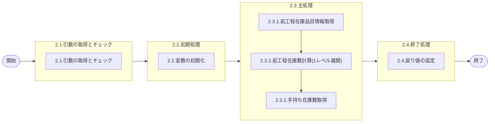

# 0. 表紙

| モジュール名 | プログラムID | プログラム名     |
| ------------ | ------------ | ---------------- |
| IC           | LDYS0012     | 前工程在庫数計算 |

| RFC | Version | 更新日     | 更新者 | 更新内容 | 確認日     | 確認者 | 承認日     | 承認者 |
| --- | :-----: | ---------- | :----: | -------- | ---------- | :----: | ---------- | :----: |
| -   |  1.0.0  | 2025/09/18 | 李鵬陽 | 初版作成 | 2025/XX/XX |  XXX  | 2025/XX/XX |  XXX  |

## 1. 処理概要

### 1.1. 機能概要

引数の品目キーより1レベル展開して、在庫ファイルより前工程の在庫数を算出する

### 1.2. 処理概要フロー



### 1.3. プログラム入出力パラメータ

#### 1.3.1. 引数

| No. | パラメータ論理名 | パラメータ物理名 | 属性    | 備考 |
| --- | ---------------- | ---------------- | ------- | ---- |
| 1   | 品目番号         | ps_itemno        | VARCHAR |      |
| 2   | 供給者           | ps_supplier      | VARCHAR |      |
| 3   | 使用者           | ps_usercd        | VARCHAR |      |
| 4   | 日付             | ps_date          | VARCHAR |      |
| 5   | オーダー番号     | ps_order_no      | VARCHAR |      |

#### 1.3.2. 戻り値

| No. | パラメータ論理名 | パラメータ物理名 | 属性    | 備考                                              |
| --- | ---------------- | ---------------- | ------- | ------------------------------------------------- |
| 1   | ステータス       | rn_status        | INTEGER | 0:Normal,100:Notfound,-1:SqlError,-2:ProgramError |
| 2   | SQLコード        | rs_sql_code      | VARCHAR |                                                   |
| 3   | エラーコード     | rs_err_code      | VARCHAR |                                                   |
| 4   | エラーメッセージ | rs_err_msg       | VARCHAR |                                                   |
| 5   | エラー位置       | rs_err_focus     | VARCHAR |                                                   |
| 6   | 計算結果         | rs_cal_cresult   | VARCHAR | 0:算出可能1:算出不可                              |
| 7   | 手持在庫数       | rs_oh_qty        | DECIMAL |                                                   |

### 1.4. その他制御・要件

| 排他制御 |      |      |
| -------- | ---- | ---- |
| 楽観     | 悲観 | 無し |
| ●       | -    | -    |

| 項目               | 制約・制御・要件など | 記載内容説明                                                                                                                                                               |
| ------------------ | -------------------- | -------------------------------------------------------------------------------------------------------------------------------------------------------------------------- |
| パフォーマンス要件 | 特になし。           | 特別なパフォーマンス要件がある場合に要件内容とその対処法を記述。 ■呼び出し元 NEXT (sp)LDSS0013未出荷問合せ（複数ＳＵ指定） (sp)LDSS0014未出荷問合せ（担当課／担当者指定） |

### 1.5. 入出力一覧

| No | 入出力対象 | 名称           | 物理名称               | C | R  | U | D | 備考 |
| -- | ---------- | -------------- | ---------------------- | - | -- | - | - | ---- |
| 1  | テーブル   | 独立所要量明細 | le_trn_ird             |   | ○ |   |   |      |
| 2  | テーブル   | MRP情報値      | le_mst_mrp_information |   | ○ |   |   |      |
| 3  | テーブル   | 在庫ファイル   | ld_trn_inv             |   | ○ |   |   |      |

## 2. 詳細処理

### 2.1. 引数の取得とチェック

- 引数.品目番号 が　ブランク　又は　 NULL 　の場合、エラーメッセージを出力し処理終了。

  - エラーコード : 'E.LDP10451'
  - エラーメッセージ : 'Enter Item Number.'
  - (品目番号を指定してください)
- 引数.供給者 が　ブランク　又は　 NULL 　の場合、エラーメッセージを出力し処理終了。

  - エラーコード : 'E.LDP10893'
  - エラーメッセージ : 'Specify the Supplier.'
  - (供給者を指定してください。)
- 引数.使用者 が　ブランク　又は　 NULL 　の場合、エラーメッセージを出力し処理終了。

  - エラーコード : 'E.LDP10895'
  - エラーメッセージ : 'Specify the User.'
  - (使用者を指定してください。)
- 引数.日付 が　ブランク　又は　 NULL 　の場合、エラーメッセージを出力し処理終了。

  - エラーコード : 'E.LDP10897'
  - エラーメッセージ : 'Specify the Date.'
  - (日付を指定してください。)
- 引数.オーダー番号 が　ブランク　又は　 NULL 　の場合、エラーメッセージを出力し処理終了。

  - エラーコード : 'E.LDP10908'
  - エラーメッセージ : 'Specify the Order Number.'
  - (オーダー番号を指定してください。)

### 2.2. 初期処理

#### 2.2.1. 初期処理

利用する変数を初期化する。

| No. | 変数論理名      | 初期化設定値 |
| :-: | --------------- | ------------ |
|  1  | 変数.品目番号   | スペース     |
|  2  | 変数.供給者     | スペース     |
|  3  | 変数.使用者     | スペース     |
|  4  | 変数.計算結果   | '0'          |
|  5  | 変数.AIRSサイン | スペース     |
|  6  | 変数.手持在庫数 | 0            |

#### 2.2.2. 引数の妥当性チェック

- LENGTH(TRIM(引数.品目番号)) > 30 の場合

  - エラーコード : 'E.LDP10892'
  - エラーメッセージ : 'Specify 30 digits or less for the Item Number.'
  - (品目番号は30桁以下で指定してください。)
- LENGTH(TRIM(引数.供給者)) <> 4 の場合

  - エラーコード : 'E.LDP10894'
  - エラーメッセージ : 'Specify Item of which Supplier is 4 digits.'
  - (供給者は4桁で指定してください。)
- LENGTH(TRIM(引数.日付)) <> 8 の場合

  - エラーコード : 'E.LDP10898'
  - エラーメッセージ : 'Specify Item of which Date is 8 digits.'
  - (日付は8桁で指定してください。)
- LENGTH(TRIM(引数.オーダー番号)) <> 4 の場合

  - エラーコード : 'E.LDP10909'
  - エラーメッセージ : 'Specify Item of which Order Numbers 4 digits.'
  - (オーダー番号は5桁で入力してください。)

### 2.3. 主処理

#### 2.3.1. 前工程在庫品目情報取得

独立所要量明細を検索する

```sql
  SELECT 1
    FROM 独立所要量明細 a
   WHERE a.品目番号 = 引数.品目番号
    AND a.供給者 = 引数.供給者
    AND a.使用者 = 引数.使用者
    AND a.オーダー番号 = 引数.オーダー番号
    AND a.所要量区分 = '0'
```

- データが存在の場合

  - 変数.品目番号 = 引数.品目番号
    変数.供給者   = 引数.供給者
    変数.使用者   = 引数.使用者
- データが存在しない場合

  - 引数.供給者 = 引数.使用者 の場合     ※1レベル展開
    製品構成のレコード カウント チェック、製品構成を検索する
    ```sql
    SELECT COUNT(*)
      FROM 製品構成 a
     WHERE a.親品目番号 = 引数.品目番号
      AND a.親供給者 = 引数.供給者
      AND a.親使用者 = 引数.使用者
      AND a.IN発効日 <=  引数.日付
      AND a.OUT発効日 >  引数.日付
    ```
    - レコード カウント <> 1  の場合
      変数.計算結果 = '1'  処理終了
    - それ以外の場合
      製品構成を検索する
      ```sql
          SELECT  a.子品目番号,
                  a.子供給者,
                  a.子使用者,
            INTO 変数.品目番号,
                 変数.供給者,
                 変数.使用者  
            FROM 製品構成 a
           WHERE a.親品目番号 = 引数.品目番号
            AND a.親供給者 = 引数.供給者
            AND a.親使用者 = 引数.使用者
            AND a.IN発効日 <=  引数.日付
            AND a.OUT発効日 >  引数.日付
      ```
      変数.計算結果 = '0'

  - 引数.供給者 <> 引数.使用者 の場合 
    - 変数.品目番号 = 引数.品目番号
      変数.供給者   = 引数.供給者
      変数.使用者   = 引数.使用者

#### 2.3.2. 前工程在庫数計算(1レベル展開)

MRP情報値を検索する、AIRSサインを取得

```sql
  SELECT a.AIRSサイン
    INTO 変数.AIRSサイン
    FROM MRP情報値 a
   WHERE a.品目番号 = 引数.品目番号
    AND a.供給者 = 引数.供給者
    AND a.使用者 = 引数.使用者
```

- データが存在しない場合
  変数.計算結果 = '1'  処理終了
- 変数.AIRSサイン <> '0'の場合 ループ継続
  ※ループ START
  製品構成のレコード カウント チェック、製品構成を検索する   ※1レベル展開

  ```sql
  SELECT COUNT(*)
    FROM 製品構成 a
   WHERE a.親品目番号 = 変数.品目番号
    AND a.親供給者 = 変数.供給者
    AND a.親使用者 = 変数.使用者
    AND a.IN発効日 <=  引数.日付
    AND a.OUT発効日 >  引数.日付
  ```

  - レコード カウント <> 1  の場合
    変数.計算結果 = '1'  処理終了
  - それ以外の場合
    製品構成を検索する
  
    ```sql
        SELECT  a.子品目番号,
                a.子供給者,
                a.子使用者,
          INTO 変数.品目番号,
               変数.供給者,
               変数.使用者  
          FROM 製品構成 a
         WHERE a.親品目番号 = 引数.品目番号
          AND a.親供給者 = 引数.供給者
          AND a.親使用者 = 引数.使用者
          AND a.IN発効日 <=  引数.日付
          AND a.OUT発効日 >  引数.日付
    ```
    変数.計算結果 = '0'

  MRP情報値を検索する、AIRSサインを取得
  ```sql
  SELECT a.AIRSサイン
    INTO 変数.AIRSサイン
    FROM MRP情報値 a
   WHERE a.品目番号 = 引数.品目番号
    AND a.供給者 = 引数.供給者
    AND a.使用者 = 引数.使用者
  ```
  - データが存在しない場合
    変数.計算結果 = '1'  処理終了

  ※ループ END

#### 2.3.3. 手持ち在庫数取得

在庫ファイルを検索する

```sql
  SELECT a.手持在庫数
    INTO 変数.手持在庫数
    FROM 在庫ファイル a
   WHERE a.品目番号 = 変数.品目番号
    AND a.供給者 = 変数.供給者
    AND a.使用者 = 変数.使用者
```

- データが存在しない場合
  変数.計算結果 = '1'  処理終了

### 2.4. 終了処理

取得した手持在庫数を戻り値に設定する。

| 戻り値論理名     | 設定値          |
| ---------------- | --------------- |
| 処理ステータス   | 0               |
| SQL コード       | スペース        |
| エラーコード     | スペース        |
| エラーメッセージ | スペース        |
| エラー位置       | スペース        |
| 計算結果         | 変数.計算結果   |
| 手持在庫数       | 変数.手持在庫数 |

## 3. 補足説明

### 3.1. 戻り値について

- ステータスについて
  - 0 : Normal End
  - -1 : Abnormal End
  - -2 : PGM Error

### 3.2. エラー発生時の対応について

- 戻り値.エラー位置 :'LDYS0012'
- SQLエラーが発生した場合、エラーログを出力して処理終了する
