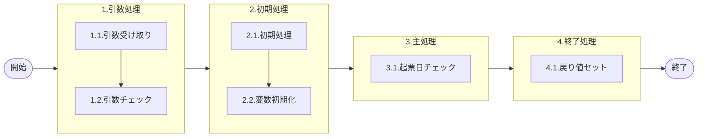

# 0. 表紙

| モジュール名 | プログラムID | プログラム名 |
| --- | --- | --- |
| IC | LDAS0303 | Valid／報告伝票起票日チェック |


| RFC        | Version | 更新日      | 更新者 | 更新内容 | 確認日 | 確認者 | 承認日     | 承認者 |
| ---------- | :-----: | ----------- | :----: | -------- | ------ | :----: | ---------- | :----: |
| - |  1.0.0  | 2025/09/10 |  鈴木祐介  | 初版作成   | 2025/XX/XX  |  XXX  | 2025/XX/XX |  XXX  |

## 1. 処理概要

### 1.1. 機能概要

報告伝票の起票日に対してバリデーションチェックを行う。
- 【起票日チェック判定】
  - 起票日がシステム日付でなくてはならないかどうかを「機能オプションパラメータ」から判断し、「"0":システム日付」、「"1":IC工場処理日」とする
  - ただし、システム日付（もしくは、IC工場処理日）より引数.起票日が未来の日付になっている場合はエラー
- 【工場処理日取得】
  - 工場処理日は2直テーブルと統一されたため、処理タイプ(STD)を指定する必要がある。「STD：標準工場処理日」、「2ST：２直用工場処理日」
- 【起票日チェック】
  - 工場処理日の1ヶ月前の初日を取得し、引数.起票日との期間差をチェックする
  - 期間差が1ヶ月より小さい日付を引数.起票日が設定していた場合、エラーとする

### 1.2. 処理概要フロー


### 1.3. プログラム入出力パラメータ

#### 1.3.1. 引数

| No. | パラメータ論理名 | パラメータ物理名| 属性 | 備考 |
| --- | --- | --- | --- | --- |
| 1 | 起票日 | ps_input_date | VARCHAR |  |
| 2 |  |  |  |  |
| 3 |  |  |  |  |
| 4 |  |  |  |  |
| 5 |  |  |  |  |
| 6 |  |  |  |  |


#### 1.3.2. 戻り値

| No. | パラメータ論理名 | パラメータ物理名 | 属性 | 備考 |
| --- | --- | --- | --- | --- |
| 1 | 処理ステータス | rn_status | INTEGER |  |
| 2 | SQLコード | rs_sql_code | VERCHAR |  |
| 3 | エラーコード | rs_err_code | VERCHAR |  |
| 4 | エラーメッセージ | rs_err_msg | VERCHAR |  |
| 5 | エラー位置 | rs_err_focus | VERCHAR |  |
| 6 |  |  |  |  |
| 7 |  |  |  |  |
| 8 |  |  |  |  |
| 9 |  |  |  |  |
| 10 |  |  |  |  |


### 1.4. その他制御・要件

| 排他制御 |  |  |
| --- | --- | --- |
| 楽観 | 悲観 | 無し |
| 〇 | - | - |

| 項目 | 制約・制御・要件など | 記載内容説明 |
| --- | --- | --- |
| パフォーマンス要件 | 特になし。 |  |

### 1.5. 入出力一覧

| No | 入出力対象 | 名称 | 物理名称 | ID | C | R | U | D | 備考 |
| --- | --- | --- | --- | --- | --- | --- | --- | --- | --- |
| 1 | テーブル | 機能オプションパラメータ | lz_function_parameter |  |  | ○ |  |  |  |
| 2 | テーブル | IC工場処理日 | ld_mst_slip_date |  |  | ○ |  |  |  |
| 3 |  |  |  |  |  |  |  |  |  |
| 4 |  |  |  |  |  |  |  |  |  |
| 5 |  |  |  |  |  |  |  |  |  |
| 6 |  |  |  |  |  |  |  |  |  |


## 2. 詳細処理

### 2.1. 引数の取得とチェック
- 引数.起票日が NULL もしくは　ブランク　の時、エラーメッセージを出力し処理終了
  - エラーコード：'E.LDP10001';
  - エラーメッセージ：'Specify the Input Date.　Argument Error : [引数.起票日] = ' || COALESCE(引数.起票日,'NULL')
    - (起票日を指定します。)
  - エラー位置： 'LDAS0303'

### 2.2. 初期処理
特記なし

### 2.3. 主処理
#### 2.3.1. 起票日チェック
##### 2.3.1.1. 起票日チェック判定
- 機能オプションパラメータに対象レコードが存在するかチェックする。
```sql
IF EXISTS(SELECT 1
          FROM 機能オプションパラメータ
          WHERE システムコード = 'LD'
          AND 識別コード = 'LDA0009'
          AND 選択フラグ = 'T')THEN
```
- 存在する場合、オプションコードを検索する
```sql
SELECT オプションコード
  FROM 機能オプションパラメータ
 WHERE システムコード = 'LD'
   AND 識別コード = 'LDA0009'
   AND 選択フラグ = 'T'
```
- 存在しない場合、エラーメッセージを出力し処理終了
  - エラーコード：'E.LDP10002';
  - エラーメッセージ：'Target data does not exist in'|| ' the Function Parameter table.'
    - (機能選択のデータが存在していません。)
  - エラー位置： 'LDAS0303'

##### 2.3.1.2. IC工場処理日取得
- IC工場処理日に対象レコードが存在するかチェックする。
```sql
IF EXISTS(SELECT 1
          FROM IC工場処理日テーブル
          WHERE 処理タイプ = 'STD')THEN
```
- 存在する場合、IC工場処理日を検索する
```sql
SELECT IC工場処理日
  FROM IC工場処理日テーブル
  WHERE 処理タイプ = 'STD'
```
- 存在しない場合、エラーメッセージを出力し処理終了
  - エラーコード：'E.LDP10004';
  - エラーメッセージ：'The IC pymac date is not exist.';
    - (IC工場処理日が存在しません。)
  - エラー位置： 'LDAS0303'

  ##### 2.3.1.3. 期間差のチェック
  - 機能オプションパラメータ.オプションコード = '0'(システム日付) 時　かつ　
引数.起票日 > 機能オプションパラメータ.システム日付　の場合、　エラーメッセージを出力し処理終了
  - エラーコード：'E.LDP10003';
  - エラーメッセージ：'Please specify the date that before system date. Error:' || '[引数.起票日] = ' || COALESCE( 引数.起票日 , 'NULL' );
    - (システム日付以前の日付を指定してください)
  - エラー位置： 'LDAS0303'

- 機能オプションパラメータ.オプションコード = '1'(IC工場処理日) の時　かつ　
引数.起票日 > IC工場処理日.IC工場処理日　の場合、　エラーメッセージを出力し処理終了
  - エラーコード：'E.LDP10005';
  - エラーメッセージ：'Specify the date former than the system date. Error:' || '[引数.起票日] = ' || COALESCE( 引数.起票日 , 'NULL' );
    - (工場処理日以前の日付を指定してください)
  - エラー位置： 'LDAS0303'

- IC工場処理日を'yyyy-mm-dd'に変換する。
- 変換したIC工場処理日から1ヶ月前日を取得
- 6ヶ月前のIC工場処理日を'yyyymmdd'に変換する
- 変換したIC工場処理日の日を'01'にする

- 引数.起票日が1ヶ月前の初日より過去日だった場合、エラーメッセージを出力し処理終了
  - エラーコード：'E.LDP10007';
  - エラーメッセージ：'Specify the date later than the day one month before the system date.' || ' before the system date.'Error: ' || '[ ps_input_date  ] = ' || COALESCE( ps_input_date , 'NULL' );
    - (工場処理日１ヶ月前以降の日付を指定してください)
  - エラー位置： 'LDAS0303'

### 2.4. 終了処理
- 正常終了処理を行う

| 戻り値           | 設定値   |
| ---------------- | -------- |
| 処理ステータス   | 0        |
| SQL コード       | スペース |
| エラーコード     | スペース |
| エラーメッセージ | スペース |

## 3. 補足説明

### 3.1. 戻り値について
- ステータスについて
  0 : Normal End
  -1 : Abnormal End
  -2 : PGM エラー
- エラー位置について
  - エラーが起こった際、対象のプログラムIDを返す。
  - エラー位置： 'LDAS0303'

### 3.2. エラー発生時の対応について
- SQL エラーが発生した場合、エラーログを出力して処理終了