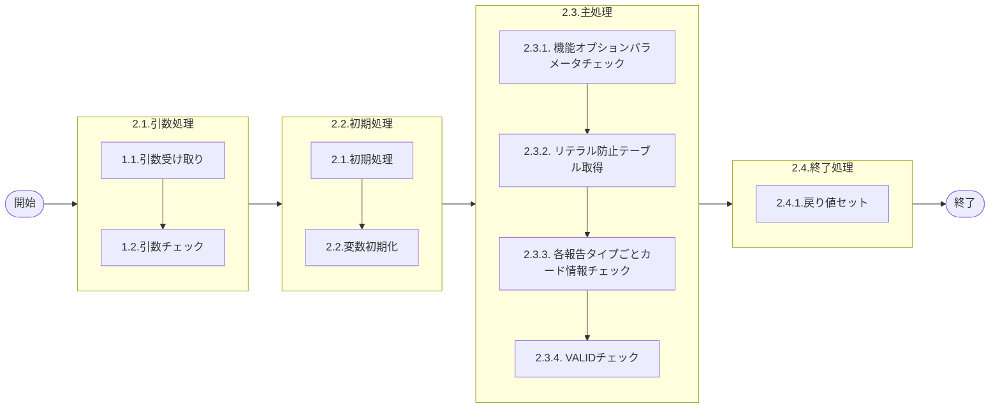

# 0. 表紙

| モジュール名 | プログラムID | プログラム名                          |
| ------------ | ------------ | ------------------------------------- |
| IC           | LDAS0304     | Valid／リーダー入力チェック・納品書No |

| RFC       | Version | 更新日     |  更新者  | 更新内容 | 確認日     | 確認者 | 承認日     | 承認者 |
| --------- | :-----: | ---------- | :------: | -------- | ---------- | :----: | ---------- | :----: |
| XXXX-XXXX |  1.0.0  | 2025/10/29 | 鈴木祐介 | 初版作成 | 2025/XX/XX |  XXX  | 2025/XX/XX |  XXX  |

## 1. 処理概要

### 1.1. 機能概要

引数で渡されたカードNoや品目キーから各種バリデーションチェックを実施する

### 1.2. 処理概要フロー



### 1.3. プログラム入出力パラメータ

#### 1.3.1. 引数

| No. | パラメータ論理名 | パラメータ物理名    | 属性    | 備考                                                                                                                                                                                                                                      |
| --- | ---------------- | ------------------- | ------- | ----------------------------------------------------------------------------------------------------------------------------------------------------------------------------------------------------------------------------------------- |
| 1   | カード識別       | ps_card_id          | VARCHAR | ※カード番号が入ってくる                                                                                                                                                                                                                  |
| 2   | 品目番号         | ps_itemno           | VARCHAR |                                                                                                                                                                                                                                           |
| 3   | 供給者           | ps_supplier         | VARCHAR |                                                                                                                                                                                                                                           |
| 4   | 使用者           | ps_usercd           | VARCHAR |                                                                                                                                                                                                                                           |
| 5   | オーダー番号     | ps_order_no         | VARCHAR |                                                                                                                                                                                                                                           |
| 6   | 報告タイプ       | ps_report_type      | VARCHAR | '1'：納入/完成報告※カードNoでの報告 '2'：オーダー付報告(社外)※品目での報告 '3'：オーダー付報告(社内)※品目での報告 '3'：シンクロ(品目での報告) '4'：シンクロ(カードNo付き） '5'：ピッキング 'Z'：製品出庫 |
| 7   | データタイプ     | ps_data_type        | VARCHAR |                                                                                                                                                                                                                                           |
| 8   | ユーザーＩＤ     | ps_user_id          | VARCHAR |                                                                                                                                                                                                                                           |
| 9   | 取引先代表コード | ps_public_org_code  | VARCHAR |                                                                                                                                                                                                                                           |
| 10  | 処理識別         | ps_cmp_par_crr_sign | VARCHAR | 0：完納1：分納2：訂正＋3：訂正－                                                                                                                                                                                                          |
| 11  | 報告数量         | pn_input_qty        | DECIMAL |                                                                                                                                                                                                                                           |
| 12  | 報告日           | ps_input_date       | VARCHAR |                                                                                                                                                                                                                                           |
| 13  | 特殊権限サイン   | ps_sp_auth_sign     | VARCHAR |                                                                                                                                                                                                                                           |

#### 1.3.2. 戻り値

| No. | パラメータ論理名 | パラメータ物理名      | 属性    | 備考 |
| --- | ---------------- | --------------------- | ------- | ---- |
| 1   | ステータス       | rn_status             | INTEGER |      |
| 2   | SQLコード        | rs_sql_code           | VARCHAR |      |
| 3   | エラーコード     | rs_err_code           | VARCHAR |      |
| 4   | エラーメッセージ | rs_err_msg            | VARCHAR |      |
| 5   | エラー位置       | rs_err_focus          | VARCHAR |      |
| 6   | カード識別       | rs_card_id            | VARCHAR |      |
| 7   | 品目番号         | rs_itemno             | VARCHAR |      |
| 8   | 供給者           | rs_supplier           | VARCHAR |      |
| 9   | 使用者           | rs_usercd             | VARCHAR |      |
| 10  | ベンダーコード   | rs_vendor_code        | VARCHAR |      |
| 11  | オーダー番号     | rs_order_no           | VARCHAR |      |
| 12  | 着手日/払出日    | rs_disburse_date      | VARCHAR |      |
| 13  | 起票日           | rs_input_date         | VARCHAR |      |
| 14  | 処理数量         | rn_input_qty          | DECIMAL |      |
| 15  | 処理識別         | rs_input_operation_id | VARCHAR |      |
| 16  | 内部TXN          | rs_inter_txn          | VARCHAR |      |

### 1.4. その他制御・要件

| 排他制御 |      |      |
| -------- | ---- | ---- |
| 楽観     | 悲観 | 無し |
| 〇       | -    | -    |

| 項目               | 制約・制御・要件など |
| ------------------ | -------------------- |
| パフォーマンス要件 | 特になし。           |

### 1.5. 入出力一覧

| No | 入出力対象 | 名称                     | 物理名称                | C | R  | U | D | 備考 |
| -- | ---------- | ------------------------ | ----------------------- | - | -- | - | - | ---- |
| 1  | テーブル   | 機能オプションパラメータ | lz_function_parameter   |   | ○ |   |   |      |
| 2  | テーブル   | IC工場処理日             | ld_mst_slip_date        |   | ○ |   |   |      |
| 3  | テーブル   | リテラル防止要素         | lz_anti_literal_element |   | ○ |   |   |      |
| 4  | テーブル   | 現品/完成報告カード      | le_trn_dlv_cmp_card     |   | ○ |   |   |      |
| 5  | テーブル   | MRP情報値                | le_mst_mrp_information  |   | ○ |   |   |      |
| 6  | テーブル   | オーダー明細             | le_trn_order            |   | ○ |   |   |      |
| 7  | テーブル   | 独立所要量明細           | le_trn_ird              |   | ○ |   |   |      |
| 8  | テーブル   | 品目マスタ               | la_itemmast             |   | ○ |   |   |      |
| 9  | テーブル   | カードNo.採番            | le_mst_cardno_num       |   | ○ |   |   |      |
| 10 | テーブル   | 製品完成明細             | ld_trn_prod_cmp         |   | ○ |   |   |      |
| 11 |            |                          |                         |   |    |   |   |      |
| 12 |            |                          |                         |   |    |   |   |      |

## 2. 詳細処理

### 2.1. 初期処理
- 各パラメータの初期化処理を行う

#### 2.1.1. 定数の定義

| No. | 定数論理名           | 定数物理名        | 属性    | 設定値    | 備考                     |
| --- | -------------------- | ----------------- | ------- | --------- | ------------------------ |
| 1   | システムコード       | cs_system_code    | VARCHAR | 'LD'      | システム識別             |
| 2   | 原材料過剰報告制限ID | cs_lda00003       | VARCHAR | 'LDA00003' | 機能オプションID         |
| 3   | 起票日指定区分ID     | cs_lda00009       | VARCHAR | 'LDA00009' | 機能オプションID         |
| 4   | 完納処理識別         | cs_complete       | VARCHAR | '0'       | 処理識別：完納           |
| 5   | 分納処理識別         | cs_partial        | VARCHAR | '1'       | 処理識別：分納           |
| 6   | 訂正プラス処理識別   | cs_correct_plus   | VARCHAR | '2'       | 処理識別：訂正+          |
| 7   | 訂正マイナス処理識別 | cs_correct_minus  | VARCHAR | '3'       | 処理識別：訂正-          |

#### 2.1.2. 変数の定義

| No. | 変数論理名               | 変数物理名            | 属性    | 備考                         |
| --- | ------------------------ | --------------------- | ------- | ---------------------------- |
| 1   | オプションコード03       | ls_option_code_03     | VARCHAR | 原材料過剰報告制限区分       |
| 2   | オプションコード09       | ls_option_code_09     | VARCHAR | 起票日指定区分               |
| 3   | 入力日                   | ls_input_date         | VARCHAR | 処理日付                     |
| 4   | 制御キー1                | ls_control_key1       | VARCHAR | リテラル防止要素取得用       |
| 5   | 品目番号                 | ls_itemno             | VARCHAR | カードから取得した品目番号   |
| 6   | 供給者                   | ls_supplier           | VARCHAR | カードから取得した供給者     |
| 7   | 使用者                   | ls_usercd             | VARCHAR | カードから取得した使用者     |
| 8   | オーダー番号             | ls_order_no           | VARCHAR | カードから取得したオーダー番号 |
| 9   | 着手日                   | ls_start_date         | VARCHAR | カードから取得した着手日     |
| 10  | 払出日                   | ls_disburse_date      | VARCHAR | カードから取得した払出日     |
| 11  | オーダーステータス       | ls_order_status       | VARCHAR | カードから取得したステータス |
| 12  | オーダータイプ           | ls_order_type         | VARCHAR | カードから取得したタイプ     |
| 13  | カード数量               | ln_card_qty           | DECIMAL | カードから取得した数量       |
| 14  | 入力数量                 | ln_input_qty          | DECIMAL | 処理対象数量                 |
| 15  | Wビン管理コード          | ls_wbin_control_code  | VARCHAR | MRP情報値から取得           |
| 16  | 品目クラス               | ls_item_class         | VARCHAR | 品目マスタから取得           |
| 17  | カード識別               | ls_card_class         | VARCHAR | カード番号から抽出           |
| 18  | カード番号SEQ            | ls_card_no_seq        | VARCHAR | カード番号から抽出           |
| 19  | 数量                     | ln_qty                | DECIMAL | カード番号採番から取得       |
| 20  | 供給者（カード用）       | ls_supplier_crd       | VARCHAR | 現品カードから取得した供給者 |
| 21  | カード数量（カード用）   | ln_card_qty_crd       | DECIMAL | 現品カードから取得した数量   |

#### 2.1.3. レコード変数の定義

| No. | レコード変数論理名       | レコード変数物理名    | 備考                         |
| --- | ------------------------ | --------------------- | ---------------------------- |
| 1   | SP戻り値（OP0002）       | rec_sp_op_0002        | LUCS0002の戻り値             |
| 2   | SP戻り値（0305）         | rec_sp_0305           | LDAS0305の戻り値             |
| 3   | SP戻り値（0307）         | rec_sp_0307           | LDAS0307の戻り値             |
| 4   | SP戻り値（0308）         | rec_sp_0308           | LDAS0308の戻り値             |

#### 2.1.4. 変数の初期化

### 2.2. 引数チェック

- 引数.ユーザーIDが NULL の場合、エラーを出力し処理終了

  - エラーコード :='ld.E.LDP10011'
  - エラーメッセージ := 'Subtraction value error has occurred in the internal processing. Contact the staff in charge of the system.'||'Argument Error : [ps_user_id] = ' || COALESCE(ps_user_id, 'NULL');
  - (処理内部にて引数値エラーが発生しました  システム管理者に連絡してください)
  - エラー位置:= 'LDAS0304'

- 処理識別が'0','1','2','3'以外の場合、エラーを出力し処理終了

  - エラーコード :='ld.E.LDP10011'
  - エラーメッセージ := 'Subtraction value error has occurred in the internal processing. Contact the staff in charge of the system.'||Argument Error : [ps_cmp_par_crr_sign] = ' || COALESCE(ps_cmp_par_crr_sign, 'NULL');
  - (処理内部にて引数値エラーが発生しました  システム管理者に連絡してください)
  - エラー位置:= 'LDAS0304'

- 報告タイプが'1','2','3','4','5','Z'以外の場合、エラーを出力し処理終了

  - エラーコード :='ld.E.LDP10011'
  - エラーメッセージ := 'Subtraction value error has occurred in the internal processing. Contact the staff in charge of the system.'||'Argument Error : [ps_report_type] = ' || COALESCE(ps_report_type, 'NULL');
  - (処理内部にて引数値エラーが発生しました  システム管理者に連絡してください)
  - エラー位置:= 'LDAS0304'

- カード識別が（ NULL もしくは、 ' '(スペース) ）かつ　納品書番号が（ NULL もしくは、 ' '(スペース) ）の時、エラーを出力し処理終了

  - エラーコード :='ld.E.LDP10011'
  - エラーメッセージ := 'Subtraction value error has occurred in the internal processing. Contact the staff in charge of the system.'||'Argument Error : [ps_dest_code] = ' || COALESCE(ps_dest_code, 'NULL');
  - (処理内部にて引数値エラーが発生しました  システム管理者に連絡してください)
  - エラー位置:= 'LDAS0304'

- 納品書が存在する場合(※納品書の影響で変更入る可能性あり)

  - 納品書番号の1番目が'Y',3番目'B'の時
    - カード識別 := '22'
  - 納品書番号の1番目が'Y',3番目'F'の時
    - カード識別 := '11'
  - 納品書番号の1番目が'Y',3番目'R'の時
    - カード識別 := '22'
  - 納品書番号の1番目が'Y',3番目'H'の時
    - カード識別 := '44'
  - 納品書番号の1番目が'Y',3番目'G'の時
    - カード識別 := '55'

- オーダー番号が Null もしくは ' '(スペース) ではない場合、エラーを出力し処理終了

  - エラーコード :='ld.E.LDP10011'
  - エラーメッセージ := 'Subtraction value error has occurred in the internal processing. Contact the staff in charge of the system.'
  - (処理内部にて引数値エラーが発生しました  システム管理者に連絡してください)
  - エラー位置:= 'LDAS0304'

- 報告数量が NULL もしくは ' '(スペース)の場合、エラーを出力し処理終了

  - エラーコード :='ld.E.LDP10011'
  - エラーメッセージ := 'Subtraction value error has occurred in the internal processing. Contact the staff in charge of the system.'
  - (処理内部にて引数値エラーが発生しました  システム管理者に連絡してください)
  - エラー位置:= 'LDAS0304'

- オーダー番号が NULL もしくは ' '(スペース)、かつ 特殊権限サインが'0' もしくは '1'の場合、エラーを出力し処理終了

  - エラーコード :='ld.E.LDP10011'
  - エラーメッセージ := 'Subtraction value error has occurred in the internal processing. Contact the staff in charge of the system.'
  - (処理内部にて引数値エラーが発生しました  システム管理者に連絡してください)
  - エラー位置:= 'LDAS0304'

### 2.3. 主処理

#### 2.3.1. 機能オプションパラメータチェック

- 原材料過剰報告制限区分チェック

```sql
IF EXISTS ( SELECT  1
            FROM  lz_function_parameter             -- 機能オプションパラメータ
            WHERE  system_code  = cs_system_code  
            AND  id_code      = 'LDA00003'
            AND  select_flg   = 'T')THEN

            SELECT  option_code                     -- オプションコード
            INTO  STRICT ls_option_code_03
            FROM  lz_function_parameter             -- 機能オプションパラメータ
            WHERE  system_code  = cs_system_code
            AND  id_code      = 'LDA00003'
            AND  select_flg   = 'T';
```

- 存在しない場合、エラーを出力し処理終了
  -エラーコード :='ld.E.LDP10002'
  - エラーメッセージ := 'Target data does not exist in the Function Parameter table.'
  - (機能選択のデータが存在していません。)
  - エラー位置:= 'LDAS0304'
- 起票日指定区分チェック

```sql
IF EXISTS ( SELECT  1
            FROM  lz_function_parameter             -- 機能オプションパラメータ
            WHERE  system_code  = cs_system_code  
            AND  id_code      = 'LDA00009'
            AND  select_flg   = 'T')THEN

            SELECT  option_code                     -- オプションコード
            INTO  STRICT ls_option_code_09
            FROM  lz_function_parameter             -- 機能オプションパラメータ
            WHERE  system_code  = cs_system_code
            AND  id_code      = 'LDA00009'
            AND  select_flg   = 'T';
```

- 存在しない場合、エラーを出力し処理終了
  - エラーコード :='ld.E.LDP10002'
  - エラーメッセージ := 'Target data does not exist in the Function Parameter table.'
  - (機能選択のデータが存在していません。)
  - エラー位置:= 'LDAS0304'
- 起票日指定区分が'0'のの時はシステム処理日
- そうではない場合（'1'）はの場合、IC工場処理日を取得する
- 変数.ls_option_code_09 が '0'の時
  - 変数.報告日に現在日付をセットする
- 変数.ls_option_code_09 が '0'ではない場合
  - 引数.報告日が NULL もしくは ' '(スペース) の時

    ```sql
        IF EXISTS ( SELECT  1
                    FROM  ld_mst_slip_date            -- IC工場処理日テーブル
                    WHERE  operation_type = 'STD')THEN

                    SELECT  ic_slip_date              -- IC工場処理日
                    INTO  STRICT  ls_input_date
                    FROM  ld_mst_slip_date            -- IC工場処理日テーブル
                    WHERE  operation_type = 'STD';
    ```
  - 引数.報告日が NULL もしくは ' '(スペース) ではない場合

    - 報告日に引数.報告日を格納する

#### 2.3.2. リテラル防止テーブル取得

- 原材料過剰納入許容割合が存在するかチェック

```sql
IF EXISTS (SELECT  1
            FROM  lz_anti_literal_element             -- リテラル防止要素テーブル
            WHERE  system_code  = cs_system_code
            AND  id_code      = 'LDA00003' ) THEN

            SELECT  control_key1                       -- 制御キー１
            INTO  STRICT  ls_control_key1
            FROM  lz_anti_literal_element              -- リテラル防止要素テーブル
            WHERE  system_code  = cs_system_code      
            AND  id_code      = 'LDA00003';
```

- 存在しない場合、エラーを出力し処理終了
  - エラーコード :='ld.E.LDP10053'
  - エラーメッセージ := 'Target data does not exist in the Function Parameter table.'
  - (対象データがリテラル防止テーブルに存在しません。)
  - エラー位置:= 'LDAS0304'

#### 2.3.3. 各報告タイプごとカード情報チェックを行う

- 報告タイプが'1','2','3','4'の時

##### 2.3.3.1. 納入完成報告カードチェック

- 報告タイプ'1'(納入完成報告カード)の時
  - ２回ループを行う、納品書完成報告カードデータが存在するか確認する
    ```sql
        FOR i IN 1..2 LOOP
            IF EXISTS( SELECT 1
                         FROM le_trn_dlv_cmp_card                         -- 現品/完成報告カード
                        WHERE card_id = ps_card_id ) THEN

                        SELECT  itemno                                    -- 品目番号
                                ,supplier                                 -- 供給者
                                ,usercd                                   -- 使用者
                                ,order_no                                 -- オーダー番号
                                ,start_date                               -- 着手日                    
                                ,disburse_date                            -- 払出日
                                ,order_status                             -- オーダーステータス
                                ,order_type                               -- オーダータイプ
                                ,card_qty                               　-- カード数量
                        INTO  STRICT ls_itemno
                                    ,ls_supplier
                                    ,ls_usercd
                                    ,ls_order_no
                                    ,ls_start_date
                                    ,ls_disburse_date
                                    ,ls_order_status
                                    ,ls_order_type
                                    ,ln_card_qty
                        FROM  le_trn_dlv_cmp_card                               -- 現品/完成報告カード
                        WHERE delivery_card_no = ps_delivery_card_no;

    ```
  - オーダータイプ'2'(独立ＲＤ)の時
    - 引数.識別コード に '33' をセットする
  - 処理識別 '0'(完納) もしくは '1'(分納) もしくは '2'(訂正+) の時
    - オーダーステータス'9'(完了)であれば、エラーを出力し処理終了
      - エラーコード :='ld.E.LDP10015'
      - エラーメッセージ := 'Already entered.'
      - (入力済みです)
      - エラー位置:= 'LDAS0304'
  - 下記変数をセットする
    - 変数.カード識別 := 引数.カード識別
    - 変数.取引先代表コード := 引数.取引先代表コード
    - 変数.ユーザーID := 引数.ユーザーID
    - 変数.特殊権限サイン := 引数.特殊権限サイン
    - 変数.処理識別 := 引数.処理識別
  - オーダータイプ'2'(独立RD)の時
    - 変数.払出日 に 変数.着手日
  - 処理識別 = '0'(完納)の時
    - 変数.報告数量 = 変数.カード数量
  - 処理識別 = '0'(完納)ではない場合
    - 変数.報告数量 = 引数.報告数量
  - 納品書完成報告カードデータが存在する場合、ここでループを抜ける(EXIT)
- 納品書完成報告カードデータが存在しない場合
  - ループ1回目の場合
    - 取引先納品書番号取得を行う（受発注処理は未検討のため、今後変更入る可能性大）

      ```sql
          --　受発注側のSPを呼んでいるため、要確認（詳細設計書作成時点：未検討）
          SELECT *
          INTO STRICT rec_sp_op_0002
          FROM LUCS0002( ps_card_id );
      ```

      - 取得した値を戻り値にセット
      - 処理ステータスが'0'(通常)の時
        - 引数.カード識別 へ 取得した値.カード識別を格納し、ループ先頭へ戻す
      - 処理ステータスが'-1'(SQLエラー)の時
        - 戻り値.エラーメッセージ へ 取得した値.エラーメッセージを格納し、終了
      - 処理ステータスが'-2'(PGエラー)の時
        - 戻り値.エラーメッセージ へ 取得した値.エラーメッセージを格納し、例外処理
  - 処理が通ってきた場合、エラーを出力し処理終了
    - エラーコード :='ld.E.LDP10153'
    - エラーメッセージ := 'Bar code data is not proper.'
    - (バーコードデータが不正です)
    - エラー位置:= 'LDAS0304'
  - 2.3.3.1. 納入完成報告カードチェックのループエンド

##### 2.3.3.2. 社外品目キー報告チェック

- 報告タイプが'2'(社外品目キー報告)の時

  - MRP情報値チェックを行う
    ```sql
    IF EXISTS( SELECT  1
                FROM  le_mst_mrp_information            -- MRP情報値
                WHERE  itemno       = ps_itemno
                AND  supplier     = ps_supplier
                AND  usercd       = ps_usercd ) THEN

                SELECT  wbin_control_code               -- Wビン管理コード
                INTO  STRICT  ls_wbin_control_code
                FROM  le_mst_mrp_information            -- MRP情報値
                WHERE  itemno     = ps_itemno
                AND  supplier     = ps_supplier
                AND  usercd       = ps_usercd;              
    ```
  - 存在する場合、
    - Wビン管理コード'1'の時

      - エラーコード :='ld.E.LDP10012'
      - エラーメッセージ := 'Not an object of the input.'
      - (入力対象ではありません)
      - エラー位置:= 'LDAS0304'
    - 下記変数セット

      - 変数.ユーザーID = 引数.ユーザーID
      - 変数.品目番号 = 引数.品目番号
      - 変数.供給者 = 引数.使用者
      - 変数.オーダー番号 = 引数.オーダー番号
      - 変数.払出日 = ' '(スペース)
      - 変数.取引先代表コード = 引数.取引先代表コード
      - 変数.特殊権限サイン = '1'
      - 変数.処理識別 = 引数.処理識別
      - 変数.カード数 = 引数.報告数量
      - 変数.カード識別 = ' '(スペース)
    - 処理識別が'0'(完納)の時

      - データタイプが'1'ならば、

        ```sql
          SELECT  order_qty                   -- オーダー数量
          INTO  STRICT  ln_input_qty
          FROM  le_trn_order                  -- オーダー明細
          WHERE itemno       = ps_itemno
          AND  supplier     = ps_supplier
          AND  usercd       = ps_usercd
          AND  order_no     = ps_order_no;
        ```
      - データタイプが'1'ではない場合

        ```sql
          SELECT  required_qty          -- 所要量数量
          INTO  STRICT  ln_input_qty
          FROM  lc_trn_ird              -- 独立所要量明細
          WHERE  itemno       = ps_itemno
          AND  supplier     = ps_supplier
          AND  usercd       = ps_usercd
          AND  order_no     = ps_order_no;
        ```
    - 処理識別が'0'ではない場合

      - 変数.報告数量に引数.報告数量を格納する
- MRP情報値に存在しない場合、エラーを出力し処理終了

  - エラーコード :='ld.E.LDP10012'
  - エラーメッセージ := 'Not an object of the input'
  - (入力対象ではありません)
  - エラー位置:= 'LDAS0304'

##### 2.3.3.3. 社内品目キー報告チェック

- 引数.報告タイプ が '3'(社内品目キー報告チェック)

  - 品目マスターに引数.品目キーが存在するかチェック

  ```sql
  IF NOT EXISTS (SELECT  1
                  FROM  la_itemmast
                  WHERE itemno       = ps_itemno
                  AND  supplier     = ps_supplier
                  AND  usercd       = ps_usercd ) THEN
  ```

  - 存在しない場合、エラーを出力し処理終了

    - エラーコード :='ld.E.LDP10016'
    - エラーメッセージ := 'Fixed order does not exist.'
    - (確定オーダーがありません)
    - エラー位置:= 'LDAS0304'
  - 存在する場合、引数.品目キーで品目クラスを取得する

  ```sql
    SELECT  item_class              -- 品目クラス
    INTO  STRICT  ls_item_class
    FROM  la_itemmast
    WHERE itemno       = ps_itemno
    AND  supplier     = ps_supplier
    AND  usercd       = ps_usercd;
  ```
- 下記変数セット

  - 変数.取引先代表コード = ' '(スペース)
  - 変数.ユーザーID = 引数.ユーザーID
  - 変数.品目番号 = 引数.品目番号
  - 変数.供給者 = 引数.供給者
  - 変数.使用者 = 引数.使用者
  - 変数.オーダー番号 = 引数.オーダー番号
  - 変数.払出日 = ' '(スペース)
  - 変数.特殊権限サイン '1'
  - 変数.処理識別 = 引数.処理識別
  - 変数.カード数 = 引数.報告数量
  - 変数.カード識別 = ' '(スペース)
- 処理識別が'0'(完納)の際

  - カード識別が'22'か'33'か'44'の時
    - データタイプが'1'(オーダー登録)ならば、オーダー明細からオーダー数を取得

      ```sql
        SELECT  order_qty               -- オーダー数
        INTO  STRICT  ln_input_qty
        FROM  le_trn_order              -- オーダー明細
        WHERE itemno       = ps_itemno
        AND  supplier     = ps_supplier
        AND  usercd       = ps_usercd
        AND  order_no     = ps_order_no;
      ```
    - データタイプが'1'(オーダー登録)ではないならば、独立所要量明細から所要数を取得

      ```sql
        SELECT  required_qty               -- 所要数
        INTO  STRICT  ln_input_qty
        FROM  le_trn_ird              -- 独立所要量明細
        WHERE itemno       = ps_itemno
        AND  supplier     = ps_supplier
        AND  usercd       = ps_usercd
        AND  order_no     = ps_order_no;
      ```
    - それ以外ならば、
      - 変数.報告数量に引数.報告数量をセットする

##### 2.3.3.4. シンクロ報告(カードNo付き)チェック

- 引数.報告タイプ が '4'(シンクロ報告(カードNo付き))の時
  - カード番号セット

    - 変数.カード識別 = カード番号1～3桁目
    - 変数.カードNo.SEQ = カード番号4～12桁目
    - カード番号採番テーブルにカード番号が存在するかチェック

    ```sql
    IF EXISTS (SELECT  1
                FROM  le_mst_cardno_num             -- カード番号採番テーブル
                WHERE dest_code   = ls_card_class
                AND  card_no_seq  = ls_card_no_seq ) THEN
    ```

    - 存在する場合、カード情報取得
      ```sql
      SELECT  itemno            -- 品目番号
              ,supplier         -- 供給者
              ,usercd           -- 使用者
              ,order_no         -- オーダー番号
              ,qty              -- 数量
        INTO  STRICT  ls_itemno
                      ,ls_supplier
                      ,ls_usercd
                      ,ls_order_no
                      ,ln_qty
        FROM  ld_mst_cardno_num
        WHERE card_class   = ls_card_class
        AND   card_no_seq  = ls_card_no_seq;
      ```
    - 存在しない場合、エラーを出力し処理終了
      - エラーコード :='ld.E.LDP10153'
      - エラーメッセージ := 'Bar code data is not proper.'
      - (バーコードデータが不正です)
      - エラー位置:= 'LDAS0304'
  - 下記変数セット

    - 変数.取引先代表コード = 引数.取引先代表コード
    - 変数.ユーザーID = 引数.ユーザーID
    - 変数.処理識別 = 引数.処理識別
    - 変数.カード数 = 0
    - 引数.報告数量 が 0 ではない時
      - 変数.報告数量に引数.報告数量をセット
    - 引数.報告数量 が 0 の時
      - 変数.報告数量 に 取得した.数量をセット
    - 変数.払出日 = ' '(スペース)
    - 変数.特殊権限サイン '1'
    - 変数.納品書番号 = ' '(スペース)

#### 2.3.4. VALIDチェックを行う

##### 2.3.4.1. リーダー利用権限チェック

- リーダー利用権限チェックＳＰを呼ぶ

```sql
        SELECT *
        INTO STRICT rec_sp_0305
        FROM LDAS0305( ps_dest_code                            --カード識別
                        , ls_public_org_code                   --取引先代表コード
                        , ls_user_id                           --ユーザーID
                        , ls_itemno                            --品目番号
                        , ls_supplier                          --供給者
                        , ls_usercd                            --使用者
                        , ls_order_no                          --オーダー番号
                        , ls_sp_auth_sign                      --特殊権限サイン
                        );
```

- 戻り値セット

  - 戻り値.処理ステータス = 取得した.処理ステータス
  - 戻り値.エラーSQLコード = 取得した.エラーSQLコード
  - 戻り値.エラーコード = 取得した.エラーコード
  - 戻り値.エラーメッセージ = 取得した.エラーメッセージ
  - 戻り値.カード数量 = 取得した.カード数量
- 処理ステータスが'-1'の時

  - エラーメッセージ:'[LDAS0304]' || 取得した.エラーメッセージ
    をセットして終了
- 処理ステータスが'-2'の時

  - エラーメッセージ:'[LDAS0304]' || 取得した.エラーメッセージ
    例外処理を実行する

##### 2.3.4.2. オーダーチェック

- オーダーチェックＳＰを呼ぶ

```sql
  SELECT *
  INTO STRICT rec_sp_0307
  FROM LDAS0307( ps_dest_code                            --カード識別
                  , ls_public_org_code                   --取引先代表コード
                  , ls_user_id                           --ユーザーID
                  , ls_itemno                            --品目番号
                  , ls_supplier                          --供給者
                  , ls_usercd                            --使用者
                  , ls_order_no                          --オーダー番号
                  , ls_sp_auth_sign                      --特殊権限サイン
                  );
```

- 戻り値セット

  - 戻り値.処理ステータス = 取得した.処理ステータス
  - 戻り値.エラーSQLコード = 取得した.エラーSQLコード
  - 戻り値.エラーコード = 取得した.エラーコード
  - 戻り値.エラーメッセージ = 取得した.エラーメッセージ
  - 戻り値.カード数量 = 取得した.カード数量
- 処理ステータスが'-1'の時

  - エラーメッセージ:'[LDAS0304]' || 取得した.エラーメッセージ
    をセットして終了
- 処理ステータスが'-2'の時

  - エラーメッセージ:'[LDAS0304]' || 取得した.エラーメッセージ
    例外処理を実行する

##### 2.3.4.3. 入力数量チェック

- 報告タイプ'1'(納入完成報告カード)の時
- 品目マスターと現品/完成報告カードテーブルから情報取得

```sql
  SELECT  mst.item_class              -- 品目クラス
          ,mst.supplier                -- 供給者
          ,crd.card_qty                -- カード数量
    INTO  STRICT  ls_item_class
                  ,ls_supplier_crd
                  ,ln_card_qty_crd
    FROM  le_trn_dlv_cmp_card  crd    -- 現品/完成報告カード
          ,la_itemmast          mst    -- 品目マスター
    WHERE  crd.delivery_card_no = ps_delivery_card_no
      AND  crd.itemno           = mst.itemno
      AND  crd.supplier         = mst.supplier
      AND  crd.usercd           = mst.usercd;
```

- 2.3.2. リテラル防止テーブル取得で取得したオプションコードが'0'(原材料の過剰報告に制限を持つ)の場合
  - 品目クラス'0'(梱包資材) もしくは '1'(原材料)の時
    - (処理識別'1'(分納)　もしくは '2'(訂正)) かつ カード識別が'T'ならば
      - 社外品目かチェックを行う
        ```sql
          IF EXISTS (SELECT  1
                      FROM  la_orgmast                -- 品目マスタ
                      WHERE org_type      = '000'
                      AND  org_code      = ls_supplier_crd
                      AND  org_category_code = '56' ) THEN
        ```

        - 存在する場合、
          引数.数量 より 変数.割当数量 X 変数.原材料過剰納入許容量割合が小さい場合
          エラーメッセージを出力し処理終了
          - エラーコード :='ld.E.LDP10017'
          - エラーメッセージ := 'Entered quantity exceeds Delivery Slip's Quantity.'
          - (入力数量が納品書の数量を超えています)
          - エラー位置:= 'LDAS0304'
        - 存在しない場合
          - 引数.数量 より 変数.割当数量 が小さい場合
            エラーメッセージを出力し処理終了
            - エラーコード :='ld.E.LDP10017'
            - エラーメッセージ := 'Entered quantity exceeds Delivery Slip's Quantity.'
            - (入力数量が納品書の数量を超えています)
            - エラー位置:= 'LDAS0304'
- 2.3.2. リテラル防止テーブル取得で取得したオプションコードが'0'(原材料の過剰報告に制限を持つ)ではない場合
    - (処理識別'1'(分納)　もしくは '2'(訂正)) かつ カード識別が'T'の時
    - (引数.品目クラス'0'(梱包資材) かつ '1'(原材料)ではない) もしくは (引数.品目クラス'0'(梱包資材) もしくは '1'(原材料)) かつ オプションコードが'1'(原材料の過剰報告に制限を持たない)の場合
      - 引数.数量 より 変数.割当数量 が小さい場合
        - エラーメッセージを出力し処理終了
          - エラーコード :='ld.E.LDP10017'
          - エラーメッセージ := 'Entered quantity exceeds Delivery Slip's Quantity.'
          - (入力数量が納品書の数量を超えています)
          - エラー位置:= 'LDAS0304'
- 報告タイプ'2'(オーダー付報告(社内)) もしくは '3'(シンクロ(品目での報告))の場合
  - 報告タイプが'3'(シンクロ(品目での報告)) の時　
  - 変数.品目クラスが (品目クラス'0'(梱包資材) もしくは '1'(原材料)) かつ オプションコード'0'(原材料の過剰 報告に制限を持つ)ならば
    - 処理識別'0'(完納)の場合
      - カード識別が'22','33','44'のいずれか かつ LDAS0307から取得した.数量が0ではない場合、
        　エラーメッセージを出力し処理終了
        - エラーコード :='ld.E.LDP10008'
        - エラーメッセージ := 'Excess report'
        - (過剰報告です)
        - エラー位置:= 'LDAS0304'
      - カード識別が'T'(時間納入)の場合
        - LDAS0307から取得した.数量 より 引数.報告数量 が多い場合、エラーメッセージを出力し処理終了
          - エラーコード :='ld.E.LDP10008'
          - エラーメッセージ := 'Excess report'
          - (過剰報告です)
          - エラー位置:= 'LDAS0304'
    - 処理識別が'1'(分納)の場合
      - カード識別が'22','33','44','T'のいずれか
        かつ LDAS0307から取得した.数量 より 引数.報告数量 が多い場合、エラーメッセージを出力し処理終了
        - エラーコード :='ld.E.LDP10008'
        - エラーメッセージ := 'Excess report'
        - (過剰報告です)
        - エラー位置:= 'LDAS0304'
    - 処理識別が'2'(訂正+)の場合
      - カード識別が'22','33','44','T'のいずれか
        かつ LDAS0307から取得した.数量 より 引数.報告数量 が多い場合、エラーメッセージを出力し処理終了
        - エラーコード :='ld.E.LDP10009'
        - エラーメッセージ := 'Correction quantity is not proper(Correction quantity is more than order remain quantity).'
        - (訂正数が不正です（発注残＜訂正数）)
        - エラー位置:= 'LDAS0304'
    - 処理識別が'3'(訂正-)の場合
      - LDAS0307から取得した.数量 より 引数.報告数量 が多い場合、エラーメッセージを出力し処理終了
        - エラーコード :='ld.E.LDP10010'
        - エラーメッセージ := 'Correction quantity is not proper(Correction quantity is more than receipt quantity).'
        - (訂正数が不正です（受領数＜訂正数）)
        - エラー位置:= 'LDAS0304'
- 報告タイプ'4'(シンクロ(カードNo付き))の場合
  - 処理識別が'0'(完納) もしくは '1'(分納) で
    - カード識別が'T'の時
      - 変数.数量 が 引数.報告数量よりも少ない場合、エラーメッセージを出力し処理終了
        - エラーコード :='ld.E.LDP10017'
        - エラーメッセージ := 'Entered quantity exceeds Delivery Slip's Quantity.'
        - (訂正数が不正です（入力数量が納品書の数量を超えています)
        - エラー位置:= 'LDAS0304'

##### 2.3.4.4. 受発注報告チェック

- 受発注報告チェックSPを呼ぶ

```sql
  SELECT *
  INTO STRICT rec_sp_0308
        FROM LDAS0308( ps_dest_code                      --カード識別
                     , ls_cmp_par_crr_sign               --処理識別
                     , ls_user_id                        --ユーザーID
                     , ls_itemno                         --品目番号
                     , ls_supplier                       --供給者
                     , ls_usercd                         --使用者
                     , ls_order_no                       --オーダー番号
                     , ls_delivery_card_no               --納品書番号
                     , ls_input_date                     --起票日
                     , ln_input_qty                      --報告数量
                     , ls_assy_line                      --カード番号
                     );
```

- 戻り値セット

  - 戻り値.処理ステータス = 取得した.処理ステータス
  - 戻り値.エラーSQLコード = 取得した.エラーSQLコード
  - 戻り値.エラーコード = 取得した.エラーコード
  - 戻り値.エラーメッセージ = 取得した.エラーメッセージ
  - 戻り値.カード数量 = 取得した.カード数量
- 処理ステータスが'-1'の時

  - エラーメッセージ:'[LDAS0304]' || 取得した.エラーメッセージ
    をセットして終了
- 処理ステータスが'-2'の時

  - エラーメッセージ:'[LDAS0304]' || 取得した.エラーメッセージ
    例外処理を実行する
- 戻り値セット

  - 戻り値.カード識別 = 引数.カード識別
  - 戻り値.品目番号 = 引数.品目番号
  - 戻り値.供給者 = 引数.供給者
  - 戻り値.使用者 = 引数.使用者
  - 戻り値.オーダー番号 = 引数.オーダー番号
  - 戻り値.払出日 = 引数.払出日
  - 戻り値.起票日 = 引数.起票日
  - 戻り値.報告数量 = 引数.報告数量
  - 戻り値.処理識別 = LDAS0308から取得した.処理識別
  - 戻り値.内部トランザクション = LDAS0308から取得した.内部トランザクション

##### 2.3.4.5. 製品完成/製品出庫チェック

- 報告タイプが'Z'(製品出庫)の場合

  - 製品完成明細に引数.品目キーが存在するかチェックする

  ```sql
    IF EXISTS (SELECT 1
                FROM ld_trn_prod_cmp                  -- 製品完成明細
                WHERE itemno       = ps_itemno
                AND supplier     = ps_supplier
                AND usercd       = ps_usercd
                AND order_no     = ps_order_no) THEN
  ```

  - 存在する場合、製品完成明細から完成台数と出庫台数を取得する

  ```sql
    SELECT complete_qty           -- 完成台数
           , out_qty              -- 出庫数量
    INTO STRICT ln_complete_qty
              , ln_out_qty
    FROM ld_trn_prod_cmp          -- 製品完成明細
    WHERE itemno       = ps_itemno
      AND supplier     = ps_supplier
      AND usercd       = ps_usercd
      AND order_no     = ps_order_no;
  ```

  - 処理識別が'0','1','2'の場合

    - 製品完成明細.完成台数 が 引数.報告数量 より小さい場合、エラーを出力し処理終了
      - エラーコード :='ld.E.LDP10008'
      - エラーメッセージ := 'Excess report.'
      - (過剰報告です)
      - エラー位置:= 'LDAS0304'
  - 処理識別が'0','1','2'ではない場合

    - 製品完成明細.出庫台数 が 引数.報告数量 より小さい場合、エラーを出力し処理終了
      - エラーコード :='ld.E.LDP10008'
      - エラーメッセージ := 'Excess report.'
      - (過剰報告です)
      - エラー位置:= 'LDAS0304'
  - 戻り値セット

    - 戻り値.カード識別 = 引数.カード識別
    - 戻り値.品目番号 = 引数.品目番号
    - 戻り値.供給者 = 引数.供給者
    - 戻り値.使用者 = 引数.使用者
    - 戻り値.ベンダーコード = ' '(スペース)
    - 戻り値.オーダー番号 = 引数.オーダー番号
    - 戻り値.払出日 = ' '(スペース)
    - 戻り値.起票日 = 変数.起票日
    - 戻り値.報告数量 = 引数.報告数量
    - 戻り値.処理識別 = 'LD81'
    - 処理識別が'0','1','2'の場合

      - 戻り値.内部トランザクション = '69'
    - 処理識別が'0','1','2'ではない場合

      - 戻り値.内部トランザクション = '70'

### 2.4. 終了処理

- 処理を正常終了する

| 戻り値           | 属性    | 設定値        |
| ---------------- | ------- | ------------- |
| 処理ステータス   | INTEGER | 0             |
| SQL コード       | VARCHAR | ' '(スペース) |
| エラーコード     | VARCHAR | ' '(スペース) |
| エラーメッセージ | VARCHAR | ' '(スペース) |

## 3. 補足説明

### 3.1. 戻り値について

- ステータスについて

| ステータス | 意味          |
| ---------- | ------------- |
| 0          | Normal        |
| 100        | Notfound      |
| -1         | Sql Error     |
| -2         | Program Error |

### 3.2. エラー発生時の対応について

### 3.2.1. 業務例外処理

- 業務例外が発生した場合、エラー情報を戻り値にセットする

| 戻り値         | 設定値        |
| -------------- | ------------- |
| 処理ステータス | -2            |
| SQL コード     | ' '(スペース) |

### 3.2.2. その他例外処理

- システム例外が発生した場合、エラー情報を戻り値にセットする

| 戻り値           | 設定値        |
| ---------------- | ------------- |
| 処理ステータス   | -1            |
| SQL コード       | SQLSTATE      |
| エラーコード     | ' '(スペース) |
| エラーメッセージ | SQLERRM       |

### 3.3. 基本設計からの変化点

- ピッキングデータ処理廃止
  ピッキング明細が無くなることに伴って関連する処理を廃止
