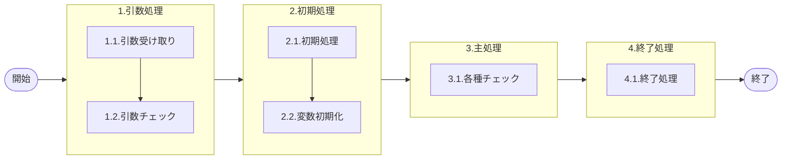

# 0. 表紙

| モジュール名 | プログラムID | プログラム名 |
| --- | --- | --- |
| IC | LDAS0305 | Valid／リーダー入力利用権限チェック |


| RFC        | Version | 更新日      | 更新者 | 更新内容 | 確認日 | 確認者 | 承認日     | 承認者 |
| ---------- | :-----: | ----------- | :----: | -------- | ------ | :----: | ---------- | :----: |
| - |  1.0.0  | 2025/09/11 |  鈴木祐介  | 初版作成   | 2025/XX/XX  |  XXX  | 2025/XX/XX |  XXX  |

## 1. 処理概要

### 1.1. 機能概要

- パラメータで渡された情報から対象の報告が実施可能かチェックする処理
- 【各種チェック】
  - １．カード種類チェック
    - 社外報告時のカード限定チェック
  - ２．独立所要量報告時
    - 独立所要量の存在チェック
    - 報告例外チェック（Parts/CKDetc）
  - ３．独立所要量以外（社外）
    - 会社の整合性チェック
  - ４．独立所要量以外（社内）
    - ユーザーIDの報告可能ＳＵチェック
  - 補足１：特殊権限時には２，３のチェックは未実施
  - 補足２：ユーザーIDと使用者で報告時ユーザー別SUマスタを検索し、対象データが存在チェック

### 1.2. 処理概要フロー

### 1.3. プログラム入出力パラメータ

#### 1.3.1. 引数

| No. | パラメータ論理名 | パラメータ物理名 | 属性 | 備考 |
| --- | --- | --- | --- | --- |
| 1 | カード識別 | ps_card_id | VARCHAR |  |
| 2 | 取引先代表コード | ps_public_org_code | VARCHAR |  |
| 3 | ユーザーID | ps_input_user_id | VARCHAR |  |
| 4 | 品目番号 | ps_itemno | VARCHAR |  |
| 5 | 供給者 | ps_supplier | VARCHAR |  |
| 6 | 使用者 | ps_usercd | VARCHAR |  |
| 7 | オーダー番号 | ps_order_no | VARCHAR |  |
| 8 | 特殊権限サイン | ps_sp_auth_sign | VARCHAR | 1:生産管理/2:購買管理/3:部品部/4:鋳造管理 |


#### 1.3.2. 戻り値

| No. | パラメータ論理名 | パラメータ物理名 | 属性 | 備考 |
| --- | --- | --- | --- | --- |
| 1 | ステータス | rn_status | INTEGER |  |
| 2 | SQLコード | rs_sql_code | VARCHAR |  |
| 3 | エラーコード | rs_err_code | VARCHAR |  |
| 4 | エラーメッセージ | rs_err_msg | VARCHAR |  |
| 5 | エラー位置 | rs_err_focus | VARCHAR |  |
| 6 | 存在ステータス | rs_exist_status | VARCHAR |  |


### 1.4. その他制御・要件

| 排他制御 |  |  |
| --- | --- | --- |
| 楽観 | 悲観 | 無し |
| 〇 | - | - |

| 項目 | 制約・制御・要件など | 記載内容説明 |
| --- | --- | --- |
| パフォーマンス要件 | 特になし。 |  |

### 1.5. 入出力一覧

| No | 入出力対象 | 名称 | 物理名称 | ID | C | R | U | D | 備考 |
| --- | --- | --- | --- | --- | --- | --- | --- | --- | --- |
| 1 | テーブル | 独立所要量明細 | le_trn_ird |  |  | ○ |  |  |  |
| 2 | テーブル | リテラル防止要素 | lz_anti_literal_element |  |  | ○ |  |  |  |
| 3 | テーブル | GIMACDATE | lz_gimac_date |  |  | ○ |  |  | 旧名称：PYMACDATE |
| 4 | テーブル | GIMACエリア構成 | la_areastrc |  |  | ○ |  |  | 組織会社情報から参照先変更 |
| 5 | テーブル | GIMACエリアマスタ | la_area_master |  |  | ○ |  |  | GIMACエリア構成を参照するために必要 |
| 6 | テーブル | SUマスタ | la_area_master_su |  |  | ○ |  |  | GIMACエリア構成を参照するために必要 |
| 7 | テーブル | 報告時ユーザー別SUマスタ | ld_mst_report_su |  |  | ○ |  |  |  |
| 8 |  |  |  |  |  |  |  |  |  |
| 9 |  |  |  |  |  |  |  |  |  |
| 10 |  |  |  |  |  |  |  |  |  |


## 2. 詳細処理

### 2.1. 引数の取得とチェック
- 戻り値の初期値セット

### 2.2. 初期処理
- 特記なし

### 2.3. 主処理
#### 2.3.1. カード種類チェック
- 社外報告時のカード限定チェック
- TRIM(引数.カード識別) が（'11','22','33','44','55','T'）以外の場合、エラーメッセージを出力し処理終了。
  - エラーコード : ld.E.LDP10011
  - エラーメッセージ : 'Subtraction value error has occurred in the internal processing. Contact the staff in charge of the system.　Argument Error : [引数.カード識別] = ' || COALESCE(引数.カード識別, 'NULL');
    - (処理内部にて引数値エラーが発生しました  システム管理者に連絡してください)
  - エラー位置： 'LDAS0305';

- 【品目番号チェック】
- 引数.品目番号が　NULL　または　 ブランク 　の場合、エラーメッセージを出力し処理終了
  - エラーコード : ld.E.LDP10011
  - エラーメッセージ : 'Subtraction value error has occurred in the internal processing. Contact the staff in charge of the system.　Argument Error : [引数.品目番号] = ' || COALESCE(引数.品目番号, 'NULL');
  - (処理内部にて引数値エラーが発生しました  システム管理者に連絡してください)
  - エラー位置： 'LDAS0305';（品目番号）

- 【供給者チェック】
- 引数.供給者が　NULL　または　 ブランク 　の場合、エラーメッセージを出力し処理終了
  - エラーコード : ld.E.LDP10011
  - エラーメッセージ : 'Subtraction value error has occurred in the internal processing. Contact the staff in charge of the system.　Argument Error : [引数.供給者] = ' || COALESCE(引数.供給者, 'NULL');
  - (処理内部にて引数値エラーが発生しました  システム管理者に連絡してください)
  - エラー位置： 'LDAS0305';（供給者）

- 【使用者チェック】
- 引数.使用者が　NULL　または　 ブランク 　の場合、エラーメッセージを出力し処理終了
  - エラーコード : ld.E.LDP10011
  - エラーメッセージ : 'Subtraction value error has occurred in the internal processing. Contact the staff in charge of the system.　Argument Error : [引数.使用者] = ' || COALESCE(引数.使用者, 'NULL');
  - (処理内部にて引数値エラーが発生しました  システム管理者に連絡してください)
  - エラー位置： 'LDAS0305';（使用者）

- 【特殊権限サインチェック】
- 引数.特殊権限サインが　NULL　または　 ブランク 　の場合、エラーメッセージを出力し処理終了
  - エラーコード : ld.E.LDP10011
  - エラーメッセージ : 'Subtraction value error has occurred in the internal processing. Contact the staff in charge of the system.　Argument Error : [引数.特殊権限サイン] = ' || COALESCE(引数.特殊権限サイン, 'NULL');
  - (処理内部にて引数値エラーが発生しました  システム管理者に連絡してください) 
  - エラー位置： 'LDAS0305';

- 【取引先代表コード】
- 引数.取引先代表コードが　NULL　または　 ブランク 　の場合、エラーメッセージを出力し処理終了
  - エラーコード : ld.E.LDP10011
  - エラーメッセージ : 'Subtraction value error has occurred in the internal processing. Contact the staff in charge of the system.　Argument Error : [引数.取引先代表コード] = ' || COALESCE(引数.取引先代表コード, 'NULL');
  - (処理内部にて引数値エラーが発生しました  システム管理者に連絡してください)
  - エラー位置： 'LDAS0305';
   
#### 2.3.2. 独立所要量チェック
##### 2.3.2.1. 独立所要量の存在チェック
- カード識別が'33'(独立所要量)の時,独立所要量明細から対象品目の存在チェックを行う。
```sql
IF EXISTS( SELECT 1
            FROM 独立所要量明細
            WHERE 品目番号 = 引数.品目番号
            AND 供給者 = 引数.供給者
            AND 使用者 = 引数.使用者
            AND オーダー番号 = 引数.オーダー番号
            AND 削除日 = ' ')THEN
 ```
  - 存在しない場合、エラーメッセージを出力し処理終了する。
    - エラーコード : ld.E.LDP10012
    - エラーメッセージ : 'Not an object of the input. Existence Check Error: ' || '[ 引数.品目番号  ] = ' ||
                            COALESCE( 引数.品目番号 , 'NULL' ) || ' [ 引数.供給者  ] = ' ||
                            COALESCE( 引数.供給者 , 'NULL' )|| ' [ 引数.使用者  ] = ' ||
                            COALESCE( 引数.使用者 , 'NULL' )|| ' [ 引数.オーダー番号  ] = ' ||
                            COALESCE( 引数.オーダー番号 , 'NULL' ); 
    - エラー位置： 'LDAS0305'

   - 存在する場合、費用振替コード、独立需要送り先コード、相手先システム識別を検索する
      ```sql
      SELECT 費用振替コード、独立需要送り先コード、相手先システム識別
      FROM 独立所要量明細
      WHERE 品目番号 = 引数.品目番号
      AND 供給者 = 引数.供給者
      AND 使用者 = 引数.使用者
      AND オーダー番号 = 引数.オーダー番号
      AND 削除日 = 引数.削除日;
      ```

##### 2.3.2.2. 報告例外チェック（Parts/CKDetc）
- オーダー番号の頭１桁目が 'J' または 'R' の時
  - リテラル防止要素から識別コードが「部品事業部コード」で制御キー１が「引数.費用振替コード」の情報が存在するかチェックを行う。
  ```sql
  IF EXISTS( SELECT 1
              FROM リテラル防止要素
              WHERE システムコード = 引数.システムコード
              AND 識別コード = 'LDA00014'
              AND 制御キー1 = 引数.費用振替先コード)THEN
  ```
  - 存在する場合、エラーメッセージを出力し処理終了
    - エラーコード : ld.E.LDP10012
      - エラーメッセージ : 'Not an object of the input. Existence Check Error: ' || ' [ 費用振替先コード  ] = ' || 
        COALESCE( 費用振替先コード , 'NULL' );
      - (入力対象ではありません)  
      - エラー位置： 'LDAS0305'

  - リテラル防止要素から識別コードが「納入報告時対象外送り先コード」、制御キー１が「IND_USER_CODE」の情報が存在するかチェックを行う。
  ```sql
  IF EXISTS( SELECT 1
              FROM リテラル防止要素
              WHERE システムコード = 引数.システムコード
              AND 識別コード = 'LDA0004'
              AND 制御キー1 = 'IND_USER_CODE'
              AND 置換内容1 = 独立所要量明細.独立需要送り先コード)THEN
  ```

  - 存在する場合、
  　さらに、リテラル防止要素から識別コードが「納入報告時対象外送り先コード」、制御キー１が「REQUEST_SYSTEM_CODE」の情報が存在するかチェックを行う。
    ```sql
    IF EXISTS( SELECT 1
                FROM リテラル防止要素
                WHERE システムコード = 引数.システムコード
                AND 識別コード = 'LDA0004'
                AND 制御キー1 = 'REQUEST_SYSTEM_CODE'
                AND 置換内容1 = 独立所要量明細.相手先システム識別コード)THEN
    ```
    - 上記２つが存在する場合
      - エラーコード : ld.E.LDP10012
        - エラーメッセージ : 'Not an object of the input.　Existence Check Error: ' || ' [ 独立所要量明細.相手先システム識別コード  ] = ' || COALESCE(独立所要量明細.相手先システム識別コード , 'NULL');
        - (入力対象ではありません)
        - エラー位置： 'LDAS0305'

##### 2.3.3. 独立所要量以外（社外）
##### 2.3.3.1.  会社の整合性チェック
- オーダー番号の頭１桁目が 'J' または 'R' ではない時、
  - 特殊権限サイン = "0"(無し) の時
    - 取引先代表コードが　NULL　または　ブランク　ではない場合、
    　GIMAC DATEテーブルからGIMAC日を検索する。
    ```sql
    SELECT  GIMAC日
    FROM  GIMAC DATEテーブル;
    ```

    - GIMACエリア構成、GIMACエリアマスタ、SUマスタから存在チェックを行う
    ```sql
    -- 取引先代表コードが組織タイプ、組織コード取得で使用していたが2，今回エリアコードになっているため、廃止
    -- 変更が入る可能性あり
    IF NOT EXISTS(SELECT  1
                  FROM  GIMACエリア構成 strc
                        ,GIMACエリアマスタ mst
                        ,SUマスタ su
                  WHERE su.SUコード =  引数.使用者
                    AND mst.エリアコード = su.エリアコード
                    AND strc.エリアコード = su.エリアコード
                    AND strc.エリア構成タイプ = 'X') THEN

              -- NEXT時の条件もコメントとして載せておく
              --    WHERE  flt.bottom_org_type = '000'
              --      AND  flt.bottom_org_code = ps_usercd
              --      AND  org.public_org_code = ps_public_org_code
              --      AND  org.sys_owner_cd    = flt.sys_owner_cd
              --      AND  flt.org_strc_type_code = 'X'
              --      AND  org.org_type        = flt.top_org_type
              --      AND  org.org_code        = flt.top_org_code
              --      AND flt.exp_in_eff_ymd <= ls_pymac_date
              --     AND flt.exp_out_eff_ymd > ls_pymac_date
              --     AND flt.top_org_category   = '51'
              --      AND flt.bottom_org_category ='56') THEN
    ```
    - 存在する場合、エラーメッセージを出力し処理終了
      -  エラーコード : ld.E.LDP10012
      - エラーメッセージ : 'Not an object of the input. Existence Check Error: ' ||
                          ' [ 引数.組織代表タイプ  ] = ' ||
                          COALESCE(引数.組織代表タイプ , 'NULL') ||
                          ' [ 引数.使用者  ] = ' ||
                          COALESCE(引数．使用者 , 'NULL');
      - (入力対象ではありません)  
      - エラー位置： 'LDAS0305'


##### 2.3.4. 独立所要量以外（社内）
- ユーザーIDの報告可能SUチェック
   - 取引先代表コードが　NULL　または　ブランク　の場合、
     - 引数.ユーザーIDが　NULL　または　ブランク　ではない場合、
     - 報告時ユーザー別SUマスタにユーザーIDが存在するか存在チェックを行う
        ```sql
        IF EXISTS (SELECT  1
                    FROM  報告時ユーザー別SUマスタ
                    WHERE  ユーザーID = 引数.ユーザーID) THEN
        ```
       - 存在する場合、報告時ユーザー別SUマスタから引数.ユーザーID、処理対象クラス in ('2'(出荷連絡報告対象S/U),'3'(出荷連絡報告対象P/F))、引数.使用者で存在チェックを行う
          ```sql
            IF NOT EXISTS (SELECT  1
                            FROM  報告時ユーザー別SUマスタ
                            WHERE  ユーザーID = 引数.ユーザーID
                            AND 処理対象クラス in (2,3)       -- ※条件に変更が入る可能性あり
                            AND SUコード = 引数.使用者) THEN
          ```        
          - 存在しないエラーメッセージを出力し処理を終了
            - エラーコード : ld.E.LDP10012
            - エラーメッセージ : 'Not an object of the input.  Existence Check Error: ' || ' [ 費用振替先コード  ] = ' || 
            COALESCE( 費用振替先コード , 'NULL' );
            - (入力対象ではありません)  
            - エラー位置： 'LDAS0305'


### 2.4. 終了処理
- 正常終了処理を行う

| 戻り値           | 設定値   |
| ---------------- | -------- |
| 処理ステータス   | 0        |
| SQL コード       | スペース |
| エラーコード     | スペース |
| エラーメッセージ | スペース |
| エラー位置 | スペース |

### 3. 補足説明
- 【基本設計からの変更】
  - 組織会社情報をGIMACエリア構成に変更、そのため、GIMACエリア構成テーブルから情報を取得するためにSUマスタとGIMACエリアマスタを経由する必要があり、SUマスタとGIMACエリアマスタも追記。
  - フラット組織構成テーブル廃止(la_orgflat)
    - GIMACエリア構成を参照する
  - パラメータのホスト名をユーザーIDに変更

### 3.1. 戻り値について
- ステータスについて
  0 : Normal End
  -1 : Abnormal End
  -2 : PGM エラー

### 3.2. エラー発生時の対応について
- SQL エラーが発生した場合、エラーログを出力して処理終了
