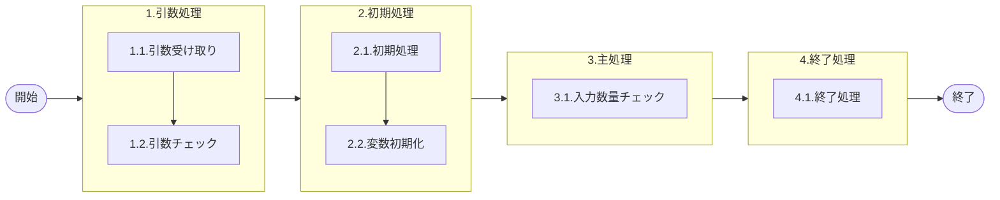

# 0. 表紙

| モジュール名 | プログラムID | プログラム名 |
| --- | --- | --- |
| IC | LDAS0306 | Valid／リーダー入力数量チェック |

| RFC        | Version | 更新日      | 更新者 | 更新内容 | 確認日 | 確認者 | 承認日     | 承認者 |
| ---------- | :-----: | ----------- | :----: | -------- | ------ | :----: | ---------- | :----: |
| - |  1.0.0  | 2025/09/19 |  鈴木祐介  | 初版作成   | 2025/XX/XX  |  XXX  | 2025/XX/XX |  XXX  |

## 1. 処理概要

### 1.1. 機能概要

引数で渡された情報から対象のカード数量をチェックする処理

### 1.2. 処理概要フロー

### 1.3. プログラム入出力パラメータ

#### 1.3.1. 引数

| No. | パラメータ論理名 | パラメータ物理名 | 属性 | 備考 |
| --- | --- | --- | --- | --- |
| 1 | カード識別(オーダ種類) | ps_card_id | VARCHAR | 11(完成報告カード（シンクロ）)、22(納入及び生試完成報告カード（オーダー№付）)、33（独立所要量）、44(Ｗビンカード（シンクロ）)、55(引取シンクロカード)、T（時間納入）|
| 2 | 処理数量 | pn_compqty | DECIMAL |  |
| 3 | 入力数量/バーコード数量 | pn_inputqty | DECIMAL |  |
| 4 | 処理区分 | ps_process_kind | VARCHAR | “0”：完納/“1”：分納/“2”：＋訂正/“3”：－訂正 |

#### 1.3.2. 戻り値

| No. | パラメータ論理名 | パラメータ物理名 | 属性 | 備考 |
| --- | --- | --- | --- | --- |
| 1 | ステータス | rn_status | INTEGER | 0:NormalEnd/-1:SQLError |
| 2 | SQLコード | rs_sql_code | VARCHAR |  |
| 3 | エラーコード | rs_err_code | VARCHAR |  |
| 4 | エラーメッセージ | rs_err_msg | VARCHAR |  |
| 5 | エラー位置 | rs_err_focus | VARCHAR |  |
| 6 | 存在ステータス | rs_exist_status | VARCHAR |  |

### 1.4. その他制御・要件

| 排他制御 |  |  |
| --- | --- | --- |
| 楽観 | 悲観 | 無し |
| 〇 | - | - |

| 項目 | 制約・制御・要件など | 記載内容説明 |
| --- | --- | --- |
| パフォーマンス要件 | 特になし。 |  |

### 1.5. 入出力一覧

| No | 入出力対象 | 名称 | 物理名称 | ID | C | R | U | D | 備考 |
| --- | --- | --- | --- | --- | --- | --- | --- | --- | --- |
| 1 |  | なし |  |  |  |  |  |  |  |
| 2 |  |  |  |  |  |  |  |  |  |
| 3 |  |  |  |  |  |  |  |  |  |
| 4 |  |  |  |  |  |  |  |  |  |
| 5 |  |  |  |  |  |  |  |  |  |
| 6 |  |  |  |  |  |  |  |  |  |
| 7 |  |  |  |  |  |  |  |  |  |
| 8 |  |  |  |  |  |  |  |  |  |
| 9 |  |  |  |  |  |  |  |  |  |
| 10 |  |  |  |  |  |  |  |  |  |

## 2. 詳細処理

### 2.1. 引数の取得とチェック
- カード識別が　NULL　または　("22","33","T","11","44","55","Z")以外の時、エラーメッセージを出力し処理終了
  - エラーコード：E.LDP10011
  - エラーメッセージ："Subtraction value error has occurred in the internal processing. Contact the staff in charge of the system."
  - (処理内部にて引数値エラーが発生しました  システム管理者に連絡してください)
  - エラー位置：'LDAS0306'
  
- 処理数量が NULL の場合
  - エラーコード：E.LDP10011
  - エラーメッセージ："Subtraction value error has occurred in the internal processing. Contact the staff in charge of the system."
  - (処理内部にて引数値エラーが発生しました  システム管理者に連絡してください)

- 入力数量/バーコード数量が NULL の場合
  - エラーコード：E.LDP10011
  - エラーメッセージ："Subtraction value error has occurred in the internal processing. Contact the staff in charge of the system."
  - (処理内部にて引数値エラーが発生しました  システム管理者に連絡してください)

- 処理区分が NULL または ("0"(完納),"1"(分納),"2"(+訂正),"3"(-訂正))ではない時　
  - エラーコード：E.LDP10011
  - エラーメッセージ："Subtraction value error has occurred in the internal processing. Contact the staff in charge of the system."
  - (処理内部にて引数値エラーが発生しました  システム管理者に連絡してください)
  - エラー位置：'LDAS0306'

### 2.2. 初期処理
- 特記なし
### 2.3. 主処理
### 2.3.1. 完納処理
- 引数.処理区分が"0"(完納)の場合
  - 引数.カード識別が("22","33","44")の時
    - 引数.処理数量が0でなければ、エラーメッセージを出力し処理終了
      - エラーコード：E.LDP10008
      - エラーメッセージ："Excess report"
      - (過剰報告です)
      - エラー位置：'LDAS0306'
    - 引数.カード識別が"T"(ピッキング)の時
      - 引数.処理数量 より 引数.入力数量/バーコード数量　が多い場合、エラーメッセージを出力し処理終了
        - エラーコード：E.LDP10008
        - エラーメッセージ："Excess report"
        - (過剰報告です)
        - エラー位置：'LDAS0306'
         
### 2.3.2. 分納処理
- 引数.処理区分が"1"(分納)の場合
  - 引数.カード識別が("22","33","44","T")の時
    - 引数.処理数量 より 引数.入力数量/バーコード数量　が多い場合、エラーメッセージを出力し処理終了
      - エラーコード：E.LDP10008
      - エラーメッセージ："Excess report"
      - (過剰報告です)
      - エラー位置：'LDAS0306' 

### 2.3.3. +訂正処理
- 引数.処理区分が"2"(+訂正)の場合
  - 引数.カード識別が("22","33","44","T")の時
    - 引数.処理数量 より 引数.入力数量/バーコード数量　が多い場合、エラーメッセージを出力し処理終了
      - エラーコード：E.LDP10009
      - エラーメッセージ："Correction quantity is not proper(Correction quantity is more than order remain quantity)."
      - (訂正数が不正です（発注残＜訂正数）)
      - エラー位置：'LDAS0306' 
### 2.3.4. -訂正処理
- 引数.処理区分が"3"(-訂正)の場合
  - 引数.処理数量 より 引数.入力数量/バーコード数量　が多い場合、エラーメッセージを出力し処理終了
    - エラーコード：E.LDP10010
    - エラーメッセージ："Correction quantity is not proper(Correction quantity is more than receipt quantity)."
    - (訂正数が不正です（受領数＜訂正数）)
    - エラー位置：'LDAS0306' 
       
### 2.4. 終了処理
- 正常終了処理を行う

| 戻り値           | 設定値   |
| ---------------- | -------- |
| 処理ステータス   | 0        |
| SQL コード       | スペース |
| エラーコード     | スペース |
| エラーメッセージ | スペース |
| エラー位置 | スペース |

## 3. 補足説明

### 3.1. 戻り値について
- ステータスについて
  0 : Normal End
  -1 : Abnormal End
  -2 : PGM エラー

### 3.2. エラー発生時の対応について
- SQL エラーが発生した場合、エラーログを出力して処理終了
- エラー位置について
  - エラーが起こった際、対象のプログラムIDを返す。
  - エラー位置： 'LDAS0306'

### 3.3. カード識別番号について
- 11(完成報告カード（シンクロ）)、22(納入及び生試完成報告カード（オーダー№付）)、33（独立所要量）、44(Ｗビンカード（シンクロ）)、55(引取シンクロカード)、T（時間納入）については、前処理である「Valid／リーダー入力チェック・納品書No」で変換し、カード識別で渡される想定。

