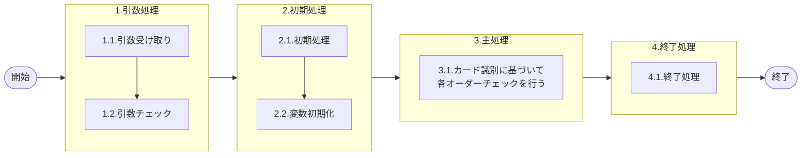

# 0. 表紙

| モジュール名 | プログラムID | プログラム名            |
| ------------ | ------------ | ----------------------- |
| IC           | LDAS0307     | Valid／オーダーチェック |

| RFC       | Version | 更新日     | 更新者 | 更新内容 | 確認日     | 確認者 | 承認日     | 承認者 |
| --------- | :-----: | ---------- | :----: | -------- | ---------- | :----: | ---------- | :----: |
| - |  1.0.0  | 2025/09/25 |  鈴木祐介  | 初版作成 | 2025/XX/XX |  XXX  | 2025/XX/XX |  XXX  |

## 1. 処理概要

### 1.1. 機能概要

指定の条件にて、オーダーが存在するかチェックする。
補足
Y0B(納品書)、Y0D(検査票)、Y0E(現品票)、Y0C(完成報告カード)、Y0P(完成報告現品票)、Y0K(ピッキング)GIMACカード番号から識別コードに変換しカード識別として渡されてくる

### 1.2. 処理概要フロー



### 1.3. プログラム入出力パラメータ

#### 1.3.1. 引数

| No. | パラメータ論理名 | パラメータ物理名    | 属性    | 備考                                                                                                      |
| --- | ---------------- | ------------------- | ------- | --------------------------------------------------------------------------------------------------------- |
| 1   | カード識別       | ps_card_id          | VARCHAR | 11(完成報告カード（シンクロ）)、22(納入及び生試完成報告カード（オーダー№付）)、33（独立所要量）、44(Ｗビンカード（シンクロ）)、55(引取シンクロカード)、T（時間納入）|
| 2   | 処理識別         | ps_cmp_par_crr_sign | VARCHAR | 0(完納)、1(分納)、2(＋訂正)、3(－訂正)                                                                    |
| 3   | 品目番号         | ps_itemno           | VARCHAR |                                                                                                           |
| 4   | 供給者           | ps_supplier         | VARCHAR |                                                                                                           |
| 5   | 使用者           | ps_usercd           | VARCHAR |                                                                                                           |
| 6   | オーダー番号     | ps_order_no         | VARCHAR |                                                                                                           |
| 7   | 報告数量         | pn_qty              | DECIMAL |                                                                                                           |
| 8   |                  |                     |         |                                                                                                           |

#### 1.3.2. 戻り値

| No. | パラメータ論理名 | パラメータ物理名 | 属性    | 備考                                          |
| --- | ---------------- | ---------------- | ------- | --------------------------------------------- |
| 1   | 処理ステータス   | rn_status        | INTEGER | 0:NormalEnd,-1:SQLError/-2:PGError,1:警告発生 |
| 2   | SQLコード        | rs_sql_code      | VARCHAR |                                               |
| 3   | エラーコード     | rs_err_code      | VARCHAR |                                               |
| 4   | エラーメッセージ | rs_err_msg       | VARCHAR |                                               |
| 4   | エラー位置       | rs_err_focus     | VARCHAR |                                               |
| 5   | 処理日           | rs_disburse_date | VARCHAR | YYYYMMDD                                      |
| 6   | 数量             | rn_qty           | DECIMAL |                                               |

### 1.4. その他制御・要件

| 排他制御 |      |      |
| -------- | ---- | ---- |
| 楽観     | 悲観 | 無し |
| 〇       | -    | -    |

| 項目               | 制約・制御・要件など | 記載内容説明 |
| ------------------ | -------------------- | ------------ |
| パフォーマンス要件 | 特になし。           |              |

### 1.5. 入出力一覧

| No | 入出力対象 | 名称                     | 物理名称               | ID | C | R  | U | D | 備考 |
| -- | ---------- | ------------------------ | ---------------------- | -- | - | -- | - | - | ---- |
| 1  | テーブル   | オーダー明細             | le_trn_order           |    |   | 〇 |   |   |      |
| 2  | テーブル   | 独立所要量明細           | le_trn_ird             |    |   | 〇 |   |   |      |
| 3  | テーブル   | 品目マスター             | la_itemmast            |    |   | 〇 |   |   |      |
| 4  | テーブル   | 機能オプションパラメータ | lz_function_parameter  |    |   | 〇 |   |   |      |
| 5  | テーブル   | MRP情報値                | le_mst_mrp_information |    |   | 〇 |   |   |      |

## 2. 詳細処理

### 2.1. 引数の取得とチェック

- カード識別が("22","33","T","11","44","55","Z")以外の時、エラーメッセージを出力し処理終了

  - エラーコード：E.LDP10011
  - エラーメッセージ："Subtraction value error has occurred in the internal processing. Contact the staff in charge of the system. Argument Error : [引数.カード識別] = " || COALESCE(引数.カード識別, 'NULL');
  - (処理内部にて引数値エラーが発生しました  システム管理者に連絡してください)
  - エラー位置：'LDAS0307'
- カード識別が("22","33","T","44")の時、

  - オーダー番号が NULL もしくは ブランク　であれば、エラーメッセージを出力し処理終了
    - エラーコード：E.LDP10011
    - エラーメッセージ："Subtraction value error has occurred in the internal processing. Contact the staff in charge of the system. Argument Error : [引数.カード識別] = " || COALESCE(引数.カード識別, 'NULL');
    - (処理内部にて引数値エラーが発生しました  システム管理者に連絡してください)
  - エラー位置：'LDAS0307'
- 処理識別が 0(完納)、1(分納)、2(＋訂正)、3(－訂正) 以外の時、エラーメッセージを出力し処理終了

  - エラーコード：E.LDP10011 　
  - エラーメッセージ："Subtraction value error has occurred in the internal processing. Contact the staff in charge of the system. Argument Error : [引数.処理識別] = " || COALESCE(引数.処理識別, 'NULL');
  - (処理内部にて引数値エラーが発生しました  システム管理者に連絡してください)
  - エラー位置：'LDAS0307'
- 引数.品目番号が NULL もしくは ブランクの時、エラーメッセージを出力し処理終了

  - エラーコード：E.LDP10011 　
  - エラーメッセージ："Subtraction value error has occurred in the internal processing. Contact the staff in charge of the system. Argument Error : [引数.品目番号] = " || COALESCE(引数.品目番号, 'NULL');
  - (処理内部にて引数値エラーが発生しました  システム管理者に連絡してください)
  - エラー位置：'LDAS0307'
- 引数.供給者が NULL もしくは ブランクの時、エラーメッセージを出力し処理終了

  - エラーコード：E.LDP10011 　
  - エラーメッセージ："Subtraction value error has occurred in the internal processing. Contact the staff in charge of the system. Argument Error : [引数.供給者] = " || COALESCE(引数.供給者, 'NULL');
  - (処理内部にて引数値エラーが発生しました  システム管理者に連絡してください)
  - エラー位置：'LDAS0307'
- 引数.使用者が NULL もしくは ブランクの時、エラーメッセージを出力し処理終了

  - エラーコード：E.LDP10011 　
  - エラーメッセージ："Subtraction value error has occurred in the internal processing. Contact the staff in charge of the system. Argument Error : [引数.使用者] = " || COALESCE(引数.使用者, 'NULL');
  - (処理内部にて引数値エラーが発生しました  システム管理者に連絡してください)
  - エラー位置：'LDAS0307'
- 引数.数量が NULL もしくは 数量がマイナスになる　時、エラーメッセージを出力し処理終了

  - エラーコード：E.LDP10011
  - エラーメッセージ："Subtraction value error has occurred in the internal processing. Contact the staff in charge of the system. Argument Error : [引数.数量] = " || COALESCE(引数.数量, 'NULL');
  - (処理内部にて引数値エラーが発生しました  システム管理者に連絡してください)
  - エラー位置：'LDAS0307'

### 2.2. 初期処理

特記なし

### 2.3. 主処理

### 2.3.1. カード識別が'T'(時間納入)の場合

#### 2.3.1.1. オーダー明細存在チェック

　- オーダー明細から対象品目の情報が存在するかチェックを行う。

```sql
  IF NOT EXISTS( SELECT 1
                FROM オーダー明細
                WHERE 品目番号 = 引数.品目番号
                AND 供給者 = 引数.供給者
                AND 使用者 = 引数.使用者
                AND オーダー番号 = 引数.オーダー番号
                AND 削除日 = '')THEN
```

- 存在しない場合、エラーメッセージを出力し処理終了

  - エラーコード：E.LDP10013
  - エラーメッセージ："The registration processing has been completed. (But some records cannot be updated because of an error.) Error: ' || '[ 引数.品目番号  ] = ' || COALESCE( 引数.品目番号 , 'NULL' ) || ' [ 引数.供給者  ] = ' || COALESCE( 引数.供給者 , 'NULL' ) ||' [ 引数.使用者  ] = ' || COALESCE( 引数.使用者 , 'NULL' ) ||' [ 引数.オーダー番号  ] = ' ||COALESCE( 引数.オーダー番号 , 'NULL' );
  - (登録処理終了（一部レコードはエラーのため未更新）)
  - エラー位置：'LDAS0307'
- 存在する場合、オーダー明細から品目情報をもとに　払出日、入庫数、オーダー残数　を検索する

  ```sql
  SELECT  払出日
        ,入庫数
        ,オーダー残数
  FROM  オーダー明細
  WHERE  品目番号 = 引数.品目番号
    AND  供給者   = 引数.供給者
    AND  使用者   = 引数.使用者
    AND  オーダー番号 = 引数.オーダー番号
    AND  削除日   = '';
  ```

#### 2.3.1.2. 処理識別が'3'(－訂正)の時

- 数量にオーダー明細.入庫数をセット
- 払出日にブランクをセット
- ※検査中区分、検査中数量廃止に伴いの処理を削除

#### 2.3.1.3. 処理識別が'3'(－訂正)以外の時

- 数量にオーダー明細.オーダー残数をセットする
- 払出日に引数.払出日をセットする
- オーダー明細に　品目情報、削除日が''、生試初品区分が '2'(生試)、シンクロ管理コードが'1'(シンクロ管理部品)ではないコード　が存在するかチェックを行う。

  ```sql
        IF NOT EXISTS( SELECT  1
                       FROM  オーダー明細
                      WHERE  品目番号      = 引数.品目番号
                        AND  供給者        = 引数.供給者
                        AND  使用者        = 引数.使用者
                        AND  削除日 　　   = ''
                        AND  生試初品区分  = '2'（生試）
                        AND  シンクロ管理コード <> '1'（シンクロ管理部品） ) THEN
  ```

  - 存在しない場合、MRP情報値から品目情報、Wビン管理コードが'1'(Wビン管理部品)ではないコード　で存在するかチェックを行う。

    ```sql
      IF NOT EXISTS( SELECT  1
                      FROM  MRP情報値
                    WHERE  品目番号      = 引数.品目番号
                      AND  供給者        = 引数.供給者
                      AND  使用者        = 引数.使用者
                      AND  Wビン管理コード <> '1'（Wビン管理部品） ) THEN
    ```

    - 存在しない場合、エラーメッセージを出力し処理終了
      - エラーコード：E.LDP10012
      - エラーメッセージ："Subtraction value error has occurred in the internal processing. Contact the staff in charge of the system. The MRP Info. is not exist Error: ' || '[ 引数.品目番号  ] = ' || COALESCE( 引数.品目番号 , 'NULL' ) || ' [ 引数.供給者  ] = ' || COALESCE( 引数.供給者 , 'NULL' ) ||' [ 引数.使用者  ] = ' || COALESCE( 引数.使用者 , 'NULL' );
      - (登録処理終了（一部レコードはエラーのため未更新）)
      - エラー位置：'LDAS0307'

  #### 2.3.1.4. 処理識別が'3'(-訂正)の時


  ```sql
    IF NOT EXISTS( SELECT  1
                    FROM  オーダー明細
                  WHERE  品目番号      = 引数.品目番号
                    AND  供給者        = 引数.供給者
                    AND  使用者        = 引数.使用者
                    AND  オーダー番号   = 引数.オーダー番号
                    AND  削除日 　　   = ''
                    AND  オーダーステータス <> in ('2','9') ) THEN
  ```

  - 存在しない場合、エラーメッセージを出力し処理終了
    - エラーコード：E.LDP10013
    - エラーメッセージ："Subtraction value error has occurred in the internal processing. Contact the staff in charge of the system. The Order is not exist Error: ' || '[ 引数.品目番号  ] = ' || COALESCE( 引数.品目番号 , 'NULL' ) || ' [ 引数.供給者  ] = ' || COALESCE( 引数.供給者 , 'NULL' ) ||' [ 引数.使用者  ] = ' || COALESCE( 引数.使用者 , 'NULL' ) ||' [ 引数.オーダー番号  ] = ' ||COALESCE( 引数.オーダー番号 , 'NULL' );
    - (登録処理終了（一部レコードはエラーのため未更新）)
    - エラー位置：'LDAS0307'

  #### 2.3.1.4. 処理識別が'3'(-訂正)以外の時

  -　オーダー明細から品目情報とオーダー番号、オーダーステータスが'2'(確定) で存在チェックを行う。

  ```sql
  IF NOT EXISTS( SELECT  1
                  FROM  オーダー明細
                WHERE  品目番号      = 引数.品目番号
                  AND  供給者        = 引数.供給者
                  AND  使用者        = 引数.使用者
                  AND  オーダー番号   = 引数.オーダー番号
                  AND  オーダーステータス = '2'(確定) ) THEN
  ```

  - 　オーダー明細から品目情報とオーダー番号、オーダーステータスが'2'(確定) で存在チェックを行う。

    ```sql
      IF EXISTS( SELECT  1
                      FROM  オーダー明細
                    WHERE  品目番号      = 引数.品目番号
                      AND  供給者        = 引数.供給者
                      AND  使用者        = 引数.使用者
                      AND  オーダー番号   = 引数.オーダー番号
                      AND  削除日 　　   = ''
                      AND  オーダーステータス = '9'(完了) ) THEN
    ```

    - 存在する場合、エラーメッセージを出力し処理終了

      - エラーコード：E.LDP10015
      - エラーメッセージ："Already entered. The Order is not exist Error: ' || '[ 引数.品目番号  ] = ' || COALESCE( 引数.品目番号 , 'NULL' ) || ' [ 引数.供給者  ] = ' || COALESCE( 引数.供給者 , 'NULL' ) ||' [ 引数.使用者  ] = ' || COALESCE( 引数.使用者 , 'NULL' ) ||' [ 引数.オーダー番号  ] = ' ||COALESCE( 引数.オーダー番号 , 'NULL' );
      - (入力済みです)
      - エラー位置：'LDAS0307'
    - 存在しない場合、エラーメッセージを出力し処理終了

      - エラーコード：E.LDP10016
      - エラーメッセージ："Fixed order does not exist. The Order is not exist Error: ' || '[ 引数.品目番号  ] = ' || COALESCE( 引数.品目番号 , 'NULL' ) || ' [ 引数.供給者  ] = ' || COALESCE( 引数.供給者 , 'NULL' ) ||' [ 引数.使用者  ] = ' || COALESCE( 引数.使用者 , 'NULL' ) ||' [ 引数.オーダー番号  ] = ' ||COALESCE( 引数.オーダー番号 , 'NULL' );
      - (確定オーダーがありません)
      - エラー位置：'LDAS0307'

### 2.3.2. カード識別が'11'(完成報告カード（シンクロ）)の場合

#### 2.3.2.1. オーダー明細存在チェック

-　 オーダー明細から品目情報、オーダー番号、削除日で存在チェックを行う。

```sql
    IF　NOT EXISTS( SELECT  1
                    FROM  オーダー明細
                  WHERE  品目番号      = 引数.品目番号
                    AND  供給者        = 引数.供給者
                    AND  使用者        = 引数.使用者
                    AND  オーダー番号   = 引数.オーダー番号
                    AND  削除日 　　   = '' ) THEN
```

- 存在しない場合、エラーメッセージを出力し処理終了

  - エラーコード：E.LDP10016
  - エラーメッセージ："Fixed order does not exist. The Order is not exist Error: ' || '[ 引数.品目番号  ] = ' || COALESCE( 引数.品目番号 , 'NULL' ) || ' [ 引数.供給者  ] = ' || COALESCE( 引数.供給者 , 'NULL' ) ||' [ 引数.使用者  ] = ' || COALESCE( 引数.使用者 , 'NULL' ) ||' [ 引数.オーダー番号  ] = ' ||COALESCE( 引数.オーダー番号 , 'NULL' );
  - (確定オーダーがありません)
  - エラー位置：'LDAS0307'
- 存在する場合、オーダー明細から報告数量合計取得

```sql
SELECT SUM(入庫数)
  FROM  オーダー明細
  WHERE  品目番号       = 引数.品目番号
    AND  供給者         = 引数.供給者
    AND  使用者         = 引数.使用者
    AND  削除日         = ''
```

- 戻り値.数量にオーダー明細.入庫数をセット
- 処理日に'  'をセット
- ※検査中区分、検査中数量廃止に伴いの処理を削除
- 品目マスタ、MRP情報値より引数.品目キー、品目クラスin('0'(梱包資材),'1'(原材料),'2'(部品),'7'(E/G))、品目ステータスが('1'(試作),'2'(生試))ではなく、AIRSサインが'1'(AIRS対象)ではない項目で情報を検索する

```sql
  IF NOT EXISTS( SELECT  1
                    FROM  品目マスタ    mst
                          ,MRP情報値    mrp
                  WHERE  mst.品目番号   = ps_itemno
                    AND  mst.供給者     = ps_supplier
                    AND  mst.使用者     = ps_usercd
                    AND  mst.品目クラス  in ( '0','1','2','7' )
                    AND  mst.品目ステータス not in ( '1','2' )
                    AND  mst.品目番号   = mrp.品目番号
                    AND  mst.供給者     = mrp.供給者
                    AND  mst.使用者     = mrp.使用者
                    AND  mrp.AIRSサイン   <> '1' ) THEN
```

- 存在しない場合、エラーメッセージを出力し処理終了
  - エラーコード：E.LDP10016
  - エラーメッセージ："Fixed order does not exist. The Order is not exist Error: ' || '[ 引数.品目番号  ] = ' || COALESCE( 引数.品目番号 , 'NULL' ) || ' [ 引数.供給者  ] = ' || COALESCE( 引数.供給者 , 'NULL' ) ||' [ 引数.使用者  ] = ' || COALESCE( 引数.使用者 , 'NULL' ) ||' [ 引数.オーダー番号  ] = ' ||COALESCE( 引数.オーダー番号 , 'NULL' );
  - (確定オーダーがありません)
  - エラー位置：'LDAS0307'

#### 2.3.2.2. 処理識別が'3'(-訂正)の時

- オーダー明細から引数.品目キー、削除日=''、MRP需要方針コードが'1'(生産計画品目)ではない、生試初品区分が'2'(生試)ではない、オーダーステータスin('2'(確定),'9'(完了))の項目で存在チェックを行う

```sql
IF NOT EXISTS( SELECT  1
                  FROM  オーダー明細
                WHERE  品目番号       = 引数.品目番号
                  AND  供給者     = 引数.供給者
                  AND  使用者       = 引数.使用者
                  AND  削除日   = ''
                  AND  MRP需要方針コード <> '1'(生産計画品目)
                  AND  生試初品区分 <> '2'(生試)
                  AND  オーダーステータス in ( '2'(確定),'9'(完了) ) ) THEN
```

- 存在しない場合、エラーメッセージを出力し処理終了

  - エラーコード：E.LDP10016
  - エラーメッセージ："Fixed order does not exist. The Order is not exist Error: ' || '[ 引数.品目番号  ] = ' || COALESCE( 引数.品目番号 , 'NULL' ) || ' [ 引数.供給者  ] = ' || COALESCE( 引数.供給者 , 'NULL' ) ||' [ 引数.使用者  ] = ' || COALESCE( 引数.使用者 , 'NULL' ) ||' [ 引数.オーダー番号  ] = ' ||COALESCE( 引数.オーダー番号 , 'NULL' );
  - (確定オーダーがありません)
  - エラー位置：'LDAS0307'
- 存在する場合、 引数.品目キー、MRP需要方針コードが'1'(生産計画品目)ではない、生試初品区分が'2'(生試)ではない、オーダーステータスが'2'(確定)の項目で存在チェックを行う

```sql
IF NOT EXISTS( SELECT  1
                  FROM  オーダー明細
                WHERE  品目番号       = 引数.品目番号
                  AND  供給者     = 引数.供給者
                  AND  使用者       = 引数.使用者
                  AND  MRP需要方針コード <> '1'(生産計画品目)
                  AND  生試初品区分 <> '2'(生試)
                  AND  オーダーステータス ='2'(確定) ) THEN
```

- 存在しない場合、引数.品目キー、MRP需要方針コードが'1'(生産計画品目)ではない、生試初品区分が'2'(生試)ではない、オーダーステータスが'9'(完了)の項目で存在チェックを行う

  ```sql
  IF EXISTS( SELECT  1
              FROM  オーダー明細
            WHERE  品目番号       = 引数.品目番号
              AND  供給者     = 引数.供給者
              AND  使用者       = 引数.使用者
              AND  MRP需要方針コード <> '1'(生産計画品目)
              AND  生試初品区分 <> '2'(生試)
              AND  オーダーステータス ='9'(完了) ) THEN
  ```

  - オーダーステータス'9'(完了)の情報が存在する場合、エラーメッセージを出力し処理終了

    - エラーコード：E.LDP10015
    - エラーメッセージ："Already entered. The Order is not exist Error: ' || '[ 引数.品目番号  ] = ' || COALESCE( 引数.品目番号 , 'NULL' ) || ' [ 引数.供給者  ] = ' || COALESCE( 引数.供給者 , 'NULL' ) ||' [ 引数.使用者  ] = ' || COALESCE( 引数.使用者 , 'NULL' ) ||' [ 引数.オーダー番号  ] = ' ||COALESCE( 引数.オーダー番号 , 'NULL' );
    - (入力済みです)
    - エラー位置：'LDAS0307'
  - オーダーステータス'9'(完了)の情報が存在しない場合、エラーメッセージを出力し処理終了

    - エラーコード：E.LDP10016
    - エラーメッセージ："Fixed order does not exist. The Order is not exist Error: ' || '[ 引数.品目番号  ] = ' || COALESCE( 引数.品目番号 , 'NULL' ) || ' [ 引数.供給者  ] = ' || COALESCE( 引数.供給者 , 'NULL' ) ||' [ 引数.使用者  ] = ' || COALESCE( 引数.使用者 , 'NULL' ) ||' [ 引数.オーダー番号  ] = ' ||COALESCE( 引数.オーダー番号 , 'NULL' );
    - (確定オーダーがありません)
    - エラー位置：'LDAS0307'

### 2.3.3. カード識別が'22'(納入及び生試完成報告カード（オーダー№付）)の場合

#### 2.3.3.1. S ≠ U の時

- オーダー明細から引数.品目キー、引数.オーダー番号、削除日が''で存在チェックを行う

  ```sql
  IF NOT EXISTS( SELECT  1
                FROM  オーダー番号
              WHERE  品目番号       = 引数.品目番号
                AND  供給者     　 = 引数.供給者
                AND  使用者        = 引数.使用者
                AND  オーダー番号      = 引数.オーダー番号
                AND  削除日    = '' ) THEN
  ```
- 存在しない場合、エラーメッセージを出力し処理終了
- エラーコード：E.LDP10013
- エラーメッセージ："Subject order does not exist. Error:' || '[ 引数.品目番号  ] = ' || COALESCE( 引数.品目番号 , 'NULL' ) || ' [ 引数.供給者  ] = ' || COALESCE( 引数.供給者 , 'NULL' ) ||' [ 引数.使用者  ] = ' || COALESCE( 引数.使用者 , 'NULL' ) ||' [ 引数.オーダー番号  ] = ' ||COALESCE( 引数.オーダー番号 , 'NULL' );
- (対象オーダーがありません)
- エラー位置：'LDAS0307'
- 存在する場合、オーダー明細から払出日、入庫数、オーダー残数を検索する

  ```sql
  IF NOT EXISTS( SELECT  払出日
                          ,入庫数
                          オーダー残数
                FROM  オーダー番号
              WHERE  品目番号       = 引数.品目番号
                AND  供給者     　 = 引数.供給者
                AND  使用者        = 引数.使用者
                AND  オーダー番号      = 引数.オーダー番号
                AND  削除日    = '' ) THEN
  ```

  - 処理識別が'0'(完納)、'3'(-訂正) ならば
    - 戻り値.数量にオーダー明細.入庫数をセット
    - 戻り値.払出日にオーダー明細.払出日セット
  - 処理識別が'0'(完納)、'3'(-訂正) 以外ならば
    - 戻り値.数量にオーダー残数をセット
    - 戻り値.処理日にオーダー明細.払出日をセット
  - ※検査数量、検索区分の廃止に伴い、検索項目の削除
- 品目マスタから引数.品目キー、品目クラスin('0'(梱包資材),'1'(原材料),'2'(部品),'7'(E/G))で存在チェックを行う

  ```sql
  IF NOT EXISTS( SELECT 1
                FROM  オーダー番号
                WHERE  品目番号      = 引数.品目番号
                AND  供給者     　   = 引数.供給者
                AND  使用者          = 引数.使用者
                AND  品目クラス      in ('0','1','2','7') ) THEN
  ```

  - 存在しない場合、エラーメッセージを出力し処理終了
    - エラーコード：E.LDP10013
    - エラーメッセージ："Subject order does not exist. Error:' || '[ 引数.品目番号  ] = ' || COALESCE( 引数.品目番号 , 'NULL' ) || ' [ 引数.供給者  ] = ' || COALESCE( 引数.供給者 , 'NULL' ) ||' [ 引数.使用者  ] = ' || COALESCE( 引数.使用者 , 'NULL' ) ||' [ 引数.オーダー番号  ] = ' ||COALESCE( 引数.オーダー番号 , 'NULL' );
    - (対象オーダーがありません)
    - エラー位置：'LDAS0307'

#### 2.3.3.2. 処理識別が'3'(-訂正)

- オーダー明細、MRP情報値から引数.品目キー、削除日が''、(オーダー明細.シンクロ管理コードが'1'(シンクロ管理部品)ではない OR 生試初品区分 = '2'(生試))、Wビン管理コードが'1'(管理対象)以外、オーダーステータス=2(確定),9(完了)で存在チェックを行う

```sql
  IF NOT EXISTS( SELECT  1
                    FROM  オーダー明細     odr
                          ,MRP情報値      mrp
                  WHERE  odr.品目番号      = 引数.品目番号
                    AND  odr.供給者        = 引数.供給者
                    AND  odr.使用者        = 引数.使用者
                    AND  odr.削除日   = ''
                    AND (odr.シンクロ管理コード <> '1'
                     OR  odr.生試初品区分  = '2')
                    AND  odr.オーダーステータス in ( '2','9' )
                    AND  odr.品目番号       = mrp.品目番号
                    AND  odr.供給者         = mrp.供給者
                    AND  odr.使用者         = mrp.使用者
                    AND  mrp.Wビン管理コード <> '1' ) THEN
```

- エラーコード：E.LDP10013
- エラーメッセージ："Subject order does not exist. Error:' || '[ 引数.品目番号  ] = ' || COALESCE( 引数.品目番号 , 'NULL' ) || ' [ 引数.供給者  ] = ' || COALESCE( 引数.供給者 , 'NULL' ) ||' [ 引数.使用者  ] = ' || COALESCE( 引数.使用者 , 'NULL' ) ||' [ 引数.オーダー番号  ] = ' ||COALESCE( 引数.オーダー番号 , 'NULL' );
- (対象オーダーがありません)
- エラー位置：'LDAS0307'

#### 2.3.3.3. 処理識別が'3'(-訂正)以外

- オーダー明細、MRP情報値から引数.品目キー、削除日が''、(オーダー明細.シンクロ管理コードが'1'(シンクロ管理部品)ではない OR 生試初品区分 = '2'(生試))、Wビン管理コードが'1'(管理対象)以外、オーダーステータス=2(確定)で存在チェックを行う

```sql
IF NOT EXISTS( SELECT  1
                  FROM  オーダー明細     odr
                      ,MRP情報値  mrp
                WHERE  odr.品目番号     = 引数.品目番号
                  AND  odr.供給者     　= 引数.供給者
                  AND  odr.使用者       = 引数.使用者
                  AND (odr.シンクロ管理コード <> '1'
                    OR  odr.生試初品区分  = '2')
                  AND  odr.オーダーステータス = '2'
                  AND  odr.品目番号     = mrp.品目番号
                  AND  odr.供給者     　= mrp.供給者
                  AND  odr.使用者       = mrp.使用者
                  AND  mrp.Wビン管理コード <> '1' ) THEN
```

- 存在しない場合、オーダー明細、MRP情報値から引数.品目キー、削除日が''、(オーダー明細.シンクロ管理コードが'1'(シンクロ管理部品)ではない OR 生試初品区分 = '2'(生試))、Wビン管理コードが'1'(管理対象)以外、オーダーステータス=9(完了)で存在チェックを行う

```sql
  IF EXISTS( SELECT  1
                    FROM  オーダー明細     odr
                        ,MRP情報値  mrp
                  WHERE  odr.品目番号     = 引数.品目番号
                    AND  odr.供給者     　= 引数.供給者
                    AND  odr.使用者       = 引数.使用者
                    AND (odr.シンクロ管理コード <> '1'
                     OR  odr.生試初品区分  = '2')
                    AND  odr.オーダーステータス = '9'
                    AND  odr.品目番号     = mrp.品目番号
                    AND  odr.供給者     　= mrp.供給者
                    AND  odr.使用者       = mrp.使用者
                    AND  mrp.Wビン管理コード <> '1' ) THEN
```

- オーダーステータス'9'が存在する場合、エラーメッセージを出力し処理終了

  - エラーコード：E.LDP10015
  - エラーメッセージ："Already entered. Error:' || '[ 引数.品目番号  ] = ' || COALESCE( 引数.品目番号 , 'NULL' ) || ' [ 引数.供給者  ] = ' || COALESCE( 引数.供給者 , 'NULL' ) ||' [ 引数.使用者  ] = ' || COALESCE( 引数.使用者 , 'NULL' ) ||' [ 引数.オーダー番号  ] = ' ||COALESCE( 引数.オーダー番号 , 'NULL' );
  - (入力済みです)
  - エラー位置：'LDAS0307'
- オーダーステータス'9'が存在しない場合、エラーメッセージを出力し処理終了

  - エラーコード：E.LDP10016
  - エラーメッセージ："The Order is not exist Error:' || '[ 引数.品目番号  ] = ' || COALESCE( 引数.品目番号 , 'NULL' ) || ' [ 引数.供給者  ] = ' || COALESCE( 引数.供給者 , 'NULL' ) ||' [ 引数.使用者  ] = ' || COALESCE( 引数.使用者 , 'NULL' ) ||' [ 引数.オーダー番号  ] = ' ||COALESCE( 引数.オーダー番号 , 'NULL' );
  - (確定オーダーがありません)
  - エラー位置：'LDAS0307'

#### 2.3.3.4. S = U の時

- オーダー明細から引数.品目キー、引数.オーダー番号、削除日=''で存在チェックを行う

  ```sql
  IF NOT EXISTS( SELECT  1
                FROM  オーダー明細
                WHERE  品目番号   = 引数.品目番号
                AND  供給者       = 引数.供給者
                AND  使用者       = 引数.使用者
                AND  オーダー番号  = オーダー番号
                AND  削除日   = '' ) THEN
  ```
- 存在しない場合、エラーメッセージを出力し処理終了

  - エラーコード：E.LDP10013
  - エラーメッセージ："Subject order does not exist. Error:' || '[ 引数.品目番号  ] = ' || COALESCE( 引数.品目番号 , 'NULL' ) || ' [ 引数.供給者  ] = ' || COALESCE( 引数.供給者 , 'NULL' ) ||' [ 引数.使用者  ] = ' || COALESCE( 引数.使用者 , 'NULL' ) ||' [ 引数.オーダー番号  ] = ' ||COALESCE( 引数.オーダー番号 , 'NULL' );
  - (対象オーダーがありません)
  - エラー位置：'LDAS0307'
- 存在する場合、オーダー明細から、引数.品目キー、引数.オーダー番号、削除日=''を条件として、払出日、入庫日、オーダー残数を検索する

  ```sql
  SELECT  払出日
          ,入庫日
          ,オーダー残数
    FROM  オーダー番号
    WHERE  品目番号       = 引数.品目番号
      AND  供給者     = 引数.供給者
      AND  使用者       = 引数.使用者
      AND  オーダー番号     = 引数.オーダー番号
      AND  削除日   = '';
  ```
- 処理識別が'0'(完納)、'3'(-訂正) ならば

  - 戻り値.数量にオーダー明細.入庫数をセット
  - 戻り値.払出日にオーダー明細.払出日セット
- 処理識別が'0'(完納)、'3'(-訂正) 以外ならば

  - 戻り値.数量にオーダー残数をセット
  - 戻り値.処理日にオーダー明細.払出日をセット
- ※検査数量、検索区分の廃止に伴い、検索項目の削除

#### 2.3.3.3. 生産管理品目判断

- 機能オプションパラメータから識別コード='LDA0010'(生産管理品目報告チェック)よりオプションコードを検索

```sql
  SELECT  オプションコード
    FROM  機能オプションパラメータ
    WHERE　システムコード = 変数.システムコード('LD')
      AND  識別コード     = 'LDA0010'
      AND  選択フラグ     = 変数.選択フラグ;('T')
```

##### 2.3.3.3.1.　オプションコードが'0'の場合（報告を許可する）

- 処理識別が'3'(-訂正)ならば、オーダー明細、品目マスタ、MRP情報値から引数.品目キー、引数.オーダー番号、削除日＝''、品目クラス in （'0'(梱包資材)、'1'(原材料)、'2'(部品)、'7'(E/G)、'E'(製品)、'F'(CKDセット)）、品目ステータス'1'(試作)ではない、オーダーステータス＝'2'(確定)、'9'(完了)の項目で存在チェックを行う

```sql
    IF NOT EXISTS( SELECT  1
                      FROM  オーダー明細    odr
                          ,品目マスタ     mst
                          ,MRP情報値 mrp
                    WHERE  odr.品目情報       = 引数.品目番号
                      AND  odr.供給者         = 引数.供給者
                      AND  odr.使用者         = 引数.使用者
                      AND  odr.オーダー番号    = 引数.オーダー番号
                      AND  odr.削除日   = ''
                      AND  odr.オーダーステータス in ( '2','9' )
                      AND  odr.品目情報     = mst.品目番号
                      AND  odr.供給者       = mst.供給者
                      AND  odr.使用者       = mst.使用者
                      AND  mst.品目クラス  in ('0','1','2','7','E','F')
                      AND  mst.品目ステータス <> '1'
                      AND  mst.品目情報     = mrp.品目番号
                      AND  mst.供給者       = mrp.供給者
                      AND  mst.使用者       = mrp.使用者 ) THEN
```

- 存在しない場合、エラーメッセージを出力し処理終了
  - エラーコード：E.LDP10013
  - エラーメッセージ："Subject order does not exist. Error:' || '[ 引数.品目番号  ] = ' || COALESCE( 引数.品目番号 , 'NULL' ) || ' [ 引数.供給者  ] = ' || COALESCE( 引数.供給者 , 'NULL' ) ||' [ 引数.使用者  ] = ' || COALESCE( 引数.使用者 , 'NULL' ) ||' [ 引数.オーダー番号  ] = ' ||COALESCE( 引数.オーダー番号 , 'NULL' );
  - (対象オーダーがありません)
  - エラー位置：'LDAS0307'
- 処理識別が'3'(-訂正)ではない場合、オーダー明細、品目マスタ、MRP情報値から引数.品目キー、引数.オーダー番号、削除日＝''、品目クラス in （'0'(梱包資材)、'1'(原材料)、'2'(部品)、'7'(E/G)、'E'(製品)、'F'(CKDセット)）、品目ステータス'1'(試作)ではない、オーダーステータス＝'2'(確定)の項目で存在チェックを行う

```sql
    IF NOT EXISTS( SELECT  1
                      FROM  オーダー明細    odr
                          ,品目マスタ     mst
                          ,MRP情報値 mrp
                    WHERE  odr.品目情報       = 引数.品目番号
                      AND  odr.供給者         = 引数.供給者
                      AND  odr.使用者         = 引数.使用者
                      AND  odr.オーダー番号    = 引数.オーダー番号
                      AND  odr.削除日   = ''
                      AND  odr.オーダーステータス = '2'
                      AND  odr.品目情報     = mst.品目番号
                      AND  odr.供給者       = mst.供給者
                      AND  odr.使用者       = mst.使用者
                      AND  mst.品目クラス  in ('0','1','2','7','E','F')
                      AND  mst.品目ステータス <> '1'
                      AND  mst.品目情報     = mrp.品目番号
                      AND  mst.供給者       = mrp.供給者
                      AND  mst.使用者       = mrp.使用者 ) THEN
```

- オーダーステータス'2'(確定)の情報が存在しない場合、オーダーステータス'9'の情報が存在するか存在チェックを行う

  ```sql
    IF EXISTS( SELECT  1
                      FROM  オーダー明細    odr
                          ,品目マスタ     mst
                          ,MRP情報値 mrp
                    WHERE  odr.品目情報       = 引数.品目番号
                      AND  odr.供給者         = 引数.供給者
                      AND  odr.使用者         = 引数.使用者
                      AND  odr.オーダー番号    = 引数.オーダー番号
                      AND  odr.削除日   = ''
                      AND  odr.オーダーステータス = '9'
                      AND  odr.品目情報     = mst.品目番号
                      AND  odr.供給者       = mst.供給者
                      AND  odr.使用者       = mst.使用者
                      AND  mst.品目クラス  in ('0','1','2','7','E','F')
                      AND  mst.品目ステータス <> '1'
                      AND  mst.品目情報     = mrp.品目番号
                      AND  mst.供給者       = mrp.供給者
                      AND  mst.使用者       = mrp.使用者 ) THEN
  ```

  - オーダーステータス'9'(完了)の情報が存在する場合、エラーメッセージを出力し処理終了
    - エラーコード：E.LDP10015
    - エラーメッセージ："Already entered. Error:' || '[ 引数.品目番号  ] = ' || COALESCE( 引数.品目番号 , 'NULL' ) || ' [ 引数.供給者  ] = ' || COALESCE( 引数.供給者 , 'NULL' ) ||' [ 引数.使用者  ] = ' || COALESCE( 引数.使用者 , 'NULL' ) ||' [ 引数.オーダー番号  ] = ' ||COALESCE( 引数.オーダー番号 , 'NULL' );
    - (入力済みです)
    - エラー位置：'LDAS0307'
- オーダーステータス'9'が存在しない場合、エラーメッセージを出力し処理終了

    - エラー位置：'LDAS0307'
  - オーダーステータス'9'(完了)が存在しない場合、エラーメッセージを出力し処理終了
    - エラーコード：E.LDP10016
    - エラーメッセージ："Fixed order does not exist.The Order is not exist Error:' || '[ 引数.品目番号  ] = ' || COALESCE( 引数.品目番号 , 'NULL' ) || ' [ 引数.供給者  ] = ' || COALESCE( 引数.供給者 , 'NULL' ) ||' [ 引数.使用者  ] = ' || COALESCE( 引数.使用者 , 'NULL' ) ||' [ 引数.オーダー番号  ] = ' ||COALESCE( 引数.オーダー番号 , 'NULL' );
    - (確定オーダーがありません)
    - エラー位置：'LDAS0307'

##### 2.3.3.3.2. オプションコードが'0'ではない場合 (オプションコード'1'(報告を許可しない))

- 処理識別が'3'(-訂正)ならば、オーダー明細、品目マスタ、MRP情報値から引数.品目キー、引数.オーダー番号、削除日＝''、品目クラス in （'0'(梱包資材)、'1'(原材料)、'2'(部品)、'7'(E/G)）、品目ステータス'1'(試作)ではない、MRP需要方針コードが'1'(生産計画品目)ではない、オーダーステータス＝'2'(確定)、'9'(完了)の項目で存在チェックを行う

  ```sql
    IF NOT EXISTS( SELECT  1
                      FROM  オーダー明細  odr
                          ,品目マスタ     mst
                          ,MRP情報値      mrp
                    WHERE  odr.品目番号     = 引数.品目番号
                      AND  odr.供給者       = 引数.供給者
                      AND  odr.使用者       = 引数.使用者
                      AND  odr.オーダー番号   = 引数.オーダー番号
                      AND  odr.削除日   = ''
                      AND  odr.オーダーステータス in ( '2','9' )
                      AND  odr.品目番号     = mst.品目番号
                      AND  odr.供給者       = mst.供給者
                      AND  odr.使用者       = mst.使用者
                      AND  mst.品目クラス  in ('0','1','2','7')
                      AND  mst.品目ステータス <> '1'
                      AND  mst.品目番号     = mrp.品目番号
                      AND  mst.供給者       = mrp.供給者
                      AND  mst.使用者       = mrp.使用者
                      AND  mrp.MRP需要方針コード <> '1' ) THEN
  ```

  - 存在しない場合、エラーメッセージを出力し処理終了
    - エラーコード：E.LDP10013
    - エラーメッセージ："The Order is not exist Error:' || '[ 引数.品目番号  ] = ' || COALESCE( 引数.品目番号 , 'NULL' ) || ' [ 引数.供給者  ] = ' || COALESCE( 引数.供給者 , 'NULL' ) ||' [ 引数.使用者  ] = ' || COALESCE( 引数.使用者 , 'NULL' ) ||' [ 引数.オーダー番号  ] = ' ||COALESCE( 引数.オーダー番号 , 'NULL' );
    - (対象オーダーがありません)
    - エラー位置：'LDAS0307'
- 処理識別が'3'(-訂正)ではないならば
- オーダー明細、品目マスタ、MRP情報値から引数.品目キー、引数.オーダー番号、削除日＝''、品目クラス in （'0'(梱包資材)、'1'(原材料)、'2'(部品)、'7'(E/G)）、品目ステータス'1'(試作)ではない、MRP需要方針コードが'1'(生産計画品目)ではない、オーダーステータス＝'2'(確定)の項目で存在チェックを行う

  ```sql
    IF NOT EXISTS( SELECT  1
                      FROM  オーダー明細  odr
                          ,品目マスタ     mst
                          ,MRP情報値      mrp
                    WHERE  odr.品目番号     = 引数.品目番号
                      AND  odr.供給者       = 引数.供給者
                      AND  odr.使用者       = 引数.使用者
                      AND  odr.オーダー番号   = 引数.オーダー番号
                      AND  odr.削除日   = ''
                      AND  odr.オーダーステータス = '2'
                      AND  odr.品目番号     = mst.品目番号
                      AND  odr.供給者       = mst.供給者
                      AND  odr.使用者       = mst.使用者
                      AND  mst.品目クラス  in ('0','1','2','7')
                      AND  mst.品目ステータス <> '1'
                      AND  mst.品目番号     = mrp.品目番号
                      AND  mst.供給者       = mrp.供給者
                      AND  mst.使用者       = mrp.使用者
                      AND  mrp.MRP需要方針コード <> '1' ) THEN
  ```

  - オーダーステータス'2'(確定)の情報が存在しない場合、オーダーステータス'9'の情報が存在するか存在チェックを行う

  ```sql
    IF EXISTS( SELECT  1
                      FROM  オーダー明細  odr
                          ,品目マスタ     mst
                          ,MRP情報値      mrp
                    WHERE  odr.品目番号     = 引数.品目番号
                      AND  odr.供給者       = 引数.供給者
                      AND  odr.使用者       = 引数.使用者
                      AND  odr.オーダー番号   = 引数.オーダー番号
                      AND  odr.削除日   = ''
                      AND  odr.オーダーステータス = '9'
                      AND  odr.品目番号     = mst.品目番号
                      AND  odr.供給者       = mst.供給者
                      AND  odr.使用者       = mst.使用者
                      AND  mst.品目クラス  in ('0','1','2','7')
                      AND  mst.品目ステータス <> '1'
                      AND  mst.品目番号     = mrp.品目番号
                      AND  mst.供給者       = mrp.供給者
                      AND  mst.使用者       = mrp.使用者
                      AND  mrp.MRP需要方針コード <> '1' ) THEN
  ```

  - オーダーステータス'9'(完了)の情報が存在する場合、エラーメッセージを出力し処理終了
    - エラーコード：E.LDP10015
    - エラーメッセージ："Already entered.　Error:' || '[ 引数.品目番号  ] = ' || COALESCE( 引数.品目番号 , 'NULL' ) || ' [ 引数.供給者  ] = ' || COALESCE( 引数.供給者 , 'NULL' ) ||' [ 引数.使用者  ] = ' || COALESCE( 引数.使用者 , 'NULL' ) ||' [ 引数.オーダー番号  ] = ' ||COALESCE( 引数.オーダー番号 , 'NULL' );
    - (入力済みです)
    - エラー位置：'LDAS0307'
  - オーダーステータス'9'(完了)が存在しない場合、エラーメッセージを出力し処理終了
    - エラーコード：E.LDP10016
    - エラーメッセージ："Fixed order does not exist. Error:' || '[ 引数.品目番号  ] = ' || COALESCE( 引数.品目番号 , 'NULL' ) || ' [ 引数.供給者  ] = ' || COALESCE( 引数.供給者 , 'NULL' ) ||' [ 引数.使用者  ] = ' || COALESCE( 引数.使用者 , 'NULL' ) ||' [ 引数.オーダー番号  ] = ' ||COALESCE( 引数.オーダー番号 , 'NULL' );
    - (確定オーダーがありません)
    - エラー位置：'LDAS0307'

### 2.3.4. カード識別が'33'(独立所要量)の場合
#### 2.3.4.1. 独立所要量明細存在チェック
- 独立所要量明細から引数.品目キー、引数.オーダー番号、削除日=''の項目で存在チェックを行う

```sql
  IF NOT EXISTS( SELECT  1
                  FROM  独立所要量明細
                WHERE  品目番号       = 引数.品目番号
                  AND  供給者         = 引数.供給者
                  AND  使用者         = 引数.使用者
                  AND  オーダー番号    = 引数.オーダー番号
                  AND  削除日   = '' ) THEN
```

- 存在しない場合、エラーメッセージを出力し処理終了

  - エラーコード：E.LDP10013
  - エラーメッセージ："Independent Requirement is not exist Error: ' || '[ 引数.品目番号  ] = ' || COALESCE( 引数.品目番号 , 'NULL' ) || ' [ 引数.供給者  ] = ' || COALESCE( 引数.供給者 , 'NULL' ) ||' [ 引数.使用者  ] = ' || COALESCE( 引数.使用者 , 'NULL' ) ||' [ 引数.オーダー番号  ] = ' ||COALESCE( 引数.オーダー番号 , 'NULL' );
  - (対象オーダーがありません)
  - エラー位置：'LDAS0307'
- 存在する場合、独立所要量明細から着手日、引数.品目キー、引数.オーダー番号、削除日=''で独立所要量明細を検索する

```sql
        SELECT  着手日
               ,出庫数
               ,所要残数
          FROM  独立所要量明細
         WHERE  品目番号      = 引数.品目番号
           AND  供給者        = 引数.供給者
           AND  使用者        = 引数.使用者
           AND  オーダー番号  = 引数.オーダー番号
           AND  削除日   = ''
           AND  着手日   = (SELECT  MAX(着手日)
                                  FROM  独立所要量明細
                                 WHERE  品目番号      = 引数.品目番号
                                   AND  供給者        = 引数.使用者
                                   AND  使用者        = 引数.供給者
                                   AND  オーダー番号  = 引数.オーダー番号
                                   AND  削除日   = '' );
```

- 引数.処理識別が0(完納)、3(－訂正)の場合
  - 戻り値.数量 に 独立所要量明細.出庫数
- 引数.処理識別が0、3以外の場合
  - 戻り値.数量 に 独立所要量明細.所要残数
- 戻り値.処理日 に 独立所要量明細.着手日
- ※検査数量、検索区分の廃止に伴い、検索項目の削除

#### 2.3.4.2. 処理識別が'3'(-訂正)の場合

- 独立所要量明細、品目マスタから、引数.品目番号、引数.オーダー番号、削除日＝''、品目クラス in （'0'(梱包資材)、'1'(原材料)、'2'(部品)、'7'(E/G)）、オーダーステータス＝2、9で存在チェックを行う

```sql
  IF NOT EXISTS( SELECT  1
                    FROM  独立所要量明細  ird
                        ,品目マスタ mst
                  WHERE  ird.品目番号         = 引数.品目番号
                    AND  ird.供給者           = 引数.供給者
                    AND  ird.使用者           = 引数.使用者
                    AND  ird.オーダー番号      = 引数.オーダー番号
                    AND  ird.削除日   = ''
                    AND  ird.オーダーステータス in ('2','9')
                    AND  ird.品目番号     = mst.品目番号
                    AND  ird.供給者       = mst.供給者
                    AND  ird.使用者       = mst.使用者
                    AND  mst.品目クラス  in ('0','1','2','7') ) THEN
```

- 存在しない場合、エラーメッセージを出力し処理終了
  - エラーコード：E.LDP10013
  - エラーメッセージ："Independent Requirement is not exist Error: ' || '[ 引数.品目番号  ] = ' || COALESCE( 引数.品目番号 , 'NULL' ) || ' [ 引数.供給者  ] = ' || COALESCE( 引数.供給者 , 'NULL' ) ||' [ 引数.使用者  ] = ' || COALESCE( 引数.使用者 , 'NULL' ) ||' [ 引数.オーダー番号  ] = ' ||COALESCE( 引数.オーダー番号 , 'NULL' );
  - (対象オーダーがありません)
  - エラー位置：'LDAS0307'

#### 2.3.4.3. 処理識別が'3'(-訂正)ではない場合
- 独立所要量明細、品目マスタから、引数.品目番号、引数.オーダー番号、削除日＝''、品目クラス in （'0'(梱包資材)、'1'(原材料)、'2'(部品)、'7'(E/G)）、オーダーステータス＝2で存在チェックを行う
```sql
  IF NOT EXISTS( SELECT  1
                    FROM  独立所要量明細  ird
                        ,品目マスタ mst
                  WHERE  ird.品目番号         = 引数.品目番号
                    AND  ird.供給者           = 引数.供給者
                    AND  ird.使用者           = 引数.使用者
                    AND  ird.オーダー番号      = 引数.オーダー番号
                    AND  ird.削除日   = ''
                    AND  ird.オーダーステータス = '2'
                    AND  ird.品目番号     = mst.品目番号
                    AND  ird.供給者       = mst.供給者
                    AND  ird.使用者       = mst.使用者
                    AND  mst.品目クラス  in ('0','1','2','7') ) THEN
``` 

  - オーダーステータス'2'が存在しない場合、オーダーステータス'9'の場合を存在チェックする
  ```sql
    IF EXISTS( SELECT  1
                FROM  独立所要量明細  ird
                      ,品目マスタ mst
              WHERE  ird.品目番号         = 引数.品目番号
                AND  ird.供給者           = 引数.供給者
                AND  ird.使用者           = 引数.使用者
                AND  ird.オーダー番号      = 引数.オーダー番号
                AND  ird.削除日   = ''
                AND  ird.オーダーステータス = '9'
                AND  ird.品目番号     = mst.品目番号
                AND  ird.供給者       = mst.供給者
                AND  ird.使用者       = mst.使用者
                AND  mst.品目クラス  in ('0','1','2','7') ) THEN
  ``` 
  - オーダーステータス'9'(完了)の情報が存在する場合、エラーメッセージを出力し処理終了
    - エラーコード：E.LDP10015
    - エラーメッセージ："Already entered. Error: ' || '[ 引数.品目番号  ] = ' || COALESCE( 引数.品目番号 , 'NULL' ) || ' [ 引数.供給者  ] = ' || COALESCE( 引数.供給者 , 'NULL' ) ||' [ 引数.使用者  ] = ' || COALESCE( 引数.使用者 , 'NULL' ) ||' [ 引数.オーダー番号  ] = ' ||COALESCE( 引数.オーダー番号 , 'NULL' );
    - (入力済みです)
    - エラー位置：'LDAS0307' 
- オーダーステータス'9'(完了)が存在しない場合、エラーメッセージを出力し処理終了
  - エラーコード：E.LDP10016
  - エラーメッセージ："Fixed order does not exist. Error: ' || '[ 引数.品目番号  ] = ' || COALESCE( 引数.品目番号 , 'NULL' ) || ' [ 引数.供給者  ] = ' || COALESCE( 引数.供給者 , 'NULL' ) ||' [ 引数.使用者  ] = ' || COALESCE( 引数.使用者 , 'NULL' ) ||' [ 引数.オーダー番号  ] = ' ||COALESCE( 引数.オーダー番号 , 'NULL' );
  - (確定オーダーがありません)
  - エラー位置：'LDAS0307'

### 2.3.5. カード識別が'44'(Ｗビンカード（シンクロ）)の場合
#### 2.3.5.1. オーダー明細存在チェック
- オーダー明細から引数.品目キー、引数.オーダー番号、削除日＝''、引数.報告数量＝オーダー数の項目で存在チェックを行う
  ```sql
    IF NOT EXISTS( SELECT  1
                  FROM  オーダー明細
                WHERE  品目番号     = 引数.品目番号
                  AND  供給者       = 引数.供給者
                  AND  使用者       = 引数.使用者
                  AND  オーダー番号  = 引数.オーダー番号
                  AND  削除日   = ''
                  AND  オーダー数量    = 引数.オーダー数量 ) THEN
  ``` 
- 存在しない場合、エラーメッセージを出力し処理終了
  - エラーコード：E.LDP10013
  - エラーメッセージ："The Order is not exist Error: ' || '[ 引数.品目番号  ] = ' || COALESCE( 引数.品目番号 , 'NULL' ) || ' [ 引数.供給者  ] = ' || COALESCE( 引数.供給者 , 'NULL' ) ||' [ 引数.使用者  ] = ' || COALESCE( 引数.使用者 , 'NULL' ) ||' [ 引数.オーダー番号  ] = ' ||COALESCE( 引数.オーダー番号 , 'NULL' );
  - (対象オーダーがありません)
  - エラー位置：'LDAS0307'

- 存在する場合、オーダー明細から払出日、入庫数、オーダー残数を検索する
  ```sql
  SELECT  払出日
          ,入庫数
          ,オーダー残数
    FROM  オーダー明細
    WHERE  品目番号       = 引数.品目番号
      AND  供給者     = 引数.供給者
      AND  使用者       = 引数.使用者
      AND  オーダー番号     = 引数.オーダー番号
      AND  削除日   = ' '
      AND  オーダー数    = 引数.報告数量;
  ``` 
  - 引数.処理識別が0(完納)、3(－訂正)の場合
    - 戻り値.数量 に オーダー明細.入庫数
  - 引数.処理識別が0、3以外の場合
    - 戻り値.数量 に オーダー明細.オーダー残数
  - 戻り値.処理日 に オーダー明細.払出日
  - ※検査数量、検索区分の廃止に伴い、検索項目の削除

#### 2.3.5.2. 処理識別が'3'(-訂正)の場合
- オーダー明細、品目マスタ、MRP情報値から引数.品目キー、引数.オーダー番号、削除日＝''、品目ステータスが'1'(試作)ではない、Wビン管理コードが'1'（管理対象）、MRP需要方針コードが'2'（ハンド管理項目）、オーダーステータス＝'2'(確定)、9(完了)
```sql
    IF NOT EXISTS( SELECT  1
                      FROM  オーダー明細  odr
                          ,品目マスタ     mst
                          ,MRP情報値　　 mrp
                    WHERE  odr.品目番号       = 引数.品目番号
                      AND  odr.供給者     = 引数.供給者
                      AND  odr.使用者       = 引数.使用者
                      AND  odr.オーダー番号     = 引数.オーダー番号
                      AND  odr.MRP需要方針コード = '2'
                      AND  odr.オーダーステータス in ( '2','9' )
                      AND  odr.品目番号       = mst.品目番号
                      AND  odr.供給者     = mst.供給者
                      AND  odr.使用者       = mst.使用者
                      AND  mst.品目ステータス <> '1'
                      AND  mst.品目番号       = mrp.品目番号
                      AND  mst.供給者     = mrp.供給者
                      AND  mst.使用者       = mrp.使用者
                      AND  mrp.Wビン管理コード = '1' ) THEN
``` 
- 存在しない場合、エラーメッセージを出力し処理終了
   - エラーコード：E.LDP10013
   - エラーメッセージ："Subject order does not exist. Error: ' || '[ 引数.品目番号  ] = ' || COALESCE( 引数.品目番号 , 'NULL' ) || ' [ 引数.供給者  ] = ' || COALESCE( 引数.供給者 , 'NULL' ) ||' [ 引数.使用者  ] = ' || COALESCE( 引数.使用者 , 'NULL' ) ||' [ 引数.オーダー番号  ] = ' ||COALESCE( 引数.オーダー番号 , 'NULL' );
  - (対象オーダーがありません)
  - エラー位置：'LDAS0307'

#### 2.3.5.3. 処理識別が'3'(-訂正)ではない場合
- オーダーステータス'2'(確定)で存在チェックを行う 
  ```sql
      IF NOT EXISTS( SELECT  1
                        FROM  オーダー明細  odr
                            ,品目マスタ     mst
                            ,MRP情報値　　 mrp
                      WHERE  odr.品目番号       = 引数.品目番号
                        AND  odr.供給者     = 引数.供給者
                        AND  odr.使用者       = 引数.使用者
                        AND  odr.オーダー番号     = 引数.オーダー番号
                        AND  odr.MRP需要方針コード = '2'
                        AND  odr.オーダーステータス ='2'
                        AND  odr.品目番号       = mst.品目番号
                        AND  odr.供給者     = mst.供給者
                        AND  odr.使用者       = mst.使用者
                        AND  mst.品目ステータス <> '1'
                        AND  mst.品目番号       = mrp.品目番号
                        AND  mst.供給者     = mrp.供給者
                        AND  mst.使用者       = mrp.使用者
                        AND  mrp.Wビン管理コード = '1' ) THEN
  ``` 
  - オーダーステータス'2'が存在しない場合、オーダーステータス'9'(完了)で存在チェックを行う
  ```sql
      IF EXISTS( SELECT  1
                        FROM  オーダー明細  odr
                            ,品目マスタ     mst
                            ,MRP情報値　　 mrp
                      WHERE  odr.品目番号       = 引数.品目番号
                        AND  odr.供給者     = 引数.供給者
                        AND  odr.使用者       = 引数.使用者
                        AND  odr.オーダー番号     = 引数.オーダー番号
                        AND  odr.MRP需要方針コード = '9'
                        AND  odr.オーダーステータス ='2'
                        AND  odr.品目番号       = mst.品目番号
                        AND  odr.供給者     = mst.供給者
                        AND  odr.使用者       = mst.使用者
                        AND  mst.品目ステータス <> '1'
                        AND  mst.品目番号       = mrp.品目番号
                        AND  mst.供給者     = mrp.供給者
                        AND  mst.使用者       = mrp.使用者
                        AND  mrp.Wビン管理コード = '1' ) THEN
  ``` 
- オーダーステータス'9'(完了)の情報が存在する場合、エラーメッセージを出力し処理終了
  - エラーコード：E.LDP10015
  - エラーメッセージ："Already entered. Error:' || '[ 引数.品目番号  ] = ' || COALESCE( 引数.品目番号 , 'NULL' ) || ' [ 引数.供給者  ] = ' || COALESCE( 引数.供給者 , 'NULL' ) ||' [ 引数.使用者  ] = ' || COALESCE( 引数.使用者 , 'NULL' ) ||' [ 引数.オーダー番号  ] = ' ||COALESCE( 引数.オーダー番号 , 'NULL' );
  - (入力済みです)
  - エラー位置：'LDAS0307' 
- オーダーステータス'9'(完了)が存在しない場合、エラーメッセージを出力し処理終了
  - エラーコード：E.LDP10016
  - エラーメッセージ："Fixed order does not exist. Error: ' || '[ 引数.品目番号  ] = ' || COALESCE( 引数.品目番号 , 'NULL' ) || ' [ 引数.供給者  ] = ' || COALESCE( 引数.供給者 , 'NULL' ) ||' [ 引数.使用者  ] = ' || COALESCE( 引数.使用者 , 'NULL' ) ||' [ 引数.オーダー番号  ] = ' ||COALESCE( 引数.オーダー番号 , 'NULL' );
  - (確定オーダーがありません)
  - エラー位置：'LDAS0307'

### 2.3.6. カード識別が'55'(引取シンクロカード)の場合
##### 2.3.6.1.　オーダー明細存在チェック 
- オーダー明細から引数.品目キー、削除日＝''で存在チェックを行う
  ```sql
        IF NOT EXISTS( SELECT  1
                     FROM  オーダー明細
                    WHERE  品目番号   = ps_itemno
                      AND  供給者     = ps_supplier
                      AND  使用者     = ps_usercd
                      AND  削除日     = ' ' ) THEN
  ``` 
- 存在しない場合、エラーメッセージを出力し処理終了
- オーダーステータス'9'(完了)が存在しない場合、エラーメッセージを出力し処理終了
  - エラーコード：E.LDP10016
  - エラーメッセージ："Fixed order does not exist. Error: ' || '[ 引数.品目番号  ] = ' || COALESCE( 引数.品目番号 , 'NULL' ) || ' [ 引数.供給者  ] = ' || COALESCE( 引数.供給者 , 'NULL' ) ||' [ 引数.使用者  ] = ' || COALESCE( 引数.使用者 , 'NULL' ) ||' [ 引数.オーダー番号  ] = ' ||COALESCE( 引数.オーダー番号 , 'NULL' );
  - (確定オーダーがありません)
  - エラー位置：'LDAS0307'

- 存在する場合、入庫数合計をオーダー明細から引数.品目キー、削除日＝''で検索する
  ```sql
        SELECT  SUM(入庫数)
          FROM  オーダー明細
         WHERE  品目番号    = 引数.品目番号
           AND  供給者      = 引数.供給者
           AND  使用者      = 引数.使用者
           AND  削除日   = ' '
  ``` 
- 戻り値.数量にオーダー明細.入庫数をセット
- 戻り値.払出日に''をセットする
 
##### 2.3.6.2.　生試オーダーチェック 
- 機能オプションパラメータから識別コード='LDA0011'(生試オーダーチェック)よりオプションコードを検索

```sql
  SELECT  オプションコード
    FROM  機能オプションパラメータ
    WHERE　システムコード = 変数.システムコード('LD')
      AND  識別コード     = 'LDA0011'
      AND  選択フラグ     = 変数.選択フラグ;('T')
```
##### 2.3.6.2.1.　オプションコードが'0'の場合（報告を許可する）
- オーダー明細、品目マスタから引数.品目キー、引数.品目ステータスが'1'(試作)ではない、シンクロ管理コード＝'1'(管理対象)の場合
```sql
  IF NOT EXISTS( SELECT  1
                  FROM  オーダー明細    odr
                        ,品目マスタ     mst
                  WHERE  odr.品目番号       = 引数.品目番号
                    AND  odr.供給者     = 引数.供給者
                    AND  odr.使用者       = 引数.使用者
                    AND  odr.シンクロ管理コード = '1'
                    AND  odr.品目番号       = mst.品目番号
                    AND  odr.供給者       = mst.供給者
                    AND  odr.使用者        = mst.使用者
                    AND  mst.品目ステータス <> '1' ) THEN
```
- 存在しない場合、エラーメッセージを出力し処理終了
  - エラーコード：E.LDP10016
  - エラーメッセージ："Fixed order does not exist. Error: ' || '[ 引数.品目番号  ] = ' || COALESCE( 引数.品目番号 , 'NULL' ) || ' [ 引数.供給者  ] = ' || COALESCE( 引数.供給者 , 'NULL' ) ||' [ 引数.使用者  ] = ' || COALESCE( 引数.使用者 , 'NULL' ) ||' [ 引数.オーダー番号  ] = ' ||COALESCE( 引数.オーダー番号 , 'NULL' );
  - (確定オーダーがありません)
  - エラー位置：'LDAS0307'

##### 2.3.6.2.2.　オプションコードが'1'の場合（報告を許可しない）
- オーダー明細、品目マスタから引数.品目キー、引数.品目ステータスが'1'(試作)、2(生試)ではない、シンクロ管理コード＝'1'(管理対象)の場合
```sql
  IF NOT EXISTS( SELECT  1
                    FROM  オーダー明細    odr
                        ,品目マスタ     mst
                  WHERE  odr.品目番号       = 引数.品目番号
                    AND  odr.供給者         = 引数.供給者
                    AND  odr.使用者         = 引数.使用者
                    AND  odr.シンクロ管理コード = '1'
                    AND  odr.品目番号       = mst.品目番号
                    AND  odr.供給者         = mst.供給者
                    AND  odr.使用者         = mst.使用者
                    AND  mst.品目ステータス not in ( '1','2' ) ) THEN
```
- 存在しない場合、エラーメッセージを出力し処理終了
  - エラーコード：E.LDP10016
  - エラーメッセージ："Fixed order does not exist. Error: ' || '[ 引数.品目番号  ] = ' || COALESCE( 引数.品目番号 , 'NULL' ) || ' [ 引数.供給者  ] = ' || COALESCE( 引数.供給者 , 'NULL' ) ||' [ 引数.使用者  ] = ' || COALESCE( 引数.使用者 , 'NULL' ) ||' [ 引数.オーダー番号  ] = ' ||COALESCE( 引数.オーダー番号 , 'NULL' );
  - (確定オーダーがありません)
  - エラー位置：'LDAS0307'

##### 2.3.6.3. 処理識別が'3'(-訂正)の場合
- オーダー明細から引数.品目キー、削除日＝''、生試初品区分が'2'(生試)、オーダーステータス＝'2'(確定)、'9'(完了)で存在チェックを行う
```sql
    IF NOT EXISTS( SELECT  1
                      FROM  オーダー明細
                      WHERE  odr.品目番号       = 引数.品目番号
                      AND  odr.供給者         = 引数.供給者
                      AND  odr.使用者         = 引数.使用者
                      AND  削除日    = ' '
                      AND  生試初品区分  <> '2'
                      AND  オーダーステータス in ('2','9') ) THEN
```
- 存在しない場合、エラーメッセージを出力し処理終了
  - エラーコード：E.LDP10013
  - エラーメッセージ："Subject order does not exist. Error: ' || '[ 引数.品目番号  ] = ' || COALESCE( 引数.品目番号 , 'NULL' ) || ' [ 引数.供給者  ] = ' || COALESCE( 引数.供給者 , 'NULL' ) ||' [ 引数.使用者  ] = ' || COALESCE( 引数.使用者 , 'NULL' ) ||' [ 引数.オーダー番号  ] = ' ||COALESCE( 引数.オーダー番号 , 'NULL' );
  - (対象オーダーがありません)
  - エラー位置：'LDAS0307'

##### 2.3.6.4. 処理識別が'3'(-訂正)ではない場合
- オーダーステータス'2'(確定)で存在チェックを行う 
  ```sql
            IF NOT EXISTS( SELECT  1
                             FROM  オーダー明細
                              WHERE  odr.品目番号       = 引数.品目番号
                              AND  odr.供給者         = 引数.供給者
                              AND  odr.使用者         = 引数.使用者
                              AND  削除日    = ' '
                              AND  生試初品区分  <> '2'
                              AND  オーダーステータス  ='2' ) THEN
  ``` 
  - オーダーステータス'2'が存在しない場合、オーダーステータス'9'(完了)で存在チェックを行う
  ```sql
    IF EXISTS( SELECT  1
                  FROM  オーダー明細
                  WHERE  odr.品目番号       = 引数.品目番号
                  AND  odr.供給者         = 引数.供給者
                  AND  odr.使用者         = 引数.使用者
                  AND  削除日    = ' '
                  AND  生試初品区分  <> '2'
                  AND  オーダーステータス  ='9' ) THEN
  ``` 
- オーダーステータス'9'(完了)の情報が存在する場合、エラーメッセージを出力し処理終了
  - エラーコード：E.LDP10015
  - エラーメッセージ："Already entered. Error:' || '[ 引数.品目番号  ] = ' || COALESCE( 引数.品目番号 , 'NULL' ) || ' [ 引数.供給者  ] = ' || COALESCE( 引数.供給者 , 'NULL' ) ||' [ 引数.使用者  ] = ' || COALESCE( 引数.使用者 , 'NULL' ) ||' [ 引数.オーダー番号  ] = ' ||COALESCE( 引数.オーダー番号 , 'NULL' );
  - (入力済みです)
  - エラー位置：'LDAS0307' 
- オーダーステータス'9'(完了)が存在しない場合、エラーメッセージを出力し処理終了
  - エラーコード：E.LDP10016
  - エラーメッセージ："Fixed order does not exist. Error: ' || '[ 引数.品目番号  ] = ' || COALESCE( 引数.品目番号 , 'NULL' ) || ' [ 引数.供給者  ] = ' || COALESCE( 引数.供給者 , 'NULL' ) ||' [ 引数.使用者  ] = ' || COALESCE( 引数.使用者 , 'NULL' ) ||' [ 引数.オーダー番号  ] = ' ||COALESCE( 引数.オーダー番号 , 'NULL' );
  - (確定オーダーがありません)
  - エラー位置：'LDAS0307'


### 2.4. 終了処理
- 正常終了処理を行う

| 戻り値           | 設定値   |
| ---------------- | -------- |
| 処理ステータス   | 0        |
| SQL コード       | スペース |
| エラーコード     | スペース |
| エラーメッセージ | スペース |
| エラー位置 | スペース |

## 3. 補足説明

### 3.1. 戻り値について
- ステータスについて
  0 : Normal End
  -1 : Abnormal End
  -2 : PGM エラー

### 3.2. エラー発生時の対応について
- SQL エラーが発生した場合、エラーログを出力して処理終了
- エラー位置について
  - エラーが起こった際、対象のプログラムIDを返す。
  - エラー位置： 'LDAS0307'

### 3.3. 基本設計からの変更・対応した箇所

- 検査区分、検査中数量は廃止
- 検査区分の分岐（入庫数＋検査中数量）処理は廃止
- Y0B(納品書)、Y0D(検査票)、Y0E(現品票)、Y0C(完成報告カード)、Y0P(完成報告現品票)、Y0K(ピッキング)GIMACカード番号から変換する処理が必要。現行ではValid／リーダー入力チェック・納品書Noで行われている。