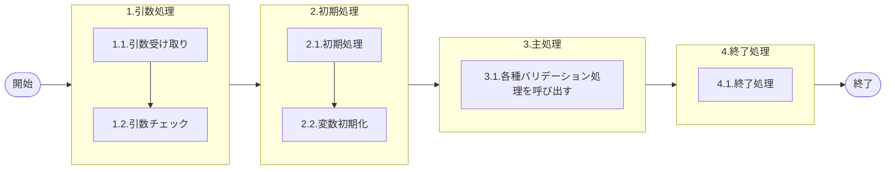

# 0. 表紙

| モジュール名 | プログラムID | プログラム名 |
| --- | --- | --- |
| IC | LDAS0308 | Valid／受発注報告 |


| RFC        | Version | 更新日      | 更新者 | 更新内容 | 確認日 | 確認者 | 承認日     | 承認者 |
| ---------- | :-----: | ----------- | :----: | -------- | ------ | :----: | ---------- | :----: |
| - |  1.0.0  | 2025/09/30 |  鈴木祐介  | 初版作成   | 2025/XX/XX  |  XXX  | 2025/XX/XX |  XXX  |

## 1. 処理概要

### 1.1. 機能概要

パラメータで渡された情報を判定し、受発注関連の各種バリデーション処理を呼び出す
１．納入報告
２．完成報告
３．独立所要量報告
４．Ｗビン報告
５．引取シンクロ報告
のバリデーションチェック処理を行う

### 1.2. 処理概要フロー



### 1.3. プログラム入出力パラメータ

#### 1.3.1. 引数

| No. | パラメータ論理名 | パラメータ物理名 | 属性 | 備考 |
| --- | --- | --- | --- | --- |
| 1 | カード識別 | ps_card_id | VARCHAR | 11(完成報告カード（シンクロ）)、22(納入及び生試完成報告カード（オーダー№付）)、33（独立所要量）、44(Ｗビンカード（シンクロ）)、55(引取シンクロカード)、T（時間納入） |
| 2 | 処理識別 | ps_cmp_par_crr_sign | VARCHAR | "0"：完納"1"：分納"2"：＋訂正"3"：－訂正 |
| 3 | ユーザーID | ps_user_id | VARCHAR | ログインＩＤorSYSTEM |
| 4 | 品目番号 | ps_itemno | VARCHAR |  |
| 5 | 供給者 | ps_supplier | VARCHAR |  |
| 6 | 使用者 | ps_usercd | VARCHAR |  |
| 7 | オーダー番号 | ps_order_no | VARCHAR |  |
| 8 | 納品書番号 | ps_delivery_card_no | VARCHAR |  |
| 9 | 起票日 | ps_input_date | VARCHAR |  |
| 10 | 報告数量 | pn_input_qty | DECIMAL |  |
| 11 | カードNo | ps_card_no | VARCHAR |  |
| 12 |  |  |  |  |


#### 1.3.2. 戻り値

| No. | パラメータ論理名 | パラメータ物理名 | 属性 | 備考 |
| --- | --- | --- | --- | --- |
| 1 | 処理ステータス | rn_status | VARCHAR | 0:NormalEnd,-1:SQLError/-2:PGError,1:警告発生 |
| 2 | SQLコード | rs_sql_code | VARCHAR |  |
| 3 | エラーコード | rs_err_code | VARCHAR |  |
| 4 | エラーメッセージ | rs_err_msg | VARCHAR |  |
| 5 | エラー位置 | rs_err_focus | VARCHAR |  |
| 6 | 処理識別 | rs_input_operation_id | VARCHAR | 処理ID「LDxx」 |
| 7 | 内部TXN | rs_inter_txn | VARCHAR |  |


### 1.4. その他制御・要件

| 排他制御 |  |  |
| --- | --- | --- |
| 楽観 | 悲観 | 無し |
| 〇 | - | - |

| 項目 | 制約・制御・要件など | 記載内容説明 |
| --- | --- | --- |
| パフォーマンス要件 | 特になし。 |  |

### 1.5. 入出力一覧

| No | 入出力対象 | 名称 | 物理名称 | ID | C | R | U | D | 備考 |
| --- | --- | --- | --- | --- | --- | --- | --- | --- | --- |
| 1 |  | 無し |  |  |  |  |  |  |  |


## 2. 詳細処理

### 2.1. 引数の取得とチェック
- 変数設定
  - 変更区分
  - ログ出力サイン = 0
  - 受信ID = ' '
  - 相手先システム識別= ' '
   
- 戻り値セット
   - 戻り値.ステータス      := 0;
   - 戻り値.エラーSQLコード := ' ';
   - 戻り値.エラーコード    := ' ';
   - エラーメッセージ       := ' ';
   - エラー位置            := ' ';
   - 処理識別              := ' ';
   - 内部トランザクション   := ' ';
   - 変更区分              := ' ';

### 2.2. 初期処理
特記事項無し
### 2.3. 主処理
- カード識別が(11(完成報告カード（シンクロ）)、22(納入及び生試完成報告カード（オーダー№付）)、33（独立所要量）、44(Ｗビンカード（シンクロ）)、55(引取シンクロカード)、T（時間納入）)ではない場合、エラーメッセージを出力し処理終了
  - エラーコード：E.LDP10011
  - エラーメッセージ："'Subtraction value error has occurred in the internal processing. Contact the staff in charge of the system. Error : [引数.カード識別] = ' || COALESCE(引数.カード識別, 'NULL');"
  - (処理内部にて引数値エラーが発生しました  システム管理者に連絡してください)
  - エラー位置：'LDAS0308'

- 処理識別が'0'(完納)。'1'(分納)、'2'(+訂正)の時 
  - 変更区分'1'(登録)をセット
- 処理識別が'3'(-訂正)ならば
  - 変更区分'2'(訂正)をセット
- 上記以外の場合、エラーを出力し処理終了
  - エラーコード：E.LDP10011
  - エラーメッセージ："'Subtraction value error has occurred in the internal processing. Contact the staff in charge of the system. Error : [引数.カード識別] = ' || COALESCE(引数.カード識別, 'NULL');"
  - (処理内部にて引数値エラーが発生しました  システム管理者に連絡してください)
  - エラー位置：'LDAS0308'

#### 2.3.1. 納品書報告チェック
- (カード識別が'22'(納入及び生試完成報告カード（オーダー№付）) かつ　供給者 ≠ 使用者)　もしくは　カード識別が'T'（時間納入）の場合、LDAS0315 Valid／納入報告を呼び出して実行する
```sql
    SELECT *
    INTO STRICT rec_sp
    FROM LDAS0315( 変数.変更区分                    
                  , 引数.ユーザーID                         
                  , 変数.ログ出力サイン                        
                  , 変数.受信ID                    
                  , 変数.相手先システム識別             
                  , 引数.品目番号                        
                  , 引数.供給者                         
                  , 引数.使用者                    
                  , 引数.納品書番号             
                  , 引数.オーダー番号            
                  , 引数.起票日                       
                  , 引数.報告数量                        
                  );

```
- 正常終了時
  - 戻り値.処理識別：LD14
  - 戻り値.内部TXN
    - 変更区分'3'(－訂正)の時、'41'を返す
    - 変更区分'3'(－訂正)ではない時、'21'を返す

#### 2.3.2. 完成報告チェック
- (カード識別が'22'(納入及び生試完成報告カード（オーダー№付）) かつ　供給者 = 使用者)　もしくは　カード識別が'11'（完成報告カード（シンクロ））の場合、LDAS0324 Valid／完成報告を呼び出して実行する
```sql
    SELECT *
    INTO STRICT rec_sp
    FROM LDAS0324( 変数.変更区分                    
                  , 引数.ユーザーID                         
                  , 変数.ログ出力サイン                        
                  , 変数.受信ID                    
                  , 変数.相手先システム識別             
                  , 引数.品目番号                        
                  , 引数.供給者                         
                  , 引数.使用者                    
                  , 引数.納品書番号             
                  , 引数.オーダー番号            
                  , 引数.起票日                       
                  , 引数.報告数量 
                  , 引数.カードNo.    
                   );

```
- 正常終了時
  - 戻り値.処理識別：LD44
  - 戻り値.内部TXN
    - 変更区分'3'(－訂正)の時、'42'を返す
    - 変更区分'3'(－訂正)ではない時、'22'を返す


#### 2.3.3. 独立需要納入報告チェック
- カード識別が'33'(独立所要量) の場合、LDAS0325 Valid／独立需要納入報告を呼び出して実行する
```sql
    SELECT *
    INTO STRICT rec_sp
    FROM LDAS0325( 変数.変更区分                    
                  , 引数.ユーザーID                         
                  , 変数.ログ出力サイン                        
                  , 変数.受信ID                    
                  , 変数.相手先システム識別             
                  , 引数.品目番号                        
                  , 引数.供給者                         
                  , 引数.使用者                    
                  , 引数.納品書番号             
                  , 引数.オーダー番号            
                  , 引数.起票日                       
                  , 引数.報告数量                        
                  );

```
- 正常終了時
  - 戻り値.処理識別：LD46
  - 戻り値.内部TXN
    - 変更区分'3'(－訂正)の時、'51'を返す
    - 変更区分'3'(－訂正)ではない時、'31'を返す

#### 2.3.4. Ｗビン納入報告チェック
- カード識別が'44'(Ｗビンカード（シンクロ）) の場合、LDAS0330 Valid／Ｗビン納入報告を呼び出して実行する
```sql
    SELECT *
    INTO STRICT rec_sp
    FROM LDAS0330( 変数.変更区分                    
                  , 引数.ユーザーID                         
                  , 変数.ログ出力サイン                        
                  , 変数.受信ID                    
                  , 変数.相手先システム識別             
                  , 引数.品目番号                        
                  , 引数.供給者                         
                  , 引数.使用者                    
                  , 引数.納品書番号             
                  , 引数.オーダー番号            
                  , 引数.起票日                       
                  , 引数.報告数量                        
                  );

```
- 正常終了時
  - 戻り値.処理識別：LD74
  - 戻り値.内部TXN
    - 変更区分'3'(－訂正)の時、'43'を返す
    - 変更区分'3'(－訂正)ではない時、'23'を返す

#### 2.3.5. 引取シンクロ報告チェック
- カード識別が'55'(引取シンクロ報告) の場合、LDAS0321 Valid／引取シンクロを呼び出して実行する
```sql
    SELECT *
    INTO STRICT rec_sp
    FROM LDAS0321( 変数.変更区分                    
                  , 引数.ユーザーID                         
                  , 変数.ログ出力サイン                        
                  , 変数.受信ID                    
                  , 変数.相手先システム識別             
                  , 引数.品目番号                        
                  , 引数.供給者                         
                  , 引数.使用者                    
                  , 引数.納品書番号             
                  , 引数.オーダー番号            
                  , 引数.起票日                       
                  , 引数.報告数量                        
                  );

```
- 正常終了時
  - 戻り値.処理識別：LD24
  - 戻り値.内部TXN
    - 変更区分'3'(－訂正)の時、'41'を返す
    - 変更区分'3'(－訂正)ではない時、'21'を返す

### 2.4. 終了処理
- 正常終了処理を行う

| 戻り値           | 設定値   |
| ---------------- | -------- |
| 処理ステータス   | 0        |
| SQL コード       | スペース |
| エラーコード     | スペース |
| エラーメッセージ | スペース |
| エラー位置 | スペース |
| 処理識別 | 変数.処理識別 |
| 内部TXN | 変数.内部TXN |

## 3. 補足説明

### 3.1. 戻り値について
- ステータスについて
  0 : Normal End
  -1 : Abnormal End
  -2 : PGM エラー

### 3.2. エラー発生時の対応について
- エラーステータス：-2、SQLコード：' '
- エラーコードの再設定
- エラーコードが 'E.LDP10018'(指定オーダーが存在しません) もしくは、'E.LDP10019'(指定品目が品目マスタに存在しません)　の場合
  - 'E.LDP10013'(対象オーダーがありません) をセットする
- エラーコードが 'E.LDP10020'(品目タイプ＝１（標準）の品目のみ指定可能です) ～ 'E.LDP10037'(商品・ＣＢＵ機種・ＣＫＤ機種品目は指定不可です)　の場合
  - 'E.LDP10012'(入力対象ではありません) をセットする
- エラーコードが 'E.LDP10038'(完了済オーダーは指定できません) もしくは、'E.LDP10039'(指定所要量が存在しません) もしくは、'E.LDP10040'(オーダー残を超える報告はできません) もしくは、'E.LDP10041'(所要残を超える報告はできません)　　の場合
  - 'E.LDP10008'(過剰報告です) をセットする
- エラーコードが 'E.LDP10042'(納入数≠オーダー数の報告はできません)　の場合
  - 'E.LDP10043'(Ｗビンは分納できません) をセットする
- エラーコードが 'E.LDP10044'(入庫数を超える訂正報告はできません) もしくは、'E.LDP10045'(検査中数量を超える訂正報告はできません)もしくは、'E.LDP10046'(出庫数を超える訂正報告はできません)　の場合
  - 'E.LDP10010'(訂正数が不正です（受領数＜訂正数）) をセットする
- エラーコードが 'E.LDP10047'(オーダー状況＝２（確定）の独立所要量を指定してください)  もしくは、'E.LDP10048'(オーダー状況＝２（確定）、または９（完了）の独立所要量を指定してください) の場合
  - 'E.LDP10016'(確定オーダーがありません) をセットする
- エラーコードが 'E.LDP10005'(工場処理日以前の日付を指定してください) もしくは、'E.LDP10007'(工場処理日１ヶ月前以降の日付を指定してください)　の場合
  - 'E.LDP10380'(報告日が報告できる範囲を超えています) をセットする
- 上記以外の場合、NULLをエラーコードへセットする

- 各処理のエラー位置の値を返す。
  - 戻り値.エラー位置:変数.エラー位置
 
### 3.3. 基本設計から変更点
- 入力端末項目 廃止
- 11(完成報告カード（シンクロ）)、22(納入及び生試完成報告カード（オーダー№付）)、33（独立所要量）、44(Ｗビンカード（シンクロ）)、55(引取シンクロカード)、T（時間納入）については、前処理である「Valid／リーダー入力チェック・納品書No」で変換し、カード識別で渡される想定。