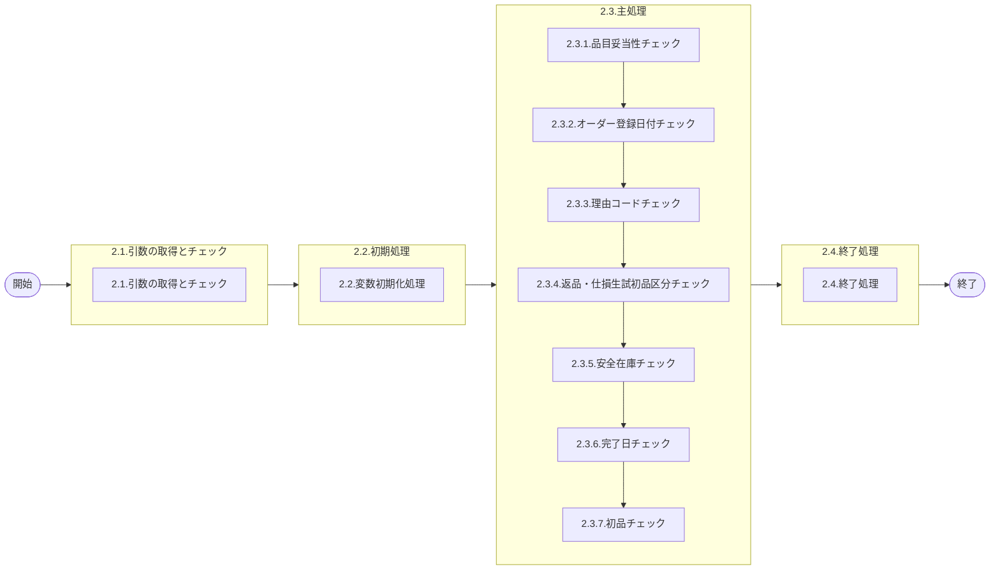

# 0. 表紙

| モジュール名 | プログラムID | プログラム名        |
| ------------ | ------------ | ------------------- |
| IC           | LDAS0313     | Valid／オーダー登録 |

| RFC | Version | 更新日     | 更新者 | 更新内容 | 確認日     | 確認者 | 承認日     | 承認者 |
| --- | :-----: | ---------- | :----: | -------- | ---------- | :----: | ---------- | :----: |
| -   |  1.0.0  | 2025/09/12 | 余暁東 | 初版作成 | 2025/XX/XX |  XXX  | 2025/XX/XX |  XXX  |

## 1. 処理概要

### 1.1. 機能概要

登録するオーダーの各項目に対するバリデーションを定義する。

### 1.2. 処理概要フロー



### 1.3. プログラム入出力パラメータ

#### 1.3.1. 引数

| No. | パラメータ論理名       | パラメータ物理名       | 属性    | 備考                             |
| --- | ---------------------- | ---------------------- | ------- | -------------------------------- |
| 1   | ユーザーＩＤ           | ps_user_id             | VARCHAR | ログインＩＤorSYSTEM             |
| 2   | ログ出力サイン         | ps_log_sign            | VARCHAR | 0:ログ出力しない1:ログ出力       |
| 3   | 受信ID                 | ps_recieve_id          | VARCHAR | 外部データ：受信ＩＤ             |
| 4   | 相手先システム識別     | ps_request_system_code | VARCHAR | 外部データ：相手先ｼｽﾃﾑコード |
| 5   | 品目番号               | ps_itemno              | VARCHAR |                                  |
| 6   | 供給者                 | ps_supplier            | VARCHAR |                                  |
| 7   | 使用者                 | ps_usercd              | VARCHAR |                                  |
| 8   | オーダー番号           | ps_order_no            | VARCHAR |                                  |
| 9   | オーダー数             | pn_order_qty           | DECIMAL |                                  |
| 10  | 着手日                 | ps_start_date          | VARCHAR | YYYYMMDD                         |
| 11  | 完了日                 | ps_due_date            | VARCHAR | YYYYMMDD                         |
| 12  | 払出日                 | ps_disburse_date       | VARCHAR | YYYYMMDD                         |
| 13  | 完了開始時間           | ps_due_begin_time      | VARCHAR |                                  |
| 14  | 完了終了時間           | ps_due_end_time        | VARCHAR |                                  |
| 15  | 理由コード             | ps_reason_code         | VARCHAR |                                  |
| 16  | 繰越調整数             | pn_carry_over_qty      | DECIMAL |                                  |
| 17  | 生試初品区分           | ps_pilot_class         | VARCHAR | 生試=２、量産初品=３、量産=SPACE |
| 18  | 入力元トランザクション | ps_input_txn           | VARCHAR | 18:返品A 28:仕損                |

#### 1.3.2. 戻り値

| No. | パラメータ論理名 | パラメータ物理名 | 属性    | 備考                                          |
| --- | ---------------- | ---------------- | ------- | --------------------------------------------- |
| 1   | 処理ステータス   | rn_status        | INTEGER | 0:NormalEnd,-1:SQLError/-2:PGError,1:警告発生 |
| 2   | SQLコード        | rs_sql_code      | VARCHAR |                                               |
| 3   | エラーコード     | rs_err_code      | VARCHAR |                                               |
| 4   | エラーメッセージ | rs_err_msg       | VARCHAR |                                               |
| 5   | エラー位置       | rs_err_focus     | VARCHAR |                                               |

### 1.4. その他制御・要件

| 排他制御 |      |      |
| -------- | ---- | ---- |
| 楽観     | 悲観 | 無し |
| ●       | -    | -    |

| 項目               | 制約・制御・要件など | 記載内容説明                                                     |
| ------------------ | -------------------- | ---------------------------------------------------------------- |
| パフォーマンス要件 | 特になし。           | 特別なパフォーマンス要件がある場合に要件内容とその対処法を記述。 |

### 1.5. 入出力一覧

| No | 入出力対象 | 名称                            | 物理名称               | C | R  | U | D | 備考 |
| -- | ---------- | ------------------------------- | ---------------------- | - | -- | - | - | ---- |
| 1  | テーブル   | 発注理由コード                  | le_mst_order_reason    |   | ○ |   |   |      |
| 2  | テーブル   | MRP情報値                       | le_mst_mrp_information |   | ○ |   |   |      |
| 3  | テーブル   | 納入基準日                      | le_mst_deliv_std_day   |   | ○ |   |   |      |
| 4  | テーブル   | オーダー明細                    | le_trn_order           |   | ○ |   |   |      |
| 5  | 共通関数   | Valid／品目妥当性チェック       | LDAS0300               |   |    |   |   |      |
| 6  | 共通関数   | Valid／オーダー登録日付チェック | LDAS0301               |   |    |   |   |      |
| 7  | 共通関数   | エラーログ出力                  | LDAS0409               |   |    |   |   |      |

## 2. 詳細処理

### 2.1. 引数の取得とチェック

- 引数.オーダー数が0以下の場合、エラーメッセージを出力し処理終了。

  - エラーコード : ld.E.LDP10075
  - エラーメッセージ : 'You cannot specify 0 or less than 0.'
    - (０以下の数量は指定できません。)
- 引数.生試初品区分が'2'（生試）、'3'（量産初品）、空白（量産）以外の場合、エラーメッセージを出力し処理終了。

  - エラーコード : ld.E.LDP10076
  - エラーメッセージ : 'You can specify only 2(Pilot Production), 3(First Production) or Blank(Mass Production) for Production Classification.'
    - (生試初品区分には２（生試）、３（初品）、または空白（量産）のみが指定可能です。)

### 2.2. 初期処理

- 利用する変数を初期化する。

### 2.3. 主処理

#### 2.3.1. 品目妥当性チェック

LDAS0300（Valid／品目妥当性チェック）をコールして品目の妥当性をチェックする。

```sql
SELECT * 
  FROM LDAS0300('LD11',
                 ps_itemno,            --引数.品目番号
                 ps_supplier,          --引数.供給者
                 ps_usercd);            --引数.使用者
```

- 戻り値．ステータスがエラー(-1)の場合、エラー返して処理を異常終了させる。
- 戻り値．ステータスがPGMエラー(-2)の場合、例外を発生させる。
- ステータスが上記ではない場合、情報を取得する。
  - MRP需要方針コード
  - 品目ステータス
  - 変動安全在庫数

#### 2.3.2. オーダー登録日付チェック

LDAS0301（Valid／オーダー登録日付チェック）をコールして各日付の妥当性をチェックする。

```sql
SELECT * 
  FROM LDAS0301( 'LD11',
                  ps_start_date,         --引数.着手日
                  ps_due_date,           --引数.完了日,
                  ps_disburse_date,      --引数.払出日,
                  ps_itemno,             --引数.品目番号,
                  ps_supplier,           --引数.供給者,
                  ps_usercd,             --引数.使用者,
                  demand_policy_code);   --2.3.1で取得.MRP需要方針コード
```

- 戻り値．ステータスがエラー(-1)の場合、エラー返して処理を異常終了させる。
- 戻り値．ステータスがPGMエラー(-2)の場合、例外処理を発生させる。

#### 2.3.3. 理由コードチェック

```sql
IF EXISTS(SELECT 1
  FROM le_mst_order_reason                --発注理由コードマスタ
 WHERE order_reason_code = ps_reason_code --理由コード = 引数.理由コード
) THEN
```

- 検索結果が0件の場合、エラーメッセージを出力し処理終了。
  - エラーコード : ld.E.LDP10081
  - エラーメッセージ : 'Reason Code does not exist in the order reason code table.'
    - (理由コードが発注理由コードテーブルに存在しません。)

#### 2.3.4. 返品・仕損生試初品区分チェック

- (引数.入力元トランザクション = '18'(返品A)  または '28'(仕損) )かつ 2.3.1で取得.品目ステータス = '2'（生試品目）の場合
  - 引数.生試初品区分 ≠ '2'（生試）の場合、エラーメッセージを出力し処理終了。
    - エラーコード : ld.E.LDP10077
    - エラーメッセージ : 'You cannot register Mass Production Order for Pilot Production Parts in Parts Return and Scrap Report Operation.'
      - (返品・仕損からのオーダー登録時は、生試品に対する量産オーダーは登録できません。)

#### 2.3.5. 安全在庫チェック

- 引数.入力元トランザクション = '28'(返品A) かつ 2.3.1で取得.変動安全在庫数 ≠ 0 の場合、エラーメッセージを出力し処理終了。
  - エラーコード : ld.E.LDP10078
  - エラーメッセージ : 'In Scrap Report Operation, you cannot register the order for the item that has safety stock.'
    - (安全在庫が存在する品目に対して、仕損からのオーダー登録はできません。)

#### 2.3.6. 完了日チェック

発注方針コードが'S'の場合の納入基準日チェックを行う。

##### 2.3.6.1. 発注方針コード取得

```sql
IF EXISTS(SELECT 1
            FROM  le_mst_mrp_information     --MRP情報値
           WHERE  itemno   = ps_itemno       --品目番号 = 引数.品目番号
             AND  supplier = ps_supplier      --供給者   = 引数.供給者
             AND  usercd   = ps_usercd        --使用者   = 引数.使用者
)THEN

          SELECT order_policy_code           --発注方針コード
            FROM le_mst_mrp_information      --MRP情報値
          WHERE  itemno   = ps_itemno        --品目番号 = 引数.品目番号
            AND  supplier = ps_supplier      --供給者   = 引数.供給者
            AND  usercd   = ps_usercd        --使用者   = 引数.使用者
```

##### 2.3.6.2. 納入基準日チェック

2.3.6.1で取得.発注方針コード = 'S'(基準日指定方式) の場合、納入基準日マスタをチェックする。

- 日指定（D）チェック

```sql
IF EXISTS ( SELECT 1
              FROM le_mst_deliv_std_day                        --納入基準日マスタ
             WHERE supplier        = ps_supplier               --供給者        = 引数.供給者
               AND deliv_std_class = 'D'                        --納入基準区分  = 'D'
               AND deliv_std_day   = SUBSTR(ps_due_date,7,2)   --納入基準日    = 引数.完了日の日部分
)THEN
```

- 日指定で該当なしの場合、曜日指定（W）チェック

```sql
IF EXISTS ( SELECT 1
            FROM  le_mst_deliv_std_day               --納入基準日マスタ
            WHERE supplier        = ps_supplier      --供給者 = 引数.供給者
            AND   deliv_std_class = 'W'              --納入基準区分 = 'W'
            AND   deliv_std_day   = ls_due_weekday   --納入基準日 = 引数.完了日の曜日部分
)THEN
```

- 両方とも該当なしの場合、エラーメッセージを設定。
  - エラーステータス: 1
  - エラーコード : ld.E.LDP10079
  - エラーメッセージ : 'Due Date you entered does not meet with the setting of DELIVERY STANDARD DAY TABLE.'
    - (入力した完了日が、納入基準日テーブルの設定内容と異なります。)

#### 2.3.7. 初品チェック

##### 2.3.7.1. 既存初品オーダーチェック

```sql
IF EXISTS(SELECT 1
          FROM le_trn_order                     --オーダー明細
          WHERE itemno           = ps_itemno    --品目番号 = 引数.品目番号
          AND supplier           = ps_supplier  --供給者 = 引数.供給者
          AND usercd             = ps_usercd    --使用者 = 引数.使用者
          AND TRIM(delete_ymd)   = ''           --削除日 = ''
          AND pilot_class        = '3'          --生試初品区分 = '3'
)THEN
```

- 検索結果が0件でない かつ 引数.生試初品区分 = '3'(初品) かつ 2.3.1で取得.品目ステータス = '3' 場合、エラーメッセージを設定。
  - 処理ステータス: 1
  - エラーコード : ld.E.LDP10087
  - エラーメッセージ : 'First production order of the same item already exists.'
    - (同一品目ですでに初品オーダーが存在しています。)

##### 2.3.7.2. 品目ステータスチェック

- 引数.生試初品区分 = '3' かつ 2.3.1で取得.品目ステータス > '3' の場合、エラーメッセージを出力し処理終了。
  - エラーコード : ld.E.LDP10088
  - エラーメッセージ : 'Because Item Status is not 3(First Production), you cannot register first production order.'
    - (品目ステータスが初品ではないため、初品オーダーは登録できません。)

##### 2.3.7.3. 量産オーダーと初品オーダーの順序チェック

```sql
IF EXISTS(SELECT 1
          FROM le_trn_order                       --オーダー明細
          WHERE itemno           = ps_itemno      --品目番号 = 引数.品目番号
          AND supplier           = ps_supplier    --供給者 = 引数.供給者
          AND usercd             = ps_usercd      --使用者 = 引数.使用者
          AND TRIM(delete_ymd)   = ''             --削除日 = ''
          AND pilot_class        = '3'            --生試初品区分 = '3'
          AND due_date           > ps_due_date    --完了日 > 引数.完了日 
) THEN
```

- 検索結果が0件でない かつ 引数.生試初品区分 = '' かつ 2.3.1で取得.品目ステータス = '3'(量産初品) の場合、エラーメッセージを設定。
  - 処理ステータス : 1
  - エラーコード : ld.E.LDP10080
  - エラーメッセージ : 'After the mass production order you entered, first production order exists.'
    - (入力した量産オーダーの後に初品オーダーが存在します。)

### 2.4. 終了処理

- 正常終了処理を行う。

| 戻り値           | 設定値   |
| ---------------- | -------- |
| 処理ステータス   | 0        |
| SQLコード        | スペース |
| エラーコード     | スペース |
| エラーメッセージ | スペース |
| エラー位置       | スペース |

## 3. 補足説明

### 3.1. 戻り値について

- 処理ステータス
  - 0: 正常終了
  - 1: 警告発生（処理は継続）
  - -1: SQLエラー
  - -2: プログラムエラー

### 3.2. エラー発生時の対応について

- 戻り値.エラー位置 :'LDAS0313'
- SQLエラーが発生した場合、戻り値を返して処理終了。
- PGMエラーが発生した場合、
  - 引数.ログ出力サイン＝'1'の場合、エラーログファイルを1レコード生成する。
    ＊ LDAS0409：エラーログ登録を実行する。
  - 戻り値を返して処理終了。

＊ LDAS0409：エラーログ登録

| No. | 引数                       | I/O | ｾｯﾄ値                    |
| --- | -------------------------- | --- | --------------------------- |
| 1   | 作成区分                   | I   | '99'                        |
| 2   | 入力ユーザーＩＤ           | I   | 引数.ユーザーＩＤ           |
| 3   | エラーコード               | I   | 戻り値.エラーコード         |
| 4   | 処理識別                   | I   | 'LD11'                      |
| 5   | 変更区分                   | I   | '1'                         |
| 6   | エラーレベルステータス     | I   | '9'                         |
| 7   | 受信ＩＤ                   | I   | 引数.受信ＩＤ               |
| 8   | 相手先システム識別         | I   | 引数.相手先システム識別     |
| 9   | 入力元トランザクション     | I   | 引数.入力元トランザクション |
| 10  | エラー発生処理ＩＤ         | I   | LDAS0313                    |
| 11  | 品目番号                   | I   | 引数.品目番号               |
| 12  | 供給者                     | I   | 引数.供給者                 |
| 13  | 使用者                     | I   | 引数.使用者                 |
| 14  | オーダー番号               | I   | 引数.オーダー番号           |
| 15  | 伝票番号                   | I   | ' '                         |
| 16  | 引落区分                   | I   | ' '                         |
| 17  | 数量                       | I   | 引数.オーダー数             |
| 18  | 理由コード（発注理由）     | I   | 引数.理由コード             |
| 19  | 費用振替先区分             | I   | ' '                         |
| 20  | 費用振替先コード           | I   | ' '                         |
| 21  | 勘定科目コード             | I   | ' '                         |
| 22  | 目的No                     | I   | ' '                         |
| 23  | 受払種別コード             | I   | ' '                         |
| 24  | 生試処理タイプ             | I   | ' '                         |
| 25  | 着手日                     | I   | 引数.着手日                 |
| 26  | 納入日                     | I   | 引数.完了日                 |
| 27  | 払出日                     | I   | 引数.払出日                 |
| 28  | 完了開始時間               | I   | ' '                         |
| 29  | 完了終了時間               | I   | ' '                         |
| 30  | 繰越調整数                 | I   | 引数.繰越調整数             |
| 31  | 生試初品区分               | I   | 引数.生試初品区分           |
| 32  | 所要量区分                 | I   | ' '                         |
| 33  | 独立需要送り先区分         | I   | ' '                         |
| 34  | 独立需要送り先コード       | I   | ' '                         |
| 35  | 振替理由コード             | I   | ' '                         |
| 36  | 削除日付                   | I   | ' '                         |
| 37  | フリーコメント             | I   | ' '                         |
| 38  | サービスパーツ特別発注区分 | I   | ' '                         |
| 39  | サービスパーツ直納先コード | I   | ' '                         |
| 40  | サービスパーツディーラNO   | I   | ' '                         |
| 41  | サービスパーツ受注番号     | I   | ' '                         |
| 42  | 着手／払出日               | I   | ' '                         |
| 43  | 納品書番号                 | I   | ' '                         |
| 44  | 保留在庫数                 | I   | 0                           |
| 45  | 起票日                     | I   | ' '                         |
| 46  | 責任工程                   | I   | ' '                         |
| 47  | 責任職場／メーカー区分     | I   | ' '                         |
| 48  | 責任職場／メーカー         | I   | ' '                         |
| 49  | 組立ライン                 | I   | ' '                         |
| 50  | 組立順序番号               | I   | ' '                         |
| 51  | 金額                       | I   | ' '                         |
| 52  | 移動先使用者               | I   | ' '                         |
| 53  | 仕掛サイン                 | I   | ' '                         |
| 54  | インボイスNo               | I   | ' '                         |
| 55  | B/L No                     | I   | ' '                         |
| 56  | ケースNo                   | I   | ' '                         |
| 57  | ケースマークオーダ番号     | I   | ' '                         |
| 58  | G-SDMオーダー番号          | I   | ' '                         |
| 59  | 外売品フラグ               | I   | ' '                         |
| 60  | HU-ID                      | I   | ' '                         |
| 61  | 工程番号                   | I   | ' '                         |
| 62  | 原価用品目番号             | I   | ' '                         |
| 63  | 原価用供給者               | I   | ' '                         |
| 64  | 原価用使用者               | I   | ' '                         |
| 65  | 原価用オーダー番号         | I   | ' '                         |
| 66  | エラーレベル品目番号       | I   | 引数.品目番号               |
| 67  | エラーレベル供給者         | I   | 引数.供給者                 |
| 68  | エラーレベル使用者         | I   | 引数.使用者                 |
| 69  | エラーレベル数量           | I   | 引数.オーダー数             |
| 70  | エラーレベル着手日         | I   | 引数.着手日                 |
| 71  | エラーレベル納入日         | I   | 引数.完了日                 |
| 72  | エラーレベル払出日         | I   | 引数.払出日                 |
