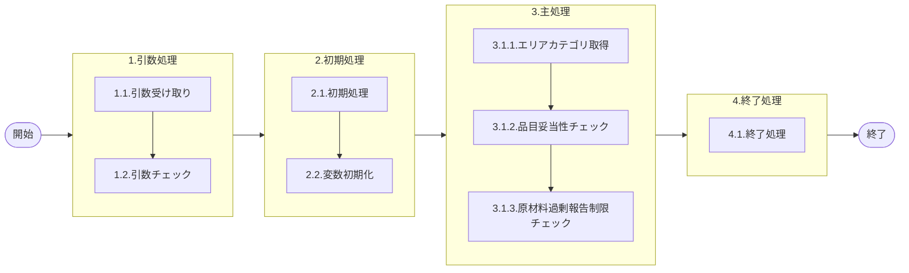

# 0. 表紙

| モジュール名 | プログラムID | プログラム名    |
| ------------ | ------------ | --------------- |
| IC           | LDAS0315     | VALID／納入報告 |

| RFC   | Version | 更新日     | 更新者 | 更新内容 | 確認日     | 確認者 | 承認日     | 承認者 |
| ----- | :-----: | ---------- | :----: | -------- | ---------- | :----: | ---------- | :----: |
| - |  1.0.0  | 2025/10/02 |  鈴木祐介  | 初版作成 | 2025/XX/XX |  XXX  | 2025/XX/XX |  XXX  |

## 1. 処理概要

### 1.1. 機能概要

納入報告の各項目に対するバリデーションを定義する。

### 1.2. 処理概要フロー


### 1.3. プログラム入出力パラメータ

#### 1.3.1. 引数

| No. | パラメータ論理名   | パラメータ物理名 | 属性                                      | 備考                                      |
| --- | ------------------ | ---------------- | ---------------- | ----------------------------------------- |
| 1   | 変更区分           | ps_control_class | VARCHAR | 1（登録）、2(変更)、3(削除)               |
| 2   | ユーザーＩＤ       | ps_user_id       | VARCHAR | 画面：PymacユーザーＩＤその他：「SYSTEM」 |
| 3   | ログ出力サイン     | ps_log_sign      | VARCHAR | 0:ログ出力しない1:ログ出力                |
| 4   | 受信ID             | ps_receive_id    | VARCHAR | 外部データ：受信ＩＤ                      |
| 5   | 相手先システム識別 | ps_system_id     | VARCHAR | 外部データ：相手先ｼｽﾃﾑID              |
| 6   | 品目番号           | ps_itemno        | VARCHAR |                                           |
| 7   | 供給者             | ps_supplier      | VARCHAR |                                           |
| 8   | 使用者             | ps_usercd        | VARCHAR |                                           |
| 9   | カード識別         | ps_card_id       | VARCHAR | GIMAC追加カード番号が入る                 |
| 10  | オーダー番号       | ps_order_no      | VARCHAR |                                           |
| 11  | 起票日             | ps_input_date    | VARCHAR | YYYYMMDD                                  |
| 12  | 数量               | pn_qty           | DECIMAL |                                           |
| 13  |                    |                  |  |                                           |

#### 1.3.2. 戻り値

| No. | パラメータ論理名 | パラメータ物理名 | 備考                                          |
| --- | ---------------- | ---------------- | --------------------------------------------- |
| 1   | 処理ステータス   | rn_status        | 0:NormalEnd,-1:SQLError/-2:PGError,1:警告発生 |
| 2   | SQLコード        | rs_sql_code      |                                               |
| 3   | エラーコード     | rs_err_code      |                                               |
| 4   | エラーメッセージ | rs_err_msg       |                                               |
| 5   | エラー位置       | rs_err_focus     |                                               |

### 1.4. その他制御・要件

| 排他制御 |      |      |
| -------- | ---- | ---- |
| 楽観     | 悲観 | 無し |
| 〇       | -    | -    |

| 項目               | 制約・制御・要件など | 記載内容説明                                                     |
| ------------------ | -------------------- | ---------------------------------------------------------------- |
| パフォーマンス要件 | 特になし。           |  |

### 1.5. 入出力一覧

| No | 入出力対象 | 名称                     | 物理名称                | ID | C | R  | U | D | 備考           |
| -- | ---------- | ------------------------ | ----------------------- | -- | - | -- | - | - | -------------- |
| 1  | テーブル   | オーダー明細             | le_trn_order            |    |   | ○ |   |   |                |
| 2  | テーブル   | GIMACエリアマスタ        | la_area_master          |    |   | ○ |   |   | (旧)組織マスタ |
| 3  | テーブル   | SUマスタ                | la_area_master_su        |    |   | ○ |   |   |                |
| 3  | テーブル   | FPマスタ                | la_area_master_pf 　　　　|    |   | ○ |   |   |                |
| 3  | テーブル   | リテラル防止要素         | lz_anti_literal_element |    |   | ○ |   |   |                |
| 4  | テーブル   | 機能オプションパラメータ | lz_function_parameter   |    |   | ○ |   |   |                |


## 2. 詳細処理

### 2.1. 引数の取得とチェック
- オーダー番号が NULL もしくは、''（ブランク）の場合、エラーメッセージを出力し処理終了
  - エラーコード：'ld.E.LDP10050';
  - エラーメッセージ：'Enter Order Number..　Argument Error : [引数.オーダー番号] = ' || COALESCE(引数.オーダー番号,'NULL')
    - (オーダー番号を入力してください)
  - エラー位置： 'LDAS0315' 

### 2.2. 初期処理
- 戻り値、引数の初期値セット
 
### 2.3. 主処理
#### 2.3.1. エリアカテゴリ取得
- SUマスタ、PFマスタから対象の引数.供給者が存在するか存在チェックを行う
```sql
IF NOT EXISTS (SELECT 1
            FROM SUマスタ
            WHERE SUコード = 引数.供給者) THEN
```
  - SUマスタに存在しない場合、PFマスタに存在チェックを行う
    ```sql
    IF NOT EXISTS (SELECT 1
                FROM PFマスタ
                WHERE PFコード = 引数.供給者) THEN
    ```
    - PFマスタに存在しない場合、エラーメッセージを出力し処理終了
        - エラーコード：'ld.E.LDP10051';
        - エラーメッセージ：'Supplier Code does not exist in the SU master　AND PF master.　Argument Error : [引数.オーダー番号] = ' || COALESCE(引数.オーダー番号,'NULL')
            - (供給者がSUマスタ,PFマスタに存在しません)
        - エラー位置： 'LDAS0315' 
    - 存在する場合、PFマスタからエリアカテゴリを取得。
    ```sql
        SELECT エリアカテゴリ
        FROM PFマスタ
        WHERE PFコード = 引数.供給者
    ``` 
- SUマスタに存在する場合、SUマスタからエリアカテゴリを取得
    ```sql
        SELECT エリアカテゴリ
        FROM SUマスタ
        WHERE SUコード = 引数.供給者
    ``` 
#### 2.3.2. 品目妥当性チェック
- LDAS0300 Valid／品目妥当性チェックSPを呼び出す
    ```sql
    SELECT *
    INTO STRICT rec_sp_LDAS0300
    FROM LDAS0300 ( 'LD14'
                , 引数.品目番号
                , 引数.供給者
                , 引数.使用者
                );
    ``` 
    - 戻り値セット
      - 変数.品目クラス         = LDAS0300.品目クラス
      - 戻り値.ステータス       = LDAS0300.処理ステータス
      - 戻り値.SQLコード        = LDAS0300.SQLコード
      - 戻り値.エラーコード     = LDAS0300.エラーコード
      - 戻り値.エラーメッセー   = LDAS0300.エラーメッセージ
      - 戻り値.エラー位置       = LDAS0300.エラー位置

      - 戻り値.ステータス＝ -1 の場合、ＳＱＬエラーとしてトラップする
      - 戻り値.ステータス＝ -2 の場合、処理エラーとしてトラップする

- 引数.変更区分 = '1'(登録) の時
  - オーダー明細に引数.品目キー、引数.オーダー番号が存在するか存在チェックを行う
    ```sql
    IF EXISTS( SELECT 1
                    FROM オーダー明細
                WHERE   品目番号        = 引数.品目番号
                    AND 供給者          = 引数.供給者
                    AND 使用者          = 引数.使用者
                    AND オーダー番号     = 引数.オーダー番号) THEN
    ``` 
  - 存在する場合、オーダー明細からオーダーステータス、オーダー数量、オーダー残数より検索する
    ```sql
            SELECT オーダーステータス
                  ,オーダー数
                  ,オーダー残数
                  ,入庫数
              FROM オーダー明細
             WHERE 品目番号     = 引数.品目番号
               AND 供給者       = 引数.供給者
               AND 使用者       = 引数.使用者
               AND オーダー番号 = 引数.オーダー番号;
    ``` 
    - オーダーステータスが'2'(確定)ではない時
      - エラーコード         = ld.E.LDP10038
      - エラーメッセージ     = 'You cannot specify the closed order.'
      - (完了済オーダーは指定できません)
      - エラー位置        = 'LDAS0315'
  - 存在しない場合、エラーを出力し処理終了
      - エラーコード         = ld.E.LDP10018
      - エラーメッセージ     = 'The order you specified does not exist.'||
                            '[ ps_itemno ] = ' ||
                            COALESCE( ps_itemno , 'NULL' ) ||
                            '[ ps_supplier ] = ' ||
                            COALESCE( ps_supplier , 'NULL' ) ||
                            '[ ps_usercd ] = ' ||
                            COALESCE( ps_usercd , 'NULL' );
      - (指定オーダーが存在しません)
      - エラー位置        = 'LDAS0315'

#### 2.3.3. 原材料過剰報告制限チェック
- 機能オプションパラメータからシステムコード、識別コード='LDA0003'（原材料過剰報告制限チェック）、選択フラグ='T'より存在チェックを行う
```sql
    IF EXISTS( SELECT 1
                  FROM 機能オプションパラメータ
                WHERE システムコード  = 'LD'
                  AND 識別コード      = 'LDA0003'
                  AND 選択フラグ      = 'T') THEN
```  
  - 存在する場合、機能オプションパラメータからオプションコードを検索する
    ```sql
        SELECT オプションコード
        FROM 機能オプションパラメータ
        WHERE システムコード  = 'LD'
          AND 識別コード      = 'LDA0003'
          AND 選択フラグ     = 'T';
    ``` 
    - 存在しない場合、エラーを出力し処理終了する
      - エラーコード         = ld.E.LDP10002
      - エラーメッセージ     = 'Target data does not exist in the Function Parameter table.';
      - (機能選択のデータが存在していません。)
      - エラー位置        = 'LDAS0315'

- リテラル防止要素.過剰納入報告制御フラグ = '0'(制限をかける)場合
  - 変数.品目クラス in ('0','1') かつ 変数.エリアカテゴリ = '56'(社外)の時
    - リテラル防止要素からシステムコード='LD',識別コード='LDA0003'（原材料過剰納入許容割合）より存在チェックを行う
      ```sql
        IF EXISTS( SELECT 1
                      FROM リテラル防止要素
                    WHERE システムコード  = 'LD'
                      AND 識別コード      = 'LDA0003') THEN
      ``` 
      - 存在する場合、リテラル防止要素から制御キーを検索する
      ```sql
          SELECT 制御キー
            FROM リテラル防止要素
            WHERE システムコード  = 'LD'
              AND 識別コード      = 'LDA0003';
      ```  
      - 存在しない場合、エラーを出力し処理終了
        - エラーコード         = ld.E.LDP10053
        - エラーメッセージ     = 'Target data does not exist in the Anti Literal Element table.';
        - (対象データがリテラル防止テーブルに存在しません。)
        - エラー位置        = 'LDAS0315'
  - 過剰納入チェック
    - (オーダー明細.入庫数 + 引数.数量) が (オーダー明細.オーダー数 * (100 + TO_NUMBER(リテラル防止要素.過剰納入許可オプション,'999999999999999'))) / 100　より大きい場合、エラーを出力し処理終了
      - エラーコード         = ld.E.LDP10040
      - エラーメッセージ     = 'You cannot report more than Order Remain Quantity.'||
                              '[ 引数.数量 ] = ' || 引数.数量;
      - (オーダー残を超える報告はできません)
      - エラー位置        = 'LDAS0315'

    - 品目クラス IN ('0','1') かつ　変数.エリアカテゴリ = '06'(社内)の場合
      - 引数.数量 が　オーダー残数　より大きいならば、エラーを出力し処理終了
        - エラーコード         = ld.E.LDP10040
        - エラーメッセージ     = 'You cannot report more than Order Remain Quantity.'||
                                '[ 戻り値.数量 ] = ' || 戻り値.数量;
        - (オーダー残を超える報告はできません)
        - エラー位置        = 'LDAS0315'
- リテラル防止要素.過剰納入報告制御フラグ = '1'(制限をかけない)
  - 機能オプションパラメータからシステムコード、識別コード='LDA0001'(原材料過剰チェック)、選択フラグ='T'より存在チェックを行う
  ```sql
    SELECT 1
      FROM 機能オプションパラメータ
      WHERE システムコード  = 'LD'
        AND 識別コード      = 'LDA0001';
  ``` 
  - 存在する場合、機能オプションパラメータからオプションコードを検索する
    ```sql
        SELECT オプションコード
          FROM 機能オプションパラメータ
          WHERE システムコード  = 'LD'
            AND 識別コード      = 'LDA0001';
      ```  
  - 存在しない場合、エラーを出力し処理終了
    - エラーコード         = ld.E.LDP10002
    - エラーメッセージ     = 'Target data does not exist in the Function Parameter table.';
    - (機能選択のデータが存在していません。)
    - エラー位置        = 'LDAS0315'

  - (変数.品目クラス ≠ '0'(梱包資材) かつ 変数.品目クラス ≠ '1'(原材料)) もしくは、(変数.品目クラス = '0'(梱包資材) かつ 変数.品目クラス = '1'(原材料) かつ オプションコード='1'(原材料の過剰報告を許可しない))　の時
    - 戻り値.数量 が オーダー残数　より大きい場合、エラーを出力し処理終了
      - エラーコード         = ld.E.LDP10040
      - エラーメッセージ     = 'You cannot report more than Order Remain Quantity.'||
                              '[ 戻り値.数量 ] = ' || 戻り値.数量;
      - (オーダー残を超える報告はできません)
      - エラー位置        = 'LDAS0315'

- 引数.変更区分 = '2'(変更) の時
  - オーダー明細から引数.品目キー、引数.オーダー番号、削除日=''で存在チェックをする
    ```sql
      IF EXISTS( SELECT 1
                    FROM オーダー明細
                  WHERE 品目番号         = 引数.品目番号
                    AND 供給者          = 引数.供給者
                    AND 使用者          = 引数.使用者
                    AND オーダー番号    = 引数.オーダー番号
                    AND TRIM(削除日) = '') THEN
    ``` 
  - 存在する場合、オーダー明細から入庫数を検索する
    ```sql
      SELECT 入庫数
        FROM オーダー明細
        WHERE 品目番号       = 引数.品目番号
          AND 供給者         = 引数.供給者
          AND 使用者         = 引数.使用者
          AND オーダー番号    = 引数.オーダー番号
          AND TRIM(削除日) = '';
    ``` 
  - 存在しない場合、エラーを出力し処理終了
    - エラーコード         = ld.E.LDP10018
    - エラーメッセージ     = 'The order you specified does not exist.'||
                            '[ ps_itemno ] = ' ||
                            COALESCE( ps_itemno , 'NULL' ) ||
                            '[ ps_supplier ] = ' ||
                            COALESCE( ps_supplier , 'NULL' ) ||
                            '[ ps_usercd ] = ' ||
                            COALESCE( ps_usercd , 'NULL' ) ||
                            '[ ps_order_no ] = ' ||
                            COALESCE( ps_order_no , 'NULL' );
    - (指定オーダーが存在しません)
    - エラー位置        = 'LDAS0315'

- 納品書番号 ≠ ''　の時
  - LDAS0310　Valid／納品書データ納入報告を呼び出す
    ```sql
      SELECT *
        FROM LDAS0310 ( 引数.納品書番号
                      , 引数.品目番号
                      , 引数.供給者
                      , 引数.使用者
                      , 引数.オーダー番号
                      , 引数.変更区分
                      , 引数.数量
                      );
    ``` 
    - 戻り値セット
      - 戻り値.ステータス       = LDAS0310.処理ステータス
      - 戻り値.SQLコード        = LDAS0310.SQLコード
      - 戻り値.エラーコード     = LDAS0310.エラーコード
      - 戻り値.エラーメッセー   = LDAS0310.エラーメッセージ
      - 戻り値.エラー位置       = LDAS0310.エラー位置

- 戻り値.ステータス＝ -1 の場合、ＳＱＬエラーとしてトラップする
- 戻り値.ステータス＝ -2 の場合、処理エラートラップする
  - この場合、エラーコードは戻り値．エラーコードを使用


### 2.4. 終了処理

## 3. 補足説明

### 3.1. 戻り値について

### 3.2. エラー発生時の対応について
- 引数.エラーログサイン='1'の時
  - LDAS0409　エラーログ登録を呼び出しエラーログファイルへ1レコード追加する
    ```sql
            SELECT *
              FROM LDAS0409 ( '99'                   --作成区分
                            , ps_user_id             --入力ユーザーID
                            , rs_err_code            --エラーコード
                            , 'LD14'                 --処理識別
                            , ps_control_class       --変更区分
                            , '9'                    --エラーレベルステータス
                            , ps_receive_id          --受信ID
                            , ps_system_id           --相手先システム識別
                            , ' '                    --入力元トランザクション
                            , 'LDAS0315'             --エラー発生処理ID
                            , ps_itemno              --品目番号
                            , ps_supplier            --供給者
                            , ps_usercd              --使用者
                            , ps_order_no            --オーダー番号
                            , ' '                    --伝票番号
                            , ' '                    --引落区分
                            , pn_qty                 --数量
                            , ' '                    --理由コード（発注理由）
                            , ' '                    --費用振替先区分
                            , ' '                    --費用振替先コード
                            , ' '                    --勘定科目コード
                            , ' '                    --目的No
                            , ' '                    --受払種別コード
                            , ' '                    --生試処理タイプ
                            , ' '                    --着手日
                            , ' '                    --納入日
                            , ' '                    --払出日
                            , ' '                    --完了開始時間
                            , ' '                    --完了終了時間
                            , ' '                    --繰越調整数
                            , ' '                    --生試初品区分
                            , ' '                    --所要量区分
                            , ' '                    --独立需要送り先区分
                            , ' '                    --独立需要送り先コード
                            , 0                      --振替理由コード
                            , ' '                    --削除日付
                            , ' '                    --フリーコメント
                            , ' '                    --サービスパーツ特別発注区分
                            , ' '                    --サービスパーツ直納先コード
                            , ' '                    --サービスパーツディーラNO
                            , ' '                    --サービスパーツ受注番号
                            , ' '                    --着手／払出日
                            , ps_delivery_card_no    --納品書番号
                            , 0                      --保留在庫数
                            , ps_input_date          --起票日
                            , ' '                    --責任工程
                            , ' '                    --責任職場／メーカー区分
                            , ' '                    --責任職場／メーカー
                            , ' '                    --組立ライン
                            , ' '                    --組立順序番号
                            , ' '                    --金額
                            , ' '                    --移動先使用者
                            , ' '                    --仕掛サイン
                            , ' '                    --インボイスNo
                            , ' '                    --B/L No
                            , 0                      --ケースNo
                            , ' '                    --ケースマークオーダ番号
                            , ' '                    --G-SDMオーダー番号
                            , 0                      --外売品フラグ
                            , ' '                    --HU-ID
                            , ' '                    --工程番号
                            , ' '                    --原価用品目番号
                            , ' '                    --原価用供給者
                            , ' '                    --原価用使用者
                            , ' '                    --原価用オーダー番号
                            , ps_itemno              --エラーレベル品目番号
                            , ps_supplier            --エラーレベル供給者
                            , ps_usercd              --エラーレベル使用者
                            , pn_qty                 --エラーレベル数量
                            , ' '                    --エラーレベル着手日
                            , ' '                    --エラーレベル納入日
                            , ' '                    --エラーレベル払出日
                            );
    ``` 
- ステータスについて
  0 : Normal End
  -1 : Abnormal End
  -2 : PGM エラー
- エラー位置について
  - エラーが起こった際、対象のプログラムIDを返す。
  - エラー位置： 'LDAS0315'


### 3.4. 基本設計からの変更
- システムオーナーコードが無くなる関係で処理廃止
- 検査区分チェック処理は廃止