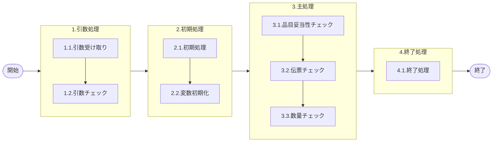

# 0. 表紙

| モジュール名 | プログラムID | プログラム名                |
| ------------ | ------------ | --------------------------- |
| IC           | LDAS0316     | VALID／トヨタ直送品在庫更新 |

| RFC | Version | 更新日     |  更新者  | 更新内容 | 確認日     | 確認者 | 承認日     | 承認者 |
| --- | :-----: | ---------- | :------: | -------- | ---------- | :----: | ---------- | :----: |
| -   |  1.0.0  | 2025/10/03 | 鈴木祐介 | 初版作成 | 2025/XX/XX |  XXX  | 2025/XX/XX |  XXX  |

## 1. 処理概要

### 1.1. 機能概要

トヨタ直送品在庫更新のバリデーションチェックを実施する

### 1.2. 処理概要フロー



### 1.3. プログラム入出力パラメータ

#### 1.3.1. 引数

| No. | パラメータ論理名   | パラメータ物理名 | 属性    | 備考                                      |
| --- | ------------------ | ---------------- | ------- | ----------------------------------------- |
| 1   | 変更区分           | ps_control_class | VARCHAR | ブランク:報告*:訂正                       |
| 2   | ユーザーＩＤ       | ps_user_id       | VARCHAR | 画面：PymacユーザーＩＤその他：「SYSTEM」 |
| 3   | ログ出力サイン     | ps_log_sign      | VARCHAR | 0:ログ出力しない1:ログ出力                |
| 4   | 受信ＩＤ           | ps_receive_id    | VARCHAR | 外部データ：受信ＩＤ                      |
| 5   | 相手先システムＩＤ | ps_system_id     | VARCHAR | 外部データ：相手先ｼｽﾃﾑID              |
| 6   | 品目番号           | ps_itemno        | VARCHAR |                                           |
| 7   | 供給者             | ps_supplier      | VARCHAR |                                           |
| 8   | 使用者             | ps_usercd        | VARCHAR |                                           |
| 9   | 伝票番号           | ps_slip_no       | VARCHAR |                                           |
| 10  | 数量               | pn_qty           | DECIMAL |                                           |
| 11  | 起票日             | ps_input_date    | VARCHAR | YYYYMMDD                                  |

#### 1.3.2. 戻り値

| No. | パラメータ論理名 | パラメータ物理名 | 属性                                          | 備考 |
| --- | ---------------- | ---------------- | --------------------------------------------- | ---- |
| 1   | 処理ステータス   | rn_status        | 0:NormalEnd,-1:SQLError/-2:PGError,1:警告発生 |      |
| 2   | SQLコード        | rs_sql_code      |                                               |      |
| 3   | エラーコード     | rs_err_code      |                                               |      |
| 4   | エラーメッセージ | rs_err_msg       |                                               |      |
| 5   | エラー位置       | rs_err_focus     |                                               |      |

### 1.4. その他制御・要件

| 排他制御 |      |      |
| -------- | ---- | ---- |
| 楽観     | 悲観 | 無し |
| 〇       | -    | -    |

| 項目               | 制約・制御・要件など | 記載内容説明 |
| ------------------ | -------------------- | ------------ |
| パフォーマンス要件 | 特になし。           |              |

### 1.5. 入出力一覧

| No | 入出力対象 | 名称 | 物理名称 | ID | C | R | U | D | 備考 |
| -- | ---------- | ---- | -------- | -- | - | - | - | - | ---- |
| 1  |            |      |          |    |   |   |   |   |      |

## 2. 詳細処理

### 2.1. 引数の取得とチェック

- 特記事項無し

### 2.2. 初期処理

- 特記事項無し

### 2.3. 主処理

### 2.3.1. 品目妥当性チェック

- LDAS0300 Valid／品目妥当性チェックSPを呼び出す

```sql
SELECT *
INTO STRICT rec_sp_LDAS0300
FROM LDAS0300 ( 'LD15'
            , 引数.品目番号
            , 引数.供給者
            , 引数.使用者
            );
```

- 戻り値セット
  - 変数.品目クラス           = LDAS0300.品目クラス
  - 戻り値.ステータス         = LDAS0300.処理ステータス
  - 戻り値.SQLコード          = LDAS0300.SQLコード
  - 戻り値.エラーコード       = LDAS0300.エラーコード
  - 戻り値.エラーメッセージ   = LDAS0300.エラーメッセージ
  - 戻り値.エラー位置         = LDAS0300.エラー位置
  - 戻り値.ステータス＝ -1 の場合、ＳＱＬエラーとしてトラップする
  - 戻り値.ステータス＝ -2 の場合、処理エラーとしてトラップする

### 2.3.2. 伝票番号チェック

- 伝票番号が ' ' もしくは NULL だった場合、エラーメッセージを出力し処理終了
  - エラーコード : ld.E.LDP10085
  - エラーメッセージ : 'Enter Slip Number.'
  - (伝票番号を入力してください。)

### 2.3.3. 数量チェック
- 引数.数量<=0 だった場合、エラーメッセージを出力し処理終了
 - エラーコード : ld.E.LDP10086
  - エラーメッセージ : 'Specify value more than 0 for {0}. '
  - (０以下の数量は指定できません。)

### 2.4. 終了処理

- 正常終了処理を行う

| 戻り値           | 設定値        |
| ---------------- | ------------- |
| 処理ステータス   | 0             |
| SQL コード       | スペース      |
| エラーコード     | スペース      |
| エラーメッセージ | スペース      |
| エラー位置       | スペース      |
| 処理識別         | 変数.処理識別 |
| 内部TXN          | 変数.内部TXN  |

## 3. 補足説明

### 3.1. 戻り値について

- ステータスについて
  0 : Normal End
  -1 : Abnormal End
  -2 : PGM エラー

### 3.2. エラー発生時の対応について

- SQL エラーが発生した場合、エラーログを出力して処理終了
- 引数.エラーログサイン='1'の時
  - LDAS0409　エラーログ登録を呼び出しエラーログファイルへ1レコード追加する
  ```sql
          SELECT *
            FROM LDAS0409 ( '99'                   --作成区分
                          , ps_user_id             --入力ユーザーID
                          , rs_err_code            --エラーコード
                          , 'LD15'                 --処理識別
                          , ps_control_class       --変更区分
                          , '9'                    --エラーレベルステータス
                          , ps_receive_id          --受信ID
                          , ps_system_id           --相手先システム識別
                          , ' '                    --入力元トランザクション
                          , 'LDAS0316'             --エラー発生処理ID
                          , ps_itemno              --品目番号
                          , ps_supplier            --供給者
                          , ps_usercd              --使用者
                          , ps_order_no            --オーダー番号
                          , ' '                    --伝票番号
                          , ' '                    --引落区分
                          , pn_qty                 --数量
                          , ' '                    --理由コード（発注理由）
                          , ' '                    --費用振替先区分
                          , ' '                    --費用振替先コード
                          , ' '                    --勘定科目コード
                          , ' '                    --目的No
                          , ' '                    --受払種別コード
                          , ' '                    --生試処理タイプ
                          , ' '                    --着手日
                          , ' '                    --納入日
                          , ' '                    --払出日
                          , ' '                    --完了開始時間
                          , ' '                    --完了終了時間
                          , ' '                    --繰越調整数
                          , ' '                    --生試初品区分
                          , ' '                    --所要量区分
                          , ' '                    --独立需要送り先区分
                          , ' '                    --独立需要送り先コード
                          , 0                      --振替理由コード
                          , ' '                    --削除日付
                          , ' '                    --フリーコメント
                          , ' '                    --サービスパーツ特別発注区分
                          , ' '                    --サービスパーツ直納先コード
                          , ' '                    --サービスパーツディーラNO
                          , ' '                    --サービスパーツ受注番号
                          , ' '                    --着手／払出日
                          , ps_delivery_card_no    --納品書番号
                          , 0                      --保留在庫数
                          , ps_input_date          --起票日
                          , ' '                    --責任工程
                          , ' '                    --責任職場／メーカー区分
                          , ' '                    --責任職場／メーカー
                          , ' '                    --組立ライン
                          , ' '                    --組立順序番号
                          , ' '                    --金額
                          , ' '                    --移動先使用者
                          , ' '                    --仕掛サイン
                          , ' '                    --インボイスNo
                          , ' '                    --B/L No
                          , 0                      --ケースNo
                          , ' '                    --ケースマークオーダ番号
                          , ' '                    --G-SDMオーダー番号
                          , 0                      --外売品フラグ
                          , ' '                    --HU-ID
                          , ' '                    --工程番号
                          , ' '                    --原価用品目番号
                          , ' '                    --原価用供給者
                          , ' '                    --原価用使用者
                          , ' '                    --原価用オーダー番号
                          , ps_itemno              --エラーレベル品目番号
                          , ps_supplier            --エラーレベル供給者
                          , ps_usercd              --エラーレベル使用者
                          , pn_qty                 --エラーレベル数量
                          , ' '                    --エラーレベル着手日
                          , ' '                    --エラーレベル納入日
                          , ' '                    --エラーレベル払出日
                          );
  ``` 

### 3.3. 基本設計からの変更

- 戻り値のIASMコード、PGステータスを廃止、エラーコードとエラーメッセージを設定
- エラー位置："LDAS0316"
- サイトクラス廃止
- チェックID不要（999：すべて　になるため、分岐処理廃止）
