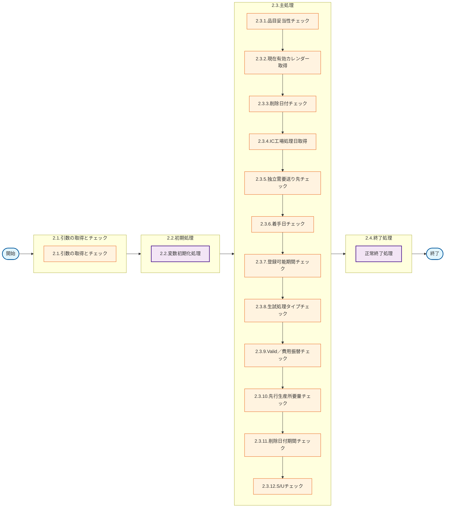

# 0. 表紙

| モジュール名 | プログラムID | プログラム名          |
| ------------ | ------------ | --------------------- |
| IC           | LDAS0318     | Valid／独立所要量登録 |

| RFC | Version | 更新日     | 更新者 | 更新内容 | 確認日     | 確認者 | 承認日     | 承認者 |
| --- | :-----: | ---------- | :----: | -------- | ---------- | :----: | ---------- | :----: |
| -   |  1.0.0  | 2025/09/16 | 余暁東 | 初版作成 | 2025/XX/XX |  XXX  | 2025/XX/XX |  XXX  |

## 1. 処理概要

### 1.1. 機能概要

登録する独立所要量のPFマスタで存在する場合（変数.存在するクラス2 = 1）、以下のエリア構成チェックを実行：

```sql
IF EXISTS(SELECT 1
　　　　FROM PFマスタ pf
       　　 JOIN GIMACエリア構成 area
  　　　 ON pf.area_category = area.child_area_code     -- 子エリアコード
　　　　WHERE pf.pf_code = ps_ind_user_code　-- 独立需要送り先コード
　　　　AND area.area_strc_type_code = 'X'
　　　　AND pf.area_category = area.child_area_code 
　　　　AND  area.in_effective_ymd  <= 変数.ic_slip_date -- 2.3.4.で取得
　　　　AND area.exp_out_eff_ymd   > 変数.ic_slip_date -- 2.3.4.で取得
　　　    AND (area.parent_area_category = '02'
　　　　OR area.parent_area_category = '51'))THEN
　　　　変数.取引フラグ = 1
```

- 条件に該当しない場合：エラー処理（ld.E.LDP10096）る。

### 1.2. 処理概要フロー



### 1.3. プログラム入出力パラメータ

#### 1.3.1. 引数

| No. | パラメータ論理名                 | パラメータ物理名        | 属性    | 備考                                                                                                   |
| --- | -------------------------------- | ----------------------- | ------- | ------------------------------------------------------------------------------------------------------ |
| 1   | ユーザーＩＤ                     | ps_user_id              | VARCHAR | 画面：PymacユーザーＩＤその他：「SYSTEM」                                                              |
| 2   | ログ出力サイン                   | ps_log_sign             | VARCHAR | 0:ログ出力しない1:ログ出力                                                                             |
| 3   | 受信ID                           | ps_receive_id           | VARCHAR | 外部データ：受信ＩＤ                                                                                   |
| 4   | 相手先システム識別               | ps_request_system_code  | VARCHAR | 外部データ：相手先ｼｽﾃﾑコード                                                                       |
| 5   | 品目番号                         | ps_itemno               | VARCHAR |                                                                                                        |
| 6   | 供給者                           | ps_supplier             | VARCHAR |                                                                                                        |
| 7   | 使用者                           | ps_usercd               | VARCHAR |                                                                                                        |
| 8   | オーダー番号                     | ps_order_no             | VARCHAR |                                                                                                        |
| 9   | 所要量区分                       | ps_rd_class             | VARCHAR | 0:通常、1:先行生産、2:変動安全在庫、3:自動安全在庫、4:生試所要量調整、5:同梱品出庫用、6:所要量分割調整 |
| 10  | 独立需要送り先区分               | ps_ind_user_class       | VARCHAR | SUコードorP/Fコードのみ                                                                                |
| 11  | 独立需要送り先コード             | ps_ind_user_code        | VARCHAR |                                                                                                        |
| 12  | 着手日                           | ps_start_date           | VARCHAR | YYYYMMDD                                                                                               |
| 13  | 理由コード                       | ps_reason_code          | VARCHAR |                                                                                                        |
| 14  | 生試初品区分                     | ps_pilot_class          | VARCHAR | 生試=２、量産初品=３、量産=SPACE（単品生試=4)？                                                        |
| 15  | 生試処理タイプ                   | ps_pilot_condition_type | VARCHAR | １：生試所要量＋サイン２：生試所要量－サイン                                                           |
| 16  | 所要数                           | pn_required_qty         | DECIMAL |                                                                                                        |
| 17  | コメント                         | ps_remark               | VARCHAR |                                                                                                        |
| 18  | 費用振替先区分                   | ps_transfer_class       | VARCHAR | 1:S/U2:原価センター3:受払種別                                                                          |
| 19  | 費用振替先コード                 | ps_transfer_code        | VARCHAR | 2：原価センターの場合10桁                                                                              |
| 20  | 振替理由コード                   | ps_transfer_reason_code | VARCHAR |                                                                                                        |
| 21  | 勘定科目コード                   | ps_account_heading      | VARCHAR |                                                                                                        |
| 22  | 目的No                           | ps_budget_no            | VARCHAR |                                                                                                        |
| 23  | 受払種別コード                   | ps_account_code_sales   | VARCHAR |                                                                                                        |
| 24  | 削除日付                         | ps_delete_ymd           | VARCHAR | YYYYMMDD                                                                                               |
| 25  | ｻｰﾋﾞｽﾊﾟｰﾂ特別発注区分   | ps_sp_order_class       | VARCHAR |                                                                                                        |
| 26  | ｻｰﾋﾞｽﾊﾟｰﾂ直送先ｺｰﾄﾞ | ps_sp_delivery_code     | VARCHAR |                                                                                                        |
| 27  | ｻｰﾋﾞｽﾊﾟｰﾂﾃﾞｨｰﾗｰNO | ps_sp_dealer_no         | VARCHAR |                                                                                                        |
| 28  | ｻｰﾋﾞｽﾊﾟｰﾂ受注番号       | ps_sp_order_no          | VARCHAR |                                                                                                        |

#### 1.3.2. 戻り値

| No. | パラメータ論理名 | パラメータ物理名 | 属性    | 備考     |
| --- | ---------------- | ---------------- | ------- | -------- |
| 1   | 処理ステータス   | rn_status        | INTEGER | 0        |
| 2   | SQLコード        | rs_sql_code      | VARCHAR | スペース |
| 3   | エラーコード     | rs_err_code      | VARCHAR | スペース |
| 4   | エラーメッセージ | rs_err_msg       | VARCHAR | スペース |
| 5   | エラー位置       | rs_err_focus     | VARCHAR |          |

### 1.4. その他制御・要件

| 排他制御 |      |      |
| -------- | ---- | ---- |
| 楽観     | 悲観 | 無し |
| ●       | -    | -    |

| 項目               | 制約・制御・要件など | 記載内容説明                                                     |
| ------------------ | -------------------- | ---------------------------------------------------------------- |
| パフォーマンス要件 | 特になし。           | 特別なパフォーマンス要件がある場合に要件内容とその対処法を記述。 |

### 1.5. 入出力一覧

| No | 入出力対象 | 名称                      | 物理名称              | C | R  | U | D | 備考               |
| -- | ---------- | ------------------------- | --------------------- | - | -- | - | - | ------------------ |
| 1  | テーブル   | SUマスタ                  | la_area_master_su     |   | ○ |   |   | 旧名称：組織SU情報 |
| 2  | テーブル   | GIMACエリアマスタ         | la_area_master        |   | ○ |   |   |                    |
| 3  | テーブル   | IC工場処理日              | ld_mst_slip_date      |   | ○ |   |   |                    |
| 4  | テーブル   | 日別カレンダーマスター    | le_mst_calendar_sum   |   | ○ |   |   |                    |
| 5  | テーブル   | MRPシステムパラメータ     | le_system_parameter   |   | ○ |   |   |                    |
| 6  | テーブル   | 機能オプションパラメータ  | lz_function_parameter |   | ○ |   |   |                    |
| 7  | 共通関数   | Valid／品目妥当性チェック | LDAS0300              |   |    |   |   |                    |
| 8  | 共通関数   | 確定期間検索              | LEBS0010              |   |    |   |   |                    |
| 9  | 共通関数   | 稼働日計算                | LEYS0001              |   |    |   |   |                    |
| 10 | 共通関数   | Valid／費用振替チェック   | LDAS0312              |   |    |   |   |                    |
| 11 | 共通関数   | エラーログ登録            | LDAS0409              |   |    |   |   |                    |

## 2. 詳細処理

### 2.1. 引数の取得とチェック

- 生試初品区分が'2'（生試）、'4'（単品生試）、ブランク（量産）以外の場合、エラーメッセージを出力し処理終了。

  - エラーコード：'ld.E.LDP10089'
  - エラーメッセージ：'You can specify only 2(Pilot Production), 4(Part Trial Production) or Blank(Mass Production) for Production Cl.'
    - (生試初品区分には２（生試）、４（単品生試）、または空白（量産）のみが指定可能です)
- 所要数が0以下の場合、エラーメッセージを出力し処理終了。

  - エラーコード：'ld.E.LDP10086'
  - エラーメッセージ：'You cannot specify 0 or less than 0.'
    - (０以下の数量は指定できません)

### 2.2. 初期処理

- 利用する変数を初期化する。

### 2.3. 主処理

#### 2.3.1. 品目妥当性チェック

LDAS0300（Valid／品目妥当性チェック）をコール

```sql
SELECT * 
  FROM LDAS0300('LD21',
                ps_itemno,
                ps_supplier,
                ps_usercd)
```

- 戻り値．ステータスがエラー(-1)の場合、エラー返して処理を異常終了させる
- 戻り値．ステータスがPGMエラー(-2)の場合、例外を発生させる
- その以外、以下の情報を取得：
  - 品目クラス
  - 品目ステータス
  - AIRSサイン
  - MRP需要方針コード
  - 変動安全在庫数量

#### 2.3.2. 現在有効カレンダー取得

##### 2.3.2.1. SUマスタから現在有効カレンダー取得

```sql
IF EXISTS(SELECT 1
          FROM la_area_master_su
          WHERE su_code = ps_usercd)THEN

          SELECT calendar_code
          FROM la_area_master_su
          WHERE su_code = ps_usercd;
```

- データが存在しない場合、エラーメッセージを出力し処理終了
  - エラーコード：'ld.E.LDP10062'
  - エラーメッセージ：'Effective calendar does not exist by the specified Supplier/User.'
    - (指定のＳＵで有効なカレンダーが存在しません。)

#### 2.3.3. 削除日付チェック

削除日付が入力されている場合のみ以下チェックを実行

##### 2.3.3.1. 稼働日チェック

```sql
IF EXISTS(SELECT day_type                         --稼働日区分
          FROM le_mst_calendar_sum               --日別カレンダーマスター
          WHERE calendar_code = ls_calendar_code --2.3.2.1で取得.現在有効カレンダー
            AND calendar_ymd = ps_delete_ymd)THEN

          SELECT day_type                          --稼働日区分
          FROM le_mst_calendar_sum                --日別カレンダーマスター
          WHERE calendar_code = ls_calendar_code  --2.3.2.1で取得.現在有効カレンダー
            AND calendar_ymd = ps_delete_ymd;
```

- データが存在しない場合

  - エラーコード：'ld.E.LDP10064'
  - エラーメッセージ：'Day String does not exist in the common calendar.'
    - (日情報がカレンダーテーブルに存在しません。)
- 稼働日区分が'0'（稼働日）以外の場合

  - エラーコード：'ld.E.LDP10090'
  - エラーメッセージ：'The day you specified is not a working-day.'
    - (指定日は稼働日ではありません。)

##### 2.3.3.2. 確定期間チェック

```sql
IF EXISTS(SELECT fix_period_id        --確定期間ID
          FROM le_mst_mrp_information --MRP情報値
          WHERE itemno = ps_itemno
            AND supplier = ps_supplier
            AND usercd = ps_usercd)THEN

SELECT fix_period_id                --確定期間ID
    FROM le_mst_mrp_information     --MRP情報値
  WHERE itemno = ps_itemno
      AND supplier = ps_supplier
      AND usercd = ps_usercd;
```

データが存在しない場合

- エラーコード：'ld.E.LDP11023'
- エラーメッセージ：'The data you specified is not exist in MRP information.'
  - (対象データはMRP情報値に存在しません。)

LEBS0010（確定期間検索）をコール

```sql
SELECT * 
  FROM LEBS0010(ls_fix_period_id,
                "T")
```

- 戻り値．ステータスがエラー(-1)の場合、エラー返して処理を異常終了させる。
- 戻り値．ステータスがPGMエラー(-2)の場合、例外を発生させる。
- その以外、以下の情報を取得：
  - 今回_確定期間最終日

引数.削除日付  <=  今回_確定期間最終日の場合、エラーメッセージを出力し処理終了

- エラーコード：'ld.E.LDP10091'
- エラーメッセージ：'For Deletion Date, specify the date later than the final day of the fixed period of this time.'
  - (削除日付には今回確定期間最終日よりも後の日付を指定してください。)

#### 2.3.4. IC工場処理日取得

```sql
IF EXISTS(SELECT 1
           FROM ld_mst_slip_date --IC工場処理日
          WHERE operation_type = 'STD' )THEN

          SELECT ic_slip_date --IC工場処理日
            FROM ld_mst_slip_date --IC工場処理日
           WHERE operation_type = 'STD'
```

- データが存在しない場合、エラーメッセージを出力し処理終了
  - エラーコード：'ld.E.LDP10004
  - エラーメッセージ：'The IC pymac date is not exist.'
    - (IC工場処理日が存在しません。)

#### 2.3.5. 独立需要送り先チェック

##### 2.3.5.1. 自動安全在庫所要量チェック機能判定

機能オプションパラメータから自動安全在庫所要量登録機能の設定を確認

```sql
SELECT 1
  FROM lz_function_parameter --機能オプションパラメータ
 WHERE system_code = 'LE'
   AND function_id = 'LEA0002'
   AND option_code = '0'
   AND select_flg = 'T';
```

- 設定が有効（データ登録しない）の場合：引数.所要量区分が'1'（先行生産）、'4'（生試所要量調整）の場合、変数.処理区分＝'1'
- 設定が無効（データ登録する）の場合：引数.所要量区分が'1'（先行生産）、'3'（自動安全在庫）、'4'（生試所要量調整）の場合、変数.処理区分＝'1'

##### 2.3.5.2. 変動安全在庫専用チェック

引数.所要量区分＝'2'（変動安全在庫）　かつ　変数.処理区分<> '1'の場合、以下チェックを実行：

###### 2.3.5.2.1. 費用振替先情報チェック

- 引数．費用振替先区分 または 費用振替先コード がブランク以外の場合
  - エラーコード：'ld.E.LDP10092'
  - エラーメッセージ：'Enter the value for Charged Section Classification and Code.'
    - (費用振替先区分、コードに値を入力してください。)

###### 2.3.5.2.2. 品目クラスチェック

- 2.3.1で取得.品目クラスが'0'（梱包資材）、'1'（原材料）、'2'（部品）以外の場合
  - エラーコード：'ld.E.LDP10022'
  - エラーメッセージ：'You can specify only the item of which Item Cl. is 0(Packing Materials) or 1(Raw Materials) or 2(Parts).'
    - (品目クラス＝０（梱包資材）、１（原材料）、２（部品）の品目のみ指定可能です。)

###### 2.3.5.2.3. 品目ステータスチェック

- 2.3.1で取得.品目ステータスが２～７の品目以外を指定した場合
  - エラーコード：'ld.E.LDP10025'
  - エラーメッセージ：'You can specify only the item of which Item Status is 2 to 7.'
    - (品目ステータス＝２～７の品目のみ指定可能です。)

###### 2.3.5.2.4. AIRS符号チェック

- 2.3.1で取得.AIRS符号が'1'（AIRS品目）の場合
  - エラーコード：'ld.E.LDP10034'
  - エラーメッセージ：'You cannot specify AIRS Item.'
    - (ＡＩＲＳ品目は指定できません。)

###### 2.3.5.2.5. 需要方針コードチェック

- 2.3.1で取得.MRP需要方針コードが２～５の品目以外を指定した場合
  - エラーコード：'ld.E.LDP10027'
  - エラーメッセージ：'You can specify only the item of which MRP Demand Policy Code is 2 to 5.'
    - (ＭＲＰ需要方針コード＝２～５の品目のみ指定可能です。)

###### 2.3.5.2.6. 変動安全在庫数量チェック

- 2.3.1で取得.変動安全在庫数量が0の場合
  - エラーコード：'ld.E.LDP10036'
  - エラーメッセージ：'You cannot specify the item of which Variable Safety Stock Quantity is 0.'
    - (変動安全在庫数量＝０の品目は指定できません。)

2.3.5.2.1 ~ 2.3.5.2.6 該当しない場合、処理区分＝ '1' 。

##### 2.3.5.3. 独立需要送り先情報チェック

変数.処理区分<> '1'場合、以下チェックを実行：

###### 2.3.5.3.1. 必須入力チェック

- 引数.独立需要送り先区分が空白 または 引数.独立需要送り先コード が空白の場合
  - エラーコード：'ld.E.LDP10093'
  - エラーメッセージ：'Enter the value for Independent Requirements Destination Classification and Code.'
    - (独立需要送り先区分、コードに値を入力してください。)

###### 2.3.5.3.2. 送り先区分チェック

- 引数．独立需要送り先区分が１(Ｓ／Ｕ)、２(経理コード)以外の場合
  - エラーコード：'ld.E.LDP10094'
  - エラーメッセージ：'You can specify only 1(S/U), 2(Accounting Code) or "X" for Independent Requirements Destination Classificaton.'
    - (独立需要送り先区分には１（Ｓ／Ｕ）、２（経理コード）、Ｘのみが指定可能です。)

##### 2.3.5.4. S/U送り先チェック（送り先区分='1'の場合）

###### 2.3.5.4.1. 独立需要送り先振替チェックマスタ確認

```sql
   IF EXISTS(SELECT 1
          FROM le_mst_ind_user_transfer_check --独立需要送り先/費用振替先チェックテーブル
          WHERE target_org_code = ps_ind_user_code)THEN

          SELECT valid_ind_user_yn,            --有効独立需要送り先コード区分
                 ind_user_eq_transfer_yn       --送り先/振替先等価区分
          FROM le_mst_ind_user_transfer_check --独立需要送り先/費用振替先チェックテーブル
          WHERE target_org_code = ps_ind_user_code;
```

- 有効独立需要送り先コード区分 = 'Y'(有効)の場合：有効な送り先として処理継続
- 送り先/振替先等価区分 = 'Y'(有効)の場合：独立需要送り先コードと費用振替先コードが同一である必要がある
  - 独立需要送り先コードと費用振替先コードが異なる場合のエラー：
    - エラーコード：'ld.E.LDP10095'
    - エラーメッセージ：'Specify the same value for Ind. Reqts. Destination and Charged Sec. when you specify CKD REPLACEMENT value for the both.'
      - (独立需要送り先／費用振替先にＣＫＤ＿ＲＥＰＬＡＣＥＭＥＮＴ値を入力する場合、両方とも同値を入力してください。)

###### 2.3.5.4.2.SUマスタ存在チェック

```sql
IF EXISTS(SELECT 1
　　　      FROM la_area_master_su --SUマスタ
    　　　 WHERE su_code = ps_ind_user_code)THEN

   　　　SELECT area_category　-- エリアカテゴリ
　　　    FROM la_area_master_su
    　　WHERE su_code = ps_ind_user_code;
```

- データが存在する場合：変数.存在するクラス1 = 1（SUマスタに存在）
- データが存在しない場合：変数.存在するクラス1 = 0（SUマスタに存在しない）

```sql
IF EXISTS(SELECT 1
　　　　FROM la_area_master_pf  --PFマスタ
　　　　WHERE pf_code = ps_ind_user_code)THEN

   　　　SELECT  area_category　-- エリアカテゴリ
　   　　FROM la_area_master_pf --PFマスタ
       　　WHERE pf_code = ps_ind_user_code;
```

- データが存在する場合：変数.存在するクラス2 = 1（PFマスタに存在）
- データが存在しない場合：変数.存在するクラス2 = 0（PFマスタに存在しない）

SUマスタ・PFマスタの両方にデータが存在しない場合：

- エラーコード：'ld.E.LDP10004'
- エラーメッセージ：'Receiver Code of independent demand does not exist in the organization master.'
  - (独立需要送り先コードが組織マスタに存在しません。)

SUマスタで存在する場合（変数.存在するクラス1 = 1）、以下のエリア構成チェックを実行：

```sql
IF EXISTS(SELECT 1
　　　　FROM la_area_master_su su                       --SUマスタ
       　　 JOIN la_areastrc area                       --GIMACエリア構成
  　　　 ON su.area_category = area.child_area_code     --子エリアコード
　　　　WHERE su.su_code = ps_ind_user_code　           --独立需要送り先コード
　　　　AND area.area_strc_type_code = 'X'
　　　　AND su.area_category = area.child_area_code 
　　　　AND  area.in_effective_ymd  <= 変数.ic_slip_date -- 2.3.4.で取得
　　　　AND area.exp_out_eff_ymd   > 変数.ic_slip_date   -- 2.3.4.で取得
　　　    AND (area.parent_area_category = '02'
　　　　OR area.parent_area_category = '51'))THEN
　　　　
       変数.取引フラグ = 1
```

- 条件に該当しない場合：エラー処理（ld.E.LDP10096）

取得したエリアカテゴリに基づく判定：

- 取得した.エリアカテゴリ = '03' または '53' の場合：処理を続行
- 取得した.エリアカテゴリ が '03' または '53' 以外の場合：エラー処理（ld.E.LDP10097）

PFマスタで存在する場合（変数.存在するクラス2 = 1）、以下のエリア構成チェックを実行：

```sql
IF EXISTS(SELECT 1
　　　　FROM la_area_master_pf pf                       --PFマスタ
       JOIN la_areastrc area                            --GIMACエリア構成
  　　　 ON pf.area_category = area.child_area_code     --子エリアコード
　　　　WHERE pf.pf_code = ps_ind_user_code　           --独立需要送り先コード
　　　　AND area.area_strc_type_code = 'X'
　　　　AND pf.area_category = area.child_area_code 
　　　　AND  area.in_effective_ymd  <= 変数.ic_slip_date --2.3.4.で取得
　　　　AND area.exp_out_eff_ymd   > 変数.ic_slip_date   --2.3.4.で取得
　　　    AND (area.parent_area_category = '02'
　　　　OR area.parent_area_category = '51'))THEN

　　　　変数.取引フラグ = 1
```

- 条件に該当しない場合：エラー処理（ld.E.LDP10096）

##### 2.3.6. 着手日チェック

```sql
IF NOT EXISTS(SELECT 1
                FROM le_mst_ind_user_transfer_check --独立需要送り先/費用振替先チェックテーブル
               WHERE target_org_code = ps_ind_user_code
                 AND ope_day_no_check_yn = 'Y')THEN
```

検索結果が0件の場合、以下チェックを実行

##### 2.3.6.1. 着手日稼働日チェック

```sql
SELECT 稼働日区分
  FROM 日別カレンダーマスター
 WHERE カレンダーコード = 2.3.2.1で取得.現在有効カレンダー
   AND カレンダー年月日 = ps_start_date;
```

- データが存在しない場合

  - エラーコード：'ld.E.LDP10064'
  - エラーメッセージ：'Day String does not exist in the common calendar.'
    - (日情報がカレンダーテーブルに存在しません。)
- 稼働日区分が'0'（稼働日）以外の場合

  - エラーコード：'ld.E.LDP10090'
  - エラーメッセージ：'The day you specified is not a working-day.'
    - (指定日は稼働日ではありません。)

##### 2.3.6.2. 過去日チェック

引数．着手日＜2.3.4で取得.IC工場処理日の場合：

- エラーコード：'ld.E.LDP10066'
- エラーメッセージ：'You cannot specify the past date for Start Date.'
  - (着手日には過去日付を指定できません。)

#### 2.3.7. 登録可能期間チェック

##### 2.3.7.1. システムパラメータ取得

```sql
IF EXISTS(SELECT 1
           FROM le_system_parameter)THEN

SELECT rd_input_days        --独立所要量登録可能日数,
       rd_delete_input_days --先行RD削除日登録可能日数
  FROM le_system_parameter; --MRPシステムパラメーター
```

データが存在しない場合：

- エラーコード：'ld.E.LDP10098'
- エラーメッセージ：'Independent Requirements Input Days does not exist in the MRP system parameter.'
  - (独立所要量登録可能日数がシステムパラメータに登録されていません。)

##### 2.3.7.2. 登録可能期間チェック

LEYS0001（稼働日計算）をコール

```sql
SELECT * 
  FROM LEYS0001(ls_calendar_code   --2.3.2.1で取得.現在有効カレンダー,
                ls_ic_slip_date,   --IC工場処理日
                ln_rd_input_days1)  --2.3.7.1で取得.独立所要量登録可能日数
```

- 戻り値．ステータスがエラー(-1)の場合、エラー返して処理を異常終了させる
- 戻り値．ステータスがPGMエラー(-2)の場合、例外を発生させる
- その以外、引数.着手日＞戻り値.対象日の場合：
  - エラーコード：'ld.E.LDP10099'
  - エラーメッセージ：'Start Date is over the period in which the date is able to be registered from now on.'
    - (着手日が現在から登録可能な期間を超えています。)

#### 2.3.8. 生試処理タイプチェック

引数.生試処理タイプが'1'または'2'の場合：

- 所要量区分が'4'（生試所要量調整）でない場合、または生試初品区分が'2'（生試）でない場合：
  - エラーコード：'ld.E.LDP10100'
  - エラーメッセージ：'In case of Operation Cl. is 1 or 2, specify X for Destn. Cd of Ind. Reqts. and 2(Pilot Prod.) for Production Class.'
    - (生試処理タイプ＝１、２の場合、独立需要送り先区分にＸ、生試初品区分に２（生試）を指定してください。)

#### 2.3.9. Valid／費用振替チェック

引数.所要量区分が'0'（通常）の場合：

LDAS0312（Valid／費用振替チェック）をコール

```sql
SELECT * 
  FROM LDAS0312(ps_transfer_class
                ,ps_transfer_code
                ,ps_account_heading
                ,ps_account_code_sales
                ,ps_start_date
                ,'1')
```

- 戻り値．ステータスがエラー(-1)の場合、エラー返して処理を異常終了させる
- 戻り値．ステータスがPGMエラー(-2)の場合、例外を発生させる
- 戻り値．ステータスが警告(1)の場合、警告返して処理を終了させる
- 戻り値．ステータスが警告(0)の場合、処理続行

#### 2.3.10. 先行生産所要量チェック

引数.所要量区分が'1'（先行生産）の場合：

##### 2.3.10.1. 削除日付必須チェック

引数.削除日付がブランクの場合：

- エラーコード：'ld.E.LDP10101'
- エラーメッセージ：'When you register Advanced Production Requirements, specify Deletion Date.'
  - (先行生産所要量の登録時は、削除日付を指定してください。)

##### 2.3.10.2. 削除日付相関チェック

引数.削除日付 <= 引数.着手日の場合：

- エラーコード：'ld.E.LDP10102'
- エラーメッセージ：'For Deletion Date, specify the date later than Start Date.'
  - (削除日付には着手日より大きな日付を指定してください。)

#### 2.3.11. 削除日付期間チェック

LEYS0001（稼働日計算）をコール

```sql
SELECT * 
  FROM LEYS0001(ls_calendar_code --2.3.2.1で取得.現在有効カレンダー,
                ps_start_date,
                ln_rd_delete_input_days1) --2.3.7.1で取得.削除登録可能日数
```

- 戻り値．ステータスがエラー(-1)の場合、エラー返して処理を異常終了させる
- 戻り値．ステータスがPGMエラー(-2)の場合、例外を発生させる
- その以外、引数.削除日付＞SP戻り値.対象日の場合：
  - エラーコード：'ld.E.LDP10103'
  - エラーメッセージ：'Deletion Date is over the period in which the date is able to be resistered from Start Date.'
  - (削除日が着手日から未来の登録可能な期間を超えています。)

#### 2.3.12. S/Uチェック

引数.所要量区分が'0'（通常）で、ps_supplierと使用者が異なる場合：

##### 2.3.12.1. SUマスタ存在チェック

```sql
IF EXISTS(SELECT 1
　　　　    FROM la_area_master_su --SUマスタ
　　　　  WHERE su_code = ps_usercd )THEN
SELECT area_category              --エリアカテゴリ
  FROM la_area_master_su         --SUマスタ
 WHERE su_code = ps_usercd;
```

データが存在しない場合：

- エラーコード：'ld.E.LDP10105'
- エラーメッセージ：'Data does not exist in the organization master.'
  - (組織マスターに登録されていません。)

##### 2.3.12.2. Ｓ/Ｕ（社外）チェック

2.3.12.1の存在チェックで存在し、取得.エリアカテゴリが'56'の場合：

- エラーコード：'ld.E.LDP10104'
- エラーメッセージ：'In case User is vendor, you cannot register the item of "S#U."'
  - (使用者が社外で、供給者≠使用者の品目は登録できません。)

### 2.4. 終了処理

- 正常終了処理を行う

| 戻り値           | 設定値   |
| ---------------- | -------- |
| 処理ステータス   | 0        |
| SQLコード        | スペース |
| エラーコード     | スペース |
| エラーメッセージ | スペース |
| エラー位置       | スペース |

## 3. 補足説明

### 3.1. 戻り値について

- 処理ステータス
  - 0: 正常終了
  - -1: SQLエラー
  - -2: プログラムエラー

### 3.2. エラー発生時の対応について

- 戻り値.エラー位置 :'LDAS0318'
- SQLエラーが発生した場合、戻り値を返して処理終了
- PGMエラーが発生した場合、

  - 引数.ログ出力サイン＝'1'の場合、エラーログファイルを1レコード生成する。
    ＊ LDAS0409：エラーログ登録を実行する。
  - 戻り値を返して処理終了

＊ LDAS0409：エラーログ登録を実行する

| No. | 引数                       | I/O | ｾｯﾄ値                        |
| --- | -------------------------- | --- | ------------------------------- |
| 1   | 作成区分                   | I   | '99'                            |
| 2   | 入力ユーザーＩＤ           | I   | 引数.ユーザーＩＤ               |
| 3   | エラーコード               | I   | 戻り値.エラーコード             |
| 4   | 処理識別                   | I   | 'LD21'                          |
| 5   | 変更区分                   | I   | '1'                             |
| 6   | エラーレベルステータス     | I   | 処理エラー：'9'／警告：'1'      |
| 7   | 受信ＩＤ                   | I   | 引数.受信ＩＤ                   |
| 8   | 相手先システム識別         | I   | 引数.相手先システム識別         |
| 9   | 入力元トランザクション     | I   | ' '                             |
| 10  | エラー発生処理ＩＤ         | I   | 'LDAS0318'                      |
| 11  | 品目番号                   | I   | ps_itemno                       |
| 12  | 供給者                     | I   | ps_supplier                     |
| 13  | 使用者                     | I   | ps_usercd                       |
| 14  | オーダー番号               | I   | 引数.オーダー番号               |
| 15  | 伝票番号                   | I   | ' '                             |
| 16  | 引落区分                   | I   | ' '                             |
| 17  | 数量                       | I   | 引数.所要数                     |
| 18  | 理由コード（発注理由）     | I   | 引数.理由コード                 |
| 19  | 費用振替先区分             | I   | 引数.費用振替先区分             |
| 20  | 費用振替先コード           | I   | 引数.費用振替先コード           |
| 21  | 勘定科目コード             | I   | 引数.勘定科目コード             |
| 22  | 目的No                     | I   | 引数.目的No                     |
| 23  | 受払種別コード             | I   | 引数.受払種別コード             |
| 24  | 生試処理タイプ             | I   | 引数.生試処理タイプ             |
| 25  | 着手日                     | I   | 引数.着手日                     |
| 26  | 納入日                     | I   | ' '                             |
| 27  | 払出日                     | I   | ' '                             |
| 28  | 完了開始時間               | I   | ' '                             |
| 29  | 完了終了時間               | I   | ' '                             |
| 30  | 繰越調整数                 | I   | 0                               |
| 31  | 生試初品区分               | I   | 引数.生試初品区分               |
| 32  | 所要量区分                 | I   | 引数.所要量区分                 |
| 33  | 独立需要送り先区分         | I   | 引数.独立需要送り先区分         |
| 34  | 独立需要送り先コード       | I   | 引数.独立需要送り先コード       |
| 35  | 振替理由コード             | I   | 引数.振替理由コード             |
| 36  | 削除日付                   | I   | 引数.削除日付                   |
| 37  | フリーコメント             | I   | 引数.コメント                   |
| 38  | サービスパーツ特別発注区分 | I   | 引数.サービスパーツ特別発注区分 |
| 39  | サービスパーツ直納先コード | I   | 引数.サービスパーツ直納先コード |
| 40  | サービスパーツディーラNO   | I   | 引数.サービスパーツディーラNO   |
| 41  | サービスパーツ受注番号     | I   | 引数.サービスパーツ受注番号     |
| 42  | 着手／払出日               | I   | ' '                             |
| 43  | 納品書番号                 | I   | ' '                             |
| 44  | 保留在庫数                 | I   | 0                               |
| 45  | 起票日                     | I   | ' '                             |
| 46  | 責任工程                   | I   | ' '                             |
| 47  | 責任職場／メーカー区分     | I   | ' '                             |
| 48  | 責任職場／メーカー         | I   | ' '                             |
| 49  | 組立ライン                 | I   | ' '                             |
| 50  | 組立順序番号               | I   | ' '                             |
| 51  | 金額                       | I   | 0                               |
| 52  | 移動先使用者               | I   | ' '                             |
| 53  | 仕掛サイン                 | I   | ' '                             |
| 54  | インボイスNo               | I   | ' '                             |
| 55  | B/L No                     | I   | ' '                             |
| 56  | ケースNo                   | I   | ' '                             |
| 57  | ケースマークオーダ番号     | I   | ' '                             |
| 58  | G-SDMオーダー番号          | I   | ' '                             |
| 59  | 外売品フラグ               | I   | ' '                             |
| 60  | HU-ID                      | I   | ' '                             |
| 61  | 工程番号                   | I   | ' '                             |
| 62  | 原価用品目番号             | I   | ' '                             |
| 63  | 原価用供給者               | I   | ' '                             |
| 64  | 原価用使用者               | I   | ' '                             |
| 65  | 原価用オーダー番号         | I   | ' '                             |
| 66  | エラーレベル品目番号       | I   | ps_itemno                       |
| 67  | エラーレベル供給者         | I   | ps_supplier                     |
| 68  | エラーレベル使用者         | I   | ps_usercd                       |
| 69  | エラーレベル数量           | I   | 引数.所要数                     |
| 70  | エラーレベル着手日         | I   | 引数.着手日                     |
| 71  | エラーレベル納入日         | I   | ' '                             |
| 72  | エラーレベル払出日         | I   | ' '                             |
