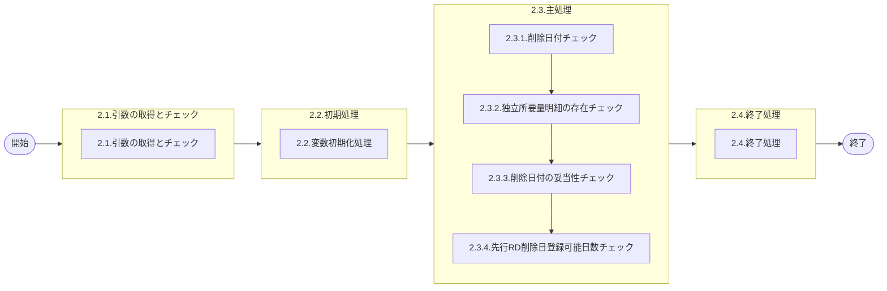

# 0. 表紙

| モジュール名 | プログラムID | プログラム名                  |
| ------------ | ------------ | ----------------------------- |
| IC           | LDAS0319     | Valid／独立所要量変更(先行RD) |

| RFC | Version | 更新日     | 更新者 | 更新内容 | 確認日     | 確認者 | 承認日     | 承認者 |
| --- | :-----: | ---------- | :----: | -------- | ---------- | :----: | ---------- | :----: |
| -   |  1.0.0  | 2025/09/16 | 余暁東 | 初版作成 | 2025/XX/XX |  XXX  | 2025/XX/XX |  XXX  |

## 1. 処理概要

### 1.1. 機能概要

変更する独立所要量の各項目に対するバリデーションを定義する。

### 1.2. 処理概要フロー



### 1.3. プログラム入出力パラメータ

#### 1.3.1. 引数

| No. | パラメータ論理名   | パラメータ物理名       | 属性    | 備考                                      |
| --- | ------------------ | ---------------------- | ------- | ----------------------------------------- |
| 1   | ユーザーＩＤ       | ps_user_id             | VARCHAR | 画面：PymacユーザーＩＤその他：「SYSTEM」 |
| 2   | ログ出力サイン     | ps_log_sign            | VARCHAR | 0:ログ出力しない1:ログ出力                |
| 3   | 受信ID             | ps_receive_id          | VARCHAR | 外部データ：受信ＩＤ                      |
| 4   | 相手先システム識別 | ps_request_system_code | VARCHAR | 外部データ：相手先ｼｽﾃﾑコード          |
| 5   | 品目番号           | ps_itemno              | VARCHAR |                                           |
| 6   | 供給者             | ps_supplier            | VARCHAR |                                           |
| 7   | 使用者             | ps_usercd              | VARCHAR |                                           |
| 8   | オーダー番号       | ps_order_no            | VARCHAR |                                           |
| 9   | 削除日付           | ps_delete_ymd          | VARCHAR | YYYYMMDD                                  |

#### 1.3.2. 戻り値

| No. | パラメータ論理名 | パラメータ物理名 | 属性    | 備考     |
| --- | ---------------- | ---------------- | ------- | -------- |
| 1   | 処理ステータス   | rn_status        | INTEGER | 0        |
| 2   | SQLコード        | rs_sql_code      | VARCHAR | スペース |
| 3   | エラーコード     | rs_err_code      | VARCHAR | スペース |
| 4   | エラーメッセージ | rs_err_msg       | VARCHAR | スペース |
| 5   | エラー位置       | rs_err_focus     | VARCHAR |          |

### 1.4. その他制御・要件

| 排他制御 |      |      |
| -------- | ---- | ---- |
| 楽観     | 悲観 | 無し |
| ●       | -    | -    |

| 項目               | 制約・制御・要件など | 記載内容説明                                                     |
| ------------------ | -------------------- | ---------------------------------------------------------------- |
| パフォーマンス要件 | 特になし。           | 特別なパフォーマンス要件がある場合に要件内容とその対処法を記述。 |

### 1.5. 入出力一覧

| No | 入出力対象 | 名称                    | 物理名称            | C | R  | U | D | 備考               |
| -- | ---------- | ----------------------- | ------------------- | - | -- | - | - | ------------------ |
| 1  | テーブル   | GIMACエリアマスタSU情報 | la_area_master_su   |   | ○ |   |   | 旧名称：組織SU情報 |
| 2  | テーブル   | 独立所要量明細          | le_trn_ird          |   | ○ |   |   |                    |
| 3  | テーブル   | IC工場処理日            | ld_mst_slip_date    |   | ○ |   |   |                    |
| 4  | テーブル   | MRPシステムパラメータ   | le_system_parameter |   | ○ |   |   |                    |
| 5  | テーブル   | 日別カレンダーマスタ    | le_mst_calendar_sum |   | ○ |   |   |                    |
| 6  | 共通関数   | 稼働日計算              | LEYS0001            |   |    |   |   |                    |
| 7  | 共通関数   | エラーログ登録          | LDAS0409            |   |    |   |   |                    |

## 2. 詳細処理

### 2.1. 引数の取得とチェック

- オーダー番号が  NULL  又は  ブランクの場合、エラーメッセージを出力し処理終了
  - エラーコード：'ld.E.LDP10050'
  - エラーメッセージ：'Enter Order Number'
    - （オーダー番号を入力してください）

### 2.2. 初期処理

- 利用する変数を初期化する。

### 2.3. 主処理

#### 2.3.1. 削除日付チェック

##### 2.3.1.1. 現在有効カレンダー取得

```sql
IF EXISTS(SELECT 1
            FROM la_area_master_su
           WHERE su_code = ps_usercd)THEN
          SELECT calendar_code          --現在有効カレンダー
            FROM la_area_master_su      --SUマスタ
           WHERE su_code = ps_usercd
```

- データが存在しない場合
  - エラーコード：'ld.E.LDP10062'
  - エラーメッセージ：'Effective calendar does not exist by the specified Supplier/User.'
    - (指定のＳＵで有効なカレンダーが存在しません。)

##### 2.3.1.2. 削除日付の稼働日区分チェック

```sql
IF EXISTS(SELECT 1
            FROM le_mst_calendar_sum
           WHERE calendar_code = 2.3.1.1.calendar_code
             AND calendar_ymd  = ps_delete_ymd)THEN
          SELECT day_type                --稼働日区分
            FROM le_mst_calendar_sum     --日別カレンダーマスタ
           WHERE calendar_code = 2.3.1.1.calendar_code
             AND calendar_ymd  = ps_delete_ymd
```

- データが存在しない場合

  - エラーコード：'ld.E.LDP10106'
  - エラーメッセージ：'Day String does not exist in the common calendar.'
    - (日情報がカレンダーテーブルに存在しません。)
- 稼働日区分が'0'（稼働日）以外の場合

  - エラーコード：'ld.E.LDP10064'
  - エラーメッセージ：'The day you specified is not a working-day.'
    - (指定日は稼働日ではありません。)

##### 2.3.1.3. IC工場処理日取得

```sql
IF EXISTS(SELECT 1
            FROM ld_mst_slip_date
           WHERE operation_type = 'STD')THEN

          SELECT ic_slip_date      --IC工場処理日
            FROM ld_mst_slip_date  --IC工場処理日
           WHERE operation_type = 'STD'
```

- データが存在しない場合、エラーメッセージを出力し処理終了
  - エラーコード：'ld.E.LDP10004'
  - エラーメッセージ：'The IC pymac date is not exist.'
    - (IC工場処理日が存在しません。)

##### 2.3.1.4. 削除日付とIC工場処理日の比較

- 引数.削除日付 < 2.3.1.3で取得.IC工場処理日の場合
  - エラーコード：'ld.E.LDP10091'
  - エラーメッセージ：'For Deletion Date, specify the date later than the final day of the fixed period of this time.'
    - （削除日付には今回確定期間最終日よりも後の日付を指定してください）

#### 2.3.2. 独立所要量明細の存在チェック

```sql
IF EXISTS(SELECT 1
            FROM le_trn_ird
           WHERE itemno     =  ps_itemno
             AND supplier   =  ps_supplier
             AND usercd     =  ps_usercd
             AND order_no   =  ps_order_no
             AND delete_ymd =  ' '
             AND rd_class   =  '1'
             AND start_date <> rls_start_date)THEN
          SELECT start_date,           --着手日
                 rls_start_date         --発注時着手日
            FROM le_trn_ird            --独立所要量明細
           WHERE itemno     =  ps_itemno
             AND supplier   =  ps_supplier
             AND usercd     =  ps_usercd
             AND order_no   =  ps_order_no
             AND delete_ymd =  ' '
             AND rd_class   =  '1'
             AND start_date <> rls_start_date
```

- データが存在しない場合、エラーメッセージを出力し処理終了
  - エラーコード：'ld.E.LDP10039'
  - エラーメッセージ：'The requirements you specified does not exist.'
    - （指定所要量が存在しません）

#### 2.3.3. 削除日付の妥当性チェック

- 引数.削除日付 = 2.3.2取得.着手日の場合、エラーメッセージを出力し処理終了

  - エラーコード：'ld.E.LDP10106'
  - エラーメッセージ：'Change Deletion Date.'
    - （削除日付を変更してください。）
- 引数.削除日付 <= 2.3.2取得.発注時着手日の場合、エラーメッセージを出力し処理終了

  - エラーコード：'ld.E.LDP10102'
  - エラーメッセージ：'For Deletion Date, specify the date later than Start Date.'
    - （削除日付には着手日より大きな日付を指定してください）

#### 2.3.4. 先行RD削除日登録可能日数チェック

##### 2.3.4.1. MRPシステムパラメータから先行RD削除日登録可能日数を取得

```sql
IF EXISTS(SELECT 1
            FROM le_system_parameter
           WHERE system_code = 'LE')THEN

          SELECT rd_delete_input_days --先行RD削除日登録可能日数
            FROM le_system_parameter  --MRPシステムパラメータ
           WHERE system_code = 'LE'
```

- データが存在しない場合、エラーメッセージを出力し処理終了
  - エラーコード：'ld.E.LDP10107'
    - （先行生産削除日登録可能日数がシステムパラメータに登録されていません。）
  - エラーメッセージ：'Advanced Production Deletion Date Input Days does not exist in the MRP system parameter.'

##### 2.3.4.2. 稼働日計算実行

LEYS0001（稼働日計算）をコール

```sql
   SELECT *
     FROM LEYS0001(2.3.1.1.calender_code               --2.3.1.1で取得.現在有効カレンダー
                  ,2.3.2.rls_start_date                --2.3.2で取得. 発注時着手日
                  ,2.3.4.1.rd_delete_input_days)       --2.3.4.1で取得.先行RD削除日登録可能日数)
```

- 戻り値がエラー(-1)の場合、エラーを返して処理終了
- 戻り値がPGMエラー(-2)の場合、例外を発生

##### 2.3.4.3. 削除日付の期間チェック

- 引数.削除日付 > 稼働日計算戻り値．対象日付の場合
  - エラーコード：'ld.E.LDP10103'
  - エラーメッセージ：'Deletion Date is over the period in which the date is able to be resistered from Start Date.'
    - （削除日が着手日から未来の登録可能な期間を超えています。）

### 2.4. 終了処理

- 正常終了処理を行う

| 戻り値           | 設定値   |
| ---------------- | -------- |
| 処理ステータス   | 0        |
| SQLコード        | スペース |
| エラーコード     | スペース |
| エラーメッセージ | スペース |
| エラー位置       | スペース |

## 3. 補足説明

### 3.1. 戻り値について

- 処理ステータス
  - 0: 正常終了
  - -1: SQLエラー
  - -2: プログラムエラー

### 3.2. エラー発生時の対応について

- 戻り値.エラー位置 :'LDAS0319'
- SQLエラーが発生した場合、戻り値を返して処理終了
- PGMエラーが発生した場合、
  - 引数.ログ出力サイン＝'1'の場合、エラーログファイルを1レコード生成する。
    ＊ LDAS0409：エラーログ登録を実行する。
  - 戻り値を返して処理終了

＊ LDAS0409：エラーログ登録を実行する

| No. | 引数                       | I/O | ｾｯﾄ値                |
| --- | -------------------------- | --- | ----------------------- |
| 1   | 作成区分                   | I   | '99'                    |
| 2   | 入力ユーザーＩＤ           | I   | 引数.ユーザーＩＤ       |
| 3   | エラーコード               | I   | 戻り値.エラーコード     |
| 4   | 処理識別                   | I   | 'LD21'                  |
| 5   | 変更区分                   | I   | '2'                     |
| 6   | エラーレベルステータス     | I   | '9'                     |
| 7   | 受信ＩＤ                   | I   | 引数.受信ＩＤ           |
| 8   | 相手先システム識別         | I   | 引数.相手先システム識別 |
| 9   | 入力元トランザクション     | I   | ' '                     |
| 10  | エラー発生処理ＩＤ         | I   | LDAS0319                |
| 11  | 品目番号                   | I   | 引数.品目番号           |
| 12  | 供給者                     | I   | 引数.供給者             |
| 13  | 使用者                     | I   | 引数.使用者             |
| 14  | オーダー番号               | I   | 引数.オーダー番号       |
| 15  | 伝票番号                   | I   | ' '                     |
| 16  | 引落区分                   | I   | ' '                     |
| 17  | 数量                       | I   | 0                       |
| 18  | 理由コード（発注理由）     | I   | ' '                     |
| 19  | 費用振替先区分             | I   | ' '                     |
| 20  | 費用振替先コード           | I   | ' '                     |
| 21  | 勘定科目コード             | I   | ' '                     |
| 22  | 目的No                     | I   | ' '                     |
| 23  | 受払種別コード             | I   | ' '                     |
| 24  | 生試処理タイプ             | I   | ' '                     |
| 25  | 着手日                     | I   | ' '                     |
| 26  | 納入日                     | I   | ' '                     |
| 27  | 払出日                     | I   | ' '                     |
| 28  | 完了開始時間               | I   | ' '                     |
| 29  | 完了終了時間               | I   | ' '                     |
| 30  | 繰越調整数                 | I   | ' '                     |
| 31  | 生試初品区分               | I   | ' '                     |
| 32  | 所要量区分                 | I   | ' '                     |
| 33  | 独立需要送り先区分         | I   | ' '                     |
| 34  | 独立需要送り先コード       | I   | ' '                     |
| 35  | 振替理由コード             | I   | ' '                     |
| 36  | 削除日付                   | I   | 引数.削除日付           |
| 37  | フリーコメント             | I   | ' '                     |
| 38  | サービスパーツ特別発注区分 | I   | ' '                     |
| 39  | サービスパーツ直納先コード | I   | ' '                     |
| 40  | サービスパーツディーラNO   | I   | ' '                     |
| 41  | サービスパーツ受注番号     | I   | ' '                     |
| 42  | 着手／払出日               | I   | ' '                     |
| 43  | 納品書番号                 | I   | ' '                     |
| 44  | 保留在庫数                 | I   | 0                       |
| 45  | 起票日                     | I   | ' '                     |
| 46  | 責任工程                   | I   | ' '                     |
| 47  | 責任職場／メーカー区分     | I   | ' '                     |
| 48  | 責任職場／メーカー         | I   | ' '                     |
| 49  | 組立ライン                 | I   | ' '                     |
| 50  | 組立順序番号               | I   | ' '                     |
| 51  | 金額                       | I   | ' '                     |
| 52  | 移動先使用者               | I   | ' '                     |
| 53  | 仕掛サイン                 | I   | ' '                     |
| 54  | インボイスNo               | I   | ' '                     |
| 55  | B/L No                     | I   | ' '                     |
| 56  | ケースNo                   | I   | ' '                     |
| 57  | ケースマークオーダ番号     | I   | ' '                     |
| 58  | G-SDMオーダー番号          | I   | ' '                     |
| 59  | 外売品フラグ               | I   | ' '                     |
| 60  | HU-ID                      | I   | ' '                     |
| 61  | 工程番号                   | I   | ' '                     |
| 62  | 原価用品目番号             | I   | ' '                     |
| 63  | 原価用供給者               | I   | ' '                     |
| 64  | 原価用使用者               | I   | ' '                     |
| 65  | 原価用オーダー番号         | I   | ' '                     |
| 66  | エラーレベル品目番号       | I   | 引数.品目番号           |
| 67  | エラーレベル供給者         | I   | 引数.供給者             |
| 68  | エラーレベル使用者         | I   | 引数.使用者             |
| 69  | エラーレベル数量           | I   | ' '                     |
| 70  | エラーレベル着手日         | I   | ' '                     |
| 71  | エラーレベル納入日         | I   | ' '                     |
| 72  | エラーレベル払出日         | I   | ' '                     |
