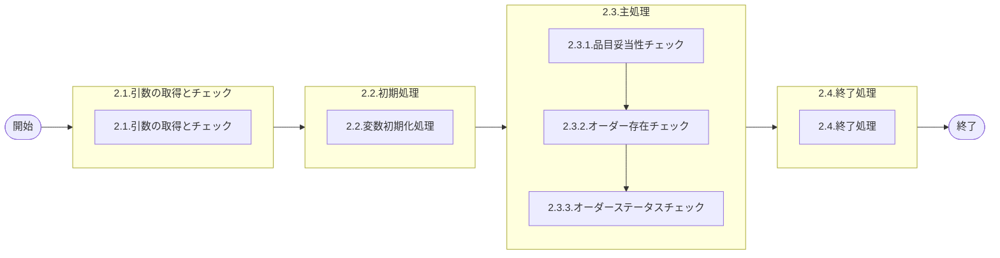

# 0. 表紙

| モジュール名 | プログラムID | プログラム名              |
| ------------ | ------------ | ------------------------- |
| IC           | LDAS0329     | Valid／Ｗビンオーダー削除 |

| RFC | Version | 更新日     | 更新者 | 更新内容 | 確認日     | 確認者 | 承認日     | 承認者 |
| --- | :-----: | ---------- | :----: | -------- | ---------- | :----: | ---------- | :----: |
| -   |  1.0.0  | 2025/09/19 | 余暁東 | 初版作成 | 2025/XX/XX |  XXX  | 2025/XX/XX |  XXX  |

## 1. 処理概要

### 1.1. 機能概要

削除するオーダーの各項目に対するバリデーションを定義する。

### 1.2. 処理概要フロー



### 1.3. プログラム入出力パラメータ

#### 1.3.1. 引数

| No. | パラメータ論理名   | パラメータ物理名 | 属性    | 備考                       |
| --- | ------------------ | ---------------- | ------- | -------------------------- |
| 1   | ユーザーＩＤ       | ps_user_id       | VARCHAR |                            |
| 2   | ログ出力サイン     | ps_log_sign      | VARCHAR | 0:ログ出力しない1:ログ出力 |
| 3   | 受信ID             | ps_receive_id    | VARCHAR |                            |
| 4   | 相手先システム識別 | ps_system_id     | VARCHAR |                            |
| 5   | 品目番号           | ps_itemno        | VARCHAR |                            |
| 6   | 供給者             | ps_supplier      | VARCHAR |                            |
| 7   | 使用者             | ps_usercd        | VARCHAR |                            |
| 8   | オーダー番号       | ps_order_no      | VARCHAR |                            |

#### 1.3.2. 戻り値

| No. | パラメータ論理名 | パラメータ物理名 | 属性    | 備考                                          |
| --- | ---------------- | ---------------- | ------- | --------------------------------------------- |
| 1   | 処理ステータス   | rn_status        | INTEGER | 0:NormalEnd／1:警告-1:SQLError／-2:処理エラー |
| 2   | SQLコード        | rs_sql_code      | VARCHAR |                                               |
| 3   | エラーコード     | rs_err_code      | VARCHAR |                                               |
| 4   | エラーメッセージ | rs_err_msg       | VARCHAR |                                               |
| 5   | エラー位置       | rs_err_focus     | VARCHAR |                                               |

### 1.4. その他制御・要件

| 排他制御 |      |      |
| -------- | ---- | ---- |
| 楽観     | 悲観 | 無し |
| ●       | -    | -    |

| 項目               | 制約・制御・要件など | 記載内容説明                                                     |
| ------------------ | -------------------- | ---------------------------------------------------------------- |
| パフォーマンス要件 | 特になし。           | 特別なパフォーマンス要件がある場合に要件内容とその対処法を記述。 |

### 1.5. 入出力一覧

| No | 入出力対象 | 名称                      | 物理名称     | C | R  | U | D | 備考 |
| -- | ---------- | ------------------------- | ------------ | - | -- | - | - | ---- |
| 1  | テーブル   | オーダー明細              | le_trn_order |   | ○ |   |   |      |
| 2  | 共通関数   | Valid／品目妥当性チェック | LDAS0300     |   |    |   |   |      |
| 3  | 共通関数   | エラーログ出力            | LDAS0409     |   |    |   |   |      |

## 2. 詳細処理

### 2.1. 引数の取得とチェック

- 引数.ユーザーＩＤがNULLの場合、エラーメッセージを出力し処理終了。

  - エラーコード : ld.E.LDP10110
  - エラーメッセージ : 'Specify the User ID.'
    - (オーダー番号を入力してください。)
- 引数.ログ出力サインがNULLまたは空白の場合、エラーメッセージを出力し処理終了。

  - エラーコード : ld.E.LDP10111
  - エラーメッセージ : 'Specify the Log Sign.'
    - (ログ出力サインを指定してください。)
- 引数.受信IDがNULLの場合、エラーメッセージを出力し処理終了。

  - エラーコード : ld.E.LDP10112
  - エラーメッセージ : 'Specify the Receive ID.'
    - (受信IDを指定してください。)
- 引数.相手先システム識別がNULLの場合、エラーメッセージを出力し処理終了。

  - エラーコード : ld.E.LDP10113
  - エラーメッセージ : 'Specify the System ID.'
    - (相手先システム識別を指定してください。)
- 引数.品目番号がNULLまたは空白の場合、エラーメッセージを出力し処理終了。

  - エラーコード : ld.E.LDP10055
  - エラーメッセージ : 'Specify the Item Number.'
    - (品目番号を指定してください。)
- 引数.供給者がNULLまたは空白の場合、エラーメッセージを出力し処理終了。

  - エラーコード : ld.E.LDP10056
  - エラーメッセージ : 'Specify the Supplier.'
    - (供給者を指定してください。)
- 引数.使用者がNULLまたは空白の場合、エラーメッセージを出力し処理終了。

  - エラーコード : ld.E.LDP10057
  - エラーメッセージ : 'Specify the User.'
    - (使用者を指定してください。)
- 引数.オーダー番号がNULLまたは空白の場合、エラーメッセージを出力し処理終了。

  - エラーコード : ld.E.LDP10130
  - エラーメッセージ : 'Specify the Order Number.'
    - (オーダー番号を指定してください。)
- 引数.オーダー番号の1文字目が'W'でない場合、エラーメッセージを出力し処理終了。

  - エラーコード : ld.E.LDP10131
  - エラーメッセージ : 'Specify "W" in the first digit of Order Number.'
    - (オーダー番号の先頭１桁には W を指定してください。)

### 2.2. 初期処理

- 利用する変数を初期化する。

### 2.3. 主処理

#### 2.3.1. 品目妥当性チェック

LDAS0300（Valid／品目妥当性チェック）をコールして品目の妥当性をチェックする。

```sql
   SELECT *
     FROM LDAS0300('LD71'
                    ,ps_itemno
                    ,ps_supplier
                    ,ps_usercd)
```

- 戻り値．ステータスがエラー(-1)の場合、エラー返して処理を異常終了させる。
- 戻り値．ステータスがPGMエラー(-2)の場合、例外を発生させる。

#### 2.3.2. オーダー存在チェック

```sql
IF EXISTS(SELECT 1
            FROM le_trn_order --オーダー明細
           WHERE itemno   = ps_itemno
             AND supplier = ps_supplier
             AND usercd   = ps_usercd
             AND order_no = ps_order_no)THEN

          SELECT order_status  --オーダーステータス
            FROM le_trn_order  --オーダー明細
           WHERE itemno   = ps_itemno
             AND supplier = ps_supplier
             AND usercd   = ps_usercd
             AND order_no = ps_order_no
```

- 検索結果が0件の場合、エラーメッセージを出力し処理終了。
  - エラーコード : ld.E.LDP10527
  - エラーメッセージ : 'The order you specified does not exist Error: [品目番号] [供給者] [使用者] [オーダー番号]'
    - (指定オーダーが存在しません。)

#### 2.3.3. オーダーステータスチェック

- 2.3.2で取得.オーダーステータス = '9'の場合、エラーメッセージを出力し処理終了。
  - エラーコード : ld.E.LDP10018
  - エラーメッセージ : 'You cannot specify the closed order Number:  2.3.2で取得.オーダーステータス'
    - (クローズされたオーダー番号は指定できません。)

### 2.4. 終了処理

- 正常終了処理を行う。

| 戻り値           | 設定値   |
| ---------------- | -------- |
| 処理ステータス   | 0        |
| SQLコード        | スペース |
| エラーコード     | スペース |
| エラーメッセージ | スペース |
| エラー位置       | スペース |

## 3. 補足説明

### 3.1. 戻り値について

- 処理ステータス
  - 0: 正常終了
  - 100: データなし
  - -1: SQLエラー
  - -2: プログラムエラー

### 3.2. エラー発生時の対応について

- 戻り値.エラー位置 :'LDAS0329'
- SQLエラーが発生した場合、戻り値を返して処理終了。
- PGMエラーが発生した場合、
  - 引数.ログ出力サイン＝'1'の場合、エラーログファイルを1レコード生成する。
    ＊ LDAS0409：エラーログ登録を実行する。
  - 戻り値を返して処理終了。

＊ LDAS0409：エラーログ登録

| No. | 引数                       | I/O | ｾｯﾄ値                |
| --- | -------------------------- | --- | ----------------------- |
| 1   | 作成区分                   | I   | '99'                    |
| 2   | 入力ユーザーＩＤ           | I   | 引数.ユーザーＩＤ       |
| 3   | エラーコード               | I   | 戻り値.エラーコード     |
| 4   | 処理識別                   | I   | 'LD71'                  |
| 5   | 変更区分                   | I   | '3'                     |
| 6   | エラーレベルステータス     | I   | '9'                     |
| 7   | 受信ＩＤ                   | I   | 引数.受信ＩＤ           |
| 8   | 相手先システム識別         | I   | 引数.相手先システム識別 |
| 9   | 端末番号                   | I   | ' '                     |
| 10  | エラー発生処理ＩＤ         | I   | ' '                     |
| 11  | 処理ＩＤ                   | I   | 'LDAS0329'              |
| 12  | 品目番号                   | I   | 引数.品目番号           |
| 13  | 供給者                     | I   | 引数.供給者             |
| 14  | 使用者                     | I   | 引数.使用者             |
| 15  | オーダー番号               | I   | 引数.オーダー番号       |
| 16  | 伝票番号                   | I   | ' '                     |
| 17  | 引落区分                   | I   | ' '                     |
| 18  | 数量                       | I   | 0                       |
| 19  | 理由コード（発注理由）     | I   | ' '                     |
| 20  | 費用振替先区分             | I   | ' '                     |
| 21  | 費用振替先コード           | I   | ' '                     |
| 22  | 勘定科目コード             | I   | ' '                     |
| 23  | 目的No                     | I   | ' '                     |
| 24  | 受払種別コード             | I   | ' '                     |
| 25  | 生試処理タイプ             | I   | ' '                     |
| 26  | 着手日                     | I   | ' '                     |
| 27  | 納入日                     | I   | ' '                     |
| 28  | 払出日                     | I   | ' '                     |
| 29  | 完了開始時間               | I   | ' '                     |
| 30  | 完了終了時間               | I   | ' '                     |
| 31  | 繰越調整数                 | I   | ' '                     |
| 32  | 生試初品区分               | I   | ' '                     |
| 33  | 所要量区分                 | I   | ' '                     |
| 34  | 独立需要送り先区分         | I   | ' '                     |
| 35  | 独立需要送り先コード       | I   | ' '                     |
| 36  | 振替理由コード             | I   | ' '                     |
| 37  | 削除日付                   | I   | 0                       |
| 38  | フリーコメント             | I   | ' '                     |
| 39  | サービスパーツ特別発注区分 | I   | ' '                     |
| 40  | サービスパーツ直納先コード | I   | ' '                     |
| 41  | サービスパーツディーラNO   | I   | ' '                     |
| 42  | サービスパーツ受注番号     | I   | ' '                     |
| 43  | 着手／払出日               | I   | ' '                     |
| 44  | 納品書番号                 | I   | ' '                     |
| 45  | 保留在庫数                 | I   | ' '                     |
| 46  | 起票日                     | I   | ' '                     |
| 47  | 責任工程                   | I   | ' '                     |
| 48  | 責任職場／メーカー区分     | I   | ' '                     |
| 49  | 責任職場／メーカー         | I   | ' '                     |
| 50  | 組立ライン                 | I   | ' '                     |
| 51  | 組立順序番号               | I   | 0                       |
| 52  | 金額                       | I   | ' '                     |
| 53  | 移動先使用者               | I   | ' '                     |
| 54  | 仕掛サイン                 | I   | ' '                     |
| 55  | インボイスNo               | I   | ' '                     |
| 56  | B/L No                     | I   | ' '                     |
| 57  | ケースNo                   | I   | ' '                     |
| 58  | ケースマークオーダ番号     | I   | 0                       |
| 59  | G-SDMオーダー番号          | I   | ' '                     |
| 60  | 外売品フラグ               | I   | ' '                     |
| 61  | HU-ID                      | I   | ' '                     |
| 62  | 工程番号                   | I   | ' '                     |
| 63  | 原価用品目番号             | I   | ' '                     |
| 64  | 原価用供給者               | I   | ' '                     |
| 65  | 原価用使用者               | I   | ' '                     |
| 66  | 原価用オーダー番号         | I   | ' '                     |
| 67  | エラーレベル品目番号       | I   | 引数.品目番号           |
| 68  | エラーレベル供給者         | I   | 引数.供給者             |
| 69  | エラーレベル使用者         | I   | 引数.使用者             |
| 70  | エラーレベル数量           | I   | 0                       |
| 71  | エラーレベル着手日         | I   | ' '                     |
| 72  | エラーレベル納入日         | I   | ' '                     |
| 73  | エラーレベル払出日         | I   | ' '                     |
