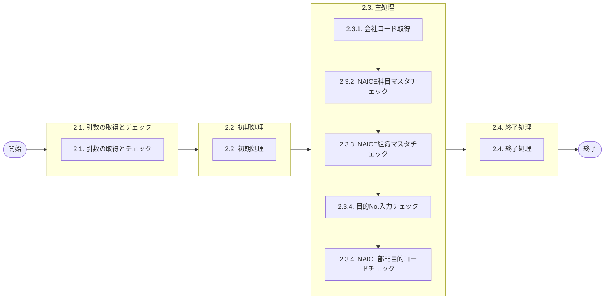

# 0. 表紙

| モジュール名 | プログラムID | プログラム名 |
| --- | --- | --- |
| IC | LDAS0334 | Valid／部門目的コード |

| RFC        | Version | 更新日      | 更新者 | 更新内容 | 確認日 | 確認者 | 承認日     | 承認者 |
| ---------- | :-----: | ----------- | :----: | -------- | ------ | :----: | ---------- | :----: |
| - |  1.0.0  | 2025/10/29 |   | 初版作成   | 2025/XX/XX  |  XXX  | 2025/XX/XX |  XXX  |

## 1. 処理概要

### 1.1. 機能概要

目的No.が指定された場合、NAICE部門目的コードに登録されているかのチェックを行う。

### 1.2. 処理概要フロー

### 1.3. プログラム入出力パラメータ

#### 1.3.1. 引数

| No. | パラメータ論理名 | パラメータ物理名 | 属性 | 備考 |
| --- | --- | --- | --- | --- |
| 1 | 勘定科目コード | ps_account_heading | VARCHAR |  |
| 2 | 振替先区分 | ps_transfer_class | VARCHAR | 1:SUコード、2:原価センター、3:受払種別 |
| 3 | 経費部課コード | ps_transfer_cd | VARCHAR | 2：原価センターの場合、10桁 |
| 4 | チェック年月日 | ps_check_date | VARCHAR | YYYYMMDD |
| 5 | 目的No | ps_budget_no | VARCHAR |  |

#### 1.3.2. 戻り値

| No. | パラメータ論理名 | パラメータ物理名 | 属性    | 備考 |
| --- | ---------------- | ---------------- | ------- | ---- |
| 1   | 処理ステータス   | rn_status        | INTEGER |      |
| 2   | SQLコード        | rs_sql_code      | VARCHAR |      |
| 3   | エラーコード     | rs_err_code      | VARCHAR |      |
| 4   | エラーメッセージ | rs_err_msg       | VARCHAR |      |
| 5   | エラー位置       | rs_err_focus     | VARCHAR |      |

### 1.4. その他制御・要件

| 排他制御 |  |  |
| --- | --- | --- |
| 楽観 | 悲観 | 無し |
| ● | - | - |

| 項目 | 制約・制御・要件など | 記載内容説明 |
| --- | --- | --- |
| パフォーマンス要件 | 特になし。  |

### 1.5. 入出力一覧

| No | 入出力対象 | 名称 | 物理名称 | C | R | U | D | 備考 |
| --- | --- | --- | --- | --- | --- | --- | --- | --- |
| 1 | テーブル | 会社記述 | lz_company_desc |  | ○ |  |  |  |
| 2 | テーブル | [ｼﾉﾆﾑ]NAICE科目マスタ | lz_s_bmakamoku |  | ○ |  |  |  |
| 3 | テーブル | [ｼﾉﾆﾑ]NAICE組織マスタ | lz_s_bmasosiki |  | ○ |  |  |  |
| 4 | テーブル | [ｼﾉﾆﾑ]部門目的マスタ | lz_s_bmadivpur |  | ○ |  |  |  |

## 2. 詳細処理

### 2.1. 引数の取得とチェック
特記なし

### 2.2. 初期処理

### 2.3. 主処理

### 2.3.1. 会社コード取得

### 2.3.2. NAICE科目マスタチェック

### 2.3.4. 目的No.入力チェック

### 2.3.4. NAICE部門目的コードチェック

### 2.4. 終了処理

- 正常終了処理を行う

| No. | 戻り値           | 属性    | 設定値   |
| --- | ---------------- | ------- | -------- |
| 1   | 処理ステータス   | INTEGER | 0        |
| 2   | SQL コード       | VARCHAR | ' '（スペース） |
| 3   | エラーコード     | VARCHAR | ' '（スペース） |
| 4   | エラーメッセージ | VARCHAR | ' '（スペース） |
| 5   | エラー位置       | VARCHAR | ' '（スペース） |

## 3. 補足説明

### 3.1. 戻り値について

- ステータスについて
  - 0 : Normal End
  - -1 : Abnormal End
  - -2 : PGM エラー

### 3.2. エラー発生時の対応について

- SQL エラーが発生した場合、エラーログを出力して処理終了
  
  | No. | 戻り値           | 属性    | 設定値     |
  | --- | ---------------- | ------- | ---------- |
  | 1   | 処理ステータス   | INTEGER | -1         |
  | 2   | SQL コード       | VARCHAR | SQLSTATE   |
  | 3   | エラーコード     | VARCHAR | ' '（スペース） |
  | 4   | エラーメッセージ | VARCHAR | SQLERRM    |
  | 5   | エラー位置       | VARCHAR | 'LDAS0334' |
