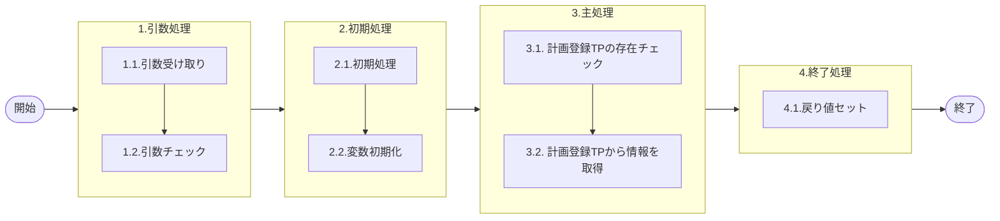

# 0. 表紙

| モジュール名 | プログラムID | プログラム名   |
| ------------ | ------------ | -------------- |
| IC           | LDAS0400     | 計画登録TP取得 |

| RFC | Version | 更新日     |     更新者     | 更新内容 | 確認日     | 確認者 | 承認日     | 承認者 |
| --- | :-----: | ---------- | :------------: | -------- | ---------- | :----: | ---------- | :----: |
| -   |  1.0.0  | 2025/10/01 | オヘダイチロー | 初版作成 | 2025/XX/XX |  XXX  | 2025/XX/XX |  XXX  |

## 1. 処理概要

### 1.1. 機能概要

本機能は、条件に該当するデータを存在チェックして、計画登録_トランザクションプールファイル (le_trn_planning_tp) テーブルから情報を取得する。

### 1.2. 処理概要フロー



### 1.3. プログラム入出力パラメータ

#### 1.3.1. 引数

| No. | パラメータ論理名 | パラメータ物理名 | 属性    | 備考 |
| --- | ---------------- | ---------------- | ------- | ---- |
| 1   | TP処理番号       | pn_operation_no  | INTEGER |      |
| 2   | 入力区分         | ps_input_class   | VARCHAR |      |
| 3   | IC工場処理日     | ps_ic_slip_date  | VARCHAR |      |

#### 1.3.2. 戻り値

| No. | パラメータ論理名           | パラメータ物理名        | 属性    | 備考                                                                                  |
| --- | -------------------------- | ----------------------- | ------- | ------------------------------------------------------------------------------------- |
| 1   | ステータス                 | rn_status               | INTEGER | 0:正常処理  100: Not found  -1:SQLエラー発生　-2:PRGエラー発生                        |
| 2   | SQLコード                  | rs_sql_code             | VARCHAR |                                                                                       |
| 3   | エラーコード               | rs_err_code             | VARCHAR |                                                                                       |
| 4   | エラーメッセージ           | rs_err_msg              | VARCHAR |                                                                                       |
| 5   | エラー位置                 | rs_err_focus            | VARCHAR |                                                                                       |
| 6   | TP処理番号                 | rn_operation_no         | INTEGER |                                                                                       |
| 7   | TP処理明細番号             | rn_operation_seq        | INTEGER |                                                                                       |
| 8   | 入力区分                   | rs_input_class          | VARCHAR | 1:画面入力 2:外部I/F 3:先行生産独立所要量削除データ　S:夜間処理(受発注報告系のみ存在) |
| 9   | 入力ユーザーID             | rs_input_user_id        | VARCHAR |                                                                                       |
| 10  | 処理識別                   | rs_operation_id         | VARCHAR |                                                                                       |
| 11  | 変更区分                   | rs_control_class        | VARCHAR |                                                                                       |
| 12  | 処理状況                   | rs_op_status            | VARCHAR | 0:未完了1:完了                                                                        |
| 13  | エラーレベルステータス     | rs_err_level_status     | VARCHAR | 0:通常1:警告9:エラー                                                                  |
| 14  | 内部トランザクションコード | rs_inter_txn            | VARCHAR |                                                                                       |
| 15  | 受信ID                     | rs_receive_id           | VARCHAR |                                                                                       |
| 16  | 相手先システム識別         | rs_request_system_code  | VARCHAR |                                                                                       |
| 17  | 先行所要量削除日付         | rs_ird_delete_ymd       | VARCHAR |                                                                                       |
| 18  | 品目番号                   | rs_itemno               | VARCHAR |                                                                                       |
| 19  | 供給者                     | rs_supplier             | VARCHAR |                                                                                       |
| 20  | 使用者                     | rs_usercd               | VARCHAR |                                                                                       |
| 21  | オーダー番号               | rs_order_no             | VARCHAR |                                                                                       |
| 22  | 通し番号                   | rs_through_no           | VARCHAR |                                                                                       |
| 23  | 照合番号                   | rs_slip_no              | VARCHAR |                                                                                       |
| 24  | 生試処理タイプ             | rs_pilot_condition_type | VARCHAR |                                                                                       |
| 25  | 数量                       | rn_qty                  | DECIMAL |                                                                                       |
| 26  | 着手日                     | rs_start_date           | VARCHAR |                                                                                       |
| 27  | 完了日                     | rs_due_date             | VARCHAR |                                                                                       |
| 28  | 払出日                     | rs_disburse_date        | VARCHAR |                                                                                       |
| 29  | 完了開始時間               | rs_due_begin_time       | VARCHAR |                                                                                       |
| 30  | 完了終了時間               | rs_due_end_time         | VARCHAR |                                                                                       |
| 31  | 理由コード                 | rs_reason_code          | VARCHAR |                                                                                       |
| 32  | 繰越数                     | rs_carry_over_qty       | DECIMAL |                                                                                       |
| 33  | 生試初品区分               | rs_pilot_class          | VARCHAR |                                                                                       |
| 34  | 所要量区分                 | rd_class                | VARCHAR |                                                                                       |
| 35  | 独立需要送り先区分         | rs_ind_user_class       | VARCHAR |                                                                                       |
| 36  | 独立需要送り先コード       | rs_ind_user_code        | VARCHAR |                                                                                       |
| 37  | 費用振替先区分             | rs_transfer_class       | VARCHAR |                                                                                       |
| 38  | 費用振替先コード           | rs_transfer_code        | VARCHAR |                                                                                       |
| 39  | 振替先理由コード           | rs_transfer_reason_code | VARCHAR |                                                                                       |
| 40  | 勘定科目コード             | rs_account_heading      | VARCHAR |                                                                                       |
| 41  | 目的No                     | rs_budget_no            | VARCHAR |                                                                                       |
| 42  | 受払種別コード             | rs_account_code_sales   | VARCHAR |                                                                                       |
| 43  | 削除日付                   | rs_delete_ymd           | VARCHAR |                                                                                       |
| 44  | フリーコメント             | rs_ic_slip_date         | VARCHAR |                                                                                       |
| 45  | サービスパーツ特別発注区分 | rs_sp_order_class       | VARCHAR |                                                                                       |
| 46  | サービスパーツ直納先コード | rs_sp_delivery_code     | VARCHAR |                                                                                       |
| 47  | サービスパーツディーラーNo | rs_sp_dealer_no         | VARCHAR |                                                                                       |
| 48  | サービスパーツ受注番号     | rs_sp_order_no          | VARCHAR |                                                                                       |
| 49  | IC工場処理日               | rs_remark               | VARCHAR |                                                                                       |
| 50  | グループ会社間受注フラグ   | rs_group_receive_flg    | VARCHAR |                                                                                       |
| 51  | G-SDMオーダー番号          | rs_gsdm_order_no        | VARCHAR |                                                                                       |

### 1.4. その他制御・要件

| 排他制御 |      |      |
| -------- | ---- | ---- |
| 楽観     | 悲観 | 無し |
| ●       | -    | -    |

| 項目               | 制約・制御・要件など | 記載内容説明                                                     |
| ------------------ | -------------------- | ---------------------------------------------------------------- |
| パフォーマンス要件 | 特になし。           | 特別なパフォーマンス要件がある場合に要件内容とその対処法を記述。 |

### 1.5. 入出力一覧

| No | 入出力対象 | 名称                                    | 物理名称           | C | R  | U | D | 備考 |
| -- | ---------- | --------------------------------------- | ------------------ | - | -- | - | - | ---- |
| 1  | テーブル   | 計画登録_トランザクションプールファイル | le_trn_planning_tp |   | ○ |   |   |      |

## 2. 詳細処理

### 2.1. 引数の取得とチェック

特記なし

### 2.2. 初期処理

- システム日時セット

```sql
　変数.システム日時 := システム日時
```

### 2.3. 主処理

### 2.3.1. 計画登録_トランザクションプールファイルに該当するデータの存在チェック

1. SQLクエリを作成する

   計画登録_トランザクションプールファイル (le_trn_planning_tp) テーブルに対して、条件にに応じた     WHERE 条件を動的に構築します。
   初めに、処理状況とエラーレベルステータスを条件として追加する。

<条件>

- 入力区分が "1" (画面入力) もしくは、"2" (外部I/F) の場合、TP処理番号と入力区分を条件として追加する。
- 入力区分が "3" (先行生産独立所要量削除データ) の場合、入力区分と先行所要量削除日付を条件として追加する
- 入力区分が "S" (夜間処理) の場合、入力区分と登録日時を条件として追加する
- その他の場合は、入力区分と登録日時を条件として追加する

```sql
　    変数.条件クエリ := '  FROM 計画登録_トランザクションプールファイル '
              ||  '  WHERE 処理状況 = ''0'' ' 
              ||   '   AND エラーレベルステータス = ''0'' ';

IF 引数.入力区分 = '1' OR 引数.入力区分 = '2' THEN
        変数.条件クエリ := 変数.条件クエリ
                 ||  ' AND TP処理番号 = ' || 引数.TP処理番号
                 ||  ' AND 入力区分 = ''' || 引数.入力区分  || ''' ';

    ELSIF 引数.入力区分 = '3' THEN
        変数.条件クエリ := 変数.条件クエリ
                 ||  ' AND 入力区分 = ''' || 引数.入力区分  || ''' '
                 ||  ' AND 先行所要量削除日付 <= ''' || 引数.IC工場処理日 || ''' ';

    ELSIF 引数.入力区分 = 'S' THEN
        変数.条件クエリ := 変数.条件クエリ
                 ||  ' AND 入力区分 = ''' || 引数.入力区分  || ''' '
                 ||  ' AND 登録日時 < ''' || 変数.システム日時  || ''' ';　　--初期処理　参照

    ELSE
        変数.条件クエリ := 変数.条件クエリ
                 ||  ' AND 入力区分  IN (''1'',''2'',''S'') '
                 ||  ' AND 登録日時 < ''' || 変数.システム日時  || ''' ';     --初期処理　参照
    END IF;
```

2. COUNT句を設定

   対象となるレコードが存在するかどうかを SELECT COUNT(1) を変数.クエリに代入して、該当するレコードが存在するかどうかを判定するようにする。

```sql
    変数.クエリ := 'SELECT COUNT(1) ' || 変数.条件クエリ ;
```

3. 返却値を受け取る

   変数.カウント に初期値として 0 を代入した後、動的に組み立てたSQLクエリ（変数.クエリ）を EXECUTE 文で実行し、その実行結果を 変数.カウント に格納します。

```sql
    変数.カウント := 0;
    EXECUTE 変数.クエリ INTO 変数.カウント;   
```

### 2.3.1. 計画登録_トランザクションプールファイルから情報を取得する

1. 対象データが存在する場合の検索SQL文の構築

   変数.カウンタが "0" 以上の場合は、
   対象データを取得するための SELECT 文を 変数.クエリ に動的に構築します。

```sql
IF 変数.カウント > 0 THEN

     変数.クエリ := 'SELECT TP処理番号, TP処理明細番号, 入力区分, '
                 ||       ' 入力ユーザーID, 処理識別, 変更区分, '
                 ||       ' 処理状況, エラーレベルステータス, 内部トランザクションコード, '
                 ||       ' 受信ID, 相手先システム識別, 入力元トランザクション, 先行所要量削除日付, '
                 ||       ' 品目番号, 供給者, 使用者, オーダー番号 '  
                 ||       ' 通し番号, 照合番号, 生試処理タイプ'            
                 ||       ' 数量, 着手日, 完了日, 払出日, '  
                 ||       ' 完了開始時間, 完了終了時間, 理由コード, 繰越数, '
                 ||       ' 生試初品区分, 所要量区分, '  
                 ||       ' 独立需要送り先区分, 独立需要送り先コード, '  
                 ||       ' 費用振替先区分, 費用振替先コード, '   
                 ||       ' 振替理由コード, 勘定科目コード, '   
                 ||       ' 目的No, 受払種別コード, '        
                 ||       ' 削除日, フリーコメント, '
                 ||       ' サービスパーツ特別発注区分, サービスパーツ直納先コード,'
                 ||       ' サービスパーツディーラーNo, サービスパーツ受注番号, '
                 ||       ' IC工場処理日, グループ会社間受注フラグ,'
                 ||       ' G-SDMオーダー番号'   
                 || 変数.条件クエリ
                 || ' ORDER BY TP処理番号, TP処理明細番号 ';
```

2. 取得データのループ処理および出力

   - 動的に構築された検索SQL（変数.クエリ）を EXECUTE により実行する。
   - 取得された各レコードを FOR レコード IN ... LOOP で1件ずつ処理します。
   - ループ内では、レコードから取得した各項目を対応する変数に代入し、RETURN NEXT により 結果セットの1行として出力します。

   この処理を繰り返すことで、該当するすべてのレコードを呼び出し元に返します。

```sql
 FOR レコード IN EXECUTE 変数.クエリ LOOP

            TP処理番号 := レコード.TP処理番号;
            TP処理明細番号 := レコード.TP処理明細番号;
            入力区分 := レコード.入力区分 ;
            入力ユーザーID := レコード.入力ユーザーID;
            処理識別 := レコード.処理識別;
            変更区分 := レコード.変更区分;
            処理状況 := レコード.処理状況;
            エラーレベルステータス := レコード.エラーレベルステータス;
            内部トランザクションコード := レコード.内部トランザクションコード;
            受信ID := レコード.受信ID;
            相手先システム識別 := レコード.相手先システム識別;
            入力元トランザクション := レコード.入力元トランザクション;
            先行所要量削除日付 := レコード.先行所要量削除日付;
            品目番号 := レコード.品目番号;
            供給者 := レコード.供給者;
            使用者 := レコード.使用者;  
            オーダー番号 := レコード.オーダー番号;
            通し番号 := レコード.通し番号;
            照合番号 := レコード.照合番号;
            生試処理タイプ := レコード.生試処理タイプ;
            数量 := レコード.数量;
            着手日 := レコード.着手日;
            完了日 := レコード.完了日;   
            払出日 := レコード.払出日;  
            完了開始時間 := レコード.完了開始時間;  
            完了終了時間 := レコード.完了終了時間;  
            理由コード := レコード.理由コード;   
            繰越数 := レコード.繰越数;  
            生試初品区分 := レコード.生試初品区分;  
            所要量区分 := レコード.所要量区分;
            独立需要送り先区分 := レコード.独立需要送り先区分;
            独立需要送り先コード := レコード.独立需要送り先コード;
            費用振替先区分 := レコード.費用振替先区分 ;
            費用振替先コード :=　レコード.費用振替先コード;
            振替理由コード := レコード.振替理由コード;
            勘定科目コード := レコード.勘定科目コード;
            目的No := レコード.目的No;
            受払種別コード := レコード.受払種別コード;
            削除日 := レコード.削除日;
            フリーコメント := レコード.フリーコメント;
            サービスパーツ特別発注区分 := レコード.サービスパーツ特別発注区分;
            サービスパーツ直納先コード := レコード.サービスパーツ直納先コード;
            サービスパーツディーラーNo := レコード.サービスパーツディーラーNo ;
            サービスパーツ受注番号 := レコード.サービスパーツ受注番号;
            IC工場処理日 := レコード.IC工場処理日;
            グループ会社間受注フラグ := レコード.グループ会社間受注フラグ;
            G-SDMオーダー番号 := レコード.G-SDMオーダー番号;

            RETURN NEXT;

 END LOOP;
```

3. 対象データ未存在時の処理中断
   変数.カウントが "0" 以下の場合は、処理ステータスとエラー位置に値を代入し、例外を発生させて処理を中断しています。

```sql
    ELSE
        処理ステータス := 100;
        エラー位置 := 変数.プログラムID;　--初期処理　参照
        RAISE EXCEPTION '';
    END IF;
```

### 2.4. 終了処理

- 正常終了処理を行う

| No. | 戻り値           | 属性    | 設定値   |
| --- | ---------------- | ------- | -------- |
| 1   | 処理ステータス   | INTEGER | 0        |
| 2   | SQL コード       | VARCHAR | スペース |
| 3   | エラーコード     | VARCHAR | スペース |
| 4   | エラーメッセージ | VARCHAR | スペース |
| 5   | エラー位置       | VARCHAR | スペース |

## 3. 補足説明

### 3.1. 戻り値について

- ステータスについて
  - 0 : Normal End
  - -1 : Abnormal End
  - -2 : PGM エラー

### 3.2. エラー発生時の対応について

- RAISE EXCEPTIONのエラーが発生した場合、プログラム処理終了
- SQL エラーが発生した場合、エラーログを出力して処理終了
  | No. | 戻り値           | 属性    | 設定値     |
  | --- | ---------------- | ------- | ---------- |
  | 1   | 処理ステータス   | INTEGER | -1         |
  | 2   | SQL コード       | VARCHAR | SQLSTATE   |
  | 3   | エラーコード     | VARCHAR | スペース   |
  | 4   | エラーメッセージ | VARCHAR | SQLERRM    |
  | 5   | エラー位置       | VARCHAR | 'LDAS0400' |
