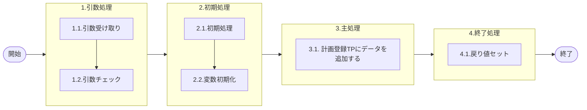

# 0. 表紙

| モジュール名 | プログラムID | プログラム名   |
| ------------ | ------------ | -------------- |
| IC           | LDAS0401     | 計画登録TP登録 |

| RFC | Version | 更新日     |     更新者     | 更新内容 | 確認日     | 確認者 | 承認日     | 承認者 |
| --- | :-----: | ---------- | :------------: | -------- | ---------- | :----: | ---------- | :----: |
| -   |  1.0.0  | 2025/10/02 | オヘダイチロー | 初版作成 | 2025/XX/XX |  XXX  | 2025/XX/XX |  XXX  |

## 1. 処理概要

### 1.1. 機能概要

本機能は、計画登録_トランザクションプールファイル (le_trn_planning_tp) テーブルにデータを追加する。

### 1.2. 処理概要フロー



### 1.3. プログラム入出力パラメータ

#### 1.3.1. 引数

| No. | パラメータ論理名           | パラメータ物理名        | 属性    | 備考                                  |
| --- | -------------------------- | ----------------------- | ------- | ------------------------------------- |
| 1   | ＴＰ処理番号               | pn_operation_no         | INTEGER |                                       |
| 2   | ＴＰ処理明細番号           | pn_operation_seq        | INTEGER |                                       |
| 3   | 入力区分                   | ps_input_class          | VARCHAR |                                       |
| 4   | 入力ユーザーＩＤ           | ps_input_user_id        | VARCHAR |                                       |
| 5   | 処理識別                   | ps_operation_id         | VARCHAR |                                       |
| 6   | 変更区分                   | ps_control_class        | VARCHAR |                                       |
| 7   | 処理状況                   | ps_op_status            | VARCHAR |                                       |
| 8   | 内部トランザクションコード | ps_inter_txn            | VARCHAR |                                       |
| 9   | 受信ＩＤ                   | ps_receive_id           | VARCHAR |                                       |
| 10  | 相手先システム識別         | ps_request_system_code  | VARCHAR |                                       |
| 11  | 入力元トランザクション     | ps_input_txn            | VARCHAR |                                       |
| 12  | 先行所要量削除日付         | ps_ird_delete_ymd       | VARCHAR |                                       |
| 13  | 品目番号                   | ps_itemno               | VARCHAR |                                       |
| 14  | 供給者                     | ps_supplier             | VARCHAR |                                       |
| 15  | 使用者                     | ps_usercd               | VARCHAR |                                       |
| 16  | オーダー番号               | ps_order_no             | VARCHAR |                                       |
| 17  | オーダー通し番号           | ps_order_through_no     | VARCHAR |                                       |
| 18  | 照合番号                   | ps_slip_no              | VARCHAR |                                       |
| 19  | 生試処理タイプ             | ps_pilot_condition_type | VARCHAR |                                       |
| 20  | 数量                       | pn_qty                  | DECIMAL |                                       |
| 21  | 着手日                     | ps_start_date           | VARCHAR |                                       |
| 22  | 完了日                     | ps_due_date             | VARCHAR |                                       |
| 23  | 払出日                     | ps_disburse_date        | VARCHAR |                                       |
| 24  | 完了日開始時間             | ps_due_begin_time       | VARCHAR |                                       |
| 25  | 完了日終了時間             | ps_due_end_time         | VARCHAR |                                       |
| 26  | 理由コード                 | ps_reason_code          | VARCHAR |                                       |
| 27  | 繰越数                     | pn_carry_over_qty       | DECIMAL |                                       |
| 28  | 生試初品区分               | ps_pilot_class          | VARCHAR |                                       |
| 29  | 所要量区分                 | ps_rd_class             | VARCHAR |                                       |
| 30  | 独立需要送り先区分         | ps_ind_user_class       | VARCHAR |                                       |
| 31  | 独立需要送り先コード       | ps_ind_user_code        | VARCHAR |                                       |
| 32  | 費用振替先区分             | ps_transfer_class       | VARCHAR | 1：SUコード2：原価センター3：受払種別 |
| 33  | 費用振替先コード           | ps_transfer_code        | VARCHAR | 2：原価センターのとき10桁             |
| 34  | 振替理由コード             | ps_transfer_reason_code | VARCHAR |                                       |
| 35  | 勘定科目コード             | ps_account_heading      | VARCHAR |                                       |
| 36  | 目的No                     | ps_budget_no            | VARCHAR |                                       |
| 37  | 受払種別コード             | ps_account_code_sales   | VARCHAR |                                       |
| 38  | 削除日付                   | ps_delete_ymd           | VARCHAR |                                       |
| 39  | フリーコメント             | ps_remark               | VARCHAR |                                       |
| 40  | サービスパーツ特別発注区分 | ps_sp_order_class       | VARCHAR |                                       |
| 41  | サービスパーツ直納先コード | ps_sp_delivery_code     | VARCHAR |                                       |
| 42  | サービスパーツディーラーNo | ps_sp_dealer_no         | VARCHAR |                                       |
| 43  | サービスパーツ受注番号     | ps_sp_order_no          | VARCHAR |                                       |
| 44  | IC工場処理日               | ps_ic_slip_date         | VARCHAR |                                       |
| 45  | グループ会社間受注フラグ   | ps_group_receive_flg    | VARCHAR |                                       |
| 46  | G-SDMオーダー番号          | ps_gsdm_order_no        | VARCHAR |                                       |

#### 1.3.2. 戻り値

| No. | パラメータ論理名 | パラメータ物理名 | 属性    | 備考 |
| --- | ---------------- | ---------------- | ------- | ---- |
| 1   | 処理ステータス   | rn_status        | INTEGER |      |
| 2   | SQLコード        | rs_sql_code      | VARCHAR |      |
| 3   | エラーコード     | rs_err_code      | VARCHAR |      |
| 4   | エラーメッセージ | rs_err_msg       | VARCHAR |      |
| 5   | エラー位置       | rs_err_focus     | VARCHAR |      |

### 1.4. その他制御・要件

| 排他制御 |      |      |
| -------- | ---- | ---- |
| 楽観     | 悲観 | 無し |
| ●       | -    | -    |

| 項目               | 制約・制御・要件など | 記載内容説明                                                     |
| ------------------ | -------------------- | ---------------------------------------------------------------- |
| パフォーマンス要件 | 特になし。           | 特別なパフォーマンス要件がある場合に要件内容とその対処法を記述。 |

### 1.5. 入出力一覧

| No | 入出力対象 | 名称                               | 物理名称           | C  | R | U | D | 備考 |
| -- | ---------- | ---------------------------------- | ------------------ | -- | - | - | - | ---- |
| 1  | テーブル   | 計画登録ﾄﾗﾝｻﾞｸｼｮﾝﾌﾟｰﾙ | le_trn_planning_tp | ○ | - |   |   |      |

## 2. 詳細処理

### 2.1. 引数の取得とチェック

特記無し

### 2.2. 初期処理

- システム日時セット

```sql
　変数.システム日時 := システム日時
```

### 2.3. 主処理

### 2.3.1. 計画登録_トランザクションプールファイルテーブルにデータを追加する。

```sql
    insert into 計画登録_トランザクションプールファイル
   	       (TP処理番号, TP処理明細番号, 
            入力区分, 入力ユーザーID, 
            処理識別, 変更区分, 
            処理状況, エラーレベルステータス, 
            内部トランザクションコード, 
            受信ID, 相手先システム識別, 
            入力元トランザクション, 先行所要量削除日付, 
            品目番号, 供給者, 
            使用者, オーダー番号 ,  
            通し番号, 照合番号, 
            生試処理タイプ, 数量, 
            着手日, 完了日, 
            払出日, 完了開始時間, 
            完了終了時間, 理由コード,
            繰越数, 生試初品区分,
            所要量区分, 独立需要送り先区分, 
            独立需要送り先コード, 費用振替先区分, 
            費用振替先コード, 振替理由コード, 
            勘定科目コード, 目的No, 
            受払種別コード, 削除日, 
            フリーコメント, サービスパーツ特別発注区分, 
            サービスパーツ直納先コード,  サービスパーツディーラーNo, 
            サービスパーツ受注番号, IC工場処理日, 
            グループ会社間受注フラグ, G-SDMオーダー番号,
            更新カウンタ, 登録日時,
            登録者, 登録PGID,
            更新日時, 更新者,
            更新PGID)
   	values( 引数.TP処理番号, 引数.TP処理明細番号, 
            引数.入力区分, 引数.入力ユーザーID, 
            引数.処理識別, 引数.変更区分, 
            引数.処理状況, 0, 
            引数.内部トランザクションコード, 
            引数.受信ID, 引数.相手先システム識別, 
            引数.入力元トランザクション, 引数.先行所要量削除日付, 
            引数.品目番号, 引数.供給者, 
            引数.使用者, 引数.オーダー番号 ,  
            引数.オーダー通し番号, 引数.照合番号, 
            引数.生試処理タイプ, 引数.数量, 
            引数.着手日, 引数.完了日, 
            引数.払出日, 引数.完了開始時間, 
            引数.完了終了時間, 引数.理由コード,
            引数.繰越数, 引数.生試初品区分,
            引数.所要量区分, 引数.独立需要送り先区分, 
            引数.独立需要送り先コード, 引数.費用振替先区分, 
            引数.費用振替先コード, 引数.振替理由コード, 
            引数.勘定科目コード, 引数.目的No, 
            引数.受払種別コード, 引数.削除日, 
            引数.フリーコメント, 引数.サービスパーツ特別発注区分, 
            引数.サービスパーツ直納先コード,  引数.サービスパーツディーラーNo, 
            引数.サービスパーツ受注番号, 引数.IC工場処理日, 
            引数.グループ会社間受注フラグ, 引数.G-SDMオーダー番号,
            0, 変数.システム日時,
            引数.入力ユーザーID, 'LDAS0401',
            変数.システム日時, 引数.入力ユーザーID, 
            'LDAS0401');
```

### 2.4. 終了処理

- 正常終了処理を行う

| No. | 戻り値           | 属性    | 設定値   |
| --- | ---------------- | ------- | -------- |
| 1   | 処理ステータス   | INTEGER | 0        |
| 2   | SQL コード       | VARCHAR | スペース |
| 3   | エラーコード     | VARCHAR | スペース |
| 4   | エラーメッセージ | VARCHAR | スペース |
| 5   | エラー位置       | VARCHAR | スペース |

## 3. 補足説明

### 3.1. 戻り値について

- ステータスについて
  - 0 : Normal End
  - -1 : Abnormal End
  - -2 : PGM エラー

### 3.2. エラー発生時の対応について

- SQL エラーが発生した場合、エラーログを出力して処理終了
- | No. | 戻り値           | 属性    | 設定値     |
  | --- | ---------------- | ------- | ---------- |
  | 1   | 処理ステータス   | INTEGER | -1         |
  | 2   | SQL コード       | VARCHAR | SQLSTATE   |
  | 3   | エラーコード     | VARCHAR | スペース   |
  | 4   | エラーメッセージ | VARCHAR | SQLERRM    |
  | 5   | エラー位置       | VARCHAR | 'LDAS0401' |
