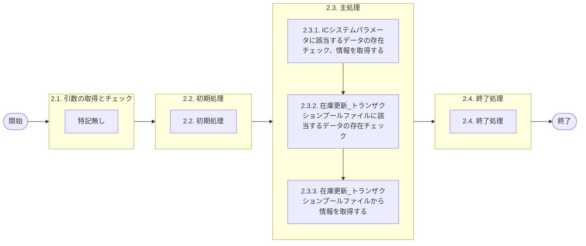

# 0. 表紙

| モジュール名 | プログラムID | プログラム名   |
| ------------ | ------------ | -------------- |
| IC           | LDAS0404     | 在庫更新TP取得 |

| RFC | Version | 更新日     |     更新者     | 更新内容 | 確認日     | 確認者 | 承認日     | 承認者 |
| --- | :-----: | ---------- | :------------: | -------- | ---------- | :----: | ---------- | :----: |
| -   |  1.0.0  | 2025/10/03 | オヘダイチロー | 初版作成 | 2025/XX/XX |  XXX  | 2025/XX/XX |  XXX  |

## 1. 処理概要

### 1.1. 機能概要

本機能は、条件に該当するデータを存在チェックして、ICシステムパラメータ (ld_mst_system_parameter) テーブルと在庫更新_トランザクションプールファイル (ld_trn_update_tp) テーブルから情報を取得する。

### 1.2. 処理概要フロー



### 1.3. プログラム入出力パラメータ

#### 1.3.1. 引数

| No. | パラメータ論理名 | パラメータ物理名 | 属性    | 備考 |
| --- | ---------------- | ---------------- | ------- | ---- |
| 1   | TP処理番号       | pn_operation_no  | INTEGER |      |
| 2   | 入力区分         | ps_input_class   | VARCHAR |      |

#### 1.3.2. 戻り値

| No. | パラメータ論理名           | パラメータ物理名         | 属性    | 備考                                                           |
| --- | -------------------------- | ------------------------ | ------- | -------------------------------------------------------------- |
| 1   | 処理ステータス             | rn_status                | INTEGER | 0:正常処理  100: Not found  -1:SQLエラー発生　-2:PRGエラー発生 |
| 2   | SQLコード                  | rs_sql_code              | VARCHAR |                                                                |
| 3   | エラーコード               | rs_err_code              | VARCHAR |                                                                |
| 4   | エラーメッセージ           | rs_err_msg               | VARCHAR |                                                                |
| 5   | エラー位置                 | rs_err_focus             | VARCHAR |                                                                |
| 6   | TP処理番号                 | rn_operation_no          | INTEGER |                                                                |
| 7   | TP処理明細番号             | rn_operation_seq         | INTEGER |                                                                |
| 8   | 入力区分                   | rs_input_class           | VARCHAR |                                                                |
| 9   | 入力ユーザーID             | rs_input_user_id         | VARCHAR |                                                                |
| 10  | 処理識別                   | rs_operation_id          | VARCHAR |                                                                |
| 11  | 変更区分                   | rs_control_class         | VARCHAR |                                                                |
| 12  | 処理状況                   | rs_op_status             | VARCHAR |                                                                |
| 13  | エラーレベルステータス     | rs_err_level_status      | VARCHAR |                                                                |
| 14  | 内部トランザクションコード | rs_inter_txn             | VARCHAR |                                                                |
| 15  | 受信ID                     | rs_receive_id            | VARCHAR |                                                                |
| 16  | 相手先システム識別         | rs_request_system_code   | VARCHAR |                                                                |
| 17  | 品目番号                   | rs_itemno                | VARCHAR |                                                                |
| 18  | 供給者                     | rs_supplier              | VARCHAR |                                                                |
| 19  | 使用者                     | rs_usercd                | VARCHAR |                                                                |
| 20  | 着手/払出日                | rs_st_db_date            | VARCHAR |                                                                |
| 21  | オーダー番号               | rs_order_no              | VARCHAR |                                                                |
| 22  | 引落区分                   | rs_hold_on_hand_flag     | VARCHAR |                                                                |
| 23  | カード識別                 | rs_card_id               | VARCHAR |                                                                |
| 24  | ベンダーコード             | rs_vendor_code           | VARCHAR |                                                                |
| 25  | ワークフロー番号           | rs_wf_no                 | VARCHAR |                                                                |
| 26  | 照合番号                   | rs_slip_no               | VARCHAR |                                                                |
| 27  | 数量                       | rn_qty                   | DECIMAL |                                                                |
| 28  | 起票日                     | rs_input_date            | VARCHAR |                                                                |
| 29  | 理由コード                 | rs_reason_code           | VARCHAR |                                                                |
| 30  | 責任工程                   | rs_rp_process            | VARCHAR |                                                                |
| 31  | 責任職場/メーカー区分      | rs_rp_shop_class         | VARCHAR |                                                                |
| 32  | 責任職場/メーカー          | rs_rp_shop_code          | VARCHAR |                                                                |
| 33  | 組立ライン                 | rs_assy_line             | VARCHAR |                                                                |
| 34  | 組立順序番号               | rs_assy_seq              | VARCHAR |                                                                |
| 35  | 金額                       | rn_amount                | DECIMAL |                                                                |
| 36  | 移動先使用者               | rs_mv_usercd             | VARCHAR |                                                                |
| 37  | 費用振替先区分             | rs_transfer_class        | VARCHAR |                                                                |
| 38  | 費用振替先コード           | rs_transfer_code         | VARCHAR |                                                                |
| 39  | 勘定科目コード             | rs_account_heading       | VARCHAR |                                                                |
| 40  | 目的No                     | rs_budget_no             | VARCHAR |                                                                |
| 41  | 受払種別コード             | rs_account_code_sales    | VARCHAR |                                                                |
| 42  | 仕掛サイン                 | rs_in_process_sign       | VARCHAR |                                                                |
| 43  | インボイスNo               | rs_invoice_no            | VARCHAR |                                                                |
| 44  | B/LNo                      | rs_bl_no                 | VARCHAR |                                                                |
| 45  | ケースNo                   | rs_case_no               | VARCHAR |                                                                |
| 46  | ケースマークオーダー番号   | rs_case_mark_order_no    | VARCHAR |                                                                |
| 47  | フリーコメント             | rs_ic_slip_date          | VARCHAR |                                                                |
| 48  | IC工場処理日               | rs_remark                | VARCHAR |                                                                |
| 49  | 申請日                     | rs_request_date          | VARCHAR |                                                                |
| 50  | G-SDMオーダー番号          | rs_gsdm_order_no         | VARCHAR |                                                                |
| 51  | 外売品フラグ               | rs_external_sales_flg    | VARCHAR |                                                                |
| 52  | HU-ID                      | rs_handling_unit_id      | VARCHAR |                                                                |
| 53  | 構成LT用工程番号           | rs_strc_lt_proc_no       | VARCHAR |                                                                |
| 54  | 原価用品目番号             | rs_cc_itemno             | VARCHAR |                                                                |
| 55  | 原価用供給者               | rs_cc_supplier           | VARCHAR |                                                                |
| 56  | 原価用使用者               | rs_cc_usercd             | VARCHAR |                                                                |
| 57  | 原価用オーダー番号         | rs_cc_order_no           | VARCHAR |                                                                |
| 58  | 入庫不足許容率             | rn_in_sh_accept_percent  | DECIMAL |                                                                |
| 59  | 入庫過剰許容率             | rn_in_ov_accept_percent  | DECIMAL |                                                                |
| 60  | 出庫不足許容率             | rn_out_sh_accept_percent | DECIMAL |                                                                |
| 61  | 出庫過剰許容率             | rn_out_ov_accept_percent | DECIMAL |                                                                |

### 1.4. その他制御・要件

| 排他制御 |      |      |
| -------- | ---- | ---- |
| 楽観     | 悲観 | 無し |
| ●       | -    | -    |

| 項目               | 制約・制御・要件など | 記載内容説明                                                     |
| ------------------ | -------------------- | ---------------------------------------------------------------- |
| パフォーマンス要件 | 特になし。           | 特別なパフォーマンス要件がある場合に要件内容とその対処法を記述。 |

### 1.5. 入出力一覧

| No | 入出力対象 | 名称                                    | 物理名称                | C | R  | U | D | 備考 |
| -- | ---------- | --------------------------------------- | ----------------------- | - | -- | - | - | ---- |
| 1  | テーブル   | ICシステムパラメータ                    | ld_mst_system_parameter |   | ○ |   |   |      |
| 2  | テーブル   | 在庫更新_トランザクションプールファイル | ld_trn_update_tp        |   | ○ |   |   |      |

## 2. 詳細処理

### 2.1. 引数の取得とチェック

特記なし

### 2.2. 初期処理

- システム日時セット

```sql
　 ld_sysdatetime  := statement_timestamp();
```

### 2.3. 主処理

### 2.3.1. ICシステムパラメータに該当するデータの存在チェック、情報を取得する

ICシステムパラメータ (ld_mst_system_parameter) テーブルに処理タイプが 'STD' (標準パラメータ) であるデータが存在するかを確認し、存在する場合は当該データから必要な値を検索し、戻り値として設定する。存在しない場合は、次の処理に進む。

```sql
    IF EXISTS(SELECT 1
               FROM ld_mst_system_parameter
               WHERE operation_type = 'STD';)THEN --処理タイプ

      FOR rn_in_sh_accept_percent, 
          rn_in_ov_accept_percent,  
          rn_out_sh_accept_percent,  
          rn_out_ov_accept_percent IN 

            SELECT in_sh_accept_percent,  --入庫不足許容率
                   in_ov_accept_percent,  --入庫過剰許容率
                   out_sh_accept_percent, --出庫不足許容率
                   out_ov_accept_percent  --出庫過剰許容率
              FROM ld_mst_system_parameter 
              WHERE operation_type = 'STD'  LOOP --処理タイプ

            EXIT;
        END LOOP;
    END IF;
```

### 2.3.2. 在庫更新_トランザクションプールファイルに該当するデータの存在チェック

1. SQLクエリを作成する

   在庫更新_トランザクションプールファイル (ld_trn_update_tp) テーブルに対して、条件にに応じた     WHERE 条件を動的に構築します。
   初めに、処理状況とエラーレベルステータスを条件として追加する。

<条件>

- 入力区分が "1" (画面入力) もしくは、"2" (外部I/F) の場合、TP処理番号と入力区分を条件として追加する。
- 入力区分が "S" (夜間処理) の場合、入力区分と登録日時を条件として追加する
- その他の場合は、入力区分と登録日時を条件として追加する

```sql
 ls_where := '  FROM ld_trn_update_tp '
              ||  '  WHERE operation_id = ''0'' '   --処理識別
              ||   ' AND err_level_status = ''0'' ';  --エラーレベルステータス

IF rs_input_class = '1' OR rs_input_class = '2' THEN　--入力区分
        ls_where := ls_where
                 ||  ' AND operation_no = ' || rn_operation_no  --TP処理番号
                 ||  ' AND input_class = ''' || rs_input_class  || ''' ';  --入力区分

    ELSIF rs_input_class = 'S' THEN  --入力区分
        ls_where := ls_where
                 ||  ' AND input_class = ''' || rs_input_class  || ''' '  --入力区分
                 ||  ' AND create_datetime < ''' || ld_sysdatetime  || ''' ';　--登録日時 < システム日時
    ELSE
        ls_where := ls_where
                 ||  ' AND input_class  IN (''1'',''2'',''S'') '   --入力区分
                 ||  ' AND create_datetime < ''' || ld_sysdatetime  || ''' ';  --登録日時 < システム日時
    END IF;
```

2. COUNT句を設定

   対象となるレコードが存在するかどうかを SELECT COUNT(1) を変数.クエリに代入して、該当するレコードが存在するかどうかを判定するようにする。

```sql
    ls_query := 'SELECT COUNT(1) ' || ls_where ;
```

3. 返却値を受け取る

   変数.カウント に初期値として 0 を代入した後、動的に組み立てたSQLクエリ（変数.クエリ）を EXECUTE 文で実行し、その実行結果を 変数.カウント に格納します。

```sql
    ln_counter := 0;
    EXECUTE ls_query INTO ln_counter;   
```

### 2.3.3. 在庫更新_トランザクションプールファイルから情報を取得する

1. 対象データが存在する場合の検索SQL文の構築

   変数.カウンタが "0" 以上の場合は、
   対象データを取得するための SELECT 文を 変数.クエリ に動的に構築します。

```sql
IF ln_counter > 0 THEN

    ls_query := 'SELECT operation_no, ' ||  　--TP処理番号
               '        operation_seq, ' ||　　--TP処理明細番号
               '        input_class, ' ||　　--入力区分
               '        input_user_id, ' ||　　--入力ユーザーID
               '        operation_id, ' ||　　--処理識別
               '        control_class, ' ||　　--変更区分
               '        op_status, ' ||　　--処理状況
               '        err_level_status, ' ||　　--エラーレベルステータス
               '        inter_txn, ' ||　　--内部トランザクションコード
               '        receive_id, ' ||　　--受信ID
               '        request_system_code, ' ||　　--相手先システム識別
               '        itemno, ' ||　　--品目番号
               '        supplier, ' ||　　--供給者
               '        usercd, ' ||　　--使用者
               '        st_db_date, ' ||　　--着手/払出日
               '        order_no, ' ||　　--オーダー番号
               '        hold_on_hand_flag, ' ||　　--引落区分
               '        card_id, ' ||　　--カード識別
               '        vendor_code, ' ||　　--ベンダーコード
               '        wf_no, ' ||　　--ワークフロー番号
               '        slip_no, ' ||　　--照合番号
               '        qty, ' ||　　--数量
               '        input_date, ' ||　　--起票日
               '        reason_code, ' ||　　--理由コード
               '        rp_process, ' ||　　--責任工程
               '        rp_shop_class, ' ||　　--責任職場/メーカー区分
               '        rp_shop_code, ' ||　　--責任職場/メーカー
               '        assy_line, ' ||　　--組立ライン
               '        assy_seq, ' ||　　--組立順序番号
               '        amount, ' ||　　--金額
               '        mv_usercd, ' ||　　--移動先使用者
               '        transfer_class, ' ||　　--費用振替先区分
               '        transfer_code, ' ||　　--費用振替先コード
               '        account_heading, ' ||　　--勘定科目コード
               '        budget_no, ' ||　　--目的No
               '        account_code_sales, ' ||　　--受払種別コード
               '        in_process_sign, ' ||　　--仕掛サイン
               '        invoice_no, ' ||　　--インボイスNo
               '        bl_no, ' ||　　--B/L No
               '        case_no, ' ||　　--ケースNo
               '        case_mark_order_no, ' ||　　--ケースマークオーダ番号
               '        remark, ' ||　　--フリーコメント
               '        ic_slip_date, ' ||　　--IC工場処理日
               '        request_date, ' ||　　--申請日
               '        gsdm_order_no, ' ||　　--G-SDMオーダー番号
               '        external_sales_flg, ' ||　　--外売品フラグ
               '        handling_unit_id, ' ||　　--HU-ID
               '        strc_lt_proc_no, ' ||　　--構成LT用工程番号
               '        cc_itemno, ' ||　　--原価用品目番号
               '        cc_supplier, ' ||　　--原価用供給者
               '        cc_usercd, ' ||　　--原価用使用者
               '        cc_order_no ' || --原価用オーダー番号
                ls_where ||
               ' ORDER BY operation_no,'  --TP処理番号
               '          operation_seq ' ; --TP処理明細番号

```

2. 取得データのループ処理および出力

   - 動的に構築された検索SQL（変数.クエリ）を EXECUTE により実行する。
   - 取得された各レコードを FOR レコード IN ... LOOP で1件ずつ処理します。
   - ループ内では、レコードから取得した各項目を対応する変数に代入し、RETURN NEXT により 結果セットの1行として出力します。

   この処理を繰り返すことで、該当するすべてのレコードを呼び出し元に返します。

```sql
 FOR rec_sp IN EXECUTE ls_query LOOP

            rn_operation_no := rec_sp.operation_no;　--TP処理番号
            rn_operation_seq := rec_sp.operation_seq;　--TP処理明細番号
            rs_input_class := rec_sp.input_class ;　--入力区分
            rs_input_user_id := rec_sp.input_user_id;　--入力ユーザーID
            rs_operation_id := rec_sp.operation_id;　--処理識別
            rs_control_class := rec_sp.control_class;　--変更区分
            rs_op_status := rec_sp.op_status;　--処理状況
            rs_err_level_status := rec_sp.err_level_status;　--エラーレベルステータス
            rs_inter_txn := rec_sp.inter_txn;　--内部トランザクションコード
            rs_receive_id := rec_sp.receive_id;　--受信ID
            rs_request_system_code := rec_sp.request_system_code;　--相手先システム識別
            rs_itemno := rec_sp.itemno;　--品目番号
            rs_supplier := rec_sp.supplier;　--供給者
            rs_usercd := rec_sp.usercd; 　-- 使用者
            rs_st_db_date := rec_sp.st_db_date;　--着手/払出日
            rs_order_no := rec_sp.order_no;　--オーダー番号
            rs_hold_on_hand_flag := rec_sp.hold_on_hand_flag;　--引落区分
            rs_card_id := rec_sp.card_id;　--カード識別
            rs_vendor_code := rec_sp.vendor_code;　--ベンダーコード
            rs_wf_no := rec_sp.wf_no;　--ワークフロー番号
            rs_slip_no := rec_sp.slip_no;　--照合番号
            rn_qty := rec_sp.qty;　--数量
            rs_input_date := rec_sp.input_date; 　--起票日
            rs_reason_code := rec_sp.reason_code; 　--理由コード
            rs_rp_process := rec_sp.rp_process;  　--責任工程
            rs_rp_shop_class := rec_sp.rp_shop_class; 　--責任職場/メーカー区分
            rs_rp_shop_code := rec_sp.rp_shop_code;  --責任職場/メーカー
            rs_assy_line := rec_sp.assy_line; 　--  組立ライン
            rs_assy_seq := rec_sp.assy_seq;  --組立順序番号
            rn_amount:= rec_sp.amount;　--金額
            rs_mv_usercd := rec_sp.mv_usercd;　--移動先使用者
            rs_transfer_class := rec_sp.transfer_class;　--費用振替先区分
            rs_transfer_code := rec_sp.transfer_code;　--費用振替先コード
            rs_account_heading := rec_sp.account_heading;　--勘定科目コード
            rs_budget_no :=　rec_sp.budget_no;　--目的No
            rs_account_code_sales := rec_sp.account_code_sales;　--受払種別コード
            rs_in_process_sign := rec_sp.in_process_sign;　--仕掛サイン
            rs_invoice_no := rec_sp.invoice_no; --インボイスNo
            rs_bl_no := rec_sp.bl_no;　--B/L No
            rs_case_no := rec_sp.case_no;　--ケースNo
            rs_case_mark_order_no := rec_sp.case_mark_order_no;　--ケースマークオーダ番号
            rs_remark := rec_sp.remark;　--フリーコメント
            rs_ic_slip_date:= rec_sp.ic_slip_date;　--IC工場処理日
            rs_request_date := rec_sp.request_date;　--申請日
            rs_gsdm_order_no := rec_sp.gsdm_order_no;　--G-SDMオーダー番号
            rs_external_sales_flg := rec_sp.external_sales_flg;　--外売品フラグ
            rs_handling_unit_id := rec_sp.handling_unit_id;　--HU-ID
            rs_strc_lt_proc_no := rec_sp.strc_lt_proc_no;　--構成LT用工程番号
            rs_cc_itemno := rec_sp.cc_itemno;　--原価用品目番号
            rs_cc_supplier := rec_sp.cc_supplier;　--原価用供給者
            rs_cc_usercd := rec_sp.cc_usercd;　--原価用使用者
            rs_cc_order_no := rec_sp.cc_order_no;　--原価用オーダー番号
 
            RETURN NEXT;

 END LOOP;
```

3. 対象データ未存在時の処理中断
   変数.カウントが "0" 以下の場合は、処理ステータスとエラー位置に値を代入し、例外を発生させて処理を中断しています。

```sql
    ELSE
        rn_status := 100; --処理ステータス
        rs_err_focus := 'LDAS0404';  --エラー位置
        RAISE EXCEPTION '';
    END IF;
```

### 2.4. 終了処理

- 正常終了処理を行う

| No. | 戻り値           | 属性    | 設定値   |
| --- | ---------------- | ------- | -------- |
| 1   | 処理ステータス   | INTEGER | 0        |
| 2   | SQL コード       | VARCHAR | スペース |
| 3   | エラーコード     | VARCHAR | スペース |
| 4   | エラーメッセージ | VARCHAR | スペース |
| 5   | エラー位置       | VARCHAR | スペース |

## 3. 補足説明

### 3.1. 戻り値について

- ステータスについて
  - 0 : Normal End
  - -1 : Abnormal End
  - -2 : PGM エラー

### 3.2. エラー発生時の対応について

- RAISE EXCEPTIONのエラーが発生した場合、プログラム処理終了
- SQL エラーが発生した場合、エラーログを出力して処理終了| No. | 戻り値           | 属性    | 設定値     |
  | --- | ---------------- | ------- | ---------- |
  | 1   | 処理ステータス   | INTEGER | -1         |
  | 2   | SQL コード       | VARCHAR | SQLSTATE   |
  | 3   | エラーコード     | VARCHAR | スペース   |
  | 4   | エラーメッセージ | VARCHAR | SQLERRM    |
  | 5   | エラー位置       | VARCHAR | 'LDAS0404' |
