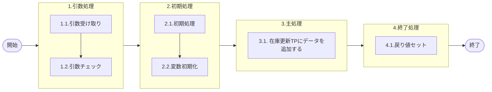

# 0. 表紙

| モジュール名 | プログラムID | プログラム名   |
| ------------ | ------------ | -------------- |
| IC           | LDAS0405     | 在庫更新TP登録 |

| RFC | Version | 更新日     |     更新者     | 更新内容 | 確認日     | 確認者 | 承認日     | 承認者 |
| --- | :-----: | ---------- | :------------: | -------- | ---------- | :----: | ---------- | :----: |
| -   |  1.0.0  | 2025/10/06 | オヘダイチロー | 初版作成 | 2025/XX/XX |  XXX  | 2025/XX/XX |  XXX  |

## 1. 処理概要

### 1.1. 機能概要

本機能は、在庫更新_トランザクションプールファイル (ld_trn_update_tp) テーブルにデータを追加する。

### 1.2. 処理概要フロー



### 1.3. プログラム入出力パラメータ

#### 1.3.1. 引数

| No. | パラメータ論理名         | パラメータ物理名       | 属性    | 備考                                     |
| --- | ------------------------ | ---------------------- | ------- | ---------------------------------------- |
| 1   | TP処理番号               | pn_operation_no        | INTEGER |                                          |
| 2   | TP処理明細番号           | pn_operation_seq       | INTEGER |                                          |
| 3   | 入力区分                 | ps_input_class         | VARCHAR |                                          |
| 4   | 入力ユーザーID           | ps_input_user_id       | VARCHAR |                                          |
| 5   | 処理識別                 | ps_operation_id        | VARCHAR |                                          |
| 6   | 変更区分                 | ps_control_class       | VARCHAR |                                          |
| 7   | 内部トランザクション     | ps_inter_txn           | VARCHAR |                                          |
| 8   | 受信ID                   | ps_receive_id          | VARCHAR |                                          |
| 9   | 相手先システム識別       | ps_request_system_code | VARCHAR |                                          |
| 10  | 品目番号                 | ps_itemno              | VARCHAR |                                          |
| 11  | 供給者                   | ps_supplier            | VARCHAR |                                          |
| 12  | 使用者                   | ps_usercd              | VARCHAR |                                          |
| 13  | 着手/払出日              | ps_st_db_date          | VARCHAR |                                          |
| 14  | オーダー番号             | ps_order_no            | VARCHAR |                                          |
| 15  | 引落区分                 | ps_hold_on_hand_flag   | VARCHAR |                                          |
| 16  | カード識別               | ps_card_id             | VARCHAR |                                          |
| 17  | ベンダーコード           | ps_vender_code         | VARCHAR |                                          |
| 18  | 照合番号                 | ps_slip_no             | VARCHAR |                                          |
| 19  | 数量                     | pn_qty                 | DECIMAL |                                          |
| 20  | 起票日                   | ps_input_date          | VARCHAR |                                          |
| 21  | 理由コード               | ps_reason_code         | VARCHAR |                                          |
| 22  | 責任工程                 | ps_rp_process          | VARCHAR |                                          |
| 23  | 責任職場/メーカ区分      | ps_rp_shop_class       | VARCHAR |                                          |
| 24  | 責任職場/メーカ          | ps_rp_shop_code        | VARCHAR |                                          |
| 25  | 組立ライン               | ps_assy_line_code      | VARCHAR |                                          |
| 26  | 組立順序番号             | ps_assy_seq            | VARCHAR |                                          |
| 27  | 金額                     | pn_amount              | DECIMAL | VARCHAR                                  |
| 28  | 移動先使用者             | ps_mv_usercd           | VARCHAR |                                          |
| 29  | 費用振替先区分           | ps_transfer_class      | VARCHAR | 1：SUコード、2:原価センター、3：受払種別 |
| 30  | 費用振替先コード         | ps_transfer_code       | VARCHAR | 2:原価センターの時１０桁                 |
| 31  | 勘定科目コード           | ps_account_heading     | VARCHAR |                                          |
| 32  | 目的No                   | ps_budget_no           | VARCHAR |                                          |
| 33  | 受払種別コード           | ps_account_code_sales  | VARCHAR |                                          |
| 34  | 仕掛サイン               | ps_in_process_sign     | VARCHAR |                                          |
| 35  | インボイスNo             | ps_invoice_no          | VARCHAR |                                          |
| 36  | B/LNo                    | ps_bl_no               | VARCHAR |                                          |
| 37  | ケースNo                 | ps_case_no             | VARCHAR |                                          |
| 38  | ケースマークオーダー番号 | ps_case_mark_order_no  | VARCHAR |                                          |
| 39  | フリーコメント           | ps_remark              | VARCHAR |                                          |
| 40  | IC工場処理日             | ps_ic_slip_date        | VARCHAR |                                          |
| 41  | 申請日                   | ps_request_date        | VARCHAR |                                          |
| 42  | G-SDMオーダー番号        | ps_gsdm_order_no       | VARCHAR |                                          |
| 43  | 外売品フラグ             | ps_external_sales_flg  | VARCHAR |                                          |
| 44  | HU-ID                    | ps_handling_unit_id    | VARCHAR |                                          |
| 45  | 構成LT用工程番号         | ps_strc_lt_proc_no     | VARCHAR |                                          |
| 46  | 原価用品目番号           | ps_cc_itemno           | VARCHAR |                                          |
| 47  | 原価用共有者             | ps_cc_supplier         | VARCHAR |                                          |
| 48  | 原価用使用者             | ps_cc_usercd           | VARCHAR |                                          |
| 49  | 原価用オーダー番号       | ps_cc_order_no         | VARCHAR |                                          |

#### 1.3.2. 戻り値

| No. | パラメータ論理名 | パラメータ物理名 | 属性    | 備考                   |
| --- | ---------------- | ---------------- | ------- | ---------------------- |
| 1   | 処理ステータス   | rn_status        | INTEGER | 0:NomalEnd/-1:SqlError |
| 2   | SQLコード        | rs_sql_code      | VARCAHR |                        |
| 3   | エラーコード     | rs_err_code      | VARCAHR |                        |
| 4   | エラーメッセージ | rs_err_msg       | VARCAHR |                        |
| 5   | エラー位置       | rs_err_focus     | VARCAHR |                        |

### 1.4. その他制御・要件

| 排他制御 |      |      |
| -------- | ---- | ---- |
| 楽観     | 悲観 | 無し |
| ●       | -    | -    |

| 項目               | 制約・制御・要件など | 記載内容説明                                                     |
| ------------------ | -------------------- | ---------------------------------------------------------------- |
| パフォーマンス要件 | 特になし。           | 特別なパフォーマンス要件がある場合に要件内容とその対処法を記述。 |

### 1.5. 入出力一覧

| No | 入出力対象 | 名称                                    | 物理名称         | C  | R | U | D | 備考 |
| -- | ---------- | --------------------------------------- | ---------------- | -- | - | - | - | ---- |
| 1  | テーブル   | 在庫更新_トランザクションプールファイル | ld_trn_update_tp | ○ |   |   |   |      |

## 2. 詳細処理

### 2.1. 引数の取得とチェック

特記なし

### 2.2. 初期処理

- システム日時セット

```sql
　変数.システム日時 := システム日時
```

### 2.3. 主処理

```sql
 INSERT INTO 在庫更新_トランザクションプールファイル
        (TP処理番号, TP処理明細番号,
         入力区分, 入力ユーザーID,
         処理識別, 変更区分,
         処理状況, エラーレベルステータス,
         内部トランザクションコード, 受信ID,
         相手先システム識別, 品目番号,
         供給者, 使用者,
         着手/払出日, オーダー番号,　引落区分,
         カード識別, ベンダーコード,
         照合番号, 数量,
         起票日, 理由コード,
         責任工程, 責任職場/メーカー区分,
         責任職場/メーカー, 組立順序番号,
         金額, 移動先使用者,
         費用振替先区分, 費用振替先コード,
         勘定科目コード, 目的No,
         受払種別コード, 仕掛サイン,
         インボイスNo, B/L No,
         ケースNo, ケースマークオーダ番号,
         フリーコメント, IC工場処理日,
         申請日, G-SDMオーダー番号,
         HU-ID, 構成LT用工程番号,
         原価用品目番号, 原価用供給者,
         原価用使用者, 原価用オーダー番号,
         更新カウンタ, 登録日時,
         登録者, 登録PGID,
         更新日時, 更新者,
         更新PGID)
        VALUES
        (引数.TP処理番号, 引数.TP処理明細番号,
         引数.入力区分, 引数.入力ユーザーID,
         引数.処理識別, 引数.変更区分,
         '0', '0',
         引数.内部トランザクションコード, 引数.受信ID,
         引数.相手先システム識別, 引数.品目番号,
         引数.供給者, 引数.使用者,
         引数.着手/払出日, 引数.オーダー番号, 引数.引落区分
         引数.カード識別, 引数.ベンダーコード,
         引数.照合番号, 引数.数量,
         引数.起票日, 引数.理由コード,
         引数.責任工程, 引数.責任職場/メーカー区分,
         引数.責任職場/メーカー, 引数.組立順序番号,
         引数.金額, 引数.移動先使用者,
         引数.費用振替先区分, 引数.費用振替先コード,
         引数.勘定科目コード, 引数.目的No,
         引数.受払種別コード, 引数.仕掛サイン,
         引数.インボイスNo, 引数.B/L No,
         引数.ケースNo, 引数.ケースマークオーダ番号,
         引数.フリーコメント, 引数.IC工場処理日,
         引数.申請日, 引数.G-SDMオーダー番号,
         引数.HU-ID, 引数.構成LT用工程番号,
         引数.原価用品目番号, 引数.原価用供給者,
         引数.原価用使用者, 引数.原価用オーダー番号,
         0, 変数.システム日時,
         変数.入力ユーザーID, 'LDAS0405',
         変数.システム日時, 変数.入力ユーザーID,
         'LDAS0405');
```

### 2.4. 終了処理

- 正常終了処理を行う

| No. | 戻り値           | 属性    | 設定値   |
| --- | ---------------- | ------- | -------- |
| 1   | 処理ステータス   | INTEGER | 0        |
| 2   | SQL コード       | VARCHAR | スペース |
| 3   | エラーコード     | VARCHAR | スペース |
| 4   | エラーメッセージ | VARCHAR | スペース |
| 5   | エラー位置       | VARCHAR | スペース |

## 3. 補足説明

### 3.1. 戻り値について

- ステータスについて
  - 0 : Normal End
  - -1 : Abnormal End
  - -2 : PGM エラー

### 3.2. エラー発生時の対応について

- SQL エラーが発生した場合、エラーログを出力して処理終了
  | No. | 戻り値           | 属性    | 設定値     |
  | --- | ---------------- | ------- | ---------- |
  | 1   | 処理ステータス   | INTEGER | -1         |
  | 2   | SQL コード       | VARCHAR | SQLSTATE   |
  | 3   | エラーコード     | VARCHAR | スペース   |
  | 4   | エラーメッセージ | VARCHAR | SQLERRM    |
  | 5   | エラー位置       | VARCHAR | 'LDAS0405' |
